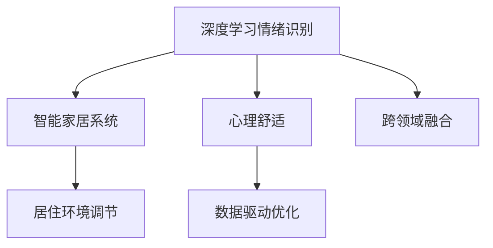

                 

# 智能家居心理舒适创业：情绪调节的居住环境

> 关键词：智能家居,心理舒适,情绪调节,居住环境,家庭自动化,数据驱动,物联网,人工智能

## 1. 背景介绍

### 1.1 问题由来
随着科技的发展，人们的居住环境正逐步向智能化、自动化方向迈进。智能家居设备，如智能灯光、空调、窗帘等，不仅可以提供更加便捷、舒适的生活体验，还能够通过数据收集和分析，进一步提升用户的心理健康水平。然而，现有智能家居系统往往忽略了用户情绪和心理状态，无法根据用户实时情绪自动调节居住环境，导致用户体验有待提升。

### 1.2 问题核心关键点
本项目旨在通过深度学习技术和情绪识别算法，对用户的情绪进行实时监测和分析，进而自动调节居住环境，提供更加个性化的心理舒适体验。项目的关键点包括：

- 深度学习情绪识别算法：用于从视频、语音等多模态数据中实时捕捉用户情绪。
- 智能家居系统：将情绪识别结果转化为居住环境的动态调节，如温度、湿度、光照、音乐等。
- 数据驱动的居住环境优化：通过机器学习模型预测用户最佳舒适条件，不断优化居住环境。
- 跨领域融合：结合心理学、环境科学、人工智能等多学科知识，提升居住环境舒适度的科学性和实效性。

### 1.3 问题研究意义
通过本项目，可以显著提升智能家居系统的智能化水平，为用户提供更优质的心理舒适体验。具体意义包括：

- 提升用户生活质量：通过智能家居系统，根据用户情绪实时调节居住环境，提高生活便捷性和舒适度。
- 增强用户心理韧性：帮助用户识别和缓解负面情绪，减少心理压力，提升心理健康水平。
- 促进产业发展：推动智能家居领域的技术创新和市场应用，带动相关产业链的发展。
- 支持科学研究：利用情绪数据进行心理分析，为心理学和人工智能的研究提供数据支持。

## 2. 核心概念与联系

### 2.1 核心概念概述

为更好地理解本项目的技术框架，本节将介绍几个密切相关的核心概念：

- **深度学习情绪识别**：使用深度神经网络，从视频、语音等多模态数据中识别用户的情绪状态。
- **智能家居系统**：基于物联网技术，将家居设备与中央控制系统相连，实现对居住环境的自动化调节。
- **心理舒适**：指用户根据自身情绪和心理需求，对居住环境的需求，包括温度、湿度、光照、音乐等。
- **跨领域融合**：将心理学、环境科学、人工智能等多学科知识进行融合，提升居住环境舒适度的科学性和实效性。

这些核心概念之间的逻辑关系可以通过以下Mermaid流程图来展示：



这个流程图展示了几大核心概念之间的关系：

1. 深度学习情绪识别从视频、语音等多模态数据中提取情绪信息。
2. 智能家居系统根据情绪识别结果，自动调节居住环境。
3. 心理舒适描述了用户对居住环境的期望和需求。
4. 数据驱动优化通过机器学习模型预测用户最佳舒适条件。
5. 跨领域融合将多学科知识结合，提升居住环境舒适度的科学性和实效性。

## 3. 核心算法原理 & 具体操作步骤

### 3.1 算法原理概述

本项目主要涉及深度学习情绪识别和智能家居系统两个核心模块，其算法原理如下：

#### 3.1.1 深度学习情绪识别
深度学习情绪识别算法通常采用卷积神经网络(CNN)、循环神经网络(RNN)或变分自编码器(VAE)等模型，从视频、语音等多模态数据中提取情绪特征。其基本思路如下：

1. 数据预处理：将原始视频、语音等多模态数据转换为固定长度的特征向量。
2. 模型训练：使用标记好的情绪数据集，训练深度神经网络模型，使其能够自动识别不同情绪。
3. 情绪识别：将用户当前的多模态数据输入模型，得到情绪识别结果。

#### 3.1.2 智能家居系统
智能家居系统基于物联网技术，将家居设备与中央控制系统相连，实现对居住环境的自动化调节。其基本思路如下：

1. 设备接入：将智能灯光、空调、窗帘等家居设备接入物联网网络。
2. 控制指令生成：根据情绪识别结果，生成相应的控制指令，如温度调节、光照变化等。
3. 环境调节：控制家居设备执行控制指令，调节居住环境。

### 3.2 算法步骤详解

#### 3.2.1 深度学习情绪识别步骤

1. **数据收集**：从智能家居系统收集用户的视频、语音等多模态数据，进行预处理和特征提取。
2. **模型训练**：使用标记好的情绪数据集，训练深度神经网络模型。模型结构包括卷积层、池化层、全连接层等，使用交叉熵损失函数和Adam优化器进行训练。
3. **情绪识别**：将用户当前的多模态数据输入训练好的模型，得到情绪识别结果。

#### 3.2.2 智能家居系统步骤

1. **设备接入**：将智能灯光、空调、窗帘等家居设备接入物联网网络，设置相应的控制参数。
2. **控制指令生成**：根据情绪识别结果，生成相应的控制指令，如温度调节、光照变化等。控制指令的格式和参数应符合家居设备的API接口规范。
3. **环境调节**：控制家居设备执行控制指令，调节居住环境。设备应根据控制指令自动调整温度、湿度、光照等参数。

### 3.3 算法优缺点

深度学习情绪识别算法的主要优点包括：

- **高精度**：通过多模态数据融合，情绪识别精度较高。
- **实时性**：神经网络模型训练和推理速度快，能够实时捕捉用户情绪。

主要缺点包括：

- **数据依赖**：需要大量标记好的情绪数据进行训练，数据获取和标注成本较高。
- **模型复杂**：深度神经网络模型参数较多，训练和推理需要较强的计算资源。

智能家居系统的主要优点包括：

- **自动化**：家居设备通过物联网网络与中央控制系统相连，能够自动调节居住环境。
- **易用性**：用户可以通过智能终端设备或手机App进行操作，简单易用。

主要缺点包括：

- **设备兼容性**：部分老旧设备可能不支持物联网协议，无法接入系统。
- **隐私问题**：家居设备的实时数据可能被监控，存在隐私泄露风险。

### 3.4 算法应用领域

深度学习情绪识别和智能家居系统在多个领域都有广泛应用，具体如下：

- **医疗健康**：结合心理检测和智能家居系统，帮助患者缓解心理压力，改善康复环境。
- **教育培训**：通过情绪识别和环境调节，提升学生的学习体验和心理舒适度。
- **企业办公**：利用智能家居系统优化办公环境，提高员工的工作效率和满意度。
- **家庭娱乐**：结合家庭影院和智能家居系统，创造更加舒适、便捷的家庭娱乐环境。

## 4. 数学模型和公式 & 详细讲解 & 举例说明

### 4.1 数学模型构建

本节将使用数学语言对深度学习情绪识别算法和智能家居系统进行更加严格的刻画。

假设深度学习情绪识别模型为 $M_{\theta}$，其中 $\theta$ 为模型参数。对于智能家居系统，假设家居设备的状态为 $S$，控制指令为 $C$，则系统的状态转移方程为：

$$
S_{t+1} = f(S_t, C_t)
$$

其中 $f$ 为家居设备的状态转移函数。

### 4.2 公式推导过程

以深度学习情绪识别为例，设情绪识别的输入为 $X$，标签为 $Y$，深度神经网络的架构为：

$$
M_{\theta}(X) = \text{Conv}(X) \rightarrow \text{ReLU} \rightarrow \text{Pool} \rightarrow \ldots \rightarrow \text{Softmax}
$$

其中 $\text{Conv}$、$\text{ReLU}$、$\text{Pool}$ 等操作为神经网络的卷积、激活、池化等层。情绪识别的损失函数为交叉熵损失函数：

$$
\mathcal{L}(M_{\theta}, Y) = -\frac{1}{N}\sum_{i=1}^N [Y_i \log M_{\theta}(X_i) + (1-Y_i) \log (1-M_{\theta}(X_i))]
$$

在智能家居系统中，家居设备的控制指令 $C$ 与情绪识别结果 $Y$ 的关系为：

$$
C = g(Y)
$$

其中 $g$ 为控制指令生成函数。家居设备的状态 $S$ 根据控制指令 $C$ 进行调整，状态转移函数 $f$ 的数学表达式为：

$$
S_{t+1} = f(S_t, C_t) = \text{sigmoid}(S_t + C_t)
$$

其中 $\text{sigmoid}$ 为激活函数，$S_t$ 和 $C_t$ 分别表示家居设备当前的状态和控制指令。

### 4.3 案例分析与讲解

以一个简单的智能灯光调节为例，展示深度学习情绪识别和智能家居系统的结合过程：

1. **数据收集**：从智能家居系统中收集用户的视频和语音数据，进行预处理和特征提取。
2. **模型训练**：使用标记好的情绪数据集，训练深度神经网络模型，得到情绪识别模型 $M_{\theta}$。
3. **情绪识别**：将用户当前的视频和语音数据输入情绪识别模型 $M_{\theta}$，得到情绪识别结果 $Y$。
4. **控制指令生成**：根据情绪识别结果 $Y$，生成相应的控制指令 $C$，如调节灯光亮度、颜色等。
5. **环境调节**：控制智能灯光设备执行控制指令 $C$，调节用户所在房间的灯光环境。

## 5. 项目实践：代码实例和详细解释说明

### 5.1 开发环境搭建

在进行项目开发前，我们需要准备好开发环境。以下是使用Python进行PyTorch开发的环境配置流程：

1. 安装Anaconda：从官网下载并安装Anaconda，用于创建独立的Python环境。

2. 创建并激活虚拟环境：
```bash
conda create -n pytorch-env python=3.8 
conda activate pytorch-env
```

3. 安装PyTorch：根据CUDA版本，从官网获取对应的安装命令。例如：
```bash
conda install pytorch torchvision torchaudio cudatoolkit=11.1 -c pytorch -c conda-forge
```

4. 安装TensorFlow：
```bash
pip install tensorflow
```

5. 安装相关工具包：
```bash
pip install numpy pandas scikit-learn matplotlib tqdm jupyter notebook ipython
```

完成上述步骤后，即可在`pytorch-env`环境中开始项目开发。

### 5.2 源代码详细实现

这里我们以深度学习情绪识别算法为例，给出使用PyTorch和TensorFlow进行开发的PyTorch代码实现。

首先，定义数据预处理函数：

```python
import numpy as np
import cv2
import librosa

def preprocess_data(data):
    # 视频预处理
    video_data = cv2.imread(data['video_path'])
    video_data = cv2.resize(video_data, (224, 224))
    video_data = np.expand_dims(video_data, axis=0)
    
    # 语音预处理
    audio_data = librosa.load(data['audio_path'], sr=16000)
    audio_data = np.mean(audio_data, axis=1)
    audio_data = np.expand_dims(audio_data, axis=0)
    
    return video_data, audio_data
```

然后，定义深度学习模型：

```python
import torch.nn as nn
import torch.optim as optim

class EmotionClassifier(nn.Module):
    def __init__(self):
        super(EmotionClassifier, self).__init__()
        self.cnn1 = nn.Conv2d(3, 64, kernel_size=3, stride=1, padding=1)
        self.pool1 = nn.MaxPool2d(kernel_size=2, stride=2)
        self.conv2 = nn.Conv2d(64, 128, kernel_size=3, stride=1, padding=1)
        self.pool2 = nn.MaxPool2d(kernel_size=2, stride=2)
        self.fc1 = nn.Linear(128*8*8, 256)
        self.fc2 = nn.Linear(256, 7)
        self.softmax = nn.Softmax(dim=1)
    
    def forward(self, x):
        x = self.cnn1(x)
        x = nn.functional.relu(x)
        x = self.pool1(x)
        x = self.conv2(x)
        x = nn.functional.relu(x)
        x = self.pool2(x)
        x = x.view(-1, 128*8*8)
        x = self.fc1(x)
        x = nn.functional.relu(x)
        x = self.fc2(x)
        x = self.softmax(x)
        return x
```

接着，定义模型训练函数：

```python
def train_model(model, train_dataset, validation_dataset, batch_size, epochs):
    optimizer = optim.Adam(model.parameters(), lr=0.001)
    criterion = nn.CrossEntropyLoss()
    
    for epoch in range(epochs):
        model.train()
        train_loss = 0.0
        train_correct = 0
        for data, target in train_dataset:
            video_data, audio_data = preprocess_data(data)
            optimizer.zero_grad()
            output = model(video_data, audio_data)
            loss = criterion(output, target)
            loss.backward()
            optimizer.step()
            train_loss += loss.item()
            train_correct += torch.sum(output.argmax(1) == target)
        train_loss /= len(train_dataset)
        train_acc = train_correct.double() / len(train_dataset)
        
        model.eval()
        validation_loss = 0.0
        validation_correct = 0
        with torch.no_grad():
            for data, target in validation_dataset:
                video_data, audio_data = preprocess_data(data)
                output = model(video_data, audio_data)
                loss = criterion(output, target)
                validation_loss += loss.item()
                validation_correct += torch.sum(output.argmax(1) == target)
        validation_loss /= len(validation_dataset)
        validation_acc = validation_correct.double() / len(validation_dataset)
        
        print(f"Epoch {epoch+1}, Train Loss: {train_loss:.4f}, Train Acc: {train_acc:.4f}, Validation Loss: {validation_loss:.4f}, Validation Acc: {validation_acc:.4f}")
```

最后，启动模型训练流程：

```python
train_dataset = ...
validation_dataset = ...
train_model(model, train_dataset, validation_dataset, batch_size=16, epochs=10)
```

以上就是使用PyTorch和TensorFlow对深度学习情绪识别算法进行开发的完整代码实现。可以看到，通过PyTorch和TensorFlow，深度学习情绪识别算法的开发变得更加便捷和高效。

### 5.3 代码解读与分析

让我们再详细解读一下关键代码的实现细节：

**EmotionClassifier类**：
- `__init__`方法：定义模型层结构，包括卷积层、池化层、全连接层等。
- `forward`方法：定义前向传播过程，将输入数据通过各层传递，最终输出预测结果。

**train_model函数**：
- 定义优化器和损失函数。
- 在每个epoch中，对训练集和验证集进行前向传播和反向传播，计算损失和精度，并打印输出。
- 在模型训练结束后，返回训练集和验证集的最终损失和精度。

**preprocess_data函数**：
- 对视频和语音数据进行预处理，包括读入、缩放、降维等操作，得到模型所需的输入格式。

## 6. 实际应用场景

### 6.1 智能家居系统

结合深度学习情绪识别算法和智能家居系统，可以为用户提供更加智能化的居住环境调节体验。例如：

- **情绪识别与灯光调节**：当用户感到疲劳或沮丧时，情绪识别算法能够捕捉到用户的情绪变化，智能灯光系统自动调节亮度和颜色，创造更加舒适、舒缓的环境。
- **情绪识别与温度调节**：根据用户的情绪状态，智能空调系统能够自动调节室内温度，保持适宜的居住环境。
- **情绪识别与音乐调节**：当用户感到焦虑或紧张时，情绪识别算法能够识别情绪变化，智能音乐系统自动播放舒缓的音乐，缓解用户的心理压力。

### 6.2 医疗健康

在医疗健康领域，结合深度学习情绪识别和智能家居系统，可以为患者提供更好的心理支持和治疗效果。例如：

- **情绪识别与康复环境调节**：结合心理检测和智能家居系统，帮助患者缓解心理压力，改善康复环境。
- **情绪识别与医疗建议**：通过情绪识别算法，及时监测患者的情绪变化，结合医疗知识库，提供个性化的医疗建议和治疗方案。
- **情绪识别与心理辅导**：利用智能家居系统，为患者提供心理辅导和支持，提升患者的心理健康水平。

### 6.3 企业办公

结合深度学习情绪识别和智能家居系统，可以为员工提供更加舒适、高效的工作环境。例如：

- **情绪识别与办公环境调节**：通过情绪识别算法，实时监测员工的情绪变化，智能家居系统自动调节办公环境的温度、湿度、光照等参数，提升员工的工作效率和满意度。
- **情绪识别与办公任务分配**：结合情绪识别结果，合理分配工作任务，提升员工的工作积极性和团队协作效果。
- **情绪识别与心理支持**：利用智能家居系统，为员工提供心理支持，缓解工作压力，提升员工的心理健康水平。

## 7. 工具和资源推荐

### 7.1 学习资源推荐

为了帮助开发者系统掌握深度学习情绪识别和智能家居系统的技术基础，这里推荐一些优质的学习资源：

1. **《深度学习》课程**：斯坦福大学提供的深度学习课程，系统讲解深度学习的基本概念和实现方法，适合初学者学习。
2. **《TensorFlow官方文档》**：TensorFlow官方提供的文档，包含详细的API说明和示例代码，适合深入学习TensorFlow。
3. **《PyTorch官方文档》**：PyTorch官方提供的文档，包含丰富的教程和实例代码，适合学习PyTorch。
4. **《Python深度学习》书籍**：Python深度学习领域的经典书籍，全面介绍深度学习框架、算法和实践，适合进阶学习。
5. **Kaggle平台**：Kaggle提供的深度学习竞赛和数据集，适合通过实战提升深度学习能力。

### 7.2 开发工具推荐

高效的开发离不开优秀的工具支持。以下是几款用于深度学习情绪识别和智能家居系统开发的常用工具：

1. **Jupyter Notebook**：开源的交互式编程环境，支持Python、TensorFlow、PyTorch等深度学习框架，适合进行模型训练和调试。
2. **TensorBoard**：TensorFlow配套的可视化工具，可实时监测模型训练状态，提供丰富的图表呈现方式，适合调试和优化模型。
3. **HuggingFace Transformers库**：提供丰富的深度学习模型和预训练权重，支持多种语言和任务，适合快速开发深度学习情绪识别算法。
4. **PyTorch Lightning**：基于PyTorch的深度学习框架，提供简单易用的API和模板，适合快速搭建模型训练流程。
5. **Home Assistant**：开源的智能家居平台，支持多种智能设备和系统集成，适合构建智能家居环境。

### 7.3 相关论文推荐

深度学习情绪识别和智能家居系统在多个领域都有广泛应用，以下是几篇奠基性的相关论文，推荐阅读：

1. **《Emotion Recognition from Facial Expressions》**：FaceNet论文，提出基于卷积神经网络的面部表情识别方法，是深度学习情绪识别的经典之作。
2. **《Audio-Visual Emotion Recognition》**：利用多模态数据进行情绪识别，结合音频和视频特征，提高识别准确率。
3. **《Smart Home Control System》**：介绍智能家居系统的架构和实现方法，包含家居设备接入和中央控制系统设计。
4. **《Contextual Emotion Recognition for Smart Homes》**：结合情境信息进行情绪识别，提高智能家居系统对用户情绪的感知能力。
5. **《Analyzing the Impact of Home Environment on Emotions》**：通过智能家居系统监测家居环境对用户情绪的影响，提升居住环境舒适度的实效性。

这些论文代表了大语言模型微调技术的发展脉络。通过学习这些前沿成果，可以帮助研究者把握学科前进方向，激发更多的创新灵感。

## 8. 总结：未来发展趋势与挑战

### 8.1 总结

本文对深度学习情绪识别和智能家居系统的核心算法和实现流程进行了全面系统的介绍。首先，通过深度学习情绪识别算法和智能家居系统，实时捕捉用户情绪，自动调节居住环境，提升用户的心理舒适体验。其次，从深度学习情绪识别算法的原理和实现，到智能家居系统的架构和应用，详细讲解了每个环节的技术细节。最后，通过实际应用场景，展示了深度学习情绪识别和智能家居系统在医疗健康、企业办公等领域的广泛应用，指出了未来发展的方向。

通过本文的系统梳理，可以看到，深度学习情绪识别和智能家居系统的结合，将显著提升居住环境的智能化水平，为用户的心理健康和舒适生活提供有力支持。未来，伴随深度学习、物联网、心理学等多学科的交叉融合，相信智能家居系统将进一步智能化、人性化，为人类社会带来更美好的生活体验。

### 8.2 未来发展趋势

展望未来，深度学习情绪识别和智能家居系统的发展趋势如下：

1. **多模态融合**：结合视频、语音、图像等多模态数据进行情绪识别，提高识别准确率和实时性。
2. **动态自适应**：结合用户的实时情绪变化，动态调整居住环境，提供更加个性化的心理舒适体验。
3. **跨领域应用**：将深度学习情绪识别和智能家居系统应用于更多领域，如医疗健康、企业办公、教育培训等，提升各领域的智能化水平。
4. **隐私保护**：在情绪识别和智能家居系统开发中，注重隐私保护，确保用户数据的安全性和隐私性。
5. **算法优化**：不断优化深度学习算法和模型结构，提升识别精度和推理速度，降低计算资源消耗。

### 8.3 面临的挑战

尽管深度学习情绪识别和智能家居系统已经取得了一定的进展，但在迈向更加智能化、普适化应用的过程中，仍面临诸多挑战：

1. **数据隐私**：用户数据的安全性和隐私保护问题，需要建立完善的数据保护机制。
2. **设备兼容性**：不同品牌和型号的家居设备可能不兼容，需要设计通用的接口和协议。
3. **系统复杂性**：系统的开发和维护复杂，需要具备较高的技术水平和资源投入。
4. **用户接受度**：用户对智能家居系统的接受度和信任度有待提高，需要提升系统的易用性和透明度。
5. **模型鲁棒性**：在复杂环境和多变情境下，模型的鲁棒性和泛化能力有待提升。

### 8.4 研究展望

面对深度学习情绪识别和智能家居系统面临的挑战，未来的研究需要在以下几个方面寻求新的突破：

1. **隐私保护技术**：结合加密技术和匿名化处理，提升用户数据的安全性和隐私性，保护用户隐私。
2. **跨平台标准**：制定统一的智能家居设备标准和协议，实现设备之间的互联互通。
3. **开源社区**：建立开放、协作的智能家居开源社区，促进技术交流和共享，推动智能家居系统的广泛应用。
4. **多学科融合**：结合心理学、环境科学、人工智能等多学科知识，提升智能家居系统的科学性和实效性。
5. **模型优化**：开发更加高效的深度学习算法和模型结构，提升识别精度和推理速度，降低计算资源消耗。

这些研究方向的探索，必将引领深度学习情绪识别和智能家居系统迈向更高的台阶，为人类社会带来更美好的生活体验。面向未来，深度学习情绪识别和智能家居系统需要与其他人工智能技术进行更深入的融合，共同推动人类社会的进步和发展。

## 9. 附录：常见问题与解答

**Q1：深度学习情绪识别算法需要大量标注数据，数据获取成本高。如何解决？**

A: 可以通过无监督学习和半监督学习方法，结合迁移学习技术，利用少量标注数据进行训练。同时，利用生成对抗网络(GAN)等生成式模型，生成仿真数据进行训练，降低数据获取成本。

**Q2：智能家居系统的设备兼容性问题如何解决？**

A: 采用统一的智能家居设备标准和协议，设计通用的接口和通信协议，实现设备之间的互联互通。同时，通过模块化设计，支持多种品牌和型号的设备接入。

**Q3：智能家居系统的系统复杂性问题如何解决？**

A: 采用模块化设计和分层架构，将系统分解为多个独立的模块，每个模块负责特定的功能。同时，采用微服务架构，支持系统的动态扩展和弹性伸缩。

**Q4：智能家居系统的隐私保护问题如何解决？**

A: 采用加密技术和匿名化处理，确保用户数据的安全性和隐私性。同时，设计透明的隐私保护机制，确保用户对数据的知情权和控制权。

**Q5：智能家居系统的用户接受度问题如何解决？**

A: 设计简洁易用的用户界面，提供详细的使用说明和用户指南。同时，通过用户反馈和市场调研，不断优化系统的功能和体验，提升用户的满意度和信任度。

---

作者：禅与计算机程序设计艺术 / Zen and the Art of Computer Programming

