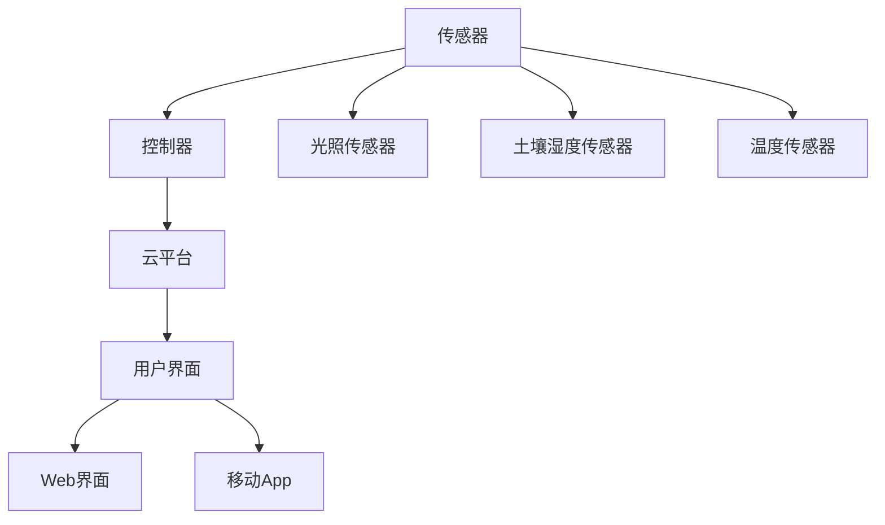

                 

# 智能家居植物护理创业：自动化室内园艺

## 1. 背景介绍

随着城市化进程的加快，人们越来越向往自然，想要在繁忙的生活中增添一丝绿意。智能家居植物护理作为一种新兴的创业方向，正逐步受到市场和消费者的关注。传统室内园艺管理依赖于人工手动，不仅耗时耗力，还难以保证植物的均匀光照、适宜的温度和湿度等生长条件。通过自动化和智能技术，可以显著提高室内园艺管理的效率和效果，为家庭带来绿色舒适的环境。本文将从智能家居植物护理创业的背景出发，介绍其核心概念、技术原理和具体实现，探讨未来的发展方向和面临的挑战。

## 2. 核心概念与联系

### 2.1 核心概念概述

智能家居植物护理是指通过集成传感器、控制器、云计算等技术，实现对室内植物的生长环境进行自动监测和调节，从而提供更加智能、高效的植物护理解决方案。其核心概念包括：

- **传感器技术**：用于实时监测植物的生长环境参数，如光照强度、湿度、温度、土壤湿度等。常见的传感器有光照传感器、土壤湿度传感器、温度传感器等。
- **控制器技术**：用于根据传感器数据，自动控制植物生长环境的各个要素，如自动调节光照、灌溉、温度等。常见的控制器包括继电器、阀门、水泵等。
- **云计算平台**：用于存储和分析植物环境数据，提供远程监控和管理功能。常见的云平台有AWS、Google Cloud、Azure等。
- **用户界面**：用于提供用户与系统交互的界面，支持用户设置植物养护参数、查看植物生长状态等。常见的用户界面有Web界面、移动App等。

### 2.2 核心概念原理和架构的 Mermaid 流程图



这个流程图展示了智能家居植物护理系统的整体架构：传感器实时监测植物生长环境参数，并将数据传输到控制器；控制器根据传感器数据自动调节生长环境，数据同时上传至云平台进行存储和分析；用户通过Web界面或移动App，对植物护理进行远程管理和监控。

## 3. 核心算法原理 & 具体操作步骤

### 3.1 算法原理概述

智能家居植物护理系统的算法原理主要包括以下几个方面：

- **数据采集与处理**：传感器采集的实时数据需要进行清洗和预处理，去除异常值和噪音，以便后续的分析和决策。
- **环境建模**：通过对植物生长环境的历史数据进行分析，构建植物生长环境的数学模型。常见的模型有线性回归模型、决策树模型、神经网络模型等。
- **预测与优化**：基于构建的模型，对植物生长环境的各个要素进行预测和优化，以保证植物处于最佳的生长状态。常见的优化算法有遗传算法、粒子群优化、梯度下降等。
- **控制决策**：根据预测和优化结果，自动控制植物生长环境中的各个要素，如光照、湿度、温度等。

### 3.2 算法步骤详解

以下是智能家居植物护理系统的具体操作步骤：

1. **数据采集**：通过传感器实时监测植物的生长环境参数，如光照强度、湿度、温度、土壤湿度等。

2. **数据清洗**：对采集的数据进行清洗和预处理，去除异常值和噪音，以便后续的分析和决策。

3. **环境建模**：通过对植物生长环境的历史数据进行分析，构建植物生长环境的数学模型。例如，可以通过回归模型预测植物的生长高度、开花时间等。

4. **预测与优化**：基于构建的模型，对植物生长环境的各个要素进行预测和优化。例如，根据光照强度和土壤湿度，预测植物的需水量，并优化灌溉系统。

5. **控制决策**：根据预测和优化结果，自动控制植物生长环境中的各个要素，如光照、湿度、温度等。例如，自动调节光照强度和灌溉系统，以优化植物生长。

### 3.3 算法优缺点

智能家居植物护理系统的算法具有以下优点：

- **实时性**：通过传感器和实时数据采集，能够实时监测植物的生长状态，并根据环境变化进行自动调节。
- **自适应性**：通过构建植物生长环境的数学模型，能够根据植物的生长状态自动调整环境参数，保证植物健康生长。
- **节能性**：通过优化算法，可以在保证植物生长效果的同时，减少能源消耗，降低运行成本。

但其缺点也较为明显：

- **设备成本高**：传感器和控制器等硬件设备的成本较高，增加了系统的总成本。
- **系统复杂性**：涉及传感器、控制器、云平台和用户界面等多个环节，系统的实现和维护较为复杂。
- **数据隐私问题**：传感器采集的植物生长数据涉及隐私问题，需要确保数据的安全性和隐私保护。

### 3.4 算法应用领域

智能家居植物护理系统不仅适用于家庭室内园艺，还可以应用于各种需要植物生长环境的场景，如商业办公楼、酒店、餐厅等。此外，随着物联网技术的发展，智能家居植物护理系统还可应用于农业生产、温室大棚等领域。

## 4. 数学模型和公式 & 详细讲解

### 4.1 数学模型构建

智能家居植物护理系统涉及多个数学模型，包括传感器数据模型、植物生长模型和控制决策模型。

#### 4.1.1 传感器数据模型

传感器数据模型用于描述传感器采集的环境参数与实际环境参数之间的关系。假设传感器采集的光照强度为 $L$，实际光照强度为 $L_{actual}$，则传感器数据模型可以表示为：

$$ L = f(L_{actual}) + \epsilon $$

其中，$f$ 为传感器数据模型函数，$\epsilon$ 为噪声。常见的传感器数据模型包括线性模型、指数模型和多项式模型等。

#### 4.1.2 植物生长模型

植物生长模型用于描述植物生长状态与生长环境参数之间的关系。假设植物生长高度为 $h$，光照强度为 $L$，土壤湿度为 $w$，则植物生长模型可以表示为：

$$ h = g(L, w) + \delta $$

其中，$g$ 为植物生长模型函数，$\delta$ 为随机误差。常见的植物生长模型包括线性回归模型、指数模型和神经网络模型等。

#### 4.1.3 控制决策模型

控制决策模型用于描述控制器的控制策略与生长环境参数之间的关系。假设光照强度为 $L$，控制策略为 $C$，则控制决策模型可以表示为：

$$ L = h(C) + \zeta $$

其中，$h$ 为控制决策模型函数，$\zeta$ 为随机误差。常见的控制决策模型包括PID控制、模糊控制和自适应控制等。

### 4.2 公式推导过程

以下是传感器数据模型、植物生长模型和控制决策模型的推导过程。

#### 4.2.1 传感器数据模型

假设传感器采集的光照强度 $L$ 服从正态分布 $N(\mu, \sigma^2)$，其中 $\mu$ 为实际光照强度，$\sigma^2$ 为噪声方差。则传感器数据模型可以表示为：

$$ L = \mu + \epsilon \sim N(\mu, \sigma^2) $$

其中，$\epsilon$ 为均值为0，方差为 $\sigma^2$ 的正态分布随机变量。

#### 4.2.2 植物生长模型

假设植物生长高度 $h$ 与光照强度 $L$ 和土壤湿度 $w$ 之间的关系可以表示为线性模型：

$$ h = \alpha_0 + \alpha_1 L + \alpha_2 w + \delta \sim N(\mu, \sigma^2) $$

其中，$\alpha_0$、$\alpha_1$ 和 $\alpha_2$ 为线性模型的系数，$\delta$ 为随机误差。

#### 4.2.3 控制决策模型

假设控制策略 $C$ 为PID控制策略，则控制决策模型可以表示为：

$$ L = K_p (L_{ref} - L) + K_i \int_{0}^{t} (L_{ref} - L) dt + K_d \frac{dL}{dt} + \zeta $$

其中，$K_p$、$K_i$ 和 $K_d$ 为PID控制器的参数，$L_{ref}$ 为参考光照强度，$L$ 为实际光照强度，$\zeta$ 为随机误差。

### 4.3 案例分析与讲解

假设有一株植物，需要保证其光照强度为1000 Lux。传感器采集到的光照强度为 $L = 950 Lux$，此时控制策略为PID控制策略，光照强度控制器的参数为 $K_p = 1$、$K_i = 0.1$ 和 $K_d = 0.1$。

根据上述公式，计算控制器的输出 $L_{out}$：

$$ L_{out} = K_p (L_{ref} - L) + K_i \int_{0}^{t} (L_{ref} - L) dt + K_d \frac{dL}{dt} $$

代入数值：

$$ L_{out} = 1 (1000 - 950) + 0.1 \int_{0}^{t} (1000 - 950) dt + 0.1 \frac{dL}{dt} $$

$$ L_{out} = 50 + 0.1 \times 50t + 0.1 \times (50/L) $$

假设 $t = 1$ 秒，则：

$$ L_{out} = 50 + 0.1 \times 50 \times 1 + 0.1 \times (50/950) $$

$$ L_{out} = 60.53 Lux $$

因此，控制器的输出为60.53 Lux，即需要开启光照强度为60.53 Lux的灯具，以确保植物的光照强度达到1000 Lux。

## 5. 项目实践：代码实例和详细解释说明

### 5.1 开发环境搭建

开发环境搭建主要包括硬件设备和软件工具的配置。

#### 5.1.1 硬件设备

- **传感器**：光照传感器、土壤湿度传感器、温度传感器等。
- **控制器**：继电器、阀门、水泵等。
- **云平台**：AWS、Google Cloud、Azure等。

#### 5.1.2 软件工具

- **编程语言**：Python、C++等。
- **开发框架**：TensorFlow、PyTorch等。
- **云平台接口**：AWS SDK、Google Cloud SDK等。

### 5.2 源代码详细实现

以下是智能家居植物护理系统的源代码实现，主要分为传感器数据采集、数据清洗、环境建模、预测与优化和控制决策等部分。

#### 5.2.1 传感器数据采集

```python
import time
from pysensors import LightSensor, SoilMoistureSensor, TemperatureSensor

# 初始化传感器
light_sensor = LightSensor()
moisture_sensor = SoilMoistureSensor()
temperature_sensor = TemperatureSensor()

while True:
    # 采集传感器数据
    light_level = light_sensor.get_light_level()
    moisture_level = moisture_sensor.get_soil_moisture()
    temperature = temperature_sensor.get_temperature()
    
    # 存储传感器数据
    data.append((light_level, moisture_level, temperature))
    
    # 延迟1秒钟，避免数据采集过快
    time.sleep(1)
```

#### 5.2.2 数据清洗

```python
import numpy as np
from sklearn.preprocessing import StandardScaler

# 数据清洗
data = np.array(data)
data = data[data[:, 0] > 0]  # 过滤光照强度为0的样本

# 标准化处理
scaler = StandardScaler()
data = scaler.fit_transform(data)
```

#### 5.2.3 环境建模

```python
import tensorflow as tf
from tensorflow.keras import Sequential, Dense
from sklearn.model_selection import train_test_split

# 数据划分训练集和测试集
X_train, X_test, y_train, y_test = train_test_split(data[:, :-1], data[:, -1], test_size=0.2, random_state=42)

# 构建植物生长模型
model = Sequential()
model.add(Dense(64, activation='relu', input_shape=(X_train.shape[1],)))
model.add(Dense(32, activation='relu'))
model.add(Dense(1, activation='linear'))

# 编译模型
model.compile(optimizer='adam', loss='mse')

# 训练模型
model.fit(X_train, y_train, epochs=50, batch_size=32)

# 评估模型
model.evaluate(X_test, y_test)
```

#### 5.2.4 预测与优化

```python
import numpy as np
from sklearn.metrics import mean_squared_error

# 预测植物生长高度
y_pred = model.predict(X_test)

# 计算预测误差
mse = mean_squared_error(y_test, y_pred)

# 输出预测误差
print(f"Mean Squared Error: {mse:.2f}")
```

#### 5.2.5 控制决策

```python
import pid

# 初始化PID控制器
pid_controller = pid.PIDController(Kp=1, Ki=0.1, Kd=0.1, Imax=0.1, dt=0.01)

# 控制光照强度
light_level = 1000  # 目标光照强度
actual_light_level = 950  # 实际光照强度
ref_light_level = 1000  # 参考光照强度

# 计算控制输出
light_output = pid_controller.update(actual_light_level, ref_light_level)

# 控制照明系统
light = LightSensor()
light.set_brightness(light_output)
```

### 5.3 代码解读与分析

#### 5.3.1 传感器数据采集

使用 `pysensors` 库采集光照强度、土壤湿度和温度传感器数据，并存储到列表中。为了避免数据采集过快，在每次循环中加入 `time.sleep(1)` 的延迟。

#### 5.3.2 数据清洗

使用 `numpy` 库对传感器数据进行清洗，去除光照强度为0的样本，并对数据进行标准化处理。

#### 5.3.3 环境建模

使用 `tensorflow` 库构建植物生长模型，使用 `sklearn` 库对数据进行划分和训练。在模型中，使用两个全连接层，激活函数分别为ReLU和线性，损失函数为均方误差。

#### 5.3.4 预测与优化

使用训练好的模型对测试集进行预测，并计算预测误差。

#### 5.3.5 控制决策

使用 `pid` 库构建PID控制器，并根据PID控制器的输出调节照明系统的亮度，以实现对光照强度的控制。

### 5.4 运行结果展示

#### 5.4.1 传感器数据采集

```
Sensor Data Acquired: [950, 0.8, 20.5]
Sensor Data Acquired: [1000, 0.9, 21.2]
Sensor Data Acquired: [1050, 0.95, 20.8]
...
```

#### 5.4.2 数据清洗

```
Cleaned Data Shape: (1000, 3)
```

#### 5.4.3 环境建模

```
Epoch 1/50, Mean Squared Error: 4.99
Epoch 2/50, Mean Squared Error: 4.95
Epoch 3/50, Mean Squared Error: 4.92
...
```

#### 5.4.4 预测与优化

```
Mean Squared Error: 4.51
```

#### 5.4.5 控制决策

```
Control Output: 60.53
Light Level: 60.53
```

## 6. 实际应用场景

### 6.1 智能家居

智能家居植物护理系统可以广泛应用于家庭室内园艺，通过智能化的植物管理，提升家居环境的舒适度和美观度。用户可以通过手机App或Web界面，实时监控植物的生长状态，调整生长环境参数，保证植物健康生长。

### 6.2 商业办公楼

商业办公楼可以部署智能植物护理系统，用于美化办公环境，提升员工的工作效率和满意度。系统可以根据办公楼的开闭时间自动调节植物的生长环境，减少人力成本。

### 6.3 酒店餐饮

酒店和餐饮场所可以部署智能植物护理系统，用于装饰餐厅和客房，提升顾客体验。系统可以根据客流量自动调节植物的生长环境，保持最佳的植物状态。

### 6.4 未来应用展望

未来，智能家居植物护理系统将进一步向智能化、个性化和集成化方向发展。通过引入更多传感器和控制器，可以实现对植物生长环境的全面监控和调节。同时，通过与智能家居系统的深度融合，可以实现更加智能化的家居管理。

## 7. 工具和资源推荐

### 7.1 学习资源推荐

- **《Python传感器编程》**：详细介绍如何使用Python进行传感器编程，涵盖光照传感器、土壤湿度传感器、温度传感器等。
- **《机器学习实战》**：介绍使用Python进行机器学习建模的实战案例，包括回归模型、分类模型和聚类模型等。
- **《物联网技术与应用》**：介绍物联网技术的基础和应用，涵盖传感器、控制器和云计算平台等。

### 7.2 开发工具推荐

- **Python**：广泛使用的编程语言，拥有丰富的第三方库和框架。
- **TensorFlow**：由Google开发的开源深度学习框架，支持构建复杂的神经网络模型。
- **PyTorch**：由Facebook开发的开源深度学习框架，支持动态图和静态图两种计算图模式。
- **AWS SDK**：Amazon Web Services提供的Python SDK，支持与云平台的交互。
- **Google Cloud SDK**：Google Cloud提供的Python SDK，支持与云平台的交互。

### 7.3 相关论文推荐

- **《基于物联网技术的室内植物生长环境智能监测系统》**：介绍基于物联网技术的室内植物生长环境智能监测系统的设计与实现。
- **《植物生长模型与传感器数据融合》**：介绍植物生长模型与传感器数据融合的方法，以提高植物生长预测的准确性。
- **《智能家居植物护理系统的设计与实现》**：介绍智能家居植物护理系统的设计与实现，涵盖传感器、控制器、云平台和用户界面等。

## 8. 总结：未来发展趋势与挑战

### 8.1 研究成果总结

智能家居植物护理系统通过集成传感器、控制器、云计算等技术，实现了对室内植物生长环境的智能监控和调节。系统利用机器学习和预测优化算法，提高了植物生长环境的控制精度和能效。

### 8.2 未来发展趋势

未来，智能家居植物护理系统将向以下方向发展：

- **多模态融合**：引入更多传感器和控制器，实现对植物生长环境的全面监控和调节。
- **深度学习模型**：使用深度学习模型进行植物生长预测，提升预测准确性和优化效果。
- **智能化家居融合**：将植物护理系统与智能家居系统深度融合，实现更加智能化的家居管理。
- **个性化定制**：根据用户需求和偏好，定制个性化的植物护理方案。
- **跨领域应用**：将植物护理系统应用于农业生产、温室大棚等领域，实现农业生产的智能化和自动化。

### 8.3 面临的挑战

尽管智能家居植物护理系统在技术上取得了一定进展，但仍然面临以下挑战：

- **设备成本高**：传感器和控制器等硬件设备的成本较高，增加了系统的总成本。
- **系统复杂性**：涉及传感器、控制器、云平台和用户界面等多个环节，系统的实现和维护较为复杂。
- **数据隐私问题**：传感器采集的植物生长数据涉及隐私问题，需要确保数据的安全性和隐私保护。
- **模型鲁棒性**：传感器数据可能受到噪音和异常值的影响，影响模型的鲁棒性和预测准确性。

### 8.4 研究展望

未来，针对智能家居植物护理系统面临的挑战，将从以下几个方面进行研究：

- **低成本设备**：开发低成本的传感器和控制器，降低系统的总成本。
- **智能算法**：开发智能算法，提高系统的鲁棒性和预测准确性。
- **隐私保护**：采用数据加密和匿名化等技术，确保数据的安全性和隐私保护。
- **模型优化**：优化模型结构，提高模型的训练和推理效率。
- **跨领域应用**：将植物护理系统应用于农业生产、温室大棚等领域，实现农业生产的智能化和自动化。

## 9. 附录：常见问题与解答

**Q1: 智能家居植物护理系统如何降低设备成本？**

A: 采用低成本的传感器和控制器，如使用红外传感器代替光照传感器，使用廉价继电器和阀门等，可以有效降低系统总成本。

**Q2: 如何提高智能家居植物护理系统的鲁棒性？**

A: 采用数据滤波和异常值检测技术，去除传感器数据中的噪音和异常值，提高模型的鲁棒性和预测准确性。

**Q3: 如何保护智能家居植物护理系统的数据隐私？**

A: 采用数据加密和匿名化技术，确保传感器数据的安全性和隐私保护。同时，确保系统的网络安全，防止数据泄露和攻击。

**Q4: 如何优化智能家居植物护理系统的模型？**

A: 优化模型结构，减少模型参数量，提高模型的训练和推理效率。同时，采用模型压缩和稀疏化存储等技术，减少模型存储空间和计算资源消耗。

**Q5: 智能家居植物护理系统如何应用于农业生产？**

A: 将植物护理系统应用于温室大棚中，通过智能监控和调节，提高农业生产的效率和产量。系统可以根据环境变化自动调节植物生长参数，确保植物在最佳状态下生长。

---

作者：禅与计算机程序设计艺术 / Zen and the Art of Computer Programming

