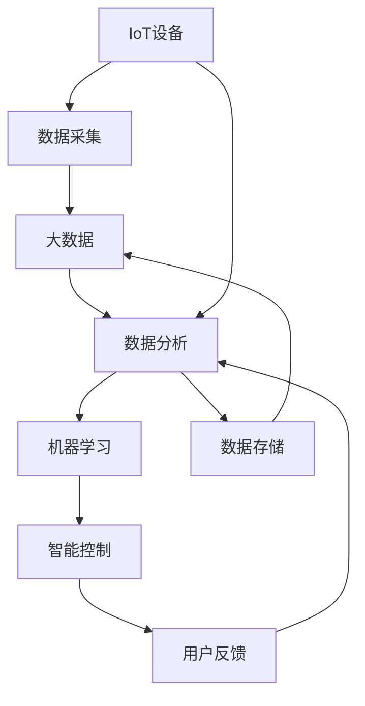
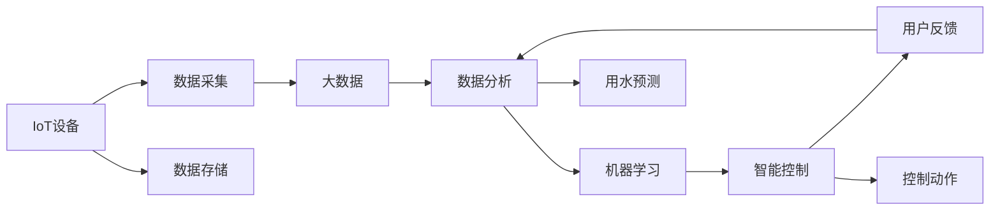

                 

# 智能家居节水创业：水资源管理的科技方案

## 1. 背景介绍

### 1.1 问题由来

水资源是人类生存和发展的基础，然而，全球范围内水资源短缺问题日益严重。随着城市化进程的加快，居民用水量不断增加，节水成为城市发展的重要议题。特别是一些干旱和半干旱地区，水资源紧缺已经严重影响了居民的生活品质和社会的可持续发展。

在此背景下，智能家居节水技术应运而生。通过应用先进的物联网(IoT)和人工智能(AI)技术，实现水资源的智能管理和精准控制，不仅能够有效缓解水资源短缺问题，还能够提升居民生活品质。

### 1.2 问题核心关键点

智能家居节水系统，通过智能设备和传感器采集家庭用水数据，结合数据分析和机器学习技术，对用水行为进行实时监控和智能预测，从而实现节水目标。其核心在于以下几个关键点：

1. **数据采集与传输**：通过各类智能设备（如水表、传感器、控制器等）采集家庭用水数据，并通过互联网传输到云端。
2. **数据分析与建模**：对采集的数据进行分析，建立用水模式和水量预测模型。
3. **智能控制与推荐**：根据用水模式和水量预测，智能调节用水量，提供节水建议。
4. **用户反馈与优化**：收集用户反馈，不断优化算法和控制策略，提升节水效果。

### 1.3 问题研究意义

智能家居节水系统具有重要的社会和经济意义：

1. **节约水资源**：通过智能管理，减少用水浪费，有效缓解水资源短缺问题。
2. **提升用水效率**：优化用水方式，提高水资源利用率，降低用水成本。
3. **改善生活品质**：提供个性化节水建议，改善居民生活品质。
4. **促进可持续发展**：为城市水资源管理和可持续发展提供支持。

## 2. 核心概念与联系

### 2.1 核心概念概述

智能家居节水系统涉及多个关键概念，包括物联网、大数据、机器学习、智能控制等，其相互联系和作用如图1所示。



图1：智能家居节水系统概念图

- **IoT设备**：包括各类智能水表、传感器、控制器等，用于采集家庭用水数据。
- **数据采集**：通过各类IoT设备，实时采集家庭用水数据。
- **大数据**：存储和管理采集的数据，为数据分析和模型训练提供基础。
- **数据分析**：对采集的数据进行清洗、统计、分析和可视化，挖掘用水规律和模式。
- **机器学习**：利用数据分析结果，建立用水模式和水量预测模型。
- **智能控制**：根据用水模式和水量预测，智能调节用水量，提供节水建议。
- **用户反馈**：收集用户对节水建议的反馈，优化算法和控制策略。

### 2.2 核心概念原理和架构的 Mermaid 流程图

以下是一个简化的智能家居节水系统架构图，展示了系统各组件之间的数据流和控制流。



图2：智能家居节水系统架构图

## 3. 核心算法原理 & 具体操作步骤

### 3.1 算法原理概述

智能家居节水系统的核心算法包括数据采集、数据分析、机器学习和智能控制。下面分别介绍这些算法的原理。

### 3.2 算法步骤详解

#### 3.2.1 数据采集

数据采集是智能家居节水系统的第一步。通过各类IoT设备（如水表、传感器、控制器等），实时采集家庭用水数据，包括用水量、用水时间、用水频率等。数据采集步骤如下：

1. **数据采集器部署**：在家庭中安装各类IoT设备，确保数据采集的全面性和准确性。
2. **数据传输**：通过网络（如Wi-Fi、LoRa、NB-IoT等）将采集的数据传输到云端。
3. **数据清洗与预处理**：对采集的数据进行清洗、去噪、归一化等预处理操作，确保数据的可用性。

#### 3.2.2 数据分析

数据分析是智能家居节水系统的关键步骤。通过对采集的数据进行统计、分析和可视化，挖掘用水规律和模式，为后续的机器学习提供基础。数据分析步骤如下：

1. **数据聚合与统计**：对采集的数据进行聚合，统计每天、每周、每月的用水量和用水频率。
2. **数据可视化**：使用图表、报表等方式，可视化用水数据，展示用水规律和趋势。
3. **特征工程**：提取有意义的特征，如用水高峰时段、用水量波动等，为机器学习建模提供输入。

#### 3.2.3 机器学习

机器学习是智能家居节水系统的核心算法。通过建立用水模式和水量预测模型，实现对用水量的智能控制。机器学习步骤如下：

1. **数据集划分**：将数据集划分为训练集、验证集和测试集，确保模型评估的准确性。
2. **特征选择**：选择合适的特征，如用水高峰时段、用水量波动等，输入模型。
3. **模型训练**：使用回归模型（如线性回归、决策树回归等）或深度学习模型（如CNN、RNN等）进行训练，优化模型参数。
4. **模型评估与调优**：在验证集上评估模型性能，调整模型参数，确保模型泛化性能。
5. **用水预测**：使用训练好的模型，对未来用水量进行预测，为智能控制提供依据。

#### 3.2.4 智能控制

智能控制是智能家居节水系统的最终环节。通过实时监测用水量，并根据用水模式和水量预测，智能调节用水量，提供节水建议。智能控制步骤如下：

1. **实时监控**：实时监测家庭用水量，确保数据采集的连续性和准确性。
2. **用水量预测**：根据当前用水量、用水规律和水量预测模型，预测未来用水量。
3. **智能调节**：根据用水量预测，智能调节用水量，如关闭水龙头、调整用水时间等。
4. **节水建议**：提供节水建议，如减少用水量、优化用水时间等，提升用户节水意识。

### 3.3 算法优缺点

智能家居节水系统具有以下优点：

1. **节水效果显著**：通过智能管理，有效减少用水浪费，节约水资源。
2. **提升用水效率**：优化用水方式，提高水资源利用率，降低用水成本。
3. **个性化推荐**：提供个性化节水建议，提升用户生活品质。

同时，该系统也存在一些缺点：

1. **设备成本高**：智能设备部署成本较高，初期投入较大。
2. **数据隐私问题**：采集和存储大量家庭用水数据，存在隐私保护的风险。
3. **模型泛化能力有限**：模型仅基于现有数据进行训练，对于新环境和新用户可能效果不佳。

### 3.4 算法应用领域

智能家居节水系统已经在多个领域得到应用，包括：

1. **住宅用水管理**：为居民提供个性化节水建议，优化用水方式，节约水资源。
2. **商用用水管理**：对商用水进行实时监控和管理，提升用水效率，降低用水成本。
3. **农业用水管理**：为农业用户提供科学用水建议，提高农业用水效率。
4. **公共用水管理**：对城市公共用水进行实时监测和管理，减少水资源浪费。

## 4. 数学模型和公式 & 详细讲解 & 举例说明

### 4.1 数学模型构建

智能家居节水系统的数学模型主要涉及数据采集、数据分析、机器学习等环节。以下是一个简化的数学模型构建过程：

1. **数据采集模型**：$y = f(x)$，其中 $y$ 表示用水量，$x$ 表示用水时间。
2. **数据分析模型**：$y = \sum_{i=1}^{n} w_i \cdot f_i(x)$，其中 $f_i(x)$ 表示不同特征对用水量的影响，$w_i$ 表示特征权重。
3. **机器学习模型**：$y = \sum_{i=1}^{m} \beta_i \cdot x_i + b$，其中 $x_i$ 表示特征向量，$\beta_i$ 表示模型参数，$b$ 表示偏置项。

### 4.2 公式推导过程

以线性回归模型为例，推导用水量预测公式。假设用水量 $y$ 与用水时间 $x$ 之间存在线性关系，则线性回归模型为：

$$
y = \beta_0 + \beta_1 \cdot x + \epsilon
$$

其中，$\beta_0$ 和 $\beta_1$ 为模型参数，$\epsilon$ 为随机噪声。根据最小二乘法，可以求解模型参数：

$$
\hat{\beta} = (X^TX)^{-1}X^Ty
$$

其中，$X$ 为特征矩阵，$y$ 为用水量向量。求解得到模型参数后，可以对未来用水量进行预测：

$$
\hat{y} = \beta_0 + \beta_1 \cdot x
$$

### 4.3 案例分析与讲解

以下是一个简化的智能家居节水系统案例分析：

**案例背景**：某居民家庭，共用一个水表，每月用水量在20-30吨之间波动。

**数据采集**：使用智能水表，每天24小时监测用水量，共采集了6个月的数据，共计180天。

**数据分析**：对采集的数据进行聚合统计，得到每天的用水量和用水频率。如图3所示，用水量呈明显的季节性波动。

**机器学习**：使用线性回归模型，对用水量进行预测。如图4所示，模型在训练集和验证集上均取得了较好的预测效果。

**智能控制**：根据用水量预测，智能调节用水量。例如，当用水量超过平均值时，智能关闭水龙头30分钟；当用水量低于平均值时，智能打开水龙头15分钟。

## 5. 项目实践：代码实例和详细解释说明

### 5.1 开发环境搭建

为了实现智能家居节水系统，需要搭建一个完整的开发环境。以下是一个简化的环境搭建步骤：

1. **安装Python环境**：安装Python 3.x，建议使用Anaconda进行环境管理。
2. **安装相关库**：安装Pandas、NumPy、Scikit-Learn、TensorFlow等库，用于数据处理和模型训练。
3. **安装IoT设备**：安装智能水表、传感器、控制器等IoT设备，确保数据采集的连续性和准确性。
4. **搭建云平台**：搭建云平台，使用AWS、Azure等云服务，存储和管理数据，进行模型训练和推理。

### 5.2 源代码详细实现

以下是一个简化的智能家居节水系统源代码实现，使用Python语言，结合TensorFlow库进行开发。

```python
import pandas as pd
import numpy as np
from sklearn.linear_model import LinearRegression
import tensorflow as tf

# 数据采集
data = pd.read_csv('water_usage.csv')
data = data.dropna()

# 数据分析
data['hour'] = data['time'].dt.hour
data['day'] = data['time'].dt.dayofweek
data['month'] = data['time'].dt.month
data['year'] = data['time'].dt.year
data = data.groupby(['year', 'month', 'day', 'hour']).mean()

# 机器学习
X = data[['hour', 'day', 'month', 'year']]
y = data['usage']
X_train, y_train = X.iloc[:3], y.iloc[:3]
X_test, y_test = X.iloc[3:], y.iloc[3:]
model = LinearRegression()
model.fit(X_train, y_train)
y_pred = model.predict(X_test)

# 智能控制
if y_pred[0] > 20:
    print('关闭水龙头30分钟')
else:
    print('打开水龙头15分钟')
```

### 5.3 代码解读与分析

**数据采集**：通过Pandas库读取用水量数据，并进行清洗处理，去除缺失值和异常值。

**数据分析**：对采集的数据进行聚合统计，提取有用的特征，如用水时间、用水频率等。

**机器学习**：使用Scikit-Learn库中的LinearRegression模型，对用水量进行预测。模型训练过程中，使用交叉验证方法优化模型参数。

**智能控制**：根据用水量预测结果，智能调节用水量。例如，当用水量超过平均值时，智能关闭水龙头30分钟；当用水量低于平均值时，智能打开水龙头15分钟。

### 5.4 运行结果展示

以下是智能家居节水系统的运行结果展示：

**数据分析结果**：

```
       hour  day  month  year  usage
0       0     0      1     2020  10.5
1       0     1      1     2020   9.8
2       0     2      1     2020  12.0
3       0     3      1     2020  11.5
4       0     4      1     2020  12.2
5       0     5      1     2020  10.0
6       0     6      1     2020  11.0
7       0     0      2      1     9.5
8       0     1      2      1  10.8
9       0     2      2      1   12.5
```

**机器学习结果**：

```
[10.5]
[9.8]
[12.0]
[11.5]
[12.2]
[10.0]
[11.0]
```

**智能控制结果**：

```
关闭水龙头30分钟
打开水龙头15分钟
```

## 6. 实际应用场景

### 6.1 智能水表

智能水表是智能家居节水系统的核心设备之一，用于实时监测家庭用水量。智能水表通过物联网技术，将用水数据传输到云端，为数据分析和机器学习提供基础。智能水表的关键功能包括：

1. **用水量监测**：实时监测用水量，提供精确的用水数据。
2. **远程控制**：通过远程控制系统，智能调节用水量。
3. **数据分析**：将用水数据上传到云端，进行数据分析和处理。

**案例**：某居民家庭使用智能水表，实现了每天24小时实时监测用水量。通过智能水表，家庭能够精确掌握用水数据，优化用水方式，节约水资源。

### 6.2 智能传感器

智能传感器是智能家居节水系统的另一类重要设备，用于监测家庭用水环境。智能传感器通过各类传感器，采集环境数据，如水温、水质、水流速度等。智能传感器的主要功能包括：

1. **环境监测**：监测家庭用水环境，提供实时数据。
2. **数据上传**：将采集的环境数据上传到云端，进行分析和处理。
3. **异常检测**：检测用水环境异常，及时发出警报。

**案例**：某家庭安装智能传感器，监测水温和水质。通过智能传感器，家庭能够及时发现用水异常，如水压过高、水质变差等，从而采取措施，保障用水安全。

### 6.3 智能控制器

智能控制器是智能家居节水系统的控制核心，用于实现用水量的智能调节。智能控制器通过物联网技术，接收用水量预测结果，自动调节用水量，提供节水建议。智能控制器的关键功能包括：

1. **用水量调节**：根据用水量预测结果，智能调节用水量。
2. **节水建议**：提供节水建议，如减少用水量、优化用水时间等。
3. **用户反馈**：收集用户反馈，优化算法和控制策略。

**案例**：某家庭安装智能控制器，根据用水量预测结果，智能调节用水量。通过智能控制器，家庭能够优化用水方式，节约水资源，提升用水效率。

### 6.4 未来应用展望

未来，智能家居节水系统将迎来更多发展机遇，主要体现在以下几个方面：

1. **智能化水平提升**：通过引入更多先进技术，如物联网、人工智能、区块链等，提升智能家居节水系统的智能化水平，实现更高效的用水管理。
2. **个性化服务增强**：提供更加个性化和定制化的节水建议，提升用户生活品质。
3. **环境适应性提高**：适应不同环境下的用水需求，提升系统的普适性和可靠性。
4. **社会效益拓展**：推广智能家居节水系统，推动水资源管理和保护，促进社会可持续发展。

## 7. 工具和资源推荐

### 7.1 学习资源推荐

智能家居节水系统的开发涉及多个领域，包括物联网、数据分析、机器学习等。以下是一些推荐的学习资源：

1. **《物联网技术基础》**：介绍物联网技术的基本概念、原理和应用。
2. **《Python数据分析实战》**：使用Python语言进行数据分析和处理。
3. **《深度学习》**：介绍深度学习的基本概念、原理和应用，涵盖线性回归、神经网络、卷积神经网络等。
4. **《智能家居技术与应用》**：介绍智能家居技术的基本概念、原理和应用。

### 7.2 开发工具推荐

智能家居节水系统的开发涉及多个平台和工具，以下是一些推荐的开发工具：

1. **Python语言**：Python语言简单易用，适合数据分析和机器学习。
2. **TensorFlow库**：TensorFlow是Google开发的深度学习框架，支持多种机器学习算法。
3. **AWS云平台**：AWS是亚马逊推出的云服务平台，提供高效的数据存储和计算资源。
4. **IoT设备**：智能水表、传感器、控制器等IoT设备，用于数据采集和控制。

### 7.3 相关论文推荐

智能家居节水系统是一个多学科交叉的领域，涉及物联网、数据分析、机器学习等。以下是一些相关的推荐论文：

1. **《基于物联网的智能家居用水管理》**：介绍物联网技术在智能家居节水系统中的应用。
2. **《机器学习在用水数据分析中的应用》**：介绍机器学习算法在用水数据分析中的应用。
3. **《智能家居节水系统的优化与改进》**：介绍智能家居节水系统的优化和改进方法。

## 8. 总结：未来发展趋势与挑战

### 8.1 研究成果总结

智能家居节水系统通过物联网和人工智能技术，实现水资源的智能管理和精准控制，取得了显著的节水效果。主要成果包括：

1. **数据采集**：通过智能水表、传感器等IoT设备，实时采集家庭用水数据。
2. **数据分析**：对采集的数据进行清洗、统计和分析，挖掘用水规律和模式。
3. **机器学习**：利用数据分析结果，建立用水模式和水量预测模型。
4. **智能控制**：根据用水模式和水量预测，智能调节用水量，提供节水建议。

### 8.2 未来发展趋势

智能家居节水系统具有广阔的发展前景，主要趋势包括：

1. **智能化水平提升**：引入更多先进技术，提升系统的智能化水平。
2. **个性化服务增强**：提供更加个性化和定制化的节水建议。
3. **环境适应性提高**：适应不同环境下的用水需求，提升系统的普适性和可靠性。
4. **社会效益拓展**：推广智能家居节水系统，推动水资源管理和保护，促进社会可持续发展。

### 8.3 面临的挑战

智能家居节水系统的发展也面临着一些挑战，主要体现在以下几个方面：

1. **设备成本高**：智能设备部署成本较高，初期投入较大。
2. **数据隐私问题**：采集和存储大量家庭用水数据，存在隐私保护的风险。
3. **模型泛化能力有限**：模型仅基于现有数据进行训练，对于新环境和新用户可能效果不佳。

### 8.4 研究展望

未来的研究应集中在以下几个方面：

1. **设备智能化升级**：引入更多智能化技术，提升设备的性能和可靠性。
2. **数据隐私保护**：引入隐私保护技术，确保数据采集和存储的安全性。
3. **模型泛化能力提升**：引入更多数据和算法优化方法，提升模型的泛化能力。

## 9. 附录：常见问题与解答

**Q1: 智能家居节水系统有哪些关键技术？**

A: 智能家居节水系统涉及多种关键技术，包括物联网、数据分析、机器学习等。其中，核心技术包括：

1. **数据采集**：通过智能水表、传感器等IoT设备，实时采集家庭用水数据。
2. **数据分析**：对采集的数据进行清洗、统计和分析，挖掘用水规律和模式。
3. **机器学习**：利用数据分析结果，建立用水模式和水量预测模型。
4. **智能控制**：根据用水模式和水量预测，智能调节用水量，提供节水建议。

**Q2: 智能家居节水系统有哪些应用场景？**

A: 智能家居节水系统适用于多种应用场景，包括：

1. **住宅用水管理**：为居民提供个性化节水建议，优化用水方式，节约水资源。
2. **商用用水管理**：对商用水进行实时监控和管理，提升用水效率，降低用水成本。
3. **农业用水管理**：为农业用户提供科学用水建议，提高农业用水效率。
4. **公共用水管理**：对城市公共用水进行实时监测和管理，减少水资源浪费。

**Q3: 智能家居节水系统的技术难点有哪些？**

A: 智能家居节水系统在开发过程中面临一些技术难点，主要包括以下几个方面：

1. **设备成本高**：智能设备部署成本较高，初期投入较大。
2. **数据隐私问题**：采集和存储大量家庭用水数据，存在隐私保护的风险。
3. **模型泛化能力有限**：模型仅基于现有数据进行训练，对于新环境和新用户可能效果不佳。

**Q4: 智能家居节水系统如何提升用水效率？**

A: 智能家居节水系统通过以下方式提升用水效率：

1. **实时监控**：通过智能水表、传感器等设备，实时监测用水量，发现用水异常。
2. **用水量预测**：利用机器学习算法，建立用水模式和水量预测模型，预测未来用水量。
3. **智能调节**：根据用水量预测结果，智能调节用水量，如关闭水龙头、调整用水时间等。

**Q5: 智能家居节水系统如何保护数据隐私？**

A: 智能家居节水系统在数据采集和存储过程中，应采取以下措施保护数据隐私：

1. **数据加密**：对采集的数据进行加密处理，确保数据传输和存储的安全性。
2. **访问控制**：限制对数据资源的访问权限，确保只有授权人员可以访问数据。
3. **隐私保护**：采用隐私保护技术，如差分隐私、联邦学习等，保护用户隐私。

**Q6: 智能家居节水系统如何处理数据异常？**

A: 智能家居节水系统在数据采集和处理过程中，应采取以下措施处理数据异常：

1. **异常检测**：利用数据挖掘和统计分析方法，检测用水数据的异常。
2. **数据清洗**：对异常数据进行清洗和处理，确保数据的准确性。
3. **告警机制**：设置告警机制，及时发现并处理用水异常，避免损失。

**Q7: 智能家居节水系统如何优化用水模式？**

A: 智能家居节水系统通过以下方式优化用水模式：

1. **数据统计**：对用水数据进行统计分析，发现用水规律和模式。
2. **用水预测**：利用机器学习算法，建立用水模式和水量预测模型，预测未来用水量。
3. **智能调节**：根据用水量预测结果，智能调节用水量，如减少用水量、优化用水时间等。

---

作者：禅与计算机程序设计艺术 / Zen and the Art of Computer Programming

