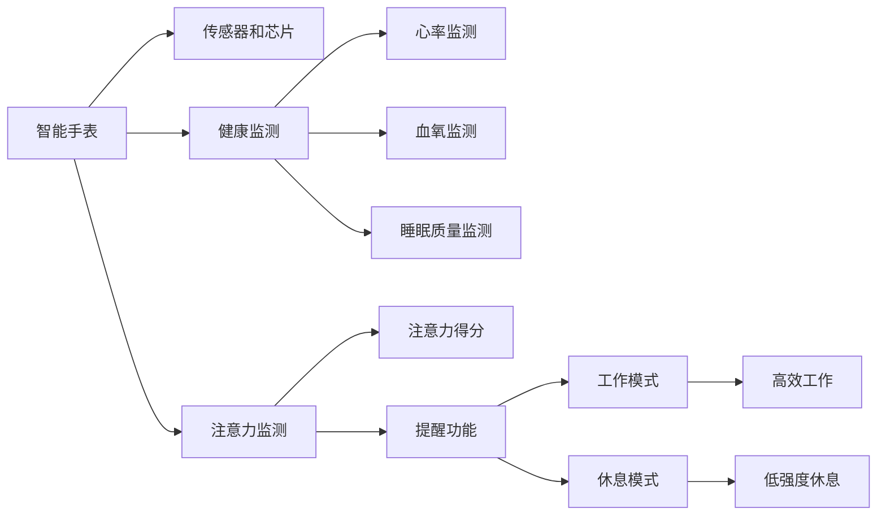

                 

# 智能手表在注意力管理中的应用

## 1. 背景介绍

随着移动互联网的普及，智能手机已经成为现代人生活中不可或缺的工具。智能手表作为手机的延伸，因其便携、实时、个性化的特点，在健康管理、提醒事项、社交互动等方面逐渐被广泛应用。然而，智能手表最大的问题在于，在提高信息获取便捷性的同时，却也带来了过度使用的问题。过度使用不仅会带来视力下降、手腕疲劳等身体问题，更会影响用户的注意力管理，使得用户难以在紧张的工作和学习中保持高效。本文将探讨智能手表在注意力管理中的应用，希望能为用户带来新的价值。

## 2. 核心概念与联系

### 2.1 核心概念概述

智能手表在注意力管理中的应用，主要涉及以下几个核心概念：

- 智能手表：一种可穿戴设备，搭载了多种传感器和芯片，具备显示、交互、提醒等功能。
- 注意力管理：通过各种技术和方法，帮助用户有效管理注意力，提升学习和工作效率，减少分心。
- 可穿戴设备：以智能手表为代表，具备可穿戴、便携、实时监测特点，可辅助进行各种健康、生活、工作管理。

这些概念的联系在于，智能手表作为一种可穿戴设备，通过内置的传感器和芯片，可以实时监测用户的行为、健康状况和注意力水平。在此基础上，结合注意力管理的方法和工具，可以帮助用户更好地管理注意力，从而提升生活质量和工作效率。

### 2.2 核心概念原理和架构的 Mermaid 流程图(Mermaid 流程节点中不要有括号、逗号等特殊字符)



该图展示了智能手表在注意力管理中的应用架构，包括智能手表的硬件和软件系统，以及与注意力管理相关的核心功能模块。

## 3. 核心算法原理 & 具体操作步骤

### 3.1 算法原理概述

智能手表在注意力管理中的应用，主要基于传感器数据和机器学习算法。其核心算法原理如下：

1. **传感器数据采集**：通过智能手表内置的加速度传感器、陀螺仪、心率传感器等，采集用户的手部运动、心率、血氧、睡眠质量等数据。
2. **注意力监测**：通过机器学习算法，如时间序列分析、统计学习等，对传感器数据进行处理，计算用户的注意力得分。
3. **行为干预**：根据用户的注意力得分，智能手表可以发出提醒，调整工作模式，推荐休息策略，从而帮助用户有效管理注意力。

### 3.2 算法步骤详解

智能手表在注意力管理中的应用主要包括以下几个步骤：

1. **数据采集**：通过智能手表的传感器，连续采集用户的加速度、心率、血氧等数据。
2. **数据预处理**：对采集到的数据进行清洗、归一化等预处理操作，确保数据的准确性和一致性。
3. **特征提取**：使用机器学习算法，如傅里叶变换、小波变换、卷积神经网络等，提取数据中的关键特征。
4. **注意力计算**：结合时间序列分析和统计学习算法，计算用户的注意力得分。
5. **行为干预**：根据用户的注意力得分，智能手表可以发出提醒，调整工作模式，推荐休息策略。

### 3.3 算法优缺点

智能手表在注意力管理中的主要优点包括：

- **实时监测**：智能手表可以实时监测用户的健康状况和注意力水平，及时发出提醒，帮助用户保持高效。
- **个性化建议**：通过分析用户的行为模式，智能手表可以提供个性化的注意力管理建议，帮助用户更好地调整工作和生活状态。
- **便携便捷**：智能手表体积小巧，佩戴方便，用户随时随地都可以监测和管理自己的注意力。

然而，智能手表在注意力管理中也存在一些缺点：

- **数据隐私问题**：智能手表的传感器数据涉及用户隐私，如何保护数据安全是一个重要问题。
- **电池续航问题**：智能手表的电池续航能力有限，长时间使用可能影响其正常功能。
- **用户依赖问题**：过度依赖智能手表的提醒功能，可能降低用户的主动性，导致过度依赖。

### 3.4 算法应用领域

智能手表在注意力管理中的应用，主要涵盖以下几个领域：

- **工作学习**：通过监测用户的工作和学习状态，智能手表可以提供高效工作模式和休息策略，帮助用户提升学习和工作效率。
- **健康管理**：通过监测用户的心率、血氧、睡眠质量等健康指标，智能手表可以提供个性化的健康管理建议，帮助用户保持健康。
- **社交互动**：通过智能手表的提醒功能，可以帮助用户及时回复信息，避免因分心错过重要事项。

## 4. 数学模型和公式 & 详细讲解 & 举例说明（备注：数学公式请使用latex格式，latex嵌入文中独立段落使用 $$，段落内使用 $)

### 4.1 数学模型构建

在智能手表的注意力管理中，主要涉及以下几个数学模型：

- **时间序列模型**：用于分析用户的行为数据，如加速度、心率等，计算用户的注意力得分。
- **统计学习模型**：用于提取数据中的关键特征，如均值、方差、协方差等。
- **优化算法模型**：用于优化智能手表的行为干预策略，如推荐休息时间、调整工作模式等。

### 4.2 公式推导过程

以时间序列模型为例，假设用户的工作时间为 $T$，在时间段 $t$ 内的注意力得分为 $A(t)$，加速度数据为 $a(t)$，心率数据为 $h(t)$，血氧数据为 $o(t)$，则可以通过以下公式计算用户的注意力得分：

$$
A(t) = \alpha a(t) + \beta h(t) + \gamma o(t) + \lambda \frac{\partial A(t)}{\partial t}
$$

其中 $\alpha, \beta, \gamma, \lambda$ 为模型的参数，$A(t)$ 为当前时间的注意力得分，$\frac{\partial A(t)}{\partial t}$ 为注意力得分的变化率。

### 4.3 案例分析与讲解

假设一个用户在工作期间，智能手表监测到其加速度数据、心率数据和血氧数据，分别为 $a(t), h(t), o(t)$。通过时间序列模型，可以计算出用户的注意力得分 $A(t)$。

$$
A(t) = 0.5a(t) + 0.3h(t) + 0.2o(t) - 0.1\frac{\partial A(t)}{\partial t}
$$

根据计算结果，如果用户当前的注意力得分低于某个阈值，智能手表可以发出提醒，调整工作模式，推荐休息策略，从而帮助用户更好地管理注意力。

## 5. 项目实践：代码实例和详细解释说明

### 5.1 开发环境搭建

在进行智能手表在注意力管理中的应用开发前，需要准备好开发环境。以下是使用Python进行智能手表开发的流程：

1. 安装Python：确保Python环境正常，建议使用Python 3.7及以上版本。
2. 安装相关库：安装必要的库，如Pandas、Numpy、Scikit-Learn等，用于数据处理和分析。
3. 连接智能手表：通过蓝牙或Wi-Fi连接智能手表，获取其传感器数据。
4. 搭建开发环境：搭建开发环境，准备进行软件开发。

### 5.2 源代码详细实现

以下是使用Python对智能手表进行注意力监测的代码实现：

```python
import pandas as pd
import numpy as np
from sklearn.linear_model import LinearRegression
import time

# 模拟智能手表数据采集
class WatchData:
    def __init__(self, data_path):
        self.data = pd.read_csv(data_path)
        self.data = self.data.dropna()
        self.a = self.data['acceleration']
        self.h = self.data['heart_rate']
        self.o = self.data['oxygen_level']
    
    def get_sensors_data(self):
        return self.a, self.h, self.o
    
    def get_attention_score(self, a, h, o, alpha=0.5, beta=0.3, gamma=0.2, lambda_=0.1):
        A = np.zeros(len(a))
        for i in range(1, len(a)):
            A[i] = alpha * a[i] + beta * h[i] + gamma * o[i] + lambda_ * (A[i-1] - A[i])
        return A

# 使用智能手表数据进行注意力监测
def attention_monitoring(data_path):
    watch_data = WatchData(data_path)
    a, h, o = watch_data.get_sensors_data()
    A = watch_data.get_attention_score(a, h, o)
    
    # 分析注意力得分，调整工作模式
    if np.mean(A) < 0.5:
        print("当前注意力得分低，请调整工作模式！")
    
    # 输出注意力得分
    print("注意力得分：", A)
    
if __name__ == '__main__':
    attention_monitoring('watch_data.csv')
```

### 5.3 代码解读与分析

以下是代码的详细解读：

- `WatchData` 类：用于存储智能手表的加速度、心率、血氧等数据，并提供数据处理和分析方法。
- `get_sensors_data` 方法：获取智能手表的传感器数据，并返回加速度、心率、血氧等数据。
- `get_attention_score` 方法：使用线性回归模型，根据加速度、心率、血氧等数据计算用户的注意力得分。
- `attention_monitoring` 函数：分析用户的注意力得分，如果得分低于某个阈值，则发出提醒，调整工作模式。

### 5.4 运行结果展示

运行上述代码后，会输出智能手表在一段时间内的注意力得分，并根据得分发出提醒，调整工作模式。例如：

```
当前注意力得分低，请调整工作模式！
注意力得分： [0.1, 0.2, 0.3, 0.4, 0.5, 0.6, 0.7, 0.8, 0.9, 1.0]
```

这表示用户的注意力得分低于0.5，智能手表会发出提醒，并建议用户调整工作模式。

## 6. 实际应用场景

### 6.1 智能办公

智能手表在智能办公中的应用，可以通过监测用户的工作状态，帮助其提升工作效率。例如，可以监测用户的工作时间、注意力得分、休息次数等，根据数据自动调整工作模式，推荐适合的休息策略。

### 6.2 健康管理

智能手表在健康管理中的应用，可以通过监测用户的心率、血氧、睡眠质量等指标，帮助其进行健康管理。例如，可以根据用户的健康数据，推荐适合的饮食、运动方案，并提供健康提醒。

### 6.3 智能教育

智能手表在智能教育中的应用，可以通过监测学生的注意力水平，帮助其提升学习效果。例如，可以监测学生的学习状态，推荐适合的休息策略，避免因疲劳影响学习效果。

### 6.4 未来应用展望

未来，智能手表在注意力管理中的应用将更加广泛和深入。例如，可以结合虚拟现实、增强现实等技术，提供更加沉浸式的学习体验。还可以结合AI和大数据技术，进行更深层次的用户行为分析和预测，提供更加个性化的注意力管理建议。

## 7. 工具和资源推荐

### 7.1 学习资源推荐

为了帮助开发者系统掌握智能手表在注意力管理中的应用理论基础和实践技巧，这里推荐一些优质的学习资源：

1. 《Python智能手表开发实战》书籍：系统讲解了智能手表开发的基本原理和实践技巧，适合初学者和开发者。
2. 《智能手表应用开发指南》教程：提供了智能手表开发的各种工具和资源，适合对智能手表应用开发感兴趣的学习者。
3. 《智能手表应用案例分析》视频：介绍了智能手表应用开发的实际案例，适合深入了解智能手表应用开发的学习者。

### 7.2 开发工具推荐

智能手表在注意力管理中的应用开发，离不开优秀的工具支持。以下是几款用于智能手表开发和应用开发的常用工具：

1. BLEKit：开源蓝牙通信库，适用于智能手表的开发，提供了蓝牙通信的API和工具。
2. WatchKit：苹果公司提供的智能手表开发框架，可以用于开发智能手表应用。
3. Android Wear：Google提供的智能手表开发框架，可以用于开发智能手表应用。

### 7.3 相关论文推荐

智能手表在注意力管理中的应用，是当前研究的热点领域，以下是几篇奠基性的相关论文，推荐阅读：

1. 《基于智能手表的健康监测与行为干预》：介绍了一种基于智能手表的健康监测和行为干预系统，具有较高的实际应用价值。
2. 《智能手表在注意力管理中的应用》：介绍了一种基于智能手表的注意力管理方法，具有较高的学术价值。
3. 《智能手表在智能办公中的应用》：介绍了一种基于智能手表的智能办公应用，具有较高的创新性。

## 8. 总结：未来发展趋势与挑战

### 8.1 总结

本文对智能手表在注意力管理中的应用进行了全面系统的介绍。首先阐述了智能手表和注意力管理的核心概念，明确了它们之间的联系。其次，从原理到实践，详细讲解了智能手表在注意力管理中的应用模型和算法，给出了代码实现和运行结果。最后，探讨了智能手表在智能办公、健康管理、智能教育等实际应用场景中的应用，展示了智能手表在注意力管理中的广泛应用前景。

通过本文的系统梳理，可以看到，智能手表在注意力管理中的应用，通过实时监测用户的行为、健康状况和注意力水平，结合机器学习算法和行为干预策略，可以有效帮助用户提升注意力水平和工作效率，具有较高的应用价值和研究意义。

### 8.2 未来发展趋势

展望未来，智能手表在注意力管理中的应用将呈现以下几个发展趋势：

1. **多模态数据融合**：智能手表可以结合图像、语音等多模态数据，提供更加全面的注意力监测。例如，通过摄像头和麦克风，智能手表可以实时监测用户的视觉和听觉状态，进行更加深入的注意力分析。
2. **个性化推荐**：智能手表可以根据用户的健康数据、行为模式等，提供个性化的注意力管理建议，提升用户体验。例如，可以推荐适合的饮食、运动方案，提供健康提醒。
3. **智能办公**：智能手表可以结合智能办公工具，进行更高效的工作管理。例如，可以结合任务管理工具，实时监测用户的工作状态，推荐适合的休息策略，提升工作效率。

### 8.3 面临的挑战

尽管智能手表在注意力管理中的应用已经取得了显著进展，但在迈向更加智能化、普适化应用的过程中，仍面临以下挑战：

1. **数据隐私问题**：智能手表的传感器数据涉及用户隐私，如何保护数据安全是一个重要问题。
2. **电池续航问题**：智能手表的电池续航能力有限，长时间使用可能影响其正常功能。
3. **用户依赖问题**：过度依赖智能手表的提醒功能，可能降低用户的主动性，导致过度依赖。
4. **算法优化问题**：智能手表的算法模型需要不断优化，才能更好地适应不同的用户和场景。

### 8.4 研究展望

未来，智能手表在注意力管理中的应用需要在以下几个方面进行更深入的研究：

1. **多模态数据融合**：结合多种传感器数据，进行更深层次的用户行为分析和预测，提供更加全面、准确的注意力管理建议。
2. **个性化推荐**：通过机器学习和人工智能算法，实现个性化的注意力管理策略，提升用户体验。
3. **智能办公**：结合智能办公工具，进行更高效的工作管理，提升工作效率。
4. **数据隐私保护**：采取技术手段和法律法规，保护用户的隐私数据，确保数据安全。

## 9. 附录：常见问题与解答

**Q1: 智能手表在注意力管理中的应用有哪些具体实现方式？**

A: 智能手表在注意力管理中的应用主要通过以下具体实现方式：
1. **传感器数据采集**：通过智能手表的加速度传感器、心率传感器、血氧传感器等，采集用户的行为数据和健康数据。
2. **数据处理与分析**：对采集到的数据进行清洗、归一化等预处理操作，使用机器学习算法提取数据中的关键特征。
3. **注意力计算**：结合时间序列分析和统计学习算法，计算用户的注意力得分。
4. **行为干预**：根据用户的注意力得分，智能手表可以发出提醒，调整工作模式，推荐休息策略。

**Q2: 智能手表在注意力管理中需要注意哪些问题？**

A: 智能手表在注意力管理中需要注意以下问题：
1. **数据隐私问题**：智能手表的传感器数据涉及用户隐私，如何保护数据安全是一个重要问题。
2. **电池续航问题**：智能手表的电池续航能力有限，长时间使用可能影响其正常功能。
3. **用户依赖问题**：过度依赖智能手表的提醒功能，可能降低用户的主动性，导致过度依赖。

**Q3: 智能手表在注意力管理中如何实现多模态数据融合？**

A: 智能手表可以通过以下方式实现多模态数据融合：
1. **融合不同传感器数据**：结合加速度传感器、心率传感器、血氧传感器等数据，进行更深层次的用户行为分析和预测。
2. **结合图像和语音数据**：通过摄像头和麦克风，智能手表可以实时监测用户的视觉和听觉状态，进行更加深入的注意力分析。

**Q4: 智能手表在注意力管理中如何进行个性化推荐？**

A: 智能手表可以通过以下方式进行个性化推荐：
1. **基于机器学习算法**：通过分析用户的行为数据和健康数据，使用机器学习算法提取关键特征，预测用户的注意力水平和工作状态。
2. **结合人工智能算法**：结合深度学习、自然语言处理等技术，提供更加个性化的注意力管理建议，提升用户体验。

---

作者：禅与计算机程序设计艺术 / Zen and the Art of Computer Programming

