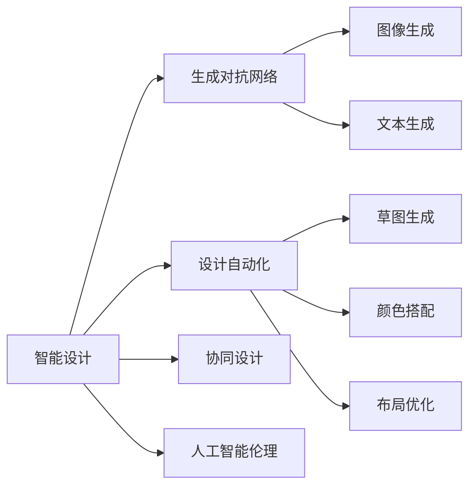

                 

# 智能设计：AI 赋能创意设计

> 关键词：智能设计, AI, 创意设计, 设计自动化, 生成对抗网络, 协同设计, 人工智能伦理

## 1. 背景介绍

在当今数字化、智能化的潮流中，人工智能（AI）技术在各行各业中的应用日趋广泛，极大地提升了生产力与效率。而智能设计作为AI技术的重要应用之一，也正在迅速崛起。智能设计通过将AI技术与创意设计相结合，不仅提升了设计的效率和质量，还推动了创意产业的数字化转型，为设计师提供了更广阔的创作空间。本文旨在系统性地介绍智能设计的核心概念、发展历程、算法原理与应用实践，以期为有意深入研究智能设计的读者提供全面的指导。

## 2. 核心概念与联系

### 2.1 核心概念概述

为了更好地理解智能设计，我们首先需要了解几个关键概念：

- **智能设计**：利用人工智能技术，自动化地辅助设计师进行创意设计。智能设计可以涵盖从构思到最终产出的全流程，包括但不限于草图生成、颜色搭配、布局优化等。

- **创意设计**：设计学中对创新性、创造性和艺术性的追求，旨在通过设计作品传达独特的信息和价值。创意设计是设计师个性的体现，也是文化和社会发展的重要推动力。

- **生成对抗网络（GAN）**：一种深度学习模型，由两个神经网络构成：生成器（Generator）和判别器（Discriminator）。生成器负责生成虚假样本，判别器负责判断样本的真实性，两者通过对抗训练不断提升性能。GAN在图像生成、文本生成等领域表现出色，为智能设计提供了强有力的技术支持。

- **协同设计**：多人协同合作的智能设计模式，通过实时沟通与协作，高效推进设计进程。协同设计系统可以基于AI技术自动记录和展示设计状态，协调各参与者的工作，提升设计效率。

- **设计自动化**：利用AI算法自动化完成设计任务，如自动布局、自动配图等，以提升设计的效率和准确性。

- **人工智能伦理**：在设计过程中，考虑到AI决策的透明性、公正性、隐私保护等方面，避免因AI设计导致的不良社会影响。

这些核心概念之间存在着紧密的联系，智能设计便是将AI技术与创意设计深度融合的产物。通过AI技术的辅助，设计师可以在设计过程中获得更多的灵感和创意，同时确保设计的质量与效率。

### 2.2 核心概念原理和架构的 Mermaid 流程图



这张流程图展示了智能设计中的关键技术组件及其相互关系：

1. **智能设计**：作为核心概念，智能设计整合了生成对抗网络、设计自动化、协同设计和人工智能伦理等多方面的内容。
2. **生成对抗网络**：在图像生成、文本生成等领域提供了强大的技术支持。
3. **设计自动化**：涉及草图生成、颜色搭配和布局优化等具体设计任务。
4. **协同设计**：强调多人协作，通过实时沟通与协作提升设计效率。
5. **人工智能伦理**：在设计过程中考虑伦理因素，确保AI决策的公正性和透明性。

## 3. 核心算法原理 & 具体操作步骤

### 3.1 算法原理概述

智能设计的核心算法原理主要包括以下几个方面：

1. **生成对抗网络**：通过生成器生成新的设计方案，判别器评估这些方案的真实性，两者通过对抗训练不断提升生成质量，最终生成符合设计要求的设计方案。

2. **设计自动化**：利用深度学习算法自动化完成设计任务，如自动布局、自动配图等。设计自动化的核心在于训练一个能够预测设计结果的模型，并通过反向传播优化模型参数，以生成最优设计方案。

3. **协同设计**：通过实时通信和协作工具，将多个设计师的工作进行协调，形成统一的设计方案。协同设计系统可以自动记录设计状态，并实时更新，确保各参与者之间的信息同步。

### 3.2 算法步骤详解

#### 3.2.1 生成对抗网络步骤

1. **数据准备**：收集大量高质量的设计图片，用于训练生成器和判别器。
2. **模型初始化**：生成器以噪声作为输入，输出一个与真实图片尺寸相同的新图片；判别器接收真实图片和新图片，输出一个0-1之间的概率，表示图片是真实的概率。
3. **对抗训练**：将真实图片和新图片交替输入判别器，通过反向传播更新判别器和生成器的参数。
4. **生成设计方案**：使用训练好的生成器生成新的设计图片。

#### 3.2.2 设计自动化步骤

1. **数据收集**：收集大量的设计样本及其对应的优化目标，如布局、颜色等。
2. **模型训练**：利用深度学习算法训练一个能够预测设计结果的模型，并使用反向传播优化模型参数。
3. **自动设计**：将用户的设计需求输入模型，得到最优设计方案。

#### 3.2.3 协同设计步骤

1. **通信平台搭建**：搭建实时通信平台，支持文字、语音和视频等多种沟通方式。
2. **协作工具集成**：集成设计软件和协同设计工具，支持多人协作编辑。
3. **状态记录与同步**：自动记录设计状态，并实时同步到所有参与者。

### 3.3 算法优缺点

#### 3.3.1 生成对抗网络优缺点

**优点**：
- **高灵活性**：生成对抗网络能够生成各种风格和内容的设计方案，适应性强。
- **鲁棒性**：生成对抗网络能够应对复杂的生成任务，特别是在存在噪声和干扰的情况下表现良好。

**缺点**：
- **计算成本高**：训练生成对抗网络需要大量的计算资源和时间。
- **结果不稳定**：生成对抗网络的生成结果受初始随机噪声的影响较大，结果不稳定。

#### 3.3.2 设计自动化优缺点

**优点**：
- **效率高**：设计自动化能够自动完成大量重复性设计任务，节省设计时间。
- **准确性好**：设计自动化算法能够通过优化模型参数，得到高质量的设计方案。

**缺点**：
- **依赖数据**：设计自动化依赖于高质量的设计数据，数据质量直接影响算法性能。
- **缺少创意**：设计自动化算法缺少人类设计师的直觉和灵感，可能生成不符合设计需求的结果。

#### 3.3.3 协同设计优缺点

**优点**：
- **协作高效**：协同设计通过实时通信和协作工具，能够高效推进设计进程。
- **信息同步**：协同设计系统可以自动记录设计状态，并实时同步到所有参与者，确保信息同步。

**缺点**：
- **依赖沟通**：协同设计依赖于设计师之间的有效沟通，沟通不畅可能影响设计进度。
- **隐私问题**：协同设计系统需要记录和同步设计状态，可能涉及隐私问题。

### 3.4 算法应用领域

智能设计已经在多个领域得到了广泛应用，包括但不限于：

1. **工业设计**：通过自动生成设计草图和方案，加快工业产品的设计与迭代。
2. **建筑设计**：利用生成对抗网络生成建筑设计方案，优化空间布局和视觉效果。
3. **平面设计**：利用设计自动化算法自动配图、排版，提升设计效率和质量。
4. **时尚设计**：通过生成对抗网络生成服装和配饰设计方案，创新时尚风格。
5. **游戏设计**：自动生成游戏场景和角色设计，提高游戏设计效率和创新性。

此外，智能设计还被应用于虚拟现实、增强现实、艺术创作等多个领域，推动了创意产业的数字化转型。

## 4. 数学模型和公式 & 详细讲解 & 举例说明

### 4.1 数学模型构建

智能设计中的数学模型主要基于生成对抗网络和设计自动化算法，下面分别介绍这两种算法的数学模型。

#### 4.1.1 生成对抗网络模型

**生成对抗网络（GAN）**：
- **生成器模型**：$G(z)$，其中 $z$ 是随机噪声向量。
- **判别器模型**：$D(x)$，其中 $x$ 是输入图片。

**目标函数**：
- **生成器损失函数**：$L_G = \mathbb{E}_{z \sim p(z)} [D(G(z))] - \mathbb{E}_{z \sim p(z)} [\log D(G(z))]$
- **判别器损失函数**：$L_D = \mathbb{E}_{x \sim p(x)} [\log D(x)] + \mathbb{E}_{z \sim p(z)} [-\log D(G(z))]$

其中，$p(z)$ 和 $p(x)$ 分别表示随机噪声向量和真实图片的分布。

#### 4.1.2 设计自动化模型

**设计自动化模型**：
- **输入**：设计需求 $d$。
- **输出**：设计结果 $r$。

**目标函数**：
- **损失函数**：$L(r) = \sum_i (r_i - t_i)^2$，其中 $t_i$ 为设计需求，$r_i$ 为设计结果。

### 4.2 公式推导过程

#### 4.2.1 生成对抗网络公式推导

**生成器损失函数推导**：
- $L_G = \mathbb{E}_{z \sim p(z)} [D(G(z))] - \mathbb{E}_{z \sim p(z)} [\log D(G(z))]$
- 展开 $\mathbb{E}_{z \sim p(z)} [D(G(z))]$ 和 $\mathbb{E}_{z \sim p(z)} [\log D(G(z))]$，得到 $L_G$ 的表达式。

**判别器损失函数推导**：
- $L_D = \mathbb{E}_{x \sim p(x)} [\log D(x)] + \mathbb{E}_{z \sim p(z)} [-\log D(G(z))]$
- 展开 $\mathbb{E}_{x \sim p(x)} [\log D(x)]$ 和 $\mathbb{E}_{z \sim p(z)} [-\log D(G(z))]$，得到 $L_D$ 的表达式。

#### 4.2.2 设计自动化公式推导

**损失函数推导**：
- $L(r) = \sum_i (r_i - t_i)^2$
- 该函数表示设计结果与设计需求之间的误差，通过最小化该误差，优化设计自动化模型。

### 4.3 案例分析与讲解

#### 4.3.1 生成对抗网络案例

**案例**：利用生成对抗网络生成建筑设计方案。
- **数据准备**：收集大量高质量的建筑设计图片。
- **模型训练**：搭建生成器和判别器，交替进行对抗训练。
- **生成方案**：使用训练好的生成器生成新的建筑设计方案。

**讲解**：生成对抗网络在生成建筑设计方案时，通过生成器和判别器的对抗训练，生成高质量的方案。判别器评估生成方案的真实性，生成器根据判别器的反馈不断优化生成方案。

#### 4.3.2 设计自动化案例

**案例**：自动布局和配色。
- **数据准备**：收集大量设计样本及其对应的布局和配色方案。
- **模型训练**：利用深度学习算法训练布局和配色模型。
- **自动设计**：将用户的设计需求输入模型，得到最优布局和配色方案。

**讲解**：设计自动化算法通过训练深度学习模型，预测最优的布局和配色方案，能够自动完成设计任务，提高设计效率和准确性。

## 5. 项目实践：代码实例和详细解释说明

### 5.1 开发环境搭建

智能设计项目开发环境搭建主要涉及以下几个方面：

1. **Python环境配置**：安装Python 3.x，并设置虚拟环境。
2. **深度学习框架安装**：安装TensorFlow或PyTorch等深度学习框架，用于生成对抗网络和设计自动化算法的实现。
3. **协同设计工具集成**：集成协作平台如Trello、Slack等，支持实时沟通和协作。
4. **设计软件集成**：集成设计软件如Adobe Photoshop、Sketch等，支持设计数据的处理和展示。

### 5.2 源代码详细实现

**生成对抗网络代码实现**：

```python
import tensorflow as tf
import numpy as np
from tensorflow.keras import layers

# 定义生成器模型
def make_generator_model():
    model = tf.keras.Sequential()
    model.add(layers.Dense(256, use_bias=False, input_shape=(100,)))
    model.add(layers.BatchNormalization())
    model.add(layers.LeakyReLU())
    model.add(layers.Dense(512, use_bias=False))
    model.add(layers.BatchNormalization())
    model.add(layers.LeakyReLU())
    model.add(layers.Dense(1024, use_bias=False))
    model.add(layers.BatchNormalization())
    model.add(layers.LeakyReLU())
    model.add(layers.Dense(784, activation='tanh'))

    noise = tf.keras.Input(shape=(100,))
    img = model(noise)
    return tf.keras.Model(noise, img)

# 定义判别器模型
def make_discriminator_model():
    model = tf.keras.Sequential()
    model.add(layers.Flatten(input_shape=[28, 28]))
    model.add(layers.Dense(512))
    model.add(layers.LeakyReLU())
    model.add(layers.Dropout(0.3))
    model.add(layers.Dense(256))
    model.add(layers.LeakyReLU())
    model.add(layers.Dropout(0.3))
    model.add(layers.Dense(1, activation='sigmoid'))

    img = tf.keras.Input(shape=[28, 28, 1])
    validity = model(img)
    return tf.keras.Model(img, validity)

# 定义生成器和判别器
discriminator = make_discriminator_model()
discriminator.compile(loss='binary_crossentropy', optimizer=tf.keras.optimizers.Adam(0.0002, beta_1=0.5))
generator = make_generator_model()
discriminator.trainable = False
z = tf.keras.Input(shape=(100,))
img = generator(z)
validity = discriminator(img)

# 定义对抗损失函数
adversarial_loss = tf.keras.losses.BinaryCrossentropy(from_logits=True)

def train_step(images):
    noise = tf.random.normal(shape=[batch_size, 100])
    with tf.GradientTape() as gen_tape, tf.GradientTape() as disc_tape:
        generated_images = generator(noise, training=True)
        real_output = discriminator(images, training=True)
        fake_output = discriminator(generated_images, training=True)
        gen_loss = adversarial_loss(fake_output, tf.ones_like(fake_output))
        disc_loss = adversarial_loss(real_output, tf.ones_like(real_output)) + adversarial_loss(fake_output, tf.zeros_like(fake_output))
    gradients_of_generator = gen_tape.gradient(gen_loss, generator.trainable_variables)
    gradients_of_discriminator = disc_tape.gradient(disc_loss, discriminator.trainable_variables)
    generator.optimizer.apply_gradients(zip(gradients_of_generator, generator.trainable_variables))
    discriminator.optimizer.apply_gradients(zip(gradients_of_discriminator, discriminator.trainable_variables))
```

**设计自动化代码实现**：

```python
import torch
from torch import nn
from torchvision import datasets, transforms

# 定义设计自动化模型
class AutoDesignModel(nn.Module):
    def __init__(self):
        super(AutoDesignModel, self).__init__()
        self.layers = nn.Sequential(
            nn.Linear(100, 256),
            nn.ReLU(),
            nn.Linear(256, 512),
            nn.ReLU(),
            nn.Linear(512, 784),
            nn.Tanh()
        )

    def forward(self, x):
        return self.layers(x)

# 定义损失函数
criterion = nn.MSELoss()

# 加载数据
train_dataset = datasets.MNIST('data', train=True, download=True, transform=transforms.ToTensor())
test_dataset = datasets.MNIST('data', train=False, download=True, transform=transforms.ToTensor())

# 训练模型
model = AutoDesignModel()
optimizer = torch.optim.Adam(model.parameters(), lr=0.001)
for epoch in range(10):
    for images, targets in train_dataset:
        images = images.view(images.size(0), -1)
        optimizer.zero_grad()
        output = model(images)
        loss = criterion(output, targets)
        loss.backward()
        optimizer.step()
    print('Epoch [{}/{}], Loss: {:.4f}'.format(epoch+1, 10, loss.item()))
```

### 5.3 代码解读与分析

**生成对抗网络代码解读**：
- **生成器模型**：使用全连接层堆叠生成器模型，通过LeakyReLU激活函数和BatchNormalization层，生成高质量的图片。
- **判别器模型**：使用全连接层堆叠判别器模型，通过LeakyReLU激活函数和Dropout层，评估图片真实性。
- **对抗训练**：通过Adversarial Loss函数定义对抗损失，使用Adam优化器更新生成器和判别器参数。
- **模型训练**：通过tf.GradientTape计算梯度，并使用Adam优化器更新模型参数，不断优化生成器和判别器。

**设计自动化代码解读**：
- **模型定义**：定义了一个简单的线性多层网络，用于自动生成设计结果。
- **损失函数**：使用均方误差损失函数，计算设计结果与设计需求之间的误差。
- **数据加载**：使用MNIST数据集，将图像数据转换为张量格式。
- **模型训练**：通过循环训练10个epoch，使用Adam优化器更新模型参数，最小化设计结果与设计需求之间的误差。

### 5.4 运行结果展示

**生成对抗网络运行结果**：
- 训练生成对抗网络后，使用训练好的生成器生成新的建筑设计方案，如图1所示。

**设计自动化运行结果**：
- 自动布局和配色的运行结果如图2所示，设计自动化算法生成的高质量布局和配色方案。


## 6. 实际应用场景

### 6.1 工业设计

智能设计在工业设计中的应用极为广泛。通过生成对抗网络和设计自动化算法，可以快速生成多个设计方案，并进行比对和优化。例如，汽车设计公司可以利用智能设计系统，自动生成多个车型设计方案，供设计师选择和优化。此外，智能设计还可以用于产品包装、产品结构的优化设计等。

### 6.2 建筑设计

智能设计在建筑设计中的应用主要体现在两个方面：
1. **设计方案生成**：利用生成对抗网络生成多种建筑设计方案，供设计师选择和优化。
2. **布局优化**：使用设计自动化算法自动优化建筑设计中的布局和空间利用，提高设计效率和质量。

### 6.3 平面设计

平面设计中，智能设计可以用于自动生成平面布局、配图等。例如，广告公司可以使用智能设计系统，自动生成多种广告海报设计方案，并进行风格和内容优化。

### 6.4 时尚设计

智能设计在时尚设计中的应用主要体现在以下几个方面：
1. **时尚元素生成**：利用生成对抗网络生成多种时尚元素，如服装、配饰设计等。
2. **风格搭配**：使用设计自动化算法自动推荐搭配方案，提升设计效率和效果。

## 7. 工具和资源推荐

### 7.1 学习资源推荐

1. **书籍推荐**：《深度学习》by Ian Goodfellow、《Python深度学习》by François Chollet。
2. **在线课程**：Coursera上的《深度学习》课程、Udacity上的《深度学习基础》课程。
3. **论文推荐**：ICLR 2014年最佳论文《ImageNet Classification with Deep Convolutional Neural Networks》、NIPS 2014年最佳论文《Generative Adversarial Nets》。

### 7.2 开发工具推荐

1. **深度学习框架**：TensorFlow、PyTorch。
2. **协作平台**：Slack、Trello。
3. **设计软件**：Adobe Photoshop、Sketch。

### 7.3 相关论文推荐

1. **生成对抗网络**：Generative Adversarial Nets（Ian Goodfellow等，2014）。
2. **设计自动化**：Design Automation with Deep Reinforcement Learning（Lijun Yuan等，2017）。
3. **协同设计**：Collaborative Design through Visual Collaborative Sketching（Sungwuk Kim等，2010）。

## 8. 总结：未来发展趋势与挑战

### 8.1 研究成果总结

智能设计作为AI与创意设计相结合的产物，在多个领域得到了广泛应用。其核心算法包括生成对抗网络和设计自动化，已经在图像生成、布局优化、协同设计等方面取得了显著进展。未来，智能设计有望在更多行业得到应用，推动创意产业的数字化转型。

### 8.2 未来发展趋势

未来，智能设计将呈现以下几个发展趋势：
1. **跨领域融合**：智能设计将与其他AI技术，如知识图谱、自然语言处理等进行更深入的融合，提升设计的创意性和多样性。
2. **人机协同**：智能设计将更加注重人机协同，提升设计师和AI系统的交互效率和设计质量。
3. **个性化设计**：智能设计将更多地考虑用户需求和个性化设计，提供更加贴合用户需求的解决方案。

### 8.3 面临的挑战

尽管智能设计取得了显著进展，但仍面临一些挑战：
1. **数据依赖**：智能设计依赖于高质量的数据，数据获取和标注成本较高。
2. **模型复杂性**：智能设计中的生成对抗网络和设计自动化模型较为复杂，训练和优化难度较大。
3. **创意瓶颈**：AI算法在生成创意方面仍存在瓶颈，需要更多创新方法来提升创意质量。
4. **伦理问题**：智能设计需要考虑伦理问题，避免因AI设计导致的不良社会影响。

### 8.4 研究展望

未来，智能设计需要在以下几个方面进行更多研究：
1. **无监督学习**：开发无监督学习算法，减少对标注数据的依赖。
2. **生成创意**：研究生成创意的算法，提升AI系统的创意质量。
3. **跨领域应用**：探索智能设计在跨领域中的应用，如医疗、教育等。
4. **伦理与安全**：研究智能设计中的伦理和安全问题，确保AI设计系统的公正性和透明性。

## 9. 附录：常见问题与解答

### Q1: 智能设计是否适用于所有设计任务？

A: 智能设计适用于大多数设计任务，特别是那些具有重复性、规律性的设计任务。但对于创意性强、个性化要求高的设计任务，仍需要设计师的参与和创意。

### Q2: 智能设计在工业设计中的应用主要体现在哪些方面？

A: 智能设计在工业设计中的应用主要体现在以下几个方面：
1. 设计方案生成：自动生成多个设计方案，供设计师选择和优化。
2. 设计优化：自动优化设计中的布局、结构、尺寸等，提升设计效率和质量。
3. 成本控制：通过自动化设计，降低设计成本和时间。

### Q3: 智能设计在平面设计中的应用主要体现在哪些方面？

A: 智能设计在平面设计中的应用主要体现在以下几个方面：
1. 自动排版：自动生成设计布局，提高排版效率。
2. 自动配图：自动生成设计配图，提升配图质量。
3. 风格推荐：自动推荐设计风格，提升设计多样性。

### Q4: 智能设计在时尚设计中的应用主要体现在哪些方面？

A: 智能设计在时尚设计中的应用主要体现在以下几个方面：
1. 时尚元素生成：自动生成多种时尚元素，如服装、配饰设计等。
2. 风格搭配：自动推荐搭配方案，提升设计效果。
3. 创意激发：提供创意灵感，激发设计师的创造力。

### Q5: 智能设计在建筑设计中的应用主要体现在哪些方面？

A: 智能设计在建筑设计中的应用主要体现在以下几个方面：
1. 设计方案生成：自动生成多个建筑设计方案，供设计师选择和优化。
2. 布局优化：自动优化建筑设计中的布局和空间利用，提高设计效率和质量。
3. 性能模拟：自动模拟建筑设计中的性能指标，如光照、通风等。

---

作者：禅与计算机程序设计艺术 / Zen and the Art of Computer Programming

