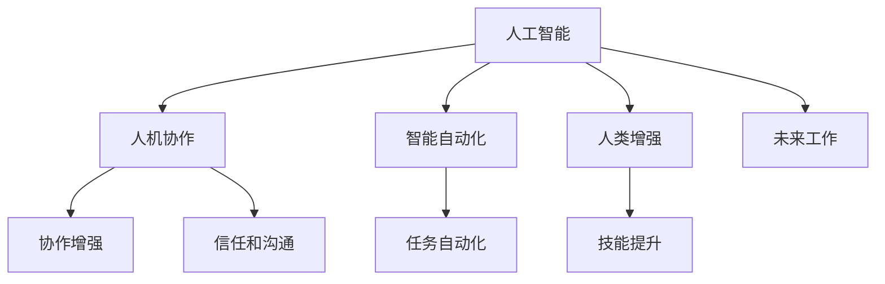

                 

# 未来工作：人机协作，重塑职业未来蓝图

## 1. 背景介绍

在人类文明的长河中，每一次技术的革新都会深刻改变社会的生产力和工作方式。从蒸汽机的诞生到电气化、信息化再到智能化，人类已经多次经历工业革命和技术变革。而在21世纪，尤其是近十年来，人工智能、大数据、物联网、云计算等新兴技术的飞速发展，正引领我们进入一个新的智能时代。

### 1.1 问题由来

随着人工智能技术的不断成熟，越来越多的企业开始引入智能系统来提升工作效率和质量。然而，这一过程也引发了诸多新的问题：大量传统岗位可能被机器取代，技术鸿沟问题加剧，以及人机协作中的信任和沟通问题等。这些问题不仅影响了员工的工作满意度，也给企业带来了管理和运营上的挑战。

### 1.2 问题核心关键点

未来工作的核心问题是：如何在智能化的浪潮中，实现人机协作，充分利用AI的强大能力，同时维护人的价值，保证技术的健康发展。这一问题涉及技术、管理、伦理等多个方面，需要我们共同努力，探索出一条可持续的发展路径。

## 2. 核心概念与联系

### 2.1 核心概念概述

为更好地理解未来工作的核心概念，本节将介绍几个密切相关的核心概念：

- **人工智能(AI)**：通过算法和数据训练得到的，具备一定自主决策和感知能力的机器智能系统。
- **人机协作(Human-Machine Collaboration)**：指在完成任务时，人与机器系统之间相互配合、相互辅助的过程。
- **智能自动化(Intelligent Automation)**：通过自动化技术和智能算法，实现对复杂任务的自动化处理。
- **人类增强(Enhanced Humanity)**：通过AI技术增强人类的认知、决策和体力能力，提升工作效率和生活质量。
- **未来工作(Future of Work)**：指未来技术发展下，工作方式、岗位需求和员工技能等发生的根本性变化。

这些核心概念之间的逻辑关系可以通过以下Mermaid流程图来展示：



这个流程图展示了大语言模型的核心概念及其之间的关系：

1. 人工智能通过自动化和智能化的技术实现智能自动化，提升任务处理能力。
2. 人机协作是智能自动化的重要组成部分，增强任务的协同处理能力。
3. 人类增强利用AI技术提升人类的认知和决策能力，实现更好的人类工作体验。
4. 未来工作是上述三者的综合体现，是人类和AI共同发展的结果。

## 3. 核心算法原理 & 具体操作步骤
### 3.1 算法原理概述

未来工作的主要原理是：通过人工智能技术与人类协作，实现任务的自动化和智能化，提升工作效率和质量，同时维护人的价值和尊严。其核心算法包括智能自动化算法、协作增强算法和人类增强算法等。

### 3.2 算法步骤详解

未来工作的实现步骤包括以下几个关键点：

**Step 1: 选择合适的AI工具**

选择适合的AI工具是未来工作的基础。常用的AI工具包括机器学习算法、自然语言处理(NLP)、计算机视觉(CV)等，具体选择应基于任务的特性和需求。

**Step 2: 构建智能自动化系统**

根据任务需求，构建智能自动化系统。例如，使用机器学习模型进行数据分析和预测，使用NLP模型进行文本处理和语义理解，使用CV模型进行图像识别和处理等。

**Step 3: 设计人机协作流程**

设计合理的协作流程，明确人类和机器的角色和任务。例如，在数据标注任务中，人负责标注复杂数据，机器负责辅助处理重复性数据；在客户服务中，人负责处理复杂问题，机器负责处理简单问题。

**Step 4: 实施和监控**

实施协作流程，并持续监控系统的运行状态和效果。根据反馈调整和优化系统，确保人机协作的高效和稳定。

**Step 5: 持续学习和改进**

持续收集和分析用户反馈和业务数据，优化AI模型和协作流程，提升系统的智能水平和用户体验。

### 3.3 算法优缺点

未来工作的算法优缺点如下：

**优点：**

- 大幅提升工作效率和质量。智能自动化能够处理大量复杂和重复性任务，显著提升工作速度和准确性。
- 减轻人工负担。将人类从重复性劳动中解放出来，专注于更具创造性和复杂性的任务。
- 促进创新。AI技术可以辅助人类进行复杂决策和创意生成，激发新的思维方式和解决方案。

**缺点：**

- 技术鸿沟加剧。AI技术的使用可能加剧技能不匹配，导致部分员工难以适应新工作方式。
- 岗位转变挑战。部分岗位被AI取代，需要重新定义岗位职责和工作内容。
- 伦理和安全问题。AI决策的不透明性和偏差可能导致不公正和安全隐患。

### 3.4 算法应用领域

未来工作的方法可以应用于多个领域，例如：

- 制造业：智能制造系统通过自动化和智能算法实现生产线的智能化，提升生产效率和产品质量。
- 金融业：智能投顾系统通过机器学习和NLP技术，辅助分析师进行数据分析和策略制定。
- 零售业：智能推荐系统通过分析用户行为和偏好，提升销售效率和客户满意度。
- 医疗业：智能诊断系统通过图像识别和自然语言处理，辅助医生进行疾病诊断和治疗方案设计。
- 客服行业：智能客服系统通过NLP和机器学习技术，提升客户服务的效率和质量。

## 4. 数学模型和公式 & 详细讲解 & 举例说明
### 4.1 数学模型构建

未来工作的数学模型构建主要基于机器学习、强化学习、优化算法等领域。以下是一些典型的数学模型：

**机器学习模型**

机器学习模型主要包括监督学习、非监督学习和半监督学习等。常用的机器学习模型包括线性回归、决策树、支持向量机(SVM)、随机森林、神经网络等。

**强化学习模型**

强化学习模型通过试错过程，训练智能体在环境中做出最优决策。常用的强化学习算法包括Q-learning、Deep Q-Networks(DQN)、策略梯度方法等。

**优化算法**

优化算法主要用于求解最优化问题，如线性规划、非线性规划等。常用的优化算法包括梯度下降、Adam、Adagrad等。

### 4.2 公式推导过程

以下以线性回归模型为例，介绍机器学习模型的基本公式。

线性回归模型假设数据服从线性关系 $y=f(x;\theta)=\theta_0+\theta_1x_1+\cdots+\theta_nx_n$，其中 $y$ 为因变量，$x$ 为自变量，$\theta$ 为模型参数。训练目标是最小化预测值与真实值之间的均方误差：

$$
\mathcal{L}(\theta)=\frac{1}{m}\sum_{i=1}^{m}(y_i-f(x_i;\theta))^2
$$

其中 $m$ 为样本数量。

通过梯度下降等优化算法，最小化损失函数，求解最优参数 $\theta^*$：

$$
\theta^*=\mathop{\arg\min}_{\theta}\mathcal{L}(\theta)
$$

通过求解上述最小化问题，可以得到线性回归模型的参数估计值，实现对数据的预测和拟合。

### 4.3 案例分析与讲解

以智能推荐系统为例，分析人机协作中的算法实现。

智能推荐系统通过分析用户历史行为和属性，利用机器学习模型预测用户对不同商品的兴趣和评价，并生成推荐列表。常见的推荐算法包括协同过滤、基于内容的推荐、混合推荐等。

协同过滤算法基于用户和商品的历史行为矩阵，计算用户间的相似度和商品的相关性，生成推荐结果。其数学模型为：

$$
\hat{y}=\mathop{\arg\max}_{i,j}(a_{ij}+\frac{1}{m}\sum_{i=1}^{m}\alpha_{i}\alpha_{j}(y_i-r_i^{\alpha})^2)
$$

其中 $y_i$ 为用户对商品 $i$ 的评价，$a_{ij}$ 为用户间的相似度，$r_i^{\alpha}$ 为用户的平均评分。

通过求解上述最大化问题，可以得到推荐列表，引导用户发现更多感兴趣的商品。

## 5. 项目实践：代码实例和详细解释说明
### 5.1 开发环境搭建

在进行未来工作的项目实践前，我们需要准备好开发环境。以下是使用Python进行TensorFlow开发的环

境配置流程：

1. 安装Anaconda：从官网下载并安装Anaconda，用于创建独立的Python环境。

2. 创建并激活虚拟环境：
```bash
conda create -n tensorflow-env python=3.8 
conda activate tensorflow-env
```

3. 安装TensorFlow：根据CUDA版本，从官网获取对应的安装命令。例如：
```bash
conda install tensorflow tensorflow-gpu -c conda-forge
```

4. 安装各类工具包：
```bash
pip install numpy pandas scikit-learn matplotlib tqdm jupyter notebook ipython
```

完成上述步骤后，即可在`tensorflow-env`环境中开始未来工作的项目实践。

### 5.2 源代码详细实现

这里我们以智能推荐系统为例，给出使用TensorFlow实现协同过滤算法的完整代码实现。

首先，定义数据集和模型：

```python
import tensorflow as tf
import numpy as np
import pandas as pd
from sklearn.model_selection import train_test_split

# 读取数据
data = pd.read_csv('user_item_ratings.csv')

# 数据预处理
users, items, ratings = data['user'], data['item'], data['rating']
users = users.astype(str)
items = items.astype(str)
ratings = ratings.astype(float)
items = items.astype(str)
users = users.astype(str)
data = pd.DataFrame({'user': users, 'item': items, 'rating': ratings})

# 数据分片
train_data, test_data = train_test_split(data, test_size=0.2, random_state=42)

# 定义模型参数
learning_rate = 0.1
epochs = 100
users_train = train_data['user'].values
items_train = train_data['item'].values
ratings_train = train_data['rating'].values
users_test = test_data['user'].values
items_test = test_data['item'].values
ratings_test = test_data['rating'].values

# 定义协同过滤模型
model = tf.keras.Sequential([
    tf.keras.layers.Dense(64, activation='relu', input_shape=(5,)),
    tf.keras.layers.Dense(64, activation='relu'),
    tf.keras.layers.Dense(1)
])
```

然后，定义损失函数和优化器：

```python
# 定义损失函数
loss_fn = tf.keras.losses.MeanSquaredError()

# 定义优化器
optimizer = tf.keras.optimizers.Adam(learning_rate)
```

接着，定义训练函数：

```python
# 定义训练函数
def train(model, x_train, y_train, x_test, y_test, epochs, batch_size):
    # 定义训练函数
    @tf.function
    def train_step(inputs):
        with tf.GradientTape() as tape:
            predictions = model(inputs)
            loss = loss_fn(y_train, predictions)
        gradients = tape.gradient(loss, model.trainable_variables)
        optimizer.apply_gradients(zip(gradients, model.trainable_variables))
        return loss
    
    # 训练模型
    for epoch in range(epochs):
        for batch in range(0, len(x_train), batch_size):
            x_batch = x_train[batch:batch+batch_size]
            y_batch = y_train[batch:batch+batch_size]
            loss = train_step(x_batch)
            if (epoch+1) % 10 == 0:
                test_loss = train_step(test_batch)
                print('Epoch {}, Loss: {}, Test Loss: {}'.format(epoch+1, loss, test_loss))
```

最后，启动训练流程：

```python
# 启动训练流程
train(model, users_train, ratings_train, users_test, ratings_test, epochs, batch_size)
```

以上就是使用TensorFlow对协同过滤算法进行智能推荐系统开发的基本代码实现。可以看到，TensorFlow提供了丰富的工具包，可以快速实现各种复杂算法，同时支持高效的分布式计算和GPU加速，使得大规模数据处理和模型训练变得简单易行。

### 5.3 代码解读与分析

让我们再详细解读一下关键代码的实现细节：

**数据预处理**

- 读取用户行为数据，并将其分为用户、商品和评分三列。
- 对用户和商品进行编码，生成独热编码向量，方便模型训练。
- 将评分转化为标准值，便于训练线性回归模型。

**模型定义**

- 使用Sequential模型，定义多层全连接网络，包括两个隐藏层和一个输出层。
- 隐藏层采用ReLU激活函数，输出层为线性回归。
- 模型中所有可训练参数均参与梯度更新。

**损失函数和优化器**

- 选择均方误差作为损失函数，计算预测值与真实值之间的误差。
- 使用Adam优化器，调节学习率，以确保模型能够快速收敛。

**训练函数**

- 使用tf.function装饰器，将训练函数编译成图，提升计算效率。
- 在训练过程中，每次随机抽取一部分数据进行训练，避免模型过拟合。
- 定期在测试集上评估模型性能，输出训练和测试损失。

**训练流程**

- 在训练循环中，每次抽取一部分数据进行前向传播和反向传播。
- 根据梯度更新模型参数，调整模型参数，以减小预测误差。
- 定期在测试集上评估模型性能，监控训练进度。

可以看到，TensorFlow为实现复杂的机器学习算法提供了强大的工具，使得开发人员可以专注于算法设计和优化，而非底层计算细节。同时，TensorFlow还支持分布式计算、GPU加速等高级特性，可以处理大规模数据和复杂模型，适用于企业级应用。

当然，实际应用中，还需要对数据集、算法和模型进行深入分析和优化。如数据去重、特征选择、模型调参等，才能得到最优的推荐结果。

## 6. 实际应用场景
### 6.1 智能制造

在智能制造领域，未来工作通过引入智能自动化系统，实现生产线上的智能化管理。例如，使用机器人手臂进行自动化装配，使用智能检测系统实时监控产品质量，使用智能调度系统优化生产流程。这些技术的应用，大幅提升了生产效率和产品精度，降低了人力成本。

### 6.2 智能客服

在智能客服领域，未来工作通过引入智能客服系统，实现24小时不间断服务。例如，使用自然语言处理技术解析用户问题，生成标准回复，使用机器学习技术优化回复策略。这些技术的应用，大大提升了客服服务效率和客户满意度，降低了企业的人力成本。

### 6.3 金融风控

在金融风控领域，未来工作通过引入智能风控系统，实现风险的智能化识别和控制。例如，使用机器学习模型分析用户的交易行为，预测违约风险，使用自然语言处理技术解析客户投诉，辅助风控人员进行风险评估。这些技术的应用，大大提升了风控效率和准确性，降低了企业的损失风险。

### 6.4 未来应用展望

随着AI技术的不断发展，未来工作的应用领域将进一步拓展。例如：

- 医疗领域：智能诊断系统通过分析医学影像和病历数据，辅助医生进行疾病诊断和治疗方案设计。
- 教育领域：智能教学系统通过分析学生的学习行为和成绩，提供个性化的学习建议和课程推荐。
- 交通领域：智能交通系统通过分析交通数据，优化交通信号控制和路线规划，提升交通效率和安全性。
- 农业领域：智能农业系统通过分析气象和土壤数据，优化农业生产流程和资源配置，提升农业生产效率和产量。

未来工作的应用前景广阔，将成为推动各行各业数字化转型的重要驱动力。通过人机协作，实现智能化和自动化，将大大提升各行业的运营效率和竞争力，带来更大的社会和经济效益。

## 7. 工具和资源推荐
### 7.1 学习资源推荐

为了帮助开发者系统掌握未来工作的核心技术，这里推荐一些优质的学习资源：

1. Coursera《深度学习专项课程》：由深度学习领域的专家开设，涵盖机器学习、深度学习、计算机视觉等前沿知识，适合系统学习未来工作的基本概念和实现方法。

2. TensorFlow官方文档：TensorFlow作为最流行的AI框架之一，提供了详细的API文档和教程，适合开发者快速上手TensorFlow开发。

3. PyTorch官方文档：PyTorch作为另一大主流AI框架，提供了丰富的工具和库，适合开发者实现复杂的算法模型。

4. Kaggle：全球最大的数据科学竞赛平台，提供丰富的数据集和竞赛任务，适合开发者进行实践和挑战。

5. GitHub上的开源项目：GitHub上有大量高质量的AI项目，可以参考学习实现复杂算法，提升开发能力。

通过对这些资源的学习实践，相信你一定能够快速掌握未来工作的核心技术，并用于解决实际的AI问题。

### 7.2 开发工具推荐

高效的开发离不开优秀的工具支持。以下是几款用于未来工作开发的常用工具：

1. Jupyter Notebook：轻量级的交互式开发环境，支持多种编程语言，方便开发者进行实验和协作。

2. Visual Studio Code：功能强大的IDE，支持多种编程语言和调试工具，适合进行复杂的算法实现。

3. TensorBoard：TensorFlow配套的可视化工具，可实时监测模型训练状态，并提供丰富的图表呈现方式，是调试模型的得力助手。

4. PyCharm：JetBrains开发的IDE，支持多种编程语言和框架，适合进行复杂的算法开发和调试。

5. Docker：开源容器技术，可以实现快速部署和分发AI模型，方便开发者进行模型管理和版本控制。

合理利用这些工具，可以显著提升未来工作的开发效率，加快创新迭代的步伐。

### 7.3 相关论文推荐

未来工作的研究源于学界的持续研究。以下是几篇奠基性的相关论文，推荐阅读：

1. "A Survey of Machine Learning Techniques for Recommender Systems"：综述了机器学习在推荐系统中的应用，介绍了协同过滤、基于内容的推荐、混合推荐等算法。

2. "Towards Smart Manufacturing: Opportunities and Challenges"：探讨了智能制造的发展前景和挑战，分析了智能化技术在生产制造中的应用。

3. "Human-Centered Machine Learning: Towards a Unified Framework"：提出了一种以人为中心的设计框架，探讨了人机协作中的伦理和安全问题。

4. "AI in Healthcare: Current State and Future Directions"：探讨了AI在医疗领域的应用，分析了智能诊断、治疗方案设计等技术。

5. "The Future of Work: An Overview"：综述了未来工作的研究现状和未来发展趋势，探讨了AI技术对工作方式和岗位需求的影响。

这些论文代表了大语言模型微调技术的发展脉络。通过学习这些前沿成果，可以帮助研究者把握学科前进方向，激发更多的创新灵感。

## 8. 总结：未来发展趋势与挑战
### 8.1 总结

本文对未来工作的核心概念和实现方法进行了全面系统的介绍。首先阐述了未来工作的背景和意义，明确了AI技术与人类协作在提升工作效率和质量方面的独特价值。其次，从原理到实践，详细讲解了未来工作的数学模型和实现步骤，给出了未来工作的完整代码实例。同时，本文还广泛探讨了未来工作在智能制造、智能客服、金融风控等多个领域的应用前景，展示了未来工作的巨大潜力。此外，本文精选了未来工作的各类学习资源，力求为开发者提供全方位的技术指引。

通过本文的系统梳理，可以看到，未来工作是AI技术与人类协作的重要方向，旨在通过智能化和自动化，提升工作效率和质量，同时维护人的价值和尊严。未来工作的实现，需要结合具体的行业需求，不断进行技术创新和应用优化，方能实现可持续的发展。

### 8.2 未来发展趋势

展望未来，未来工作的技术将呈现以下几个发展趋势：

1. 智能化程度不断提升。AI技术在未来的应用将更加普及和深入，能够处理更加复杂和多样化的任务。

2. 人机协作模式多样化。未来工作将不再局限于单一模式，而是根据任务特性和需求，实现多种协作模式的有机结合。

3. 跨领域应用拓展。未来工作将广泛应用于各个行业领域，推动数字化转型升级，提升生产力和效率。

4. 伦理和社会问题重视。未来工作的发展需要重视伦理和社会问题，确保技术应用的安全性和公平性。

5. 技术集成和互操作性提升。未来工作将与其他AI技术进行更深入的融合，形成更加完善的技术生态系统。

以上趋势凸显了未来工作的广阔前景。这些方向的探索发展，必将进一步提升AI系统的智能水平和用户体验，为人类社会带来更多福祉。

### 8.3 面临的挑战

尽管未来工作在技术上取得了诸多进步，但在迈向更加智能化、普适化应用的过程中，仍面临着诸多挑战：

1. 技术鸿沟问题加剧。AI技术的应用可能加剧技能不匹配，导致部分员工难以适应新工作方式。

2. 伦理和安全问题凸显。AI决策的不透明性和偏差可能导致不公正和安全隐患。

3. 社会接受度不高。AI技术的普及可能会引发社会对就业、隐私、安全等问题的担忧，需要加强公众教育和技术普及。

4. 法规和政策缺失。AI技术的应用需要完善的法规和政策支持，以保障技术的健康发展和应用安全。

5. 数据隐私和安全问题。未来工作需要处理大量敏感数据，数据隐私和安全问题将更加凸显，需要制定严格的数据保护政策。

6. 资源和基础设施问题。AI技术的发展需要强大的计算和存储能力，需要构建更加完善的基础设施支持。

以上挑战需要各方共同努力，才能确保未来工作健康发展，造福全人类。

### 8.4 研究展望

面对未来工作的诸多挑战，未来的研究需要在以下几个方面寻求新的突破：

1. 提升AI技术的普适性。研发更加易用、易普及的AI技术，降低技术鸿沟，促进AI技术的广泛应用。

2. 优化人机协作模式。设计更加灵活、高效的协作模式，实现人机协同处理复杂任务，提升工作效率。

3. 强化AI技术的伦理和安全。引入伦理和安全技术，确保AI决策的透明性和公正性，避免技术滥用。

4. 促进技术融合和互操作性。推动AI技术与其他技术进行深度融合，构建更加完善的技术生态系统。

5. 强化数据隐私和安全保护。制定严格的数据保护政策，确保数据隐私和安全，保障用户权益。

6. 构建智能化基础设施。构建强大的计算和存储基础设施，支持大规模数据处理和复杂模型训练。

这些研究方向的探索，必将引领未来工作技术迈向更高的台阶，为人类的数字化转型和智能升级提供坚实的技术保障。面向未来，我们需要共同努力，携手推动技术发展，构建更加美好的智能社会。

## 9. 附录：常见问题与解答

**Q1：未来工作是否会取代所有传统岗位？**

A: 未来工作不会完全取代所有传统岗位，而是通过智能化和自动化提升工作效率和质量，将人类从重复性劳动中解放出来，专注于更具创造性和复杂性的任务。对于特定岗位，未来工作可以辅助人类进行决策和执行，提升工作体验。

**Q2：未来工作如何平衡技术与人的关系？**

A: 未来工作强调人机协作，技术应作为辅助工具，而不是替代人类。在实际应用中，需要根据具体任务特性和需求，灵活选择技术应用方式，确保技术应用的安全性和公平性。

**Q3：未来工作需要哪些技能？**

A: 未来工作需要技术技能和软技能相结合。技术技能包括编程、机器学习、自然语言处理等AI技术，软技能包括团队协作、问题解决、创新思维等。同时，还需要具备跨领域知识，如医疗、金融、教育等行业的专业知识。

**Q4：未来工作是否会降低工作效率？**

A: 未来工作通过智能化和自动化提升工作效率和质量，将人类从重复性劳动中解放出来，专注于更具创造性和复杂性的任务。虽然初期可能需要投入一定的时间和资源进行培训和调整，但长期来看，未来工作将显著提升工作效率和质量。

**Q5：未来工作如何提升员工的幸福感？**

A: 未来工作通过智能化和自动化提升工作效率和质量，将人类从重复性劳动中解放出来，专注于更具创造性和复杂性的任务。同时，通过技术辅助进行决策和执行，降低员工的心理压力和工作负担，提升员工的幸福感。

总之，未来工作通过人机协作，实现智能化和自动化，提升工作效率和质量，同时维护人的价值和尊严。未来工作的发展需要我们共同努力，积极应对技术挑战，推动技术进步，构建更加美好的智能社会。

