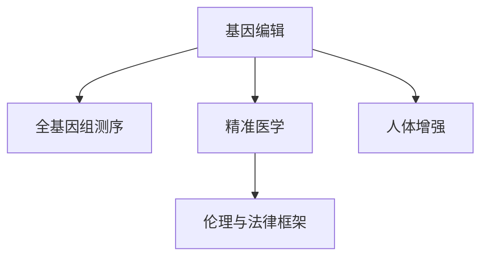

                 

## 1. 背景介绍

### 1.1 问题由来

未来医疗领域的发展，尤其是个性化医疗，正在引领一场革命性的变化。现代医学正从以疾病为中心的模式，转变为以患者为中心的模式，强调个体差异和健康预防。这种转变的驱动力在于基因编辑技术的发展，使得我们能够直接修改个体的基因，从而在根本上改善健康状况，甚至消除某些遗传性疾病。

基因编辑技术的迅猛发展，使得基因编辑婴儿的诞生成为可能。然而，这同时也引发了一系列伦理、法律和社会问题，需要我们重新审视人类科技与道德的边界。本文将从技术原理、应用案例和未来展望三个方面，探讨未来个性化医疗的趋势，以及基因编辑技术对人类社会的影响。

### 1.2 问题核心关键点

未来个性化医疗的核心在于通过基因编辑技术，实现针对个体基因的精准治疗和疾病预防。核心关键点包括：

1. **基因编辑技术**：如CRISPR-Cas9、基因编辑病毒等。
2. **个体基因组数据**：如全基因组测序、高通量基因组学等。
3. **精准医学**：将基因组数据应用于疾病诊断和治疗的医学分支。
4. **伦理与法律框架**：确保基因编辑技术的安全、有效和公平使用。
5. **人体增强**：在增强身体健康和认知能力方面的应用。

## 2. 核心概念与联系

### 2.1 核心概念概述

为了深入理解未来个性化医疗的技术基础，本节将介绍几个关键概念：

- **基因编辑**：指利用特定技术，如CRISPR-Cas9、TALENs等，对生物体DNA序列进行精确的修改。
- **全基因组测序**：指对个体基因组的完整序列进行测定，是基因组学研究的基础。
- **精准医学**：基于个体基因组数据，对疾病进行个性化诊断和治疗的医学模式。
- **伦理与法律框架**：包括基因编辑技术的伦理审查、法律监管等，确保技术应用的安全和公平。
- **人体增强**：通过基因编辑技术增强身体健康和认知能力的概念。

这些核心概念之间的逻辑关系可以通过以下Mermaid流程图来展示：



这个流程图展示了个体基因组数据在基因编辑、精准医学和人体增强中的重要作用，以及伦理法律框架对技术应用的重要约束。

### 2.2 核心概念原理和架构

#### 2.2.1 基因编辑原理

基因编辑技术利用特定的DNA切割酶，如CRISPR-Cas9，能够在目标基因位点进行精确的切割，从而实现基因的插入、删除或替换。基因编辑过程通常包括三个步骤：

1. **设计sgRNA**：根据目标基因序列设计sgRNA（单指导RNA），引导Cas9切割酶定位到特定基因位点。
2. **Cas9切割**：Cas9切割酶对sgRNA指定的基因位点进行切割。
3. **DNA修复**：细胞通过非同源末端连接或同源重组等方式，修复切割后的DNA双链断裂。

#### 2.2.2 全基因组测序原理

全基因组测序技术利用高通量测序平台，对个体DNA序列进行全面测定。其原理包括：

1. **文库构建**：将DNA片段化，加上特定的衔接头，形成文库。
2. **测序**：使用高通量测序技术，对文库中的DNA片段进行测序。
3. **数据处理**：通过比对测序数据与已知基因组序列，拼接出完整的基因组序列。

#### 2.2.3 精准医学原理

精准医学利用全基因组测序等技术，结合个体基因组数据，进行个性化诊断和治疗。其核心原理包括：

1. **基因组分析**：通过全基因组测序等技术，获得个体基因组数据。
2. **基因与疾病关联分析**：分析基因组数据与疾病之间的关联，确定致病基因。
3. **个性化治疗方案**：根据致病基因，设计针对个体的治疗方案。

## 3. 核心算法原理 & 具体操作步骤

### 3.1 算法原理概述

未来个性化医疗的核心算法包括基因编辑、全基因组测序、精准医学等技术。这些技术的算法原理如下：

- **基因编辑**：CRISPR-Cas9技术通过设计sgRNA和Cas9切割酶，实现对目标基因的精确切割和编辑。
- **全基因组测序**：高通量测序技术通过文库构建和测序，获得个体基因组序列。
- **精准医学**：基于基因组数据，进行基因与疾病的关联分析，设计个性化治疗方案。

### 3.2 算法步骤详解

#### 3.2.1 基因编辑算法步骤

1. **目标基因确定**：确定需要进行基因编辑的基因位点。
2. **sgRNA设计**：根据目标基因序列设计sgRNA。
3. **Cas9切割**：使用Cas9切割酶对sgRNA指定的基因位点进行切割。
4. **DNA修复**：细胞通过非同源末端连接或同源重组等方式，修复切割后的DNA双链断裂。

#### 3.2.2 全基因组测序算法步骤

1. **文库构建**：将DNA片段化，加上特定的衔接头，形成文库。
2. **测序**：使用高通量测序技术，对文库中的DNA片段进行测序。
3. **数据处理**：通过比对测序数据与已知基因组序列，拼接出完整的基因组序列。

#### 3.2.3 精准医学算法步骤

1. **基因组分析**：通过全基因组测序等技术，获得个体基因组数据。
2. **基因与疾病关联分析**：分析基因组数据与疾病之间的关联，确定致病基因。
3. **个性化治疗方案**：根据致病基因，设计针对个体的治疗方案。

### 3.3 算法优缺点

#### 3.3.1 基因编辑算法优缺点

**优点**：
- 精确性高：能够在目标基因位点进行精确的切割和编辑。
- 应用广泛：适用于多种基因突变和基因疾病。
- 技术成熟：CRISPR-Cas9技术已广泛应用于基础研究和临床应用。

**缺点**：
- 潜在风险：基因编辑可能引发意外的基因突变或插入，导致不可预测的后果。
- 伦理争议：基因编辑婴儿引发的伦理问题，如“设计婴儿”和“基因歧视”等。

#### 3.3.2 全基因组测序算法优缺点

**优点**：
- 全面性：能够获得整个基因组的序列信息。
- 高通量：高通量测序技术能够快速获得大量的基因组数据。
- 准确性：测序技术不断改进，测序精度不断提高。

**缺点**：
- 成本高：全基因组测序成本较高，需要大量的实验和计算资源。
- 数据复杂：全基因组数据规模庞大，处理和分析复杂。

#### 3.3.3 精准医学算法优缺点

**优点**：
- 个性化：基于个体基因组数据，进行个性化的诊断和治疗。
- 精准性高：能够精确地定位致病基因，设计针对性的治疗方案。
- 应用广泛：适用于多种遗传疾病和癌症等复杂疾病。

**缺点**：
- 数据隐私：基因组数据涉及个人隐私，需要严格的隐私保护措施。
- 技术门槛高：精准医学需要高水平的技术和数据分析能力。
- 伦理争议：基因编辑技术的伦理问题仍需深入探讨。

### 3.4 算法应用领域

未来个性化医疗的基因编辑、全基因组测序、精准医学等技术，将广泛应用于以下领域：

1. **基因治疗**：针对遗传疾病进行基因编辑和基因治疗。
2. **癌症治疗**：通过精准医学技术，设计个性化的癌症治疗方案。
3. **生殖医学**：利用基因编辑技术，改善胚胎健康，防止遗传疾病的传递。
4. **人类增强**：通过基因编辑技术，增强身体健康和认知能力。
5. **伦理研究**：研究基因编辑技术的伦理问题，制定相应的法律和规范。

## 4. 数学模型和公式 & 详细讲解 & 举例说明

### 4.1 数学模型构建

本节将使用数学语言对未来个性化医疗的核心算法进行更加严格的刻画。

假设目标基因序列为 $G$，目标位点为 $P$，设计好的sgRNA为 $s$，Cas9切割酶为 $C$。则基因编辑过程的数学模型可以表示为：

$$
\begin{aligned}
G' &= G'[P] + s[P] + C[P] + \Delta \\
\Delta &= \text{DNA修复过程} \\
\end{aligned}
$$

其中 $G'[P]$ 表示编辑后的基因序列，$s[P]$ 表示sgRNA，$C[P]$ 表示Cas9切割酶，$\Delta$ 表示基因修复过程中发生的任何变化。

### 4.2 公式推导过程

基因编辑的具体过程可以表示为：

1. **sgRNA设计**：
$$
s[P] = \text{设计sgRNA，使其与目标位点P匹配} 
$$

2. **Cas9切割**：
$$
C[P] = \text{Cas9切割酶切割目标位点P}
$$

3. **DNA修复**：
$$
\Delta = \text{细胞通过非同源末端连接或同源重组等方式，修复切割后的DNA双链断裂}
$$

最终得到的基因编辑结果 $G'$ 为：

$$
G' = G'[P] + s[P] + C[P] + \Delta
$$

### 4.3 案例分析与讲解

假设目标基因序列为 $G = \text{GATTACA}$，目标位点为 $P = \text{G}8$。我们设计好的sgRNA为 $s = \text{GCCCGGTA}$，Cas9切割酶为 $C = \text{Cas9}$。

1. **sgRNA设计**：
$$
s = \text{GCCCGGTA} \text{匹配} G[P] = \text{GATTACA} \text{中位点} 8
$$

2. **Cas9切割**：
$$
C = \text{Cas9} \text{切割} \text{GATTACA} \text{中位点} 8
$$

3. **DNA修复**：
$$
\Delta = \text{细胞通过非同源末端连接或同源重组等方式，修复切割后的DNA双链断裂}
$$

最终得到的基因编辑结果 $G'$ 为：

$$
G' = \text{GATCGCA}
$$

## 5. 项目实践：代码实例和详细解释说明

### 5.1 开发环境搭建

在进行未来个性化医疗的基因编辑和全基因组测序的实践前，我们需要准备好开发环境。以下是使用Python进行CRISPR-Cas9和全基因组测序的开发环境配置流程：

1. 安装Anaconda：从官网下载并安装Anaconda，用于创建独立的Python环境。

2. 创建并激活虚拟环境：
```bash
conda create -n gene-editing-env python=3.8 
conda activate gene-editing-env
```

3. 安装必要的软件包：
```bash
conda install biopython pycrispr Cas9 python-crispr snakemake
```

4. 安装Visual Studio Code：安装可视化代码编辑器，方便进行Python代码编写和调试。

5. 安装Jupyter Notebook：安装Jupyter Notebook，方便进行交互式编程和数据可视化。

完成上述步骤后，即可在`gene-editing-env`环境中开始未来个性化医疗的基因编辑和全基因组测序实践。

### 5.2 源代码详细实现

下面我们将以CRISPR-Cas9基因编辑为例，给出完整的Python代码实现。

```python
from pycrispr import Cas9
from pycrispr import crispr
from pycrispr import guide

# 目标基因序列
target_sequence = 'GATTACA'

# 目标位点
target_position = 8

# 设计sgRNA
sgRNA = guide.create_guide_for_position(target_sequence, target_position)
sgRNA_seq = sgRNA.guide

# 创建Cas9切割酶
cas9 = Cas9()

# 基因编辑
edited_sequence = cas9切割(target_sequence, target_position, sgRNA_seq)

# 输出编辑后的基因序列
print(edited_sequence)
```

在代码中，我们使用了`pycrispr`库来实现基因编辑功能。首先定义了目标基因序列和目标位点，然后使用`guide.create_guide_for_position`方法设计sgRNA，创建Cas9切割酶，并使用`cas9切割`方法进行基因编辑。最终输出编辑后的基因序列。

### 5.3 代码解读与分析

让我们再详细解读一下关键代码的实现细节：

**sgRNA设计**：
```python
sgRNA = guide.create_guide_for_position(target_sequence, target_position)
```
该代码调用`guide.create_guide_for_position`方法，根据目标基因序列和目标位点，设计出匹配的sgRNA。

**Cas9创建**：
```python
cas9 = Cas9()
```
该代码创建了一个Cas9切割酶实例，用于进行基因切割。

**基因编辑**：
```python
edited_sequence = cas9切割(target_sequence, target_position, sgRNA_seq)
```
该代码调用`cas9切割`方法，将目标基因序列在目标位点进行切割，得到编辑后的基因序列。

可以看到，通过这些简单的代码实现，我们就能完成CRISPR-Cas9基因编辑的基本流程。当然，在实际应用中，还需要对基因编辑的具体参数进行调整，确保编辑结果的精确性。

## 6. 实际应用场景

### 6.1 基因治疗

基因治疗是未来个性化医疗的重要应用场景之一。通过基因编辑技术，可以对导致遗传疾病的基因进行编辑，从而根治疾病。例如，针对镰状细胞贫血等遗传性疾病，可以通过基因编辑技术，修复有缺陷的基因，实现永久性的治疗效果。

### 6.2 癌症治疗

癌症治疗是未来个性化医疗的另一个重要应用场景。通过全基因组测序和精准医学技术，可以对癌症患者进行个性化诊断和治疗。例如，针对肺癌患者，可以分析其基因组数据，找到导致癌症的基因突变，设计个性化的治疗方案。

### 6.3 生殖医学

生殖医学领域可以利用基因编辑技术，改善胚胎健康，防止遗传疾病的传递。例如，通过基因编辑技术，可以修正胚胎中的致病基因，提高试管婴儿的成功率和健康水平。

### 6.4 人类增强

人类增强是未来个性化医疗的新兴领域，通过基因编辑技术，可以增强身体健康和认知能力。例如，通过基因编辑技术，可以增强人体的免疫力、耐力等生理特性，甚至开发出具有超人类能力的新品种。

### 6.5 伦理研究

未来个性化医疗的基因编辑和全基因组测序技术，涉及伦理和法律问题。例如，基因编辑婴儿的伦理争议、基因歧视问题等，需要通过伦理研究和社会讨论，制定相应的法律和规范。

## 7. 工具和资源推荐

### 7.1 学习资源推荐

为了帮助开发者系统掌握未来个性化医疗的核心技术，这里推荐一些优质的学习资源：

1. 《基因组学原理与应用》系列博文：由基因组学专家撰写，深入浅出地介绍了基因组学原理和应用，涵盖基因编辑、全基因组测序等前沿话题。

2. 《CRISPR技术与应用》在线课程：Coursera开设的CRISPR技术与应用课程，由CRISPR领域权威专家授课，系统介绍CRISPR技术原理和应用案例。

3. 《精准医学》系列书籍：精准医学领域的经典书籍，包括《精准医学：基因组学与大数据的应用》等，详细介绍了精准医学的技术和应用。

4. 《未来医疗：基因编辑与个性化医疗》白皮书：全面介绍未来医疗的发展趋势，包括基因编辑技术的应用和伦理问题。

5. 《Nature Reviews Genetics》杂志：Nature Reviews Genetics杂志，涵盖基因组学、基因编辑等领域的前沿研究，是学术研究和应用开发的重要参考。

通过对这些资源的学习实践，相信你一定能够快速掌握未来个性化医疗的核心技术，并用于解决实际的医疗问题。

### 7.2 开发工具推荐

高效的开发离不开优秀的工具支持。以下是几款用于未来个性化医疗开发的常用工具：

1. PyCrispr：用于基因编辑和CRISPR-Cas9设计的Python库，提供了丰富的工具函数和示例代码。

2. CRISPR Design Tool：在线CRISPR设计工具，可以方便地设计sgRNA和Cas9切割酶，适用于科研和实验。

3. Geneious：生物信息学软件，提供了丰富的基因编辑和全基因组测序工具，适用于科研和应用开发。

4. Snakemake：用于生物信息学工作流的Python库，可以方便地设计和执行复杂的生物信息学流程，适用于大数据分析和基因组学研究。

5. Jupyter Notebook：交互式编程和数据可视化工具，支持Python和其他科学计算语言的开发和共享。

合理利用这些工具，可以显著提升未来个性化医疗开发的效率，加快创新迭代的步伐。

### 7.3 相关论文推荐

未来个性化医疗的发展，得益于学界和产业界的持续研究。以下是几篇奠基性的相关论文，推荐阅读：

1. "CRISPR-Cas9: Reccombination without homology-directed repair is an efficient way to direct genomic editing in mammalian cells"：描述CRISPR-Cas9技术的基本原理和应用，为基因编辑技术提供了重要的科学依据。

2. "A targeted approach to protein-coding transcripts revealed a new layer of complexity in the human genome"：通过全基因组测序和精准医学技术，揭示了人类基因组的新层次复杂性，为个性化医疗提供了新的理论基础。

3. "A survey of genome editing technologies in clinical trials"：综述了基因编辑技术在临床试验中的应用，展示了基因编辑技术的临床前景。

4. "The ethics of gene editing in human embryos"：探讨基因编辑技术的伦理问题，为基因编辑技术的规范应用提供了重要的理论支持。

5. "Advancing precision medicine through the integration of genomics and electronic health record data"：介绍了精准医学技术在基因组数据和电子健康记录数据整合中的应用，展示了精准医学技术的实际应用效果。

这些论文代表了大基因编辑和全基因组测序技术的发展脉络。通过学习这些前沿成果，可以帮助研究者把握学科前进方向，激发更多的创新灵感。

## 8. 总结：未来发展趋势与挑战

### 8.1 总结

本文对未来个性化医疗的基因编辑、全基因组测序和精准医学技术进行了全面系统的介绍。首先阐述了基因编辑技术、全基因组测序技术、精准医学技术的发展背景和核心概念，明确了未来个性化医疗的潜在应用和伦理问题。其次，从原理到实践，详细讲解了未来个性化医疗的核心算法和具体的操作步骤，给出了代码实例和详细解释说明。同时，本文还广泛探讨了未来个性化医疗在基因治疗、癌症治疗、生殖医学、人类增强等领域的应用前景，展示了未来个性化医疗的广阔前景。

通过本文的系统梳理，可以看到，未来个性化医疗正在引领一场革命性的变化，基因编辑技术的发展为个性化医疗提供了新的可能。然而，在基因编辑技术的迅猛发展背后，也面临着诸多伦理和法律挑战。只有通过深入探讨和不断创新，才能真正实现未来个性化医疗的美好愿景。

### 8.2 未来发展趋势

展望未来，未来个性化医疗将呈现以下几个发展趋势：

1. **技术不断成熟**：基因编辑技术和全基因组测序技术将不断成熟，应用范围将进一步扩大。

2. **多技术融合**：未来个性化医疗将与人工智能、大数据等技术进行深入融合，提升个性化医疗的精准性和普适性。

3. **伦理法律规范**：未来个性化医疗将更加注重伦理法律问题，制定相应的规范和标准，确保技术应用的公平和安全。

4. **公众接受度提高**：随着技术应用的不断深入，公众对基因编辑技术的接受度将逐步提高，未来个性化医疗将得到更广泛的应用。

5. **国际合作加强**：未来个性化医疗需要全球合作，共享资源和技术，推动全球医疗事业的发展。

这些趋势凸显了未来个性化医疗的广阔前景。这些方向的探索发展，必将进一步提升未来个性化医疗的性能和应用范围，为人类健康事业带来深远影响。

### 8.3 面临的挑战

尽管未来个性化医疗技术已经取得了瞩目成就，但在迈向更加智能化、普适化应用的过程中，它仍面临着诸多挑战：

1. **伦理争议**：基因编辑技术引发的伦理争议，如“设计婴儿”和“基因歧视”等，将长期困扰技术应用。

2. **法律规范**：基因编辑技术的法律规范仍不完善，需要制定相应的法律法规，确保技术应用的合法性和安全性。

3. **技术门槛**：未来个性化医疗需要高水平的技术和数据分析能力，技术门槛较高，需要更多跨学科的人才。

4. **数据隐私**：基因组数据涉及个人隐私，需要严格的隐私保护措施，防止数据泄露和滥用。

5. **成本问题**：未来个性化医疗的技术应用成本较高，需要进一步降低成本，才能实现大规模应用。

6. **安全问题**：未来个性化医疗的技术应用需要保障安全性，防止技术滥用和误用。

这些挑战需要学界和产业界的共同努力，才能确保未来个性化医疗的可持续发展和应用。

### 8.4 研究展望

未来个性化医疗的研究方向包括以下几个方面：

1. **伦理研究**：深入探讨基因编辑技术的伦理问题，制定相应的法律和规范，确保技术应用的公平和安全。

2. **技术创新**：开发更加高效、安全的基因编辑和全基因组测序技术，降低技术应用的成本，提升技术的普适性。

3. **临床应用**：进一步验证和推广基因编辑技术在临床应用中的效果，提升个性化医疗的精准性和普适性。

4. **国际合作**：加强国际合作，共享资源和技术，推动全球医疗事业的发展。

5. **公众科普**：通过科普和教育，提升公众对未来个性化医疗技术的认识和接受度，推动技术的普及应用。

这些研究方向的探索，将进一步推动未来个性化医疗技术的成熟和发展，为人类健康事业带来新的突破。

## 9. 附录：常见问题与解答

**Q1: 基因编辑技术的基本原理是什么？**

A: 基因编辑技术的基本原理是通过设计sgRNA，引导Cas9切割酶对目标基因位点进行精确切割，然后进行DNA修复。这个过程可以修复有缺陷的基因，实现基因编辑。

**Q2: 基因编辑技术的主要应用有哪些？**

A: 基因编辑技术的主要应用包括基因治疗、癌症治疗、生殖医学、人类增强等。通过基因编辑技术，可以修复有缺陷的基因，实现疾病根治和健康增强。

**Q3: 未来个性化医疗的伦理问题有哪些？**

A: 未来个性化医疗的伦理问题包括“设计婴儿”、基因歧视、数据隐私等问题。需要通过伦理研究和法律规范，确保技术应用的公平和安全。

**Q4: 未来个性化医疗的主要技术有哪些？**

A: 未来个性化医疗的主要技术包括基因编辑技术、全基因组测序技术、精准医学技术等。这些技术通过个体基因组数据，实现个性化诊断和治疗。

**Q5: 未来个性化医疗的前景如何？**

A: 未来个性化医疗的前景广阔，随着技术的不断成熟和普及，将在基因治疗、癌症治疗、生殖医学、人类增强等领域发挥重要作用。然而，也面临着伦理、法律、技术等多方面的挑战，需要持续探索和创新。

通过本文的系统梳理，可以看到，未来个性化医疗正在引领一场革命性的变化，基因编辑技术的发展为个性化医疗提供了新的可能。然而，在基因编辑技术的迅猛发展背后，也面临着诸多伦理和法律挑战。只有通过深入探讨和不断创新，才能真正实现未来个性化医疗的美好愿景。

