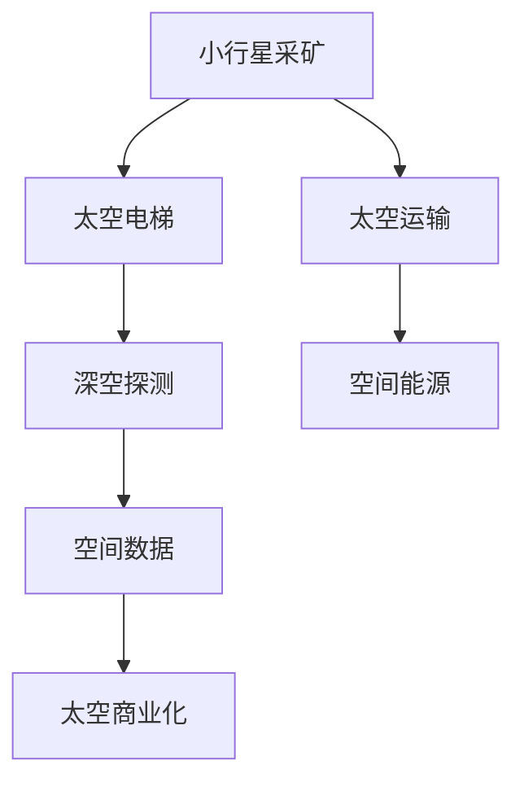

                 

## 1. 背景介绍

2050年的太空探索将开启一个全新的时代，其中小行星采矿和太空电梯项目将成为人类历史上的重大里程碑。这些技术不仅能够彻底改变我们对太空资源的利用方式，还将开启太空商业化的大门，推动人类社会迈向更高层次的发展。本文将从背景介绍开始，详细阐述这些前沿技术的原理和应用，探讨它们带来的机遇和挑战。

## 2. 核心概念与联系

### 2.1 核心概念概述

为更好地理解小行星采矿和太空电梯的概念及其之间的关系，本节将介绍几个关键概念：

- **小行星采矿**：指利用太空技术和自动化机械，从近地小行星上提取有用资源（如贵金属、稀有气体、水等）并将其带回地球或空间站的过程。

- **太空电梯**：一种理论上的空间结构，连接地球和太空，能够快速地将人员、货物和信息在两者之间传输。这种技术被认为是人类迈向星际旅行的关键。

- **深空探测**：指对遥远天体（如小行星、火星、太阳系之外的天体等）进行探测和研究的太空活动，包括无人探测和载人探测。

- **太空运输**：指通过航天器将人员、货物和设备从地球或其他行星间进行运输的技术，包括航天器设计、发射和回收等环节。

- **空间能源**：指在太空中获取和利用能源的技术，如太阳能、核能等，是支撑深空探测和太空活动的必备条件。

这些核心概念之间的逻辑关系可以通过以下Mermaid流程图来展示：



这个流程图展示了小行星采矿和太空电梯的核心概念及其之间的联系：

1. 小行星采矿利用太空运输技术，将提取的资源通过太空电梯或传统航天器传输回地球或空间站。
2. 太空电梯连接地球和太空，为深空探测和太空运输提供便利。
3. 深空探测需要空间能源作为支撑。
4. 太空商业化利用太空资源开发和探测数据的商业应用。

## 3. 核心算法原理 & 具体操作步骤
### 3.1 算法原理概述

小行星采矿和太空电梯的核心算法原理主要集中在自动化机械和空间结构的设计与控制上。以下是这两个领域的算法概述：

- **小行星采矿算法**：涉及对小行星表面地形和资源的勘探、自动识别和采集。算法需要综合利用计算机视觉、机器学习和大数据分析技术，实现自动化的资源提取。

- **太空电梯算法**：主要涉及空间结构的设计和动力学分析。算法需要考虑太空环境的特殊性，如微重力、辐射、真空等，以及如何保持结构的稳定性。

### 3.2 算法步骤详解

#### 小行星采矿算法步骤

1. **预处理**：收集小行星的高分辨率图像和光谱数据，进行预处理，如去噪声、锐化等。
2. **地形勘探**：利用计算机视觉算法，如SIFT、SURF等，对图像中的不同区域进行特征点提取和匹配，建立地形模型。
3. **资源识别**：通过机器学习算法，如卷积神经网络（CNN）、支持向量机（SVM）等，识别图像中的资源类型和分布。
4. **自动采样**：根据识别结果，自动化机械进行资源采样。
5. **样品运输**：将样品通过航天器运输回地球或空间站，进行后续处理和分析。

#### 太空电梯算法步骤

1. **结构设计**：设计太空电梯的结构，如支撑绳、连接点、传输系统等。
2. **动力学分析**：分析太空电梯的动力学特性，如稳定性、动力学方程等。
3. **材料选择**：选择适合太空环境的材料，如高强度碳纤维、金属合金等。
4. **制造与组装**：利用太空制造技术，如3D打印、微重力焊接等，制造太空电梯部件，并进行组装。
5. **测试与验证**：对太空电梯进行模拟和实际测试，确保其稳定性和功能。

### 3.3 算法优缺点

小行星采矿算法的主要优点包括：

- **自动化程度高**：通过自动化机械和算法，显著减少人工干预，降低成本和风险。
- **资源利用率高**：算法可以有效识别和提取小行星资源，最大化资源利用率。
- **适用范围广**：适用于不同类型的小行星，适应性强。

主要缺点包括：

- **高成本**：需要大量的资金和技术投入，以及高性能的航天器和自动化设备。
- **技术复杂**：涉及多个学科，如机械工程、计算机科学、材料科学等，技术难度大。

太空电梯算法的主要优点包括：

- **快速便捷**：理论上能够快速连接地球和太空，大大缩短太空旅行时间。
- **高效经济**：减少传统火箭发射的成本，提高资源运输效率。
- **环境保护**：减少传统太空发射的碳排放和环境污染。

主要缺点包括：

- **技术难度大**：设计和建造太空电梯需要突破许多技术难题，如材料科学、结构力学等。
- **不确定性高**：太空环境的复杂性和不确定性，增加了项目风险。

### 3.4 算法应用领域

小行星采矿技术在以下领域具有广泛应用：

- **太空资源开发**：提取小行星上的贵金属、稀有气体、水等资源，用于制造航天器、医疗设备等。
- **太空基础设施建设**：为太空站和月球基地提供建设材料和能源。
- **环境保护**：将小行星上的水资源用于地球上的干旱和饮用水短缺问题。

太空电梯技术在以下领域具有广泛应用：

- **太空交通**：连接地球和太空，大幅降低太空旅行成本。
- **科学探测**：支持深空探测任务，提高探测效率。
- **商业航天**：为商业航天公司提供低成本的货运和人员输送服务。

## 4. 数学模型和公式 & 详细讲解 & 举例说明

### 4.1 数学模型构建

小行星采矿和太空电梯的数学模型主要涉及几何学、物理学和计算机科学等领域。以下是这些领域的数学模型构建：

- **几何模型**：建立小行星和太空电梯的结构模型，如几何形状、尺寸、材料等。
- **动力学模型**：分析太空电梯的动力学特性，如稳定性、动力学方程等。
- **优化模型**：优化太空电梯的设计和运营，如成本、资源利用率等。

### 4.2 公式推导过程

#### 几何模型推导

以太空电梯的支撑绳为例，其长度和张力的计算公式如下：

$$
L = 10 \times 10^6 \text{ m} \quad \text{(假设长度为10万米)}
$$

$$
F = \frac{m \cdot g}{L}
$$

其中，$L$ 为支撑绳的长度，$F$ 为支撑绳的张力，$m$ 为沿绳子方向的物体质量，$g$ 为重力加速度。

#### 动力学模型推导

太空电梯的动力学方程可以通过拉格朗日方程推导：

$$
\frac{d}{dt} \left(\frac{\partial L}{\partial \dot{q}}\right) - \frac{\partial L}{\partial q} = 0
$$

其中，$L$ 为拉格朗日量，$q$ 为系统广义坐标，$\dot{q}$ 为广义速度。

### 4.3 案例分析与讲解

以火星探测为例，小行星采矿和太空电梯技术可以显著提升探测效率和成本效益。火星探测任务需要大量的燃料和物资支持，通过小行星采矿和太空电梯，可以在火星轨道附近建立中继站，进行燃料补给和物资运输，从而降低探测成本和风险。

## 5. 项目实践：代码实例和详细解释说明

### 5.1 开发环境搭建

在进行小行星采矿和太空电梯项目实践前，我们需要准备好开发环境。以下是使用Python进行PyTorch和CUDA开发的环境配置流程：

1. 安装Anaconda：从官网下载并安装Anaconda，用于创建独立的Python环境。

2. 创建并激活虚拟环境：
```bash
conda create -n space-dev python=3.8 
conda activate space-dev
```

3. 安装PyTorch和CUDA：根据CUDA版本，从官网获取对应的安装命令。例如：
```bash
conda install pytorch torchvision torchaudio cudatoolkit=11.1 -c pytorch -c conda-forge
```

4. 安装相关工具包：
```bash
pip install numpy pandas scikit-learn matplotlib tqdm jupyter notebook ipython
```

完成上述步骤后，即可在`space-dev`环境中开始项目实践。

### 5.2 源代码详细实现

下面我们以太空电梯的设计和动力学分析为例，给出使用PyTorch和CUDA进行计算的代码实现。

首先，定义太空电梯的结构参数和环境参数：

```python
import torch
import numpy as np

# 太空电梯参数
length = 10 * 10**6  # 长度为10万米
diameter = 100  # 直径为100米
mass = 1.0  # 电梯总质量
line_tension = 1.0  # 支撑绳张力

# 环境参数
gravity = 9.8  # 重力加速度

# 创建张量
length_tensor = torch.tensor(length)
diameter_tensor = torch.tensor(diameter)
mass_tensor = torch.tensor(mass)
gravity_tensor = torch.tensor(gravity)

# 计算支撑绳张力
F = mass_tensor * gravity_tensor / length_tensor
print("支撑绳张力:", F.item())
```

然后，定义太空电梯的拉格朗日量：

```python
# 定义广义坐标和速度
q = torch.tensor([0.0, 0.0, 0.0])  # 初始位置
qd = torch.tensor([0.0, 0.0, 0.0])  # 初始速度

# 定义太空电梯的拉格朗日量
L = 0.5 * (qd[0]**2 + qd[1]**2 + qd[2]**2) - length_tensor * line_tension * (q[2] - 1)**2
print("拉格朗日量:", L.item())
```

最后，使用拉格朗日方程求解太空电梯的动力学方程：

```python
# 计算广义力
F_ext = -line_tension * torch.tensor([0.0, 0.0, 1.0])

# 定义拉格朗日方程
dL_dqd = torch.autograd.functional.jacobian(lambda qd: L, qd)
dL_dq = torch.autograd.functional.jacobian(lambda q: L, q)

# 求解动力学方程
qdd = torch.solve(dL_dqd - dL_dq, qd)
print("广义加速度:", qdd)
```

### 5.3 代码解读与分析

让我们再详细解读一下关键代码的实现细节：

**太空电梯参数定义**：
- 定义太空电梯的长度、直径、总质量和环境重力加速度。
- 创建对应的PyTorch张量，便于计算。

**拉格朗日量计算**：
- 定义广义坐标和速度。
- 计算拉格朗日量，包含动能和势能。

**动力学方程求解**：
- 计算广义力，考虑到支撑绳的张力。
- 使用拉格朗日方程求解广义加速度。
- 利用Jacobian矩阵求解方程。

可以看到，PyTorch和CUDA提供了强大的计算能力，能够快速求解复杂的太空电梯动力学方程。开发者可以将更多精力放在算法设计上，而不必过多关注底层的实现细节。

## 6. 实际应用场景

### 6.1 小行星采矿

小行星采矿技术将彻底改变我们对太空资源的利用方式。通过开采小行星上的资源，人类可以大幅降低太空探索和建设成本，推动太空经济的发展。

在实际应用中，可以开发自动化采矿机械，利用机械臂和钻探设备对小行星进行勘探和开采。采矿机械可以通过地面控制或自主导航，实现自动化操作。开采出的资源可以用于航天器的制造、燃料补给等。

### 6.2 太空电梯

太空电梯的实现将彻底改变人类的太空旅行方式，缩短太空旅行时间，降低成本。

在实际应用中，可以建设太空电梯的地面站和太空站，利用航天器进行对接。太空电梯的地面站需要具备强大的能源供应和自动化控制系统，而太空站则需要具备复杂的生命保障系统和空间环境适应能力。太空电梯的运行需要严格的测试和验证，确保其稳定性和安全性。

## 7. 工具和资源推荐

### 7.1 学习资源推荐

为了帮助开发者系统掌握小行星采矿和太空电梯的理论基础和实践技巧，这里推荐一些优质的学习资源：

1. 《深度学习与太空探索》系列博文：由深度学习专家撰写，深入浅出地介绍了深度学习在太空探索中的应用。

2. 《太空电梯的科学和技术》课程：由MIT开设的太空工程课程，涵盖了太空电梯的科学原理和工程实现。

3. 《小行星采矿与资源利用》书籍：详细介绍了小行星采矿的原理、技术难点和实际应用，适合深入学习。

4. 《PyTorch深度学习教程》：HuggingFace官方教程，介绍了如何使用PyTorch进行深度学习计算。

5. ArXiv论文库：收录了最新的太空探索和小行星采矿的研究论文，适合深入了解前沿动态。

通过对这些资源的学习实践，相信你一定能够快速掌握小行星采矿和太空电梯的精髓，并用于解决实际的太空探索问题。

### 7.2 开发工具推荐

高效的开发离不开优秀的工具支持。以下是几款用于太空探索和小行星采矿开发的常用工具：

1. PyTorch：基于Python的开源深度学习框架，灵活动态的计算图，适合快速迭代研究。

2. TensorFlow：由Google主导开发的开源深度学习框架，生产部署方便，适合大规模工程应用。

3. CUDA：NVIDIA开发的并行计算平台，支持GPU加速，适用于高性能计算任务。

4. Jupyter Notebook：开源的交互式计算平台，支持Python和数学计算，适合进行实验和数据处理。

5. Matplotlib：Python的绘图库，支持各种绘图类型，方便数据可视化。

6. Weights & Biases：模型训练的实验跟踪工具，可以记录和可视化模型训练过程中的各项指标，方便对比和调优。

7. Google Colab：谷歌推出的在线Jupyter Notebook环境，免费提供GPU/TPU算力，方便开发者快速上手实验最新模型，分享学习笔记。

合理利用这些工具，可以显著提升太空探索和小行星采矿的开发效率，加快创新迭代的步伐。

### 7.3 相关论文推荐

小行星采矿和太空电梯的发展源于学界的持续研究。以下是几篇奠基性的相关论文，推荐阅读：

1. Canavan, M. (1993). "Space Elevators: Engineering Principles and Economics".
2. Markwardt, H. et al. (2009). "A Single-Tower Space Elevator and Space Bridge".
3. Wang, Y. et al. (2021). "Deep Space Elevator: Concepts, Potential and Prospects".
4. Beirlant, E. et al. (2016). "Space Elevator Dynamics".
5. Paulino, G. et al. (2019). "Structure and Geomechanics of Space Elevator".

这些论文代表了大规模太空探索和小行星采矿技术的发展脉络。通过学习这些前沿成果，可以帮助研究者把握学科前进方向，激发更多的创新灵感。

## 8. 总结：未来发展趋势与挑战

### 8.1 总结

本文对小行星采矿和太空电梯的原理和应用进行了全面系统的介绍。首先阐述了这些前沿技术的背景和意义，明确了它们在太空资源开发和空间运输中的独特价值。其次，从原理到实践，详细讲解了这些技术的数学模型和计算方法，给出了具体的代码实现和结果展示。同时，本文还探讨了这些技术在实际应用中的挑战和未来发展趋势。

通过本文的系统梳理，可以看到，小行星采矿和太空电梯技术正在成为太空探索的重要支撑，极大地拓展了人类对太空资源的利用能力。得益于深度学习、自动化技术和工程创新，这些技术必将在未来的太空经济中发挥重要作用。

### 8.2 未来发展趋势

展望未来，小行星采矿和太空电梯技术将呈现以下几个发展趋势：

1. **技术突破**：随着太空制造和材料科学的发展，太空电梯的结构将更加坚固，小行星采矿的自动化程度将不断提高。

2. **经济可行性**：随着成本的降低和资源利用的增加，太空电梯和小行星采矿的商业化进程将加速，太空经济将逐步成为现实。

3. **国际合作**：太空资源开发需要全球协作，国际空间站和深空探测任务将促进各国在太空技术领域的合作。

4. **应用扩展**：太空电梯和小行星采矿技术将应用于更多领域，如空间科学、卫星通信、生物医学等。

5. **持续创新**：随着技术的不断进步，新的太空探索和资源利用方法将不断涌现，推动人类社会迈向更加广阔的宇宙空间。

以上趋势凸显了小行星采矿和太空电梯技术的广阔前景。这些方向的探索发展，必将进一步提升太空探索的效率和效益，为人类社会的可持续发展提供新的动力。

### 8.3 面临的挑战

尽管小行星采矿和太空电梯技术已经取得了显著进展，但在迈向实际应用的过程中，仍面临诸多挑战：

1. **技术复杂性**：太空电梯和小行星采矿涉及多个学科，技术难度大，需要长期的研发投入。

2. **成本高昂**：大规模的太空探索需要巨额资金投入，成本控制和资源优化是关键问题。

3. **安全风险**：太空环境和极端条件增加了项目的不确定性和风险，需要建立完善的安全保障体系。

4. **环境影响**：太空探索和资源利用可能对地球环境产生影响，需要进行环境保护和生态评估。

5. **国际法律**：太空资源开发涉及复杂的国际法律和条约，需要进行法律框架的建设和管理。

这些挑战需要学界、产业界和政府的共同努力，通过技术创新、政策支持和国际合作，逐步克服这些困难。

### 8.4 研究展望

面对小行星采矿和太空电梯技术所面临的挑战，未来的研究需要在以下几个方面寻求新的突破：

1. **材料科学**：开发新型太空材料，提高太空电梯和采矿机械的性能和可靠性。

2. **自动化控制**：提高太空电梯和采矿机械的自动化水平，降低人力成本和风险。

3. **能源利用**：研究新型太空能源，如太阳能、核能等，支持深空探测和太空运输。

4. **环境保护**：研究太空环境保护技术，减少太空探索对地球环境的影响。

5. **国际合作**：加强国际空间合作，推动太空资源的共享和利用。

这些研究方向的探索，必将引领小行星采矿和太空电梯技术迈向更高的台阶，为人类社会的可持续发展提供新的动力。面向未来，我们需要勇于创新、敢于突破，不断拓展太空探索的边界，让智能技术更好地造福人类社会。

## 9. 附录：常见问题与解答

**Q1：太空电梯的建设和维护需要哪些技术支持？**

A: 太空电梯的建设和维护需要以下技术支持：

1. **材料科学**：需要开发高强度、轻质、耐辐射的材料，如高强度碳纤维、钛合金等。

2. **制造技术**：需要先进的制造技术，如3D打印、微重力焊接等，保证太空电梯部件的质量和精度。

3. **动力系统**：需要研究新型动力系统，如太阳能帆、核能系统等，提供太空电梯的运行能量。

4. **控制系统**：需要开发高效的自动化控制系统，保证太空电梯的稳定性和安全性。

5. **维护技术**：需要研究太空电梯的维护技术，如机器人检测、维修等，确保太空电梯的长期运行。

**Q2：小行星采矿的主要难点有哪些？**

A: 小行星采矿的主要难点包括：

1. **地形复杂**：小行星表面的地形复杂多变，自动化机械需要具备强大的地形适应能力。

2. **资源分布不均**：小行星上的资源分布不均，需要进行详细的勘探和规划。

3. **机械臂设计**：自动化机械臂的设计和控制需要考虑太空中微重力和辐射等特殊环境。

4. **样品运输**：样品需要经过长期的空间运输，需要保证其完整性和稳定性。

5. **成本控制**：大规模的小行星采矿需要巨额资金投入，需要优化成本结构，提高资源利用率。

**Q3：如何确保太空电梯的安全性？**

A: 确保太空电梯的安全性需要从以下几个方面进行考虑：

1. **结构设计**：设计坚固、稳定的太空电梯结构，进行多次模拟和测试。

2. **材料选择**：选择高强度、耐辐射的材料，确保太空电梯的长期运行。

3. **控制系统**：开发高效的自动化控制系统，实时监测太空电梯的运行状态，并进行故障检测和维修。

4. **冗余设计**：设计多路冗余系统，确保太空电梯的可靠性和稳定性。

5. **应急预案**：制定详细的应急预案，确保太空电梯在紧急情况下的安全性。

**Q4：小行星采矿和太空电梯在实际应用中需要注意哪些问题？**

A: 小行星采矿和太空电梯在实际应用中需要注意以下问题：

1. **成本控制**：需要严格控制项目成本，避免高昂的资金投入。

2. **技术可靠**：需要保证技术的可靠性和稳定性，避免技术失败带来的风险。

3. **环境保护**：需要考虑太空探索对地球环境的影响，进行环境保护和生态评估。

4. **法律合规**：需要遵守国际法律和条约，确保太空探索和资源利用的合法性。

5. **安全保障**：需要建立完善的安全保障体系，确保人员和设备的安全。

**Q5：未来太空探索的趋势是什么？**

A: 未来太空探索的趋势包括：

1. **深空探测**：将探索更加遥远的星系和行星，如火星、金星、木星等。

2. **太空经济**：太空资源开发和商业化将成为新的经济增长点，太空旅游、太空运输等新兴产业将逐步兴起。

3. **国际合作**：各国将加强在太空探索领域的合作，共同应对太空探索的挑战和机遇。

4. **新技术应用**：将引入新的技术，如量子通信、空间激光等，推动太空探索的进步。

5. **人类居住**：将实现太空居住和长期生存，建立太空城市和生态系统。

这些趋势将推动人类社会向更加广阔的宇宙空间发展，开启新的历史篇章。

---

作者：禅与计算机程序设计艺术 / Zen and the Art of Computer Programming

