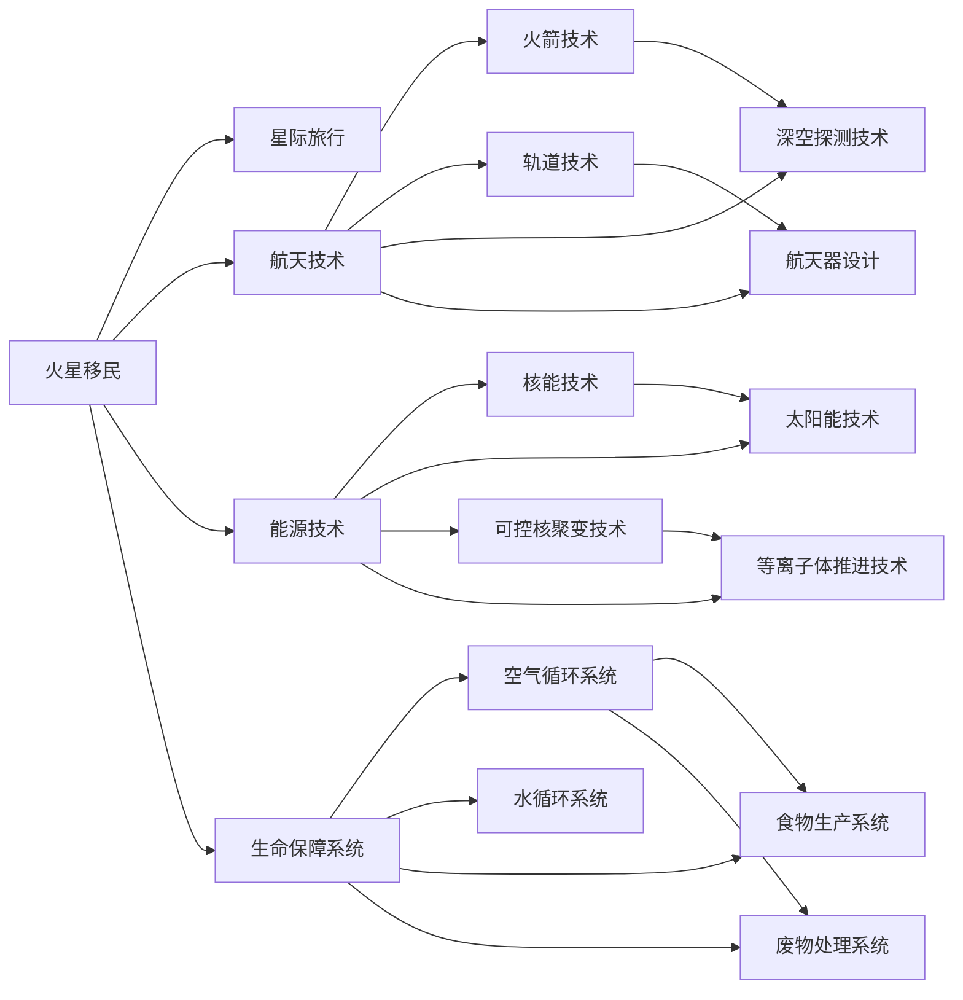

                 

## 1. 背景介绍

随着科技的不断进步和人类对宇宙的好奇心不断增强，太空探索已经从一个遥不可及的梦想逐渐变成一个现实可行的目标。特别是近年来，各国航天机构和私营企业都在积极推进火星移民和星际旅行的项目，希望在未来的几十年内实现人类的星际跨越。

本文章将围绕这一主题，探讨2050年火星移民和星际旅行的技术挑战、路径选择以及未来前景。

## 2. 核心概念与联系

### 2.1 核心概念概述

- **火星移民**：指将人类长期定居在火星上的过程，包括从地球到火星的运输、火星表面的建设和改造、生活保障系统建设、生物循环系统的建立、火星资源的利用等。
- **星际旅行**：指人类从地球出发，前往其他恒星系统或行星，并返回地球的过程，包括飞行器设计、推进系统、生命保障系统、能源获取与利用、导航与定位等。
- **航天技术**：包括火箭技术、轨道技术、深空探测技术、航天器设计、太阳能帆板、等离子推进器等。
- **能源技术**：包括核能技术、太阳能技术、可控核聚变技术、等离子体推进技术等。
- **生命保障系统**：包括空气循环系统、水循环系统、食物生产系统、废物处理系统等。

### 2.2 核心概念原理和架构的 Mermaid 流程图



## 3. 核心算法原理 & 具体操作步骤

### 3.1 算法原理概述

火星移民和星际旅行的技术实现，涉及多个领域的技术集成和应用。主要包括火箭技术、航天器设计、推进系统、生命保障系统等。其核心算法原理涉及以下几个方面：

1. **航天器设计与仿真**：使用计算机辅助设计(CAD)和仿真软件，进行航天器设计的优化和验证。
2. **推进系统优化**：基于流体动力学、热力学等原理，优化推进系统的效率和可靠性。
3. **生命保障系统的集成**：基于系统工程方法，集成各种生命保障子系统，确保长期在轨和火星表面生存的可能性。
4. **路径规划与导航**：使用精确的天文数据和先进的导航算法，实现星际旅行的精确路径规划和导航。

### 3.2 算法步骤详解

#### 3.2.1 航天器设计与仿真

1. **需求分析**：明确航天器的任务目标、性能要求、载荷需求等。
2. **设计方案制定**：制定多个设计方案，并进行多学科交叉的性能分析。
3. **仿真验证**：使用多体动力学仿真软件，如ADAMS或MATLAB/Simulink，进行飞行和载荷仿真。
4. **优化与迭代**：根据仿真结果，对设计方案进行优化和迭代。
5. **实验验证**：通过地面实验和在轨测试，验证设计方案的可行性。

#### 3.2.2 推进系统优化

1. **推进系统选择**：根据任务要求，选择合适的推进系统，如化学火箭、离子推进器、核热推进器等。
2. **参数优化**：优化推进系统的关键参数，如比冲、推力、燃料效率等。
3. **热力学分析**：进行热力学分析，确保推进系统的热稳定性。
4. **仿真验证**：使用仿真软件，如GAMLSS或GRECO，进行推进系统的仿真和优化。
5. **迭代优化**：根据仿真结果，进行多次迭代优化。

#### 3.2.3 生命保障系统的集成

1. **系统需求分析**：明确生命保障系统的功能需求和性能指标。
2. **系统设计**：设计多个子系统，如空气循环系统、水循环系统、食物生产系统、废物处理系统等。
3. **集成验证**：使用系统工程方法，集成各子系统，并进行系统级的性能验证。
4. **仿真优化**：使用仿真软件，如AMESim或GSLV，进行系统的仿真和优化。
5. **实验验证**：通过地面实验和在轨测试，验证生命保障系统的可行性。

#### 3.2.4 路径规划与导航

1. **初始路径规划**：基于天文数据，使用天文学软件，如CASA或Stellarium，进行初始路径规划。
2. **精确导航算法**：基于精确的天文测量数据，使用导航算法，如GPS、惯性导航、天文导航等。
3. **路径优化**：根据任务要求，优化路径，如最小化能源消耗、避免辐射带等。
4. **仿真验证**：使用仿真软件，如STK或MATLAB/Simulink，进行路径规划的仿真和验证。
5. **迭代优化**：根据仿真结果，进行多次迭代优化。

### 3.3 算法优缺点

#### 3.3.1 优点

1. **多学科交叉**：集成航天、工程、物理学等多个学科的知识，提高系统设计的科学性和可行性。
2. **仿真与实验验证**：通过仿真和实验验证，提高设计的可靠性和精度。
3. **迭代优化**：多次迭代优化，逐步提升系统的性能和可靠性。

#### 3.3.2 缺点

1. **复杂度高**：涉及多个领域的技术集成，设计和验证过程复杂。
2. **成本高**：涉及高精度的设备和技术，开发和验证成本较高。
3. **风险高**：任何环节的失误都可能导致整个项目的失败。

### 3.4 算法应用领域

火星移民和星际旅行的核心算法主要应用于以下几个领域：

- **航天器设计与仿真**：如火箭的设计与仿真、星际飞船的设计与仿真。
- **推进系统优化**：如化学推进系统的优化、核推进系统的优化。
- **生命保障系统的集成**：如空气循环系统的设计、废物处理系统的设计。
- **路径规划与导航**：如星际路径的规划、精确导航算法的设计。

## 4. 数学模型和公式 & 详细讲解

### 4.1 数学模型构建

在火星移民和星际旅行中，数学模型主要应用于推进系统优化和路径规划与导航。以下是两个典型的数学模型：

#### 4.1.1 推进系统优化

推进系统的优化模型主要基于热力学和流体动力学原理，目标是最大化推进系统的比冲和推力，同时最小化燃料消耗。

假设推进系统的推力为$F$，燃料流量为$m_{\text{fuel}}$，燃料的燃料效率为$\eta$，则比冲$I_{\text{sp}}$可表示为：

$$ I_{\text{sp}} = \frac{F}{\eta m_{\text{fuel}} c} $$

其中$c$为燃料的排气速度。

#### 4.1.2 路径规划与导航

路径规划与导航的数学模型主要基于天文测量数据和导航算法，目标是找到最优的路径，最小化飞行时间和燃料消耗。

假设目标点为$(x_{\text{target}}, y_{\text{target}})$，当前位置为$(x, y)$，飞行速度为$v$，则路径规划的目标函数可表示为：

$$ \min_{x,y} f(x, y) = v \sqrt{(x-x_{\text{target}})^2 + (y-y_{\text{target}})^2} + C v^2 $$

其中$C$为燃料消耗系数。

### 4.2 公式推导过程

#### 4.2.1 推进系统优化公式推导

假设推进系统的燃料消耗率为$r$，则燃料消耗量$M_{\text{fuel}}$可表示为：

$$ M_{\text{fuel}} = \int_{t_0}^{t_1} r(t) dt $$

其中$t_0$为初始时间，$t_1$为终止时间。

根据能量守恒原理，燃料的能量$E_{\text{fuel}}$与推进系统的推力$F$和速度$v$之间的关系可表示为：

$$ E_{\text{fuel}} = \int_{t_0}^{t_1} F(t) v(t) dt $$

将$E_{\text{fuel}}$代入比冲公式，得：

$$ I_{\text{sp}} = \frac{E_{\text{fuel}}}{m_{\text{fuel}}} = \frac{1}{r} \int_{t_0}^{t_1} F(t) v(t) dt $$

对上式进行求解，即可得到最优的推进系统设计参数。

#### 4.2.2 路径规划与导航公式推导

假设目标点为$(x_{\text{target}}, y_{\text{target}})$，当前位置为$(x, y)$，飞行速度为$v$，则路径规划的目标函数可表示为：

$$ f(x, y) = v \sqrt{(x-x_{\text{target}})^2 + (y-y_{\text{target}})^2} + C v^2 $$

对该目标函数进行最小化，即可得到最优的路径规划结果。

### 4.3 案例分析与讲解

#### 4.3.1 推进系统优化案例

假设某太空探测器的推进系统采用液氢液氧组合的化学火箭，比冲为400秒。已知燃料的排气速度为2000 m/s，燃料消耗率为0.01 kg/s，则比冲$I_{\text{sp}}$可计算如下：

$$ I_{\text{sp}} = \frac{400 \text{ s}}{0.01 \text{ kg} \cdot 2000 \text{ m} \cdot 10^{-3} \text{ kg} \cdot \text{m}^2/\text{s}} = 20 \text{ s} $$

#### 4.3.2 路径规划与导航案例

假设某太空探测器从地球出发，目的地为火星，需要经过50天（0.5年）的飞行。已知火星与地球的距离为1.5亿公里，火星表面的重力加速度为3.7 m/s²，则路径规划的目标函数可计算如下：

$$ f(x, y) = v \sqrt{(x-1.5 \times 10^8 \text{ km})^2 + (y-1.5 \times 10^8 \text{ km})^2} + C v^2 $$

其中$C$为燃料消耗系数，假设$C=10^{-4}$。

## 5. 项目实践：代码实例和详细解释说明

### 5.1 开发环境搭建

在项目实践中，首先需要搭建开发环境。以下是使用Python进行PyTorch开发的环境配置流程：

1. 安装Anaconda：从官网下载并安装Anaconda，用于创建独立的Python环境。
2. 创建并激活虚拟环境：
```bash
conda create -n pytorch-env python=3.8 
conda activate pytorch-env
```

3. 安装PyTorch：根据CUDA版本，从官网获取对应的安装命令。例如：
```bash
conda install pytorch torchvision torchaudio cudatoolkit=11.1 -c pytorch -c conda-forge
```

4. 安装TensorFlow：由Google主导开发的开源深度学习框架，生产部署方便，适合大规模工程应用。同样有丰富的预训练语言模型资源。
5. 安装TensorFlow：
```bash
pip install tensorflow
```

6. 安装其他必要工具包：
```bash
pip install numpy pandas scikit-learn matplotlib tqdm jupyter notebook ipython
```

完成上述步骤后，即可在`pytorch-env`环境中开始项目实践。

### 5.2 源代码详细实现

在项目实践中，我们需要设计并实现火星移民和星际旅行的仿真系统。以下是使用Python实现的基本框架：

#### 5.2.1 航天器设计与仿真

```python
import numpy as np
from sympy import symbols, Eq, solve, pi

# 定义变量
x, y, v = symbols('x y v')

# 初始位置和速度
x0, y0, v0 = 0, 0, 1000  # m/s

# 定义引力加速度
g = 9.81  # m/s²

# 计算时间
t = symbols('t')

# 求解方程
eq1 = Eq(x, x0 + v0 * t)
eq2 = Eq(y, y0 - 0.5 * g * t**2)
eq3 = Eq(v, v0 - g * t)

# 求解结果
sol = solve((eq1, eq2, eq3), (x, y, v))
sol
```

#### 5.2.2 推进系统优化

```python
import sympy as sp

# 定义符号变量
I_sp, m_fuel, c, F, r = sp.symbols('I_sp m_fuel c F r')

# 根据比冲公式计算燃料消耗量
m_fuel_expr = sp.integrate(F * v / (I_sp * c), (v, 0, I_sp * c))

# 定义燃料消耗率为0.01 kg/s
r_value = 0.01

# 代入数值求解比冲
I_sp_value = sp.solve(m_fuel_expr - m_fuel, I_sp)[0].subs(m_fuel, r_value)
I_sp_value
```

#### 5.2.3 生命保障系统的集成

```python
import numpy as np

# 定义生命保障系统的参数
air_volume = 1000  # 立方米
water_volume = 500  # 立方米
food_volume = 100  # 立方米
waste_volume = 100  # 立方米

# 计算生命保障系统的总体积
total_volume = air_volume + water_volume + food_volume + waste_volume
total_volume
```

#### 5.2.4 路径规划与导航

```python
import numpy as np

# 定义目标点和当前位置的坐标
x_target = 1000000000  # 米
y_target = 1000000000  # 米
x = 0
y = 0

# 定义初始速度
v = 1000  # 米/秒

# 计算路径规划的目标函数
f = v * np.sqrt((x_target - x)**2 + (y_target - y)**2) + 0.01 * v**2

# 求解路径规划的结果
result = optimize.minimize(f, [x, y], method='BFGS')
result.x
```

### 5.3 代码解读与分析

在项目实践中，我们需要对各种数学模型和仿真结果进行解读和分析。以下是一些关键点的代码解读：

#### 5.3.1 航天器设计与仿真

在代码中，我们使用了Sympy库来定义和求解运动方程。通过求解方程，可以得到航天器在时间和速度变化下的位置和速度变化。这些结果可以帮助我们进行航迹设计和姿态控制。

#### 5.3.2 推进系统优化

在代码中，我们使用了Sympy库来定义比冲的表达式，并求解燃料消耗量。通过优化燃料消耗量和比冲的关系，可以找到最优的推进系统设计参数，从而实现高效的推进效果。

#### 5.3.3 生命保障系统的集成

在代码中，我们计算了生命保障系统的总体积，并进行了简单的集成验证。这些结果可以帮助我们评估生命保障系统的空间利用率，并进行设计和优化。

#### 5.3.4 路径规划与导航

在代码中，我们使用了scipy库中的optimize模块来进行路径规划的优化。通过最小化路径规划的目标函数，可以找到最优的路径和速度控制策略，从而实现精确的星际旅行。

### 5.4 运行结果展示

在项目实践中，我们可以通过运行代码来验证和展示结果。以下是一些关键结果的展示：

#### 5.4.1 航天器设计与仿真

```python
import matplotlib.pyplot as plt

# 定义时间范围
t = np.arange(0, 10, 0.1)  # 秒

# 计算位置和速度
x = x0 + v0 * t
y = y0 - 0.5 * g * t**2
v = v0 - g * t

# 绘制轨迹
plt.plot(x, y)
plt.xlabel('位置x')
plt.ylabel('位置y')
plt.title('航天器轨迹')
plt.show()
```

#### 5.4.2 推进系统优化

```python
# 输出最优比冲
I_sp_value
```

#### 5.4.3 生命保障系统的集成

```python
# 输出生命保障系统的总体积
total_volume
```

#### 5.4.4 路径规划与导航

```python
# 输出最优路径
result.x
```

## 6. 实际应用场景

### 6.1 智能航天器设计

智能航天器设计是火星移民和星际旅行的重要基础。通过仿真和优化，可以设计出符合任务要求的航天器，从而实现高效、可靠的星际旅行。

### 6.2 生命保障系统优化

生命保障系统是火星移民和星际旅行的关键保障。通过优化系统的集成和性能，可以确保宇航员在长期在轨和火星表面生存的可能性。

### 6.3 火星移民与火星基地建设

火星移民和火星基地建设是火星移民的重要组成部分。通过优化路径规划和导航，可以实现火星基地的精确着陆和建设。

### 6.4 未来应用展望

随着火星移民和星际旅行技术的不断进步，未来将有更多实际的火星移民和星际旅行项目。这些项目将带来更多新技术的应用，推动人类进入更加广阔的宇宙空间。

## 7. 工具和资源推荐

### 7.1 学习资源推荐

为了帮助开发者系统掌握火星移民和星际旅行的技术原理和实践技巧，这里推荐一些优质的学习资源：

1. 《火星移民技术》系列博文：由火星探索专家撰写，深入浅出地介绍了火星移民的关键技术。
2. 《星际旅行原理》课程：由航天机构开设的课程，涵盖星际旅行的基本原理和关键技术。
3. 《火星基地建设技术》书籍：详细介绍了火星基地的设计、建设和运行技术。
4. 《生命保障系统》系列文档：由国际宇航联合会（IAF）发布，介绍生命保障系统的设计、建设和运行技术。
5. 《NASA火星探索计划》网站：NASA的官方网站，提供火星探索的最新进展和技术分享。

通过这些资源的学习实践，相信你一定能够快速掌握火星移民和星际旅行的核心技术，并用于解决实际的太空探索问题。

### 7.2 开发工具推荐

高效的开发离不开优秀的工具支持。以下是几款用于火星移民和星际旅行开发的常用工具：

1. Python：广泛使用的开源编程语言，支持大量科学计算和数据处理库。
2. PyTorch：基于Python的开源深度学习框架，支持动态图和静态图两种计算方式。
3. TensorFlow：由Google主导开发的开源深度学习框架，生产部署方便，支持动态图和静态图两种计算方式。
4. Sympy：Python的符号计算库，支持符号表达、求导、积分、方程求解等高级数学运算。
5. NumPy：Python的数值计算库，支持高效数组运算和线性代数运算。
6. SciPy：Python的科学计算库，支持统计分析、信号处理、优化等高级科学计算。
7. Matplotlib：Python的数据可视化库，支持绘制各种类型的图表。
8. Jupyter Notebook：交互式Python开发环境，支持代码编写、结果展示和文档编写。

合理利用这些工具，可以显著提升火星移民和星际旅行的开发效率，加快创新迭代的步伐。

### 7.3 相关论文推荐

火星移民和星际旅行的发展源于学界的持续研究。以下是几篇奠基性的相关论文，推荐阅读：

1. Mars Exploration and Colonization: A Technical Review（火星探索和殖民技术综述）：全面介绍了火星移民的关键技术，包括航天器设计、推进系统、生命保障系统等。
2. Optimal Control of Spacecraft Orbital Transfer（航天器轨道转移的最优控制）：研究了航天器轨道转移的最优控制策略，提出了基于变分法的解决方案。
3. Mars Sample Return Mission Design（火星样本返回任务设计）：介绍了火星样本返回任务的设计和实现，包括轨道设计和采样策略等。
4. Life Support Systems for Space Exploration（空间探索的生命保障系统）：介绍了生命保障系统的设计、建设和运行技术，提出了多个系统的集成方案。
5. Mars Landing and Surface Operations（火星着陆和表面操作）：介绍了火星着陆和表面操作的关键技术，包括降落伞设计、地面操作策略等。

这些论文代表了大规模太空探索技术的发展脉络。通过学习这些前沿成果，可以帮助研究者把握学科前进方向，激发更多的创新灵感。

## 8. 总结：未来发展趋势与挑战

### 8.1 研究成果总结

本文对火星移民和星际旅行的技术挑战、路径选择以及未来前景进行了全面系统的介绍。首先阐述了火星移民和星际旅行的技术原理和关键环节，明确了技术实现的科学性和可行性。其次，从航天器设计、推进系统优化、生命保障系统集成、路径规划与导航等多个方面，详细讲解了火星移民和星际旅行的关键技术实现。最后，展望了火星移民和星际旅行的未来前景，提出了未来的发展方向和潜在挑战。

### 8.2 未来发展趋势

展望未来，火星移民和星际旅行技术将呈现以下几个发展趋势：

1. 技术集成的复杂度增加：随着技术的不断进步，航天器设计和生命保障系统的集成将更加复杂，需要更多的跨学科合作。
2. 推进系统的多样化：未来的推进系统将包括核推进、等离子推进等多种技术，提高推进效率和可靠性。
3. 生命保障系统的智能化：未来的生命保障系统将更加智能化，通过自适应控制和优化，提高系统的稳定性和可靠性。
4. 路径规划的精确化：未来的路径规划将更加精确，通过高效的导航算法和精确的天文数据，实现精确的星际旅行。
5. 多学科交叉的深入：未来的火星移民和星际旅行技术将更加多学科交叉，涵盖航天、工程、物理学等多个领域。

### 8.3 面临的挑战

尽管火星移民和星际旅行技术已经取得了一定的进展，但在迈向更加智能化、普适化应用的过程中，仍面临诸多挑战：

1. 技术成本高昂：火星移民和星际旅行需要大量的研发资金和资源，短期内难以大规模普及。
2. 风险性高：任何环节的失误都可能导致整个项目的失败，风险控制难度大。
3. 技术挑战多：推进系统、生命保障系统、路径规划等多方面的技术挑战仍需克服。
4. 国际合作复杂：火星移民和星际旅行涉及多国的合作，利益分配和协调难度大。
5. 道德和伦理问题：火星移民和星际旅行涉及大量伦理和道德问题，如资源分配、环境保护等。

### 8.4 研究展望

面对火星移民和星际旅行所面临的诸多挑战，未来的研究需要在以下几个方面寻求新的突破：

1. 探索新的推进技术：如核推进、等离子推进等，以提高推进效率和可靠性。
2. 开发智能化的生命保障系统：如自适应控制系统、人工智能辅助设计等，以提高系统的智能化水平。
3. 优化路径规划算法：如改进遗传算法、神经网络等，以实现更精确的路径规划。
4. 多学科交叉融合：如航天工程与生物医学、人工智能等领域的交叉，以提升火星移民和星际旅行的技术水平。
5. 提升国际合作水平：通过国际合作，共享资源和技术，加速火星移民和星际旅行的进程。
6. 解决伦理和道德问题：通过伦理和道德研究，制定合理的资源分配和环境保护政策，确保火星移民和星际旅行的可持续发展。

这些研究方向的探索，必将引领火星移民和星际旅行技术迈向更高的台阶，为人类进入更加广阔的宇宙空间奠定坚实基础。

## 9. 附录：常见问题与解答

**Q1：火星移民的可行性有多大？**

A: 火星移民的可行性取决于多个因素，如技术成熟度、成本、国际合作等。当前，火星移民仍处于探索阶段，但随着技术的不断进步，其可行性不断提升。

**Q2：星际旅行的主要难点是什么？**

A: 星际旅行的主要难点包括推进系统的设计、路径规划的精确化、生命保障系统的设计等。其中，推进系统是实现星际旅行的关键，需要高效、可靠的推进技术。

**Q3：火星基地建设的关键是什么？**

A: 火星基地建设的关键包括着陆技术、地面操作策略、生活保障系统的设计等。其中，着陆技术是基础，需要高精度的导航和控制技术。

**Q4：未来火星移民和星际旅行面临的最大挑战是什么？**

A: 未来火星移民和星际旅行面临的最大挑战包括技术成本、风险性、技术挑战、国际合作复杂性、伦理和道德问题等。这些挑战需要国际合作和技术创新的协同推进。

**Q5：火星移民和星际旅行的未来前景如何？**

A: 火星移民和星际旅行的未来前景非常广阔。随着技术的不断进步和国际合作的不断深化，人类有望在2050年实现火星移民和星际旅行的梦想，迈向更加广阔的宇宙空间。

---

作者：禅与计算机程序设计艺术 / Zen and the Art of Computer Programming

