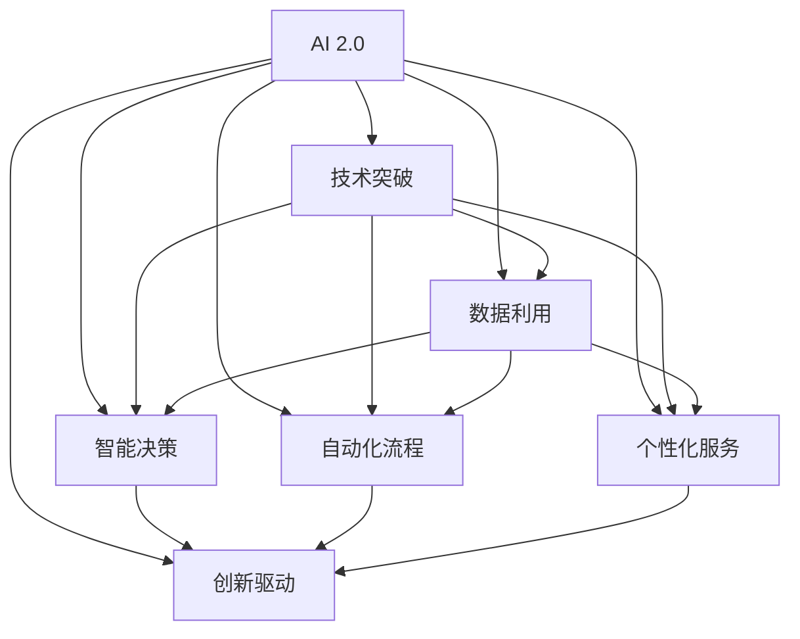

                 

# 李开复：AI 2.0 时代的商业价值

## 1. 背景介绍

### 1.1 问题由来
随着人工智能技术的飞速发展，AI 2.0 时代的到来已是大势所趋。这一时代，AI 技术不仅在技术上取得了显著进步，更在商业应用中展现出了巨大的潜力和价值。作为全球知名的AI领域专家、创业者、作者和投资者，李开复对于AI 2.0 时代的商业价值有着独到的见解。本文将深度探讨李开复关于AI 2.0 时代商业价值的思考，旨在为企业和开发者提供有益的指引和启发。

### 1.2 问题核心关键点
李开复认为，AI 2.0 时代的商业价值主要体现在以下几个方面：
1. **技术突破**：AI 技术在自然语言处理、计算机视觉、深度学习等方面取得了革命性进展，为商业应用提供了强有力的技术支持。
2. **数据利用**：海量数据是AI 技术的基石，通过高效的数据利用，AI 系统可以更好地理解和分析业务需求，提供精准的解决方案。
3. **商业智能**：AI 技术能够帮助企业实现智能决策、自动化流程和个性化服务，大幅提升运营效率和客户满意度。
4. **创新驱动**：AI 技术的应用促进了新的商业模式和业务形态的涌现，为企业带来了新的增长点和竞争优势。

### 1.3 问题研究意义
探讨AI 2.0 时代的商业价值，对于企业、开发者和技术从业者具有重要意义：
1. **战略导向**：理解AI 技术的商业价值，有助于企业制定更为精准的战略规划和业务发展方向。
2. **技术落地**：了解AI 技术的实际应用场景和最佳实践，有助于技术开发者更好地将AI 技术应用于实际业务场景。
3. **人才培养**：熟悉AI 技术的商业应用，有助于培养具有跨学科知识和实战经验的人才，推动AI 技术的广泛应用。

## 2. 核心概念与联系

### 2.1 核心概念概述

为更好地理解AI 2.0 时代的商业价值，本节将介绍几个密切相关的核心概念：

- **AI 2.0**：AI 2.0 时代是指AI 技术在商业应用中进入成熟期的阶段，其特点是技术成熟度、应用场景丰富度、商业价值实现程度都显著提高。
- **商业价值**：指AI 技术在企业运营、产品开发、客户服务等方面的实际应用效果和经济效益。
- **技术突破**：指AI 技术在算法、模型、架构等方面的创新，为商业应用提供新的可能性。
- **数据利用**：指通过数据收集、处理和分析，为AI 系统提供训练和推理的依据。
- **智能决策**：指利用AI 技术实现自动化的业务决策，提高决策效率和质量。
- **自动化流程**：指通过AI 技术实现自动化和流程优化，提升运营效率。
- **个性化服务**：指利用AI 技术提供个性化的产品推荐、内容推送、客户服务等，增强用户体验。
- **创新驱动**：指AI 技术驱动的新商业模式和业务形态，为企业带来新的增长点和竞争优势。

这些核心概念之间的逻辑关系可以通过以下Mermaid流程图来展示：



这个流程图展示了大语言模型的核心概念及其之间的关系：

1. AI 2.0 时代通过技术突破、数据利用、智能决策、自动化流程、个性化服务和创新驱动等多方面提升商业价值。
2. 技术突破和数据利用是基础，智能决策和自动化流程是手段，个性化服务和创新驱动是目标。

## 3. 核心算法原理 & 具体操作步骤
### 3.1 算法原理概述

李开复认为，AI 2.0 时代的商业价值实现，离不开高效、可解释的算法原理和操作步骤。以下是核心算法原理和操作步骤的详细解释：

**3.1.1 算法原理概述**

AI 2.0 时代的算法原理主要基于深度学习和强化学习等技术，涵盖了自然语言处理、计算机视觉、强化学习等多个领域。这些算法原理为商业应用提供了强有力的技术支持。

- **深度学习**：通过多层神经网络实现特征提取和模式识别，广泛应用于图像识别、语音识别、自然语言处理等领域。
- **自然语言处理**：利用AI 技术处理和理解人类语言，实现机器翻译、情感分析、文本分类等任务。
- **计算机视觉**：通过AI 技术实现图像识别、物体检测、图像生成等任务，广泛应用于安防监控、自动驾驶、医学影像等领域。
- **强化学习**：通过试错和奖励机制，使AI 系统在复杂环境中自主学习最佳决策策略，广泛应用于游戏智能、机器人控制等领域。

**3.1.2 算法步骤详解**

AI 2.0 时代的算法步骤主要包括以下几个关键环节：

1. **数据准备**：收集、清洗和标注业务相关的数据，构建训练集和验证集。
2. **模型选择**：选择合适的深度学习模型或强化学习模型，如卷积神经网络、循环神经网络、长短期记忆网络等。
3. **模型训练**：利用标注数据训练模型，优化模型参数，提高模型的预测精度。
4. **模型评估**：在验证集上评估模型性能，调整模型超参数，提升模型泛化能力。
5. **模型部署**：将训练好的模型部署到实际业务场景中，实现商业应用。
6. **持续优化**：根据业务反馈和数据变化，不断优化模型，提升模型效果。

**3.1.3 算法优缺点**

AI 2.0 时代的算法具有以下优点：

- **高效**：深度学习和强化学习算法在处理大规模数据时具有高效性，能够快速实现商业应用。
- **可解释性**：部分算法如卷积神经网络和长短期记忆网络，其内部结构较为简单，易于解释和理解。
- **灵活性**：算法能够在多种业务场景中应用，灵活性强。

同时，这些算法也存在一些局限性：

- **数据依赖**：深度学习和强化学习算法对数据的质量和数量要求较高，数据不足或质量差会影响模型效果。
- **计算资源消耗大**：训练大规模深度学习模型需要大量计算资源，企业需要投入较高的硬件成本。
- **模型复杂度高**：部分算法如卷积神经网络和长短期记忆网络，其内部结构复杂，难以理解和调试。

### 3.2 算法应用领域

AI 2.0 时代的算法在多个领域得到了广泛应用，以下是几个典型的应用领域：

**3.2.1 金融科技**

AI 技术在金融科技领域的应用主要包括风险评估、交易策略、客户服务等方面。通过深度学习算法和强化学习算法，金融科技公司能够实现精准的风险评估和自动交易，提升客户体验和业务效率。

**3.2.2 医疗健康**

AI 技术在医疗健康领域的应用主要包括医学影像分析、疾病诊断、个性化治疗等方面。通过自然语言处理和计算机视觉算法，AI 系统能够快速准确地分析医学影像和病历记录，提供精准的诊断和治疗方案。

**3.2.3 智能制造**

AI 技术在智能制造领域的应用主要包括质量检测、生产优化、设备维护等方面。通过深度学习算法和强化学习算法，智能制造企业能够实现自动化生产和质量检测，提升生产效率和产品质量。

**3.2.4 智能零售**

AI 技术在智能零售领域的应用主要包括客户推荐、库存管理、供应链优化等方面。通过自然语言处理和计算机视觉算法，智能零售企业能够实现个性化的客户推荐和高效的库存管理，提升客户满意度和运营效率。

**3.2.5 自动驾驶**

AI 技术在自动驾驶领域的应用主要包括环境感知、路径规划、决策控制等方面。通过计算机视觉和深度学习算法，自动驾驶车辆能够实现精准的环境感知和路径规划，提升行驶安全和效率。

## 4. 数学模型和公式 & 详细讲解  
### 4.1 数学模型构建

为了更好地理解AI 2.0 时代算法原理的数学模型，本节将介绍几个典型的数学模型：

- **卷积神经网络(CNN)**：用于图像识别和处理，通过卷积层和池化层提取图像特征，通过全连接层进行分类。

- **长短期记忆网络(LSTM)**：用于自然语言处理，通过LSTM单元捕捉时间序列数据中的长期依赖关系，通过全连接层进行分类。

- **强化学习算法**：通过状态、行动和奖励机制，使AI 系统在复杂环境中自主学习最佳决策策略。

### 4.2 公式推导过程

以下我们将对卷积神经网络和长短期记忆网络的公式推导过程进行详细讲解：

**卷积神经网络(CNN)**

卷积神经网络的核心公式为：

$$
f(x) = \sigma(\sum_{i=1}^n w_ix_i + b)
$$

其中，$x$ 表示输入特征，$w$ 表示卷积核，$b$ 表示偏置项，$\sigma$ 表示激活函数，如ReLU、Sigmoid等。

**长短期记忆网络(LSTM)**

长短期记忆网络的核心公式为：

$$
h_t = \tanh(W_c x_t + U_c h_{t-1} + b_c)
$$

$$
i_t = \sigma(W_i x_t + U_i h_{t-1} + b_i)
$$

$$
f_t = \sigma(W_f x_t + U_f h_{t-1} + b_f)
$$

$$
o_t = \sigma(W_o x_t + U_o h_{t-1} + b_o)
$$

$$
c_t = f_t \odot c_{t-1} + i_t \odot \tanh(h_t)
$$

$$
h_t = o_t \odot \tanh(c_t)
$$

其中，$x_t$ 表示时间步$t$的输入特征，$h_t$ 表示时间步$t$的隐状态，$c_t$ 表示时间步$t$的细胞状态，$W$ 和$U$ 表示权重矩阵，$b$ 表示偏置项，$\sigma$ 表示激活函数，$\odot$ 表示逐元素相乘。

### 4.3 案例分析与讲解

以医疗影像分类为例，我们可以详细介绍如何使用卷积神经网络进行AI 应用开发：

1. **数据准备**：收集医疗影像数据，标注出各类疾病的标签。
2. **模型选择**：选择卷积神经网络作为模型，设计多个卷积层和池化层。
3. **模型训练**：利用标注数据训练模型，优化模型参数。
4. **模型评估**：在验证集上评估模型性能，调整模型超参数。
5. **模型部署**：将训练好的模型部署到医疗影像分类系统中，实现自动分类和诊断。
6. **持续优化**：根据反馈数据不断优化模型，提升分类准确率。

## 5. 项目实践：代码实例和详细解释说明
### 5.1 开发环境搭建

在进行AI 2.0 时代算法应用开发前，我们需要准备好开发环境。以下是使用Python进行TensorFlow开发的环境配置流程：

1. 安装Anaconda：从官网下载并安装Anaconda，用于创建独立的Python环境。

2. 创建并激活虚拟环境：
```bash
conda create -n tf-env python=3.8 
conda activate tf-env
```

3. 安装TensorFlow：根据CUDA版本，从官网获取对应的安装命令。例如：
```bash
conda install tensorflow -c tensorflow -c conda-forge
```

4. 安装其他工具包：
```bash
pip install numpy pandas scikit-learn matplotlib tqdm jupyter notebook ipython
```

完成上述步骤后，即可在`tf-env`环境中开始AI 2.0 时代算法应用开发。

### 5.2 源代码详细实现

下面我们以医疗影像分类为例，给出使用TensorFlow实现卷积神经网络的代码实现。

首先，定义数据处理函数：

```python
import tensorflow as tf
from tensorflow.keras.preprocessing.image import ImageDataGenerator
from tensorflow.keras.models import Sequential
from tensorflow.keras.layers import Conv2D, MaxPooling2D, Flatten, Dense, Dropout

def load_data():
    train_dir = '/path/to/train/data'
    val_dir = '/path/to/val/data'
    
    train_data_gen = ImageDataGenerator(
        rescale=1./255,
        validation_split=0.2
    )
    
    train_generator = train_data_gen.flow_from_directory(
        train_dir,
        target_size=(224, 224),
        batch_size=32,
        class_mode='categorical',
        subset='training'
    )
    
    val_generator = train_data_gen.flow_from_directory(
        val_dir,
        target_size=(224, 224),
        batch_size=32,
        class_mode='categorical',
        subset='validation'
    )
    
    return train_generator, val_generator
```

然后，定义模型：

```python
def create_model():
    model = Sequential([
        Conv2D(32, (3, 3), activation='relu', input_shape=(224, 224, 3)),
        MaxPooling2D((2, 2)),
        Conv2D(64, (3, 3), activation='relu'),
        MaxPooling2D((2, 2)),
        Flatten(),
        Dense(128, activation='relu'),
        Dropout(0.5),
        Dense(10, activation='softmax')
    ])
    
    model.compile(optimizer='adam', loss='categorical_crossentropy', metrics=['accuracy'])
    
    return model
```

接着，定义训练和评估函数：

```python
def train_model(model, train_generator, val_generator, epochs):
    model.fit(
        train_generator,
        steps_per_epoch=train_generator.samples // train_generator.batch_size,
        epochs=epochs,
        validation_data=val_generator,
        validation_steps=val_generator.samples // val_generator.batch_size
    )
    
    score = model.evaluate(val_generator, verbose=0)
    print('Val Loss:', score[0])
    print('Val Accuracy:', score[1])
    
    return model
```

最后，启动训练流程：

```python
epochs = 10

train_generator, val_generator = load_data()
model = create_model()
model = train_model(model, train_generator, val_generator, epochs)
```

以上就是使用TensorFlow实现卷积神经网络的完整代码实现。可以看到，利用TensorFlow的高阶API，我们可以用较少的代码实现复杂的神经网络结构，并快速完成模型的训练和评估。

### 5.3 代码解读与分析

让我们再详细解读一下关键代码的实现细节：

**load_data函数**：
- 定义了数据处理函数，用于加载训练集和验证集数据。
- 使用`ImageDataGenerator`对图像进行归一化和数据增强，确保数据的一致性和多样性。
- 利用`flow_from_directory`方法从目录中自动加载图像数据，并进行预处理。

**create_model函数**：
- 定义了卷积神经网络的模型结构，包括卷积层、池化层、全连接层和激活函数。
- 使用`Sequential`模型封装各层结构，并通过`compile`方法设置损失函数、优化器和评估指标。

**train_model函数**：
- 定义了模型的训练函数，利用`fit`方法对模型进行训练和验证。
- 通过`steps_per_epoch`和`validation_steps`参数，控制训练和验证的批次大小和步骤数。
- 在训练结束后，利用`evaluate`方法评估模型性能，并打印输出。

**训练流程**：
- 定义训练轮数`epochs`，从`load_data`和`create_model`函数获取训练集和验证集数据。
- 创建模型`model`，调用`train_model`函数进行训练，并在验证集上评估模型性能。

可以看到，利用TensorFlow的强大API，我们可以高效地实现卷积神经网络模型，并进行高效的训练和评估。同时，TensorFlow还提供了丰富的可视化工具，如TensorBoard，方便开发者实时监测模型训练状态和评估结果。

当然，工业级的系统实现还需考虑更多因素，如模型的保存和部署、超参数的自动搜索、更灵活的任务适配层等。但核心的算法原理和代码实现基本与此类似。

## 6. 实际应用场景
### 6.1 智能客服系统

AI 2.0 时代的智能客服系统通过深度学习和自然语言处理技术，能够实现自动化的客户服务。系统能够理解客户的问题，并提供精准的解决方案，提升客户体验和满意度。

在技术实现上，可以收集企业内部的历史客服对话记录，将问题和最佳答复构建成监督数据，在此基础上对深度学习模型进行微调。微调后的模型能够自动理解用户意图，匹配最合适的答案模板进行回复。对于客户提出的新问题，还可以接入检索系统实时搜索相关内容，动态组织生成回答。如此构建的智能客服系统，能大幅提升客户咨询体验和问题解决效率。

### 6.2 金融舆情监测

AI 2.0 时代的金融舆情监测系统通过自然语言处理和计算机视觉技术，能够实时监测市场舆论动向，及时发现负面信息传播，规避金融风险。

具体而言，可以收集金融领域相关的新闻、报道、评论等文本数据，并对其进行主题标注和情感标注。在此基础上对深度学习模型进行微调，使其能够自动判断文本属于何种主题，情感倾向是正面、中性还是负面。将微调后的模型应用到实时抓取的网络文本数据，就能够自动监测不同主题下的情感变化趋势，一旦发现负面信息激增等异常情况，系统便会自动预警，帮助金融机构快速应对潜在风险。

### 6.3 个性化推荐系统

AI 2.0 时代的个性化推荐系统通过深度学习和自然语言处理技术，能够实现精准的个性化推荐。系统能够从用户浏览、点击、评论、分享等行为数据中，提取和用户交互的物品标题、描述、标签等文本内容。将文本内容作为模型输入，用户的后续行为（如是否点击、购买等）作为监督信号，在此基础上微调深度学习模型。微调后的模型能够从文本内容中准确把握用户的兴趣点。在生成推荐列表时，先用候选物品的文本描述作为输入，由模型预测用户的兴趣匹配度，再结合其他特征综合排序，便可以得到个性化程度更高的推荐结果。

### 6.4 未来应用展望

随着AI 2.0 时代的到来，基于深度学习和自然语言处理技术的AI 应用将越来越广泛。未来，AI 技术将在更多领域得到应用，为传统行业带来变革性影响。

在智慧医疗领域，基于AI 技术的医学影像分类、疾病诊断、个性化治疗等应用将提升医疗服务的智能化水平，辅助医生诊疗，加速新药开发进程。

在智能教育领域，AI 技术可应用于作业批改、学情分析、知识推荐等方面，因材施教，促进教育公平，提高教学质量。

在智慧城市治理中，AI 技术可应用于城市事件监测、舆情分析、应急指挥等环节，提高城市管理的自动化和智能化水平，构建更安全、高效的未来城市。

此外，在企业生产、社会治理、文娱传媒等众多领域，基于AI 技术的系统将不断涌现，为经济社会发展注入新的动力。相信随着技术的日益成熟，AI 2.0 时代必将带来更多创新和突破，推动人工智能技术向更广阔的领域加速渗透。

## 7. 工具和资源推荐
### 7.1 学习资源推荐

为了帮助开发者系统掌握AI 2.0 时代的算法原理和应用技巧，这里推荐一些优质的学习资源：

1. **《深度学习》系列书籍**：由李开复等人撰写，深入浅出地介绍了深度学习和自然语言处理的基本概念和算法原理。

2. **Coursera《深度学习专项课程》**：斯坦福大学开设的深度学习系列课程，涵盖了深度学习的基础理论和应用实践，适合初学者入门。

3. **TensorFlow官方文档**：TensorFlow的官方文档，提供了丰富的API文档和案例教程，是快速上手深度学习模型的必备资源。

4. **GitHub深度学习项目**：GitHub上开源的深度学习项目，涵盖了从基础到高级的各类算法实现，适合动手实践。

5. **Kaggle数据科学竞赛**：Kaggle上举办的多场深度学习竞赛，提供丰富的数据集和实战案例，适合锻炼算法应用能力。

通过对这些资源的学习实践，相信你一定能够快速掌握AI 2.0 时代的算法原理和应用技巧，并用于解决实际的AI应用问题。

### 7.2 开发工具推荐

高效的开发离不开优秀的工具支持。以下是几款用于AI 2.0 时代算法应用开发的常用工具：

1. **TensorFlow**：由Google主导开发的开源深度学习框架，生产部署方便，适合大规模工程应用。

2. **PyTorch**：由Facebook主导开发的开源深度学习框架，灵活高效，适合快速迭代研究。

3. **Jupyter Notebook**：开源的交互式笔记本工具，支持Python代码执行和数据可视化，适合数据分析和模型开发。

4. **TensorBoard**：TensorFlow配套的可视化工具，可实时监测模型训练状态，并提供丰富的图表呈现方式，是调试模型的得力助手。

5. **Git**：版本控制系统，方便代码版本管理和协作开发，是团队开发必备工具。

合理利用这些工具，可以显著提升AI 2.0 时代算法应用的开发效率，加快创新迭代的步伐。

### 7.3 相关论文推荐

AI 2.0 时代的算法研究源于学界的持续研究。以下是几篇奠基性的相关论文，推荐阅读：

1. **《ImageNet Classification with Deep Convolutional Neural Networks》**：提出卷积神经网络结构，并在ImageNet数据集上取得显著效果，推动了计算机视觉领域的发展。

2. **《Long Short-Term Memory》**：提出长短期记忆网络结构，解决循环神经网络中长期依赖关系的问题，成为自然语言处理领域的经典模型。

3. **《Playing Atari with Deep Reinforcement Learning》**：展示深度强化学习在玩游戏中的应用，推动了游戏智能和机器人控制领域的发展。

4. **《Attention Is All You Need》**：提出Transformer结构，解决了传统循环神经网络中长距离依赖的问题，推动了自然语言处理领域的发展。

5. **《GPT-3》**：OpenAI发布的第三代语言模型，展示了预训练语言模型在自然语言处理任务上的强大能力，引发了对于通用人工智能的新一轮思考。

这些论文代表了大语言模型和深度学习技术的最新进展，通过学习这些前沿成果，可以帮助研究者把握学科前进方向，激发更多的创新灵感。

## 8. 总结：未来发展趋势与挑战
### 8.1 研究成果总结

本文对AI 2.0 时代的商业价值进行了全面系统的探讨。首先阐述了AI 2.0 时代的商业价值主要体现在技术突破、数据利用、智能决策、自动化流程、个性化服务和创新驱动等方面。其次，详细讲解了AI 2.0 时代算法原理的数学模型和实现步骤，给出了卷积神经网络和长短期记忆网络等典型算法的公式推导过程。最后，通过医疗影像分类、智能客服、金融舆情监测等实际应用场景，展示了AI 2.0 时代算法的广泛应用前景。

通过本文的系统梳理，可以看到，AI 2.0 时代的商业价值在技术突破、数据利用、智能决策等方面具备巨大潜力，能够显著提升企业的运营效率和客户体验。同时，AI 2.0 时代的算法应用也为各行各业带来了新的业务模式和增长点，具有广泛的应用前景。

### 8.2 未来发展趋势

展望未来，AI 2.0 时代的商业价值将呈现以下几个发展趋势：

1. **技术持续突破**：AI 技术将在自然语言处理、计算机视觉、强化学习等领域继续取得突破，推动商业应用向更深层次发展。
2. **数据利用更加高效**：通过大数据技术和云计算，AI 系统将更加高效地利用数据，提升业务决策的科学性和准确性。
3. **智能决策更加精准**：通过深度学习和强化学习算法，AI 系统将实现更加精准的智能决策，提升运营效率和客户体验。
4. **自动化流程更加高效**：AI 技术将进一步优化自动化流程，提升生产效率和产品质量。
5. **个性化服务更加全面**：通过深度学习算法，AI 系统将实现更加全面、个性化的服务，增强客户满意度和忠诚度。
6. **创新驱动更加活跃**：AI 技术将推动更多创新驱动的企业涌现，带来新的商业模式和业务形态。

以上趋势凸显了AI 2.0 时代的商业价值潜力，为未来企业的发展提供了重要指引。

### 8.3 面临的挑战

尽管AI 2.0 时代的商业价值前景广阔，但在迈向成熟应用的过程中，仍面临以下挑战：

1. **数据质量和数量瓶颈**：AI 系统对数据的质量和数量要求较高，数据不足或质量差会影响模型效果。
2. **计算资源消耗大**：训练大规模深度学习模型需要大量计算资源，企业需要投入较高的硬件成本。
3. **模型复杂度高**：部分算法如卷积神经网络和长短期记忆网络，其内部结构复杂，难以理解和调试。
4. **模型鲁棒性不足**：AI 系统面对域外数据时，泛化性能往往大打折扣，模型的鲁棒性有待提高。
5. **模型安全性不足**：AI 系统容易学习到有害信息和偏见，需要通过伦理导向和监管机制来保障模型安全性。

这些挑战需要在技术、管理和伦理等方面进行全面应对，才能确保AI 2.0 时代商业价值的实现。

### 8.4 研究展望

面对AI 2.0 时代商业价值实现所面临的挑战，未来的研究需要在以下几个方面寻求新的突破：

1. **无监督和半监督学习**：摆脱对大规模标注数据的依赖，利用自监督学习、主动学习等方法，最大限度利用非结构化数据，实现更加灵活高效的AI应用。
2. **参数高效和计算高效**：开发更加参数高效和计算高效的算法，在固定大部分预训练参数的情况下，只更新极少量的任务相关参数。
3. **因果分析和博弈论工具**：将因果分析方法引入AI系统，识别出模型决策的关键特征，增强输出解释的因果性和逻辑性。借助博弈论工具刻画人机交互过程，主动探索并规避模型的脆弱点，提高系统稳定性。
4. **融合专家知识**：将符号化的先验知识，如知识图谱、逻辑规则等，与神经网络模型进行融合，引导AI系统学习更准确、合理的知识表示。同时加强不同模态数据的整合，实现视觉、语音等多模态信息与文本信息的协同建模。
5. **伦理和安全保障**：在AI系统的训练目标中引入伦理导向的评估指标，过滤和惩罚有害的输出倾向。加强人工干预和审核，建立模型行为的监管机制，确保输出符合人类价值观和伦理道德。

这些研究方向的探索，必将引领AI 2.0 时代向更高的台阶迈进，为构建安全、可靠、可解释、可控的智能系统铺平道路。面向未来，AI 2.0 时代需要跨学科协同发力，共同推动自然语言理解和智能交互系统的进步。只有勇于创新、敢于突破，才能不断拓展AI 技术的边界，让智能技术更好地造福人类社会。

## 9. 附录：常见问题与解答

**Q1：AI 2.0 时代是否会取代人类？**

A: AI 2.0 时代不会取代人类，而是会与人类共同工作。AI 技术在自动化、智能化方面具备优势，但在创造力、情感、伦理等方面仍无法替代人类。人类和AI 的合作，将创造更多价值和机会。

**Q2：AI 2.0 时代的数据质量如何保障？**

A: 保障AI 2.0 时代的数据质量，需要从数据收集、清洗、标注等多个环节入手。建立完善的数据管理和治理机制，确保数据的真实性、完整性和一致性。同时，引入隐私保护和伦理导向，确保数据使用的合法性和道德性。

**Q3：AI 2.0 时代的计算资源消耗如何优化？**

A: 优化AI 2.0 时代的计算资源消耗，需要从算法、硬件和系统架构等多个方面进行优化。采用分布式训练、混合精度训练、模型并行等技术，提高训练效率和资源利用率。同时，利用云计算和边缘计算，优化资源配置和部署。

**Q4：AI 2.0 时代的伦理问题如何应对？**

A: 应对AI 2.0 时代的伦理问题，需要从技术、管理和政策等多个层面进行综合应对。引入伦理导向的评估指标，过滤和惩罚有害的输出倾向。加强人工干预和审核，建立模型行为的监管机制。同时，制定和完善相关法律法规，规范AI 技术的应用和发展。

**Q5：AI 2.0 时代的技术瓶颈如何突破？**

A: 突破AI 2.0 时代的技术瓶颈，需要从算法、数据和系统架构等多个层面进行综合应对。引入无监督和半监督学习，利用非结构化数据提高模型泛化能力。采用参数高效和计算高效的算法，优化模型结构和计算资源消耗。建立完善的数据管理和治理机制，确保数据的真实性、完整性和一致性。

通过深入探讨AI 2.0 时代的商业价值，我们不仅看到了AI 技术带来的机遇，也意识到了面临的挑战。只有积极应对这些挑战，AI 技术才能更好地服务于人类社会，推动社会的进步和发展。相信在学界、产业界和政策层面的共同努力下，AI 2.0 时代必将带来更多创新和突破，为人类社会带来新的希望和机遇。

---

作者：禅与计算机程序设计艺术 / Zen and the Art of Computer Programming

