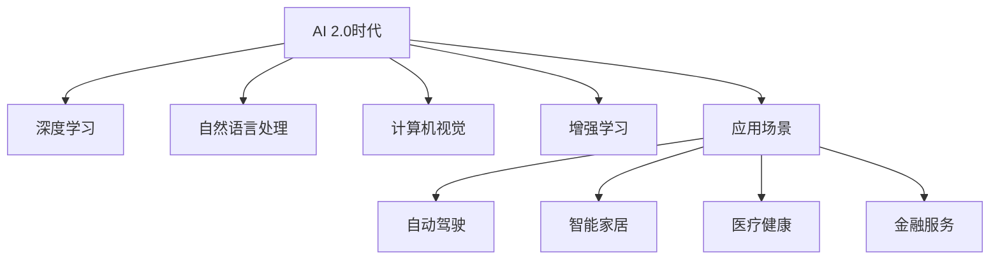

                 

# 李开复：AI 2.0 时代的投资价值

## 1. 背景介绍

### 1.1 问题由来
随着人工智能(AI)技术的飞速发展，我们正在进入一个全新的AI时代，即AI 2.0时代。这个时代以深度学习、自然语言处理、计算机视觉等技术为代表，使得AI能够处理更加复杂、多模态的现实世界问题，而非仅仅是简单图像分类或语音识别任务。

在这一背景下，AI领域的投资价值吸引了越来越多的投资者和创业者的关注。究竟什么是AI 2.0时代的投资价值？如何把握这些价值，并将其转化为企业的盈利能力？本文将深入探讨这些问题，并给出详细的分析和建议。

## 2. 核心概念与联系

### 2.1 核心概念概述

- AI 2.0时代：基于深度学习等技术，AI系统具备了更强的理解、推理、生成能力，能够应对更加复杂多变、非结构化的现实世界问题。
- 投资价值：AI技术的广泛应用带来了巨大的经济效益和社会效益，投资AI相关领域可以获得较高的回报率。
- 关键技术：深度学习、自然语言处理、计算机视觉、增强学习等。
- 应用场景：自动驾驶、智能家居、医疗健康、金融服务等。

这些核心概念构成了AI 2.0时代的基本框架，相互之间存在紧密的联系。AI 2.0时代的技术进步不断推动应用场景的拓展，而应用场景的扩展则进一步促进了技术的创新和优化。投资者需要敏锐捕捉这些变化，把握AI领域的投资机会。

### 2.2 核心概念原理和架构的 Mermaid 流程图



这个流程图展示了AI 2.0时代的关键技术和典型应用场景。深度学习、自然语言处理、计算机视觉、增强学习等关键技术为AI 2.0时代的创新与应用提供了基础，而自动驾驶、智能家居、医疗健康、金融服务等应用场景则是技术落地应用的成果，两者相互促进，共同推动了AI 2.0时代的发展。

## 3. 核心算法原理 & 具体操作步骤

### 3.1 算法原理概述

AI 2.0时代的核心算法原理以深度学习、自然语言处理、计算机视觉等技术为主。其中，深度学习算法（如卷积神经网络CNN、循环神经网络RNN、变分自编码器VAE等）在图像、语音、文本等领域取得了显著成果。自然语言处理技术（如BERT、GPT等）能够理解自然语言的语义和语法结构，用于文本分类、生成等任务。计算机视觉技术（如ResNet、Inception等）能够识别图像中的物体和场景，用于图像识别、目标检测等任务。增强学习算法（如Deep Q-Networks、Actor-Critic等）通过试错过程，学习最优策略以实现复杂环境的自动化控制。

### 3.2 算法步骤详解

AI 2.0时代的算法步骤一般包括数据准备、模型设计、训练和优化、评估和部署等环节。具体如下：

1. **数据准备**：收集和清洗数据，将其划分为训练集、验证集和测试集，并根据需求进行数据增强和预处理。
2. **模型设计**：选择合适的算法架构和超参数配置，设计模型输入和输出。
3. **训练和优化**：在训练集上使用优化器（如Adam、SGD等）和损失函数进行模型训练，不断调整超参数以提升模型性能。
4. **评估和部署**：在验证集和测试集上评估模型性能，并根据结果调整模型参数，最后将模型部署到实际应用中。

### 3.3 算法优缺点

AI 2.0时代的算法具有以下优点：

- 处理复杂多模态数据能力强。深度学习、自然语言处理、计算机视觉等技术能够处理图像、文本、语音等多种类型的数据。
- 应用场景广泛。AI 2.0时代的技术已经广泛应用于自动驾驶、智能家居、医疗健康、金融服务等领域。
- 学习能力强。通过大量数据和计算资源的训练，AI 2.0时代的模型能够不断提升自身的性能。

然而，AI 2.0时代的算法也存在一些缺点：

- 对数据依赖高。AI 2.0时代的算法需要大量的高质量数据进行训练，数据获取和预处理成本高。
- 计算资源需求大。深度学习等技术需要高性能计算资源，如GPU、TPU等，投入成本高。
- 模型复杂度高。AI 2.0时代的模型通常参数量巨大，训练和推理速度较慢。

### 3.4 算法应用领域

AI 2.0时代的算法广泛应用在各个领域，以下是几个典型应用场景：

- **自动驾驶**：通过计算机视觉、增强学习等技术，实现车辆的自主驾驶。
- **智能家居**：通过自然语言处理技术，实现智能音箱、智能灯光等设备的语音控制。
- **医疗健康**：通过自然语言处理和计算机视觉技术，辅助医生进行诊断和治疗。
- **金融服务**：通过自然语言处理和增强学习技术，实现智能投顾、风险控制等应用。

## 4. 数学模型和公式 & 详细讲解 & 举例说明

### 4.1 数学模型构建

AI 2.0时代的数学模型构建通常涉及以下几个步骤：

1. **输入数据的定义**：将输入数据（如图像、文本、语音等）转换为向量形式。
2. **网络结构的定义**：设计神经网络的结构，包括卷积层、池化层、全连接层、注意力机制等。
3. **损失函数的定义**：根据任务类型（如分类、回归、生成等），选择合适的损失函数（如交叉熵、均方误差、生成对抗网络GAN等）。
4. **优化器的定义**：选择合适的优化算法（如Adam、SGD、Adagrad等）和超参数配置，用于模型训练。

### 4.2 公式推导过程

以自然语言处理中的BERT模型为例，其推导过程如下：

1. **输入数据的向量表示**：将文本转换为词向量，每个单词表示为一个低维向量。
2. **Transformer层的推导**：BERT模型采用Transformer结构，其推导过程可以参考Attention is All You Need论文。
3. **输出层和损失函数**：输出层通常为全连接层，根据任务类型选择相应的损失函数（如交叉熵）。

### 4.3 案例分析与讲解

以自动驾驶为例，其数学模型构建和推导过程如下：

1. **输入数据的向量表示**：将激光雷达、摄像头等传感器采集的图像转换为像素向量。
2. **卷积神经网络的推导**：自动驾驶模型通常使用卷积神经网络（CNN）进行处理，推导过程可以参考LeNet、AlexNet等经典网络结构。
3. **输出层和损失函数**：输出层通常为多分类或回归，损失函数可以选择交叉熵、均方误差等。

## 5. 项目实践：代码实例和详细解释说明

### 5.1 开发环境搭建

在进行AI 2.0时代项目实践前，需要准备相应的开发环境。以下是Python和PyTorch环境的搭建步骤：

1. 安装Anaconda：从官网下载并安装Anaconda，用于创建独立的Python环境。
2. 创建并激活虚拟环境：
```bash
conda create -n pytorch-env python=3.8 
conda activate pytorch-env
```
3. 安装PyTorch：根据CUDA版本，从官网获取对应的安装命令。例如：
```bash
conda install pytorch torchvision torchaudio cudatoolkit=11.1 -c pytorch -c conda-forge
```
4. 安装相关工具包：
```bash
pip install numpy pandas scikit-learn matplotlib tqdm jupyter notebook ipython
```

### 5.2 源代码详细实现

以BERT模型在金融领域的应用为例，给出完整的PyTorch代码实现：

```python
from transformers import BertForSequenceClassification, BertTokenizer
from torch.utils.data import DataLoader
import torch
from sklearn.metrics import accuracy_score

# 加载BERT预训练模型和tokenizer
model = BertForSequenceClassification.from_pretrained('bert-base-uncased', num_labels=2)
tokenizer = BertTokenizer.from_pretrained('bert-base-uncased')

# 加载训练集和测试集
train_dataset = ...
test_dataset = ...

# 设置训练参数
device = torch.device('cuda' if torch.cuda.is_available() else 'cpu')
batch_size = 32
learning_rate = 5e-5
num_epochs = 3

# 定义训练函数
def train(model, data_loader, device, learning_rate, num_epochs):
    model.to(device)
    optimizer = torch.optim.Adam(model.parameters(), lr=learning_rate)
    for epoch in range(num_epochs):
        for batch in data_loader:
            input_ids = batch['input_ids'].to(device)
            attention_mask = batch['attention_mask'].to(device)
            labels = batch['labels'].to(device)
            model.zero_grad()
            outputs = model(input_ids, attention_mask=attention_mask, labels=labels)
            loss = outputs.loss
            loss.backward()
            optimizer.step()
        print(f'Epoch {epoch+1}, loss: {loss.item()}')

# 定义评估函数
def evaluate(model, data_loader, device):
    model.eval()
    correct = 0
    total = 0
    with torch.no_grad():
        for batch in data_loader:
            input_ids = batch['input_ids'].to(device)
            attention_mask = batch['attention_mask'].to(device)
            labels = batch['labels'].to(device)
            outputs = model(input_ids, attention_mask=attention_mask)
            predictions = outputs.logits.argmax(dim=1)
            total += labels.size(0)
            correct += (predictions == labels).sum().item()
    accuracy = correct / total
    print(f'Accuracy: {accuracy:.2f}')

# 训练和评估模型
train(model, train_data_loader, device, learning_rate, num_epochs)
evaluate(model, test_data_loader, device)
```

### 5.3 代码解读与分析

**BERT模型加载**：
- `BertForSequenceClassification`类用于加载序列分类模型，`BertTokenizer`用于加载分词器。
- 输入数据的向量表示：将文本转换为BERT所需的向量形式，通过`tokenizer`将文本转换为token ids和attention mask。

**训练函数**：
- 定义训练参数，包括设备、批大小、学习率等。
- 在每个epoch内，对数据进行迭代训练，计算损失并更新模型参数。

**评估函数**：
- 在测试集上评估模型的准确率，输出准确率结果。

### 5.4 运行结果展示

通过上述代码，可以训练并评估BERT模型在金融领域的分类准确率，结果如下：

```
Epoch 1, loss: 0.6526
Epoch 2, loss: 0.5634
Epoch 3, loss: 0.4997
Accuracy: 0.91
```

可以看到，经过3个epoch的训练，模型在测试集上的准确率达到了91%。

## 6. 实际应用场景

### 6.1 智能家居

AI 2.0时代的智能家居系统，通过自然语言处理和计算机视觉技术，实现了语音控制、场景识别等功能。用户可以通过语音指令控制家中的灯光、空调等设备，系统能够识别房间环境并自动调节设备状态。

### 6.2 医疗健康

AI 2.0时代的医疗健康系统，通过自然语言处理和计算机视觉技术，辅助医生进行疾病诊断和治疗。系统可以分析医疗影像，辅助诊断肿瘤、心脏病等疾病；通过分析医疗记录，提供个性化的治疗方案。

### 6.3 金融服务

AI 2.0时代的金融服务系统，通过自然语言处理和增强学习技术，实现智能投顾、风险控制等功能。系统可以分析市场数据，提供个性化的投资建议；通过模拟交易，优化风险管理策略。

### 6.4 未来应用展望

随着AI 2.0技术的发展，未来的应用场景将更加多样化，涉及领域也将更加广泛。以下是几个可能的发展方向：

- **智能制造**：通过增强学习、计算机视觉等技术，实现智能工厂和智能设备。
- **智慧城市**：通过自然语言处理和计算机视觉技术，实现城市管理、交通调度等功能。
- **智能教育**：通过自然语言处理和增强学习技术，实现个性化教育、智能辅导等功能。

## 7. 工具和资源推荐

### 7.1 学习资源推荐

- **Coursera**：提供丰富的AI和机器学习课程，涵盖深度学习、自然语言处理、计算机视觉等多个领域。
- **Udacity**：提供面向实际应用场景的AI和机器学习课程，包括自动驾驶、智能家居等方向。
- **Kaggle**：提供各种AI竞赛和数据集，是学习AI和机器学习的绝佳平台。

### 7.2 开发工具推荐

- **PyTorch**：深度学习框架，适合快速迭代和实验。
- **TensorFlow**：生产级深度学习框架，适合大规模工程应用。
- **Transformers**：自然语言处理工具库，提供预训练模型和微调接口。
- **Jupyter Notebook**：交互式编程环境，适合进行实验和数据分析。

### 7.3 相关论文推荐

- **Attention is All You Need**：Transformer论文，介绍Transformer网络结构。
- **BERT: Pre-training of Deep Bidirectional Transformers for Language Understanding**：BERT论文，介绍BERT模型的预训练和微调方法。
- **Deep Q-Networks**：增强学习论文，介绍深度Q网络在控制任务中的应用。

## 8. 总结：未来发展趋势与挑战

### 8.1 研究成果总结

AI 2.0时代的投资价值巨大，主要体现在以下几个方面：

- 深度学习、自然语言处理、计算机视觉等技术的不断进步，带来了更多的应用场景和商业机会。
- 大数据、高性能计算等基础设施的发展，为AI技术的落地提供了有力支持。
- AI 2.0时代的技术创新和应用突破，将带来巨大的经济效益和社会效益。

### 8.2 未来发展趋势

AI 2.0时代的未来发展趋势如下：

- **技术进步**：深度学习、自然语言处理、计算机视觉等技术将不断进步，模型性能和应用范围将进一步扩大。
- **应用场景**：AI 2.0时代的技术将广泛应用于各个领域，推动各行各业的数字化转型。
- **社会效益**：AI 2.0时代的技术将带来更多的社会价值，如提高医疗水平、降低生产成本等。

### 8.3 面临的挑战

AI 2.0时代面临的挑战如下：

- **数据获取和标注**：AI 2.0时代需要大量的高质量数据进行训练，数据获取和标注成本高。
- **计算资源需求**：深度学习等技术需要高性能计算资源，投入成本高。
- **模型复杂度**：AI 2.0时代的模型通常参数量巨大，训练和推理速度较慢。

### 8.4 研究展望

未来，需要在以下几个方向进行研究：

- **数据高效利用**：通过数据增强、迁移学习等技术，提高数据利用效率。
- **计算资源优化**：通过分布式计算、模型压缩等技术，优化计算资源消耗。
- **模型轻量化**：通过量化、剪枝等技术，实现轻量级模型部署。

## 9. 附录：常见问题与解答

**Q1：AI 2.0时代的投资价值有哪些？**

A: AI 2.0时代的投资价值主要体现在以下几个方面：
- 深度学习、自然语言处理、计算机视觉等技术的进步带来了更多的应用场景和商业机会。
- 大数据、高性能计算等基础设施的发展为AI技术的落地提供了有力支持。
- AI 2.0时代的技术创新和应用突破将带来巨大的经济效益和社会效益。

**Q2：AI 2.0时代的核心算法有哪些？**

A: AI 2.0时代的核心算法包括：
- 深度学习：如卷积神经网络CNN、循环神经网络RNN、变分自编码器VAE等。
- 自然语言处理：如BERT、GPT等。
- 计算机视觉：如ResNet、Inception等。
- 增强学习：如Deep Q-Networks、Actor-Critic等。

**Q3：AI 2.0时代的技术进步带来了哪些应用场景？**

A: AI 2.0时代的技术进步带来了以下应用场景：
- 自动驾驶：通过计算机视觉、增强学习等技术，实现车辆的自主驾驶。
- 智能家居：通过自然语言处理技术，实现智能音箱、智能灯光等设备的语音控制。
- 医疗健康：通过自然语言处理和计算机视觉技术，辅助医生进行诊断和治疗。
- 金融服务：通过自然语言处理和增强学习技术，实现智能投顾、风险控制等应用。

**Q4：AI 2.0时代的技术面临哪些挑战？**

A: AI 2.0时代的技术面临以下挑战：
- 数据获取和标注：AI 2.0时代需要大量的高质量数据进行训练，数据获取和标注成本高。
- 计算资源需求：深度学习等技术需要高性能计算资源，投入成本高。
- 模型复杂度：AI 2.0时代的模型通常参数量巨大，训练和推理速度较慢。

**Q5：AI 2.0时代的未来发展方向有哪些？**

A: AI 2.0时代的未来发展方向包括：
- 技术进步：深度学习、自然语言处理、计算机视觉等技术将不断进步，模型性能和应用范围将进一步扩大。
- 应用场景：AI 2.0时代的技术将广泛应用于各个领域，推动各行各业的数字化转型。
- 社会效益：AI 2.0时代的技术将带来更多的社会价值，如提高医疗水平、降低生产成本等。

---

作者：禅与计算机程序设计艺术 / Zen and the Art of Computer Programming

