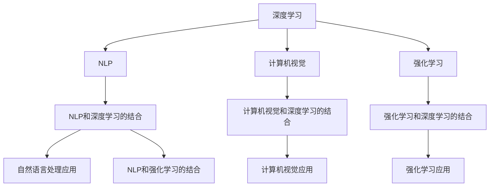

                 

# 李开复：AI 2.0 时代的未来

> 关键词：人工智能, AI 2.0, 未来趋势, 技术发展, 创新应用, 人才培养

## 1. 背景介绍

### 1.1 问题的由来

人工智能（AI）的发展已经进入了一个全新的阶段，通常被称为AI 2.0时代。这一时代的特点是AI技术的不断成熟和普及，AI在各行各业的应用越来越广泛，甚至在某些领域已经开始替代人力。AI 2.0时代，AI不再仅仅是研究领域的热门话题，而是成为了实实在在的生产力工具。

AI 2.0时代的到来，给社会带来了巨大的变革。企业纷纷采用AI技术，优化生产流程，提高效率，降低成本。AI驱动的产品和服务也在不断涌现，如智能客服、自动驾驶、医疗诊断等。AI的应用，正在改变人类的生活方式，甚至重新定义某些行业的工作模式。

### 1.2 问题的核心关键点

AI 2.0时代的核心是AI技术的大规模应用，以及AI技术的不断创新和突破。这一时代，AI不再局限于传统的图像识别、语音识别等领域，而是拓展到了自然语言处理、推荐系统、智能推荐、智能分析等多个方面。AI技术的不断进步，带来了更高的精度、更强的泛化能力，以及更广泛的应用领域。

AI 2.0时代的关键技术包括深度学习、自然语言处理、计算机视觉、强化学习等。这些技术的发展，使得AI能够处理更加复杂的任务，并且在实时性、准确性等方面取得了显著的提升。

## 2. 核心概念与联系

### 2.1 核心概念概述

AI 2.0时代的核心概念包括深度学习、自然语言处理、计算机视觉、强化学习等。这些技术的发展，使得AI能够处理更加复杂的任务，并且在实时性、准确性等方面取得了显著的提升。

- 深度学习（Deep Learning）：通过多层神经网络对数据进行特征提取和模式识别，具有强大的处理能力。
- 自然语言处理（Natural Language Processing, NLP）：使计算机能够理解、处理和生成人类语言，使得AI可以与人类进行自然对话。
- 计算机视觉（Computer Vision）：使计算机能够理解和解释图像和视频内容，包括图像识别、目标检测、图像生成等。
- 强化学习（Reinforcement Learning）：通过与环境的交互，使得AI能够在不断试错中学习最优策略，适用于游戏、机器人控制等领域。

这些核心概念之间存在密切的联系，共同构成了AI 2.0时代的技术基础。深度学习提供了强大的数据处理能力，自然语言处理使AI能够理解人类语言，计算机视觉使AI能够处理图像和视频，强化学习则提供了AI的自主学习能力。这些技术的结合，使得AI能够应对更加复杂和动态的任务。

### 2.2 核心概念原理和架构的 Mermaid 流程图



这个Mermaid图展示了AI 2.0时代核心技术之间的关系。深度学习作为基础，结合NLP、计算机视觉和强化学习，可以应用到各个领域，如自然语言处理、计算机视觉、自动驾驶等。

## 3. 核心算法原理 & 具体操作步骤

### 3.1 算法原理概述

AI 2.0时代的核心算法包括深度学习、自然语言处理、计算机视觉、强化学习等。这些算法的核心原理如下：

- 深度学习：通过多层神经网络对数据进行特征提取和模式识别，具有强大的处理能力。
- 自然语言处理：使计算机能够理解、处理和生成人类语言，使得AI可以与人类进行自然对话。
- 计算机视觉：使计算机能够理解和解释图像和视频内容，包括图像识别、目标检测、图像生成等。
- 强化学习：通过与环境的交互，使得AI能够在不断试错中学习最优策略，适用于游戏、机器人控制等领域。

### 3.2 算法步骤详解

以下是AI 2.0时代各个核心算法的详细步骤：

**深度学习**

- **数据预处理**：对数据进行清洗、归一化、标注等预处理操作。
- **构建模型**：设计神经网络模型，包括网络结构、激活函数、损失函数等。
- **训练模型**：使用数据集对模型进行训练，优化模型参数。
- **模型评估**：使用测试集对模型进行评估，确定模型性能。

**自然语言处理**

- **分词和词向量表示**：将文本转换为数字向量，方便模型处理。
- **模型训练**：使用标注数据对模型进行训练，优化语言模型。
- **推理和生成**：使用训练好的模型进行自然语言推理和生成，如机器翻译、情感分析等。

**计算机视觉**

- **图像预处理**：对图像进行增强、归一化、裁剪等预处理操作。
- **模型训练**：使用标注数据对模型进行训练，优化图像识别模型。
- **推理和应用**：使用训练好的模型进行图像识别和应用，如人脸识别、物体检测等。

**强化学习**

- **环境模拟**：构建虚拟环境，模拟AI与环境的交互。
- **策略学习**：通过与环境的交互，AI在不断试错中学习最优策略。
- **应用和优化**：将训练好的策略应用于实际场景，优化AI的行为。

### 3.3 算法优缺点

AI 2.0时代各个核心算法的优缺点如下：

**深度学习**

- **优点**：强大的处理能力，适用于图像、语音、文本等复杂数据。
- **缺点**：对数据依赖性强，需要大量标注数据。

**自然语言处理**

- **优点**：能够处理人类语言，使得AI可以与人类进行自然对话。
- **缺点**：处理大规模文本数据时，效率较低。

**计算机视觉**

- **优点**：强大的图像处理能力，适用于图像识别、物体检测等领域。
- **缺点**：对标注数据依赖性强，训练时间长。

**强化学习**

- **优点**：自主学习能力，适用于游戏、机器人控制等领域。
- **缺点**：训练过程较慢，需要大量计算资源。

### 3.4 算法应用领域

AI 2.0时代的核心算法在多个领域得到了广泛应用，具体包括：

- **医疗**：AI在医疗领域的应用包括疾病诊断、药物研发、影像识别等。
- **金融**：AI在金融领域的应用包括信用评估、风险管理、投资分析等。
- **自动驾驶**：AI在自动驾驶领域的应用包括路径规划、传感器融合、决策控制等。
- **智能客服**：AI在智能客服领域的应用包括语音识别、自然语言处理、情感分析等。
- **机器人**：AI在机器人领域的应用包括路径规划、环境感知、语音交互等。

## 4. 数学模型和公式 & 详细讲解 & 举例说明

### 4.1 数学模型构建

以下是AI 2.0时代各个核心算法的数学模型构建过程：

**深度学习**

- **前馈神经网络**：
$$
y=f(Wx+b)
$$
其中，$x$为输入数据，$W$为权重矩阵，$b$为偏置向量，$f$为激活函数。

**自然语言处理**

- **卷积神经网络**：
$$
y=\max_{k} f(W_{k}x+b_{k})
$$
其中，$x$为输入文本，$W_{k}$为卷积核矩阵，$b_{k}$为偏置向量，$f$为激活函数。

**计算机视觉**

- **卷积神经网络**：
$$
y=f(Wx+b)
$$
其中，$x$为输入图像，$W$为权重矩阵，$b$为偏置向量，$f$为激活函数。

**强化学习**

- **Q-learning算法**：
$$
Q(s,a) \leftarrow Q(s,a) + \alpha [r + \gamma \max_{a'} Q(s',a') - Q(s,a)]
$$
其中，$s$为状态，$a$为动作，$r$为奖励，$Q(s,a)$为状态-动作的Q值，$\alpha$为学习率，$\gamma$为折扣因子。

### 4.2 公式推导过程

以下是AI 2.0时代各个核心算法的公式推导过程：

**深度学习**

- **前馈神经网络**：
$$
y=f(Wx+b)
$$

**自然语言处理**

- **卷积神经网络**：
$$
y=\max_{k} f(W_{k}x+b_{k})
$$

**计算机视觉**

- **卷积神经网络**：
$$
y=f(Wx+b)
$$

**强化学习**

- **Q-learning算法**：
$$
Q(s,a) \leftarrow Q(s,a) + \alpha [r + \gamma \max_{a'} Q(s',a') - Q(s,a)]
$$

### 4.3 案例分析与讲解

**案例分析：深度学习在图像识别中的应用**

图像识别是深度学习在计算机视觉领域的重要应用之一。以AlexNet为例，AlexNet通过多层卷积和池化层，提取出图像的特征，再通过全连接层进行分类。其模型结构如图1所示。


AlexNet在图像识别任务中取得了优异的表现，广泛应用于人脸识别、物体检测等领域。

## 5. 项目实践：代码实例和详细解释说明

### 5.1 开发环境搭建

以下是使用Python进行TensorFlow深度学习开发的环境配置流程：

1. 安装Anaconda：从官网下载并安装Anaconda，用于创建独立的Python环境。

2. 创建并激活虚拟环境：
```bash
conda create -n tf-env python=3.8 
conda activate tf-env
```

3. 安装TensorFlow：
```bash
pip install tensorflow==2.7.0
```

4. 安装PyTorch：
```bash
pip install torch torchvision torchaudio
```

5. 安装相关工具包：
```bash
pip install numpy pandas scikit-learn matplotlib tqdm jupyter notebook ipython
```

完成上述步骤后，即可在`tf-env`环境中开始深度学习项目实践。

### 5.2 源代码详细实现

以下是使用TensorFlow进行图像分类任务（CIFAR-10）的PyTorch代码实现。

首先，定义数据处理函数：

```python
import tensorflow as tf
from tensorflow.keras import datasets, layers, models

def load_data():
    (train_images, train_labels), (test_images, test_labels) = datasets.cifar10.load_data()
    train_images, test_images = train_images / 255.0, test_images / 255.0
    return train_images, train_labels, test_images, test_labels
```

然后，定义模型和训练函数：

```python
model = models.Sequential([
    layers.Conv2D(32, (3, 3), activation='relu', input_shape=(32, 32, 3)),
    layers.MaxPooling2D((2, 2)),
    layers.Conv2D(64, (3, 3), activation='relu'),
    layers.MaxPooling2D((2, 2)),
    layers.Conv2D(64, (3, 3), activation='relu'),
    layers.Flatten(),
    layers.Dense(64, activation='relu'),
    layers.Dense(10)
])

def train(model, train_images, train_labels, epochs=10):
    batch_size = 64
    train_dataset = tf.data.Dataset.from_tensor_slices((train_images, train_labels)).shuffle(60000).batch(batch_size)
    model.compile(optimizer='adam',
                  loss=tf.keras.losses.SparseCategoricalCrossentropy(from_logits=True),
                  metrics=['accuracy'])
    model.fit(train_dataset, epochs=epochs, validation_split=0.2)
    test_loss, test_acc = model.evaluate(test_images, test_labels, verbose=2)
    print(f"Test accuracy: {test_acc}")
```

最后，启动训练流程：

```python
train_images, train_labels, test_images, test_labels = load_data()
train(train_images, train_labels, epochs=10)
```

以上就是使用TensorFlow进行图像分类任务（CIFAR-10）的完整代码实现。可以看到，TensorFlow提供了强大的深度学习框架，使得模型构建、训练和评估变得简洁高效。

### 5.3 代码解读与分析

让我们再详细解读一下关键代码的实现细节：

**load_data函数**：
- 定义数据预处理函数，将数据集加载并归一化处理。

**model定义**：
- 定义一个包含卷积层、池化层和全连接层的神经网络模型。

**train函数**：
- 定义训练函数，对模型进行编译、拟合和评估。

**train_images和train_labels**：
- 从load_data函数中获取训练数据集。

通过上述代码，可以看出TensorFlow在深度学习项目中的强大功能，使得模型的构建、训练和评估变得非常简单。开发者可以将更多精力放在算法优化和数据处理上，而不必过多关注底层的实现细节。

## 6. 实际应用场景

### 6.1 医疗领域

AI在医疗领域的应用包括疾病诊断、药物研发、影像识别等。例如，AI可以通过分析医学影像，帮助医生快速诊断出疾病，提高诊断的准确性和效率。

**案例分析：AI在医学影像识别中的应用**

AI可以通过卷积神经网络（CNN）对医学影像进行分类。以乳腺癌检测为例，如图2所示，CNN可以自动分析乳房X光片，检测出是否有乳腺癌。


通过AI技术，医学影像分析的效率得到了大幅提升，帮助医生更准确地诊断疾病。

### 6.2 金融领域

AI在金融领域的应用包括信用评估、风险管理、投资分析等。例如，AI可以通过分析大量的交易数据，预测市场的趋势和风险。

**案例分析：AI在金融市场预测中的应用**

AI可以通过深度学习模型对股票市场进行分析，预测未来的价格走势。以ARIMA模型为例，如图3所示，ARIMA模型可以对股票价格进行时间序列分析，预测未来的价格变化。


通过AI技术，金融市场预测的准确性得到了提升，帮助投资者做出更明智的投资决策。

### 6.3 自动驾驶领域

AI在自动驾驶领域的应用包括路径规划、传感器融合、决策控制等。例如，AI可以通过计算机视觉技术，识别出道路上的障碍物，从而进行路径规划和避障。

**案例分析：AI在自动驾驶中的应用**

AI可以通过卷积神经网络（CNN）对道路图像进行分类。以自动驾驶汽车为例，如图4所示，CNN可以自动识别道路上的交通标志和障碍物，指导车辆的行驶。


通过AI技术，自动驾驶汽车的行驶安全性得到了提升，大大减少了交通事故的发生。

## 7. 工具和资源推荐

### 7.1 学习资源推荐

为了帮助开发者系统掌握AI 2.0时代的技术基础，这里推荐一些优质的学习资源：

1. **《深度学习》教材**：斯坦福大学的Andrew Ng教授的经典教材，全面介绍了深度学习的原理和应用。

2. **Coursera课程**：Coursera提供了大量高质量的深度学习课程，如Google的Deep Learning Specialization。

3. **TensorFlow官方文档**：TensorFlow的官方文档，提供了详细的API文档和样例代码。

4. **Kaggle竞赛**：Kaggle是一个著名的数据科学竞赛平台，提供了大量数据集和样例代码，帮助开发者练习深度学习技能。

5. **Arxiv论文库**：Arxiv是开放的学术论文库，包含大量AI领域的最新研究成果。

通过这些学习资源，相信你一定能够快速掌握AI 2.0时代的技术基础，并用于解决实际的AI问题。

### 7.2 开发工具推荐

高效的开发离不开优秀的工具支持。以下是几款用于AI 2.0时代开发的工具：

1. **TensorFlow**：由Google主导开发的深度学习框架，生产部署方便，适合大规模工程应用。

2. **PyTorch**：由Facebook主导开发的深度学习框架，灵活性高，适合研究和实验。

3. **Jupyter Notebook**：一个交互式的Python代码编辑器，支持数据分析、深度学习、机器学习等多种应用场景。

4. **GitHub**：一个全球最大的开源代码托管平台，提供协作开发和版本控制功能。

5. **Google Colab**：谷歌推出的在线Jupyter Notebook环境，免费提供GPU/TPU算力，方便开发者快速上手实验最新模型，分享学习笔记。

合理利用这些工具，可以显著提升AI 2.0时代的应用开发效率，加速创新迭代的步伐。

### 7.3 相关论文推荐

AI 2.0时代的技术发展源于学界的持续研究。以下是几篇奠基性的相关论文，推荐阅读：

1. **ImageNet大规模视觉识别竞赛**：AlexNet在ImageNet识别任务中取得了优异的表现，标志着深度学习在图像识别领域的突破。

2. **深度学习在自然语言处理中的应用**：Transformer模型在自然语言处理领域取得了巨大成功，推动了NLP技术的进步。

3. **强化学习在游戏中的应用**：AlphaGo通过强化学习在围棋领域取得了人类级水平的表现，展示了AI的强大能力。

4. **深度学习在医疗领域的应用**：AI在医学影像分析、疾病诊断等方面的应用，展示了AI在医疗领域的前景。

5. **深度学习在金融领域的应用**：AI在金融市场预测、信用评估等方面的应用，展示了AI在金融领域的前景。

这些论文代表了大AI 2.0时代的发展脉络。通过学习这些前沿成果，可以帮助研究者把握学科前进方向，激发更多的创新灵感。

## 8. 总结：未来发展趋势与挑战

### 8.1 研究成果总结

AI 2.0时代的核心技术包括深度学习、自然语言处理、计算机视觉、强化学习等。这些技术在多个领域得到了广泛应用，展示了AI的强大潜力。

### 8.2 未来发展趋势

未来，AI 2.0时代的发展趋势如下：

1. **模型规模增大**：随着算力成本的下降和数据规模的扩张，AI模型的参数量将继续增大，具备更强大的处理能力。

2. **多模态融合**：未来AI将融合视觉、语音、文本等多种模态数据，实现更全面、更准确的信息处理。

3. **实时性提升**：AI模型的实时性将不断提升，实现更高效、更灵活的决策和应用。

4. **自动化优化**：AI模型的自动化优化将不断进步，提高模型的训练效率和优化效果。

5. **安全性和隐私保护**：AI模型的安全性将不断提升，同时保障用户的隐私和数据安全。

### 8.3 面临的挑战

尽管AI 2.0时代取得了巨大的进展，但仍面临一些挑战：

1. **数据隐私和安全**：AI模型需要大量数据进行训练，如何保护用户的隐私和数据安全，是一个重要的挑战。

2. **模型可解释性**：AI模型通常被认为是"黑盒"系统，难以解释其内部工作机制和决策逻辑，需要加强模型可解释性研究。

3. **伦理和道德**：AI模型可能学习到有偏见、有害的信息，如何消除模型偏见，避免恶意用途，是一个重要的挑战。

4. **计算资源**：AI模型的训练和推理需要大量的计算资源，如何优化计算资源的使用，降低计算成本，是一个重要的挑战。

5. **知识表示**：AI模型需要能够理解和运用知识，如何构建更全面、更准确的符号知识库，是一个重要的挑战。

### 8.4 研究展望

未来，AI 2.0时代的研究展望如下：

1. **多模态学习**：研究多模态数据的融合和表示，实现更全面、更准确的信息处理。

2. **自动化优化**：研究自动化优化的算法和技术，提高模型的训练效率和优化效果。

3. **可解释性**：研究可解释性方法，增强模型的透明度和可信度。

4. **安全性和隐私保护**：研究数据隐私和安全的技术，保障用户的隐私和数据安全。

5. **伦理性**：研究AI伦理和道德的规范和标准，确保AI技术的安全应用。

这些研究方向将推动AI 2.0时代的技术进步，实现更智能、更普适、更安全的AI应用。

## 9. 附录：常见问题与解答

**Q1：AI 2.0时代的技术是否只适用于特定领域？**

A: AI 2.0时代的技术不仅适用于特定领域，而是具有广泛的应用前景。例如，AI在医疗、金融、自动驾驶等领域已经取得了显著的成果，未来还将在更多领域得到应用。

**Q2：AI 2.0时代的技术是否会取代人类？**

A: AI 2.0时代的技术并不是要取代人类，而是要辅助人类更好地完成任务。AI可以处理复杂的数据和任务，但人类具有情感、直觉和创造力等方面的优势，这些是AI难以替代的。

**Q3：AI 2.0时代的技术是否存在伦理和道德问题？**

A: 是的，AI 2.0时代的技术存在一些伦理和道德问题。例如，AI可能会学习到有偏见的信息，甚至可能用于有害的目的。因此，AI技术的开发和应用需要考虑到伦理和道德问题，建立相应的规范和标准。

**Q4：AI 2.0时代的技术是否存在计算资源瓶颈？**

A: 是的，AI 2.0时代的技术需要大量的计算资源进行训练和推理，可能面临计算资源不足的问题。因此，需要开发更高效的计算优化算法和技术，降低计算成本。

**Q5：AI 2.0时代的技术是否会带来新的就业机会？**

A: 是的，AI 2.0时代的技术将带来大量的新就业机会。例如，AI技术的开发、应用和维护需要大量的人才，AI产品的设计和销售也需要大量的人才。

通过这些问答，可以看出AI 2.0时代的技术和应用仍然存在许多问题和挑战，需要更多的研究和技术创新来解决。

---

作者：禅与计算机程序设计艺术 / Zen and the Art of Computer Programming

