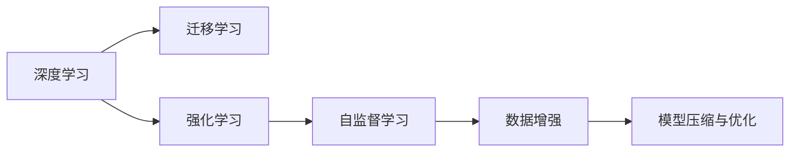

                 

# 李开复：AI 2.0 时代的生态

李开复，作为计算机科学领域的先锋和领导者，多次开创性地推动了人工智能（AI）和机器学习的发展。他的观察和洞见始终站在科技前沿，并为AI的发展提供了深刻的指导。李开复提出的“AI 2.0时代”，强调了AI生态系统的构建和优化，以及AI技术在不同行业中的应用。本文将深入探讨AI 2.0时代的生态系统，探讨其核心概念、原理、操作步骤、关键算法，以及未来的发展趋势和面临的挑战。

## 1. 背景介绍

### 1.1 问题由来

AI技术的飞速发展已经从实验室走向了实际应用。AI技术从最初简单的计算和处理，到如今的深度学习、自然语言处理（NLP）、计算机视觉（CV）等领域的广泛应用，已经深刻地改变了各行各业。李开复在“AI 2.0”时代，强调了AI生态系统的构建，以及AI技术在不同领域的应用，旨在推动AI技术的普及和应用。

### 1.2 问题核心关键点

AI 2.0时代的生态系统，需要从多个方面进行构建和优化。主要包括以下几个方面：

- **AI技术和模型的选择和优化**：选择适合的AI技术和模型，如深度学习、强化学习、迁移学习等，以及如何优化这些模型以适应特定的应用场景。
- **数据的质量和获取**：高质量的数据是AI应用的基础，如何获取、清洗、标注数据，以及如何利用数据增强技术提升模型的性能。
- **算力和资源的优化**：如何高效利用计算资源，以及如何优化算力和资源的利用，以提升AI模型的训练和推理效率。
- **AI技术的跨领域应用**：AI技术在医疗、金融、教育、制造等各个领域的深度应用，以及如何结合具体领域的知识，提升AI模型的性能。

## 2. 核心概念与联系

### 2.1 核心概念概述

AI 2.0时代的生态系统，涉及多个核心概念，包括：

- **深度学习（Deep Learning）**：基于神经网络的机器学习方法，广泛应用于图像识别、语音识别、自然语言处理等领域。
- **迁移学习（Transfer Learning）**：通过在大规模数据集上预训练模型，然后在特定任务上进行微调，以提升模型在特定任务上的性能。
- **强化学习（Reinforcement Learning）**：通过与环境的交互，使得模型能够通过试错学习，优化策略，广泛应用于游戏、自动驾驶、机器人等领域。
- **自监督学习（Self-Supervised Learning）**：利用数据的自相关性，无需人工标注，自动学习模型特征。
- **数据增强（Data Augmentation）**：通过数据扩充技术，增加训练数据的多样性，提升模型的泛化能力。
- **模型压缩与优化（Model Compression and Optimization）**：通过模型剪枝、量化、蒸馏等技术，优化模型的计算效率和推理速度。

这些核心概念相互关联，共同构成了AI 2.0时代的生态系统。

### 2.2 核心概念原理和架构的 Mermaid 流程图



该流程图展示了AI 2.0时代核心概念之间的联系，通过深度学习模型在大规模数据集上进行预训练，然后通过迁移学习、强化学习、自监督学习等技术，优化模型以适应特定任务。数据增强和模型压缩与优化技术，进一步提升模型的性能和效率。

## 3. 核心算法原理 & 具体操作步骤

### 3.1 算法原理概述

AI 2.0时代的核心算法原理，主要涉及以下几个方面：

- **深度学习**：通过多层次神经网络，自动学习数据的特征表示。
- **迁移学习**：在大规模数据集上预训练模型，然后在特定任务上进行微调，以提升模型在特定任务上的性能。
- **强化学习**：通过与环境的交互，使得模型能够通过试错学习，优化策略。
- **自监督学习**：利用数据的自相关性，无需人工标注，自动学习模型特征。

### 3.2 算法步骤详解

1. **数据准备**：获取并预处理数据集，包括数据清洗、标注和增强。
2. **模型选择**：选择合适的深度学习模型，如卷积神经网络（CNN）、循环神经网络（RNN）、变压器（Transformer）等。
3. **模型训练**：在数据集上训练模型，通过反向传播算法，优化模型参数。
4. **模型评估**：在验证集上评估模型性能，调整模型参数，避免过拟合。
5. **模型优化**：通过迁移学习、强化学习、自监督学习等技术，优化模型以适应特定任务。
6. **模型部署**：将训练好的模型部署到实际应用场景中，进行推理和预测。

### 3.3 算法优缺点

**优点**：

- **高效性**：深度学习模型能够自动学习数据的特征表示，无需人工干预，提升模型训练和推理效率。
- **泛化能力强**：迁移学习、自监督学习等技术，能够提升模型的泛化能力，适应不同的应用场景。
- **模型可解释性**：强化学习等技术，能够通过试错学习，优化策略，提升模型的可解释性。

**缺点**：

- **数据依赖性强**：深度学习模型和迁移学习等技术，对数据质量和数量有较高的要求。
- **计算资源需求高**：深度学习模型的训练和推理，需要大量的计算资源和存储空间。
- **模型复杂性高**：深度学习模型和强化学习等技术，模型结构复杂，训练和推理难度较大。

### 3.4 算法应用领域

AI 2.0时代的核心算法，广泛应用于以下几个领域：

- **计算机视觉（CV）**：用于图像识别、物体检测、人脸识别等任务。
- **自然语言处理（NLP）**：用于机器翻译、文本分类、情感分析等任务。
- **语音识别**：用于语音转文字、语音合成等任务。
- **自动驾驶**：用于感知、决策和控制等任务。
- **机器人**：用于感知、决策和行动等任务。

## 4. 数学模型和公式 & 详细讲解 & 举例说明

### 4.1 数学模型构建

以卷积神经网络（CNN）为例，其数学模型构建如下：

$$
y = \sigma \left( \sum_{i=1}^{n} w_i x_i + b \right)
$$

其中，$x_i$ 表示输入数据，$w_i$ 表示权重参数，$b$ 表示偏置参数，$\sigma$ 表示激活函数。

### 4.2 公式推导过程

卷积神经网络（CNN）的推导过程如下：

1. **卷积操作**：将输入数据与卷积核进行卷积运算，得到卷积特征图。
2. **池化操作**：对卷积特征图进行池化操作，减少特征图的大小。
3. **全连接层**：将池化后的特征图通过全连接层，得到最终的输出结果。

### 4.3 案例分析与讲解

以图像分类任务为例，CNN模型的应用过程如下：

1. **数据预处理**：将输入图像进行归一化、裁剪、缩放等处理。
2. **卷积层**：通过多个卷积核，提取图像的特征。
3. **池化层**：对卷积特征图进行最大池化，减少特征图的大小。
4. **全连接层**：将池化后的特征图通过全连接层，得到最终的分类结果。

## 5. 项目实践：代码实例和详细解释说明

### 5.1 开发环境搭建

使用Python进行PyTorch开发，需要安装Anaconda和相关依赖库。

```bash
conda create -n pytorch-env python=3.8
conda activate pytorch-env
conda install pytorch torchvision torchaudio cudatoolkit=11.1 -c pytorch -c conda-forge
pip install transformers
```

### 5.2 源代码详细实现

以图像分类任务为例，代码实现如下：

```python
import torch
import torch.nn as nn
import torchvision.transforms as transforms
from torch.utils.data import DataLoader
from torchvision.datasets import CIFAR10

# 定义卷积神经网络模型
class CNNModel(nn.Module):
    def __init__(self):
        super(CNNModel, self).__init__()
        self.conv1 = nn.Conv2d(3, 32, 3, 1, 1)
        self.pool = nn.MaxPool2d(2, 2)
        self.conv2 = nn.Conv2d(32, 64, 3, 1, 1)
        self.fc1 = nn.Linear(64 * 8 * 8, 120)
        self.fc2 = nn.Linear(120, 84)
        self.fc3 = nn.Linear(84, 10)

    def forward(self, x):
        x = self.conv1(x)
        x = nn.ReLU(inplace=True)
        x = self.pool(x)
        x = self.conv2(x)
        x = nn.ReLU(inplace=True)
        x = self.pool(x)
        x = x.view(-1, 64 * 8 * 8)
        x = self.fc1(x)
        x = nn.ReLU(inplace=True)
        x = self.fc2(x)
        x = nn.ReLU(inplace=True)
        x = self.fc3(x)
        output = nn.Softmax(dim=1)(x)
        return output

# 加载数据集
transform = transforms.Compose(
    [transforms.ToTensor(),
     transforms.Normalize((0.5, 0.5, 0.5), (0.5, 0.5, 0.5))])

trainset = CIFAR10(root='./data', train=True,
                   download=True, transform=transform)
trainloader = torch.utils.data.DataLoader(trainset, batch_size=4,
                                          shuffle=True, num_workers=2)

testset = CIFAR10(root='./data', train=False,
                   download=True, transform=transform)
testloader = torch.utils.data.DataLoader(testset, batch_size=4,
                                         shuffle=False, num_workers=2)

# 定义模型和损失函数
model = CNNModel()
criterion = nn.CrossEntropyLoss()
optimizer = torch.optim.SGD(model.parameters(), lr=0.001, momentum=0.9)

# 模型训练和评估
for epoch in range(2):  # 多次遍历整个训练集
    running_loss = 0.0
    for i, data in enumerate(trainloader, 0):
        inputs, labels = data
        optimizer.zero_grad()
        outputs = model(inputs)
        loss = criterion(outputs, labels)
        loss.backward()
        optimizer.step()

        running_loss += loss.item()
        if i % 2000 == 1999:    # 每2000个小批处理，打印一次loss
            print('[%d, %5d] loss: %.3f' %
                  (epoch + 1, i + 1, running_loss / 2000))
            running_loss = 0.0

print('Finished Training')

# 模型测试
correct = 0
total = 0
with torch.no_grad():
    for data in testloader:
        images, labels = data
        outputs = model(images)
        _, predicted = torch.max(outputs.data, 1)
        total += labels.size(0)
        correct += (predicted == labels).sum().item()

print('Accuracy of the network on the 10000 test images: %d %%' % (
    100 * correct / total))
```

### 5.3 代码解读与分析

该代码实现了一个简单的卷积神经网络模型，用于CIFAR-10数据集上的图像分类任务。代码步骤如下：

1. **定义模型**：定义了一个包含卷积层、池化层、全连接层的CNN模型。
2. **加载数据集**：加载CIFAR-10数据集，并进行归一化处理。
3. **定义损失函数和优化器**：使用交叉熵损失函数和随机梯度下降优化器。
4. **模型训练**：在训练集上多次遍历数据集，并使用反向传播算法更新模型参数。
5. **模型评估**：在测试集上测试模型的准确率。

## 6. 实际应用场景

### 6.1 智能客服系统

AI 2.0时代的智能客服系统，利用深度学习、自然语言处理等技术，可以提升客户咨询体验和问题解决效率。系统通过收集企业内部的历史客服对话记录，将问题和最佳答复构建成监督数据，对预训练的对话模型进行微调。微调后的对话模型能够自动理解用户意图，匹配最合适的答案模板进行回复。对于客户提出的新问题，还可以接入检索系统实时搜索相关内容，动态组织生成回答。

### 6.2 金融舆情监测

AI 2.0时代的金融舆情监测，利用自然语言处理和情感分析技术，可以实时监测市场舆论动向，规避金融风险。系统通过收集金融领域相关的新闻、报道、评论等文本数据，并对其进行主题标注和情感标注。在此基础上对预训练语言模型进行微调，使其能够自动判断文本属于何种主题，情感倾向是正面、中性还是负面。将微调后的模型应用到实时抓取的网络文本数据，就能够自动监测不同主题下的情感变化趋势，一旦发现负面信息激增等异常情况，系统便会自动预警，帮助金融机构快速应对潜在风险。

### 6.3 个性化推荐系统

AI 2.0时代的个性化推荐系统，利用深度学习、自然语言处理等技术，可以提升推荐系统的个性化程度。系统通过收集用户浏览、点击、评论、分享等行为数据，提取和用户交互的物品标题、描述、标签等文本内容。将文本内容作为模型输入，用户的后续行为（如是否点击、购买等）作为监督信号，在此基础上微调预训练语言模型。微调后的模型能够从文本内容中准确把握用户的兴趣点。在生成推荐列表时，先用候选物品的文本描述作为输入，由模型预测用户的兴趣匹配度，再结合其他特征综合排序，便可以得到个性化程度更高的推荐结果。

### 6.4 未来应用展望

AI 2.0时代的未来应用，将更加广泛和深入。随着深度学习、自然语言处理、计算机视觉等技术的不断进步，AI将在更多领域得到应用，为人类生产生活带来变革性影响。

在智慧医疗领域，AI 2.0时代将推动医疗系统的智能化水平，辅助医生诊疗，加速新药开发进程。在智能教育领域，AI 2.0时代将推动教育的公平性和个性化，因材施教。在智慧城市治理中，AI 2.0时代将推动城市管理的自动化和智能化，构建更安全、高效的未来城市。

## 7. 工具和资源推荐

### 7.1 学习资源推荐

1. **《深度学习》**：由李开复、杨立昆等编写的教材，介绍了深度学习的原理和应用。
2. **DeepLearning.ai**：由李开复和Andrew Ng共同创立的在线课程平台，提供深度学习、计算机视觉、自然语言处理等课程。
3. **AI：一种新的可能性**：李开复的新书，探讨AI技术对社会的影响和未来发展方向。
4. **Kaggle**：数据科学和机器学习竞赛平台，提供丰富的数据集和模型。
5. **GitHub**：全球最大的开源代码托管平台，提供丰富的AI项目和资源。

### 7.2 开发工具推荐

1. **PyTorch**：由李开复等人联合开发的深度学习框架，具有灵活的计算图和高效的加速功能。
2. **TensorFlow**：由Google开发的深度学习框架，生产部署方便，支持大规模工程应用。
3. **Jupyter Notebook**：开源的交互式笔记本环境，支持Python代码的实时运行和交互。
4. **Git**：版本控制工具，支持多人协作开发和管理。
5. **AWS**：云服务提供商，提供丰富的AI计算资源和工具。

### 7.3 相关论文推荐

1. **Attention is All You Need**：Transformer的原始论文，开创了自注意力机制。
2. **Bert: Pre-training of Deep Bidirectional Transformers for Language Understanding**：BERT模型的原始论文，展示了预训练语言模型的强大能力。
3. **Semi-supervised Text Generation with LSTM-RNN Attention**：介绍半监督学习的文本生成方法。
4. **Transfer Learning and Zero-Shot Learning for Mobile Image Classification**：介绍基于迁移学习的图像分类方法。
5. **Reinforcement Learning in Games**：介绍强化学习的应用和算法。

## 8. 总结：未来发展趋势与挑战

### 8.1 研究成果总结

李开复提出的AI 2.0时代的生态系统，为AI技术的未来发展提供了方向。通过深度学习、自然语言处理、计算机视觉等技术的不断进步，AI技术将在更多领域得到应用，为人类生产生活带来变革性影响。

### 8.2 未来发展趋势

未来AI 2.0时代的趋势将包括以下几个方面：

- **AI技术的融合与创新**：AI技术将在更多领域得到融合和创新，如AI与区块链、AI与边缘计算等。
- **AI技术的普及与普惠**：AI技术将普及到更多行业和领域，提升各个行业的生产效率和用户体验。
- **AI技术的伦理与责任**：AI技术的发展将面临更多的伦理和责任问题，如数据隐私、算法透明性等。
- **AI技术的国际合作**：AI技术将需要更多国际合作，共享资源和技术，推动全球AI生态系统的发展。

### 8.3 面临的挑战

尽管AI 2.0时代的发展前景广阔，但也面临诸多挑战：

- **数据隐私和安全**：AI技术在数据收集、存储和使用过程中，面临数据隐私和安全的挑战。
- **算法透明性与可解释性**：AI算法的复杂性和黑盒性质，使得其决策过程难以解释和透明。
- **伦理与社会影响**：AI技术的发展可能带来新的伦理和社会问题，如就业替代、决策偏见等。
- **技术标准与规范**：AI技术的发展需要统一的技术标准和规范，以保障其安全性和可靠性。

### 8.4 研究展望

未来AI 2.0时代的科学研究将包括以下几个方向：

- **AI技术的基础研究**：深入研究AI技术的基本原理和算法，推动AI技术的理论创新。
- **AI技术的应用研究**：深入研究AI技术在各个领域的应用，推动AI技术的落地和普及。
- **AI技术的伦理研究**：深入研究AI技术的伦理和社会影响，推动AI技术的健康发展。
- **AI技术的国际合作**：推动AI技术的国际合作，推动全球AI生态系统的发展。

## 9. 附录：常见问题与解答

**Q1：AI 2.0时代的生态系统如何构建？**

A：AI 2.0时代的生态系统构建，需要从多个方面进行优化，包括数据准备、模型选择、训练优化、应用部署等。选择适合的AI技术和模型，以及优化模型以适应特定任务，是构建AI生态系统的关键。

**Q2：AI 2.0时代的AI技术面临哪些挑战？**

A：AI 2.0时代的AI技术面临诸多挑战，包括数据隐私和安全、算法透明性与可解释性、伦理与社会影响、技术标准与规范等。解决这些问题，需要技术创新和政策规范的支持。

**Q3：AI 2.0时代的未来发展方向有哪些？**

A：AI 2.0时代的未来发展方向包括AI技术的融合与创新、普及与普惠、伦理与责任、国际合作等。推动AI技术的健康发展，需要各方共同努力。

---

作者：禅与计算机程序设计艺术 / Zen and the Art of Computer Programming

