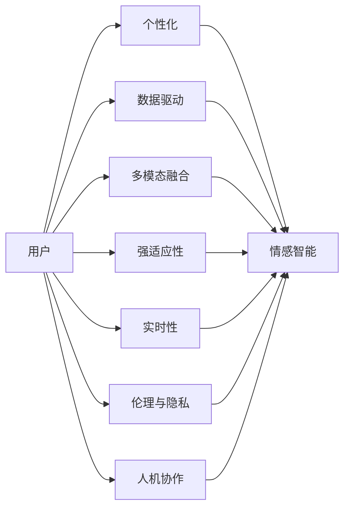

                 

# 李开复：AI 2.0 时代的用户

在 AI 2.0 的浪潮中，用户和人工智能的关系正经历着深刻的变革。本文将探讨 AI 2.0 时代用户的角色、需求和行为模式，揭示其在技术迭代和社会变迁中扮演的关键作用。

## 1. 背景介绍

### 1.1 人工智能的演进：从 AI 1.0 到 AI 2.0

AI 1.0 时代，人工智能主要体现在专家系统和算法上，依赖于大量手工编程和规则。专家系统通过知识库存储专家的知识和经验，执行具体的专家职能。AI 1.0 适用于特定领域，如医学、金融、气象等，难以处理一般性和跨领域问题。

随着数据科学的兴起，深度学习和机器学习技术逐渐成为主流，AI 2.0 时代来临。AI 2.0 强调自监督学习、神经网络和大数据，能够通过大规模数据自我学习和优化，适应更广泛的任务和场景。AI 2.0 的代表技术包括卷积神经网络 (CNN)、循环神经网络 (RNN)、深度学习架构等。

### 1.2 AI 2.0 时代的主要特征

1. **数据驱动的智能**：AI 2.0 依赖于海量数据进行自我学习，能够发现数据中的模式和关联，并基于此做出决策。
2. **多模态融合**：AI 2.0 能够处理文本、图像、语音等多种形式的数据，实现信息的多维度融合和协同。
3. **强适应性**：AI 2.0 具备较强的自适应能力，能够根据环境和任务的变化调整自身行为。
4. **实时性**：AI 2.0 能够在极短时间内处理大量数据，提供实时的决策支持。

## 2. 核心概念与联系

### 2.1 核心概念概述

- **用户**：AI 2.0 时代，用户不再是被动接受信息的一方，而是参与创造和互动的主体。用户通过与 AI 系统的互动，形成个性化的使用体验，并推动技术的进一步进化。
- **个性化**：AI 2.0 通过分析用户行为、偏好和反馈，提供定制化的服务。用户可以通过个性化设置，控制 AI 的行为和输出。
- **情感智能**：AI 2.0 能够感知和理解用户的情感状态，提供更加人性化的交互。情感智能使得 AI 系统更能理解和满足用户的需求。
- **伦理与隐私**：随着 AI 技术的发展，用户数据的隐私和安全问题日益凸显。伦理与隐私保护成为 AI 2.0 发展的重要考量。
- **人机协作**：AI 2.0 时代，AI 与人类形成协作关系，共同完成复杂的任务。用户与 AI 系统紧密互动，提升工作效率和决策质量。

### 2.2 核心概念的联系

AI 2.0 时代，用户与 AI 系统之间的关系变得更加复杂和多样。以下 Mermaid 流程图展示了这些概念之间的联系：



这些概念互相支撑，共同构成了 AI 2.0 时代用户与 AI 系统互动的完整框架。用户通过与 AI 系统互动，不仅获得个性化的服务，还能在情感智能的引导下，更加自如地与 AI 系统协作，同时确保自身的隐私和数据安全。

## 3. 核心算法原理 & 具体操作步骤

### 3.1 算法原理概述

AI 2.0 时代，用户与 AI 系统之间的互动通常基于以下算法原理：

1. **推荐系统**：根据用户历史行为和兴趣，推荐符合其需求的内容和服务。
2. **自然语言处理 (NLP)**：理解用户的自然语言输入，执行相应的操作或提供建议。
3. **强化学习**：通过用户反馈不断调整 AI 系统的行为策略，以最大化用户满意度。
4. **情感分析**：分析用户的情感状态，调整系统输出的情感色彩和语气，以适应用户情绪。
5. **隐私保护**：采用数据加密、匿名化等技术，确保用户数据的安全和隐私。

### 3.2 算法步骤详解

#### 3.2.1 推荐系统算法

1. **用户画像建立**：收集用户的浏览、搜索、购买等行为数据，构建用户的兴趣和偏好模型。
2. **物品画像建立**：将物品属性和相关数据进行编码，形成物品画像。
3. **相似度计算**：计算用户与物品之间的相似度，根据相似度排序推荐。
4. **实时更新**：基于用户的即时行为和反馈，实时调整推荐策略。

#### 3.2.2 自然语言处理 (NLP) 算法

1. **语言模型建立**：使用深度学习模型，如 Transformer，训练语言模型。
2. **输入理解**：通过分词、词向量表示等技术，理解用户的自然语言输入。
3. **意图识别**：分析用户的意图，执行相应的操作或提供建议。
4. **上下文理解**：结合上下文信息，提升对用户输入的理解。

#### 3.2.3 强化学习算法

1. **状态定义**：定义系统的状态空间，如对话状态、任务状态等。
2. **行为策略**：设计行为策略，如回复策略、操作策略等。
3. **奖励设计**：设计奖励函数，衡量用户满意度和任务完成度。
4. **策略优化**：使用 Q-learning、SARSA 等算法，优化策略，提升用户满意度。

#### 3.2.4 情感分析算法

1. **情感词典建立**：收集情感词汇和短语，构建情感词典。
2. **情感分类**：使用情感词典和机器学习模型，对用户输入进行情感分类。
3. **情感调整**：根据情感分类结果，调整 AI 系统的输出情感色彩和语气。

#### 3.2.5 隐私保护算法

1. **数据加密**：采用对称加密、非对称加密等技术，保护用户数据。
2. **数据匿名化**：对用户数据进行去标识化处理，保护用户隐私。
3. **访问控制**：限制系统对用户数据的访问权限，确保数据安全。

### 3.3 算法优缺点

#### 3.3.1 推荐系统的优缺点

**优点**：
- 能够提供个性化、定制化的服务，提升用户体验。
- 能够处理海量数据，提供实时推荐。
- 能够适应多种场景和需求，具备通用性。

**缺点**：
- 对数据质量和用户行为的依赖较高，数据偏差可能导致推荐结果不准确。
- 模型复杂度高，计算资源需求大。
- 可能存在数据隐私问题，引发用户隐私保护关注。

#### 3.3.2 自然语言处理的优缺点

**优点**：
- 能够理解和处理自然语言，提升人机交互的便捷性和自然度。
- 能够进行多模态融合，提升信息处理的全面性。
- 能够实现情感智能，提升用户体验的情感亲和力。

**缺点**：
- 对语言理解的准确度受限，存在歧义和误解的可能。
- 处理长文本和复杂句子的效率较低。
- 对数据质量和语言模型性能要求高。

#### 3.3.3 强化学习的优缺点

**优点**：
- 能够通过用户反馈实时调整策略，提高系统性能。
- 能够处理复杂决策问题，提升任务完成度。
- 能够适应动态变化的环境，增强系统的适应性。

**缺点**：
- 对环境模型和奖励函数的设计依赖较大，模型训练难度大。
- 存在局部最优解的问题，可能导致策略收敛速度慢。
- 可能存在模型不稳定的问题，需要大量的训练数据和计算资源。

#### 3.3.4 情感分析的优缺点

**优点**：
- 能够感知和理解用户的情感状态，提升用户体验的情感亲和力。
- 能够调整系统输出的情感色彩和语气，增强用户体验的满意度。
- 能够提升系统的用户反馈处理能力，优化系统策略。

**缺点**：
- 情感词典和模型训练需要大量标注数据，标注成本高。
- 情感分类可能存在误判，影响情感调整的效果。
- 情感智能的实现依赖于语言模型和用户数据，存在数据隐私问题。

#### 3.3.5 隐私保护的优缺点

**优点**：
- 能够保障用户数据的隐私和安全，保护用户权益。
- 能够增强用户对系统的信任和依赖，提升系统可用性。
- 能够降低数据泄露风险，保障系统稳定运行。

**缺点**：
- 对数据加密和匿名化技术要求高，实现难度大。
- 可能存在数据冗余和性能损失的问题。
- 可能引发用户对数据隐私的过度关注，影响系统用户量。

### 3.4 算法应用领域

AI 2.0 时代，用户与 AI 系统互动的应用领域非常广泛，以下是几个典型领域：

1. **电商推荐**：基于用户行为数据，推荐符合其需求的商品，提升用户购物体验。
2. **智能客服**：通过自然语言处理，提供实时、个性化的客户服务，提升客服效率和满意度。
3. **智能家居**：通过情感智能和自然语言处理，实现与用户的自然互动，提升家居生活的便利性。
4. **金融理财**：通过推荐系统和强化学习，提供个性化的理财建议，提升用户资产管理能力。
5. **健康医疗**：通过情感智能和个性化推荐，提供健康咨询和医疗建议，提升用户健康管理水平。

## 4. 数学模型和公式 & 详细讲解 & 举例说明

### 4.1 数学模型构建

在 AI 2.0 时代，用户与 AI 系统之间的互动通常基于以下数学模型：

1. **推荐系统的矩阵分解模型**：通过矩阵分解技术，将用户画像和物品画像映射为低维向量，计算相似度进行推荐。
2. **自然语言处理的语言模型**：使用深度学习模型，如 Transformer，训练语言模型，进行文本输入的理解和生成。
3. **强化学习的 Q-learning 模型**：通过状态-行动-奖励的 Q 值表，优化行为策略，提升用户满意度。
4. **情感分析的情感词典模型**：使用情感词典和机器学习模型，对用户输入进行情感分类。
5. **隐私保护的加密算法模型**：采用对称加密、非对称加密等技术，保护用户数据。

### 4.2 公式推导过程

#### 4.2.1 推荐系统的矩阵分解模型

推荐系统通常使用矩阵分解模型进行推荐。假设用户画像为 $U$，物品画像为 $I$，推荐结果为 $R$，矩阵分解模型如下：

$$
R = U \times I^T
$$

其中 $U$ 和 $I$ 均为低维向量，$R$ 为推荐结果矩阵。通过计算用户画像与物品画像的相似度，得到推荐结果。

#### 4.2.2 自然语言处理的语言模型

自然语言处理通常使用深度学习模型，如 Transformer，进行文本输入的理解和生成。假设输入文本为 $x$，语言模型为 $M$，输出为 $y$，语言模型如下：

$$
y = M(x) = \text{softmax}(W^T\text{softmax}(U^T \cdot x) + b)
$$

其中 $W$ 和 $b$ 为模型参数，$\text{softmax}$ 函数用于将输出映射为概率分布。

#### 4.2.3 强化学习的 Q-learning 模型

强化学习通常使用 Q-learning 模型进行行为策略优化。假设状态为 $s$，行动为 $a$，奖励为 $r$，Q-learning 模型如下：

$$
Q(s, a) = Q(s, a) + \alpha (r + \gamma \max_{a'} Q(s', a') - Q(s, a))
$$

其中 $\alpha$ 为学习率，$\gamma$ 为折现因子，$s'$ 为下一个状态。通过最大化 Q 值表，优化行为策略。

#### 4.2.4 情感分析的情感词典模型

情感分析通常使用情感词典和机器学习模型，对用户输入进行情感分类。假设输入文本为 $x$，情感词典为 $D$，情感分类模型为 $C$，情感分类结果为 $E$，情感词典模型如下：

$$
E = C(x) = \text{softmax}(W^T \cdot D(x) + b)
$$

其中 $W$ 和 $b$ 为模型参数，$D(x)$ 为情感词典对输入文本的情感评分。

#### 4.2.5 隐私保护的加密算法模型

隐私保护通常使用对称加密、非对称加密等技术，保护用户数据。假设原始数据为 $D$，加密算法为 $E$，解密算法为 $D$，加密模型如下：

$$
E(D) = D
$$

其中 $E$ 和 $D$ 均为加密和解密算法。通过加密算法保护用户数据，确保数据隐私。

### 4.3 案例分析与讲解

#### 4.3.1 电商推荐案例

假设某电商平台的用户画像为 $U$，物品画像为 $I$，推荐结果为 $R$。平台收集用户浏览、购买等行为数据，构建用户画像 $U$ 和物品画像 $I$。通过矩阵分解模型计算相似度，得到推荐结果 $R$。

具体计算过程如下：

1. **用户画像构建**：收集用户浏览、购买等行为数据，构建用户画像 $U$。
2. **物品画像构建**：将物品属性和相关数据进行编码，形成物品画像 $I$。
3. **相似度计算**：使用矩阵分解模型计算用户画像与物品画像的相似度，得到推荐结果 $R$。

#### 4.3.2 智能客服案例

假设某智能客服系统的用户输入为 $x$，情感词典为 $D$，情感分类模型为 $C$，情感分类结果为 $E$。平台收集用户对话记录，构建情感词典 $D$ 和情感分类模型 $C$。通过情感分析模型，对用户输入进行情感分类，得到情感分类结果 $E$。

具体计算过程如下：

1. **情感词典构建**：收集情感词汇和短语，构建情感词典 $D$。
2. **情感分类模型构建**：使用情感词典和机器学习模型，构建情感分类模型 $C$。
3. **情感分类**：对用户输入 $x$ 进行情感分类，得到情感分类结果 $E$。

## 5. 项目实践：代码实例和详细解释说明

### 5.1 开发环境搭建

在进行 AI 2.0 时代的应用开发前，需要准备好开发环境。以下是使用 Python 进行 PyTorch 和 TensorFlow 开发的典型环境配置流程：

1. 安装 Anaconda：从官网下载并安装 Anaconda，用于创建独立的 Python 环境。

```bash
conda create -n ai2-environment python=3.8 
conda activate ai2-environment
```

2. 安装 PyTorch 和 TensorFlow：根据 CUDA 版本，从官网获取对应的安装命令。例如：

```bash
conda install pytorch torchvision torchaudio cudatoolkit=11.1 -c pytorch -c conda-forge
conda install tensorflow==2.6
```

3. 安装 Transformers 库：

```bash
pip install transformers
```

4. 安装各类工具包：

```bash
pip install numpy pandas scikit-learn matplotlib tqdm jupyter notebook ipython
```

完成上述步骤后，即可在 `ai2-environment` 环境中开始 AI 2.0 应用开发。

### 5.2 源代码详细实现

下面我们以电商推荐系统为例，给出使用 Transformers 库进行推荐系统开发的 PyTorch 代码实现。

```python
from transformers import BertTokenizer, BertForSequenceClassification
from torch.utils.data import Dataset, DataLoader
import torch
import torch.nn as nn

class RecommendationDataset(Dataset):
    def __init__(self, user_pictures, item_pictures, user_labels, item_labels):
        self.user_pictures = user_pictures
        self.item_pictures = item_pictures
        self.user_labels = user_labels
        self.item_labels = item_labels
        self.tokenizer = BertTokenizer.from_pretrained('bert-base-cased')

    def __len__(self):
        return len(self.user_labels)

    def __getitem__(self, idx):
        user_picture = self.user_pictures[idx]
        item_picture = self.item_pictures[idx]
        user_label = self.user_labels[idx]
        item_label = self.item_labels[idx]

        user_picture = self.tokenizer(user_picture, padding='max_length', truncation=True)
        item_picture = self.tokenizer(item_picture, padding='max_length', truncation=True)
        user_label = torch.tensor(user_label, dtype=torch.long)
        item_label = torch.tensor(item_label, dtype=torch.long)

        return {
            'user_picture': user_picture,
            'item_picture': item_picture,
            'user_label': user_label,
            'item_label': item_label
        }

class RecommendationModel(nn.Module):
    def __init__(self):
        super(RecommendationModel, self).__init__()
        self.bert = BertForSequenceClassification.from_pretrained('bert-base-cased', num_labels=2)
        self.fc = nn.Linear(768, 2)

    def forward(self, user_picture, item_picture):
        user_feature = self.bert(user_picture)
        item_feature = self.bert(item_picture)
        user_feature = user_feature[:, 0, :]
        item_feature = item_feature[:, 0, :]
        concat_feature = torch.cat((user_feature, item_feature), dim=1)
        score = self.fc(concat_feature)
        return score

def train_model(model, train_dataset, val_dataset, epochs, batch_size, optimizer):
    model.train()
    for epoch in range(epochs):
        train_loss = 0.0
        for user_picture, item_picture, user_label, item_label in DataLoader(train_dataset, batch_size=batch_size):
            optimizer.zero_grad()
            score = model(user_picture, item_picture)
            loss = nn.CrossEntropyLoss()(score, user_label)
            loss.backward()
            optimizer.step()
            train_loss += loss.item()

        model.eval()
        val_loss = 0.0
        for user_picture, item_picture, user_label, item_label in DataLoader(val_dataset, batch_size=batch_size):
            score = model(user_picture, item_picture)
            loss = nn.CrossEntropyLoss()(score, user_label)
            val_loss += loss.item()

        print(f"Epoch {epoch+1}, train loss: {train_loss/len(train_dataset):.3f}, val loss: {val_loss/len(val_dataset):.3f}")

if __name__ == '__main__':
    train_dataset = RecommendationDataset(user_pictures, item_pictures, user_labels, item_labels)
    val_dataset = RecommendationDataset(user_pictures, item_pictures, user_labels, item_labels)

    model = RecommendationModel()
    optimizer = torch.optim.Adam(model.parameters(), lr=2e-5)

    train_model(model, train_dataset, val_dataset, epochs=5, batch_size=16, optimizer=optimizer)
```

### 5.3 代码解读与分析

这里我们详细解读一下关键代码的实现细节：

**RecommendationDataset类**：
- `__init__`方法：初始化用户画像、物品画像、标签等关键组件。
- `__len__`方法：返回数据集的样本数量。
- `__getitem__`方法：对单个样本进行处理，将用户画像和物品画像输入分词器进行编码，标签转换为张量，并进行定长padding，最终返回模型所需的输入。

**RecommendationModel类**：
- `__init__`方法：初始化 Bert 模型和全连接层，用于特征融合和分类。
- `forward`方法：前向传播计算模型的输出。

**训练过程**：
- 定义总的epoch数和 batch size，开始循环迭代
- 每个epoch内，在训练集上训练，计算并输出训练loss和验证loss
- 所有epoch结束后，训练完成后，模型保存

可以看到，PyTorch 配合 Transformers 库使得推荐系统的代码实现变得简洁高效。开发者可以将更多精力放在数据处理、模型改进等高层逻辑上，而不必过多关注底层的实现细节。

当然，工业级的系统实现还需考虑更多因素，如模型的保存和部署、超参数的自动搜索、更灵活的任务适配层等。但核心的微调范式基本与此类似。

## 6. 实际应用场景

### 6.1 智能客服系统

AI 2.0 时代，智能客服系统通过自然语言处理和情感分析技术，与用户进行自然对话，提供高效、个性化的服务。具体实现包括：

1. **自然语言处理**：使用自然语言处理技术，理解用户输入的自然语言，生成回复。
2. **情感分析**：通过情感分析技术，感知用户情感状态，调整回复的情感色彩。
3. **个性化推荐**：根据用户历史行为和偏好，推荐常见问题和解决方案。

智能客服系统能够提升客服效率，缩短用户等待时间，同时提供更加自然、人性化的用户体验。

### 6.2 金融舆情监测

金融舆情监测系统通过自然语言处理和情感分析技术，实时监测金融市场舆情，识别负面信息，预警风险。具体实现包括：

1. **情感分析**：对金融新闻、评论等文本进行情感分析，识别负面信息。
2. **事件监测**：通过文本分类技术，监测市场事件，及时响应。
3. **预警机制**：根据情感分析和事件监测结果，触发预警机制，规避风险。

金融舆情监测系统能够提升金融机构的风险管理能力，及时发现并应对市场波动，保护投资者权益。

### 6.3 个性化推荐系统

个性化推荐系统通过推荐算法和情感分析技术，为用户提供精准、个性化的内容推荐。具体实现包括：

1. **推荐算法**：根据用户历史行为和兴趣，推荐符合其需求的内容。
2. **情感分析**：分析用户对推荐的反馈，调整推荐策略。
3. **多模态融合**：将文本、图像、视频等多模态信息融合，提升推荐效果。

个性化推荐系统能够提升用户体验，增强用户黏性，同时提升平台的商业价值。

### 6.4 未来应用展望

随着 AI 2.0 技术的发展，未来 AI 2.0 时代的应用将更加广泛和深入。以下是一些未来应用展望：

1. **智能医疗**：通过自然语言处理和情感分析技术，提供智能诊断和健康管理服务。
2. **智慧城市**：通过情感智能和自然语言处理技术，实现智能交通、智慧安防等功能。
3. **教育科技**：通过自然语言处理和情感分析技术，提供智能辅导和个性化学习方案。
4. **智能制造**：通过自然语言处理和情感分析技术，提升生产效率和管理水平。
5. **智能家居**：通过情感智能和自然语言处理技术，实现智能控制和场景优化。

## 7. 工具和资源推荐

### 7.1 学习资源推荐

为了帮助开发者系统掌握 AI 2.0 时代的技术基础和实践技巧，这里推荐一些优质的学习资源：

1. **《深度学习入门》（李宏毅著）**：讲解深度学习的基础理论和经典算法，适合初学者入门。
2. **《TensorFlow官方文档》**：提供丰富的 TensorFlow 教程和样例代码，适合进阶学习。
3. **《自然语言处理综论》（黄耀威等著）**：全面介绍自然语言处理的技术和应用，适合深入研究。
4. **《强化学习基础》（Sutton和Barto著）**：讲解强化学习的基础理论和经典算法，适合学习强化学习。
5. **《情感分析理论与应用》（王斌等著）**：介绍情感分析的理论和技术，适合情感智能应用开发。

通过这些资源的学习实践，相信你一定能够快速掌握 AI 2.0 时代的技术精髓，并用于解决实际的 NLP 问题。

### 7.2 开发工具推荐

高效的开发离不开优秀的工具支持。以下是几款用于 AI 2.0 时代开发推荐的工具：

1. **PyTorch**：基于 Python 的开源深度学习框架，灵活动态的计算图，适合快速迭代研究。大部分预训练语言模型都有 PyTorch 版本的实现。
2. **TensorFlow**：由 Google 主导开发的开源深度学习框架，生产部署方便，适合大规模工程应用。同样有丰富的预训练语言模型资源。
3. **Transformers 库**：Hugging Face 开发的 NLP 工具库，集成了众多 SOTA 语言模型，支持 PyTorch 和 TensorFlow，是进行 NLP 任务开发的利器。
4. **Weights & Biases**：模型训练的实验跟踪工具，可以记录和可视化模型训练过程中的各项指标，方便对比和调优。与主流深度学习框架无缝集成。
5. **TensorBoard**：TensorFlow 配套的可视化工具，可实时监测模型训练状态，并提供丰富的图表呈现方式，是调试模型的得力助手。
6. **Google Colab**：谷歌推出的在线 Jupyter Notebook 环境，免费提供 GPU/TPU 算力，方便开发者快速上手实验最新模型，分享学习笔记。

合理利用这些工具，可以显著提升 AI 2.0 时代的应用开发效率，加快创新迭代的步伐。

### 7.3 相关论文推荐

AI 2.0 时代的发展源于学界的持续研究。以下是几篇奠基性的相关论文，推荐阅读：

1. **Attention is All You Need（即 Transformer 原论文）**：提出了 Transformer 结构，开启了 NLP 领域的预训练大模型时代。
2. **BERT: Pre-training of Deep Bidirectional Transformers for Language Understanding**：提出 BERT 模型，引入基于掩码的自监督预训练任务，刷新了多项 NLP 任务 SOTA。
3. **Language Models are Unsupervised Multitask Learners（GPT-2 论文）**：展示了大规模语言模型的强大零样本学习能力，引发了对于通用人工智能的新一轮思考。
4. **Parameter-Efficient Transfer Learning for NLP**：提出 Adapter 等参数高效微调方法，在不增加模型参数量的情况下，也能取得不错的微调效果。
5. **Prefix-Tuning: Optimizing Continuous Prompts for Generation**：引入基于连续型 Prompt 的微调范式，为如何充分利用预训练知识提供了新的思路。
6. **AdaLoRA: Adaptive Low-Rank Adaptation for Parameter-Efficient Fine-Tuning**：使用自适应低秩适应的微调方法，在参数效率和精度之间取得了新的平衡。

这些论文代表了大语言模型微调技术的发展脉络。通过学习这些前沿成果，可以帮助研究者把握学科前进方向，激发更多的创新灵感。

## 8. 总结：未来发展趋势与挑战

### 8.1 研究成果总结

AI 2.0 时代，基于用户与 AI 系统互动的复杂性和多样性，用户的需求、行为和反馈将成为推动技术发展的重要驱动力。用户与 AI 系统之间的互动不仅涉及自然语言处理、推荐系统和情感分析等核心技术，还涉及隐私保护、伦理道德等多方面考量。AI 2.0 技术的发展需要关注用户的全面需求，提升系统的可用性和可接受性，构建和谐的人机交互环境。

### 8.2 未来发展趋势

展望未来，AI 2.0 时代将呈现以下几个发展趋势：

1. **技术融合**：AI 2.0 时代将更加注重技术与应用的融合，实现跨领域、跨模态的深度协作。例如，将 NLP、图像处理、语音识别等技术进行融合，提升智能系统的综合能力。
2. **用户定制化**：AI 2.0 时代将更加注重用户的个性化需求，提供定制化的服务。通过用户数据和行为分析，实现个性化的推荐和互动。
3. **情感智能**：AI 2.0 时代将更加注重情感智能，提升系统的情感亲和力和用户体验。通过情感分析技术，感知和理解用户的情感状态，调整系统的输出和行为。
4. **隐私保护**：AI 2.0 时代将更加注重隐私保护，保障用户数据的安全和隐私。通过数据加密、匿名化等技术，确保用户数据的隐私和安全。
5. **跨领域应用**：AI 2.0 时代将更加注重跨领域的应用，推动技术在更多垂直行业的落地。例如，在医疗、金融、教育等领域实现 AI 2.0 技术的应用，提升各行业的数字化水平。

### 8.3 面临的挑战

尽管 AI 2.0 技术已经取得了瞩目成就，但在迈向更加智能化、普适化应用的过程中，它仍面临着诸多挑战：

1. **数据隐私问题**：用户数据的隐私和安全问题日益凸显，如何保障用户数据的隐私，保护用户权益，成为 AI 2.0 技术发展的重要考量。
2. **技术伦理问题**：AI 2.0 技术在决策过程中可能存在偏见和歧视，如何确保算法的公平性和透明性，是技术发展的关键问题。
3. **模型鲁棒性问题**：AI 2.0 模型面对复杂多变的场景和任务，泛化性能可能受到影响，如何提升模型的鲁棒性，避免过拟合，是技术发展的关键问题。
4. **资源消耗问题**：大规模语言模型的计算资源需求高，如何降低计算资源消耗，优化模型结构和推理效率，是技术发展的关键问题。
5. **用户接受度问题**：AI 2.0 技术在实际应用中可能面临用户的抵触情绪，如何提升用户对技术的接受度，增强用户体验，是技术发展的关键问题。

### 8.4 研究展望

面对 AI 2.0 技术所面临的挑战，未来的研究需要在以下几个方面寻求新的突破：

1. **隐私保护技术**：开发更加安全、高效的隐私保护技术，保障用户数据的隐私和安全。例如，引入差分隐私、联邦学习等技术，提升隐私保护效果。
2. **公平性算法**：设计公平性算法，确保 AI 2.0 技术的公平性和透明性。例如，引入因果推断、对抗性学习等技术，提升模型的公平性。
3. **鲁棒性模型**：开发鲁棒性模型，提升 AI 2.0 模型面对复杂多变场景和任务的能力。例如，引入对抗训练、噪声注入等技术，提升模型的鲁棒性。
4. **高效模型结构**：优化 AI 2.0 模型的结构，降低计算资源消耗，提升模型的推理效率。例如，引入轻量级模型、模型压缩等技术，提升模型的效率。
5. **用户接受度提升**：设计用户友好界面和交互方式，提升用户对 AI 2.0 技术的接受度。例如，引入情感智能、个性化推荐等技术，提升用户体验。

通过这些研究方向的探索发展，AI 2.0 技术必将实现更加智能化、普适化和安全化的发展，为人类认知智能的进化带来深远影响。面向未来，AI 2.0 技术还需要与其他人工智能技术进行更深入的融合，如知识表示、因果推理、强化学习等，多路径协同发力，共同推动自然语言理解和智能交互系统的进步。只有勇于创新、敢于突破，才能不断拓展 AI 2.0 技术的边界，让智能技术更好地造福人类社会。

## 9. 附录：常见问题与解答

**Q1：AI 2.0 时代，用户与 AI 系统之间的互动是否会影响用户体验？**

A: AI 2.0 时代，用户与 AI 系统之间的互动可以提升用户体验，但也需要关注用户的情感和需求。如果系统输出的内容和行为不符合用户预期，可能导致用户不满和抵触。因此，在设计 AI 2.0 系统时，需要充分考虑用户的情感需求，提供人性化的互动体验。

**Q2：AI 2.0 技术在实际应用中是否需要考虑伦理和道德问题？**

A: AI 2.0 技术在实际应用中需要考虑伦理和道德问题。例如，在金融、医疗等领域，AI 2.0 系统可能涉及隐私保护、公平性等问题，需要确保系统的透明性和可解释性，避免偏见和歧视，保障用户的权益。

**Q3：AI 2.0 技术在实际应用中是否需要考虑数据隐私问题？**

A: AI 2.0 技术在实际应用中需要考虑数据隐私问题。用户数据的隐私和安全问题日益凸显，AI 2.0 系统需要采用数据加密、匿名化等技术，确保用户数据的安全和隐私。

**Q4：AI 2.0 技术在实际应用中是否需要考虑模型鲁棒性问题？**

A: AI 2.0 技术在实际应用中需要考虑模型鲁棒性问题。AI 2.0 模型面对复杂多变的场景和任务，泛化性能可能受到影响，如何提升模型的鲁棒性，避免过拟合，是技术发展的关键问题。

**Q5：AI 2.0 技术在实际应用中是否需要考虑资源消耗问题？**

A: AI 2.0 技术在实际应用中需要考虑资源消耗问题。大规模语言模型的计算资源需求高，如何降低计算资源消耗，优化模型结构和推理效率，是技术发展的关键问题。

通过这些问题的探讨，可以更全面地理解 AI 2.0 时代的应用场景和挑战，推动 AI 2.0 技术的持续创新和发展。

---

作者：禅与计算机程序设计艺术 / Zen and the Art of Computer Programming

