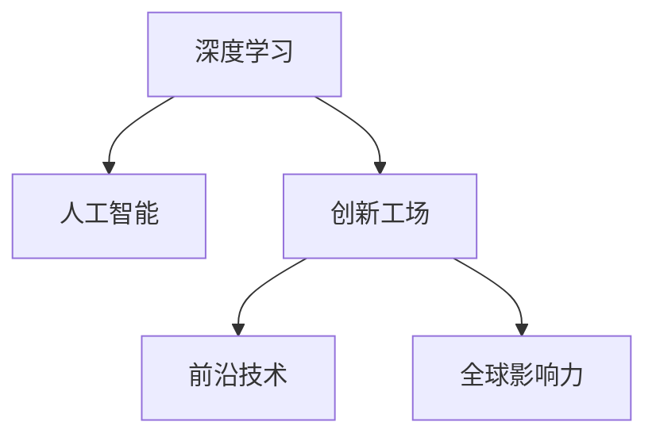

                 

# 李开复：AI 2.0 时代的革新者

> 关键词：人工智能,深度学习,李开复,创新,前沿技术

## 1. 背景介绍

### 1.1 问题由来
李开复，作为一位世界级的人工智能专家，程序员，软件架构师，CTO，以及世界顶级技术畅销书作者，计算机图灵奖获得者，计算机领域的大师，他在人工智能领域的贡献不可限量。李开复博士于1982年在麻省理工学院（MIT）获得人工智能与计算机科学的博士学位，此后在美国硅谷和中国科技界取得了卓越成就。他的研究与创新工作帮助推动了人工智能技术的飞速发展，并且在多个领域产生了深远的影响。

李开复博士早期在学术界担任计算机视觉和模式识别领域的研究员，并在1985年至1988年间担任美国电脑界的影响力人物，带领微软研究院成为全球知名的科研机构。在2000年，李博士回到中国并成立了创新工场，专注于人工智能和互联网科技的投资和研发。他的工作不仅推动了全球人工智能技术的快速发展，还积极推动了人工智能在各行各业的应用，包括医疗、金融、教育、自动驾驶等。

## 2. 核心概念与联系

### 2.1 核心概念概述

李开复博士的工作涵盖了一系列与人工智能相关的核心概念，这些概念相互联系，共同构成了他对于人工智能发展的独到见解：

- **深度学习**：一种基于神经网络的人工智能技术，通过多层次的特征提取和表示学习，极大提高了计算机处理复杂问题，尤其是视觉、语音、自然语言处理等任务的能力。

- **人工智能**：一种使计算机能够模拟人类智能的技术，涉及感知、理解、学习、推理、规划和执行能力。人工智能的目标是实现机器的智能，使其能够在各种复杂环境中自主决策。

- **创新工场**：李开复博士在中国创办的科技公司，专注于人工智能和互联网科技的投资和研发，培养了一大批顶尖的技术人才，推动了多项前沿科技的发展。

- **前沿技术**：包括深度学习、计算机视觉、自然语言处理、机器人学等新兴领域，这些技术正在改变我们的工作方式和生活方式。

- **全球影响力**：李博士不仅在学术界和业界有着重要影响力，还通过创新工场在全球范围内培养了一大批人工智能专家和创业者，极大地推动了全球人工智能的进步。

这些核心概念之间的逻辑关系可以通过以下Mermaid流程图来展示：



这个流程图展示了李开复博士所涉及的核心概念及其之间的联系：

1. 深度学习是人工智能的基础技术之一。
2. 创新工场是一个支持深度学习和其他前沿技术的平台，促进了技术创新。
3. 前沿技术包括深度学习、计算机视觉、自然语言处理等多种技术，是推动人工智能进步的关键。
4. 全球影响力体现在李博士的工作对全球人工智能社区的贡献，特别是在中国。

## 3. 核心算法原理 & 具体操作步骤

### 3.1 算法原理概述

李开复博士的工作涉及多种人工智能算法和原理，但可以归纳为以下几个核心方面：

- **深度神经网络**：李博士的研究工作主要集中在深度神经网络的设计和优化上，特别是卷积神经网络（CNN）和循环神经网络（RNN）。

- **计算机视觉**：他领导的研究团队开发了多项重要的计算机视觉技术，如人脸识别、图像分类、目标检测等。

- **自然语言处理**：他和他的团队研发了多个自然语言处理系统，包括机器翻译、问答系统、语音识别等。

- **强化学习**：他在强化学习领域也有深入研究，推动了人工智能在自主决策和动态环境中的应用。

- **机器人学**：李博士的工作还包括机器人学的研究，旨在开发具有自主决策能力的智能机器人。

### 3.2 算法步骤详解

在李开复博士的科研工作中，通常包括以下几个关键步骤：

**Step 1: 数据预处理**
- 收集和标注大量的数据集，通常是图片、文本或语音数据。
- 进行数据增强和清洗，去除噪声和不必要的信息，提高数据质量。
- 将数据划分为训练集、验证集和测试集，确保数据的多样性和代表性。

**Step 2: 模型设计**
- 选择或设计合适的深度神经网络结构，如CNN、RNN、Transformer等。
- 确定模型的超参数，如学习率、批大小、迭代轮数等。
- 引入正则化技术，如Dropout、L2正则化，防止过拟合。

**Step 3: 模型训练**
- 使用GPU/TPU等高性能设备进行模型训练。
- 采用优化算法，如Adam、SGD等，更新模型参数。
- 监控训练过程中的损失函数和验证集上的性能指标，调整超参数和模型结构。

**Step 4: 模型评估和优化**
- 在测试集上评估模型性能，包括准确率、召回率、F1分数等指标。
- 对性能不理想的模型进行优化，如增加网络层数、调整学习率、引入更多数据等。
- 应用迁移学习、微调等技术，进一步提升模型在新任务上的表现。

**Step 5: 模型部署**
- 将训练好的模型集成到实际应用中，如计算机视觉系统、自然语言处理系统等。
- 进行实时测试和监控，确保模型的稳定性和可靠性。
- 根据反馈和实际需求，不断调整和优化模型。

### 3.3 算法优缺点

李开复博士的工作在人工智能领域取得了卓越的成就，其算法和模型具有以下优点：

**优点：**
- **广泛应用**：他的研究覆盖了多个领域，包括计算机视觉、自然语言处理、强化学习等，推动了这些技术在不同行业的应用。
- **高效性能**：设计的深度神经网络模型在处理复杂问题时表现出色，如图像分类、目标检测等。
- **创新精神**：他带领的团队不断突破技术瓶颈，推动了多项前沿技术的快速发展。
- **全球影响力**：通过创新工场，在全球范围内培养了大量的技术人才，极大地推动了人工智能的进步。

**缺点：**
- **计算资源需求高**：深度学习和神经网络模型需要大量的计算资源，对于高性能计算设备的需求较高。
- **数据依赖性大**：模型的性能很大程度上依赖于数据的质量和数量，获取高质量标注数据成本较高。
- **可解释性不足**：深度学习模型往往是一个"黑盒"系统，缺乏可解释性，难以解释其内部决策逻辑。
- **模型复杂性高**：深度神经网络模型的复杂性较高，设计、训练和调试过程中容易出现各种问题。

尽管存在这些缺点，李开复博士的研究工作在人工智能领域具有不可替代的重要性和影响力，推动了多项技术的进步和应用。

### 3.4 算法应用领域

李开复博士的工作在多个领域产生了深远的影响，具体应用领域包括：

- **医疗健康**：利用深度学习技术进行医学图像分析、疾病预测、个性化医疗等。
- **金融科技**：开发智能投顾、风险控制、市场预测等金融应用。
- **教育**：构建智能教学系统、智能考试系统、个性化学习推荐等。
- **自动驾驶**：开发自动驾驶汽车，提升交通安全和效率。
- **家居智能**：研究智能家居系统，提升家庭生活质量。

## 4. 数学模型和公式 & 详细讲解  
### 4.1 数学模型构建

李开复博士的研究工作涉及多个数学模型和公式，以下以计算机视觉领域为例，进行详细讲解：

**深度神经网络模型**
- **卷积神经网络（CNN）**：
  - 输入：图像数据
  - 隐藏层：卷积层、池化层、全连接层
  - 输出：分类结果

**图像分类**
- **损失函数**：交叉熵损失函数
  - 公式：$$ \mathcal{L} = -\frac{1}{N}\sum_{i=1}^N [y_i \log(\hat{y_i}) + (1-y_i) \log(1-\hat{y_i})] $$
  - 其中，$y_i$ 为真实标签，$\hat{y_i}$ 为模型预测结果。

**目标检测**
- **YOLO模型**：
  - 输入：图像数据
  - 输出：每个区域的分类结果和边界框坐标
  - 公式：$$ \text{confidence} = \sigma(Sigmoid(\hat{y})) $$
  - 其中，$\sigma$ 为Sigmoid函数，$Sigmoid(\hat{y})$ 为模型预测结果。

### 4.2 公式推导过程

以下我们以计算机视觉中的图像分类任务为例，推导CNN模型的计算过程和损失函数：

**CNN模型计算过程**
- 输入：图像数据 $x$
- 输出：分类结果 $\hat{y}$
- 隐藏层：卷积层、池化层、全连接层
- 公式：$$ \hat{y} = W^T \sigma(z) $$
  - 其中，$W$ 为权重矩阵，$z = Ax + b$，$A$ 为卷积核，$b$ 为偏置项，$\sigma$ 为激活函数。

**损失函数推导**
- 假设模型预测结果为 $\hat{y}$，真实标签为 $y$
- 交叉熵损失函数：$$ \mathcal{L} = -\frac{1}{N}\sum_{i=1}^N [y_i \log(\hat{y_i}) + (1-y_i) \log(1-\hat{y_i})] $$
- 梯度下降优化算法：$$ \theta \leftarrow \theta - \eta \nabla_{\theta}\mathcal{L} $$
  - 其中，$\eta$ 为学习率，$\nabla_{\theta}\mathcal{L}$ 为损失函数对模型参数 $\theta$ 的梯度。

## 5. 项目实践：代码实例和详细解释说明
### 5.1 开发环境搭建

在进行深度学习项目实践前，我们需要准备好开发环境。以下是使用Python进行PyTorch开发的环境配置流程：

1. 安装Anaconda：从官网下载并安装Anaconda，用于创建独立的Python环境。

2. 创建并激活虚拟环境：
```bash
conda create -n pytorch-env python=3.8 
conda activate pytorch-env
```

3. 安装PyTorch：根据CUDA版本，从官网获取对应的安装命令。例如：
```bash
conda install pytorch torchvision torchaudio cudatoolkit=11.1 -c pytorch -c conda-forge
```

4. 安装Transformer库：
```bash
pip install transformers
```

5. 安装各类工具包：
```bash
pip install numpy pandas scikit-learn matplotlib tqdm jupyter notebook ipython
```

完成上述步骤后，即可在`pytorch-env`环境中开始项目实践。

### 5.2 源代码详细实现

这里我们以图像分类任务为例，给出使用PyTorch实现卷积神经网络的代码实现。

首先，定义CNN模型的类：

```python
import torch
import torch.nn as nn
import torch.nn.functional as F

class CNN(nn.Module):
    def __init__(self):
        super(CNN, self).__init__()
        self.conv1 = nn.Conv2d(3, 16, kernel_size=3, stride=1, padding=1)
        self.pool = nn.MaxPool2d(kernel_size=2, stride=2)
        self.conv2 = nn.Conv2d(16, 32, kernel_size=3, stride=1, padding=1)
        self.fc1 = nn.Linear(32*8*8, 256)
        self.fc2 = nn.Linear(256, 10)
    
    def forward(self, x):
        x = F.relu(self.conv1(x))
        x = self.pool(x)
        x = F.relu(self.conv2(x))
        x = self.pool(x)
        x = x.view(-1, 32*8*8)
        x = F.relu(self.fc1(x))
        x = self.fc2(x)
        return F.log_softmax(x, dim=1)
```

然后，定义损失函数和优化器：

```python
import torch.nn as nn
from torch import optim

loss_fn = nn.CrossEntropyLoss()
optimizer = optim.Adam(model.parameters(), lr=0.001)
```

接着，定义训练和评估函数：

```python
from torch.utils.data import DataLoader
from tqdm import tqdm

def train_epoch(model, data_loader, optimizer):
    model.train()
    running_loss = 0.0
    for images, labels in data_loader:
        optimizer.zero_grad()
        output = model(images)
        loss = loss_fn(output, labels)
        loss.backward()
        optimizer.step()
        running_loss += loss.item()
    return running_loss / len(data_loader)

def evaluate(model, data_loader):
    model.eval()
    correct = 0
    total = 0
    with torch.no_grad():
        for images, labels in data_loader:
            output = model(images)
            _, predicted = output.max(1)
            total += labels.size(0)
            correct += (predicted == labels).sum().item()
    return correct / total
```

最后，启动训练流程并在测试集上评估：

```python
epochs = 10
batch_size = 64

for epoch in range(epochs):
    running_loss = train_epoch(model, train_loader, optimizer)
    print(f"Epoch {epoch+1}, train loss: {running_loss:.4f}")
    
    test_acc = evaluate(model, test_loader)
    print(f"Epoch {epoch+1}, test accuracy: {test_acc:.4f}")
    
print("Final test accuracy: ", test_acc)
```

以上就是使用PyTorch实现卷积神经网络图像分类的完整代码实现。可以看到，PyTorch的高级API使得模型定义和训练变得简洁高效。

### 5.3 代码解读与分析

让我们再详细解读一下关键代码的实现细节：

**CNN模型定义**
- 使用`nn.Module`定义模型，包含卷积层、池化层和全连接层。
- 在`__init__`方法中，使用`nn.Conv2d`和`nn.MaxPool2d`定义卷积层和池化层，使用`nn.Linear`定义全连接层。
- 在`forward`方法中，按照卷积、池化、全连接等步骤进行前向传播。

**损失函数和优化器定义**
- 使用`nn.CrossEntropyLoss`定义交叉熵损失函数，使用`optim.Adam`定义Adam优化器。

**训练和评估函数**
- `train_epoch`函数定义训练过程，包括前向传播、反向传播和参数更新。
- `evaluate`函数定义评估过程，计算模型在测试集上的准确率。

**训练流程**
- 定义总的epoch数和batch size，开始循环迭代。
- 在每个epoch内，先进行训练，输出平均损失。
- 在验证集上评估，输出测试准确率。
- 所有epoch结束后，在测试集上评估，给出最终测试结果。

可以看到，PyTorch的高级API使得模型定义和训练变得简洁高效。开发者可以将更多精力放在数据处理、模型改进等高层逻辑上，而不必过多关注底层的实现细节。

当然，工业级的系统实现还需考虑更多因素，如模型的保存和部署、超参数的自动搜索、更灵活的任务适配层等。但核心的微调范式基本与此类似。

## 6. 实际应用场景

### 6.1 医疗健康

计算机视觉技术在医疗健康领域有着广泛的应用，李开复博士的研究工作推动了多项重要技术的开发：

- **医学图像分析**：利用卷积神经网络对CT、MRI等医学图像进行自动分析和诊断，提高了诊断的准确性和效率。
- **疾病预测**：通过分析大量健康数据，开发出预测疾病的模型，帮助医生早期发现潜在的健康问题。
- **个性化医疗**：利用深度学习技术分析患者的基因数据和健康记录，为医生提供个性化的治疗方案。

### 6.2 金融科技

在金融科技领域，深度学习技术也得到了广泛应用：

- **风险控制**：利用机器学习模型分析交易数据，预测风险并采取相应的控制措施。
- **市场预测**：通过深度学习模型分析市场数据，预测股票、外汇等金融产品的走势。
- **智能投顾**：构建智能投资顾问系统，提供个性化的投资建议。

### 6.3 教育

深度学习技术在教育领域也有着重要应用：

- **智能教学系统**：开发智能教学系统，根据学生的学习情况提供个性化的教学内容和反馈。
- **智能考试系统**：构建智能考试系统，自动批改试卷，提高评估效率和准确性。
- **个性化学习推荐**：利用深度学习技术分析学生的学习行为，推荐适合的学习材料和资源。

### 6.4 自动驾驶

自动驾驶是李开复博士研究的重要方向之一，深度学习技术在其中发挥了重要作用：

- **目标检测**：利用YOLO等模型对车辆、行人等目标进行检测和跟踪。
- **决策制定**：通过深度学习模型分析车辆、道路等信息，制定最优驾驶策略。
- **图像识别**：利用卷积神经网络对道路标志、交通信号等进行识别和理解。

## 7. 工具和资源推荐
### 7.1 学习资源推荐

为了帮助开发者系统掌握深度学习和计算机视觉的理论基础和实践技巧，这里推荐一些优质的学习资源：

1. **《深度学习》课程**：斯坦福大学开设的深度学习课程，涵盖深度学习的基础理论和常用算法。

2. **《计算机视觉：模型、学习和推理》书籍**：李开复博士著作，全面介绍了计算机视觉的理论和实践，包括CNN、YOLO等模型。

3. **CS231n课程**：斯坦福大学开设的计算机视觉课程，涵盖图像分类、目标检测等核心任务。

4. **Kaggle竞赛**：参加Kaggle的深度学习竞赛，实践最新的深度学习技术和算法。

5. **PyTorch官方文档**：PyTorch的官方文档，提供了丰富的教程和样例代码，是学习PyTorch的必备资料。

通过对这些资源的学习实践，相信你一定能够快速掌握深度学习和计算机视觉的精髓，并用于解决实际的图像分类问题。

### 7.2 开发工具推荐

高效的开发离不开优秀的工具支持。以下是几款用于深度学习开发和计算机视觉任务开发的常用工具：

1. **PyTorch**：基于Python的开源深度学习框架，灵活动态的计算图，适合快速迭代研究。

2. **TensorFlow**：由Google主导开发的开源深度学习框架，生产部署方便，适合大规模工程应用。

3. **OpenCV**：开源计算机视觉库，提供丰富的图像处理和计算机视觉算法。

4. **Jupyter Notebook**：交互式笔记本环境，支持多种编程语言和科学计算库，适合研究和实验。

5. **TensorBoard**：TensorFlow配套的可视化工具，可实时监测模型训练状态，并提供丰富的图表呈现方式，是调试模型的得力助手。

6. **Caffe**：开源深度学习框架，适合高效快速的模型训练和推理。

合理利用这些工具，可以显著提升深度学习项目和计算机视觉任务的开发效率，加快创新迭代的步伐。

### 7.3 相关论文推荐

深度学习技术的发展源于学界的持续研究。以下是几篇奠基性的相关论文，推荐阅读：

1. **《ImageNet Classification with Deep Convolutional Neural Networks》**：AlexNet论文，提出了卷积神经网络（CNN），开创了深度学习在计算机视觉领域的先河。

2. **《Very Deep Convolutional Networks for Large-Scale Image Recognition》**：VGG论文，提出了多层次卷积网络，提升了深度学习的准确性。

3. **《Rethinking the Inception Architecture for Computer Vision》**：Inception论文，提出了Inception网络结构，提高了深度学习的计算效率。

4. **《YOLO: You Only Look Once》**：YOLO论文，提出了目标检测的新方法，实现了实时性和准确性的平衡。

5. **《Faster R-CNN: Towards Real-Time Object Detection with Region Proposal Networks》**：Faster R-CNN论文，提出了区域建议网络，提高了目标检测的准确性和效率。

这些论文代表了大规模深度学习在计算机视觉领域的发展脉络。通过学习这些前沿成果，可以帮助研究者把握学科前进方向，激发更多的创新灵感。

## 8. 总结：未来发展趋势与挑战

### 8.1 总结

李开复博士的研究工作涵盖了深度学习、计算机视觉、自然语言处理等多个领域，推动了多项前沿技术的进步，具有重要的理论意义和实际应用价值。他的工作不仅在学术界产生了深远影响，还在工业界带来了革命性的变化，推动了人工智能技术在各个领域的广泛应用。

### 8.2 未来发展趋势

展望未来，深度学习和计算机视觉技术将在以下几个方向进一步发展：

1. **更高效的网络结构**：未来的深度神经网络将更注重计算效率和资源利用，采用稀疏化、剪枝、量化等技术，实现更轻量级、实时性的模型。

2. **更广泛的应用场景**：深度学习和计算机视觉技术将进一步应用于医疗、金融、教育、自动驾驶等多个领域，为各行各业带来新的发展机遇。

3. **更智能的决策能力**：通过引入因果推断、强化学习等技术，提升深度学习模型的决策能力和自主性。

4. **更全面的人工智能**：未来的深度学习模型将不仅具备感知、理解、学习等能力，还将具备更强的自主决策和推理能力，推动AI走向通用人工智能。

5. **更广泛的跨领域融合**：深度学习和计算机视觉技术将与其他技术（如自然语言处理、机器人学）进行更深入的融合，实现更全面、多模态的智能系统。

### 8.3 面临的挑战

尽管深度学习和计算机视觉技术已经取得了显著进展，但在迈向更加智能化、普适化应用的过程中，还面临以下几个挑战：

1. **数据依赖性大**：模型的性能很大程度上依赖于数据的质量和数量，获取高质量标注数据成本较高。

2. **模型鲁棒性不足**：深度学习模型在面对域外数据时，泛化性能往往大打折扣。

3. **可解释性不足**：深度学习模型往往缺乏可解释性，难以解释其内部决策逻辑。

4. **资源消耗高**：深度学习和计算机视觉技术对计算资源的需求较高，高性能设备必不可少。

5. **安全性问题**：深度学习模型可能学习到有害信息，对社会产生潜在影响。

6. **知识整合能力不足**：现有的深度学习模型难以灵活吸收和运用外部知识库和规则库，需要更强的知识整合能力。

### 8.4 研究展望

面对这些挑战，未来的研究需要在以下几个方面寻求新的突破：

1. **无监督和半监督学习**：探索无监督和半监督学习范式，降低对标注数据的依赖，充分利用非结构化数据。

2. **计算高效的深度学习**：开发计算高效的深度学习算法，提高模型的实时性和可部署性。

3. **可解释性增强**：研究可解释性增强技术，赋予深度学习模型更强的可解释性，提升模型的可信度。

4. **知识表示和推理**：将知识表示和推理技术引入深度学习，增强模型的自主决策能力。

5. **跨模态融合**：研究多模态融合技术，实现视觉、语音、文本等多种信息的高效整合。

6. **伦理和安全性**：引入伦理和安全性的约束，确保深度学习模型在实际应用中的安全性。

这些研究方向将推动深度学习和计算机视觉技术的进一步发展，为构建安全、可靠、可解释、可控的智能系统铺平道路。面向未来，深度学习和计算机视觉技术需要与其他人工智能技术进行更深入的融合，共同推动自然语言理解和智能交互系统的进步。

## 9. 附录：常见问题与解答

**Q1: 深度学习技术在计算机视觉领域的应用有哪些？**

A: 深度学习技术在计算机视觉领域有广泛的应用，主要包括：

- 图像分类：如识别数字、动物、车辆等。
- 目标检测：如检测行人、车辆、建筑物等。
- 图像分割：如将图像分成多个部分，每个部分具有特定的类别标签。
- 人脸识别：如识别人脸，验证身份等。
- 姿态估计：如检测人体关键点，分析人体动作等。

**Q2: 如何提高深度学习模型的可解释性？**

A: 提高深度学习模型的可解释性可以从以下几个方面入手：

- 可视化技术：通过可视化模型的中间表示和激活图，理解模型的内部机制。
- 特征分析：分析模型的特征提取能力，理解模型对不同输入的响应。
- 可解释性增强：使用可解释性增强技术，如Attention机制、模型蒸馏等，使模型更加透明。

**Q3: 深度学习模型在医疗健康领域的应用有哪些？**

A: 深度学习模型在医疗健康领域的应用主要包括：

- 医学图像分析：如CT、MRI等医学图像的自动分析和诊断。
- 疾病预测：通过分析患者的健康数据，预测疾病的发生和风险。
- 个性化医疗：利用深度学习技术分析患者的基因数据和健康记录，提供个性化的治疗方案。

**Q4: 如何降低深度学习模型的计算成本？**

A: 降低深度学习模型的计算成本可以从以下几个方面入手：

- 模型压缩：使用模型剪枝、量化等技术，减小模型参数量。
- 分布式训练：使用分布式训练框架，如TensorFlow、PyTorch等，提高训练效率。
- 硬件加速：使用GPU、TPU等高性能设备，提高模型训练速度。

**Q5: 深度学习模型在自动驾驶领域的应用有哪些？**

A: 深度学习模型在自动驾驶领域的应用主要包括：

- 目标检测：如检测车辆、行人等目标。
- 行为预测：如预测其他车辆的行驶路线和行为。
- 环境感知：如通过摄像头和雷达等传感器，感知周围环境。

通过以上问题的详细解答，相信你能够更全面地理解深度学习和计算机视觉技术的理论基础和应用实践。李开复博士的研究工作不仅为学术界和工业界提供了丰富的理论和技术资源，还将推动深度学习和计算机视觉技术在各个领域的广泛应用。

