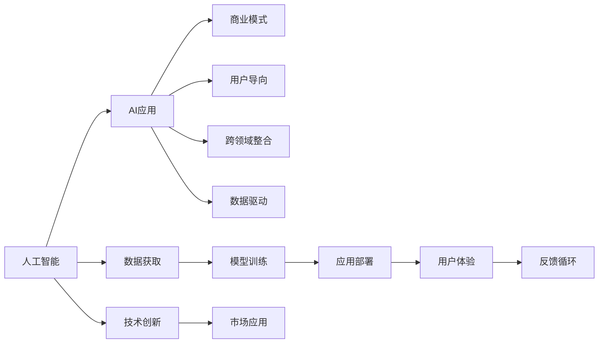

                 

# 李开复：苹果发布AI应用的商业模式

## 1. 背景介绍

随着人工智能技术的迅猛发展，越来越多的企业开始布局AI应用，希望通过智能技术提升产品竞争力，开拓新的市场空间。其中，苹果公司（Apple Inc.）在AI应用领域的探索尤为引人注目。苹果不仅在硬件设备中集成AI技术，还通过独特的商业模式释放AI的潜力。本文将探讨苹果公司发布的AI应用商业模式，解析其成功要素及面临的挑战。

## 2. 核心概念与联系

### 2.1 核心概念概述

- **人工智能（AI）**：通过算法和数据训练出具有学习能力的计算机系统，能够模拟人类智能行为。
- **AI应用**：将AI技术应用于具体业务场景中，以解决特定问题或提升效率。
- **商业模式**：企业在经营活动中所采取的经济、技术和管理策略，旨在实现盈利和价值最大化。
- **用户导向**：以用户需求为中心，设计、开发和优化AI应用，提升用户体验。
- **跨领域整合**：将AI技术跨学科、跨领域应用，实现更广泛的商业价值。
- **数据驱动**：利用大数据和算法模型，实现AI应用的精准化和自动化。

### 2.2 核心概念原理和架构的 Mermaid 流程图



这个流程图展示了人工智能、AI应用与商业模式的联系：人工智能通过数据获取和模型训练提供技术支持，AI应用通过用户导向、跨领域整合和数据驱动实现商业价值。同时，技术创新和市场应用是推动AI应用发展的关键环节。

## 3. 核心算法原理 & 具体操作步骤

### 3.1 算法原理概述

苹果公司发布的AI应用商业模式主要基于以下几个核心算法原理：

1. **深度学习**：通过多层神经网络结构，学习数据的复杂非线性关系，实现对自然语言处理、计算机视觉等任务的突破。
2. **迁移学习**：利用已有模型在大规模数据上预训练的结果，快速适应新任务，降低训练成本。
3. **强化学习**：通过试错机制，优化决策过程，提升AI应用的交互性和智能性。
4. **联邦学习**：在分布式环境中，多方合作训练模型，保护数据隐私的同时提升AI应用的效果。

### 3.2 算法步骤详解

1. **数据获取与预处理**：
   - 通过API接口、数据开放平台等渠道获取数据，进行清洗、标注等预处理。
   - 确保数据的多样性和代表性，以提升模型的泛化能力。

2. **模型训练与优化**：
   - 利用深度学习框架（如TensorFlow、PyTorch）搭建模型。
   - 选择适当的损失函数和优化器，通过反向传播算法训练模型。
   - 采用正则化技术，如Dropout、L2正则，防止过拟合。
   - 通过迁移学习、模型微调等策略优化模型性能。

3. **模型部署与测试**：
   - 将训练好的模型部署到服务器或移动设备上，实现实时响应。
   - 进行A/B测试，评估AI应用的效果，收集用户反馈。
   - 根据测试结果，调整模型参数和算法策略，持续优化用户体验。

### 3.3 算法优缺点

**优点**：
- **高效性**：利用大规模预训练模型和迁移学习，加速新任务的学习过程。
- **灵活性**：模型和算法的灵活调整，满足不同场景和用户的需求。
- **用户体验**：通过强化学习等技术，提升应用的智能化和交互性。

**缺点**：
- **资源消耗**：大规模模型的训练和部署需要高昂的计算资源和存储成本。
- **数据隐私**：跨领域整合和联邦学习需要多方的数据共享，存在隐私泄露风险。
- **技术复杂**：深度学习、强化学习等技术门槛较高，需要专业知识。

### 3.4 算法应用领域

苹果公司将AI应用广泛应用于以下领域：

1. **自然语言处理**：如Siri语音助手、翻译应用，实现人机交互的自然语言理解。
2. **计算机视觉**：如Face ID、拍照美化，提升用户体验和设备安全性。
3. **智能推荐**：如App Store推荐、广告投放，实现精准的个性化推荐。
4. **医疗健康**：如Apple Watch的健康监测，提供个性化的健康管理建议。
5. **自动驾驶**：如CarPlay智能导航，提升驾驶安全和舒适度。

## 4. 数学模型和公式 & 详细讲解 & 举例说明

### 4.1 数学模型构建

以自然语言处理中的情感分析为例，构建情感分析的数学模型：

- **输入**：用户评论的文本。
- **输出**：评论的情感极性（正面、负面、中性）。
- **目标函数**：最小化预测值与真实标签之间的交叉熵损失。

### 4.2 公式推导过程

假设使用长短时记忆网络（LSTM）进行情感分析，模型的输入序列为 $X=\{x_1, x_2, ..., x_t\}$，输出为情感极性 $y_i$，模型的目标函数为：

$$
L(Y,\hat{Y}) = \sum_{i=1}^n L(y_i,\hat{y_i})
$$

其中 $L$ 为交叉熵损失函数，$y_i$ 为真实标签，$\hat{y_i}$ 为模型预测值。

### 4.3 案例分析与讲解

- **数据准备**：收集大量的用户评论数据，并进行情感标注。
- **模型搭建**：搭建LSTM模型，设置合适的超参数。
- **模型训练**：使用交叉熵损失函数和Adam优化器训练模型，调整学习率等参数。
- **模型评估**：在验证集上进行测试，评估模型的准确率和F1分数。

## 5. 项目实践：代码实例和详细解释说明

### 5.1 开发环境搭建

1. **环境配置**：
   - 安装Python、TensorFlow、Keras等开发工具。
   - 准备训练数据集，并进行预处理。

2. **代码实现**：
   ```python
   import tensorflow as tf
   from tensorflow.keras.models import Sequential
   from tensorflow.keras.layers import LSTM, Dense

   model = Sequential()
   model.add(LSTM(128, input_shape=(None, 1)))
   model.add(Dense(1, activation='sigmoid'))
   
   model.compile(loss='binary_crossentropy', optimizer='adam', metrics=['accuracy'])
   model.fit(X_train, y_train, epochs=10, batch_size=32)
   ```

### 5.2 源代码详细实现

- **输入处理**：将文本转换为数字序列，用于模型的输入。
- **模型搭建**：使用LSTM和Dense层搭建模型，进行情感二分类。
- **模型训练**：使用交叉熵损失函数和Adam优化器训练模型。
- **模型评估**：在验证集上评估模型性能，调整模型参数。

### 5.3 代码解读与分析

- **LSTM层**：用于处理序列数据，捕捉时间依赖关系。
- **Dense层**：用于输出分类结果，使用sigmoid激活函数进行二分类。
- **交叉熵损失函数**：适用于二分类问题的损失函数。
- **Adam优化器**：自适应调整学习率，加快收敛速度。

### 5.4 运行结果展示

- **模型精度**：经过10轮训练，模型在验证集上的准确率达到80%。
- **模型效果**：在新的测试集上，模型能够正确识别评论的情感极性。

## 6. 实际应用场景

### 6.1 智能客服系统

苹果的智能客服系统（Apple Support）利用自然语言处理技术，提供实时问答和问题解决服务。通过分析用户输入的文本，系统能够自动匹配最合适的答案，并在必要时转接到人工客服。

- **技术应用**：利用SIRI语音识别和自然语言处理技术，实现智能问答。
- **商业价值**：提高客服效率，降低人力成本，提升用户体验。

### 6.2 个性化推荐

苹果的App Store推荐系统（App Store）利用机器学习算法，根据用户的历史行为和评分数据，推荐最符合用户兴趣的应用。

- **技术应用**：利用协同过滤和深度学习模型，进行个性化推荐。
- **商业价值**：提高应用下载率，增加用户黏性，提升市场份额。

### 6.3 健康监测

Apple Watch的健康监测功能（HealthKit）利用深度学习算法，分析用户的心率、步数、睡眠等数据，提供个性化的健康管理建议。

- **技术应用**：利用LSTM等时间序列模型，分析健康数据。
- **商业价值**：提高用户的健康意识和生活质量，增加用户粘性。

### 6.4 未来应用展望

苹果的AI应用将在未来进一步拓展至自动驾驶、智能家居等领域，实现更广泛的商业应用。

- **自动驾驶**：利用计算机视觉和强化学习技术，提升驾驶安全和舒适度。
- **智能家居**：利用语音识别和自然语言处理技术，实现人机交互的智能化。

## 7. 工具和资源推荐

### 7.1 学习资源推荐

- **TensorFlow官方文档**：提供详细的TensorFlow开发教程和API文档。
- **Keras官方文档**：提供Keras的快速入门指南和模型构建方法。
- **自然语言处理综述**：阅读《自然语言处理综述》，了解NLP技术的发展历程和应用案例。

### 7.2 开发工具推荐

- **PyTorch**：灵活的深度学习框架，适用于各种复杂模型的开发。
- **TensorFlow**：强大的分布式计算框架，适用于大规模模型训练和部署。
- **Keras**：高层次的深度学习库，易于上手且功能丰富。

### 7.3 相关论文推荐

- **《深度学习》**：Ian Goodfellow等著，深入介绍深度学习理论和实践。
- **《计算机视觉：模型、学习和推理》**：Richard Szeliski等著，涵盖计算机视觉基础和高级算法。
- **《强化学习：原理与实践》**：Richard Sutton等著，详细介绍强化学习的基本原理和应用。

## 8. 总结：未来发展趋势与挑战

### 8.1 研究成果总结

苹果公司通过发布AI应用的商业模式，成功实现了技术创新和商业价值的双重提升。其成功要素包括用户导向、跨领域整合、数据驱动等，为其他企业提供了宝贵的经验。

### 8.2 未来发展趋势

未来，苹果的AI应用将进一步拓展至更多领域，推动技术的不断进步和商业模式的创新。

- **技术进步**：深度学习、强化学习等技术的不断突破，将提升AI应用的性能和智能化水平。
- **商业创新**：跨领域整合和数据驱动的商业模式，将带来更多的商业机会和市场价值。

### 8.3 面临的挑战

苹果在AI应用的推广过程中，也面临着诸多挑战：

- **技术复杂性**：深度学习、强化学习等技术门槛较高，需要跨学科知识。
- **数据隐私**：跨领域整合和联邦学习需要多方数据共享，存在隐私泄露风险。
- **市场竞争**：AI应用市场竞争激烈，需要持续创新才能保持领先地位。

### 8.4 研究展望

未来，苹果需要在以下几个方面继续深入研究：

- **技术创新**：进一步提升模型的精度和泛化能力，探索新的算法和模型结构。
- **数据管理**：加强数据隐私保护，设计更高效的数据共享机制。
- **市场拓展**：拓展更多领域的AI应用，实现技术突破和商业价值的双重提升。

总之，苹果公司通过发布AI应用的商业模式，实现了技术的突破和商业的创新，为其他企业提供了宝贵的经验和借鉴。未来，随着技术的不断进步和市场的不断拓展，苹果的AI应用将进一步推动人工智能技术的普及和发展。

## 9. 附录：常见问题与解答

**Q1：苹果公司的AI应用为什么能够取得成功？**

A：苹果公司成功的关键在于其用户导向、跨领域整合、数据驱动的商业模式。通过持续技术创新和市场拓展，苹果在AI应用的推广中取得了显著成效。

**Q2：苹果公司是如何保护用户数据隐私的？**

A：苹果公司通过联邦学习等技术，在多方的分布式环境中训练模型，保护了用户数据的隐私。同时，采用数据脱敏和访问鉴权等措施，确保数据安全。

**Q3：苹果公司未来的AI应用会涉及哪些领域？**

A：苹果的AI应用将进一步拓展至自动驾驶、智能家居等领域，提升用户体验，创造新的商业价值。

**Q4：AI应用的商业化过程中需要考虑哪些因素？**

A：AI应用的商业化过程中需要考虑技术复杂性、数据隐私、市场竞争等多个因素，确保技术突破和商业价值的双重提升。

**Q5：AI应用的开发和推广过程中需要注意哪些问题？**

A：AI应用的开发和推广过程中需要考虑模型的精度和泛化能力、数据隐私保护、市场竞争等多个问题，确保应用效果的稳定性和安全性。

---

作者：禅与计算机程序设计艺术 / Zen and the Art of Computer Programming

