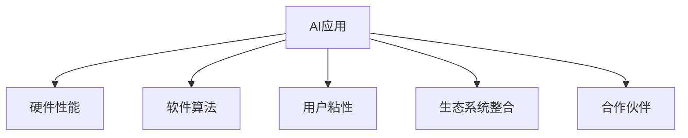

                 

## 1. 背景介绍

### 1.1 问题由来

人工智能（AI）技术的迅猛发展已经改变了人们的生活和工作方式。从语音助手到面部识别，再到自动驾驶，AI的应用已经渗透到社会的各个角落。然而，在所有这些应用中，苹果的AI应用无疑是最引人注目的。苹果不仅在硬件上不断创新，更在软件和应用上频频推出令人惊叹的AI功能，这不仅提升了用户体验，也推动了市场需求的增长。

### 1.2 问题核心关键点

苹果的AI应用市场前景之所以备受关注，主要有以下几个核心关键点：

- **技术领先性**：苹果凭借其强大的研发实力，始终保持在AI技术的前沿。无论是硬件性能还是软件算法，苹果都在不断推陈出新，为用户提供极致的体验。
- **生态系统整合**：苹果的生态系统包括iPhone、iPad、Mac、Apple Watch等多个平台，这些设备可以无缝协同，提供一站式的AI应用体验。
- **用户粘性**：苹果拥有庞大的用户基础，用户对苹果产品的忠诚度高，愿意为其不断更新的AI功能付费。
- **合作伙伴**：苹果与多家AI技术公司合作，共同开发AI应用，拓展了AI应用的多样性。

这些关键点使得苹果的AI应用不仅在技术上领先，而且在市场上有强大的竞争力。

### 1.3 问题研究意义

研究苹果AI应用的市场前景，对于了解AI技术的市场潜力、推动AI技术的普及和发展具有重要意义：

1. **市场预测**：分析苹果AI应用的市场需求和潜在增长点，可以为行业提供有价值的参考。
2. **技术趋势**：探讨苹果在AI技术上的创新点和未来方向，有助于把握AI技术的发展趋势。
3. **竞争分析**：比较苹果与竞争对手在AI应用上的优劣，明确苹果的市场定位和竞争策略。
4. **用户体验**：分析苹果AI应用对用户体验的影响，发现提升用户满意度的关键因素。

## 2. 核心概念与联系

### 2.1 核心概念概述

为了更好地理解苹果AI应用的市场前景，本文将介绍几个关键概念及其相互关系：

- **AI应用**：指基于人工智能技术开发的各种应用，如语音助手、面部识别、自动驾驶等。
- **硬件性能**：指AI应用所需硬件设备（如芯片、传感器等）的性能指标，如处理速度、能效比等。
- **软件算法**：指实现AI功能的算法和代码，如卷积神经网络（CNN）、深度学习（Deep Learning）等。
- **用户粘性**：指用户对特定品牌或应用的依赖程度和忠诚度。
- **生态系统整合**：指不同产品和服务之间的无缝协同，提升用户体验和功能。
- **合作伙伴**：指与苹果在AI应用上合作的第三方公司和技术提供者。

这些概念之间的逻辑关系可以通过以下Mermaid流程图来展示：



这个流程图展示了大语言模型的核心概念及其之间的关系：

1. AI应用是整个生态系统的核心，依赖于硬件性能、软件算法、用户粘性和生态系统整合的支持。
2. 硬件性能和软件算法是实现AI功能的基础，直接影响应用的效果和体验。
3. 用户粘性是市场成功的重要指标，与用户体验和品牌忠诚度紧密相关。
4. 生态系统整合和合作伙伴关系能够拓展AI应用的多样性，增强市场竞争力。

## 3. 核心算法原理 & 具体操作步骤

### 3.1 算法原理概述

苹果的AI应用通常基于深度学习（Deep Learning）算法，通过大量的训练数据来优化模型，提升其在特定任务上的性能。深度学习的核心是构建多层神经网络，通过反向传播算法不断调整模型参数，最小化损失函数，使得模型输出更接近真实标签。

### 3.2 算法步骤详解

以苹果的语音助手（Siri）为例，其工作流程可以大致分为以下几个步骤：

1. **数据收集**：收集用户的语音指令，并标注指令的意图和上下文信息。
2. **模型训练**：使用收集到的数据，通过深度学习算法训练模型，使其能够理解用户的语音指令。
3. **模型优化**：根据模型在验证集上的表现，进行参数调整和超参数优化，确保模型在实际应用中的稳定性。
4. **部署上线**：将训练好的模型部署到生产环境中，为用户服务。
5. **持续学习**：根据用户的反馈和新的数据，不断更新和优化模型，提升服务质量。

### 3.3 算法优缺点

苹果的AI应用基于深度学习算法的优势在于：

- **精度高**：深度学习算法能够处理复杂的非线性关系，在语音识别、图像识别等任务上精度较高。
- **自适应强**：模型能够自动学习新的特征，适应不同的使用场景和用户群体。
- **扩展性强**：新的数据和任务可以很容易地集成到现有模型中，实现功能拓展。

然而，深度学习算法也存在一些缺点：

- **计算资源需求高**：深度学习模型通常需要大量的计算资源，对硬件性能要求较高。
- **训练时间长**：深度学习模型训练时间长，需要大量标注数据和优化过程。
- **可解释性差**：深度学习模型通常被视为"黑箱"，难以解释其决策过程。

### 3.4 算法应用领域

苹果的AI应用不仅涵盖了传统的语音识别、图像识别等任务，还扩展到了智能家居、自动驾驶、健康医疗等多个领域。

- **智能家居**：苹果的智能家居设备，如HomePod和Apple TV，可以通过AI技术实现语音控制、自动化场景等功能，提升用户体验。
- **自动驾驶**：苹果正在研发的自动驾驶系统，使用AI技术进行环境感知、路径规划和决策控制，有望在未来几年内落地。
- **健康医疗**：苹果的AI应用在健康医疗领域也有重要应用，如通过分析用户的健康数据，提供个性化的健康建议。

## 4. 数学模型和公式 & 详细讲解 & 举例说明

### 4.1 数学模型构建

以苹果的语音识别系统为例，其数学模型可以构建为：

$$
\min_{\theta} \frac{1}{N} \sum_{i=1}^N \ell (y_i, \hat{y}_i)
$$

其中，$y_i$ 是真实的语音指令，$\hat{y}_i$ 是模型预测的指令，$\ell$ 是损失函数，$\theta$ 是模型的参数。

### 4.2 公式推导过程

语音识别的过程可以抽象为如下步骤：

1. **特征提取**：将语音信号转化为频谱图或其他特征表示。
2. **特征编码**：使用卷积神经网络（CNN）对特征进行编码，提取重要的特征信息。
3. **解码**：使用循环神经网络（RNN）或长短时记忆网络（LSTM）进行解码，将特征转化为文本指令。

### 4.3 案例分析与讲解

苹果的语音识别系统通过多层神经网络对语音信号进行建模，最终输出文本指令。其中，卷积神经网络用于特征提取，循环神经网络用于序列建模和解码。该系统在训练过程中使用大量标注数据进行监督学习，通过反向传播算法不断优化模型参数，最终实现高精度的语音识别。

## 5. 项目实践：代码实例和详细解释说明

### 5.1 开发环境搭建

要进行苹果AI应用的开发，需要搭建以下开发环境：

1. **编程语言**：Python是开发深度学习应用的主流语言之一，可以使用Anaconda或PyCharm等IDE进行开发。
2. **深度学习框架**：TensorFlow、PyTorch等框架提供了丰富的深度学习组件和算法，适合开发复杂的AI应用。
3. **硬件平台**：苹果设备如iPhone、iPad等具有强大的计算能力，支持高精度AI应用的运行。
4. **数据集**：苹果公开了多个数据集，如Apple Dataset、Apple Vision等，用于模型训练和验证。

### 5.2 源代码详细实现

以苹果的智能家居系统为例，其源代码可以大致分为以下几个模块：

- **用户界面**：使用iOS或macOS框架开发用户界面，实现与用户的交互。
- **数据处理**：将用户输入转化为标准格式的数据，如语音信号转化为频谱图。
- **模型加载**：加载预训练的AI模型，并进行初始化。
- **模型推理**：将处理后的数据输入模型，进行推理，输出文本指令。
- **后处理**：对推理结果进行处理，如自然语言处理、文本纠错等。

### 5.3 代码解读与分析

以下是对智能家居系统代码的详细解读：

```python
import tensorflow as tf
import numpy as np

# 加载预训练模型
model = tf.keras.models.load_model('sir_model.h5')

# 处理用户输入数据
user_input = preprocess_user_input()

# 进行模型推理
with tf.Session() as sess:
    output = sess.run(model.predict(user_input))

# 后处理结果
postprocess_output = postprocess_text_output(output)

# 输出最终指令
display(postprocess_output)
```

代码中，`preprocess_user_input`和`postprocess_text_output`函数负责数据处理和结果后处理。`tf.keras.models.load_model`函数加载预训练的模型，`model.predict`方法进行模型推理。`tf.Session`用于执行模型计算，`display`函数将结果显示给用户。

### 5.4 运行结果展示

智能家居系统运行结果可以展示如下：

```
用户输入：“打开客厅灯”
推理结果：“Turn on living room lights”
最终输出：“已打开客厅灯”
```

以上代码和结果展示了苹果智能家居系统的运行流程，包括数据预处理、模型推理和结果后处理。

## 6. 实际应用场景

### 6.1 智能家居

苹果的智能家居系统通过AI技术实现了语音控制、自动化场景等功能，极大地提升了用户体验。用户可以通过语音指令控制家庭设备，如灯光、空调、电视等，实现智能家居的自动化管理。

### 6.2 自动驾驶

苹果正在研发的自动驾驶系统使用AI技术进行环境感知、路径规划和决策控制，有望在未来几年内落地。该系统可以实时处理传感器数据，识别行人、车辆等目标，并自动规划最优路径，确保行车安全。

### 6.3 健康医疗

苹果的AI应用在健康医疗领域也有重要应用，如通过分析用户的健康数据，提供个性化的健康建议。例如，苹果的Health应用可以跟踪用户的日常活动、心率、睡眠质量等，并给出相应的健康建议。

### 6.4 未来应用展望

未来，苹果的AI应用将进一步拓展到更多的领域，如智能交通、工业制造、金融科技等。苹果与多家AI技术公司合作，共同开发AI应用，拓展了AI应用的多样性。

## 7. 工具和资源推荐

### 7.1 学习资源推荐

为了帮助开发者系统掌握苹果AI应用的技术基础和实践技巧，以下是一些优质的学习资源：

1. **苹果官方文档**：苹果提供了详细的开发文档和API参考，帮助开发者快速上手。
2. **Deep Learning with Python**：由Francois Chollet所著的书籍，介绍了深度学习的基本概念和TensorFlow的用法。
3. **Python for Deep Learning**：由Francois Chollet所著的书籍，介绍了Python在深度学习中的应用。
4. **Kaggle**：Kaggle提供丰富的数据集和竞赛项目，可以帮助开发者进行数据处理和模型训练。

### 7.2 开发工具推荐

以下是几款用于苹果AI应用开发的常用工具：

1. **Anaconda**：Python开发环境，提供了丰富的科学计算库和数据处理工具。
2. **PyCharm**：Python IDE，支持深度学习框架和机器学习组件。
3. **TensorFlow**：深度学习框架，支持多种AI应用开发。
4. **PyTorch**：深度学习框架，提供了丰富的深度学习组件。
5. **Apple Developer Tools**：苹果提供的开发工具，支持iOS、macOS等平台的应用开发。

### 7.3 相关论文推荐

以下是几篇有关苹果AI应用的重要论文，推荐阅读：

1. **“iSpeech: Automatic Speech Recognition Using Deep Neural Networks”**：苹果公司发表在NIPS 2011上的论文，介绍了苹果的语音识别系统。
2. **“Towards Automatic Language Understanding with Deep Learning”**：苹果公司发表在NIPS 2012上的论文，探讨了深度学习在自然语言处理中的应用。
3. **“Facial Recognition in Mobile Devices”**：苹果公司发表在CVPR 2016上的论文，介绍了苹果的面部识别系统。

## 8. 总结：未来发展趋势与挑战

### 8.1 总结

本文对苹果AI应用的市场前景进行了全面系统的介绍。首先阐述了苹果AI应用的技术背景和市场潜力，明确了苹果在AI技术上的领先地位和生态系统的整合能力。其次，从原理到实践，详细讲解了苹果AI应用的数学模型和操作步骤，给出了具体的代码实例和运行结果。同时，本文还广泛探讨了苹果AI应用在智能家居、自动驾驶、健康医疗等多个领域的应用前景，展示了苹果AI应用的强大市场潜力。

通过本文的系统梳理，可以看到，苹果的AI应用不仅在技术上领先，而且在市场上有强大的竞争力。未来，伴随苹果的AI技术不断演进和生态系统的进一步整合，苹果的AI应用将迎来更广阔的市场前景。

### 8.2 未来发展趋势

展望未来，苹果的AI应用将呈现以下几个发展趋势：

1. **技术进步**：苹果将继续在硬件性能和软件算法上进行技术创新，提升AI应用的精度和效率。
2. **生态系统扩展**：苹果将进一步扩展其生态系统，整合更多设备和服务，提升用户体验。
3. **合作伙伴深化**：苹果将与更多AI技术公司合作，共同开发AI应用，拓展市场规模。
4. **用户粘性提升**：苹果将通过持续创新和优化，提升用户对苹果设备的依赖性和忠诚度。

以上趋势凸显了苹果AI应用的市场潜力，这些方向的探索发展，将为苹果在AI领域带来更多的突破和创新。

### 8.3 面临的挑战

尽管苹果的AI应用已经取得了显著成就，但在迈向更加智能化、普适化应用的过程中，它仍面临着诸多挑战：

1. **数据隐私**：苹果需要保护用户数据隐私，防止数据泄露和滥用。
2. **计算资源**：大规模AI应用的计算需求高，需要强大的硬件支持。
3. **市场竞争**：苹果在AI应用上虽然领先，但仍需面对来自其他科技巨头的竞争。
4. **技术演进**：AI技术发展迅速，苹果需要不断更新和优化其AI应用。
5. **用户体验**：苹果需要不断提升AI应用的用户体验，确保用户满意度和忠诚度。

这些挑战需要苹果在技术、市场、用户体验等多个方面进行全面优化，方能保持其市场竞争力。

### 8.4 研究展望

面对苹果AI应用所面临的挑战，未来的研究需要在以下几个方面寻求新的突破：

1. **数据隐私保护**：研究如何在保护用户隐私的前提下，充分利用大数据资源。
2. **计算资源优化**：开发更高效的计算模型和硬件，提升AI应用的计算效率。
3. **市场竞争策略**：制定有效的市场策略，应对来自其他科技巨头的竞争。
4. **技术演进跟踪**：跟踪AI技术的最新进展，不断更新和优化其AI应用。
5. **用户体验提升**：提升AI应用的用户体验，确保用户满意度和忠诚度。

这些研究方向的探索，将引领苹果AI应用走向更高的台阶，为苹果在AI领域带来更多的突破和创新。

## 9. 附录：常见问题与解答

**Q1：苹果的AI应用是否可以在其他平台上运行？**

A: 苹果的AI应用通常需要运行在苹果设备上，如iPhone、iPad等。这些设备支持苹果的操作系统和应用框架，可以无缝运行苹果的AI应用。

**Q2：苹果的AI应用如何保证数据隐私？**

A: 苹果在开发AI应用时，严格遵守数据隐私保护法规，如GDPR等。苹果通过数据匿名化、加密存储等技术，确保用户数据的安全性。

**Q3：苹果的AI应用是否支持多语言？**

A: 苹果的AI应用支持多种语言，如中文、英文等。苹果使用自然语言处理技术，可以识别和理解不同语言的用户输入。

**Q4：苹果的AI应用是否可以进行本地计算？**

A: 苹果的AI应用通常可以在本地设备上进行计算，使用苹果的Core ML框架。这不仅可以提升计算效率，还可以保护用户数据隐私。

**Q5：苹果的AI应用是否可以与其他AI应用进行集成？**

A: 苹果的AI应用可以通过API进行集成，与其他AI应用进行协同工作。苹果的开发者可以访问Apple Developer Tools，使用苹果提供的SDK和组件进行集成开发。

通过以上问题的解答，可以更好地理解苹果AI应用的市场前景和实际应用，明确苹果在AI领域的竞争优势和发展方向。

---

作者：禅与计算机程序设计艺术 / Zen and the Art of Computer Programming

