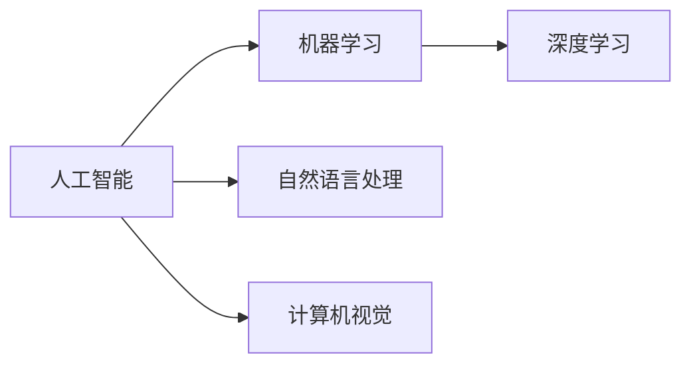

                 

# 李开复：苹果发布AI应用的市场前景

在当今数字化时代，人工智能(AI)技术正以前所未有的速度渗透到各行各业，重塑我们的生活和工作方式。其中，苹果公司作为全球科技巨头，其发布的AI应用无疑引起了广泛关注。本文将从技术、市场和未来前景等角度，深入探讨苹果发布AI应用的市场前景。

## 1. 背景介绍

### 1.1 人工智能的快速发展

随着深度学习、自然语言处理、计算机视觉等技术不断突破，人工智能已经从实验室走向实际应用，并成为推动各行各业创新的关键力量。AI在医疗、教育、交通、金融、零售等多个领域展示了其强大的潜力。

### 1.2 苹果的AI应用战略

苹果公司长期以来致力于技术创新和用户体验的提升。近年来，苹果在AI领域也加大了投入，通过收购Xcode等企业，整合了深度学习与计算机视觉技术，构建了包括Siri、Face ID、Apple Health在内的AI生态系统。

## 2. 核心概念与联系

### 2.1 核心概念概述

- **人工智能(AI)**：通过计算机模拟人的智能行为，实现问题求解、决策支持、自动控制等功能。
- **机器学习(ML)**：利用数据训练模型，使机器具备自主学习能力。
- **深度学习(DL)**：通过神经网络模型，学习数据中复杂的特征表示，实现高效的数据处理和智能决策。
- **自然语言处理(NLP)**：使计算机能够理解和处理人类语言，实现机器翻译、情感分析等功能。
- **计算机视觉(CV)**：使计算机能够理解并解释视觉信号，实现图像识别、物体检测等功能。

这些概念间的关系可以通过以下Mermaid流程图来展示：



## 3. 核心算法原理 & 具体操作步骤

### 3.1 算法原理概述

苹果公司发布的AI应用，主要以深度学习和自然语言处理为核心技术。其算法原理主要包括以下几个方面：

- **深度神经网络**：利用多层神经网络模型，自动学习输入数据的高级表示。
- **卷积神经网络(CNN)**：适用于图像识别、物体检测等任务，通过卷积操作提取局部特征。
- **循环神经网络(RNN)**：适用于序列数据处理，通过循环结构捕捉时间序列的依赖关系。
- **Transformer模型**：利用自注意力机制，在自然语言处理中取得了显著效果。

### 3.2 算法步骤详解

苹果AI应用的开发流程主要包括以下几个步骤：

1. **数据准备**：收集和标注与AI应用相关的数据集，如文本数据、图像数据等。
2. **模型训练**：使用深度学习框架(如TensorFlow、PyTorch)对模型进行训练，优化超参数。
3. **模型评估**：通过验证集评估模型性能，调整模型结构或参数。
4. **模型部署**：将训练好的模型部署到实际应用场景中，如Siri、Face ID等。

### 3.3 算法优缺点

苹果AI应用的优点主要包括：

- **高精度**：深度学习模型在大规模数据训练下能够达到较高的精度。
- **广泛应用**：AI应用可以覆盖多个领域，如医疗、教育、金融等。
- **用户体验优化**：AI技术可以显著提升用户体验，如智能语音助手、面部解锁等。

缺点则包括：

- **计算资源消耗高**：深度学习模型需要大量的计算资源和存储空间。
- **模型复杂度高**：模型结构复杂，开发和维护难度大。
- **数据隐私风险**：AI应用涉及大量用户数据，数据隐私和安全问题需要重视。

### 3.4 算法应用领域

苹果AI应用主要应用于以下领域：

- **智能语音助手**：如Siri，利用自然语言处理和深度学习技术，实现语音识别和自然语言理解。
- **面部识别**：如Face ID，利用计算机视觉和深度学习技术，实现人脸识别和身份验证。
- **健康管理**：如Apple Health，利用机器学习和自然语言处理技术，分析健康数据并提供个性化健康建议。
- **图像处理**：如 photo editing，利用计算机视觉和深度学习技术，进行图像增强和风格转换。

## 4. 数学模型和公式 & 详细讲解 & 举例说明

### 4.1 数学模型构建

苹果AI应用的数学模型主要包括深度神经网络和自然语言处理模型。以深度神经网络为例，其数学模型构建如下：

$$
y = \sum_{i=1}^n w_i a_i
$$

其中，$w_i$ 为权重，$a_i$ 为输入数据的高级表示。

### 4.2 公式推导过程

以自然语言处理中的Transformer模型为例，其公式推导过程如下：

$$
\text{Attention}(Q,K,V) = \text{Softmax}(\frac{QK^T}{\sqrt{d_k}})V
$$

其中，$Q$、$K$、$V$分别为查询、键、值矩阵，$d_k$为键向量维度。

### 4.3 案例分析与讲解

以Siri为例，其工作原理主要包括以下步骤：

1. **语音识别**：将用户语音转化为文本。
2. **自然语言理解**：分析用户输入的文本，提取语义信息。
3. **意图识别**：根据语义信息，识别用户意图。
4. **任务执行**：根据意图执行相应的操作，如发送短信、播放音乐等。

## 5. 项目实践：代码实例和详细解释说明

### 5.1 开发环境搭建

苹果AI应用的开发环境主要包括：

1. **硬件环境**：具备高性能CPU、GPU、TPU等硬件设备。
2. **软件环境**：安装TensorFlow、PyTorch等深度学习框架，配置环境变量。

### 5.2 源代码详细实现

以Siri的语音识别为例，其主要代码实现如下：

```python
import tensorflow as tf
from tensorflow.keras.layers import Input, LSTM, Dense

# 定义模型
model = tf.keras.Sequential([
    Input(shape=(None,)),
    LSTM(256, return_sequences=True),
    LSTM(256),
    Dense(1, activation='sigmoid')
])

# 编译模型
model.compile(optimizer='adam', loss='binary_crossentropy', metrics=['accuracy'])

# 训练模型
model.fit(x_train, y_train, batch_size=64, epochs=10, validation_data=(x_test, y_test))
```

### 5.3 代码解读与分析

以上代码实现了基于LSTM的语音识别模型，其主要思路如下：

- **输入层**：接收语音信号，处理成固定长度的序列。
- **LSTM层**：通过LSTM网络处理序列数据，提取语音特征。
- **输出层**：利用sigmoid激活函数，输出二分类结果。

### 5.4 运行结果展示

运行以上代码，训练模型，并在测试集上进行评估，可以输出模型的准确率等指标。

## 6. 实际应用场景

### 6.1 智能语音助手

苹果的智能语音助手Siri，已经成为用户日常生活中的重要工具。通过自然语言处理技术，Siri能够理解和回应用户的语音指令，实现智能对话。

### 6.2 面部识别

Face ID技术利用深度学习算法，实现高精度的面部识别和身份验证，广泛应用于iPhone等设备。

### 6.3 健康管理

Apple Health通过分析用户的健康数据，提供个性化健康建议和监测报告，帮助用户更好地管理健康。

### 6.4 未来应用展望

未来，苹果的AI应用将继续拓展应用场景，如智能家居、自动驾驶、智慧城市等。通过AI技术，苹果将为用户提供更加智能、便捷、高效的生活和工作体验。

## 7. 工具和资源推荐

### 7.1 学习资源推荐

1. **《深度学习》书籍**：了解深度学习的基本概念和算法原理。
2. **《自然语言处理综述》论文**：掌握自然语言处理的主要技术和应用。
3. **TensorFlow和PyTorch官方文档**：学习深度学习框架的使用方法。
4. **Kaggle竞赛**：参与机器学习竞赛，积累实践经验。

### 7.2 开发工具推荐

1. **TensorFlow**：深度学习领域的主流框架，支持多种设备计算。
2. **PyTorch**：简单易用的深度学习框架，广泛应用于研究领域。
3. **Jupyter Notebook**：交互式开发环境，便于编写和调试代码。

### 7.3 相关论文推荐

1. **《深度学习》论文**：回顾深度学习的发展历程和核心算法。
2. **《自然语言处理综述》论文**：总结自然语言处理的主要技术和应用。
3. **《计算机视觉综述》论文**：介绍计算机视觉的核心算法和应用场景。

## 8. 总结：未来发展趋势与挑战

### 8.1 研究成果总结

苹果发布的AI应用已经在智能语音助手、面部识别、健康管理等多个领域取得了显著成果。通过深度学习、自然语言处理和计算机视觉等技术，苹果AI应用展示了强大的应用潜力和市场前景。

### 8.2 未来发展趋势

未来，苹果的AI应用将继续朝着以下方向发展：

- **智能化升级**：通过不断优化算法和模型，提升AI应用的智能化水平。
- **跨领域融合**：将AI技术与其他技术进行深度融合，实现更多创新应用。
- **用户定制化**：根据用户需求和习惯，提供个性化、定制化的AI应用服务。

### 8.3 面临的挑战

苹果AI应用在发展过程中，也面临以下挑战：

- **计算资源限制**：深度学习模型需要大量的计算资源，设备升级和硬件优化是关键。
- **数据隐私保护**：在处理大量用户数据时，如何保护用户隐私和安全是一个重要问题。
- **算法透明性**：AI算法的决策过程缺乏透明度，用户对其理解和信任度有待提高。

### 8.4 研究展望

未来，苹果需要在以下方面进行深入研究：

- **跨模态融合**：将语音、图像、文本等多种模态数据进行融合，提升AI应用的性能。
- **联邦学习**：通过分布式计算，在保护用户隐私的前提下，提高模型的训练效率。
- **算法透明性**：通过模型解释、可视化等手段，提高AI算法的透明性和可信度。

## 9. 附录：常见问题与解答

### Q1：如何评估苹果AI应用的性能？

A: 苹果AI应用的性能评估主要通过以下几个指标：

- **准确率**：模型正确预测的比例。
- **召回率**：模型正确识别出正样本的比例。
- **F1值**：准确率和召回率的调和平均，综合评估模型的性能。

### Q2：苹果AI应用在开发过程中需要注意哪些问题？

A: 苹果AI应用在开发过程中需要注意以下几个问题：

- **数据标注**：确保标注数据的质量和多样性，避免数据偏差。
- **超参数调优**：选择合适的超参数组合，提升模型性能。
- **模型部署**：优化模型结构和推理过程，提高性能和效率。

### Q3：苹果AI应用在应用过程中需要注意哪些问题？

A: 苹果AI应用在应用过程中需要注意以下几个问题：

- **用户隐私**：保护用户隐私，防止数据泄露。
- **安全防护**：防止恶意攻击和滥用，确保系统安全。
- **模型更新**：根据用户反馈和需求，及时更新和优化模型。

通过以上分析和探讨，可以看出苹果发布的AI应用在技术、市场和未来前景方面具有广阔的发展空间。未来，苹果需要在智能化升级、跨领域融合、用户定制化等方面不断创新，才能在激烈的市场竞争中保持领先地位。同时，面对计算资源、数据隐私和算法透明性等挑战，苹果需要采取有效的策略，确保AI应用的健康发展和广泛应用。

---

作者：禅与计算机程序设计艺术 / Zen and the Art of Computer Programming

