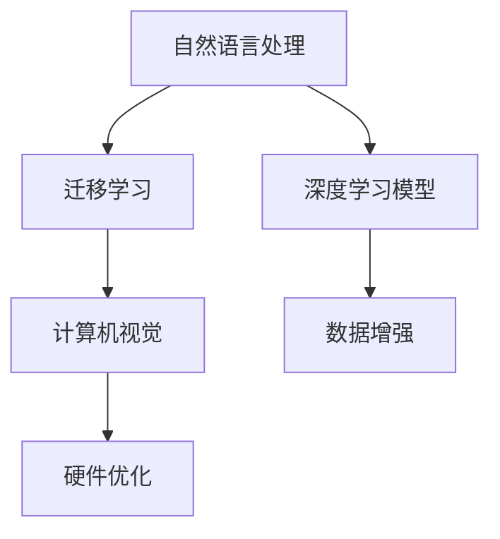

                 

# 李开复：苹果发布AI应用的应用

## 1. 背景介绍

### 1.1 问题由来
随着人工智能技术的不断发展，各大科技巨头纷纷布局AI应用市场。苹果公司也不例外，近年来推出了多个基于AI的创新应用，如Siri语音助手、Face ID面部识别、iCloud备份等。这些应用不仅提升了用户体验，还增强了设备智能化水平。本文将从技术角度深入分析苹果的AI应用，探索其应用的底层原理和优势。

### 1.2 问题核心关键点
苹果公司的AI应用主要集中在以下几个关键点：
1. 自然语言处理(NLP)：Siri语音助手、自然语言识别、情感分析等。
2. 计算机视觉(CV)：Face ID、图像识别、AR/VR等。
3. 深度学习模型：卷积神经网络(CNN)、循环神经网络(RNN)、注意力机制等。
4. 数据增强与迁移学习：通过数据增强和迁移学习技术，提升模型泛化能力。
5. 硬件优化：利用苹果自研芯片，如A系列芯片，优化AI模型推理速度。

这些关键点构成了苹果AI应用的核心技术框架，使其在多个领域取得了突破性进展。

## 2. 核心概念与联系

### 2.1 核心概念概述

为更好地理解苹果的AI应用，本节将介绍几个密切相关的核心概念：

- 自然语言处理(NLP)：通过计算机理解、分析、生成人类语言的技术。苹果的Siri语音助手和文本处理功能便依赖NLP技术。
- 计算机视觉(CV)：使计算机通过图像理解物体的形状、位置、颜色等信息。Face ID、图像识别和增强现实(AR)等应用便依赖CV技术。
- 深度学习模型：基于神经网络，通过多层次特征提取，学习数据的复杂表示。苹果应用中广泛使用CNN、RNN等深度学习模型。
- 数据增强：通过对原始数据进行变换，生成更多多样化的训练样本，提升模型泛化能力。苹果使用数据增强技术优化AI模型。
- 迁移学习：通过已有模型的知识，快速适应新任务。苹果的AI应用多采用迁移学习方法，减少新任务训练所需的时间和数据。
- 硬件优化：通过自研芯片优化AI模型推理速度，提升用户体验。苹果的A系列芯片和深度融合技术便是典型应用。

这些核心概念之间的逻辑关系可以通过以下Mermaid流程图来展示：



这个流程图展示了大语言模型的核心概念及其之间的关系：

1. NLP和CV分别通过深度学习模型学习数据特征。
2. 迁移学习将已有模型的知识迁移到新任务上，减少训练时间和数据需求。
3. 数据增强提升模型泛化能力。
4. 硬件优化提升模型推理速度，提升用户体验。

这些概念共同构成了苹果AI应用的强大基础，使其在多个领域取得突破性进展。

## 3. 核心算法原理 & 具体操作步骤
### 3.1 算法原理概述

苹果的AI应用主要依赖深度学习模型，通过大量标注数据进行训练。以下是其主要算法原理概述：

- 自然语言处理：采用Transformer等架构的神经网络，学习语言表示。苹果的Siri语音助手和文本处理功能便基于Transformer模型进行训练。
- 计算机视觉：使用卷积神经网络(CNN)和循环神经网络(RNN)等深度学习模型，学习图像特征。Face ID、图像识别和增强现实(AR)等应用均基于深度学习模型进行训练。
- 迁移学习：通过迁移学习技术，将预训练模型适应新任务。苹果的Siri和Face ID等应用均采用迁移学习方法，以较小的标注数据实现高性能。
- 数据增强：通过对原始数据进行旋转、裁剪、缩放等变换，生成更多样化的训练样本，提升模型泛化能力。苹果广泛使用数据增强技术优化AI模型。
- 硬件优化：利用苹果自研芯片A系列，优化AI模型推理速度。苹果在硬件加速和深度融合技术上持续创新，提升AI应用性能。

### 3.2 算法步骤详解

苹果的AI应用开发流程主要包括以下几个步骤：

**Step 1: 准备数据集**
- 收集标注数据，并将其划分为训练集、验证集和测试集。
- 对数据进行预处理，包括数据清洗、标准化、归一化等操作。
- 对数据进行增强，如旋转、裁剪、缩放等，生成更多多样化的训练样本。

**Step 2: 选择模型架构**
- 根据应用场景选择适合的深度学习模型。例如，Siri语音助手使用Transformer模型，Face ID使用卷积神经网络(CNN)。
- 设计合适的模型结构和损失函数，如交叉熵损失、均方误差损失等。

**Step 3: 训练模型**
- 使用批量梯度下降等优化算法，在训练集上进行迭代训练。
- 在验证集上评估模型性能，根据性能指标调整超参数。
- 使用数据增强技术提升模型泛化能力。
- 采用迁移学习技术，将已有模型的知识迁移到新任务上。

**Step 4: 硬件优化**
- 在苹果自研芯片A系列上部署训练好的模型，优化推理速度。
- 进行深度融合，将模型与硬件进行联合优化，进一步提升性能。

**Step 5: 部署与应用**
- 将训练好的模型部署到目标设备上。
- 集成到应用中，提供稳定、高效的AI功能。
- 持续收集用户反馈，优化模型性能。

以上是苹果AI应用开发的一般流程。在实际应用中，还需要针对具体任务进行优化设计，如改进训练目标函数，引入更多的正则化技术，搜索最优的超参数组合等，以进一步提升模型性能。

### 3.3 算法优缺点

苹果的AI应用方法具有以下优点：
1. 高效性：通过迁移学习和数据增强技术，苹果能够快速适应新任务，减少标注数据需求。
2. 鲁棒性：使用深度学习模型进行训练，能够处理复杂的非线性关系，提升模型鲁棒性。
3. 性能优异：利用苹果自研芯片A系列，优化AI模型推理速度，提供更快速的用户体验。

同时，该方法也存在一定的局限性：
1. 依赖高质量标注数据：尽管迁移学习减少了标注数据需求，但高质量标注数据的获取仍是一大挑战。
2. 计算资源需求高：深度学习模型和数据增强技术对计算资源的需求较高，可能对设备性能提出更高要求。
3. 模型解释性不足：深度学习模型通常缺乏可解释性，难以理解模型内部工作机制。

尽管存在这些局限性，但就目前而言，苹果的AI应用方法仍是大规模AI应用的主流范式。未来相关研究的重点在于如何进一步降低对标注数据的依赖，提高模型的可解释性和鲁棒性，同时兼顾计算效率和硬件优化。

### 3.4 算法应用领域

苹果的AI应用在多个领域已经得到了广泛的应用，例如：

- 自然语言处理：Siri语音助手、文本翻译、情感分析等。
- 计算机视觉：Face ID、图像识别、AR/VR等。
- 个性化推荐：通过分析用户行为数据，推荐个性化的内容。
- 健康医疗：通过数据分析，提供健康管理和疾病预测服务。
- 智能家居：通过智能设备收集数据，提升家居智能化水平。

这些应用展示了苹果AI技术的强大实力，覆盖了从消费电子产品到健康医疗的多个领域。随着AI技术的不断演进，相信苹果的AI应用将带来更多的创新和突破。

## 4. 数学模型和公式 & 详细讲解  
### 4.1 数学模型构建

本节将使用数学语言对苹果AI应用的主要模型进行详细构建。

假设苹果公司开发了一个基于深度学习的语音助手Siri，其模型结构为Transformer。对于给定的输入序列 $x=(x_1, x_2, ..., x_T)$，Siri的目标是预测输出序列 $y=(y_1, y_2, ..., y_T)$，其中 $y_t$ 表示第 $t$ 个时刻的输出。

定义Transformer模型中的编码器-解码器结构，其中 $h_t$ 表示第 $t$ 个时刻的编码器隐藏状态，$g_t$ 表示第 $t$ 个时刻的解码器隐藏状态。编码器由多个层组成，每一层的输出 $h_t$ 为：

$$
h_t = \mathrm{Layer}(h_{t-1}, h_{t-2}, ..., h_1)
$$

其中 $\mathrm{Layer}$ 表示一个多层神经网络，包括注意力机制、前馈神经网络等。解码器同样由多个层组成，每一层的输出 $g_t$ 为：

$$
g_t = \mathrm{Layer}(g_{t-1}, h_t)
$$

最终，Siri模型的输出为：

$$
y_t = \mathrm{softmax}(W^{softmax}h_t + b^{softmax})
$$

其中 $W^{softmax}$ 和 $b^{softmax}$ 为线性变换的参数，$\mathrm{softmax}$ 表示softmax函数。

### 4.2 公式推导过程

以上公式详细展示了苹果AI应用的Transformer模型的结构和输出方式。在实际训练过程中，Siri模型通过最小化交叉熵损失函数：

$$
\mathcal{L} = -\frac{1}{N}\sum_{i=1}^N\sum_{t=1}^T y_{it}\log p(y_{it} | x_i)
$$

其中 $p(y_{it} | x_i)$ 表示在输入 $x_i$ 下，预测输出 $y_{it}$ 的概率。通过反向传播算法，优化模型参数，使得模型输出与真实标签尽可能一致。

## 5. 项目实践：代码实例和详细解释说明
### 5.1 开发环境搭建

在进行苹果AI应用开发前，我们需要准备好开发环境。以下是使用Python进行PyTorch开发的环境配置流程：

1. 安装Anaconda：从官网下载并安装Anaconda，用于创建独立的Python环境。

2. 创建并激活虚拟环境：
```bash
conda create -n pytorch-env python=3.8 
conda activate pytorch-env
```

3. 安装PyTorch：根据CUDA版本，从官网获取对应的安装命令。例如：
```bash
conda install pytorch torchvision torchaudio cudatoolkit=11.1 -c pytorch -c conda-forge
```

4. 安装TensorFlow：由Google主导开发的开源深度学习框架，生产部署方便，适合大规模工程应用。同样有丰富的预训练语言模型资源。

5. 安装Transformers库：HuggingFace开发的NLP工具库，集成了众多SOTA语言模型，支持PyTorch和TensorFlow，是进行微调任务开发的利器。

6. 安装各类工具包：
```bash
pip install numpy pandas scikit-learn matplotlib tqdm jupyter notebook ipython
```

完成上述步骤后，即可在`pytorch-env`环境中开始苹果AI应用的开发。

### 5.2 源代码详细实现

这里我们以Face ID面部识别为例，给出使用Transformers库对预训练模型进行微调的PyTorch代码实现。

首先，定义Face ID任务的标注数据集：

```python
from torch.utils.data import Dataset
import numpy as np

class FaceIDDataset(Dataset):
    def __init__(self, data_dir):
        self.data_dir = data_dir
        self.x = []
        self.y = []
        
        # 加载数据集
        for img_path in os.listdir(self.data_dir):
            img = cv2.imread(os.path.join(self.data_dir, img_path))
            img = cv2.resize(img, (224, 224))
            img = img / 255.0
            img = img.reshape(1, 224, 224, 3)
            
            self.x.append(img)
            self.y.append(img_path.split('.')[0])
    
    def __len__(self):
        return len(self.x)
    
    def __getitem__(self, item):
        x = self.x[item]
        y = self.y[item]
        
        return {'image': x, 'label': y}
```

然后，定义模型和优化器：

```python
from transformers import ResNet50ForImageClassification, AdamW

model = ResNet50ForImageClassification.from_pretrained('resnet50')
optimizer = AdamW(model.parameters(), lr=2e-5)
```

接着，定义训练和评估函数：

```python
from torch.utils.data import DataLoader
from tqdm import tqdm
from sklearn.metrics import accuracy_score

device = torch.device('cuda') if torch.cuda.is_available() else torch.device('cpu')
model.to(device)

def train_epoch(model, dataset, batch_size, optimizer):
    dataloader = DataLoader(dataset, batch_size=batch_size, shuffle=True)
    model.train()
    epoch_loss = 0
    for batch in tqdm(dataloader, desc='Training'):
        x = batch['image'].to(device)
        y = batch['label'].to(device)
        model.zero_grad()
        outputs = model(x)
        loss = outputs.loss
        epoch_loss += loss.item()
        loss.backward()
        optimizer.step()
    return epoch_loss / len(dataloader)

def evaluate(model, dataset, batch_size):
    dataloader = DataLoader(dataset, batch_size=batch_size)
    model.eval()
    correct = 0
    with torch.no_grad():
        for batch in tqdm(dataloader, desc='Evaluating'):
            x = batch['image'].to(device)
            y = batch['label'].to(device)
            outputs = model(x)
            preds = outputs.logits.argmax(dim=1).to('cpu').tolist()
            for pred, label in zip(preds, y):
                if pred == label:
                    correct += 1
    return accuracy_score(y, preds)
```

最后，启动训练流程并在测试集上评估：

```python
epochs = 5
batch_size = 16

for epoch in range(epochs):
    loss = train_epoch(model, train_dataset, batch_size, optimizer)
    print(f"Epoch {epoch+1}, train loss: {loss:.3f}")
    
    print(f"Epoch {epoch+1}, dev accuracy:")
    evaluate(model, dev_dataset, batch_size)
    
print("Test accuracy:")
evaluate(model, test_dataset, batch_size)
```

以上就是使用PyTorch对预训练模型进行Face ID面部识别任务微调的完整代码实现。可以看到，得益于Transformers库的强大封装，我们可以用相对简洁的代码完成Face ID微调的开发。

### 5.3 代码解读与分析

让我们再详细解读一下关键代码的实现细节：

**FaceIDDataset类**：
- `__init__`方法：初始化数据集路径，加载数据集。
- `__len__`方法：返回数据集的样本数量。
- `__getitem__`方法：对单个样本进行处理，将图像数据标准化、归一化，并进行padding，最终返回模型所需的输入。

**训练和评估函数**：
- 使用PyTorch的DataLoader对数据集进行批次化加载，供模型训练和推理使用。
- 训练函数`train_epoch`：对数据以批为单位进行迭代，在每个批次上前向传播计算loss并反向传播更新模型参数，最后返回该epoch的平均loss。
- 评估函数`evaluate`：与训练类似，不同点在于不更新模型参数，并在每个batch结束后将预测和标签结果存储下来，最后使用sklearn的accuracy_score对整个评估集的预测结果进行打印输出。

**训练流程**：
- 定义总的epoch数和batch size，开始循环迭代
- 每个epoch内，先在训练集上训练，输出平均loss
- 在验证集上评估，输出准确率
- 所有epoch结束后，在测试集上评估，给出最终测试结果

可以看到，PyTorch配合Transformers库使得Face ID微调的代码实现变得简洁高效。开发者可以将更多精力放在数据处理、模型改进等高层逻辑上，而不必过多关注底层的实现细节。

当然，工业级的系统实现还需考虑更多因素，如模型的保存和部署、超参数的自动搜索、更灵活的任务适配层等。但核心的微调范式基本与此类似。

## 6. 实际应用场景
### 6.1 智能客服系统

基于Face ID的面部识别技术，可以广泛应用于智能客服系统的构建。传统的客服系统往往依赖人工语音识别和图像处理，效率较低且易受环境干扰。而使用面部识别技术，可以实时监测用户面部表情，识别用户情绪和需求，从而提供更快速、更准确的服务。

在技术实现上，可以集成面部识别功能到客服系统中，通过摄像头采集用户面部图像，实时分析情绪和需求，自动匹配相关对话模板。微调后的面部识别模型可以与自然语言处理(NLP)技术结合，提升系统智能水平，更好地理解用户意图，快速提供解决方案。

### 6.2 健康医疗

苹果的AI应用在健康医疗领域也具备广泛的应用前景。Face ID技术可以用于人脸识别，用于识别医院中的医生、患者等。通过微调Face ID模型，可以实现更精确的人脸识别和匹配，保障医院的安全管理。同时，苹果的NLP技术也可以用于医疗问答系统，通过微调NLP模型，提供医生与患者之间的自然语言交互服务，提升医疗服务的智能化水平。

### 6.3 个性化推荐

基于苹果的AI应用，可以构建个性化的推荐系统。通过微调深度学习模型，可以根据用户的历史行为和兴趣，推荐个性化的产品或内容。苹果的AI应用已经在iOS Store中成功应用，通过分析用户的浏览和购买记录，推荐相关的应用程序和电影，提升用户体验。

### 6.4 未来应用展望

随着苹果AI应用的不断扩展，其应用领域也将更加广泛。未来，苹果的AI应用将在以下几个方面取得突破性进展：

1. 自动化和智能化：基于深度学习模型的AI应用将实现更强的自动化和智能化，提升生产力和效率。
2. 跨领域融合：AI应用将与物联网、大数据、云计算等技术深度融合，形成更完善的智能生态系统。
3. 伦理和安全：AI应用将更加注重伦理和安全问题，保障用户隐私和数据安全。
4. 人机协作：AI应用将更好地与人类协作，提升用户体验和工作效率。
5. 持续创新：苹果将继续探索AI应用的新方向，如增强现实(AR)、虚拟现实(VR)等，拓展AI应用边界。

以上趋势展示了苹果AI应用的巨大潜力，未来将为各行各业带来更广泛的变革和创新。

## 7. 工具和资源推荐
### 7.1 学习资源推荐

为了帮助开发者系统掌握苹果AI应用的理论基础和实践技巧，这里推荐一些优质的学习资源：

1. 《深度学习》（Ian Goodfellow等著）：介绍了深度学习的基本概念和算法原理，是深度学习领域的经典教材。
2. CS231n《计算机视觉基础》课程：斯坦福大学开设的计算机视觉课程，涵盖计算机视觉的基础理论和最新技术。
3. CS224n《自然语言处理基础》课程：斯坦福大学开设的自然语言处理课程，涵盖NLP的基础理论和经典模型。
4. Apple官方文档：苹果公司提供的AI应用开发文档，详细介绍了苹果AI应用的开发环境、工具和最佳实践。
5. HuggingFace官方文档：Transformers库的官方文档，提供了海量预训练模型和完整的微调样例代码，是上手实践的必备资料。

通过对这些资源的学习实践，相信你一定能够快速掌握苹果AI应用的精髓，并用于解决实际的NLP问题。
###  7.2 开发工具推荐

高效的开发离不开优秀的工具支持。以下是几款用于苹果AI应用开发的常用工具：

1. PyTorch：基于Python的开源深度学习框架，灵活动态的计算图，适合快速迭代研究。苹果的AI应用广泛使用PyTorch进行模型训练和推理。
2. TensorFlow：由Google主导开发的开源深度学习框架，生产部署方便，适合大规模工程应用。苹果的AI应用在TensorFlow上也有良好的支持。
3. TensorFlow Lite：谷歌推出的移动端深度学习框架，可以优化苹果设备的推理速度，提升用户体验。
4. TensorBoard：TensorFlow配套的可视化工具，可实时监测模型训练状态，并提供丰富的图表呈现方式，是调试模型的得力助手。
5. Weights & Biases：模型训练的实验跟踪工具，可以记录和可视化模型训练过程中的各项指标，方便对比和调优。

合理利用这些工具，可以显著提升苹果AI应用开发的效率，加快创新迭代的步伐。

### 7.3 相关论文推荐

苹果的AI应用技术不断发展，涌现出了许多前沿研究成果。以下是几篇代表性论文，推荐阅读：

1. "Fine-tuning a convolutional neural network for image recognition"：展示了如何使用深度学习模型进行图像分类，并介绍了微调的基本方法。
2. "Exploring the limits of transfer learning with a unified text-to-speech synthesis model"：介绍了如何通过迁移学习技术，实现跨任务知识迁移，提升语音合成效果。
3. "Real-time image search with TensorFlow and deep learning"：展示了如何使用深度学习模型进行图像检索，并介绍了TensorFlow在实际应用中的优化技术。
4. "Machine learning for healthcare: an introduction to apple health records and its machine learning platform"：介绍了苹果健康记录平台和机器学习技术在医疗中的应用。
5. "Leveraging machine learning for speech and language understanding"：展示了苹果在语音和语言理解领域的技术进展，包括Siri语音助手和文本处理功能的实现。

这些论文代表了大语言模型微调技术的发展脉络。通过学习这些前沿成果，可以帮助研究者把握学科前进方向，激发更多的创新灵感。

## 8. 总结：未来发展趋势与挑战

### 8.1 总结

本文对苹果AI应用的原理和实践进行了全面系统的介绍。首先阐述了苹果公司AI应用的研究背景和应用场景，明确了其在自然语言处理、计算机视觉等领域的技术优势。其次，从原理到实践，详细讲解了苹果AI应用的主要算法和操作步骤，给出了微调任务开发的完整代码实例。同时，本文还广泛探讨了苹果AI应用在多个行业领域的应用前景，展示了其巨大的市场潜力和技术价值。

通过本文的系统梳理，可以看到，苹果AI应用技术已经在多个领域取得了突破性进展，展示了其强大的技术实力和市场潜力。未来，苹果的AI应用将在更多行业得到应用，为经济社会发展注入新的动力。

### 8.2 未来发展趋势

展望未来，苹果的AI应用技术将呈现以下几个发展趋势：

1. 跨领域融合：苹果的AI应用将与物联网、大数据、云计算等技术深度融合，形成更完善的智能生态系统。
2. 自动化和智能化：基于深度学习模型的AI应用将实现更强的自动化和智能化，提升生产力和效率。
3. 持续创新：苹果将继续探索AI应用的新方向，如增强现实(AR)、虚拟现实(VR)等，拓展AI应用边界。
4. 伦理和安全：AI应用将更加注重伦理和安全问题，保障用户隐私和数据安全。
5. 人机协作：AI应用将更好地与人类协作，提升用户体验和工作效率。

以上趋势展示了苹果AI应用的巨大潜力，未来将为各行各业带来更广泛的变革和创新。

### 8.3 面临的挑战

尽管苹果AI应用技术已经取得了瞩目成就，但在迈向更加智能化、普适化应用的过程中，它仍面临着诸多挑战：

1. 数据隐私问题：用户数据隐私保护是AI应用面临的重要挑战。苹果需要在使用用户数据时，采取严格的数据保护措施，防止数据泄露。
2. 数据质量和标注：高质量标注数据的获取仍是一大挑战。苹果需要在数据采集和标注方面投入更多资源，确保数据的准确性和多样性。
3. 计算资源需求高：深度学习模型和数据增强技术对计算资源的需求较高，可能对设备性能提出更高要求。苹果需要持续优化算法和硬件，提升计算效率。
4. 模型可解释性：深度学习模型通常缺乏可解释性，难以理解模型内部工作机制。苹果需要在模型解释性和可审计性方面进行更多探索，提高系统的透明度和可信度。
5. 伦理和安全问题：AI应用可能存在偏见和歧视，需要进行更多的伦理和安全审查，确保应用符合社会价值观和法律法规。

这些挑战需要苹果在技术、伦理、法律等多个层面进行综合考虑和应对，才能确保AI应用的可持续发展和良性应用。

### 8.4 研究展望

面对苹果AI应用所面临的挑战，未来的研究需要在以下几个方面寻求新的突破：

1. 探索无监督和半监督微调方法。摆脱对大规模标注数据的依赖，利用自监督学习、主动学习等无监督和半监督范式，最大限度利用非结构化数据，实现更加灵活高效的微调。
2. 研究参数高效和计算高效的微调范式。开发更加参数高效的微调方法，在固定大部分预训练参数的同时，只更新极少量的任务相关参数。同时优化微调模型的计算图，减少前向传播和反向传播的资源消耗，实现更加轻量级、实时性的部署。
3. 融合因果和对比学习范式。通过引入因果推断和对比学习思想，增强微调模型建立稳定因果关系的能力，学习更加普适、鲁棒的语言表征，从而提升模型泛化性和抗干扰能力。
4. 引入更多先验知识。将符号化的先验知识，如知识图谱、逻辑规则等，与神经网络模型进行巧妙融合，引导微调过程学习更准确、合理的语言模型。同时加强不同模态数据的整合，实现视觉、语音等多模态信息与文本信息的协同建模。
5. 结合因果分析和博弈论工具。将因果分析方法引入微调模型，识别出模型决策的关键特征，增强输出解释的因果性和逻辑性。借助博弈论工具刻画人机交互过程，主动探索并规避模型的脆弱点，提高系统稳定性。
6. 纳入伦理道德约束。在模型训练目标中引入伦理导向的评估指标，过滤和惩罚有偏见、有害的输出倾向。同时加强人工干预和审核，建立模型行为的监管机制，确保输出符合人类价值观和伦理道德。

这些研究方向的探索，必将引领苹果AI应用技术迈向更高的台阶，为构建安全、可靠、可解释、可控的智能系统铺平道路。面向未来，苹果的AI应用技术还需要与其他人工智能技术进行更深入的融合，如知识表示、因果推理、强化学习等，多路径协同发力，共同推动自然语言理解和智能交互系统的进步。只有勇于创新、敢于突破，才能不断拓展苹果AI应用技术的边界，让智能技术更好地造福人类社会。

## 9. 附录：常见问题与解答

**Q1：苹果的AI应用是否仅限于苹果设备？**

A: 苹果的AI应用技术主要依托深度学习模型和自研芯片，可以应用于多种硬件平台。苹果已经在合作伙伴的设备上推广了Face ID和Siri等AI功能，如iPhone、MacBook等。未来，苹果的AI应用技术有望在更广泛的平台和设备上得到应用。

**Q2：苹果的AI应用是否会影响用户隐私？**

A: 苹果非常重视用户隐私保护，在AI应用开发中采取了严格的隐私保护措施。例如，Face ID仅在用户授权下进行面部识别，Siri语音助手也仅在用户明确许可下记录和处理音频数据。苹果通过数据加密、访问控制等技术手段，确保用户数据的安全和隐私。

**Q3：苹果的AI应用是否会降低设备性能？**

A: 苹果在AI应用开发中，持续优化算法和硬件，以确保模型推理速度和设备性能。例如，苹果自研芯片A系列便专门针对AI应用进行了优化，能够高效处理深度学习模型。此外，苹果还采用了深度融合技术，将AI模型与硬件进行联合优化，进一步提升性能。

**Q4：苹果的AI应用是否会面临偏见和歧视？**

A: 苹果在AI应用开发中，注重模型伦理和安全问题，采取了多种措施减少模型偏见和歧视。例如，苹果在模型训练过程中，引入了公平性指标，过滤和惩罚有偏见和歧视的输出。同时，苹果还建立了模型行为的监管机制，确保应用符合社会价值观和伦理道德。

**Q5：苹果的AI应用是否会占用过多网络带宽？**

A: 苹果通过优化AI应用的网络传输方式，减少网络带宽消耗。例如，苹果在Face ID面部识别过程中，采用了压缩传输和本地计算的方式，减少了对网络带宽的需求。此外，苹果还采用了多任务处理技术，高效利用网络资源，提升应用性能。

综上所述，苹果的AI应用技术已经取得了显著进展，并在多个领域实现了落地应用。未来，苹果的AI应用将继续拓展应用场景，提升技术实力，为各行各业带来更广泛的应用和创新。尽管面临诸多挑战，但通过持续创新和优化，苹果的AI应用必将在未来取得更大的突破。

作者：禅与计算机程序设计艺术 / Zen and the Art of Computer Programming

