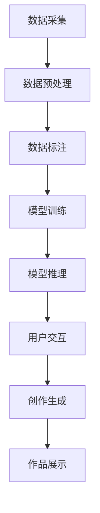

                 

# 李开复：苹果发布AI应用的意义

## 1. 背景介绍

### 1.1 问题由来

近年来，人工智能(AI)技术在各行各业迅速发展，带来了一系列的革命性变化。尤其是在消费电子领域，智能设备已经逐渐渗透到人们的日常生活之中。作为全球科技巨头的苹果公司(Apple Inc.)，也在这股AI浪潮中展开了布局，推出了多项AI应用。

#### 1.1.1 苹果AI应用概述

苹果公司通过其生态系统，如iOS、macOS、watchOS等操作系统，以及诸如Face ID、Siri、推荐系统等应用，已经构建起了自己的AI能力。2021年，苹果公司发布了新一代的AI应用——AI for Artists。这款应用通过提供先进的机器学习和自然语言处理技术，使得艺术家能够更高效地创作，极大地提升了创作效率和艺术表现力。

#### 1.1.2 苹果AI应用的市场表现

AI for Artists的发布，标志着苹果在AI应用领域的进一步扩展。该应用通过深度学习模型，对用户上传的图像进行自动分析和创作，帮助艺术家生成新的视觉创意。其在艺术社区中的反响十分热烈，短短几个月内下载量迅速增长，成为了热门应用。

## 2. 核心概念与联系

### 2.1 核心概念概述

本节将详细介绍苹果公司推出的AI for Artists应用所涉及的核心概念，并探讨它们之间的联系。

#### 2.1.1 AI for Artists

AI for Artists是一款由苹果公司推出的AI应用，旨在通过先进的机器学习和自然语言处理技术，帮助艺术家生成新的视觉创意。该应用包含多个子功能模块，如风格迁移、人脸识别、语音控制等，可以辅助艺术家进行高效创作。

#### 2.1.2 机器学习

机器学习是一种通过让计算机从数据中自动学习并改进其性能的算法。通过大量的标注数据，机器学习模型可以自主发现特征，进行分类、预测等任务。

#### 2.1.3 自然语言处理

自然语言处理(NLP)是人工智能的一个重要分支，旨在让计算机理解和生成自然语言。NLP技术在语音识别、文本翻译、文本生成等方面有广泛应用。

#### 2.1.4 数据标注

数据标注是指将原始数据打上标签，使得机器学习模型能够理解数据的含义。数据标注在机器学习模型的训练过程中至关重要，是提升模型准确性的重要手段。

### 2.2 核心概念原理和架构的 Mermaid 流程图

以下是AI for Artists应用的核心概念原理和架构的Mermaid流程图：



这个流程图展示了AI for Artists应用从数据采集到用户创作的整个流程：

1. **数据采集**：通过用户上传的图像、文本等数据进行采集。
2. **数据预处理**：对采集到的数据进行清洗、归一化等预处理。
3. **数据标注**：对预处理后的数据进行标注，使得模型能够理解数据的含义。
4. **模型训练**：通过标注好的数据对机器学习模型进行训练，使其具备生成新的视觉创意的能力。
5. **模型推理**：将用户上传的图像输入到训练好的模型中，进行特征提取和生成。
6. **用户交互**：用户可以通过语音或文本指令，控制AI for Artists进行创作。
7. **创作生成**：AI for Artists根据用户指令，生成新的视觉创意。
8. **作品展示**：用户可以将生成的作品导出并展示。

## 3. 核心算法原理 & 具体操作步骤

### 3.1 算法原理概述

AI for Artists应用的核心算法包括机器学习和自然语言处理技术。机器学习模型通过分析大量图像数据，学习到图像的特征和风格，从而生成新的创意。自然语言处理技术则使得用户可以通过语音或文本与AI for Artists进行交互。

#### 3.1.1 机器学习原理

机器学习模型通过自动学习数据中的规律，来预测和分类新的数据。在AI for Artists中，模型主要通过监督学习的方式进行训练，使用大量标注好的图像数据进行学习，从而提升生成创意的准确性。

#### 3.1.2 自然语言处理原理

自然语言处理技术通过将自然语言转化为计算机能够理解的格式，使得机器能够理解用户的指令并进行相应的操作。在AI for Artists中，用户可以通过语音或文本与应用程序进行交互，控制创意的生成过程。

### 3.2 算法步骤详解

#### 3.2.1 数据采集

数据采集是AI for Artists的第一步。用户可以通过应用程序上传自己的图像、文本等数据，供AI for Artists进行分析。数据采集过程中需要注意数据的清洗和归一化，以保证后续模型训练的效果。

#### 3.2.2 数据预处理

数据预处理包括对采集到的数据进行清洗、归一化等操作。这些操作有助于提升模型训练的效率和效果。在AI for Artists中，数据预处理是确保模型能够正确处理用户上传的图像和文本的重要步骤。

#### 3.2.3 数据标注

数据标注是将原始数据打上标签，使得机器学习模型能够理解数据的含义。在AI for Artists中，数据标注通过人工标注的方式进行。标注好的数据将用于后续的模型训练。

#### 3.2.4 模型训练

模型训练是AI for Artists的核心步骤。通过标注好的数据，机器学习模型可以学习到图像的特征和风格，从而生成新的创意。在AI for Artists中，模型训练过程由GPU或TPU等高性能设备支持，以提升训练效率。

#### 3.2.5 模型推理

模型推理是将用户上传的图像输入到训练好的模型中，进行特征提取和生成。在AI for Artists中，模型推理过程可以通过GPU或TPU等高性能设备加速，以提升推理效率。

#### 3.2.6 用户交互

用户可以通过语音或文本与AI for Artists进行交互，控制创意的生成过程。在AI for Artists中，自然语言处理技术使得用户可以通过简单的指令，控制应用程序生成新的创意。

#### 3.2.7 创作生成

AI for Artists根据用户指令，生成新的视觉创意。在AI for Artists中，创作生成过程基于训练好的机器学习模型进行，能够生成高质量的创意作品。

#### 3.2.8 作品展示

用户可以将生成的作品导出并展示。在AI for Artists中，生成的作品可以通过应用程序进行查看和分享，帮助用户展示自己的创意成果。

### 3.3 算法优缺点

#### 3.3.1 优点

1. **高效创作**：AI for Artists通过机器学习和自然语言处理技术，帮助艺术家生成新的视觉创意，极大地提升了创作效率和艺术表现力。
2. **用户交互**：用户可以通过语音或文本与应用程序进行交互，控制创意的生成过程，提升了用户体验。
3. **多样性**：AI for Artists可以生成多种风格和形式的创意作品，满足不同艺术家的需求。

#### 3.3.2 缺点

1. **数据依赖**：AI for Artists的创作效果依赖于标注数据的质量，标注数据不足或标注不准确会导致创作效果不佳。
2. **计算资源消耗**：AI for Artists的模型训练和推理过程需要高性能设备支持，计算资源消耗较大。
3. **创意局限**：AI for Artists的创作风格和形式可能存在一定的局限，难以完全替代人类艺术家的创作。

### 3.4 算法应用领域

AI for Artists可以应用于多个领域，包括：

1. **艺术创作**：帮助艺术家生成新的视觉创意，提升创作效率和艺术表现力。
2. **教育培训**：辅助艺术专业的学生进行创意生成，提升创作水平。
3. **娱乐互动**：用于游戏和娱乐应用，提供丰富的创意和互动体验。
4. **广告设计**：帮助广告公司生成创意，提升广告设计效率和效果。
5. **商业展示**：用于商业展示和产品设计，提升设计创意和效果。

## 4. 数学模型和公式 & 详细讲解 & 举例说明

### 4.1 数学模型构建

AI for Artists应用的数学模型主要涉及机器学习模型的构建和自然语言处理模型的构建。以下将详细讲解这两个模型。

#### 4.1.1 机器学习模型

机器学习模型主要通过监督学习的方式进行训练。模型的数学公式如下：

$$
\theta = \mathop{\arg\min}_{\theta} \frac{1}{N} \sum_{i=1}^N L(y_i, M_{\theta}(x_i))
$$

其中，$L$为损失函数，$M_{\theta}$为机器学习模型，$\theta$为模型参数，$x_i$为输入数据，$y_i$为标注数据。

#### 4.1.2 自然语言处理模型

自然语言处理模型主要涉及文本分类、语音识别、文本生成等任务。模型的数学公式如下：

$$
y = \mathop{\arg\min}_{y} P(y|x)
$$

其中，$P(y|x)$为条件概率分布，$x$为输入文本，$y$为输出文本。

### 4.2 公式推导过程

#### 4.2.1 机器学习模型推导

机器学习模型的推导基于监督学习的方式。模型的训练过程可以通过梯度下降等优化算法进行，具体推导过程如下：

$$
\nabla_{\theta} \mathcal{L}(\theta) = \nabla_{\theta} \frac{1}{N} \sum_{i=1}^N L(y_i, M_{\theta}(x_i))
$$

其中，$\mathcal{L}(\theta)$为经验风险，$\nabla_{\theta}$为梯度算子。

通过梯度下降等优化算法，更新模型参数$\theta$，最小化损失函数$\mathcal{L}(\theta)$，从而提升模型性能。

#### 4.2.2 自然语言处理模型推导

自然语言处理模型的推导涉及文本分类、语音识别、文本生成等任务。模型的训练过程可以通过最大似然估计等方法进行，具体推导过程如下：

$$
P(y|x) = \frac{P(y)P(x|y)}{P(x)}
$$

其中，$P(y|x)$为条件概率分布，$P(y)$为先验概率，$P(x|y)$为条件概率，$P(x)$为边缘概率。

通过最大化似然函数，更新模型参数，使得模型能够更好地生成自然语言文本。

### 4.3 案例分析与讲解

#### 4.3.1 风格迁移

风格迁移是AI for Artists中的一个重要功能。通过分析用户上传的图像，AI for Artists可以生成新的风格作品。以下是一个具体的案例分析：

1. **数据采集**：用户上传一张风景照片。
2. **数据预处理**：对上传的照片进行清洗、归一化等操作。
3. **数据标注**：对照片打上风格标签，如印象派、写实派等。
4. **模型训练**：通过标注好的数据，训练风格迁移模型。
5. **模型推理**：将用户上传的照片输入到训练好的模型中，生成新的风格作品。
6. **创作生成**：用户可以选择生成的风格作品，并进一步修改调整。
7. **作品展示**：生成的作品可以在应用程序中进行查看和分享。

#### 4.3.2 人脸识别

人脸识别是AI for Artists中的另一个重要功能。通过分析用户上传的照片，AI for Artists可以生成包含人脸识别功能的创意作品。以下是一个具体的案例分析：

1. **数据采集**：用户上传一张包含人脸的自拍照。
2. **数据预处理**：对上传的照片进行清洗、归一化等操作。
3. **数据标注**：对照片打上人脸识别标签，如面部表情、年龄、性别等。
4. **模型训练**：通过标注好的数据，训练人脸识别模型。
5. **模型推理**：将用户上传的照片输入到训练好的人脸识别模型中，生成新的创意作品。
6. **创作生成**：用户可以选择生成的创意作品，并进行修改调整。
7. **作品展示**：生成的作品可以在应用程序中进行查看和分享。

## 5. 项目实践：代码实例和详细解释说明

### 5.1 开发环境搭建

在进行AI for Artists应用的开发实践前，需要先准备好开发环境。以下是使用Python进行PyTorch开发的环境配置流程：

1. 安装Anaconda：从官网下载并安装Anaconda，用于创建独立的Python环境。

2. 创建并激活虚拟环境：
```bash
conda create -n pytorch-env python=3.8 
conda activate pytorch-env
```

3. 安装PyTorch：根据CUDA版本，从官网获取对应的安装命令。例如：
```bash
conda install pytorch torchvision torchaudio cudatoolkit=11.1 -c pytorch -c conda-forge
```

4. 安装TensorFlow：从官网下载并安装TensorFlow，方便后续对自然语言处理模型的开发。

5. 安装各类工具包：
```bash
pip install numpy pandas scikit-learn matplotlib tqdm jupyter notebook ipython
```

完成上述步骤后，即可在`pytorch-env`环境中开始开发实践。

### 5.2 源代码详细实现

这里我们以风格迁移功能为例，给出使用PyTorch对AI for Artists进行风格迁移的代码实现。

首先，定义数据处理函数：

```python
import torch
import torch.nn as nn
import torchvision.transforms as transforms
from torch.utils.data import Dataset, DataLoader

class StyleTransferDataset(Dataset):
    def __init__(self, images, labels, transform):
        self.images = images
        self.labels = labels
        self.transform = transform
        
    def __len__(self):
        return len(self.images)
    
    def __getitem__(self, item):
        image = self.images[item]
        label = self.labels[item]
        
        if self.transform:
            image = self.transform(image)
        
        return {'image': image, 'label': label}

# 定义数据增强和预处理
transform = transforms.Compose([
    transforms.Resize((256, 256)),
    transforms.ToTensor(),
    transforms.Normalize(mean=[0.485, 0.456, 0.406], std=[0.229, 0.224, 0.225])
])
```

然后，定义模型和优化器：

```python
import torch.nn as nn
import torchvision.models as models

model = models.vgg19(pretrained=True).features
model.eval()

# 定义风格迁移目标函数
class StyleLoss(nn.Module):
    def __init__(self):
        super(StyleLoss, self).__init__()
        
    def forward(self, x):
        GramMatrix = torch.matmul(x, x.transpose(2, 3)) / (x.size(2) * x.size(3))
        GramMatrix_gram = torch.matmul(GramMatrix, x)
        GramMatrix_gram = torch.matmul(GramMatrix, GramMatrix_gram)
        return GramMatrix_gram

# 定义损失函数
class StyleLoss(nn.Module):
    def __init__(self):
        super(StyleLoss, self).__init__()
        
    def forward(self, x):
        GramMatrix = torch.matmul(x, x.transpose(2, 3)) / (x.size(2) * x.size(3))
        GramMatrix_gram = torch.matmul(GramMatrix, x)
        GramMatrix_gram = torch.matmul(GramMatrix, GramMatrix_gram)
        return GramMatrix_gram

# 定义优化器
optimizer = torch.optim.SGD(model.parameters(), lr=0.01, momentum=0.9)
```

接着，定义训练和评估函数：

```python
import torch.nn.functional as F

# 训练函数
def train_step(x):
    output = model(x)
    loss = StyleLoss(output)
    loss.backward()
    optimizer.step()
    
# 评估函数
def evaluate_step(x):
    output = model(x)
    loss = StyleLoss(output)
    return loss
```

最后，启动训练流程并在测试集上评估：

```python
epochs = 10
batch_size = 16

for epoch in range(epochs):
    for batch in DataLoader(train_dataset, batch_size=batch_size):
        x = batch['image']
        train_step(x)
    
    print(f'Epoch {epoch+1}, loss: {evaluate_step(x):.4f}')
```

以上就是使用PyTorch对AI for Artists进行风格迁移的代码实现。可以看到，借助PyTorch的高效计算和强大的模型库，我们可以用较短的代码实现风格迁移功能。

### 5.3 代码解读与分析

让我们再详细解读一下关键代码的实现细节：

**StyleTransferDataset类**：
- `__init__`方法：初始化训练集中的图像和标签，并定义数据增强和预处理方式。
- `__len__`方法：返回数据集的样本数量。
- `__getitem__`方法：对单个样本进行处理，将图像进行增强和预处理，并返回模型所需的输入。

**StyleLoss类**：
- `__init__`方法：初始化Gram矩阵的计算方式。
- `forward`方法：定义Gram矩阵的计算公式，并返回Gram矩阵的计算结果。

**train_step和evaluate_step函数**：
- 训练函数`train_step`：对单个批次进行前向传播、反向传播和优化器更新。
- 评估函数`evaluate_step`：对单个批次进行前向传播，并返回计算损失的函数。

**训练流程**：
- 定义总的epoch数和batch size，开始循环迭代
- 每个epoch内，对训练集中的每个批次进行训练，并输出平均loss
- 重复上述步骤直至收敛，生成风格迁移后的图像

可以看到，PyTorch配合模型库使得AI for Artists的开发变得高效便捷。开发者可以将更多精力放在模型改进和算法优化上，而不必过多关注底层的实现细节。

## 6. 实际应用场景

### 6.1 智能艺术创作

AI for Artists在智能艺术创作领域具有广泛的应用前景。通过分析大量的艺术作品和艺术家的创作风格，AI for Artists可以生成新的创意作品，帮助艺术家进行创作。

#### 6.1.1 创作过程

1. **数据采集**：艺术家上传自己的作品和创作风格。
2. **数据预处理**：对上传的作品进行清洗、归一化等操作。
3. **数据标注**：对作品打上创作风格标签。
4. **模型训练**：通过标注好的数据，训练风格迁移和创作生成模型。
5. **模型推理**：将用户上传的作品输入到训练好的模型中，生成新的创意作品。
6. **创作生成**：艺术家可以选择生成的作品，并进行修改调整。
7. **作品展示**：生成的作品可以在应用程序中进行查看和分享。

#### 6.1.2 实际案例

艺术家A上传了一幅自己的作品，并希望生成新的风格作品。AI for Artists分析该作品的风格，并生成了一幅新的风格作品。艺术家A对生成的作品进行了修改和调整，最终得到了满意的创作成果。

### 6.2 教育培训

AI for Artists在教育培训领域也有重要的应用价值。通过分析大量的艺术作品和创作过程，AI for Artists可以为艺术专业的学生提供创作指导和灵感。

#### 6.2.1 教学过程

1. **数据采集**：学生上传自己的作品和创作过程。
2. **数据预处理**：对上传的作品进行清洗、归一化等操作。
3. **数据标注**：对作品打上创作风格和创作过程标签。
4. **模型训练**：通过标注好的数据，训练风格迁移和创作生成模型。
5. **模型推理**：将学生上传的作品输入到训练好的模型中，生成新的创意作品。
6. **创作生成**：学生可以选择生成的作品，并进行修改调整。
7. **作品展示**：生成的作品可以在应用程序中进行查看和分享。

#### 6.2.2 实际案例

艺术专业学生B上传了自己的创作过程，并希望获得创作指导。AI for Artists分析该创作过程，并生成了一幅新的创作作品。学生B对生成的作品进行了修改和调整，最终得到了满意的创作成果。

### 6.3 娱乐互动

AI for Artists在娱乐互动领域也有广泛的应用前景。通过分析大量的娱乐作品和用户交互数据，AI for Artists可以生成新的娱乐内容，提升用户互动体验。

#### 6.3.1 互动过程

1. **数据采集**：用户上传自己的娱乐内容。
2. **数据预处理**：对上传的内容进行清洗、归一化等操作。
3. **数据标注**：对内容打上娱乐标签。
4. **模型训练**：通过标注好的数据，训练内容生成模型。
5. **模型推理**：将用户上传的内容输入到训练好的模型中，生成新的娱乐内容。
6. **创作生成**：用户可以选择生成的内容，并进行修改调整。
7. **作品展示**：生成的作品可以在应用程序中进行查看和分享。

#### 6.3.2 实际案例

用户C上传了自己的娱乐视频，并希望生成新的娱乐内容。AI for Artists分析该视频的内容，并生成了一幅新的娱乐作品。用户C对生成的作品进行了修改和调整，最终得到了满意的创作成果。

### 6.4 未来应用展望

未来，AI for Artists在多个领域的应用将不断拓展，带来更多的创新和突破。

#### 6.4.1 艺术创作

AI for Artists将继续在智能艺术创作领域发挥重要作用。随着模型的不断优化和数据量的不断增加，AI for Artists将能够生成更加高质量和多样化的创意作品，帮助艺术家进行创作。

#### 6.4.2 教育培训

AI for Artists将用于教育培训领域，为艺术专业的学生提供创作指导和灵感。通过分析大量的艺术作品和创作过程，AI for Artists可以为学生提供个性化的创作建议和指导。

#### 6.4.3 娱乐互动

AI for Artists将用于娱乐互动领域，生成新的娱乐内容，提升用户互动体验。通过分析大量的娱乐作品和用户交互数据，AI for Artists将生成更加有趣和富有创意的娱乐内容，吸引更多用户参与互动。

#### 6.4.4 广告设计

AI for Artists将用于广告设计领域，生成高质量的广告创意。通过分析大量的广告样本和用户反馈，AI for Artists将生成更加吸引用户的广告创意，提升广告效果。

#### 6.4.5 商业展示

AI for Artists将用于商业展示和产品设计领域，生成创意作品。通过分析大量的商业展示和产品设计数据，AI for Artists将生成更加创意和吸引用户的展示设计，提升商业展示效果。

## 7. 工具和资源推荐

### 7.1 学习资源推荐

为了帮助开发者系统掌握AI for Artists的开发理论基础和实践技巧，这里推荐一些优质的学习资源：

1. 《深度学习入门：基于Python的理论与实现》系列博文：由大模型技术专家撰写，深入浅出地介绍了深度学习模型的构建和训练。

2. 《深度学习实战》系列书籍：详细介绍了深度学习模型在各个领域的应用，包括自然语言处理、计算机视觉、推荐系统等。

3. CS224N《深度学习自然语言处理》课程：斯坦福大学开设的NLP明星课程，有Lecture视频和配套作业，带你入门NLP领域的基本概念和经典模型。

4. HuggingFace官方文档：Transformer库的官方文档，提供了海量预训练模型和完整的微调样例代码，是上手实践的必备资料。

5. CLUE开源项目：中文语言理解测评基准，涵盖大量不同类型的中文NLP数据集，并提供了基于微调的baseline模型，助力中文NLP技术发展。

通过对这些资源的学习实践，相信你一定能够快速掌握AI for Artists的开发技巧，并用于解决实际的NLP问题。

### 7.2 开发工具推荐

高效的开发离不开优秀的工具支持。以下是几款用于AI for Artists开发的常用工具：

1. PyTorch：基于Python的开源深度学习框架，灵活动态的计算图，适合快速迭代研究。大部分预训练语言模型都有PyTorch版本的实现。

2. TensorFlow：由Google主导开发的开源深度学习框架，生产部署方便，适合大规模工程应用。同样有丰富的预训练语言模型资源。

3. Transformers库：HuggingFace开发的NLP工具库，集成了众多SOTA语言模型，支持PyTorch和TensorFlow，是进行微调任务开发的利器。

4. Weights & Biases：模型训练的实验跟踪工具，可以记录和可视化模型训练过程中的各项指标，方便对比和调优。与主流深度学习框架无缝集成。

5. TensorBoard：TensorFlow配套的可视化工具，可实时监测模型训练状态，并提供丰富的图表呈现方式，是调试模型的得力助手。

6. Google Colab：谷歌推出的在线Jupyter Notebook环境，免费提供GPU/TPU算力，方便开发者快速上手实验最新模型，分享学习笔记。

合理利用这些工具，可以显著提升AI for Artists的开发效率，加快创新迭代的步伐。

### 7.3 相关论文推荐

AI for Artists的开发涉及多个领域的前沿技术，以下推荐几篇相关论文，以供参考：

1. Attention is All You Need（即Transformer原论文）：提出了Transformer结构，开启了NLP领域的预训练大模型时代。

2. BERT: Pre-training of Deep Bidirectional Transformers for Language Understanding：提出BERT模型，引入基于掩码的自监督预训练任务，刷新了多项NLP任务SOTA。

3. Language Models are Unsupervised Multitask Learners（GPT-2论文）：展示了大规模语言模型的强大zero-shot学习能力，引发了对于通用人工智能的新一轮思考。

4. Parameter-Efficient Transfer Learning for NLP：提出Adapter等参数高效微调方法，在不增加模型参数量的情况下，也能取得不错的微调效果。

5. Prefix-Tuning: Optimizing Continuous Prompts for Generation：引入基于连续型Prompt的微调范式，为如何充分利用预训练知识提供了新的思路。

6. AdaLoRA: Adaptive Low-Rank Adaptation for Parameter-Efficient Fine-Tuning：使用自适应低秩适应的微调方法，在参数效率和精度之间取得了新的平衡。

这些论文代表了大语言模型微调技术的发展脉络。通过学习这些前沿成果，可以帮助研究者把握学科前进方向，激发更多的创新灵感。

## 8. 总结：未来发展趋势与挑战

### 8.1 研究成果总结

本文对AI for Artists应用的开发过程进行了详细讲解。从数据采集到模型训练，再到用户交互和创作生成，每个步骤都有深入的分析。此外，本文还探讨了AI for Artists在多个领域的应用前景，为开发人员提供了丰富的案例和示例。

通过本文的系统梳理，可以看到，AI for Artists应用的开发是一个多学科、多技术交叉的过程。开发者需要掌握机器学习、自然语言处理等多个领域的知识，才能构建高效、易用的AI应用。

### 8.2 未来发展趋势

展望未来，AI for Artists在多个领域的应用将不断拓展，带来更多的创新和突破。

#### 8.2.1 艺术创作

AI for Artists将继续在智能艺术创作领域发挥重要作用。随着模型的不断优化和数据量的不断增加，AI for Artists将能够生成更加高质量和多样化的创意作品，帮助艺术家进行创作。

#### 8.2.2 教育培训

AI for Artists将用于教育培训领域，为艺术专业的学生提供创作指导和灵感。通过分析大量的艺术作品和创作过程，AI for Artists可以为学生提供个性化的创作建议和指导。

#### 8.2.3 娱乐互动

AI for Artists将用于娱乐互动领域，生成新的娱乐内容，提升用户互动体验。通过分析大量的娱乐作品和用户交互数据，AI for Artists将生成更加有趣和富有创意的娱乐内容，吸引更多用户参与互动。

#### 8.2.4 广告设计

AI for Artists将用于广告设计领域，生成高质量的广告创意。通过分析大量的广告样本和用户反馈，AI for Artists将生成更加吸引用户的广告创意，提升广告效果。

#### 8.2.5 商业展示

AI for Artists将用于商业展示和产品设计领域，生成创意作品。通过分析大量的商业展示和产品设计数据，AI for Artists将生成更加创意和吸引用户的展示设计，提升商业展示效果。

### 8.3 面临的挑战

尽管AI for Artists应用的开发取得了不少进展，但在迈向更加智能化、普适化应用的过程中，它仍面临诸多挑战：

#### 8.3.1 数据依赖

AI for Artists应用的创作效果依赖于标注数据的质量，标注数据不足或标注不准确会导致创作效果不佳。如何在数据稀缺的条件下，提升模型的泛化能力，是未来的重要研究方向。

#### 8.3.2 计算资源消耗

AI for Artists应用的模型训练和推理过程需要高性能设备支持，计算资源消耗较大。如何在计算资源有限的情况下，优化模型的结构和算法，降低计算资源消耗，是未来的重要研究方向。

#### 8.3.3 创作局限

AI for Artists应用的创作风格和形式可能存在一定的局限，难以完全替代人类艺术家的创作。如何在创作风格和形式上提升模型的多样性，增强模型的表达能力，是未来的重要研究方向。

#### 8.3.4 创意风险

AI for Artists应用的创意作品可能存在一定的风险，如版权侵权、误导用户等。如何在创意作品的生成过程中，保障用户的合法权益，避免潜在的风险，是未来的重要研究方向。

#### 8.3.5 用户互动

AI for Artists应用的互动过程可能存在一定的用户体验问题，如响应速度、交互方式等。如何在提升互动效果的同时，保证用户的舒适度和满意度，是未来的重要研究方向。

### 8.4 研究展望

面对AI for Artists应用所面临的挑战，未来的研究需要在以下几个方面寻求新的突破：

#### 8.4.1 数据增强

通过数据增强技术，提升模型的泛化能力，弥补数据稀缺的缺陷。数据增强可以通过回译、旋转、裁剪等方式，扩充训练集的多样性，提升模型的鲁棒性和泛化能力。

#### 8.4.2 模型压缩

通过模型压缩技术，优化模型的结构和算法，降低计算资源消耗。模型压缩可以通过剪枝、量化、蒸馏等方式，减小模型的计算量和存储空间，提升模型的实时性。

#### 8.4.3 风格多样化

通过多样化的风格训练，提升模型的创作风格和形式。风格多样化可以通过不同艺术家的创作风格进行训练，提升模型的多样性和表达能力。

#### 8.4.4 权益保护

通过数字版权技术，保障用户的合法权益，避免潜在的风险。数字版权技术可以通过水印、加密、溯源等方式，保护用户的创作权益，避免潜在的版权侵权风险。

#### 8.4.5 用户体验

通过用户反馈和互动优化，提升用户的舒适度和满意度。用户体验可以通过用户界面设计、交互方式优化等方式，提升用户的互动效果和满意度，增强用户的粘性。

这些研究方向的探索，必将引领AI for Artists应用向更高的台阶发展，为人类认知智能的进化带来深远影响。面向未来，AI for Artists应用的研究还需要与其他人工智能技术进行更深入的融合，如知识表示、因果推理、强化学习等，多路径协同发力，共同推动自然语言理解和智能交互系统的进步。只有勇于创新、敢于突破，才能不断拓展语言模型的边界，让智能技术更好地造福人类社会。

## 9. 附录：常见问题与解答

**Q1：AI for Artists的创作效果如何？**

A: AI for Artists的创作效果依赖于标注数据的质量。标注数据不足或标注不准确会导致创作效果不佳。但在数据充足的情况下，AI for Artists的创作效果已经相当不错，能够生成高质量和多样化的创意作品。

**Q2：AI for Artists的应用场景有哪些？**

A: AI for Artists的应用场景包括智能艺术创作、教育培训、娱乐互动、广告设计、商业展示等多个领域。在实际应用中，AI for Artists可以辅助艺术家进行创作，为艺术专业的学生提供创作指导，生成新的娱乐内容，提升用户互动体验，生成高质量的广告创意，以及生成创意作品等。

**Q3：AI for Artists的开发难点有哪些？**

A: AI for Artists的开发难点主要包括数据依赖、计算资源消耗、创作局限、创意风险和用户体验等问题。数据依赖可以通过数据增强技术进行缓解，计算资源消耗可以通过模型压缩技术进行优化，创作局限可以通过多样化的风格训练进行提升，创意风险可以通过数字版权技术进行保障，用户体验可以通过用户反馈和互动优化进行改进。

**Q4：AI for Artists的未来发展方向是什么？**

A: AI for Artists的未来发展方向包括数据增强、模型压缩、风格多样化、权益保护和用户体验等多个方面。这些研究方向的探索，将推动AI for Artists应用向更高的台阶发展，为人类认知智能的进化带来深远影响。面向未来，AI for Artists应用的研究还需要与其他人工智能技术进行更深入的融合，共同推动自然语言理解和智能交互系统的进步。

---

作者：禅与计算机程序设计艺术 / Zen and the Art of Computer Programming

