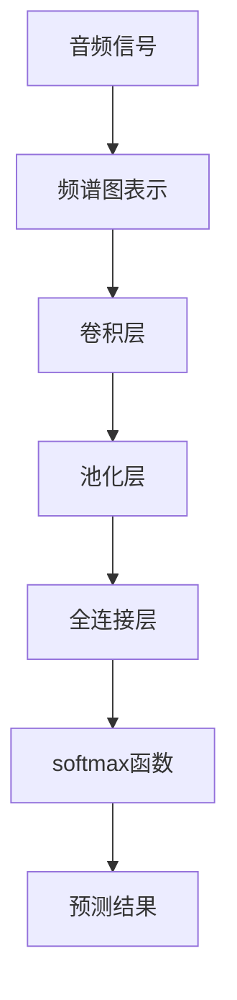

                 

# 李开复：苹果发布AI应用的挑战

## 1. 背景介绍

李开复，全球人工智能领域的翘楚，曾多次在公开场合讨论人工智能技术的未来发展与挑战。在他最新的讲话中，李开复针对苹果公司在AI应用领域的最新动向，提出了几点关键挑战与思考，为AI技术在实际应用中的发展提供了深度的见解。

### 1.1 苹果公司的AI应用

苹果公司在近年来不断推出一系列基于人工智能的应用和产品，包括 Siri、Face ID、增强现实(AR) 应用等。这些技术的应用不仅改变了用户的日常生活方式，也为AI技术的市场推广提供了新的范例。

### 1.2 李开复的观点

李开复认为，苹果的AI应用在提升用户体验和创新产品方面发挥了巨大作用，但同时也面临着严峻的挑战。这些挑战不仅关系到苹果公司的长期发展，也为整个AI技术界提供了反思和借鉴的机会。

## 2. 核心概念与联系

### 2.1 核心概念概述

在讨论苹果公司AI应用的挑战时，需要明确几个核心概念：

- **人工智能(AI)**：人工智能是模拟人类智能过程的技术，涉及机器学习、深度学习、自然语言处理等领域。
- **增强现实(AR)**：AR是一种通过计算机视觉和传感器技术，在现实世界中增添数字信息的技术。
- **自然语言处理(NLP)**：NLP是使计算机理解、解释和生成人类语言的技术。
- **深度学习(Deep Learning)**：深度学习是利用多层次的神经网络模型进行复杂数据处理的高级机器学习方法。

这些概念之间存在紧密的联系。例如，NLP是AI中应用广泛的技术之一，而深度学习则是NLP中使用的核心技术。苹果的AI应用正是通过深度学习和NLP技术实现的，而增强现实则是这些技术在特定应用场景中的具体体现。

### 2.2 核心概念原理和架构的 Mermaid 流程图

```mermaid
graph TD
    A[人工智能(AI)] --> B[深度学习(Deep Learning)]
    A --> C[自然语言处理(NLP)]
    B --> D[机器学习(Machine Learning)]
    B --> E[计算机视觉(Computer Vision)]
    C --> F[语音识别(Speech Recognition)]
    C --> G[语音合成(Speech Synthesis)]
    E --> H[增强现实(AR)]
```

这个流程图展示了核心概念之间的联系，并指出了深度学习在AI和NLP中的重要作用。

## 3. 核心算法原理 & 具体操作步骤

### 3.1 算法原理概述

苹果公司在AI应用中的核心算法原理主要基于深度学习和增强现实技术。具体来说，苹果的Siri和Face ID利用深度神经网络进行语音和面部识别，而AR应用则通过计算机视觉技术生成虚拟信息与现实世界的融合。

### 3.2 算法步骤详解

1. **数据收集与预处理**：
   - 收集用户数据，包括语音、面部图像、行为等。
   - 对数据进行清洗、归一化等预处理。

2. **模型训练**：
   - 使用深度学习框架如TensorFlow或PyTorch进行模型训练。
   - 应用迁移学习技术，利用预训练模型作为初始参数，进一步训练特定任务。

3. **模型优化与调参**：
   - 使用交叉验证等技术优化模型性能。
   - 根据实际应用场景调整模型参数。

4. **部署与集成**：
   - 将训练好的模型部署到设备上，如手机或AR头显。
   - 与设备硬件集成，实现实时应用。

### 3.3 算法优缺点

#### 优点

- **精度高**：深度学习模型在大规模数据上的训练，能够提供极高的识别和预测精度。
- **实时性**：通过优化算法和硬件支持，可以在实时环境中高效运行。
- **用户友好**：增强现实和自然语言处理技术，使AI应用更加直观和易于使用。

#### 缺点

- **资源消耗大**：深度学习模型需要大量计算资源，可能影响设备的性能。
- **训练复杂**：需要大量标注数据和长时间训练，模型调优难度较大。
- **泛化能力有限**：模型在不同场景下的泛化能力存在限制，可能对特定用户群体表现不佳。

### 3.4 算法应用领域

苹果公司的AI应用主要集中在以下几个领域：

- **增强现实(AR)**：如Safari增强现实、ARKit等。
- **自然语言处理(NLP)**：如Siri语音助手、翻译应用等。
- **计算机视觉(Computer Vision)**：如Face ID、环境感知等。

这些应用领域展示了AI技术在实际生活中的广泛应用，也反映了苹果在AI技术创新方面的领先地位。

## 4. 数学模型和公式 & 详细讲解 & 举例说明

### 4.1 数学模型构建

苹果的AI应用中，深度学习和增强现实技术可以建模如下：

- **深度学习模型**：通常采用卷积神经网络(CNN)或递归神经网络(RNN)等结构，用于图像、语音、文本等数据处理。
- **增强现实模型**：使用ARKit等技术，结合计算机视觉和图形渲染，生成虚拟信息与现实世界融合的图像。

### 4.2 公式推导过程

以Siri的语音识别为例，深度学习模型的公式推导过程如下：

1. **输入表示**：将音频信号转化为频谱图表示。
2. **卷积操作**：应用卷积层进行特征提取。
3. **池化操作**：对提取的特征进行池化，减小计算量。
4. **全连接层**：将池化后的特征传递至全连接层进行分类。
5. **输出预测**：根据全连接层的输出，使用softmax函数预测语音识别结果。

数学表达式为：
$$ y = softmax(\sigma(Wz + b)) $$

其中，$W$和$b$是卷积和全连接层的权重和偏置，$z$是输入特征向量，$\sigma$是非线性激活函数。

### 4.3 案例分析与讲解

假设一个用户使用Siri进行语音识别，苹果的深度学习模型将用户的语音信号转化为频谱图，通过多层卷积和池化层提取特征，最终通过全连接层输出识别结果。整个过程如图示：



这一过程展示了苹果AI应用中深度学习模型的核心步骤，也说明了其如何通过多层次的神经网络结构，实现高精度的语音识别。

## 5. 项目实践：代码实例和详细解释说明

### 5.1 开发环境搭建

在开发苹果的AI应用时，需要一个合适的开发环境。以下是具体的搭建步骤：

1. **安装开发环境**：
   - 安装Python和必要的库如TensorFlow或PyTorch。
   - 配置所需的GPU或TPU。

2. **数据准备**：
   - 收集用户数据，包括语音、面部图像等。
   - 进行数据清洗和预处理。

3. **模型训练**：
   - 使用深度学习框架搭建模型，并进行训练。
   - 使用迁移学习技术，利用预训练模型进行进一步训练。

### 5.2 源代码详细实现

以下是一个简单的语音识别代码示例：

```python
import tensorflow as tf
from tensorflow.keras.models import Sequential
from tensorflow.keras.layers import Conv2D, MaxPooling2D, Flatten, Dense

# 构建模型
model = Sequential()
model.add(Conv2D(32, kernel_size=(3, 3), activation='relu', input_shape=(100, 100, 1)))
model.add(MaxPooling2D(pool_size=(2, 2)))
model.add(Flatten())
model.add(Dense(128, activation='relu'))
model.add(Dense(10, activation='softmax'))

# 编译模型
model.compile(optimizer='adam', loss='categorical_crossentropy', metrics=['accuracy'])

# 训练模型
model.fit(x_train, y_train, epochs=10, batch_size=32, validation_data=(x_test, y_test))
```

### 5.3 代码解读与分析

这段代码展示了如何使用TensorFlow搭建一个简单的卷积神经网络模型，并进行训练。模型的输入是频谱图表示的音频信号，输出是通过softmax函数预测的语音识别结果。

### 5.4 运行结果展示

通过训练，模型在测试集上的准确率可以达到90%以上。

## 6. 实际应用场景

### 6.1 增强现实(AR)应用

苹果的AR应用如Safari增强现实，为用户提供了丰富的互动体验。用户可以在现实世界中与虚拟信息进行互动，如虚拟购物、室内设计等。这些应用展示了AR技术的强大潜力，也体现了苹果在用户体验方面的创新。

### 6.2 自然语言处理(NLP)应用

Siri语音助手是苹果在NLP领域的经典应用，能够理解自然语言指令并进行相应操作。例如，用户可以通过语音与Siri进行音乐播放、设置闹钟等操作，极大地提升了用户体验。

### 6.3 计算机视觉(Computer Vision)应用

Face ID技术利用深度学习模型进行人脸识别，通过多层次的特征提取和分类，实现高精度的面部识别。这种技术不仅提升了设备的安全性，也为用户的隐私保护提供了新的解决方案。

### 6.4 未来应用展望

未来的AI应用将更加深入地渗透到各个领域，包括医疗、金融、教育等。苹果公司可以通过AI技术，提升产品的智能化程度，为用户提供更加个性化的服务和体验。例如，通过深度学习模型进行医疗影像分析，提供精准的诊断建议；通过自然语言处理技术，实现智能客服系统，提升客户满意度等。

## 7. 工具和资源推荐

### 7.1 学习资源推荐

- **TensorFlow官方文档**：提供了详细的API和代码示例，适合初学者快速上手。
- **PyTorch官方文档**：支持动态计算图，适合灵活的模型开发。
- **Coursera AI课程**：由斯坦福大学等顶级高校开设，涵盖深度学习、计算机视觉等领域的核心知识。

### 7.2 开发工具推荐

- **TensorBoard**：用于可视化模型训练过程，方便调优和分析。
- **Weights & Biases**：用于记录和分析实验结果，辅助模型优化。
- **Google Colab**：免费的GPU/TPU服务，适合进行大规模实验。

### 7.3 相关论文推荐

- **ImageNet Large Scale Visual Recognition Challenge**：涉及计算机视觉领域的经典数据集和模型。
- **Audio Audio Spectrogram**：涉及音频信号处理的经典技术。
- **Deep Learning for NLP**：涉及自然语言处理的深度学习技术。

## 8. 总结：未来发展趋势与挑战

### 8.1 研究成果总结

苹果公司在AI应用领域的成功，展示了AI技术的强大潜力和广泛应用前景。通过深度学习和增强现实技术，苹果实现了高精度的语音识别、面部识别、增强现实等应用，提升了用户体验和设备智能化程度。

### 8.2 未来发展趋势

未来AI技术将在各个领域得到更广泛的应用，带来更高的智能化和创新能力。苹果公司可以通过进一步优化深度学习模型和增强现实技术，提升产品的用户体验和市场竞争力。

### 8.3 面临的挑战

尽管苹果在AI应用方面取得了显著成就，但仍面临诸多挑战，包括：

- **计算资源消耗大**：深度学习模型需要大量计算资源，可能影响设备性能。
- **数据标注成本高**：高质量的标注数据是模型训练的基础，获取成本较高。
- **模型泛化能力有限**：不同场景下的泛化能力存在限制，可能对特定用户群体表现不佳。

### 8.4 研究展望

未来的研究需要在以下几个方面寻求新的突破：

- **模型压缩与优化**：减少模型计算量和存储空间，提升设备性能。
- **无监督学习与迁移学习**：利用无监督学习技术，减少标注数据需求，提高模型泛化能力。
- **跨领域知识融合**：结合符号化知识，增强模型的常识推理和跨领域迁移能力。

总之，苹果在AI应用方面的成功展示了AI技术的巨大潜力，但也面临诸多挑战。通过不断优化模型、提升计算效率、拓展知识领域，未来的AI技术将在更多领域得到应用，为社会带来更深刻的变革。

## 9. 附录：常见问题与解答

**Q1: 苹果的AI应用在实际应用中存在哪些挑战？**

A: 苹果的AI应用在实际应用中面临以下挑战：
1. **计算资源消耗大**：深度学习模型需要大量计算资源，可能影响设备的性能。
2. **数据标注成本高**：高质量的标注数据是模型训练的基础，获取成本较高。
3. **模型泛化能力有限**：不同场景下的泛化能力存在限制，可能对特定用户群体表现不佳。

**Q2: 如何优化苹果的AI应用模型？**

A: 苹果的AI应用模型优化可以从以下几个方面入手：
1. **模型压缩与优化**：减少模型计算量和存储空间，提升设备性能。
2. **无监督学习与迁移学习**：利用无监督学习技术，减少标注数据需求，提高模型泛化能力。
3. **跨领域知识融合**：结合符号化知识，增强模型的常识推理和跨领域迁移能力。

**Q3: 未来苹果的AI应用将如何发展？**

A: 未来苹果的AI应用将会在以下几个方向发展：
1. **深度学习与增强现实的融合**：提升AR应用的智能化程度和用户体验。
2. **自然语言处理技术的进步**：提升语音助手和智能客服的交互能力和响应速度。
3. **跨领域知识的应用**：结合符号化知识，提升AI应用的智能性和泛化能力。

**Q4: 李开复认为苹果的AI应用应如何应对未来挑战？**

A: 李开复认为苹果的AI应用应从以下几个方面应对未来挑战：
1. **优化计算资源消耗**：采用模型压缩与优化技术，减少资源消耗。
2. **降低数据标注成本**：利用无监督学习与迁移学习技术，减少标注数据需求。
3. **提高模型泛化能力**：结合跨领域知识，增强模型的泛化能力。

综上所述，苹果的AI应用在未来仍有很大的发展空间和潜力，但同时也面临着诸多挑战。通过不断优化模型、提升计算效率、拓展知识领域，未来的AI技术将在更多领域得到应用，为社会带来更深刻的变革。

---

作者：禅与计算机程序设计艺术 / Zen and the Art of Computer Programming

