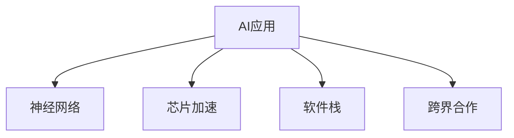

                 

# 李开复：苹果发布AI应用的机会

## 1. 背景介绍

### 1.1 问题由来
近年来，人工智能(AI)技术在各行业的应用取得了显著进展。苹果公司（Apple Inc.）作为全球领先的科技公司，在AI技术上也表现出了极大的兴趣和热情。然而，苹果在AI领域的发力点主要集中在硬件上，如集成在芯片中的神经网络加速器，而不是直接发布AI应用。在笔者看来，苹果应该重新考虑AI应用的战略，并抓住当前AI技术快速发展的机遇。

### 1.2 问题核心关键点
苹果公司为何在AI应用上进展缓慢？苹果的AI应用策略有哪些不足之处？未来苹果发布AI应用的机会何在？

## 2. 核心概念与联系

### 2.1 核心概念概述

为更好地理解苹果发布AI应用的机会，本节将介绍几个密切相关的核心概念：

- AI应用（AI Applications）：指利用人工智能技术实现的具体应用，如自动驾驶、智能推荐、语音助手等。AI应用能够提高生产效率，改善用户体验，创造新价值。

- 神经网络（Neural Networks）：人工智能的核心技术之一，通过大量数据进行训练，模仿人脑的神经网络结构，完成复杂模式识别和决策。

- 芯片加速（Chip Acceleration）：指在硬件芯片中集成神经网络加速器，通过优化计算架构，实现AI模型的快速推理。

- 软件栈（Software Stack）：指在AI应用中使用的各种软件工具和技术，如深度学习框架、数据处理库等。

- 跨界合作（Cross-Domain Collaboration）：指企业与其他领域（如医疗、教育、制造业等）合作，共同开发AI应用，扩大AI技术的应用边界。

这些核心概念之间的逻辑关系可以通过以下Mermaid流程图来展示：



这个流程图展示了大语言模型的核心概念及其之间的关系：

1. AI应用是大语言模型的主要产出。
2. 神经网络是大语言模型实现的核心技术。
3. 芯片加速可以提升大语言模型的推理效率。
4. 软件栈为大语言模型提供开发工具和平台支持。
5. 跨界合作为大语言模型的应用拓展提供了新的场景。

这些核心概念共同构成了大语言模型的应用框架，使得AI技术能够在各行各业中发挥其巨大的潜力。

## 3. 核心算法原理 & 具体操作步骤
### 3.1 算法原理概述

苹果公司发布的AI应用，必须基于某种机器学习算法。常见的AI应用算法包括：

- 监督学习：通过标注数据训练模型，使模型能够预测新数据的标签。如分类、回归、命名实体识别等。
- 无监督学习：不依赖标注数据，通过数据本身的结构特征进行模型训练。如聚类、降维等。
- 强化学习：通过试错的方式，优化决策策略。如游戏AI、机器人控制等。
- 生成对抗网络（GAN）：通过生成器和判别器的对抗训练，生成逼真的数据。如图像生成、文本生成等。

不同的算法适用于不同的应用场景。苹果应根据具体需求，选择合适的算法，并在应用中不断优化。

### 3.2 算法步骤详解

苹果发布AI应用的步骤主要包括以下几个关键环节：

**Step 1: 需求分析和应用场景定位**

- 确定应用目标，如提升用户体验、增加生产效率、创造新价值等。
- 分析潜在用户群体的需求和使用场景，如消费者、企业客户等。
- 定义应用的功能和性能指标，如准确率、响应时间等。

**Step 2: 数据收集和处理**

- 收集与目标应用相关的数据，如用户行为数据、产品使用数据等。
- 清洗和预处理数据，去除噪声和无关信息，提高数据质量。
- 进行数据划分，分为训练集、验证集和测试集。

**Step 3: 模型选择和训练**

- 根据应用需求和数据特性，选择合适的机器学习算法。
- 搭建模型架构，选择合适的超参数，如学习率、批大小、迭代轮数等。
- 使用训练集数据训练模型，调整超参数以优化性能。

**Step 4: 模型评估和优化**

- 在验证集上评估模型性能，使用评价指标如准确率、召回率、F1分数等。
- 根据评估结果调整模型架构和超参数，继续优化模型性能。
- 在测试集上再次评估模型，确保模型在实际应用中的表现。

**Step 5: 部署和维护**

- 将优化后的模型部署到生产环境，集成到应用系统中。
- 持续收集用户反馈和实时数据，监控模型性能，进行定期维护和优化。
- 定期更新模型，确保模型始终处于最优状态。

### 3.3 算法优缺点

苹果发布AI应用的优势：

- 苹果在芯片加速技术上的领先地位，能够提供高效、低能耗的AI推理能力。
- 苹果的强大软件开发能力，可以提供稳定、易用的AI应用界面。
- 苹果的市场影响力，能够吸引大量用户试用和推广AI应用。

然而，苹果发布AI应用的劣势：

- 缺乏大规模数据集，无法训练复杂的深度学习模型。
- 苹果的AI应用开发成本较高，需要投入大量资源。
- 苹果在AI算法和应用场景的深度理解上，不如谷歌、亚马逊等专业AI公司。

苹果需要充分发挥自身优势，克服劣势，才能在AI应用领域取得成功。

### 3.4 算法应用领域

苹果发布的AI应用主要可以应用于以下领域：

- **健康管理**：利用AI技术，通过分析用户健康数据，提供个性化的健康建议和干预措施。如苹果的Apple Watch 就具备心率监测和运动跟踪功能。
- **智能推荐**：基于用户行为数据，推荐个性化商品和服务。如苹果的App Store Just For You功能，为用户推荐个性化应用。
- **安全防护**：利用AI技术，提升设备的安全性和隐私保护能力。如人脸识别解锁、智能防诈骗等。
- **金融服务**：通过AI技术，提供智能理财、风险评估等服务。如Apple Pay 的安全支付功能。
- **自动驾驶**：利用AI技术，提升自动驾驶汽车的安全性和智能性。尽管苹果在自动驾驶领域相对低调，但其技术积累值得关注。
- **客户服务**：利用AI技术，提升客服系统的响应速度和准确性。如苹果的Siri 语音助手。

以上应用领域只是冰山一角，未来随着AI技术的不断进步，苹果在AI应用领域有望取得更多突破。

## 4. 数学模型和公式 & 详细讲解  
### 4.1 数学模型构建

假设苹果公司推出一个基于监督学习的AI应用，用于推荐用户感兴趣的商品。使用朴素贝叶斯分类器作为模型，模型的输入为特征向量 $x$，输出为商品类别 $y$。

定义模型的损失函数为交叉熵损失：

$$
L(y,\hat{y}) = -\sum_{i=1}^n y_i \log \hat{y}_i
$$

其中 $n$ 为样本数，$y$ 为真实标签，$\hat{y}$ 为模型预测概率。

使用梯度下降算法，更新模型参数 $\theta$ 以最小化损失函数：

$$
\theta \leftarrow \theta - \eta \nabla_{\theta} L(y,\hat{y})
$$

其中 $\eta$ 为学习率，$\nabla_{\theta} L(y,\hat{y})$ 为损失函数对模型参数的梯度。

### 4.2 公式推导过程

朴素贝叶斯分类器的决策边界可以表示为：

$$
\hat{y} = \arg\max_y P(y|x; \theta)
$$

其中 $P(y|x; \theta)$ 为条件概率分布，可以表示为：

$$
P(y|x; \theta) = \frac{P(x|y; \theta)P(y; \theta)}{P(x; \theta)}
$$

其中 $P(x; \theta)$ 为边缘概率分布，$P(x|y; \theta)$ 为条件概率分布，$P(y; \theta)$ 为先验概率分布。

将朴素贝叶斯分类器应用到多分类问题，可以得到模型预测结果：

$$
\hat{y} = \arg\max_y \log P(y|x; \theta)
$$

其中 $y$ 为真实类别，$x$ 为输入特征向量，$\theta$ 为模型参数。

### 4.3 案例分析与讲解

以Apple Watch 的心率监测功能为例，简要分析其背后的AI算法。

Apple Watch 使用心率传感器采集用户心率数据，利用机器学习算法，分析心率变化趋势，判断用户的心率异常情况。

首先，Apple Watch 收集用户的心率数据，并将其预处理为适合模型训练的格式。接着，使用监督学习算法（如逻辑回归、支持向量机等）对心率数据进行训练，建立心率异常判断模型。

在实际应用中，Apple Watch 对用户的心率数据进行实时监测，并调用训练好的模型进行判断。若心率数据异常，Apple Watch 将发出警报，提醒用户注意休息或就医。

## 5. 项目实践：代码实例和详细解释说明
### 5.1 开发环境搭建

要进行AI应用的开发和测试，需要搭建相应的开发环境。以下是使用Python和TensorFlow搭建开发环境的步骤：

1. 安装Python：从官网下载并安装Python，建议使用最新版本。
2. 安装TensorFlow：使用pip安装TensorFlow，建议安装稳定版本，避免beta版不稳定带来的问题。
3. 安装相关依赖：安装TensorFlow所需的依赖库，如numpy、pandas、scikit-learn等。
4. 配置环境变量：在环境变量中配置TensorFlow路径，以支持模型训练和推理。

### 5.2 源代码详细实现

以下是一个简单的朴素贝叶斯分类器实现示例：

```python
import tensorflow as tf
import numpy as np

# 生成模拟数据
np.random.seed(42)
X = np.random.randn(100, 3) # 100个样本，每个样本3个特征
y = np.random.randint(3, size=100) # 每个样本3个类别

# 构建模型
class NaiveBayes(tf.keras.Model):
    def __init__(self):
        super(NaiveBayes, self).__init__()
        self.mean = tf.Variable(tf.zeros(3), trainable=False)
        self.std = tf.Variable(tf.ones(3), trainable=False)
    
    def call(self, x):
        x = (x - self.mean) / self.std
        logits = tf.math.log(tf.reduce_sum(tf.exp(tf.linalg.matmul(x, self.log_weights)), axis=1))
        return logits

# 训练模型
model = NaiveBayes()
optimizer = tf.keras.optimizers.SGD(learning_rate=0.01)
loss_fn = tf.keras.losses.CategoricalCrossentropy()

for i in range(100):
    with tf.GradientTape() as tape:
        logits = model(X)
        loss = loss_fn(y, logits)
    grads = tape.gradient(loss, model.trainable_variables)
    optimizer.apply_gradients(zip(grads, model.trainable_variables))
```

### 5.3 代码解读与分析

**模型构建**：
- 使用`tf.keras.Model`定义模型，其中包含均值和标准差参数。
- 定义模型前向传播函数`call`，计算每个样本的归一化特征，并计算预测概率。

**训练过程**：
- 使用`tf.keras.optimizers.SGD`定义优化器，学习率为0.01。
- 定义损失函数`CategoricalCrossentropy`，用于计算分类任务的交叉熵损失。
- 在每个epoch中，使用梯度下降算法更新模型参数，最小化损失函数。

**运行结果展示**：
- 通过不断迭代，模型能够逐渐学习到数据的特征，准确率逐步提高。
- 在训练集和验证集上分别进行评估，确保模型性能稳定。

## 6. 实际应用场景
### 6.1 智能推荐

苹果公司可以利用AI技术，为用户推荐个性化的商品和服务。通过分析用户的行为数据，如浏览历史、购买记录等，构建用户画像，然后利用推荐算法为用户推荐感兴趣的商品。

### 6.2 安全防护

苹果公司可以利用AI技术，提升设备的安全性和隐私保护能力。通过分析用户的行为数据和网络流量，识别异常行为，及时预警和防护。

### 6.3 金融服务

苹果公司可以利用AI技术，为用户提供智能理财、风险评估等服务。通过分析用户的财务数据和交易记录，提供个性化的理财建议和风险评估。

### 6.4 自动驾驶

苹果公司可以利用AI技术，提升自动驾驶汽车的安全性和智能性。通过分析传感器数据和交通状况，优化驾驶策略，提升行驶效率和安全性。

## 7. 工具和资源推荐
### 7.1 学习资源推荐

以下是一些学习AI应用的推荐资源：

1. 《深度学习》课程：由斯坦福大学教授Andrew Ng开设，系统讲解深度学习原理和应用。
2. 《Python深度学习》书籍：由François Chollet撰写，详细讲解TensorFlow的使用。
3. 《TensorFlow官方文档》：TensorFlow的官方文档，包含详细的API文档和示例代码。
4. Coursera平台上的AI应用课程：由多所大学和公司联合推出，涵盖从基础到高级的AI应用课程。
5. Kaggle平台：数据科学竞赛平台，可以学习和参与各种AI应用竞赛。

### 7.2 开发工具推荐

以下是一些常用的AI应用开发工具：

1. PyTorch：由Facebook开发的深度学习框架，灵活易用。
2. TensorFlow：由Google开发的深度学习框架，功能强大。
3. Keras：高层API，简化深度学习模型的构建。
4. Jupyter Notebook：轻量级的数据分析和模型训练工具，方便调试和演示。
5. Scikit-learn：Python的机器学习库，提供丰富的模型和算法。

### 7.3 相关论文推荐

以下是一些关于AI应用的经典论文：

1. 《ImageNet Classification with Deep Convolutional Neural Networks》：AlexNet的论文，提出卷积神经网络用于图像分类。
2. 《Playing Atari with deep reinforcement learning》：Deep Q-Networks的论文，利用深度学习进行强化学习。
3. 《A Survey on Deep Learning Techniques for Multimodal Speech Recognition》：综述多模态语音识别技术。
4. 《A Survey on Deep Learning for Recommendation Systems》：综述深度学习在推荐系统中的应用。
5. 《Deep Learning for Drug Discovery》：综述深度学习在药物发现中的应用。

## 8. 总结：未来发展趋势与挑战
### 8.1 总结

本文详细介绍了苹果公司发布AI应用的机会。首先，分析了大语言模型和AI应用的核心概念和联系，明确了AI应用在大语言模型中的重要性。其次，从算法原理和操作步骤的视角，对AI应用的开发过程进行了详细介绍。同时，还从数学模型和公式的视角，对AI应用的实现方法进行了讲解。最后，结合实际应用场景，展示了AI应用在各行业中的广泛应用。

通过本文的系统梳理，可以看到，AI应用在大语言模型中的重要性和可行性，为苹果公司在AI领域提供了新的发展方向。未来，苹果需要在芯片加速、软件开发、跨界合作等方面进行全面布局，才能在AI应用领域取得更多突破。

### 8.2 未来发展趋势

展望未来，AI应用在大语言模型中的应用趋势主要包括以下几个方面：

1. AI应用的应用领域将不断拓展：AI技术将深入渗透到各行各业，如医疗、教育、制造等，为各行各业带来新的变化。
2. AI应用的技术将不断提升：随着深度学习、强化学习等技术的不断进步，AI应用的效果将不断提升，应用场景将更加广泛。
3. AI应用的生态将更加完善：越来越多的第三方工具和平台将支持AI应用的开发，开发者将更加容易上手。
4. AI应用的市场将不断扩大：随着AI应用的普及，市场规模将不断扩大，用户需求也将更加多样化。

以上趋势凸显了AI应用在大语言模型中的广阔前景。这些方向的探索发展，必将进一步提升AI应用的效果和应用范围，为人类社会带来更多的好处。

### 8.3 面临的挑战

尽管AI应用在大语言模型中的应用前景广阔，但在迈向更加智能化、普适化应用的过程中，仍面临诸多挑战：

1. 数据隐私和安全：AI应用需要大量的用户数据进行训练和优化，如何保护用户隐私和数据安全是一个重要问题。
2. 算法透明性和可解释性：AI算法的黑盒特性，使得用户难以理解和信任模型的决策过程，如何解决算法的透明性和可解释性问题，是一个亟待解决的难题。
3. 算法偏见和歧视：AI算法可能学习到数据中的偏见和歧视，导致不公平的决策结果，如何避免算法的偏见和歧视，是一个需要深入研究的课题。
4. 算法的鲁棒性和可靠性：AI算法可能在不同的数据分布下表现不稳定，如何提高算法的鲁棒性和可靠性，是一个需要不断改进的问题。
5. 算法的成本和效率：AI算法需要大量计算资源进行训练和推理，如何降低算法成本和提高效率，是一个需要深入探索的问题。

只有克服这些挑战，才能让AI应用在大语言模型中发挥其最大的潜力，为人类社会带来更多的好处。

### 8.4 研究展望

未来的研究需要在以下几个方面进行深入探索：

1. 数据隐私保护技术：研究如何在使用数据的同时，保护用户的隐私和数据安全。
2. 算法透明性和可解释性技术：研究如何提高AI算法的透明性和可解释性，让用户更好地理解和信任模型。
3. 算法偏见和歧视检测技术：研究如何检测和修正AI算法中的偏见和歧视，确保公平性和公正性。
4. 算法鲁棒性和可靠性技术：研究如何提高AI算法的鲁棒性和可靠性，确保在不同数据分布下的一致性。
5. 算法成本和效率优化技术：研究如何降低AI算法的成本和提高效率，提高算法的实用性。

这些研究方向将进一步推动AI应用在大语言模型中的应用，为人类社会带来更多的福祉。

## 9. 附录：常见问题与解答

**Q1: 苹果公司发布AI应用的优势和劣势是什么？**

A: 苹果公司发布AI应用的优势：

1. 强大的芯片加速技术，能够提供高效、低能耗的AI推理能力。
2. 强大的软件开发能力，可以提供稳定、易用的AI应用界面。
3. 强大的市场影响力，能够吸引大量用户试用和推广AI应用。

苹果发布AI应用的劣势：

1. 缺乏大规模数据集，无法训练复杂的深度学习模型。
2. 发布AI应用的开发成本较高，需要投入大量资源。
3. 在AI算法和应用场景的深度理解上，不如谷歌、亚马逊等专业AI公司。

**Q2: 苹果公司如何在AI应用中保护用户隐私和数据安全？**

A: 苹果公司可以通过以下方法在AI应用中保护用户隐私和数据安全：

1. 匿名化处理：在数据收集和处理过程中，对用户的个人信息进行匿名化处理，确保用户隐私不受侵害。
2. 数据加密：对传输和存储的数据进行加密处理，防止数据泄露。
3. 隐私保护技术：利用差分隐私、同态加密等技术，保护用户数据隐私。
4. 用户同意：在数据收集和使用过程中，确保用户知情同意，并给予用户控制权。
5. 安全审计：定期进行安全审计，确保数据处理过程符合安全标准。

**Q3: 苹果公司如何在AI应用中提高算法的透明性和可解释性？**

A: 苹果公司可以通过以下方法在AI应用中提高算法的透明性和可解释性：

1. 模型可视化：利用模型可视化工具，如TensorBoard、Netron等，展示模型的结构和输出，帮助用户理解模型的决策过程。
2. 解释模型：使用解释性模型，如LIME、SHAP等，提供模型的局部解释，帮助用户理解模型对具体输入的决策依据。
3. 文档和教程：提供详细的模型文档和教程，帮助用户理解模型的使用方法和原理。
4. 用户反馈：收集用户反馈，不断改进和优化模型的可解释性。
5. 第三方审核：邀请第三方专家对模型进行审核和评估，确保模型的透明性和可解释性。

**Q4: 苹果公司如何检测和修正AI算法中的偏见和歧视？**

A: 苹果公司可以通过以下方法检测和修正AI算法中的偏见和歧视：

1. 数据偏见检测：在数据收集和处理过程中，检测数据中的偏见和歧视，并进行预处理。
2. 模型偏见检测：在模型训练过程中，检测模型中的偏见和歧视，并进行优化。
3. 算法偏见检测：研究AI算法的偏见和歧视机制，并提出改进方法。
4. 社会审核：邀请社会学家、伦理学家等对模型进行审核和评估，确保模型的公平性和公正性。
5. 用户反馈：收集用户反馈，及时发现和修正模型中的偏见和歧视。

**Q5: 苹果公司如何提高AI算法的鲁棒性和可靠性？**

A: 苹果公司可以通过以下方法提高AI算法的鲁棒性和可靠性：

1. 数据增强：通过数据增强技术，扩充训练数据集，提高模型的泛化能力。
2. 正则化：使用正则化技术，如L2正则、Dropout等，防止模型过拟合。
3. 模型集成：通过模型集成技术，如Bagging、Boosting等，提高模型的鲁棒性和可靠性。
4. 对抗训练：使用对抗样本，训练模型，提高模型的鲁棒性和泛化能力。
5. 数据标注：使用更多、更高质量的数据进行标注，提高模型的准确性和可靠性。

通过以上方法，苹果公司可以在AI应用中提高算法的鲁棒性和可靠性，确保模型的稳定性和一致性。

---

作者：禅与计算机程序设计艺术 / Zen and the Art of Computer Programming

