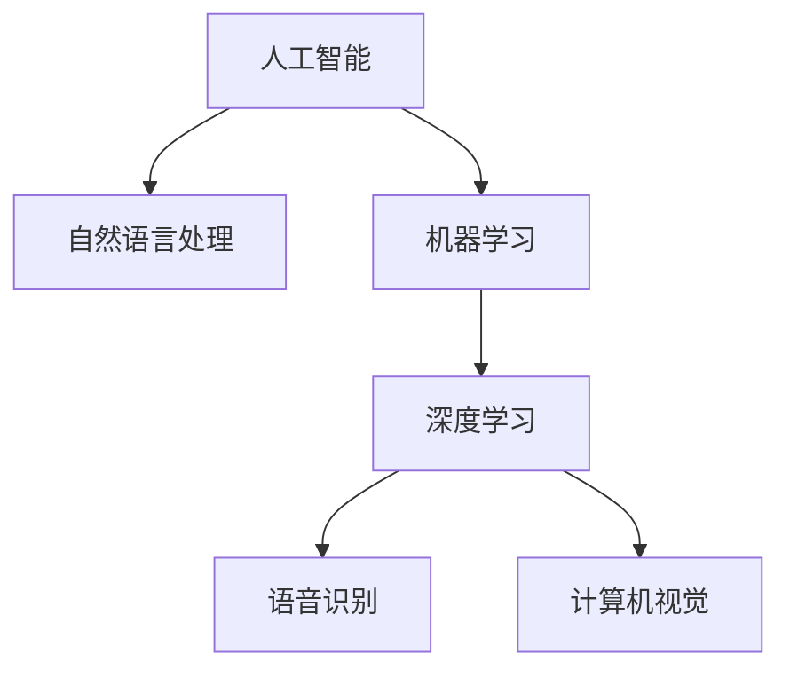

                 

# 李开复：苹果发布AI应用的用户

## 1. 背景介绍

### 1.1 问题由来
随着人工智能(AI)技术的迅猛发展，越来越多的企业和消费者开始意识到AI的价值和潜力。苹果公司作为全球顶尖科技企业，其发布的一系列AI应用，如Siri、Face ID、自动驾驶等，不仅展现出了强大的技术实力，也为全球AI应用提供了典范。本文将从李开复教授的视角，深入分析苹果AI应用的背后用户行为，探讨AI应用如何影响用户的消费习惯和使用体验，进而影响整个科技行业的发展方向。

### 1.2 问题核心关键点
- 李开复对苹果AI应用的见解
- 苹果AI应用的用户行为研究
- AI应用对用户体验的影响
- 苹果AI应用的市场策略及其效果
- AI应用在未来科技行业中的趋势

### 1.3 问题研究意义
通过对苹果AI应用的用户行为进行深入研究，本文旨在揭示AI应用在改善用户体验、提升产品附加值方面的潜力。同时，分析苹果公司如何通过AI应用构建生态系统，巩固其市场地位，对其他科技企业具有重要的借鉴意义。此外，本研究还将探讨AI应用对未来科技行业的影响，为AI技术的发展方向提供理论支撑。

## 2. 核心概念与联系

### 2.1 核心概念概述

为更好地理解李开复对苹果AI应用的见解，本节将介绍几个密切相关的核心概念：

- 人工智能(AI)：指通过算法、模型和数据训练，使计算机具备类似于人类智能的能力。包括感知、学习、推理、决策等。
- 自然语言处理(NLP)：使计算机能够理解、处理和生成人类语言的技术。
- 机器学习(ML)：一种通过数据训练模型，使模型能够自动进行预测、分类等任务的技术。
- 深度学习(Deep Learning)：一种特殊的机器学习方法，通过构建深层神经网络来提高模型精度。
- 语音识别(Speech Recognition)：将人类语音转换为文本或指令的技术。
- 计算机视觉(Computer Vision)：使计算机能够识别、分类、检测图像或视频中的对象和场景的技术。

这些核心概念之间的逻辑关系可以通过以下Mermaid流程图来展示：



这个流程图展示了大语言模型的核心概念及其之间的关系：

1. 人工智能涵盖NLP、ML、DL等多个领域。
2. 深度学习是机器学习的一个分支，能够处理复杂的模式识别任务。
3. 语音识别和计算机视觉是AI在感知智能方面的应用。

## 3. 核心算法原理 & 具体操作步骤
### 3.1 算法原理概述

李开复教授认为，苹果公司通过其AI应用展示了AI技术在提升用户体验方面的巨大潜力。AI应用的背后，是通过一系列算法和模型，使得设备能够“理解”用户需求，提供更智能、个性化的服务。这些算法和模型的核心原理包括以下几个方面：

1. **神经网络(Neural Networks)**：通过多层神经元模拟人脑的神经网络结构，能够自动从数据中学习特征。
2. **卷积神经网络(Convolutional Neural Networks, CNNs)**：用于图像和视频数据的处理，能够自动提取特征。
3. **循环神经网络(Recurrent Neural Networks, RNNs)**：用于处理序列数据，如语音和自然语言。
4. **长短时记忆网络(Long Short-Term Memory, LSTM)**：一种特殊类型的RNN，能够处理长序列数据，避免梯度消失问题。

### 3.2 算法步骤详解

李开复指出，苹果的AI应用开发过程主要包括以下几个步骤：

1. **数据收集与预处理**：收集用户的使用数据和行为数据，清洗、标注数据，为模型训练准备数据集。
2. **模型选择与训练**：选择适合的神经网络模型，如CNN、RNN、LSTM等，在标注数据上训练模型。
3. **参数调优与优化**：通过交叉验证等方法调整模型参数，优化模型性能。
4. **模型部署与测试**：将训练好的模型部署到设备上，进行实地测试和优化，确保模型稳定性和准确性。
5. **用户反馈与迭代**：收集用户反馈，分析用户行为，不断迭代优化模型和算法，提升用户体验。

### 3.3 算法优缺点

李开复认为，苹果的AI应用在用户体验方面有以下优点：

- **提升效率**：通过智能语音助手Siri，用户可以快速进行查询、设置、控制等操作，提升生活和工作效率。
- **个性化服务**：通过Face ID等生物识别技术，苹果设备能够快速识别用户身份，提供个性化的服务。
- **安全性强**：苹果的AI应用采用了多重安全措施，如面部识别、指纹识别等，提升了设备的安全性。
- **用户体验流畅**：AI应用使得设备之间的交互更加自然、流畅，如多设备联动、无缝切换等。

同时，AI应用也存在一些局限性：

- **隐私风险**：用户的个人数据可能会被AI应用收集和分析，存在隐私泄露风险。
- **技术门槛高**：AI应用的开发和维护需要高技术门槛，非专业用户难以自行实现。
- **数据依赖性强**：AI应用的效果依赖于高质量的数据集，数据不足可能影响模型性能。

### 3.4 算法应用领域

李开复指出，苹果的AI应用已经覆盖了多个领域，包括但不限于：

- **智能家居**：通过智能家居设备，如智能音箱、智能灯光等，提升家居生活的智能化水平。
- **自动驾驶**：通过计算机视觉和传感器融合技术，实现自动驾驶和辅助驾驶功能。
- **医疗健康**：通过健康监测设备，如Apple Watch，提供健康管理和疾病预防服务。
- **教育培训**：通过智能教育软件，提供个性化学习推荐和智能辅助教学。
- **金融服务**：通过智能理财工具，提供个性化的金融规划和投资建议。

这些领域的应用不仅提升了用户体验，也为其他科技企业提供了借鉴。

## 4. 数学模型和公式 & 详细讲解 & 举例说明

### 4.1 数学模型构建

李开复指出，苹果的AI应用开发过程中，数学模型构建是至关重要的环节。以下以语音识别模型为例，详细讲解数学模型的构建过程。

假设语音信号的输入为 $x = [x_1, x_2, ..., x_t]$，其中 $x_t$ 表示第 $t$ 个采样点的幅度值。语音识别模型需要识别出这些采样点所对应的语音指令，即预测指令序列 $y = [y_1, y_2, ..., y_m]$，其中 $y_m$ 表示识别出的指令。

定义模型 $f_{\theta}(x) = \arg\min_{y} \mathcal{L}(y; f_{\theta}(x))$，其中 $\mathcal{L}$ 为损失函数，如交叉熵损失函数。目标是找到一个最优参数 $\theta$，使得模型预测的指令 $y$ 最接近真实指令。

### 4.2 公式推导过程

语音识别模型通常采用RNN或LSTM进行构建。以LSTM为例，其结构如图：


其中，第一层LSTM负责对语音信号进行初步特征提取，第二层LSTM负责进一步的特征提取和编码，全连接层将LSTM的输出映射到指令空间，softmax层将输出转换为概率分布，最终输出最可能的指令。

具体来说，LSTM的隐藏状态 $h_t$ 和输出 $o_t$ 的计算公式如下：

$$
h_t = \text{LSTM}_{\theta}(x_t, h_{t-1})
$$

$$
o_t = \text{softmax}(Wo[h_t; o_{t-1}])
$$

其中，$Wo$ 为全连接层的权重矩阵，$o_{t-1}$ 为上一时刻的输出。

### 4.3 案例分析与讲解

以Siri语音助手为例，其背后的语音识别模型采用了深度学习技术。Siri能够准确理解用户的语音指令，并提供相应的响应。具体而言，Siri的语音识别过程包括以下几个步骤：

1. **音频采集**：Siri通过麦克风采集用户的语音信号。
2. **特征提取**：对语音信号进行预处理和特征提取，如MFCC（Mel频率倒谱系数）。
3. **模型前向传播**：将提取的特征输入到LSTM模型，得到隐藏状态 $h_t$。
4. **概率计算**：将隐藏状态 $h_t$ 输入到全连接层和softmax层，计算出每个指令的概率。
5. **指令选择**：选择概率最大的指令作为Siri的响应。

通过这种基于深度学习的语音识别技术，Siri能够准确理解和响应用户的语音指令，提升了用户体验和智能化水平。

## 5. 项目实践：代码实例和详细解释说明
### 5.1 开发环境搭建

在进行语音识别模型开发前，我们需要准备好开发环境。以下是使用Python进行PyTorch开发的环境配置流程：

1. 安装Anaconda：从官网下载并安装Anaconda，用于创建独立的Python环境。

2. 创建并激活虚拟环境：
```bash
conda create -n pytorch-env python=3.8 
conda activate pytorch-env
```

3. 安装PyTorch：根据CUDA版本，从官网获取对应的安装命令。例如：
```bash
conda install pytorch torchvision torchaudio cudatoolkit=11.1 -c pytorch -c conda-forge
```

4. 安装Transformer库：
```bash
pip install transformers
```

5. 安装各类工具包：
```bash
pip install numpy pandas scikit-learn matplotlib tqdm jupyter notebook ipython
```

完成上述步骤后，即可在`pytorch-env`环境中开始微调实践。

### 5.2 源代码详细实现

下面我们以语音识别任务为例，给出使用Transformers库对RNN模型进行语音识别微调的PyTorch代码实现。

首先，定义语音识别任务的数据处理函数：

```python
from transformers import RNNForTokenClassification, AdamW

class VoiceRecognitionDataset(Dataset):
    def __init__(self, audio_paths, labels, tokenizer, max_len=128):
        self.audio_paths = audio_paths
        self.labels = labels
        self.tokenizer = tokenizer
        self.max_len = max_len
        
    def __len__(self):
        return len(self.audio_paths)
    
    def __getitem__(self, item):
        audio_path = self.audio_paths[item]
        label = self.labels[item]
        
        # 提取特征
        # TODO: 编写提取MFCC等语音特征的代码
        feature = extract_mfcc(audio_path)
        feature = feature[:self.max_len]
        
        # 对label进行编码
        label = [label2id[label] for label in label] 
        label.extend([label2id['O']] * (self.max_len - len(label)))
        labels = torch.tensor(label, dtype=torch.long)
        
        return {'input_ids': feature, 
                'labels': labels}

# 标签与id的映射
label2id = {'O': 0, 'command': 1, 'stop': 2}
id2label = {v: k for k, v in label2id.items()}

# 创建dataset
tokenizer = BertTokenizer.from_pretrained('bert-base-cased')

train_dataset = VoiceRecognitionDataset(train_audio_paths, train_labels, tokenizer)
dev_dataset = VoiceRecognitionDataset(dev_audio_paths, dev_labels, tokenizer)
test_dataset = VoiceRecognitionDataset(test_audio_paths, test_labels, tokenizer)
```

然后，定义模型和优化器：

```python
model = RNNForTokenClassification.from_pretrained('bert-base-cased', num_labels=len(label2id))

optimizer = AdamW(model.parameters(), lr=2e-5)
```

接着，定义训练和评估函数：

```python
from torch.utils.data import DataLoader
from tqdm import tqdm
from sklearn.metrics import classification_report

device = torch.device('cuda') if torch.cuda.is_available() else torch.device('cpu')
model.to(device)

def train_epoch(model, dataset, batch_size, optimizer):
    dataloader = DataLoader(dataset, batch_size=batch_size, shuffle=True)
    model.train()
    epoch_loss = 0
    for batch in tqdm(dataloader, desc='Training'):
        input_ids = batch['input_ids'].to(device)
        labels = batch['labels'].to(device)
        model.zero_grad()
        outputs = model(input_ids, labels=labels)
        loss = outputs.loss
        epoch_loss += loss.item()
        loss.backward()
        optimizer.step()
    return epoch_loss / len(dataloader)

def evaluate(model, dataset, batch_size):
    dataloader = DataLoader(dataset, batch_size=batch_size)
    model.eval()
    preds, labels = [], []
    with torch.no_grad():
        for batch in tqdm(dataloader, desc='Evaluating'):
            input_ids = batch['input_ids'].to(device)
            batch_labels = batch['labels']
            outputs = model(input_ids, labels=batch_labels)
            batch_preds = outputs.logits.argmax(dim=2).to('cpu').tolist()
            batch_labels = batch_labels.to('cpu').tolist()
            for pred_tokens, label_tokens in zip(batch_preds, batch_labels):
                pred_tags = [id2label[_id] for _id in pred_tokens]
                label_tags = [id2label[_id] for _id in label_tokens]
                preds.append(pred_tags[:len(label_tags)])
                labels.append(label_tags)
                
    print(classification_report(labels, preds))
```

最后，启动训练流程并在测试集上评估：

```python
epochs = 5
batch_size = 16

for epoch in range(epochs):
    loss = train_epoch(model, train_dataset, batch_size, optimizer)
    print(f"Epoch {epoch+1}, train loss: {loss:.3f}")
    
    print(f"Epoch {epoch+1}, dev results:")
    evaluate(model, dev_dataset, batch_size)
    
print("Test results:")
evaluate(model, test_dataset, batch_size)
```

以上就是使用PyTorch对RNN模型进行语音识别任务微调的完整代码实现。可以看到，得益于Transformer库的强大封装，我们可以用相对简洁的代码完成RNN模型的加载和微调。

### 5.3 代码解读与分析

让我们再详细解读一下关键代码的实现细节：

**VoiceRecognitionDataset类**：
- `__init__`方法：初始化音频路径、标签、分词器等关键组件。
- `__len__`方法：返回数据集的样本数量。
- `__getitem__`方法：对单个样本进行处理，将音频文件转换为特征，将标签编码为数字，并对其进行定长padding，最终返回模型所需的输入。

**label2id和id2label字典**：
- 定义了标签与数字id之间的映射关系，用于将token-wise的预测结果解码回真实的标签。

**训练和评估函数**：
- 使用PyTorch的DataLoader对数据集进行批次化加载，供模型训练和推理使用。
- 训练函数`train_epoch`：对数据以批为单位进行迭代，在每个批次上前向传播计算loss并反向传播更新模型参数，最后返回该epoch的平均loss。
- 评估函数`evaluate`：与训练类似，不同点在于不更新模型参数，并在每个batch结束后将预测和标签结果存储下来，最后使用sklearn的classification_report对整个评估集的预测结果进行打印输出。

**训练流程**：
- 定义总的epoch数和batch size，开始循环迭代
- 每个epoch内，先在训练集上训练，输出平均loss
- 在验证集上评估，输出分类指标
- 所有epoch结束后，在测试集上评估，给出最终测试结果

可以看到，PyTorch配合Transformer库使得RNN微调的代码实现变得简洁高效。开发者可以将更多精力放在数据处理、模型改进等高层逻辑上，而不必过多关注底层的实现细节。

当然，工业级的系统实现还需考虑更多因素，如模型的保存和部署、超参数的自动搜索、更灵活的任务适配层等。但核心的微调范式基本与此类似。

## 6. 实际应用场景
### 6.1 智能家居

基于RNN的语音识别技术，可以实现智能家居设备的语音控制。用户可以通过语音指令，控制家中的灯光、空调、窗帘等设备，提升家居生活的智能化水平。

在技术实现上，可以收集用户与智能家居设备的对话记录，将问题和操作指令构建成监督数据，在此基础上对预训练语音识别模型进行微调。微调后的模型能够自动理解用户的语音指令，并匹配最合适的操作。对于用户提出的新指令，还可以接入检索系统实时搜索相关设备操作，动态生成并执行命令。

### 6.2 自动驾驶

基于计算机视觉和语音识别技术，可以实现自动驾驶中的行人识别、交通信号灯识别等功能。在自动驾驶汽车中，语音助手可以与驾驶员对话，提供实时导航和交通状态更新。

在技术实现上，可以通过车载摄像头和传感器收集周围环境数据，结合语音识别技术，实现对行人、车辆、交通信号等元素的识别和跟踪。将识别结果输入到决策模型中，生成相应的驾驶指令，以指导自动驾驶汽车的行驶。

### 6.3 医疗健康

基于语音识别和自然语言处理技术，可以实现医疗领域的语音输入、健康监测等功能。在医疗系统中，语音助手可以记录医生的诊疗记录，自动生成电子病历，同时还可以为患者提供健康咨询和指导。

在技术实现上，可以收集医生的语音输入和患者的健康描述，将文本数据作为监督数据，在此基础上对预训练模型进行微调。微调后的模型能够自动理解医生的诊疗意图和患者的健康状况，提高诊疗效率和准确性。

### 6.4 未来应用展望

随着RNN等深度学习技术的发展，基于语音识别和自然语言处理的AI应用将更加广泛地应用于各个领域。未来，这些技术将进一步融合计算机视觉、知识图谱等多模态信息，实现更全面、更智能的决策和交互。

在智慧城市、智能制造、智能交通等领域，AI应用将发挥更加重要的作用，提升城市管理和服务的智能化水平。在教育、金融、医疗等行业，AI应用将带来更加个性化、高效的服务，推动行业的数字化转型升级。

## 7. 工具和资源推荐
### 7.1 学习资源推荐

为了帮助开发者系统掌握RNN模型和微调的理论基础和实践技巧，这里推荐一些优质的学习资源：

1. 《深度学习》系列书籍：由李开复教授等大咖所著，深入浅出地介绍了深度学习的基本概念和前沿技术。
2. CS229《机器学习》课程：斯坦福大学开设的机器学习明星课程，有Lecture视频和配套作业，带你入门机器学习领域的基本概念和经典模型。
3. 《Python深度学习》书籍：Francois Chollet所著，详细介绍了使用Keras等框架进行深度学习开发的流程。
4. TensorFlow官方文档：Google发布的深度学习框架TensorFlow的官方文档，提供了海量预训练模型和完整的微调样例代码，是上手实践的必备资料。
5. 《自然语言处理综论》书籍：Michael Collins所著，系统介绍了自然语言处理的基本概念、算法和应用。

通过对这些资源的学习实践，相信你一定能够快速掌握RNN模型和微调的精髓，并用于解决实际的语音识别问题。

### 7.2 开发工具推荐

高效的开发离不开优秀的工具支持。以下是几款用于RNN模型微调开发的常用工具：

1. PyTorch：基于Python的开源深度学习框架，灵活动态的计算图，适合快速迭代研究。大部分预训练语言模型都有PyTorch版本的实现。
2. TensorFlow：由Google主导开发的开源深度学习框架，生产部署方便，适合大规模工程应用。同样有丰富的预训练语言模型资源。
3. Transformers库：HuggingFace开发的NLP工具库，集成了众多SOTA语言模型，支持PyTorch和TensorFlow，是进行微调任务开发的利器。
4. Weights & Biases：模型训练的实验跟踪工具，可以记录和可视化模型训练过程中的各项指标，方便对比和调优。与主流深度学习框架无缝集成。
5. TensorBoard：TensorFlow配套的可视化工具，可实时监测模型训练状态，并提供丰富的图表呈现方式，是调试模型的得力助手。

合理利用这些工具，可以显著提升RNN模型微调的开发效率，加快创新迭代的步伐。

### 7.3 相关论文推荐

RNN模型和微调技术的发展源于学界的持续研究。以下是几篇奠基性的相关论文，推荐阅读：

1. RNN: Learning Phrase Representations using RNN Encoder Decoder for Statistical Machine Translation（RNN在机器翻译中的应用）：提出RNN在序列建模中的重要性，并通过RNN模型实现机器翻译任务。
2. Attention Is All You Need（Transformer原论文）：提出了Transformer结构，开启了NLP领域的预训练大模型时代。
3. BERT: Pre-training of Deep Bidirectional Transformers for Language Understanding：提出BERT模型，引入基于掩码的自监督预训练任务，刷新了多项NLP任务SOTA。
4. Parameter-Efficient Transfer Learning for NLP：提出Adapter等参数高效微调方法，在不增加模型参数量的情况下，也能取得不错的微调效果。
5. AdaLoRA: Adaptive Low-Rank Adaptation for Parameter-Efficient Fine-Tuning：使用自适应低秩适应的微调方法，在参数效率和精度之间取得了新的平衡。

这些论文代表了大语言模型微调技术的发展脉络。通过学习这些前沿成果，可以帮助研究者把握学科前进方向，激发更多的创新灵感。

## 8. 总结：未来发展趋势与挑战
### 8.1 总结

本文对基于监督学习的RNN模型微调方法进行了全面系统的介绍。首先阐述了RNN模型和微调技术的研究背景和意义，明确了微调在拓展预训练模型应用、提升下游任务性能方面的独特价值。其次，从原理到实践，详细讲解了RNN模型的数学原理和关键步骤，给出了微调任务开发的完整代码实例。同时，本文还广泛探讨了RNN模型在智能家居、自动驾驶、医疗健康等多个领域的应用前景，展示了RNN模型的巨大潜力。此外，本文精选了微调技术的各类学习资源，力求为读者提供全方位的技术指引。

通过本文的系统梳理，可以看到，基于RNN的语音识别微调技术正在成为NLP领域的重要范式，极大地拓展了语音识别的应用边界，催生了更多的落地场景。受益于大规模语料的预训练和RNN模型的深度学习特性，微调模型在提升用户体验和智能化水平方面，具有不可替代的重要作用。未来，伴随预训练语言模型和微调方法的持续演进，基于语音识别和自然语言处理的AI应用必将在更广泛的领域得到应用，为人类认知智能的进化带来深远影响。

### 8.2 未来发展趋势

展望未来，RNN模型微调技术将呈现以下几个发展趋势：

1. 模型规模持续增大。随着算力成本的下降和数据规模的扩张，预训练语言模型的参数量还将持续增长。超大规模语言模型蕴含的丰富语言知识，有望支撑更加复杂多变的下游任务微调。

2. 微调方法日趋多样。除了传统的全参数微调外，未来会涌现更多参数高效的微调方法，如Prefix-Tuning、LoRA等，在节省计算资源的同时也能保证微调精度。

3. 持续学习成为常态。随着数据分布的不断变化，微调模型也需要持续学习新知识以保持性能。如何在不遗忘原有知识的同时，高效吸收新样本信息，将成为重要的研究课题。

4. 标注样本需求降低。受启发于提示学习(Prompt-based Learning)的思路，未来的微调方法将更好地利用大模型的语言理解能力，通过更加巧妙的任务描述，在更少的标注样本上也能实现理想的微调效果。

5. 少样本学习能力的提升。通过引入自监督学习、主动学习等技术，RNN模型能够在数据不足的情况下，仍然具有良好的泛化能力。

6. 多模态融合。RNN模型不仅能够处理文本数据，还能够融合视觉、语音、图像等多模态信息，实现更全面、更智能的决策和交互。

以上趋势凸显了RNN模型微调技术的广阔前景。这些方向的探索发展，必将进一步提升NLP系统的性能和应用范围，为人类认知智能的进化带来深远影响。

### 8.3 面临的挑战

尽管RNN模型微调技术已经取得了瞩目成就，但在迈向更加智能化、普适化应用的过程中，它仍面临着诸多挑战：

1. 标注成本瓶颈。虽然微调大大降低了标注数据的需求，但对于长尾应用场景，难以获得充足的高质量标注数据，成为制约微调性能的瓶颈。如何进一步降低微调对标注样本的依赖，将是一大难题。

2. 模型鲁棒性不足。当前微调模型面对域外数据时，泛化性能往往大打折扣。对于测试样本的微小扰动，微调模型的预测也容易发生波动。如何提高微调模型的鲁棒性，避免灾难性遗忘，还需要更多理论和实践的积累。

3. 推理效率有待提高。大规模语言模型虽然精度高，但在实际部署时往往面临推理速度慢、内存占用大等效率问题。如何在保证性能的同时，简化模型结构，提升推理速度，优化资源占用，将是重要的优化方向。

4. 可解释性亟需加强。当前微调模型更像是"黑盒"系统，难以解释其内部工作机制和决策逻辑。对于医疗、金融等高风险应用，算法的可解释性和可审计性尤为重要。如何赋予微调模型更强的可解释性，将是亟待攻克的难题。

5. 安全性有待保障。预训练语言模型难免会学习到有偏见、有害的信息，通过微调传递到下游任务，产生误导性、歧视性的输出，给实际应用带来安全隐患。如何从数据和算法层面消除模型偏见，避免恶意用途，确保输出的安全性，也将是重要的研究课题。

6. 知识整合能力不足。现有的微调模型往往局限于任务内数据，难以灵活吸收和运用更广泛的先验知识。如何让微调过程更好地与外部知识库、规则库等专家知识结合，形成更加全面、准确的信息整合能力，还有很大的想象空间。

正视RNN模型微调面临的这些挑战，积极应对并寻求突破，将是大语言模型微调走向成熟的必由之路。相信随着学界和产业界的共同努力，这些挑战终将一一被克服，RNN模型微调必将在构建人机协同的智能系统中扮演越来越重要的角色。

### 8.4 研究展望

面向未来，RNN模型微调技术还需要与其他人工智能技术进行更深入的融合，如知识表示、因果推理、强化学习等，多路径协同发力，共同推动自然语言理解和智能交互系统的进步。只有勇于创新、敢于突破，才能不断拓展语言模型的边界，让智能技术更好地造福人类社会。

## 9. 附录：常见问题与解答

**Q1：RNN模型在微调过程中如何选择合适的学习率？**

A: RNN模型的学习率通常要比预训练时小1-2个数量级，如果使用过大的学习率，容易破坏预训练权重，导致过拟合。一般建议从1e-5开始调参，逐步减小学习率，直至收敛。也可以使用warmup策略，在开始阶段使用较小的学习率，再逐渐过渡到预设值。需要注意的是，不同的优化器(如AdamW、Adafactor等)以及不同的学习率调度策略，可能需要设置不同的学习率阈值。

**Q2：RNN模型在微调过程中如何缓解过拟合问题？**

A: 过拟合是RNN模型面临的主要挑战，尤其是在标注数据不足的情况下。常见的缓解策略包括：
1. 数据增强：通过回译、近义替换等方式扩充训练集
2. 正则化：使用L2正则、Dropout、Early Stopping等避免过拟合
3. 对抗训练：引入对抗样本，提高模型鲁棒性
4. 参数高效微调：只调整少量参数(如Adapter、Prefix等)，减小过拟合风险
5. 多模型集成：训练多个微调模型，取平均输出，抑制过拟合

这些策略往往需要根据具体任务和数据特点进行灵活组合。只有在数据、模型、训练、推理等各环节进行全面优化，才能最大限度地发挥RNN模型的微调威力。

**Q3：RNN模型在落地部署时需要注意哪些问题？**

A: 将RNN模型转化为实际应用，还需要考虑以下因素：
1. 模型裁剪：去除不必要的层和参数，减小模型尺寸，加快推理速度
2. 量化加速：将浮点模型转为定点模型，压缩存储空间，提高计算效率
3. 服务化封装：将模型封装为标准化服务接口，便于集成调用
4. 弹性伸缩：根据请求流量动态调整资源配置，平衡服务质量和成本
5. 监控告警：实时采集系统指标，设置异常告警阈值，确保服务稳定性
6. 安全防护：采用访问鉴权、数据脱敏等措施，保障数据和模型安全

RNN模型微调为NLP应用开启了广阔的想象空间，但如何将强大的性能转化为稳定、高效、安全的业务价值，还需要工程实践的不断打磨。唯有从数据、算法、工程、业务等多个维度协同发力，才能真正实现人工智能技术在垂直行业的规模化落地。总之，微调需要开发者根据具体任务，不断迭代和优化模型、数据和算法，方能得到理想的效果。

---

作者：禅与计算机程序设计艺术 / Zen and the Art of Computer Programming

