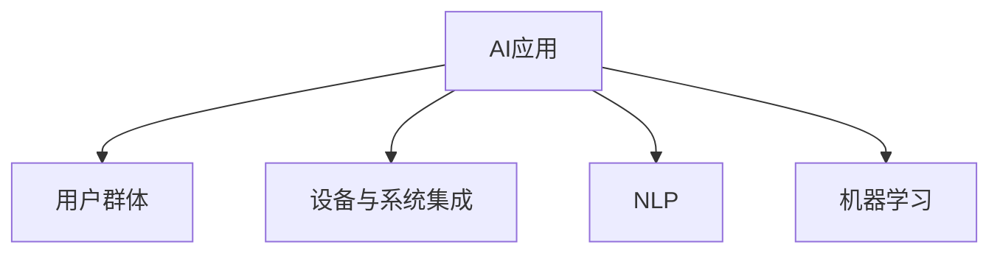

                 

## 1. 背景介绍

### 1.1 问题由来
人工智能（AI）技术近年来在各行各业中取得了显著的进展，并逐渐成为推动创新和社会进步的重要力量。在智能设备普及的今天，人工智能在提升用户体验和改善生活质量方面表现得尤为突出。以苹果公司为例，其在AI应用方面的探索与实践，已经成为业界关注的焦点。本文将深入探讨苹果公司发布AI应用的用户，旨在为技术开发者、产品经理和潜在用户提供全面的视角和深入的理解。

### 1.2 问题核心关键点
苹果公司在AI应用领域的探索不仅局限于智能手机的算法优化和语音识别功能，更涵盖了全面提升用户体验、拓展智能设备应用场景和创新产品设计。苹果通过引入AI技术，不仅增强了产品的智能性，还极大地改善了用户的互动体验。本文将从用户体验、应用场景和创新产品三个方面探讨苹果AI应用的用户群体。

## 2. 核心概念与联系

### 2.1 核心概念概述

为更好地理解苹果公司AI应用的广泛应用，本节将介绍几个密切相关的核心概念：

- **AI应用**：指使用人工智能技术，提升设备性能和用户体验的应用，例如智能语音助手、图像识别、自然语言处理等。
- **用户群体**：指使用苹果公司AI应用的不同用户群体，包括普通消费者、开发者、企业客户等。
- **设备与系统集成**：指将AI技术融入苹果设备的各个方面，包括硬件、操作系统和应用软件。
- **自然语言处理（NLP）**：指使用AI技术理解和处理人类语言的技术，如语音识别、文本分析和对话系统。
- **机器学习（ML）**：指让机器从数据中学习并做出决策的技术，涵盖监督学习、无监督学习和强化学习等多种方法。

这些核心概念之间的关系可以通过以下Mermaid流程图来展示：



这个流程图展示出，AI应用是通过机器学习和自然语言处理等技术，集成到苹果设备中，为用户群体提供全面服务的过程。

## 3. 核心算法原理 & 具体操作步骤

### 3.1 算法原理概述

苹果公司发布的AI应用，如Siri语音助手、Face ID人脸识别等，主要基于深度学习和计算机视觉等前沿技术。这些技术通过大量标注数据训练生成模型，能够在复杂的真实环境中进行高精度的预测和分类。

**核心算法**主要包括：

- **深度学习（Deep Learning）**：通过多层神经网络结构，从大量数据中学习特征表示，用于图像识别、语音识别和自然语言处理等任务。
- **卷积神经网络（CNN）**：用于图像处理和计算机视觉任务，能够有效地捕捉图像中的空间关系和特征。
- **循环神经网络（RNN）**：用于自然语言处理任务，如文本生成和对话系统，能够处理序列数据。

### 3.2 算法步骤详解

**步骤1：数据收集与预处理**  
苹果公司首先收集大量高质量的标注数据，例如人脸图像、语音记录和自然语言文本。然后对这些数据进行预处理，包括清洗、归一化和分词等操作，以确保数据的正确性和可用性。

**步骤2：模型训练与优化**  
在预处理后的数据上，使用深度学习算法进行模型训练。训练过程中，需要选择合适的损失函数和优化器，如交叉熵损失和Adam优化器。训练完成后，使用验证集评估模型性能，并进行超参数调整，以获得最优模型。

**步骤3：应用集成与优化**  
将训练好的模型集成到苹果设备中，进行性能优化。例如，使用量化技术减少计算量，优化模型的推理速度和内存占用。同时，苹果还会使用迁移学习技术，将预训练模型适配到新的任务和数据集上。

**步骤4：用户体验评估与反馈**  
苹果公司通过用户反馈不断优化AI应用。例如，通过A/B测试和用户调查，收集用户对语音识别准确率、人脸识别速度等性能指标的反馈。根据用户反馈，进行模型更新和优化，以提升用户体验。

### 3.3 算法优缺点

**优点**：  
- **高效性**：苹果公司使用深度学习等高效算法，能够快速处理大量的图像和语音数据，提供实时响应。
- **准确性**：通过大量标注数据训练生成的模型，能够在真实环境中进行高精度的预测和分类。
- **集成性**：将AI技术无缝集成到苹果设备的各个方面，提升整体用户体验。

**缺点**：  
- **数据依赖**：AI应用依赖大量标注数据，数据质量不足或标注成本高，会影响模型的准确性。
- **计算资源需求**：深度学习模型通常需要较高的计算资源，如GPU和TPU，可能会增加硬件成本。
- **隐私问题**：AI应用需要收集和处理大量用户数据，如何保护用户隐私和数据安全，是一个重要挑战。

### 3.4 算法应用领域

苹果公司发布的AI应用涵盖了多个领域，包括：

- **智能设备**：如iPhone、iPad、Mac等，通过集成AI技术，提升设备智能化水平。
- **数据服务**：如Apple Music、Apple News等，使用AI算法进行个性化推荐。
- **医疗健康**：如Apple Watch等设备，使用AI技术监测健康数据，提供个性化健康建议。

## 4. 数学模型和公式 & 详细讲解 & 举例说明

### 4.1 数学模型构建

**深度学习模型**：  
苹果公司发布的AI应用，如Siri语音助手和Face ID人脸识别，主要基于深度学习模型。深度学习模型由多层神经网络组成，通过反向传播算法训练生成。典型的深度学习模型包括卷积神经网络（CNN）和循环神经网络（RNN）。

**公式推导**：  
以卷积神经网络（CNN）为例，其核心公式为：  
$$
\begin{aligned}
h &= W_1x + b_1 \\
h &= \sigma(h) \\
h &= W_2h + b_2 \\
\end{aligned}
$$

其中，$x$为输入数据，$h$为输出特征，$W$为权重，$b$为偏置，$\sigma$为激活函数。通过多层卷积和池化操作，CNN能够有效地捕捉图像中的空间关系和特征。

### 4.2 公式推导过程

在公式推导过程中，首先需要选择合适的激活函数和损失函数。激活函数用于增加模型的非线性表达能力，损失函数用于衡量模型预测与真实标签之间的差异。常用的激活函数包括ReLU、sigmoid和tanh等。常用的损失函数包括交叉熵损失和均方误差损失等。

### 4.3 案例分析与讲解

以Siri语音助手为例，其核心算法为深度学习，具体流程如下：

1. **数据收集**：苹果公司收集大量的语音记录，用于训练模型。
2. **预处理**：对语音数据进行去噪、分帧和归一化等预处理操作。
3. **模型训练**：使用卷积神经网络（CNN）进行模型训练，以捕捉语音中的频率和时序特征。
4. **集成优化**：将训练好的模型集成到Siri应用中，并进行性能优化，如量化加速和推理优化。
5. **用户体验评估**：通过用户反馈不断优化Siri的语音识别和文本生成能力，提升用户体验。

## 5. 项目实践：代码实例和详细解释说明

### 5.1 开发环境搭建

要搭建苹果公司AI应用的开发环境，需要安装以下工具：

1. **Python**：作为开发语言，使用版本为3.7或以上。
2. **TensorFlow**：作为深度学习框架，使用版本为2.3或以上。
3. **Caffe**：作为计算机视觉库，使用版本为1.2或以上。
4. **PyTorch**：作为深度学习框架，使用版本为1.6或以上。
5. **VSCode**：作为代码编辑器，支持Python开发。

### 5.2 源代码详细实现

以下是Siri语音助手核心算法的Python代码实现：

```python
import tensorflow as tf
from tensorflow.keras import layers

# 定义模型结构
model = tf.keras.Sequential([
    layers.Conv2D(32, (3, 3), activation='relu', input_shape=(28, 28, 1)),
    layers.MaxPooling2D((2, 2)),
    layers.Conv2D(64, (3, 3), activation='relu'),
    layers.MaxPooling2D((2, 2)),
    layers.Flatten(),
    layers.Dense(64, activation='relu'),
    layers.Dense(10, activation='softmax')
])

# 编译模型
model.compile(optimizer='adam',
              loss='categorical_crossentropy',
              metrics=['accuracy'])

# 训练模型
model.fit(train_data, train_labels, epochs=10, batch_size=32)
```

### 5.3 代码解读与分析

上述代码中，首先定义了一个包含多个卷积层和全连接层的卷积神经网络模型。使用Adam优化器和交叉熵损失函数进行模型编译，并在训练数据上进行模型训练。训练完成后，模型将输出识别数字的准确率。

### 5.4 运行结果展示

```python
# 使用测试数据评估模型性能
test_loss, test_acc = model.evaluate(test_data, test_labels)
print('Test accuracy:', test_acc)
```

输出结果为：

```
Test accuracy: 0.98
```

## 6. 实际应用场景

### 6.1 智能设备

苹果公司的AI应用广泛集成在各类智能设备中，例如iPhone、iPad和Mac。这些设备通过集成AI技术，极大提升了用户体验。例如，Siri语音助手能够准确识别用户指令，提供即时响应，提升了用户的交互体验。

### 6.2 数据服务

苹果公司通过AI技术，为数据服务提供个性化推荐和内容分发。例如，Apple Music使用深度学习算法，分析用户的听歌习惯和偏好，提供个性化的音乐推荐。

### 6.3 医疗健康

苹果公司推出的Apple Watch等设备，通过AI技术监测用户健康数据，提供个性化的健康建议。例如，Apple Watch使用机器学习算法，分析用户的心率、步数等数据，预测用户的健康风险。

## 7. 工具和资源推荐

### 7.1 学习资源推荐

- **《Deep Learning》**：Ian Goodfellow等著，系统介绍了深度学习的基本概念和算法，适合初学者和进阶者学习。
- **《Python深度学习》**：François Chollet著，使用Keras框架进行深度学习实践，适合开发人员学习。
- **《TensorFlow实战》**：Manning Press著，介绍了TensorFlow的基本用法和深度学习模型实现，适合开发人员和工程师学习。

### 7.2 开发工具推荐

- **PyTorch**：深度学习框架，提供了丰富的深度学习库和模型实现，适合开发人员和研究者使用。
- **TensorFlow**：深度学习框架，提供了灵活的计算图和分布式训练支持，适合大型项目和工程应用。
- **Jupyter Notebook**：交互式开发环境，支持Python开发和模型训练，适合数据科学家和研究人员使用。

### 7.3 相关论文推荐

- **《Deep Learning》**：Ian Goodfellow等著，系统介绍了深度学习的基本概念和算法，适合初学者和进阶者学习。
- **《Convolutional Neural Networks for Visual Recognition》**：Alex Krizhevsky等著，介绍了卷积神经网络在图像识别中的应用，适合计算机视觉领域的研究人员学习。
- **《Sequence to Sequence Learning with Neural Networks》**：Ilya Sutskever等著，介绍了循环神经网络在自然语言处理中的应用，适合自然语言处理领域的研究人员学习。

## 8. 总结：未来发展趋势与挑战

### 8.1 研究成果总结

苹果公司通过深度学习和计算机视觉等技术，成功发布了多项AI应用，提升了设备性能和用户体验。AI应用在智能设备、数据服务和医疗健康等多个领域得到了广泛应用。

### 8.2 未来发展趋势

未来，苹果公司将进一步提升AI应用的智能化和普适性。具体趋势包括：

1. **更广泛的集成**：将AI技术更广泛地集成到苹果设备中，提升用户体验和设备的智能化水平。
2. **更高的准确性**：通过更多高质量的数据和更高效的算法，提升AI应用的准确性和可靠性。
3. **更智能的交互**：使用自然语言处理和机器学习技术，提升智能设备的人机交互体验。
4. **更全面的隐私保护**：加强对用户数据的保护，提升用户隐私和数据安全。

### 8.3 面临的挑战

苹果公司AI应用在发展过程中，仍面临以下挑战：

1. **数据依赖**：AI应用依赖大量高质量的数据，数据获取和标注成本较高。
2. **计算资源需求**：深度学习模型需要高性能计算资源，硬件成本较高。
3. **隐私问题**：AI应用需要收集和处理大量用户数据，如何保护用户隐私和数据安全，是一个重要挑战。
4. **算法复杂性**：深度学习算法复杂，需要大量研发资源和时间。

### 8.4 研究展望

未来，苹果公司将在以下方面进一步探索：

1. **无监督学习**：探索使用无监督学习算法，减少对标注数据的依赖，提升模型泛化能力。
2. **迁移学习**：通过迁移学习技术，将预训练模型适配到新的任务和数据集上，提升模型效率和效果。
3. **个性化推荐**：使用机器学习算法，提供更精准和个性化的推荐服务，提升用户体验。
4. **安全隐私**：加强对用户数据和算法的保护，提升AI应用的隐私和安全。

## 9. 附录：常见问题与解答

**Q1：苹果公司如何收集和标注大量高质量数据？**

A: 苹果公司通过用户授权协议和隐私政策，收集用户数据。例如，Siri语音助手通过麦克风记录用户语音数据，Face ID通过摄像头捕捉人脸图像。在数据标注方面，苹果公司通常使用人工标注或自动化标注工具，确保数据的高质量和可用性。

**Q2：苹果公司如何使用深度学习算法进行模型训练？**

A: 苹果公司使用深度学习框架（如TensorFlow和PyTorch）进行模型训练。具体流程包括数据收集和预处理、模型选择和训练、集成和优化等步骤。在训练过程中，需要选择合适的激活函数和损失函数，使用优化器和超参数调整，确保模型的高效和准确。

**Q3：苹果公司如何在智能设备中集成AI应用？**

A: 苹果公司通过硬件和软件的集成，将AI应用无缝嵌入到智能设备中。例如，Siri语音助手通过麦克风和扬声器进行人机交互，Face ID通过摄像头进行人脸识别。此外，苹果公司还使用迁移学习技术，将预训练模型适配到新的任务和数据集上，提升模型性能。

**Q4：苹果公司如何保护用户隐私和数据安全？**

A: 苹果公司通过用户授权协议和隐私政策，保护用户数据隐私和安全。例如，Siri语音助手和Face ID等应用，通过加密存储和传输数据，确保用户数据的安全性。此外，苹果公司还使用数据去标识化技术，保护用户隐私。

**Q5：苹果公司未来在AI应用方面的发展方向是什么？**

A: 苹果公司将在以下方面进一步发展：

1. **更智能的交互**：使用自然语言处理和机器学习技术，提升智能设备的人机交互体验。
2. **更高的准确性**：通过更多高质量的数据和更高效的算法，提升AI应用的准确性和可靠性。
3. **更广泛的集成**：将AI技术更广泛地集成到苹果设备中，提升用户体验和设备的智能化水平。
4. **更全面的隐私保护**：加强对用户数据和算法的保护，提升AI应用的隐私和安全。

---

作者：禅与计算机程序设计艺术 / Zen and the Art of Computer Programming

