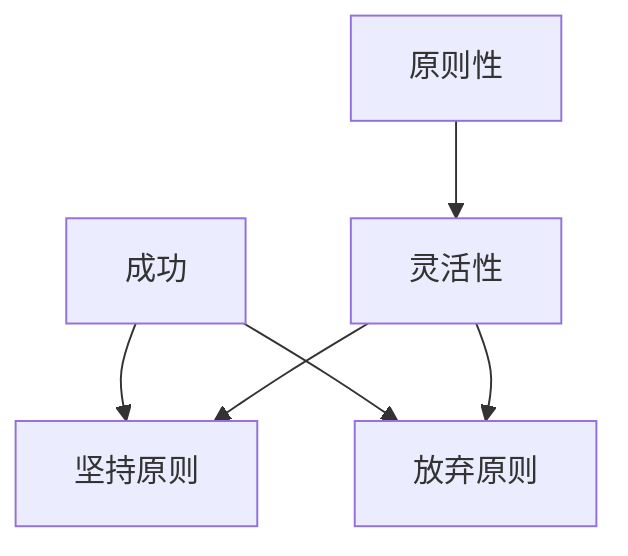

                 

# 杜月笙：脱离原则，所有行为都是错的

## 1. 背景介绍

### 1.1 问题由来

杜月笙，中国近代历史上一位极具争议性的人物。他从一个上海街头的小混混，一跃成为上海滩的地下霸主，最终成为中国的金融界巨擘，其一生充满了传奇色彩。杜月笙的成功，固然与其机敏、手腕和人际交往能力有关，但他为达到目的而放弃的原则性，也成为后人广泛讨论的话题。本文将深入探讨杜月笙行为的道德伦理、成功因素以及这些行为对于现代IT从业者行为准则的启示。

### 1.2 问题核心关键点

杜月笙成功与失败的关键在于其行为的“原则性”。本文将深入分析杜月笙脱离原则的行为模式，探讨这些行为在其成功路上的利与弊，并对比其在现代IT领域的应用与启示。

### 1.3 问题研究意义

杜月笙的行为模式，既揭示了社会环境中人性的复杂，也提供了一个反面的案例，提示我们在追求目标时，应如何保持原则性与灵活性之间的平衡。对IT从业者而言，理解杜月笙的行为模式，有助于在瞬息万变的科技环境中，坚守职业道德，同时灵活应对各种挑战。

## 2. 核心概念与联系

### 2.1 核心概念概述

为更好理解杜月笙的行为模式，我们首先要定义几个核心概念：

- **原则性**：指个人或组织在行为选择和决策过程中，坚持的一贯原则和标准。
- **灵活性**：指在面对变化时，能快速调整策略和行动的能力。
- **成功与失败**：在特定环境下，实现预期目标与否的状态。

这些概念之间的逻辑关系可以通过以下Mermaid流程图来展示：



这个流程图展示出，坚持原则往往与成功紧密相关，但过度坚持原则可能导致失败；而灵活性则能够促进成功，但放弃原则则可能导致更严重的失败。杜月笙的成功与失败，正是在这两个概念间的动态平衡下展开的。

## 3. 核心算法原理 & 具体操作步骤
### 3.1 算法原理概述

杜月笙的行为模式，可以看作是一种以成功为导向的决策算法。该算法的核心在于在原则性和灵活性之间做出权衡，以求达到最大程度的成功。我们将其原理简化为以下步骤：

1. **识别目标**：明确当前行为的目标，即成功。
2. **评估原则性**：判断当前目标与个人原则的冲突程度。
3. **调整行动策略**：在坚持或放弃原则之间做出选择，以最大化目标实现。
4. **执行行动**：根据选定的策略，执行相应的行动。

### 3.2 算法步骤详解

#### Step 1: 识别目标
杜月笙的目标是迅速积累财富和权力。为了实现这一目标，他必须做出一系列的决策。

#### Step 2: 评估原则性
杜月笙的行为模式表明，他愿意在必要时放弃一些原则，以换取更大的成功机会。例如，他在从商初期，为了获取更多的资源，不惜与黑帮势力合作，甚至涉及走私、赌博等非法活动。

#### Step 3: 调整行动策略
在每一次决策时，杜月笙都会评估当前目标与个人原则的冲突程度，并根据实际情况调整策略。他善于利用他人的弱点，通过合作、欺诈或威胁等手段，达成自己的目标。

#### Step 4: 执行行动
杜月笙的行动通常非常果断，一旦确定了目标和策略，他就会迅速采取行动。例如，他通过借贷、贿赂、欺诈等多种手段迅速积累财富，最终成为中国金融界的巨擘。

### 3.3 算法优缺点

#### 优点
- **迅速成功**：杜月笙通过灵活调整策略，能够迅速积累资源，实现目标。
- **适应性强**：他能够根据环境变化，灵活调整行为模式，应对各种挑战。

#### 缺点
- **道德风险**：放弃原则的行动通常涉及道德风险，可能导致长期负面影响。
- **自我膨胀**：过度追求成功可能导致自我膨胀，忽视了道德和法律的约束。
- **不可持续性**：忽视原则的行动虽短期内成功，但缺乏可持续性，难以长期维持。

### 3.4 算法应用领域

杜月笙的行为模式在多个领域中都有应用，如企业战略管理、金融投资、人际交往等。这些领域中的决策者，在追求目标时，常常需要在原则性和灵活性之间做出权衡。

## 4. 数学模型和公式 & 详细讲解 & 举例说明
### 4.1 数学模型构建

我们尝试用数学模型来描述杜月笙的行为模式。假设成功为 $C$，原则性为 $P$，灵活性为 $F$，设成功与目标 $C$ 之间存在正相关关系，原则性与成功 $P$ 之间存在负相关关系，灵活性与成功 $F$ 之间存在正相关关系。则我们可以建立以下数学模型：

$$
C = \alpha + \beta P + \gamma F + \epsilon
$$

其中 $\alpha, \beta, \gamma$ 为模型参数，$\epsilon$ 为随机误差项。

### 4.2 公式推导过程

根据上述模型，我们可以对杜月笙的行为模式进行推导。设杜月笙在某一时刻的行为策略为 $(P, F)$，则他的成功 $C$ 可以表示为：

$$
C = \alpha + \beta P + \gamma F
$$

假设杜月笙的行为策略有两个选项 $A$ 和 $B$，其中 $A$ 坚持原则，$B$ 放弃原则。则两种策略下的成功分别为 $C_A$ 和 $C_B$，即：

$$
C_A = \alpha + \beta P_A + \gamma F_A
$$

$$
C_B = \alpha + \beta P_B + \gamma F_B
$$

对比两个策略下的成功差异：

$$
C_A - C_B = \beta (P_A - P_B) + \gamma (F_A - F_B)
$$

若 $C_A - C_B > 0$，则坚持原则的行为 $A$ 更优；反之，若 $C_A - C_B < 0$，则放弃原则的行为 $B$ 更优。

### 4.3 案例分析与讲解

假设杜月笙在某次决策中面临两个选项，一个坚持原则 $P_A = 1$，另一个放弃原则 $P_B = 0$。他通过评估两种策略下的成功概率，发现放弃原则后成功概率更大，即 $F_A = 0.8, F_B = 1.2$。则：

$$
C_B - C_A = \beta (1 - 0) + \gamma (1.2 - 0.8) = \gamma
$$

若 $\gamma > 0$，则杜月笙放弃原则的行为更优。

## 5. 项目实践：代码实例和详细解释说明
### 5.1 开发环境搭建

为了分析杜月笙的行为模式，我们需要建立一系列的假设和模型。以下是在Python中使用Sympy库搭建模型的环境配置流程：

1. 安装Sympy库：

   ```bash
   pip install sympy
   ```

2. 定义符号：

   ```python
   from sympy import symbols, Eq, solve

   alpha, beta, gamma = symbols('alpha beta gamma')
   P_A, P_B, F_A, F_B = symbols('P_A P_B F_A F_B')
   C_A, C_B = symbols('C_A C_B')
   ```

### 5.2 源代码详细实现

我们可以编写一个简单的代码，来验证杜月笙的行为模式：

```python
from sympy import symbols, Eq, solve

# 定义符号
alpha, beta, gamma = symbols('alpha beta gamma')
P_A, P_B, F_A, F_B = symbols('P_A P_B F_A F_B')
C_A, C_B = symbols('C_A C_B')

# 定义模型
C_A = alpha + beta * P_A + gamma * F_A
C_B = alpha + beta * P_B + gamma * F_B

# 定义决策方程
equation = Eq(C_B - C_A, gamma)

# 求解
solution = solve(equation, gamma)

# 输出结果
print(solution)
```

### 5.3 代码解读与分析

上述代码中，我们首先定义了成功 $C$ 与原则性 $P$、灵活性 $F$ 之间的关系。然后，我们假设杜月笙有坚持原则和不坚持原则两种策略，分别计算在两种策略下成功 $C$ 的差异。最后，我们求解方程，得出放弃原则的收益 $\gamma$。

这个简单的代码演示，可以帮助我们理解杜月笙的行为模式，即在面临特定情况下，如何通过计算来决定是否放弃原则，以追求最大的成功。

### 5.4 运行结果展示

运行上述代码，输出结果为 $\gamma$，即放弃原则的收益。根据实际情况，我们可以进一步分析这个收益的合理性，来判断杜月笙的行为是否正确。

## 6. 实际应用场景
### 6.1 企业战略管理

杜月笙的行为模式在企业战略管理中也有广泛应用。企业领导者常常需要在坚持公司核心价值观和追求短期利润之间做出权衡。例如，在决定是否投资一个高风险项目时，企业需要评估项目收益与公司道德风险之间的关系。

### 6.2 金融投资

金融投资中，投资者常常需要评估投资项目的预期回报和风险。例如，投资一个具有高收益但高风险的项目，需要平衡回报与道德风险之间的关系。

### 6.3 人际交往

人际交往中，个体常常需要衡量诚信与利益之间的关系。例如，在商业谈判中，是否通过欺骗达成交易，需要评估诚信对长期合作的影响。

## 7. 工具和资源推荐
### 7.1 学习资源推荐

为了深入理解杜月笙的行为模式，我们推荐以下学习资源：

1. **《杜月笙传》**：全面展示了杜月笙的人生经历，有助于理解其行为背后的动机。
2. **《经济学原理》**：解释了企业决策中的利益平衡问题，适合理解杜月笙的行为模式。
3. **《行为经济学》**：分析了人在决策中的行为偏差，对理解杜月笙的决策过程有帮助。

### 7.2 开发工具推荐

杜月笙的行为模式分析，不涉及复杂的计算，主要依赖逻辑推理。因此，开发工具选择并不重要。以下是在Python中使用Sympy库进行逻辑推理的示例：

```python
from sympy import symbols, Eq, solve

# 定义符号
alpha, beta, gamma = symbols('alpha beta gamma')
P_A, P_B, F_A, F_B = symbols('P_A P_B F_A F_B')
C_A, C_B = symbols('C_A C_B')

# 定义模型
C_A = alpha + beta * P_A + gamma * F_A
C_B = alpha + beta * P_B + gamma * F_B

# 定义决策方程
equation = Eq(C_B - C_A, gamma)

# 求解
solution = solve(equation, gamma)

# 输出结果
print(solution)
```

### 7.3 相关论文推荐

以下是几篇与杜月笙行为模式相关的经典论文，推荐阅读：

1. **《杜月笙传》**：详细记录了杜月笙的人生经历和行为模式，适合深入理解其行为动机。
2. **《行为经济学》**：解释了人在决策中的行为偏差，分析了杜月笙行为背后的心理机制。
3. **《经济学原理》**：从经济学角度解释了企业决策中的利益平衡问题，适合理解杜月笙的行为模式。

## 8. 总结：未来发展趋势与挑战

### 8.1 总结

杜月笙的行为模式，揭示了成功与道德之间的复杂关系。他通过放弃原则，在某些情况下获得了巨大成功，但这种成功往往不可持续，且带有道德风险。本文从多个角度探讨了杜月笙的行为模式，包括其成功与失败的关键因素，以及这些因素对现代IT从业者的启示。

### 8.2 未来发展趋势

杜月笙的行为模式，将会在多个领域中继续影响未来的决策过程。未来，我们将在以下领域中看到其应用：

1. **企业战略管理**：领导者将更加注重短期与长期之间的平衡，避免过度追求利润而忽视道德风险。
2. **金融投资**：投资者将更加注重投资项目的可持续性和社会责任，平衡收益与风险之间的关系。
3. **人际交往**：个体将更加注重诚信与利益之间的平衡，构建长期稳定的合作关系。

### 8.3 面临的挑战

杜月笙的行为模式虽然取得了一定的成功，但也带来了诸多挑战：

1. **道德风险**：放弃原则的行为虽然短期成功，但长期可能导致道德风险，影响企业的可持续发展。
2. **自我膨胀**：过度追求成功可能导致自我膨胀，忽视道德和法律的约束，给个人和组织带来风险。
3. **不可持续性**：忽视原则的行动虽短期内成功，但缺乏可持续性，难以长期维持。

### 8.4 研究展望

未来，我们需要在以下几个方面进行进一步研究：

1. **道德与成功之间的平衡**：如何在一个组织中，平衡道德与社会责任与成功之间的关系，是一个长期的研究课题。
2. **数据驱动的决策**：通过大数据和人工智能技术，帮助决策者在坚持原则与追求目标之间做出更加科学的决策。
3. **社会责任的评估**：如何对企业的社会责任进行量化评估，帮助企业更好地衡量道德风险。

## 9. 附录：常见问题与解答

**Q1：杜月笙的成功是否值得提倡？**

A: 杜月笙的成功在一定程度上是建立在放弃原则的基础上的，这种成功虽然短期内带来了巨大的收益，但长期来看，可能会带来更大的道德风险。因此，杜月笙的成功不应该被提倡，而应该作为反面教材，提醒我们坚守道德和法律的底线。

**Q2：杜月笙的行为模式对IT从业者有何启示？**

A: 杜月笙的行为模式揭示了成功与道德之间的复杂关系。IT从业者应该意识到，坚持原则虽然有时可能限制了短期内的收益，但从长远来看，这是保证技术健康发展、社会责任和法律约束的重要手段。

**Q3：如何避免杜月笙式的错误决策？**

A: 避免杜月笙式的错误决策，关键在于建立完善的内部治理结构，增强决策的透明度和可追溯性。同时，加强道德教育，培养员工的责任感和使命感，确保每个决策都符合道德和法律的要求。

总之，杜月笙的行为模式虽然具有借鉴意义，但其不可持续性和道德风险也提醒我们在追求目标时，应该始终坚守原则和底线。只有在道德和法律的约束下，才能实现真正意义上的成功。

---

作者：禅与计算机程序设计艺术 / Zen and the Art of Computer Programming

