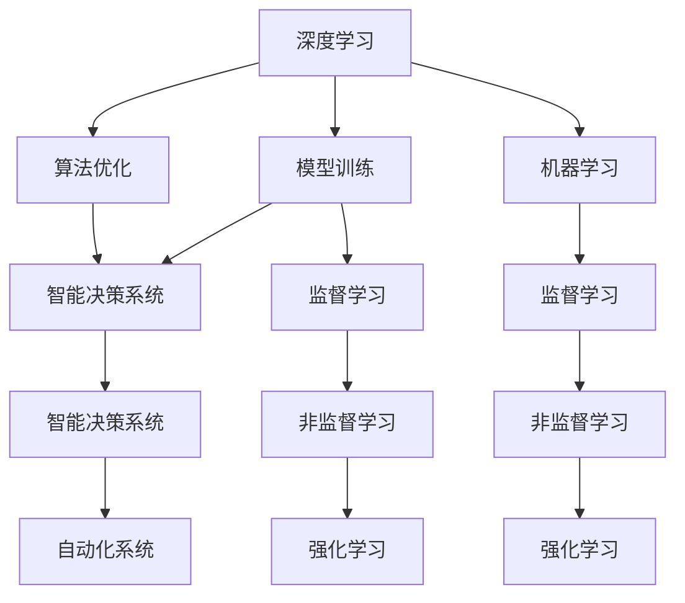

                 

# 构建更智能的世界：人类计算的应用场景

> 关键词：人类计算,应用场景,深度学习,人工智能,机器学习,模型训练,算法优化,智能决策,自动化系统,机器学习模型

## 1. 背景介绍

### 1.1 问题由来
在过去几十年中，人工智能（AI）领域经历了飞速的发展，尤其是在深度学习（Deep Learning）和机器学习（Machine Learning）的推动下，AI技术正在逐渐从实验室走向现实世界的各个角落。然而，尽管AI技术在许多领域已经展现出了令人瞩目的效果，但在实际应用中，仍面临着许多挑战。

随着互联网的普及和数据的爆炸式增长，人类社会正在从传统的以人类为中心的计算模式，转变为以数据和算法为中心的计算模式。这种转变带来了巨大的机遇，但也引发了许多新的问题。例如，如何有效地利用海量的数据资源，如何高效地训练和优化AI模型，如何设计合适的算法来解决复杂的实际问题，以及如何在保证模型性能的同时，确保算法的公平性、透明性和安全性，等等。

### 1.2 问题核心关键点
针对这些问题，本文将从以下几个方面进行探讨：
1. 人类计算的概述及其应用场景。
2. 深度学习算法的基本原理和操作步骤。
3. 人类计算在智能决策系统中的应用。
4. 机器学习模型的训练和优化。
5. 未来人类计算的发展趋势与挑战。

## 2. 核心概念与联系

### 2.1 核心概念概述

为了更好地理解人类计算及其应用场景，本节将介绍几个核心概念：

- 深度学习（Deep Learning）：一种基于人工神经网络的机器学习方法，通过多层次的非线性变换来提取数据特征，广泛应用于计算机视觉、自然语言处理等领域。

- 机器学习（Machine Learning）：一种使计算机从数据中自动学习和改进的算法，包括监督学习、非监督学习和强化学习等。

- 模型训练（Model Training）：利用训练数据，通过优化算法调整模型参数，使其能够更好地拟合数据的过程。

- 算法优化（Algorithm Optimization）：针对特定任务，对机器学习算法进行优化，以达到更好的性能和效率。

- 智能决策系统（Intelligent Decision System）：利用机器学习模型对输入数据进行分析，并做出智能决策的系统，广泛应用于金融、医疗、交通等领域。

这些核心概念之间的逻辑关系可以通过以下Mermaid流程图来展示：



这个流程图展示了大语言模型的核心概念及其之间的关系：

1. 深度学习是机器学习的一种形式，通过多层次的非线性变换，能够从数据中学习到更加丰富的特征表示。
2. 模型训练和算法优化是深度学习过程中必不可少的步骤，通过训练，模型能够学习到数据的分布规律，并通过优化提高性能。
3. 智能决策系统是深度学习在实际应用中的重要应用场景，能够根据输入数据做出决策，从而提高自动化系统的智能化水平。
4. 监督学习、非监督学习和强化学习是机器学习的三大主要形式，通过不同类型的数据和任务，能够训练出适应不同需求的模型。

这些核心概念共同构成了深度学习和机器学习的学习和应用框架，使其能够在各种场景下发挥强大的计算能力。通过理解这些核心概念，我们可以更好地把握人类计算的工作原理和优化方向。

## 3. 核心算法原理 & 具体操作步骤

### 3.1 算法原理概述

深度学习算法的基本原理是通过多层神经网络，对输入数据进行多层次的非线性变换，从而提取数据的特征表示。这些特征表示能够捕捉到数据中的复杂模式和规律，使得模型在处理任务时能够获得更好的性能。

深度学习算法的核心步骤包括数据预处理、模型训练、模型评估和模型优化。其中，数据预处理包括数据的归一化、标准化、特征工程等步骤，以提高模型的训练效率和效果。模型训练通过优化算法（如梯度下降、Adam等）调整模型参数，使其能够更好地拟合数据。模型评估通过测试集对模型进行性能评估，以衡量模型的泛化能力。模型优化通过对模型进行微调或参数共享等方法，进一步提升模型的性能和效率。

### 3.2 算法步骤详解

深度学习算法的具体步骤包括：

1. 数据预处理：将原始数据转换为模型能够处理的格式，包括数据的清洗、归一化、特征提取等。

2. 模型设计：选择合适的深度学习模型架构，如卷积神经网络（CNN）、循环神经网络（RNN）、Transformer等，并定义模型的输入和输出。

3. 模型训练：利用训练数据对模型进行训练，通过反向传播算法计算损失函数，并使用优化算法调整模型参数。

4. 模型评估：在测试数据集上评估模型的性能，计算准确率、召回率、F1-score等指标，以衡量模型的泛化能力。

5. 模型优化：通过参数调整、超参数优化、正则化等方法，进一步提高模型的性能和泛化能力。

6. 模型部署：将训练好的模型部署到实际应用中，进行实时预测或推理。

### 3.3 算法优缺点

深度学习算法具有以下优点：
1. 可以自动从数据中学习到复杂的特征表示，不需要手动设计特征。
2. 具有强大的泛化能力，能够在各种任务上取得优异的性能。
3. 可以处理大规模的、高维度的数据，能够适应大规模的数据分布。

同时，深度学习算法也存在一些缺点：
1. 需要大量的数据和计算资源进行训练，对硬件要求较高。
2. 模型复杂度较高，容易出现过拟合现象。
3. 模型解释性较差，难以理解和调试。

### 3.4 算法应用领域

深度学习算法在多个领域得到了广泛的应用，以下是几个典型的应用场景：

- 计算机视觉：如图像分类、目标检测、图像分割等。
- 自然语言处理：如文本分类、机器翻译、情感分析等。
- 语音识别：如语音识别、语音合成等。
- 推荐系统：如商品推荐、音乐推荐等。
- 医疗影像：如医学图像分析、疾病诊断等。

这些应用场景展示了深度学习算法在实际问题上的强大潜力，为人类计算提供了广阔的应用前景。

## 4. 数学模型和公式 & 详细讲解 & 举例说明

### 4.1 数学模型构建

深度学习算法的核心是神经网络，而神经网络可以表示为图结构，由多个层次组成。每个层次包含多个节点，每个节点表示一个特征向量，通过连接方式实现信息的传递和转换。深度学习模型的数学模型可以表示为：

$$
f(x; \theta) = \sum_{i=1}^m w_i g(h(x; \theta_i))
$$

其中，$x$ 表示输入数据，$\theta$ 表示模型参数，$m$ 表示模型的层次数，$w_i$ 表示每个层次的权重，$g$ 表示非线性激活函数，$h(x; \theta_i)$ 表示每个层次的输出。

### 4.2 公式推导过程

以卷积神经网络（CNN）为例，其数学模型可以表示为：

$$
f(x; \theta) = \sum_{i=1}^m w_i g(h(x; \theta_i))
$$

其中，$x$ 表示输入数据，$\theta$ 表示模型参数，$m$ 表示模型的层次数，$w_i$ 表示每个层次的权重，$g$ 表示非线性激活函数，$h(x; \theta_i)$ 表示每个层次的输出。

### 4.3 案例分析与讲解

以图像分类任务为例，卷积神经网络的数学模型可以表示为：

$$
f(x; \theta) = \sum_{i=1}^m w_i g(h(x; \theta_i))
$$

其中，$x$ 表示输入图像，$\theta$ 表示模型参数，$m$ 表示模型的层次数，$w_i$ 表示每个层次的权重，$g$ 表示非线性激活函数，$h(x; \theta_i)$ 表示每个层次的输出。

在训练过程中，通过反向传播算法计算损失函数，并使用优化算法调整模型参数。以交叉熵损失函数为例，其数学模型可以表示为：

$$
L(y, \hat{y}) = -\frac{1}{N} \sum_{i=1}^N \sum_{j=1}^C y_j \log \hat{y}_j
$$

其中，$y$ 表示真实标签，$\hat{y}$ 表示模型预测标签，$N$ 表示样本数，$C$ 表示类别数。

通过计算损失函数和梯度，使用优化算法调整模型参数，使得模型的预测结果与真实标签尽可能接近。

## 5. 项目实践：代码实例和详细解释说明

### 5.1 开发环境搭建

在进行项目实践前，我们需要准备好开发环境。以下是使用Python进行TensorFlow开发的环境配置流程：

1. 安装Anaconda：从官网下载并安装Anaconda，用于创建独立的Python环境。

2. 创建并激活虚拟环境：
```bash
conda create -n tf-env python=3.8 
conda activate tf-env
```

3. 安装TensorFlow：根据CUDA版本，从官网获取对应的安装命令。例如：
```bash
conda install tensorflow==2.5.0
```

4. 安装其他依赖工具：
```bash
pip install numpy pandas scikit-learn matplotlib tqdm jupyter notebook ipython
```

完成上述步骤后，即可在`tf-env`环境中开始项目实践。

### 5.2 源代码详细实现

下面是使用TensorFlow进行图像分类任务的完整代码实现：

```python
import tensorflow as tf
from tensorflow.keras import datasets, layers, models

# 加载数据集
(train_images, train_labels), (test_images, test_labels) = datasets.cifar10.load_data()

# 数据预处理
train_images = train_images / 255.0
test_images = test_images / 255.0

# 定义模型
model = models.Sequential([
    layers.Conv2D(32, (3, 3), activation='relu', input_shape=(32, 32, 3)),
    layers.MaxPooling2D((2, 2)),
    layers.Conv2D(64, (3, 3), activation='relu'),
    layers.MaxPooling2D((2, 2)),
    layers.Conv2D(64, (3, 3), activation='relu'),
    layers.Flatten(),
    layers.Dense(64, activation='relu'),
    layers.Dense(10)
])

# 编译模型
model.compile(optimizer='adam',
              loss=tf.keras.losses.SparseCategoricalCrossentropy(from_logits=True),
              metrics=['accuracy'])

# 训练模型
model.fit(train_images, train_labels, epochs=10, 
          validation_data=(test_images, test_labels))

# 评估模型
test_loss, test_acc = model.evaluate(test_images, test_labels)
print('Test accuracy:', test_acc)
```

### 5.3 代码解读与分析

让我们再详细解读一下关键代码的实现细节：

**数据预处理**：
- 使用`train_images`和`test_images`加载CIFAR-10数据集中的图像数据。
- 将图像数据归一化到0到1之间，以提高模型的训练效率和效果。

**模型定义**：
- 定义一个卷积神经网络模型，包括多个卷积层、池化层和全连接层。
- 使用`Sequential`模型，将各个层次按照顺序堆叠。

**模型编译**：
- 使用`adam`优化器进行模型训练，`SparseCategoricalCrossentropy`损失函数用于计算多分类任务的损失，`accuracy`评估指标用于评估模型的准确率。

**模型训练**：
- 在训练数据集上对模型进行训练，设置训练轮数为10。
- 使用`validation_data`参数指定验证数据集，以便在每个epoch后评估模型的性能。

**模型评估**：
- 在测试数据集上评估模型的性能，计算测试集上的准确率。

可以看到，TensorFlow提供了非常方便的API，使得深度学习模型的实现变得简洁高效。开发者可以将更多精力放在数据处理、模型改进等高层逻辑上，而不必过多关注底层的实现细节。

## 6. 实际应用场景

### 6.1 智能客服系统

基于深度学习算法的智能客服系统可以广泛应用于各个行业，提高客户服务效率和满意度。传统客服系统依赖人工客服，成本高、效率低，且难以应对大规模的客户咨询需求。智能客服系统通过深度学习算法，可以自动理解客户意图，匹配最合适的回复，提供7x24小时不间断服务，快速响应客户咨询，提升客户体验。

### 6.2 金融舆情监测

金融机构需要实时监测市场舆论动向，以便及时应对负面信息传播，规避金融风险。传统的舆情监测方法依赖人工分析，成本高、效率低，难以应对大规模的信息爆发。基于深度学习算法的舆情监测系统，可以自动监测金融领域的新闻、报道、评论等文本数据，识别出负面信息，及时预警，帮助金融机构快速应对潜在风险。

### 6.3 个性化推荐系统

个性化推荐系统通过深度学习算法，可以推荐用户可能感兴趣的商品、内容等，提升用户体验。传统的推荐系统依赖用户的历史行为数据，难以挖掘用户真正的兴趣偏好。基于深度学习算法的推荐系统可以学习用户行为背后的语义信息，从文本内容中准确把握用户的兴趣点，提供更加个性化和多样化的推荐内容。

### 6.4 未来应用展望

随着深度学习算法的发展，基于人类计算的应用场景将越来越广泛。未来，深度学习算法将在以下几个领域取得更显著的进展：

- 医疗影像分析：深度学习算法可以辅助医生进行疾病诊断和影像分析，提高医疗服务水平。
- 自然语言处理：深度学习算法可以应用于机器翻译、情感分析、文本生成等自然语言处理任务，提升文本处理的智能化水平。
- 语音识别：深度学习算法可以应用于语音识别和语音合成，提升人机交互的智能化水平。
- 自动驾驶：深度学习算法可以应用于自动驾驶、智能交通等领域，提升交通系统的安全性、效率和智能化水平。
- 工业控制：深度学习算法可以应用于工业控制、智能制造等领域，提升生产自动化和智能化水平。

## 7. 工具和资源推荐

### 7.1 学习资源推荐

为了帮助开发者系统掌握深度学习算法的理论基础和实践技巧，这里推荐一些优质的学习资源：

1. 《深度学习》书籍：由Ian Goodfellow、Yoshua Bengio和Aaron Courville共同撰写，全面介绍了深度学习的理论基础和实践技巧，是深度学习领域的经典教材。

2. CS231n《卷积神经网络》课程：斯坦福大学开设的计算机视觉课程，介绍了卷积神经网络的基本原理和应用，是深度学习领域的重要入门课程。

3. 《TensorFlow实战》书籍：由李沐等人共同撰写，全面介绍了TensorFlow的使用方法和实践技巧，是TensorFlow学习的优秀入门教材。

4. 《机器学习实战》书籍：由Peter Harrington撰写，介绍了机器学习算法的实现和应用，是机器学习学习的优秀入门教材。

5. Coursera《深度学习专项课程》：由Andrew Ng主讲，介绍了深度学习的理论和实践，包括卷积神经网络、循环神经网络、深度学习优化等。

通过对这些资源的学习实践，相信你一定能够快速掌握深度学习算法的精髓，并用于解决实际的AI问题。

### 7.2 开发工具推荐

为了提高深度学习算法的开发效率，以下是几款常用的开发工具：

1. TensorFlow：由Google主导开发的深度学习框架，生产部署方便，支持多种模型架构，是深度学习开发的重要工具。

2. PyTorch：由Facebook主导开发的深度学习框架，灵活高效，适合研究应用。

3. Keras：高层次的深度学习API，易于使用，适合初学者和快速原型开发。

4. Jupyter Notebook：交互式笔记本，支持多种编程语言和库，方便开发和交流。

5. Google Colab：谷歌提供的在线Jupyter Notebook环境，免费提供GPU/TPU算力，方便开发和测试。

合理利用这些工具，可以显著提升深度学习算法的开发效率，加快创新迭代的步伐。

### 7.3 相关论文推荐

深度学习算法的发展源于学界的持续研究。以下是几篇奠基性的相关论文，推荐阅读：

1. AlexNet：在ImageNet图像识别竞赛中取得优异的成绩，标志着深度学习在计算机视觉领域的应用。

2. RNN：长短期记忆网络，应用于自然语言处理任务，显著提升了文本序列的建模能力。

3. VGG：卷积神经网络，通过多层卷积和池化层，提升了深度学习算法的特征提取能力。

4. ResNet：残差网络，通过跨层连接，解决了深度学习中的梯度消失问题，提升了网络的深度和宽度。

5. Transformer：基于自注意力机制的神经网络，广泛应用于自然语言处理任务，提升了模型的序列建模能力。

这些论文代表了大语言模型微调技术的发展脉络。通过学习这些前沿成果，可以帮助研究者把握学科前进方向，激发更多的创新灵感。

## 8. 总结：未来发展趋势与挑战

### 8.1 总结

本文对深度学习算法的理论基础和实践技巧进行了全面系统的介绍。首先阐述了深度学习算法在实际应用中的重要性和应用场景。其次，从原理到实践，详细讲解了深度学习算法的数学模型和操作步骤，给出了深度学习算法在图像分类任务中的完整代码实现。同时，本文还探讨了深度学习算法在智能客服、金融舆情监测、个性化推荐等实际应用中的前景和挑战。最后，本文精选了深度学习算法的各类学习资源，力求为读者提供全方位的技术指引。

通过本文的系统梳理，可以看到，深度学习算法正在成为人工智能领域的重要范式，极大地拓展了AI技术的应用边界，催生了更多的落地场景。未来，伴随深度学习算法和机器学习技术的持续演进，相信AI技术必将在更广阔的领域发挥其巨大的潜力，深刻影响人类的生产生活方式。

### 8.2 未来发展趋势

展望未来，深度学习算法将呈现以下几个发展趋势：

1. 模型规模持续增大。随着算力成本的下降和数据规模的扩张，深度学习模型的参数量还将持续增长。超大规模模型蕴含的丰富特征表示，有望支持更加复杂多变的任务。

2. 算法优化和训练技术不断进步。未来的深度学习算法将更加注重模型的优化和训练效率，包括模型压缩、量化加速、自适应学习率等技术，以降低计算资源消耗，提升训练速度。

3. 迁移学习和大模型微调技术发展。深度学习算法将更加注重迁移学习和大模型微调技术，通过预训练和微调，使模型能够更好地适应不同的任务和数据分布。

4. 多模态学习和融合技术发展。未来的深度学习算法将更加注重多模态数据的融合，如图像、语音、文本等多种模态数据的联合建模，提升模型的多任务处理能力。

5. 增强学习与深度学习结合。未来的深度学习算法将更加注重增强学习的结合，通过与游戏、机器人等领域的结合，提升模型的自主决策和适应能力。

以上趋势凸显了深度学习算法的广阔前景。这些方向的探索发展，必将进一步提升深度学习算法的性能和应用范围，为构建更加智能的AI系统铺平道路。

### 8.3 面临的挑战

尽管深度学习算法已经取得了瞩目成就，但在迈向更加智能化、普适化应用的过程中，它仍面临着诸多挑战：

1. 模型过拟合问题。尽管深度学习算法在训练集上表现优异，但在测试集上往往出现过拟合现象。如何提高模型的泛化能力，减少过拟合风险，是未来深度学习算法的重要研究方向。

2. 计算资源消耗高。深度学习算法对计算资源的要求较高，需要高性能的硬件设备和高效的训练算法，以降低计算成本。如何优化深度学习算法的计算效率，是未来深度学习算法的重要挑战。

3. 模型解释性不足。深度学习算法的模型复杂度较高，难以解释其内部工作机制和决策逻辑。如何提高模型的解释性，增强模型的可解释性和可审计性，是未来深度学习算法的重要研究方向。

4. 数据隐私和安全问题。深度学习算法在训练和应用过程中，需要处理大量的敏感数据，如何保护数据隐私和安全，是未来深度学习算法的重要研究方向。

5. 模型公平性和透明性。深度学习算法在训练和应用过程中，容易出现偏见和歧视，如何提高模型的公平性和透明性，是未来深度学习算法的重要研究方向。

这些挑战需要学界和产业界共同努力，通过不断的技术创新和实践探索，才能解决这些难题，推动深度学习算法的发展。

### 8.4 研究展望

面对深度学习算法面临的诸多挑战，未来的研究需要在以下几个方面寻求新的突破：

1. 探索更加高效的模型压缩和量化技术，降低计算资源消耗，提升深度学习算法的计算效率。

2. 研究更加有效的模型优化和训练技术，提高模型的泛化能力和训练速度。

3. 开发更加智能的多模态融合技术，提升深度学习算法的多任务处理能力。

4. 引入增强学习等新的技术方向，提高深度学习算法的自主决策和适应能力。

5. 开发更加公平、透明、安全的深度学习算法，保护数据隐私和安全，提高模型的公平性和透明性。

这些研究方向将推动深度学习算法不断进步，使其能够更好地服务于人类计算和智能决策系统的构建。面向未来，深度学习算法还需要与其他人工智能技术进行更深入的融合，如知识表示、因果推理、强化学习等，多路径协同发力，共同推动深度学习算法的发展。

## 9. 附录：常见问题与解答

**Q1：深度学习算法是否适用于所有AI任务？**

A: 深度学习算法在许多AI任务上已经取得了优异的成绩，但并不适用于所有任务。对于需要高解释性、低计算成本的任务，传统机器学习算法可能更适合。

**Q2：深度学习算法在训练过程中容易出现过拟合现象，如何解决？**

A: 过拟合是深度学习算法常见的问题，可以通过以下方法解决：
1. 数据增强：通过扩充训练集，提高模型的泛化能力。
2. 正则化：使用L2正则、Dropout等方法，减少模型的复杂度。
3. 早停法：在验证集上评估模型的性能，及时停止训练，避免过拟合。
4. 批归一化：在训练过程中对输入数据进行归一化，减少模型的内部协变量转移。

**Q3：深度学习算法在实际应用中需要处理大规模数据，如何提高计算效率？**

A: 深度学习算法可以通过以下方法提高计算效率：
1. 模型压缩：使用量化、剪枝等技术，减少模型的参数量。
2. 模型并行：使用分布式计算、模型并行等技术，提高计算速度。
3. 模型优化：使用自适应学习率、动态网络结构等技术，提高训练效率。

**Q4：深度学习算法的模型复杂度较高，如何提高模型的解释性？**

A: 提高深度学习算法的模型解释性可以从以下几个方面入手：
1. 使用可解释性模型，如线性模型、决策树等。
2. 使用可视化技术，如梯度图、热力图等，帮助理解模型的决策过程。
3. 使用特征重要性排序、可解释性模块等技术，提高模型的解释性。

**Q5：深度学习算法的计算资源消耗较高，如何优化计算资源的使用？**

A: 优化深度学习算法的计算资源使用可以从以下几个方面入手：
1. 使用高效的硬件设备，如GPU、TPU等。
2. 使用模型压缩、量化等技术，减少计算资源消耗。
3. 使用分布式计算、模型并行等技术，提高计算效率。

综上所述，深度学习算法在实际应用中具有巨大的潜力和挑战。通过不断的研究和实践，相信深度学习算法将在更广阔的领域发挥其强大的计算能力，为构建智能化的未来世界做出重要贡献。

---

作者：禅与计算机程序设计艺术 / Zen and the Art of Computer Programming

