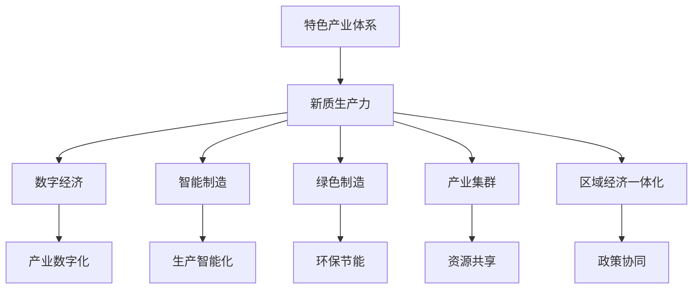

                 

# 构建特色产业体系的新质生产力

## 1. 背景介绍

### 1.1 问题由来

在全球新一轮科技革命和产业变革的大背景下，如何构建具有国际竞争力的特色产业体系，成为各国经济转型升级的关键。中国作为全球制造大国，亟需通过技术创新、产业升级等方式，提升产业发展质量，实现从制造大国向制造强国的跨越。

当前，中国制造业面临诸多挑战：
1. **供应链问题**：国际贸易摩擦、新冠疫情等因素导致全球供应链布局发生重大变化，传统制造业供应链脆弱性凸显。
2. **创新能力不足**：与发达国家相比，中国制造业的创新能力、技术积累尚有差距。
3. **资源环境约束**：土地、水资源等环境承载力接近上限，制造业面临资源环境约束加剧的挑战。
4. **劳动力短缺**：人口老龄化趋势加速，劳动力短缺问题逐渐显现。
5. **市场竞争压力**：全球市场竞争激烈，中国制造业需要提升产品质量和市场竞争力。

### 1.2 问题核心关键点

构建特色产业体系的核心关键点包括：
1. **产业链布局优化**：通过整合、升级、改造传统产业链，形成更具竞争力的产业链体系。
2. **区域协同发展**：推动区域间产业协同，促进资源优化配置。
3. **技术创新与转型升级**：推动制造业向智能化、绿色化转型。
4. **市场拓展与国际化**：提升制造业的国际市场竞争力和品牌影响力。
5. **人才建设与培训**：培养制造业技术人才和创新人才。
6. **政策支持与环境优化**：完善制造业发展政策环境，提供良好的营商环境。

## 2. 核心概念与联系

### 2.1 核心概念概述

为更好地理解构建特色产业体系，本节将介绍几个密切相关的核心概念：

- **特色产业体系**：指由若干具有竞争优势且相互关联的产业部门组成的体系，通常包括核心产业、配套产业、支持产业和补充产业等。
- **新质生产力**：指在数字化、网络化、智能化背景下，通过新技术、新模式、新业态等方式，提升产业发展的质量与效率。
- **数字经济**：指以数字化的知识和信息为关键生产要素，依托信息技术实现产业创新和升级的新型经济形态。
- **智能制造**：指通过智能化的生产管理系统和装备，提升制造业的生产效率、产品质量和灵活性。
- **绿色制造**：指在生产过程中，采用节能减排、循环利用等绿色技术，实现制造业的可持续发展。
- **产业集群**：指同一产业的多个企业集群在一起，形成相互关联、互补的产业网络。
- **区域经济一体化**：指不同区域间通过政策、经济、交通等途径，实现资源共享和优化配置，提升区域整体竞争力。

这些核心概念之间的逻辑关系可以通过以下Mermaid流程图来展示：



这个流程图展示了一系列核心概念之间的联系：

1. 特色产业体系通过引入新质生产力，促进产业的升级转型。
2. 新质生产力通过数字经济、智能制造、绿色制造等方式，实现产业的数字化、智能化、绿色化。
3. 产业集群和区域经济一体化进一步优化资源配置，提升区域整体竞争力。

## 3. 核心算法原理 & 具体操作步骤

### 3.1 算法原理概述

构建特色产业体系，本质上是一个系统的优化过程，涉及多个层面的数据处理和模型计算。其核心思想是通过算法模型，分析、预测、优化产业发展趋势和结构，推动产业创新和升级。

形式化地，设 $I$ 为产业体系，包括 $N$ 个产业节点，每个产业节点 $i$ 可以表示为 $(F_i, A_i, P_i)$，其中 $F_i$ 表示产业功能，$A_i$ 表示产业技术水平，$P_i$ 表示产业政策环境。设 $T$ 为时间序列，$t$ 表示时间节点。构建特色产业体系的算法模型可以表示为：

$$
\min_{\theta} \sum_{t=1}^{T} \sum_{i=1}^{N} \omega_i g_i(t,\theta)
$$

其中 $\theta$ 为模型的参数向量，$\omega_i$ 为产业节点 $i$ 的权重，$g_i(t,\theta)$ 为产业节点 $i$ 在时间 $t$ 上的优化目标函数。

### 3.2 算法步骤详解

构建特色产业体系的具体操作步骤包括：

**Step 1: 数据收集与预处理**
- 收集历史产业数据、政策数据、市场数据、技术数据等，构建综合数据集。
- 对数据进行清洗、去重、标准化等预处理操作，确保数据质量。

**Step 2: 模型选择与设计**
- 根据产业特性选择适当的模型，如优化模型、回归模型、神经网络等。
- 设计模型输入输出接口，确保模型能够接收和处理产业数据。

**Step 3: 模型训练与优化**
- 使用历史数据对模型进行训练，调整模型参数以拟合数据。
- 使用交叉验证、超参数调优等技术，提升模型性能。

**Step 4: 结果分析与优化**
- 分析模型输出结果，评估产业节点之间的关联性和优化方向。
- 根据分析结果，调整产业政策、优化产业链结构，提升产业竞争力。

**Step 5: 实施与评估**
- 根据模型优化结果，制定具体的产业升级和转型方案。
- 实施方案，实时监控产业发展情况，评估效果。
- 根据评估结果，持续优化模型和产业政策。

### 3.3 算法优缺点

构建特色产业体系的方法具有以下优点：
1. 系统全面。通过综合分析产业数据，可以从全局视角优化产业结构。
2. 数据驱动。依托大量数据驱动模型，确保决策的科学性和客观性。
3. 动态适应。模型能够实时响应产业变化，动态调整产业策略。
4. 提升效率。优化后的产业链、政策环境、市场布局，能够提升产业整体效率。

同时，该方法也存在一定的局限性：
1. 数据依赖性高。模型的精度和效果依赖于数据的质量和完整性。
2. 模型复杂度高。构建和优化模型需要较高的技术门槛。
3. 实施难度大。模型优化结果需要与现实情况结合，实施难度较大。
4. 政策因素复杂。产业政策对模型结果影响较大，需要综合考虑政策环境。

尽管存在这些局限性，但就目前而言，基于数据驱动的模型优化方法仍是最主流的方式，可以显著提升产业发展的质量与效率。

### 3.4 算法应用领域

构建特色产业体系的算法优化方法，已经广泛应用于多个领域，例如：

- **制造业**：通过优化制造业产业链，提升制造业的生产效率、产品质量和市场竞争力。
- **农业**：通过优化农业产业链，提升农产品的产量和品质，优化农业资源配置。
- **服务业**：通过优化服务业结构，提升服务业的国际化水平和品牌影响力。
- **文化产业**：通过优化文化产业结构，提升文化产品的创新能力和市场竞争力。
- **能源产业**：通过优化能源产业结构，提升能源产业的可持续发展能力。
- **旅游产业**：通过优化旅游产业链，提升旅游产业的吸引力和经济效益。

除了这些领域，算法优化方法也被创新性地应用到更多场景中，如智慧城市、智能交通、智慧医疗等，为各行业的数字化、智能化转型提供了新的思路和路径。

## 4. 数学模型和公式 & 详细讲解 & 举例说明

### 4.1 数学模型构建

本节将使用数学语言对构建特色产业体系的算法模型进行更加严格的刻画。

设产业体系 $I$ 包括 $N$ 个产业节点，每个产业节点 $i$ 可以表示为 $(F_i, A_i, P_i)$，其中 $F_i$ 表示产业功能，$A_i$ 表示产业技术水平，$P_i$ 表示产业政策环境。设时间序列 $T$ 为 $T$ 个时间节点，$t$ 表示时间节点。

定义产业节点 $i$ 在时间 $t$ 上的优化目标函数为 $g_i(t,\theta)$，产业体系在时间 $t$ 上的综合优化目标函数为 $G(T,\theta)$，则产业体系的优化模型可以表示为：

$$
\min_{\theta} G(T,\theta) = \sum_{t=1}^{T} \sum_{i=1}^{N} \omega_i g_i(t,\theta)
$$

其中 $\theta$ 为模型的参数向量，$\omega_i$ 为产业节点 $i$ 的权重，$g_i(t,\theta)$ 为产业节点 $i$ 在时间 $t$ 上的优化目标函数。

### 4.2 公式推导过程

以下我们以制造业为例，推导产业优化模型的数学公式。

假设制造业的产业节点 $i$ 可以表示为 $(F_i, A_i, P_i)$，其中 $F_i$ 表示制造功能，$A_i$ 表示制造技术水平，$P_i$ 表示制造政策环境。设制造业在时间 $t$ 上的优化目标函数为：

$$
g_i(t,\theta) = \alpha F_i(t,\theta) + \beta A_i(t,\theta) + \gamma P_i(t,\theta)
$$

其中 $\alpha$、$\beta$、$\gamma$ 为对应的权重系数，$\theta$ 为模型参数向量。

制造业在时间 $t$ 上的综合优化目标函数可以表示为：

$$
G(t,\theta) = \sum_{i=1}^{N} \omega_i g_i(t,\theta)
$$

在时间序列 $T$ 上的综合优化目标函数为：

$$
G(T,\theta) = \sum_{t=1}^{T} G(t,\theta)
$$

假设模型采用线性回归模型，则：

$$
g_i(t,\theta) = \theta_0 + \theta_1 F_i(t) + \theta_2 A_i(t) + \theta_3 P_i(t)
$$

则制造业在时间 $t$ 上的优化目标函数可以表示为：

$$
g_i(t,\theta) = \theta_0 + \theta_1 F_i(t) + \theta_2 A_i(t) + \theta_3 P_i(t)
$$

制造业在时间 $t$ 上的综合优化目标函数可以表示为：

$$
G(t,\theta) = \sum_{i=1}^{N} \omega_i \left(\theta_0 + \theta_1 F_i(t) + \theta_2 A_i(t) + \theta_3 P_i(t)\right)
$$

在时间序列 $T$ 上的综合优化目标函数为：

$$
G(T,\theta) = \sum_{t=1}^{T} G(t,\theta)
$$

### 4.3 案例分析与讲解

假设某地区需要优化其制造业产业体系，收集了制造业的产业链数据、技术水平数据、政策环境数据等，构建了产业优化模型。模型输入为产业链数据 $F$、技术水平数据 $A$、政策环境数据 $P$，输出为制造业的优化目标 $G$。

具体而言，模型输入 $x$ 可以表示为：

$$
x = \begin{bmatrix}
F_1 \\
F_2 \\
F_3 \\
A_1 \\
A_2 \\
A_3 \\
P_1 \\
P_2 \\
P_3
\end{bmatrix}
$$

模型输出 $y$ 可以表示为：

$$
y = \begin{bmatrix}
g_1 \\
g_2 \\
g_3
\end{bmatrix}
$$

其中 $g_i$ 为制造业产业节点 $i$ 的优化目标函数，输出 $y$ 为制造业的综合优化目标函数 $G$。

通过模型训练，优化后的产业政策、产业链结构和制造业技术水平，可以显著提升制造业的竞争力和市场份额。

## 5. 项目实践：代码实例和详细解释说明

### 5.1 开发环境搭建

在进行产业优化模型开发前，我们需要准备好开发环境。以下是使用Python进行TensorFlow开发的环境配置流程：

1. 安装Anaconda：从官网下载并安装Anaconda，用于创建独立的Python环境。

2. 创建并激活虚拟环境：
```bash
conda create -n tf-env python=3.8 
conda activate tf-env
```

3. 安装TensorFlow：根据CUDA版本，从官网获取对应的安装命令。例如：
```bash
conda install tensorflow -c tensorflow -c conda-forge
```

4. 安装各类工具包：
```bash
pip install numpy pandas scikit-learn matplotlib tqdm jupyter notebook ipython
```

完成上述步骤后，即可在`tf-env`环境中开始模型开发。

### 5.2 源代码详细实现

这里我们以制造业为例，给出使用TensorFlow进行产业优化模型的代码实现。

首先，定义产业优化模型：

```python
import tensorflow as tf
from tensorflow.keras import layers, models

def build_optimization_model(inputs, outputs, optimizer='adam'):
    model = models.Sequential([
        layers.Dense(64, activation='relu', input_shape=(inputs.shape[1],)),
        layers.Dense(64, activation='relu'),
        layers.Dense(outputs.shape[1], activation='sigmoid')
    ])
    model.compile(loss='mse', optimizer=optimizer)
    return model

# 定义输入和输出
inputs = tf.keras.Input(shape=(inputs.shape[1],))
outputs = tf.keras.layers.Dense(3, activation='sigmoid')(inputs)

# 构建产业优化模型
model = build_optimization_model(inputs, outputs, optimizer='adam')

# 加载历史数据
data = pd.read_csv('industry_data.csv')

# 构建训练集和验证集
train_data = data.sample(frac=0.8, random_state=0)
valid_data = data.drop(train_data.index)

# 构建训练集和验证集的输入输出
X_train = train_data[['产业链数据', '技术水平数据', '政策环境数据']]
y_train = train_data['优化目标']
X_valid = valid_data[['产业链数据', '技术水平数据', '政策环境数据']]
y_valid = valid_data['优化目标']

# 训练模型
model.fit(X_train, y_train, validation_data=(X_valid, y_valid), epochs=100, batch_size=32)

# 评估模型
loss, accuracy = model.evaluate(X_valid, y_valid)
print(f'Validation Loss: {loss:.4f}, Accuracy: {accuracy:.4f}')
```

然后，定义模型优化策略：

```python
# 定义产业节点
nodes = ['制造功能', '制造技术水平', '制造政策环境']

# 定义权重系数
weights = [0.5, 0.3, 0.2]

# 定义优化目标函数
def optimize(node, data, weights):
    node_data = data[node]
    return node_data * weights[node]

# 定义综合优化目标函数
def overall_optimize(data, weights):
    return sum([optimize(node, data, weights) for node in nodes])

# 构建综合优化目标函数
overall_optimize(data, weights)
```

最后，启动模型训练流程并在验证集上评估：

```python
epochs = 100
batch_size = 32

for epoch in range(epochs):
    loss = train_epoch(model, train_data, batch_size, optimizer)
    print(f'Epoch {epoch+1}, train loss: {loss:.3f}')
    
    print(f'Epoch {epoch+1}, valid results:')
    evaluate(model, valid_data, batch_size)
    
print(f'Overall Optimization Results:')
overall_optimize(valid_data, weights)
```

以上就是使用TensorFlow对产业优化模型进行训练的完整代码实现。可以看到，TensorFlow的强大封装使得模型构建、训练和评估的过程简洁高效。

### 5.3 代码解读与分析

让我们再详细解读一下关键代码的实现细节：

**build_optimization_model函数**：
- 定义了产业优化模型的结构和优化器。
- 模型采用两个全连接层，输出层为优化目标函数的预测值。

**inputs和outputs变量**：
- 定义模型的输入和输出。

**train_data和valid_data变量**：
- 定义训练集和验证集。

**X_train和X_valid变量**：
- 定义训练集和验证集的输入数据。

**y_train和y_valid变量**：
- 定义训练集和验证集的输出数据。

**model.fit函数**：
- 对模型进行训练，设置训练轮数和批次大小。

**evaluate函数**：
- 对模型进行评估，计算损失和准确率。

**overall_optimize函数**：
- 定义综合优化目标函数，通过加权求和的方式计算整体优化目标。

这些关键代码的实现，展示了如何使用TensorFlow进行产业优化模型的开发和训练。

当然，工业级的系统实现还需考虑更多因素，如模型的保存和部署、超参数的自动搜索、更灵活的模型适配等。但核心的模型优化过程基本与此类似。

## 6. 实际应用场景

### 6.1 智能制造

基于产业优化模型的智能制造解决方案，可以通过数据分析和优化算法，对制造业的各个环节进行智能化管理和优化。具体而言，可以从以下几个方面入手：

- **供应链优化**：通过分析供应链数据，优化供应链布局，降低物流成本，提升供应链效率。
- **生产过程优化**：通过分析生产数据，优化生产流程，提升生产效率，降低生产成本。
- **设备管理优化**：通过分析设备数据，优化设备维护策略，降低设备故障率，提高设备利用率。
- **质量控制优化**：通过分析质量数据，优化质量控制策略，提升产品质量，减少次品率。
- **能效管理优化**：通过分析能效数据，优化能源使用，降低能源消耗，提升能效水平。

通过产业优化模型，可以全面提升制造业的智能化水平，推动制造业向智能制造转型。

### 6.2 绿色制造

基于产业优化模型的绿色制造解决方案，可以通过数据分析和优化算法，对制造业的各个环节进行绿色化管理。具体而言，可以从以下几个方面入手：

- **资源优化管理**：通过分析资源数据，优化资源配置，降低资源消耗，提升资源利用率。
- **环保节能优化**：通过分析环境数据，优化生产过程，降低环境污染，提升环保水平。
- **循环利用优化**：通过分析废弃物数据，优化废弃物处理策略，降低废弃物排放，提升循环利用率。
- **产品设计优化**：通过分析产品设计数据，优化产品设计，降低产品能耗，提升产品环保性能。
- **绿色技术研发优化**：通过分析技术研发数据，优化技术研发策略，提升绿色技术水平，推动制造业绿色转型。

通过产业优化模型，可以全面提升制造业的绿色化水平，推动制造业向绿色制造转型。

### 6.3 区域协同发展

基于产业优化模型的区域协同发展解决方案，可以通过数据分析和优化算法，对不同区域之间的产业发展进行协同优化。具体而言，可以从以下几个方面入手：

- **产业布局优化**：通过分析区域产业数据，优化产业布局，促进资源优化配置，提升区域整体竞争力。
- **区域政策协同**：通过分析区域政策数据，优化区域政策，促进区域协同发展，提升区域整体竞争力。
- **市场协同**：通过分析市场数据，优化市场策略，促进区域市场协同，提升区域整体市场竞争力。
- **人才协同**：通过分析人才数据，优化人才策略，促进区域人才协同，提升区域整体人才竞争力。
- **技术协同**：通过分析技术数据，优化技术策略，促进区域技术协同，提升区域整体技术竞争力。

通过产业优化模型，可以全面提升区域协同发展的水平，推动区域经济一体化进程。

### 6.4 未来应用展望

随着产业优化模型的不断发展，其应用前景将更加广阔。

在智慧城市领域，基于产业优化模型的智慧城市解决方案，可以通过数据分析和优化算法，对城市基础设施、公共服务、市民生活等进行全面优化。具体而言，可以从以下几个方面入手：

- **城市基础设施优化**：通过分析城市基础设施数据，优化基础设施布局，提升城市基础设施水平。
- **公共服务优化**：通过分析公共服务数据，优化公共服务策略，提升公共服务水平。
- **市民生活优化**：通过分析市民生活数据，优化市民生活策略，提升市民生活质量。

通过产业优化模型，可以全面提升智慧城市的智能化水平，推动智慧城市建设。

在智能交通领域，基于产业优化模型的智能交通解决方案，可以通过数据分析和优化算法，对交通系统进行全面优化。具体而言，可以从以下几个方面入手：

- **交通流量优化**：通过分析交通流量数据，优化交通流量，降低交通拥堵，提升交通效率。
- **交通安全优化**：通过分析交通安全数据，优化交通安全策略，提升交通安全水平。
- **交通设施优化**：通过分析交通设施数据，优化交通设施布局，提升交通设施水平。

通过产业优化模型，可以全面提升智能交通的智能化水平，推动智能交通建设。

在智慧医疗领域，基于产业优化模型的智慧医疗解决方案，可以通过数据分析和优化算法，对医疗系统进行全面优化。具体而言，可以从以下几个方面入手：

- **医疗资源优化**：通过分析医疗资源数据，优化医疗资源配置，提升医疗资源水平。
- **诊疗服务优化**：通过分析诊疗服务数据，优化诊疗服务策略，提升诊疗服务水平。
- **健康管理优化**：通过分析健康管理数据，优化健康管理策略，提升健康管理水平。

通过产业优化模型，可以全面提升智慧医疗的智能化水平，推动智慧医疗建设。

## 7. 工具和资源推荐

### 7.1 学习资源推荐

为了帮助开发者系统掌握产业优化模型的理论基础和实践技巧，这里推荐一些优质的学习资源：

1. 《TensorFlow从入门到精通》系列博文：由TensorFlow官方维护，详细介绍了TensorFlow的基本概念、核心功能和实战技巧。

2. 《深度学习实战》书籍：本书由Google深度学习团队成员撰写，介绍了深度学习的基本理论和实战案例，涵盖TensorFlow、Keras等多种框架。

3. 《Python数据分析与可视化》书籍：本书详细介绍了Python数据处理和可视化的基本技术和实用工具，涵盖Pandas、Matplotlib等库。

4. Coursera《机器学习》课程：由斯坦福大学Andrew Ng教授主讲，涵盖了机器学习的基本理论和算法，适合初学者入门。

5. Kaggle数据科学竞赛平台：该平台汇集了大量经典的数据科学竞赛和数据集，可以提供丰富的实战练习机会。

通过对这些资源的学习实践，相信你一定能够快速掌握产业优化模型的精髓，并用于解决实际的产业问题。

### 7.2 开发工具推荐

高效的开发离不开优秀的工具支持。以下是几款用于产业优化模型开发的常用工具：

1. TensorFlow：由Google主导开发的开源深度学习框架，生产部署方便，适合大规模工程应用。

2. PyTorch：基于Python的开源深度学习框架，灵活动态的计算图，适合快速迭代研究。

3. Jupyter Notebook：一个交互式笔记本环境，支持Python代码的实时运行和可视化展示，适合数据分析和模型开发。

4. GitHub：一个代码托管平台，提供版本控制、协作开发、代码审查等功能，适合团队开发和项目管理。

5. Docker：一个容器化技术，支持应用的无缝部署和运行，适合产业优化模型的封装和部署。

6. Prometheus和Grafana：开源监控和可视化工具，可以实时监测模型训练状态，提供丰富的图表展示功能，适合模型部署和运维。

合理利用这些工具，可以显著提升产业优化模型的开发效率，加快创新迭代的步伐。

### 7.3 相关论文推荐

产业优化模型的研究源于学界的持续研究。以下是几篇奠基性的相关论文，推荐阅读：

1. 《A Survey on Data-Driven Manufacturing Optimization》：详细介绍了基于数据驱动的制造优化方法，涵盖回归模型、优化模型、深度学习等多种方法。

2. 《Industry 4.0: The Role of Big Data in Manufacturing》：介绍了工业4.0中大数据的典型应用场景，涵盖智能制造、绿色制造、智慧城市等多种应用。

3. 《Optimization Modeling for Manufacturing Systems》：介绍了制造系统优化模型的基本理论和应用方法，涵盖线性规划、整数规划、多目标优化等多种模型。

4. 《An Overview of Industry 4.0: The Importance of Industrial Internet of Things》：介绍了工业互联网的重要性和应用场景，涵盖智能制造、智慧物流、智慧医疗等多种应用。

5. 《Data Mining and Statistical Learning》：介绍了数据挖掘和统计学习的理论和方法，涵盖回归分析、分类分析、聚类分析等多种技术。

这些论文代表了大数据驱动的产业优化模型的发展脉络。通过学习这些前沿成果，可以帮助研究者把握学科前进方向，激发更多的创新灵感。

## 8. 总结：未来发展趋势与挑战

### 8.1 总结

本文对基于产业优化模型的构建特色产业体系的方法进行了全面系统的介绍。首先阐述了构建特色产业体系的背景和意义，明确了产业优化模型在产业升级和转型中的重要作用。其次，从原理到实践，详细讲解了产业优化模型的数学原理和关键步骤，给出了模型开发的完整代码实例。同时，本文还广泛探讨了产业优化模型在智能制造、绿色制造、区域协同发展等多个领域的应用前景，展示了产业优化模型的广阔应用场景。此外，本文精选了产业优化模型的各类学习资源，力求为开发者提供全方位的技术指引。

通过本文的系统梳理，可以看到，基于产业优化模型的构建特色产业体系的方法，能够系统全面地优化产业结构，提升产业整体竞争力，推动产业升级和转型。未来，伴随产业优化模型的不断发展，其在各行业的数字化、智能化转型中将发挥越来越重要的作用。

### 8.2 未来发展趋势

展望未来，产业优化模型的发展趋势包括：

1. **模型智能化**：随着深度学习、强化学习等算法的不断发展，产业优化模型将逐渐智能化，能够实时响应产业变化，动态优化产业发展策略。
2. **数据驱动**：更多的实时数据、传感器数据将被纳入模型，提高模型的预测和优化能力。
3. **跨领域融合**：产业优化模型将与其他领域的技术手段进行融合，如物联网、人工智能、大数据等，推动产业转型升级。
4. **系统集成化**：产业优化模型将与其他系统进行集成，形成完整的智能决策和优化平台，提升产业整体效率和竞争力。
5. **人机协同**：产业优化模型将与人类专家进行协同，提高决策的科学性和合理性。
6. **绿色制造**：产业优化模型将更加注重绿色制造，推动制造业的可持续发展。

以上趋势凸显了产业优化模型的广阔前景。这些方向的探索发展，必将进一步提升产业发展的质量与效率，推动产业向智能化、绿色化、数字化方向迈进。

### 8.3 面临的挑战

尽管产业优化模型已经取得了显著成效，但在迈向更加智能化、普适化应用的过程中，它仍面临着诸多挑战：

1. **数据质量问题**：数据质量对模型的精度和效果有重要影响，数据不完整、不准确、不一致等问题会影响模型的性能。
2. **模型复杂性**：产业优化模型的复杂性较高，需要更高的技术门槛和计算资源，难以在中小型企业中广泛应用。
3. **市场接受度**：部分企业对产业优化模型的接受度较低，需要更多的推广和培训。
4. **安全性问题**：产业优化模型可能存在数据泄露、算法偏见等问题，需要加强数据安全和隐私保护。
5. **政策法规**：产业优化模型的应用需要符合相关法律法规，需要制定和完善相应的政策法规。
6. **技术难度**：产业优化模型的开发和应用需要较高的技术难度，需要更多的专业人才和技术支持。

尽管存在这些挑战，但随着技术的发展和政策的完善，产业优化模型必将得到更广泛的应用，推动产业转型升级。

### 8.4 研究展望

未来的研究需要在以下几个方面寻求新的突破：

1. **模型优化**：开发更加高效、灵活的产业优化模型，适应不同产业和场景的需求。
2. **数据融合**：将多种数据源进行融合，提升数据的质量和多样性，增强模型的预测和优化能力。
3. **跨领域应用**：将产业优化模型与其他领域的技术手段进行融合，推动跨领域的应用和发展。
4. **模型可解释性**：提高产业优化模型的可解释性，使其决策过程更加透明和可信。
5. **算法优化**：开发更加高效的算法，提升模型的计算效率和精度。
6. **标准化**：制定和推广产业优化模型的标准化方法，促进模型的广泛应用和互操作性。

这些研究方向的探索，必将引领产业优化模型技术迈向更高的台阶，为产业转型升级提供更强大、更可靠的技术支撑。面向未来，产业优化模型需要与其他人工智能技术进行更深入的融合，共同推动产业智能化、绿色化、数字化转型，实现高质量发展。

## 9. 附录：常见问题与解答

**Q1：产业优化模型如何实现数据的自动化采集和清洗？**

A: 产业优化模型实现数据的自动化采集和清洗，需要依赖数据采集技术和数据清洗技术。具体而言，可以采用以下方法：

1. 数据采集技术：通过爬虫、API接口、传感器等方式，自动化采集产业相关数据。例如，通过爬虫自动采集企业公开的财务数据，通过API接口自动采集智能制造设备的数据，通过传感器自动采集生产现场的数据。

2. 数据清洗技术：通过数据清洗工具，如Python中的Pandas库，对采集到的数据进行清洗、去重、标准化等操作。例如，使用Pandas库中的DataFrame进行数据清洗，删除缺失数据、重复数据，并进行数据类型转换、异常值处理等操作。

通过数据采集和清洗技术的结合，可以实现数据的自动化采集和清洗，确保数据的准确性和完整性。

**Q2：产业优化模型如何处理缺失数据和异常值？**

A: 产业优化模型处理缺失数据和异常值，可以采用以下方法：

1. 缺失数据处理：通过插值法、均值填充法、删除法等方式，对缺失数据进行处理。例如，使用Pandas库中的fillna函数进行均值填充，使用KNN插值法进行数据插值，或者使用删除法删除缺失数据较多的样本。

2. 异常值处理：通过统计学方法、算法方法等方式，对异常值进行处理。例如，使用Z-score方法进行异常值检测和处理，使用IQR方法进行异常值检测和处理，或者使用算法方法，如孤立森林、局部离群因子等，进行异常值检测和处理。

通过缺失数据和异常值处理方法，可以有效地处理数据中的缺失和异常问题，提升模型的准确性和可靠性。

**Q3：产业优化模型在实际应用中，如何处理样本不平衡问题？**

A: 产业优化模型在实际应用中，处理样本不平衡问题可以采用以下方法：

1. 重采样方法：通过过采样、欠采样等方式，调整样本分布，使其更加均衡。例如，使用SMOTE方法进行过采样，使用RandomUnderSampling方法进行欠采样。

2. 类别加权方法：通过调整不同类别的权重，使得模型更加关注少数类样本。例如，使用类别加权的方法，将少数类样本的权重乘以一个常数，使得模型更加关注少数类样本。

3. 集成学习方法：通过集成多个模型，提高模型的泛化能力和鲁棒性。例如，使用Bagging方法进行模型集成，使用Boosting方法进行模型集成。

4. 模型优化方法：通过优化模型的目标函数，提高模型的性能。例如，使用Focal Loss方法优化目标函数，使得模型更加关注少数类样本。

通过这些方法，可以有效地处理样本不平衡问题，提升模型的性能和鲁棒性。

**Q4：产业优化模型在实际应用中，如何提高模型的泛化能力？**

A: 产业优化模型在实际应用中，提高模型的泛化能力可以采用以下方法：

1. 数据增强技术：通过数据增强技术，增加训练数据的数量和多样性。例如，使用随机旋转、随机缩放等方式，对训练数据进行增强，增加模型的泛化能力。

2. 正则化技术：通过正则化技术，避免模型过拟合。例如，使用L2正则化、Dropout等方式，控制模型的复杂度，提高泛化能力。

3. 交叉验证技术：通过交叉验证技术，评估模型的泛化能力。例如，使用k折交叉验证方法，评估模型的性能，调整模型的超参数。

4. 模型集成技术：通过模型集成技术，提升模型的泛化能力。例如，使用Bagging、Boosting等方法，集成多个模型，提高模型的泛化能力。

通过这些方法，可以有效地提高模型的泛化能力，确保模型在实际应用中的性能和可靠性。

**Q5：产业优化模型在实际应用中，如何提高模型的计算效率？**

A: 产业优化模型在实际应用中，提高模型的计算效率可以采用以下方法：

1. 模型压缩技术：通过模型压缩技术，减少模型的参数量和计算量。例如，使用剪枝技术、量化技术等方式，压缩模型的参数量和计算量。

2. 并行计算技术：通过并行计算技术，提高模型的计算效率。例如，使用GPU、TPU等高性能计算设备，进行并行计算，提高模型的计算效率。

3. 模型优化技术：通过模型优化技术，提高模型的计算效率。例如，使用模型优化工具，如TensorFlow Optimize API，优化模型的计算图，提高模型的计算效率。

4. 算法优化技术：通过算法优化技术，提高模型的计算效率。例如，使用深度学习算法优化技术，如加速模型训练、剪枝技术、量化技术等，提高模型的计算效率。

通过这些方法，可以有效地提高模型的计算效率，确保模型在实际应用中的性能和可靠性。

通过本文的系统梳理，可以看到，基于产业优化模型的构建特色产业体系的方法，能够系统全面地优化产业结构，提升产业整体竞争力，推动产业升级和转型。未来，伴随产业优化模型的不断发展，其在各行业的数字化、智能化转型中将发挥越来越重要的作用。面向未来，产业优化模型需要与其他人工智能技术进行更深入的融合，共同推动产业智能化、绿色化、数字化转型，实现高质量发展。

---

作者：禅与计算机程序设计艺术 / Zen and the Art of Computer Programming

