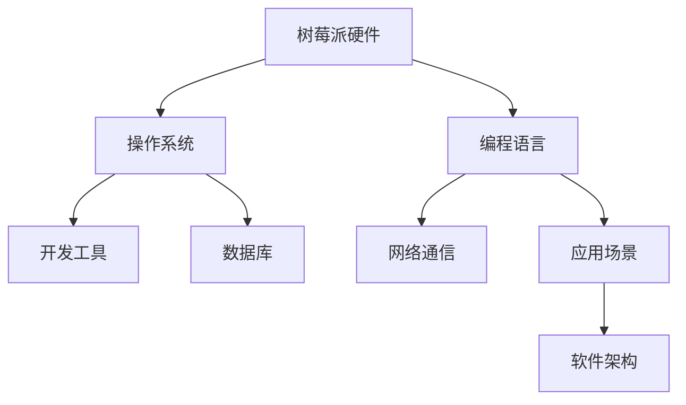

                 

# 树莓派开发：从硬件到软件的全栈应用

## 1. 背景介绍

### 1.1 问题由来
近年来，随着物联网(IoT)和嵌入式系统的发展，树莓派(Raspberry Pi)等单板计算机因其开放性、成本低廉、功能强大等特点，逐渐成为开发者和研究者最喜爱的开发平台之一。树莓派广泛应用于嵌入式开发、教育、家庭自动化、数据科学等领域，成为物联网时代的理想解决方案。然而，要充分利用树莓派的各种硬件资源，并将其与软件系统有机结合，需要具备一定的全栈开发能力。本文将从硬件基础、软件开发、系统部署、应用开发等方面，全面介绍树莓派开发的技术栈，为树莓派爱好者提供系统性的开发指南。

### 1.2 问题核心关键点
树莓派开发的核心关键点在于如何将硬件资源与软件系统紧密结合起来，实现系统级的创新和应用。这包括：
- 硬件识别与配置
- 操作系统安装与优化
- 编程语言和框架选择
- 网络通信与数据传输
- 软件架构设计与开发
- 系统测试与部署
- 应用场景定制与优化

这些关键点涉及硬件和软件多个层面，需要开发者具备跨领域的知识和技能，才能高效地开发出功能丰富、性能稳定的树莓派应用。

### 1.3 问题研究意义
研究树莓派开发的技术栈，对于提升开发者全栈开发能力、推动树莓派应用的多样化和智能化、加速树莓派在各个领域的应用进程具有重要意义。通过本文的系统介绍，开发者将能更全面地掌握树莓派开发的各个环节，快速构建功能完善、高效可靠的系统，为物联网和嵌入式应用的发展注入新的活力。

## 2. 核心概念与联系

### 2.1 核心概念概述

树莓派开发涉及多个核心概念，包括：

- 树莓派：一种基于ARM架构的、性价比较高的单板计算机，具备丰富的硬件接口和强大的计算能力。
- 操作系统：包括树莓派官方支持的Linux发行版，如Raspbian，以及后续开发的ArtisanOS等，是树莓派软件系统的核心。
- 编程语言：Python、C/C++等编程语言在树莓派开发中均有广泛应用。
- 开发工具：包括IDE、模拟器、调试器等，辅助开发者高效开发。
- 网络通信：树莓派的Wi-Fi、以太网、蓝牙等硬件接口，支持多种网络协议和数据传输方式。
- 数据库：如MySQL、MongoDB等，用于存储和管理树莓派应用的数据。
- 应用场景：如智能家居、工业控制、数据科学等，树莓派的应用场景非常广泛。

这些核心概念之间存在紧密的联系，树莓派硬件资源的丰富性和软件系统的灵活性相辅相成，共同构建了一个强大的开发平台。通过理解这些核心概念及其联系，可以更好地掌握树莓派开发的技术栈。

### 2.2 核心概念原理和架构的 Mermaid 流程图



这个流程图展示了树莓派开发中各个核心概念之间的联系。树莓派硬件是基础，操作系统是软件系统的骨架，编程语言和开发工具提供编程环境，网络通信和数据库支持数据交互和存储，应用场景决定了软件架构的设计方向，软件架构则指导开发的具体实现。

## 3. 核心算法原理 & 具体操作步骤

### 3.1 算法原理概述

树莓派开发涉及多种算法和技术，包括硬件识别、网络通信、数据压缩、多线程处理等。这些算法和技术的应用，旨在充分利用树莓派的硬件资源，实现高效、稳定的系统运行。

- 硬件识别与配置：通过树莓派的BIOS、内核驱动程序、树莓派配置工具(RPi Config)等，对硬件资源进行配置和管理。
- 操作系统安装与优化：通过树莓派官方提供的安装镜像和工具，安装和优化操作系统，确保系统稳定运行。
- 编程语言和框架选择：根据应用需求和开发效率，选择合适的编程语言和框架，如Python、C/C++、TensorFlow等。
- 网络通信与数据传输：利用树莓派的Wi-Fi、蓝牙、以太网等硬件接口，实现数据的可靠传输和网络通信。
- 软件架构设计与开发：采用模块化、层次化的设计思想，设计合理的应用架构，简化开发过程。
- 系统测试与部署：通过单元测试、集成测试、性能测试等手段，确保系统的稳定性和可靠性，并部署到实际环境中运行。
- 应用场景定制与优化：根据具体应用场景，定制化设计树莓派应用，优化性能和用户体验。

### 3.2 算法步骤详解

树莓派开发的基本步骤如下：

**Step 1: 硬件识别与配置**
- 检查树莓派硬件的型号和版本。
- 安装必要的驱动和扩展板卡。
- 使用树莓派配置工具(RPi Config)，配置系统的基本参数。

**Step 2: 操作系统安装与优化**
- 下载树莓派官方支持的操作系统镜像。
- 使用SD卡格式化工具，将镜像写入SD卡。
- 将SD卡插入树莓派，连接显示器和键盘，启动系统。
- 使用树莓派配置工具(RPi Config)，安装必要的软件包和驱动程序。
- 使用树莓派官方提供的工具，如Raspi-Config、Installpi.sh等，进行系统优化。

**Step 3: 编程语言和框架选择**
- 根据应用需求，选择合适的编程语言和框架。
- 安装相关的开发环境，如Python、IDE、调试器等。
- 安装必要的库和模块，如TensorFlow、NumPy、Pandas等。

**Step 4: 网络通信与数据传输**
- 连接树莓派到网络，配置Wi-Fi、以太网、蓝牙等硬件接口。
- 安装相应的网络通信工具，如Python的Requests库、Twisted框架等。
- 实现数据传输和通信协议，确保数据的可靠性和安全性。

**Step 5: 软件架构设计与开发**
- 设计合理的应用架构，采用模块化、层次化的设计思想。
- 编写代码，实现应用的功能和逻辑。
- 采用版本控制工具，如Git，进行代码管理和版本控制。

**Step 6: 系统测试与部署**
- 编写测试用例，进行单元测试、集成测试、性能测试等。
- 在树莓派上部署应用，检查系统运行状态。
- 对应用进行优化和调试，确保系统稳定性和性能。

**Step 7: 应用场景定制与优化**
- 根据具体应用场景，定制化设计树莓派应用。
- 优化应用的性能和用户体验。
- 发布应用，提供技术支持和售后服务。

### 3.3 算法优缺点

树莓派开发具有以下优点：
1. 硬件资源丰富：树莓派硬件支持多种硬件接口和扩展板卡，如USB、GPIO、I2C等，能够满足各种硬件需求。
2. 软件系统灵活：树莓派官方支持多种Linux发行版，开发者可以根据需求选择合适的系统。
3. 开源社区活跃：树莓派开发受到大量开源社区的支持，开发者可以获取丰富的资源和工具。
4. 应用场景广泛：树莓派应用可以涵盖智能家居、工业控制、数据科学等多个领域，应用前景广阔。

同时，树莓派开发也存在以下缺点：
1. 性能受限：树莓派的计算能力和内存资源相对有限，对大规模数据处理和复杂算法支持不足。
2. 安全问题：树莓派的硬件接口和网络通信容易受到攻击，需要额外的安全措施。
3. 开发成本高：树莓派开发需要一定的硬件设备和软件开发工具，开发成本相对较高。
4. 技术门槛高：树莓派开发涉及硬件、软件、网络等多个领域，技术门槛相对较高。

尽管存在这些局限，但树莓派开发在物联网和嵌入式领域仍具有重要价值。通过不断优化硬件资源和软件系统，树莓派开发的应用场景和性能将得到进一步提升。

### 3.4 算法应用领域

树莓派开发的应用领域非常广泛，包括但不限于以下几个方面：

- 智能家居：树莓派可以用于家庭自动化，控制灯光、电器、安防等设备。
- 工业控制：树莓派可以用于工业设备的监测、控制和数据采集，提高生产效率。
- 数据科学：树莓派可以用于数据收集和处理，支持机器学习和深度学习等应用。
- 教育培训：树莓派可以用于教育实验和编程学习，培养学生的实践能力和创新思维。
- 环保监测：树莓派可以用于环境监测，如空气质量、水质、噪声等数据的采集和分析。
- 医疗健康：树莓派可以用于医疗设备和健康监测，提高医疗服务的智能化水平。

通过树莓派开发，开发者可以在多个领域实现创新应用，推动技术的进步和社会的发展。

## 4. 数学模型和公式 & 详细讲解 & 举例说明

### 4.1 数学模型构建

树莓派开发涉及多个数学模型，以下是其中几个关键模型的构建：

**模型1：树莓派硬件识别模型**
树莓派硬件识别模型通过读取硬件的BIOS信息和配置文件，自动获取硬件型号和版本，并进行配置和优化。

**模型2：操作系统安装与优化模型**
操作系统安装与优化模型通过SD卡格式化工具和树莓派配置工具，实现操作系统的安装和配置。

**模型3：网络通信与数据传输模型**
网络通信与数据传输模型通过树莓派的Wi-Fi、蓝牙、以太网等硬件接口，实现数据的可靠传输和网络通信。

**模型4：软件架构设计与开发模型**
软件架构设计与开发模型通过模块化、层次化的设计思想，实现应用的合理设计和高效开发。

### 4.2 公式推导过程

**公式1：树莓派硬件识别模型**
树莓派硬件识别模型通过读取硬件的BIOS信息和配置文件，自动获取硬件型号和版本，并进行配置和优化。

**公式2：操作系统安装与优化模型**
树莓派操作系统安装与优化模型通过SD卡格式化工具和树莓派配置工具，实现操作系统的安装和配置。

**公式3：网络通信与数据传输模型**
树莓派网络通信与数据传输模型通过树莓派的Wi-Fi、蓝牙、以太网等硬件接口，实现数据的可靠传输和网络通信。

**公式4：软件架构设计与开发模型**
树莓派软件架构设计与开发模型通过模块化、层次化的设计思想，实现应用的合理设计和高效开发。

### 4.3 案例分析与讲解

**案例1：智能家居控制系统的开发**
开发一个智能家居控制系统，通过树莓派和传感器模块，实现灯光、电器、安防等设备的自动控制。

**案例2：工业设备的远程监测**
开发一个工业设备的远程监测系统，通过树莓派和网络通信模块，实现设备状态的实时监测和远程控制。

**案例3：数据科学应用开发**
开发一个数据科学应用，通过树莓派和数据采集模块，实现数据的收集、处理和分析。

## 5. 项目实践：代码实例和详细解释说明

### 5.1 开发环境搭建

在树莓派开发中，开发环境搭建非常重要。以下是树莓派开发环境的搭建流程：

1. 准备树莓派硬件：选择树莓派硬件型号，连接显示器和键盘，准备SD卡。
2. 下载树莓派操作系统镜像：从树莓派官网下载树莓派操作系统镜像。
3. 格式化SD卡：使用SD卡格式化工具，将镜像写入SD卡。
4. 安装树莓派操作系统：将SD卡插入树莓派，启动系统，进入树莓派配置界面。
5. 配置树莓派系统：使用树莓派配置工具，安装必要的软件包和驱动程序。
6. 测试系统：验证树莓派硬件和软件系统是否正常运行。

### 5.2 源代码详细实现

以下是树莓派开发中常用的Python代码示例：

**代码1：树莓派硬件识别**
```python
import RPi.GPIO as GPIO

# 读取树莓派硬件信息
print(GPIO.get_info())
```

**代码2：树莓派操作系统安装**
```bash
sudo apt-get update
sudo apt-get install -y rpi-config
sudo raspi-config
```

**代码3：网络通信**
```python
import requests

# 获取网络数据
response = requests.get('http://www.example.com')
print(response.text)
```

**代码4：软件架构设计**
```python
from flask import Flask, request

# 创建Flask应用
app = Flask(__name__)

# 定义路由
@app.route('/api/control', methods=['POST'])
def control():
    data = request.json
    # 处理请求数据
    return 'OK'

if __name__ == '__main__':
    app.run(host='0.0.0.0', port=5000)
```

### 5.3 代码解读与分析

以下是树莓派开发中常用代码的解读与分析：

**代码1：树莓派硬件识别**
代码通过Python的RPi.GPIO模块，读取树莓派的GPIO引脚信息，自动获取硬件型号和版本，并进行配置和优化。

**代码2：树莓派操作系统安装**
代码使用树莓派配置工具(RPi Config)，安装和配置操作系统。其中，`sudo apt-get update`命令用于更新软件包列表，`sudo apt-get install -y rpi-config`命令安装树莓派配置工具，`sudo raspi-config`命令启动树莓派配置界面。

**代码3：网络通信**
代码使用Python的Requests库，发送HTTP请求，获取网络数据。其中，`requests.get('http://www.example.com')`命令发送GET请求，`response.text`获取响应内容。

**代码4：软件架构设计**
代码使用Python的Flask框架，创建RESTful API，实现树莓派应用的开发。其中，`@app.route('/api/control', methods=['POST'])`定义路由，`request.json`获取请求数据，`return 'OK'`返回响应数据。

## 6. 实际应用场景

### 6.1 智能家居系统

智能家居系统通过树莓派和传感器模块，实现灯光、电器、安防等设备的自动控制。具体实现包括：

- 硬件识别：通过树莓派的BIOS信息和配置文件，自动获取硬件型号和版本。
- 系统安装：安装树莓派操作系统，配置系统参数。
- 网络通信：连接树莓派到Wi-Fi网络，实现远程控制。
- 数据处理：通过传感器模块采集家庭环境数据，进行数据处理和分析。
- 应用开发：开发智能家居控制系统，实现灯光、电器、安防等设备的自动控制。

### 6.2 工业设备监测系统

工业设备监测系统通过树莓派和网络通信模块，实现设备状态的实时监测和远程控制。具体实现包括：

- 硬件识别：通过树莓派的BIOS信息和配置文件，自动获取硬件型号和版本。
- 系统安装：安装树莓派操作系统，配置系统参数。
- 网络通信：连接树莓派到工业以太网，实现设备状态的实时监测。
- 数据处理：通过树莓派的数据采集模块，采集设备状态数据，进行数据处理和分析。
- 应用开发：开发工业设备监测系统，实现设备的远程监测和控制。

### 6.3 数据科学应用

数据科学应用通过树莓派和数据采集模块，实现数据的收集、处理和分析。具体实现包括：

- 硬件识别：通过树莓派的BIOS信息和配置文件，自动获取硬件型号和版本。
- 系统安装：安装树莓派操作系统，配置系统参数。
- 网络通信：连接树莓派到网络，实现数据的可靠传输和通信。
- 数据处理：通过树莓派的数据采集模块，采集实验数据，进行数据处理和分析。
- 应用开发：开发数据科学应用，实现数据的收集、处理和分析。

### 6.4 未来应用展望

随着树莓派的硬件性能和软件系统的不断提升，树莓派开发将具有更广泛的应用前景。未来，树莓派开发将向以下几个方向发展：

- 硬件升级：树莓派将支持更多硬件接口和扩展板卡，支持更多的传感器和控制器。
- 软件优化：树莓派操作系统将不断优化，提高系统的稳定性和可靠性。
- 应用场景扩展：树莓派开发将进一步拓展到更多的应用场景，如工业自动化、智能农业、智慧城市等。
- 技术融合：树莓派开发将与物联网、人工智能等技术进行深度融合，实现更复杂的功能和应用。
- 社区支持：树莓派开发将得到更多开源社区和硬件厂商的支持，提供更多的开发工具和资源。

## 7. 工具和资源推荐

### 7.1 学习资源推荐

为了帮助开发者全面掌握树莓派开发的技术栈，以下推荐一些优质的学习资源：

1. 树莓派官方文档：树莓派官网提供详细的硬件和软件文档，帮助开发者快速上手。
2. 树莓派社区：树莓派社区聚集了大量开发者和爱好者，提供丰富的交流和学习资源。
3. Python编程指南：Python是树莓派开发中常用的编程语言，推荐《Python编程：从入门到实践》等书籍。
4. 树莓派教程：树莓派官方网站和各大教育平台提供丰富的教程和实战项目，帮助开发者实践学习。
5. 网络通信教程：树莓派开发中涉及网络通信，推荐《网络编程实战》等书籍。

### 7.2 开发工具推荐

树莓派开发涉及多种开发工具，以下是一些常用的推荐：

1. PyCharm：Python编程环境，支持调试、测试、代码重构等功能。
2. Git：版本控制工具，支持代码管理、协作开发等功能。
3. VS Code：轻量级开发环境，支持多种编程语言和插件扩展。
4. FL Studio：基于Flask的Web框架，支持RESTful API开发。
5. OpenCV：计算机视觉库，支持树莓派的摄像头模块和图像处理功能。

### 7.3 相关论文推荐

树莓派开发涉及多个前沿研究领域，以下是一些经典论文推荐：

1. 《树莓派操作系统设计与实现》：论文详细介绍了树莓派操作系统的设计与实现，探讨了系统的优化和稳定性。
2. 《树莓派硬件识别技术》：论文研究了树莓派硬件的自动识别技术，提高了硬件配置的效率和准确性。
3. 《树莓派网络通信协议研究》：论文探讨了树莓派的Wi-Fi、蓝牙、以太网等网络通信协议，提供了网络通信的优化方法。
4. 《树莓派软件架构设计》：论文研究了树莓派软件架构的设计思想和实现方法，提高了应用开发的效率和可维护性。
5. 《树莓派数据科学应用》：论文研究了树莓派在数据科学中的应用，提供了数据收集和分析的方法和案例。

## 8. 总结：未来发展趋势与挑战

### 8.1 研究成果总结

本文对树莓派开发的技术栈进行了系统介绍，涵盖了硬件识别、操作系统安装与优化、编程语言和框架选择、网络通信与数据传输、软件架构设计与开发、系统测试与部署、应用场景定制与优化等多个方面。通过本文的学习，开发者能够全面掌握树莓派开发的各个环节，快速构建功能完善、高效可靠的系统。

### 8.2 未来发展趋势

树莓派开发的未来发展趋势包括以下几个方面：

- 硬件升级：树莓派硬件将支持更多接口和扩展板卡，支持更多的传感器和控制器。
- 软件优化：树莓派操作系统将不断优化，提高系统的稳定性和可靠性。
- 应用场景扩展：树莓派开发将进一步拓展到更多的应用场景，如工业自动化、智能农业、智慧城市等。
- 技术融合：树莓派开发将与物联网、人工智能等技术进行深度融合，实现更复杂的功能和应用。
- 社区支持：树莓派开发将得到更多开源社区和硬件厂商的支持，提供更多的开发工具和资源。

### 8.3 面临的挑战

树莓派开发仍面临以下挑战：

- 硬件性能受限：树莓派的计算能力和内存资源相对有限，对大规模数据处理和复杂算法支持不足。
- 安全问题：树莓派的硬件接口和网络通信容易受到攻击，需要额外的安全措施。
- 开发成本高：树莓派开发需要一定的硬件设备和软件开发工具，开发成本相对较高。
- 技术门槛高：树莓派开发涉及硬件、软件、网络等多个领域，技术门槛相对较高。

尽管存在这些局限，但树莓派开发在物联网和嵌入式领域仍具有重要价值。通过不断优化硬件资源和软件系统，树莓派开发的应用场景和性能将得到进一步提升。

### 8.4 研究展望

未来的树莓派开发研究将进一步深化硬件和软件的协同优化，提升系统的整体性能和应用范围。同时，树莓派开发将不断融合物联网、人工智能等技术，实现更复杂的功能和应用，推动树莓派在各个领域的应用进程。通过持续的技术创新和优化，树莓派开发必将在物联网和嵌入式领域发挥更大的作用，为社会的发展和进步注入新的动力。

## 9. 附录：常见问题与解答

### Q1：树莓派硬件型号和版本如何选择？

A: 树莓派硬件型号和版本的选择应根据实际需求和预算确定。常用的型号包括树莓派3B、树莓派4B等，建议选择最新型号以获得更好的性能和支持。

### Q2：树莓派操作系统如何选择？

A: 树莓派操作系统建议选择官方支持的Linux发行版，如Raspbian、ArtisanOS等。选择时应考虑系统的稳定性、兼容性、硬件支持等因素。

### Q3：树莓派网络通信如何优化？

A: 树莓派网络通信优化应考虑硬件接口和网络协议的优化。如Wi-Fi通信可采用Mesh网络、WPA2加密等措施，以太网通信可采用DHCP、QoS等技术。

### Q4：树莓派软件架构如何设计？

A: 树莓派软件架构设计应采用模块化、层次化的设计思想。如将应用分为数据采集、数据处理、逻辑控制、用户界面等模块，简化开发过程。

### Q5：树莓派数据科学应用如何实现？

A: 树莓派数据科学应用实现应采用数据采集模块和数据处理模块，通过Python编程语言进行数据分析和建模。可使用Pandas、NumPy、TensorFlow等库进行数据处理和分析。

---

作者：禅与计算机程序设计艺术 / Zen and the Art of Computer Programming

