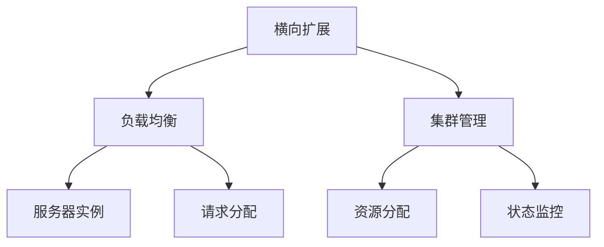

                 

## 1. 背景介绍

在大数据时代，企业的业务系统面临着指数级的增长，这不仅带来了数据量的激增，也带来了对系统性能、可伸缩性和稳定性等要求的不断提高。为了满足这些需求，企业通常采用两种常见的扩展方式：横向扩展和纵向扩展。

横向扩展指的是通过增加更多的服务器节点或实例，来分担原有的请求处理压力，从而提高系统的并发处理能力和整体性能。这种方式通常适用于处理非状态化的请求，如读取数据、处理搜索查询等。横向扩展的优点在于可以线性地增加处理能力，成本相对较低。缺点是对于大规模数据处理，横向扩展的效率和成本都可能成为瓶颈。

纵向扩展指的是通过增加单台服务器的资源，如CPU、内存、存储等，来提升单个节点的处理能力。这种方式通常适用于处理复杂计算、大数据处理等需要高计算资源的任务。纵向扩展的优点在于可以显著提升单个节点的性能，适合处理复杂计算任务。缺点是扩展成本较高，且存在单点故障的风险。

在实际应用中，企业往往需要根据具体的业务需求和技术架构，综合采用横向扩展和纵向扩展的策略，以实现最优的性能和成本效益。本文将重点介绍这两种扩展方式在实际应用中的具体实现方法和案例。

## 2. 核心概念与联系

### 2.1 核心概念概述

为了更好地理解横向扩展和纵向扩展的原理和应用，首先需要明确几个核心概念：

- 横向扩展（Horizontal Scaling）：通过增加更多的服务器节点或实例，分散请求处理负载，提升系统的并发处理能力。
- 纵向扩展（Vertical Scaling）：通过增加单台服务器的计算资源，提升单个节点的处理能力。
- 负载均衡（Load Balancing）：将请求分配到多个服务器节点上，以平衡系统负载，提高系统的整体性能和可用性。
- 集群管理（Cluster Management）：管理多个服务器节点的状态和资源分配，确保系统的稳定性和高可用性。

这些概念之间存在密切的联系，共同构成了系统的扩展和优化框架。下图展示了这些概念之间的逻辑关系：



## 3. 核心算法原理 & 具体操作步骤

### 3.1 算法原理概述

横向扩展和纵向扩展的基本原理都是从提高系统性能和可伸缩性角度出发，通过增加计算资源来提升系统的处理能力。

横向扩展的原理是通过增加更多的服务器节点，将请求分发到多个节点上处理，从而提高系统的并发处理能力。这要求系统具备良好的负载均衡能力，能够动态调整请求分配策略，确保每个节点处理的能力均衡。

纵向扩展的原理是通过增加单台服务器的计算资源，提升单个节点的处理能力。这要求系统具备良好的资源分配和监控能力，能够动态调整资源分配策略，确保资源得到最优利用。

### 3.2 算法步骤详解

#### 横向扩展

1. **负载均衡**：通过负载均衡器将请求分发到多个服务器节点上，确保每个节点处理的能力均衡。
2. **集群管理**：使用容器化技术（如Docker、Kubernetes）管理多个服务器节点的状态和资源分配，确保系统的稳定性和高可用性。
3. **自动扩展**：根据系统的负载情况，动态调整服务器节点的数量，确保系统的高性能和高可用性。
4. **负载均衡算法**：选择合适的负载均衡算法（如轮询、加权轮询、IP Hash等），根据请求特性分配请求。

#### 纵向扩展

1. **资源监控**：使用资源监控工具（如Prometheus、Grafana）监控服务器的资源使用情况，确保系统资源的充分利用。
2. **资源分配**：根据资源监控结果，动态调整服务器的计算资源分配，如CPU、内存、存储等。
3. **自动扩展**：根据系统的负载情况，动态调整单个服务器的计算资源，确保系统的高性能和高可用性。
4. **资源优化**：选择合适的资源优化策略（如缓存、内存交换、IO调度等），提升服务器的资源利用率。

### 3.3 算法优缺点

#### 横向扩展的优点：
- 线性扩展，成本相对较低。
- 易于实现，可以支持大规模并发请求。
- 单点故障风险较低。

#### 横向扩展的缺点：
- 增加服务器节点需要额外的网络带宽和连接，可能影响系统的响应速度。
- 对于需要高计算资源的任务，横向扩展的效率和成本都可能成为瓶颈。

#### 纵向扩展的优点：
- 单个节点的计算资源增加，可以显著提升系统的处理能力。
- 适合处理需要高计算资源的任务，如复杂计算、大数据处理等。

#### 纵向扩展的缺点：
- 扩展成本较高，需要购买高性能硬件和软件资源。
- 存在单点故障风险，单个节点的故障可能影响整个系统的可用性。

### 3.4 算法应用领域

横向扩展和纵向扩展的应用领域非常广泛，涵盖了从互联网应用到企业内部系统，从高并发应用到高计算资源需求的各种场景。

- **互联网应用**：如电子商务平台、社交网络、在线视频等，需要处理大规模并发请求，通常采用横向扩展。
- **企业内部系统**：如ERP、CRM、OA等，需要处理复杂计算任务和大数据处理，通常采用纵向扩展。
- **大数据处理**：如数据仓库、大数据分析、机器学习等，需要处理海量数据，通常采用横向扩展。
- **高并发应用**：如在线游戏、即时通讯、支付系统等，需要处理大规模并发请求，通常采用横向扩展。

## 4. 数学模型和公式 & 详细讲解 & 举例说明

### 4.1 数学模型构建

为了更好地理解横向扩展和纵向扩展的原理和实现方法，我们可以使用数学模型来描述这两种扩展方式。

设系统的请求率为 $R$，单个服务器的处理能力为 $P$，扩展前的服务器数量为 $N$，扩展后的服务器数量为 $M$。

横向扩展的数学模型为：

$$
\text{新请求率} = \frac{R}{N} \times M
$$

纵向扩展的数学模型为：

$$
\text{新请求处理能力} = \frac{P}{N} \times M
$$

### 4.2 公式推导过程

假设系统的请求率为 $R$，单个服务器的处理能力为 $P$，扩展前的服务器数量为 $N$，扩展后的服务器数量为 $M$。

横向扩展的数学模型为：

$$
\text{新请求率} = \frac{R}{N} \times M
$$

纵向扩展的数学模型为：

$$
\text{新请求处理能力} = \frac{P}{N} \times M
$$

### 4.3 案例分析与讲解

以一个在线电子商务平台的扩展为例，平台每秒需要处理1万个订单请求。当前系统的服务器数量为10台，每台服务器的处理能力为每秒1000个订单。为了提升系统的并发处理能力，平台决定进行横向扩展，增加5台新的服务器。

横向扩展后的请求率为：

$$
\text{新请求率} = \frac{10000}{10} \times 15 = 15000 \text{（每秒订单数）}
$$

纵向扩展后的请求处理能力为：

$$
\text{新请求处理能力} = \frac{1000}{10} \times 15 = 15000 \text{（每秒订单数）}
$$

通过对比可以看出，横向扩展和纵向扩展都可以显著提升系统的并发处理能力，但横向扩展更适合处理大规模并发请求，而纵向扩展更适合处理需要高计算资源的任务。

## 5. 项目实践：代码实例和详细解释说明

### 5.1 开发环境搭建

在进行扩展实践前，我们需要准备好开发环境。以下是使用Python进行Nginx负载均衡的开发环境配置流程：

1. 安装Nginx：
```bash
sudo apt-get install nginx
sudo systemctl start nginx
sudo systemctl enable nginx
```

2. 配置负载均衡器：
```bash
sudo nano /etc/nginx/nginx.conf
```

```nginx
upstream backend {
    server node1:8000;
    server node2:8000;
    server node3:8000;
}

server {
    listen 80;
    server_name example.com;

    location / {
        proxy_pass http://backend;
        proxy_set_header Host $host;
        proxy_set_header X-Real-IP $remote_addr;
        proxy_set_header X-Forwarded-For $proxy_add_x_forwarded_for;
        proxy_set_header X-Forwarded-Proto $scheme;
    }
}
```

3. 启动Nginx服务：
```bash
sudo systemctl restart nginx
```

### 5.2 源代码详细实现

以下是一个简单的Nginx负载均衡配置示例，实现对多个服务器的负载均衡：

```nginx
upstream backend {
    server node1:8000;
    server node2:8000;
    server node3:8000;
}

server {
    listen 80;
    server_name example.com;

    location / {
        proxy_pass http://backend;
        proxy_set_header Host $host;
        proxy_set_header X-Real-IP $remote_addr;
        proxy_set_header X-Forwarded-For $proxy_add_x_forwarded_for;
        proxy_set_header X-Forwarded-Proto $scheme;
    }
}
```

### 5.3 代码解读与分析

**Nginx负载均衡配置**：
- `upstream` 定义了一组后端服务器列表，指定了后端服务器的地址和端口。
- `server` 定义了服务器的监听端口和域名。
- `location` 定义了请求的匹配规则和处理方式。

Nginx通过 `upstream` 和 `server` 两个配置块实现了对多个服务器的负载均衡。当客户端请求到达时，Nginx会根据 `location` 规则匹配到对应的服务器处理请求。

### 5.4 运行结果展示

在实际应用中，Nginx可以灵活地配置负载均衡算法，如轮询、加权轮询、IP Hash等。以轮询算法为例，当客户端请求到达时，Nginx会将请求随机分配给后端服务器之一，确保每个服务器处理的能力均衡。

## 6. 实际应用场景

### 6.1 互联网应用

在互联网应用中，横向扩展和纵向扩展都有广泛的应用。例如，谷歌的搜索引擎使用大量小型服务器处理搜索查询，通过横向扩展提升系统的并发处理能力。而谷歌云服务（Google Cloud）则通过增加计算资源，提供高性能的云计算服务，采用纵向扩展提升系统的处理能力。

### 6.2 企业内部系统

在企业内部系统中，纵向扩展和横向扩展也具有重要的应用价值。例如，阿里巴巴的淘宝网使用大量的横向扩展服务器处理订单处理请求，而阿里云则通过增加计算资源提供高性能的云服务，采用纵向扩展提升系统的处理能力。

### 6.3 大数据处理

在大数据处理领域，横向扩展和纵向扩展同样具有重要的应用价值。例如，Hadoop分布式文件系统（HDFS）通过增加多个节点，实现数据分布式存储和处理。而Apache Spark则通过增加计算资源，实现大规模数据处理，采用纵向扩展提升系统的处理能力。

## 7. 工具和资源推荐

### 7.1 学习资源推荐

为了帮助开发者系统掌握横向扩展和纵向扩展的理论基础和实践技巧，这里推荐一些优质的学习资源：

1. 《大规模分布式系统设计》系列博文：由大系统架构专家撰写，深入浅出地介绍了大规模分布式系统设计的核心原理和实践经验。

2. 《分布式系统原理与设计》课程：由清华大学开设的分布式系统经典课程，涵盖系统设计、负载均衡、集群管理等核心内容，适合进阶学习。

3. 《高性能分布式系统》书籍：深入分析了分布式系统的高性能设计，包括横向扩展、纵向扩展、负载均衡等核心内容。

4. Kubernetes官方文档：Kubernetes作为常用的容器编排工具，其官方文档详细介绍了横向扩展和纵向扩展的实现方法和最佳实践。

5. Docker官方文档：Docker作为常用的容器技术，其官方文档详细介绍了横向扩展和纵向扩展的容器化部署方法。

通过对这些资源的学习实践，相信你一定能够快速掌握横向扩展和纵向扩展的精髓，并用于解决实际的系统问题。

### 7.2 开发工具推荐

高效的开发离不开优秀的工具支持。以下是几款用于横向扩展和纵向扩展开发的常用工具：

1. Nginx：高性能的负载均衡工具，支持灵活的负载均衡算法和配置，广泛应用于互联网应用和企业内部系统中。

2. Kubernetes：开源的容器编排工具，支持动态扩展和管理多个服务器的资源分配，广泛应用于企业内部系统和云服务中。

3. Docker：开源的容器技术，支持打包和部署多个服务器节点，广泛应用于互联网应用和企业内部系统中。

4. Prometheus：开源的监控系统，支持实时监控服务器的资源使用情况，广泛应用于高性能和大规模系统中。

5. Grafana：开源的监控可视化工具，支持可视化展示监控数据，广泛应用于高性能和大规模系统中。

合理利用这些工具，可以显著提升系统扩展的开发效率，加快创新迭代的步伐。

### 7.3 相关论文推荐

横向扩展和纵向扩展技术的发展源于学界的持续研究。以下是几篇奠基性的相关论文，推荐阅读：

1. "Symposium on Principles of Distributed Computing"（PODC）：该会议聚焦于分布式系统的高效设计和实现，包括负载均衡、集群管理、资源分配等核心内容。

2. "International Conference on Distributed Computing Systems"（ICDCS）：该会议涵盖了大规模分布式系统的设计、实现和优化，包括横向扩展、纵向扩展等核心内容。

3. "ACM Symposium on Principles of Distributed Systems"（PODS）：该会议深入探讨了大规模分布式系统的原理和实践，包括负载均衡、集群管理、资源分配等核心内容。

4. "IEEE Transactions on Parallel and Distributed Systems"：该期刊发表了大量关于分布式系统的高效设计、实现和优化的研究成果，包括横向扩展、纵向扩展等核心内容。

这些论文代表了大规模分布式系统的发展脉络。通过学习这些前沿成果，可以帮助研究者把握学科前进方向，激发更多的创新灵感。

## 8. 总结：未来发展趋势与挑战

### 8.1 总结

本文对横向扩展和纵向扩展进行了全面系统的介绍。首先阐述了横向扩展和纵向扩展的基本原理和应用场景，明确了两种扩展方式在实际应用中的重要性。其次，从原理到实践，详细讲解了横向扩展和纵向扩展的数学模型和实际操作步骤，给出了详细的代码实现和运行结果展示。同时，本文还广泛探讨了横向扩展和纵向扩展在互联网应用、企业内部系统和大数据处理等多个领域的应用案例，展示了两种扩展方式在不同场景下的应用前景。最后，本文精选了横向扩展和纵向扩展的学习资源、开发工具和相关论文，力求为读者提供全方位的技术指引。

通过本文的系统梳理，可以看到，横向扩展和纵向扩展在大规模分布式系统中具有重要的应用价值。这些扩展方式通过增加计算资源，显著提升了系统的性能和可伸缩性，为大规模系统的高效运行提供了有力的支持。未来，伴随分布式系统技术的不断演进，相信横向扩展和纵向扩展将在更多领域得到广泛应用，为系统的智能化和自动化升级铺平道路。

### 8.2 未来发展趋势

展望未来，横向扩展和纵向扩展技术将呈现以下几个发展趋势：

1. **自动扩展和弹性伸缩**：未来系统将具备更强的自动扩展和弹性伸缩能力，能够根据负载情况动态调整服务器节点或计算资源，确保系统的高性能和高可用性。

2. **多云协同和边缘计算**：未来系统将支持多云协同和边缘计算，将计算资源分布在不同云平台和边缘节点上，提高系统的灵活性和鲁棒性。

3. **混合负载管理**：未来系统将支持混合负载管理，将在线业务和离线业务合理分配到不同的计算资源上，提升系统的整体效率和资源利用率。

4. **资源异构管理**：未来系统将支持资源异构管理，将不同类型和性能的计算资源合理分配和调度，提升系统的处理能力和成本效益。

5. **智能调度**：未来系统将引入智能调度算法，根据任务特性和资源情况，动态调整请求分配策略和资源分配策略，提升系统的整体性能。

这些趋势凸显了分布式系统扩展技术的广阔前景。这些方向的探索发展，必将进一步提升系统的性能和可伸缩性，为构建高性能和大规模系统提供新的技术路径。

### 8.3 面临的挑战

尽管横向扩展和纵向扩展技术已经取得了瞩目成就，但在迈向更加智能化、普适化应用的过程中，仍面临诸多挑战：

1. **数据一致性和分布式事务**：在分布式系统中，数据一致性和分布式事务的处理始终是难题。如何确保数据一致性和事务的原子性，将是未来扩展技术的重要挑战。

2. **系统复杂度和运维成本**：大规模分布式系统的复杂度不断增加，运维成本也相应提高。如何在系统复杂度和运维成本之间取得平衡，是未来扩展技术的重要课题。

3. **资源优化和利用率**：虽然资源利用率有所提升，但如何进一步优化资源分配和管理，提升系统的资源利用率，仍然是一大挑战。

4. **系统可靠性和可用性**：虽然系统的可靠性和可用性有所提升，但如何进一步提升系统的可靠性和可用性，避免单点故障和系统崩溃，仍然是一大挑战。

5. **网络延迟和带宽**：随着系统的扩展，网络延迟和带宽瓶颈也将成为新的挑战。如何优化网络性能，提升系统响应速度，仍然是一大挑战。

6. **安全性和隐私保护**：大规模分布式系统面临的安全性和隐私保护问题也日益突出。如何加强系统安全性和隐私保护，确保数据安全，是一大挑战。

这些挑战需要我们在技术和管理等多个方面进行持续优化和改进，才能实现横向扩展和纵向扩展技术的持续发展和应用。

### 8.4 研究展望

面对横向扩展和纵向扩展所面临的种种挑战，未来的研究需要在以下几个方面寻求新的突破：

1. **自动化扩展和弹性伸缩**：开发更智能的自动化扩展和弹性伸缩算法，根据负载情况动态调整服务器节点或计算资源，确保系统的高性能和高可用性。

2. **资源异构管理**：研究如何支持资源异构管理，将不同类型和性能的计算资源合理分配和调度，提升系统的处理能力和成本效益。

3. **智能调度**：研究如何引入智能调度算法，根据任务特性和资源情况，动态调整请求分配策略和资源分配策略，提升系统的整体性能。

4. **分布式事务和数据一致性**：研究如何确保分布式系统中的数据一致性和分布式事务的原子性，提升系统的可靠性和稳定性。

5. **系统优化和资源管理**：研究如何进一步优化系统资源分配和管理，提升系统的资源利用率和性能。

6. **安全性和隐私保护**：研究如何加强系统安全性和隐私保护，确保数据安全，提升系统的可靠性和稳定性。

这些研究方向将引领横向扩展和纵向扩展技术迈向更高的台阶，为构建高性能和大规模系统提供新的技术路径。

## 9. 附录：常见问题与解答

**Q1：横向扩展和纵向扩展有什么区别？**

A: 横向扩展和纵向扩展的主要区别在于增加资源的类型和方式。横向扩展通过增加更多的服务器节点或实例，分散请求处理负载，提升系统的并发处理能力；纵向扩展通过增加单台服务器的计算资源，提升单个节点的处理能力。

**Q2：如何选择横向扩展和纵向扩展？**

A: 选择横向扩展还是纵向扩展，需要根据具体的业务需求和技术架构来决定。如果系统需要处理大规模并发请求，且对计算资源的需求不大，可以选择横向扩展；如果系统需要处理复杂计算和大数据处理等需要高计算资源的任务，可以选择纵向扩展。

**Q3：横向扩展和纵向扩展有哪些工具和资源推荐？**

A: 常用的横向扩展工具包括Nginx、Kubernetes、Docker等，常用的纵向扩展工具包括Prometheus、Grafana等。此外，推荐阅读《大规模分布式系统设计》系列博文、《分布式系统原理与设计》课程、《高性能分布式系统》书籍等学习资源，以及ACM Symposium on Principles of Distributed Computing、International Conference on Distributed Computing Systems、ACM Symposium on Principles of Distributed Systems等会议论文。

**Q4：横向扩展和纵向扩展有哪些实际应用场景？**

A: 横向扩展和纵向扩展广泛应用于互联网应用、企业内部系统、大数据处理等多个领域。例如，谷歌的搜索引擎使用横向扩展提升系统的并发处理能力，谷歌云服务使用纵向扩展提升系统的处理能力；阿里巴巴的淘宝网使用横向扩展提升系统的并发处理能力，阿里云使用纵向扩展提升系统的处理能力；Hadoop分布式文件系统使用横向扩展实现数据分布式存储和处理，Apache Spark使用纵向扩展提升系统的处理能力。

总之，横向扩展和纵向扩展技术是分布式系统扩展和优化的重要手段，能够显著提升系统的性能和可伸缩性。在实际应用中，需要根据具体的业务需求和技术架构，灵活运用这两种扩展方式，实现最优的系统性能和成本效益。

