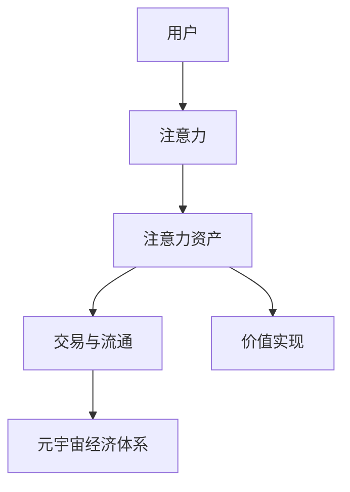

                 

# 注意力产业链:元宇宙经济体系的核心

在元宇宙（Metaverse）的宏伟构想中，数字资产的流通、交换、投资成为连接现实与虚拟的重要机制，形成了一个以用户注意力为核心的经济体系。本文深入探讨了元宇宙经济体系中注意力产业链的形成与运作机制，阐述了注意力作为新形式资产的流通方式与价值实现路径。希望通过本文的研究，能对元宇宙经济的繁荣提供理论支撑和实践指导。

## 1. 背景介绍

### 1.1 元宇宙经济体系简介

元宇宙是一个持续发展的虚拟空间，它具备现实世界的很多特征，包括社会、文化、经济等要素。与现实世界经济体系类似，元宇宙经济体系也有其独特的资产、交易和市场机制。元宇宙中的虚拟资产涵盖了各种虚拟物品、数字版权、虚拟土地等，其价值由用户的活跃度与需求驱动。

当前，元宇宙经济的蓬勃发展离不开区块链技术的支撑，如以太坊（Ethereum）、Binance Smart Chain等平台成为数字资产交易的基石。然而，区块链作为元宇宙经济的核心基础设施，也面临着交易成本高、扩展性差等限制。近年来，随着Web3技术的成熟，DeFi、NFT等新兴技术不断涌现，进一步推动了元宇宙经济的发展。

### 1.2 注意力经济学理论基础

注意力经济学是研究个体如何分配其有限注意力资源的经济理论。在Web2.0时代，搜索引擎、社交媒体等平台通过吸引用户注意力并从中获利。而在元宇宙中，用户注意力的争夺更加激烈，如何吸引并保持用户的注意力成为核心问题。

元宇宙中用户注意力的价值在于其能转化为实际的经济收益。例如，用户可能通过参与特定虚拟活动获得游戏道具，而这些道具的流通、交易构成了注意力产业链的基础。

## 2. 核心概念与联系

### 2.1 核心概念概述

- **注意力（Attention）**：用户对某类内容或服务的关注程度。在元宇宙中，注意力的价值在于用户的时间投入和信息消费行为。
- **元宇宙经济体系**：基于区块链技术的虚拟经济生态系统，其中用户注意力作为重要资产参与流通与交换。
- **注意力产业链**：以用户注意力为核心资源，通过吸引、获取、转化注意力，从而创造经济价值的过程。
- **注意力资产（Attention Asset）**：以用户注意力为载体的资产形式，如虚拟货币、NFT等。

### 2.2 核心概念联系

以上概念之间的关系可以通过以下Mermaid流程图来展示：



该流程图展示了从用户到元宇宙经济体系的完整路径：用户注意力首先转化为注意力资产，进而参与元宇宙内的交易与流通，最终实现价值增值。

## 3. 核心算法原理 & 具体操作步骤

### 3.1 算法原理概述

在元宇宙经济体系中，注意力作为重要资产的价值实现依赖于其流通与转化机制。基于机器学习和强化学习算法，可以构建一个智能合约平台，通过预测用户行为，优化注意力资源的分配与定价。

元宇宙中用户的注意力可以通过积分、代币等形式量化，并通过智能合约平台进行交易和流通。这一过程可以抽象为两个关键环节：

- **注意力获取（Attention Acquisition）**：通过优化产品设计、内容分发策略等方式吸引用户注意力的过程。
- **注意力转化（Attention Transformation）**：将注意力资产转化为经济收益的过程，如通过交易、广告投放等方式实现。

### 3.2 算法步骤详解

**Step 1: 构建注意力获取模型**

- 数据收集：收集用户行为数据，如浏览时长、互动频率、付费记录等，建立用户注意力分布模型。
- 特征工程：选取影响注意力的关键特征，如内容质量、互动性、技术特点等。
- 模型训练：使用强化学习算法或深度学习模型训练注意力获取模型，如利用协同过滤算法优化内容推荐，使用长短时记忆网络（LSTM）预测用户行为。

**Step 2: 设计注意力交易平台**

- 合约部署：在区块链平台上部署智能合约，实现注意力资产的发行、交易、清算等功能。
- 流动性管理：引入去中心化自动做市商（DeFi AMM），提升平台的流动性，降低交易成本。
- 监管合规：设计合规框架，确保平台符合当地法律和行业标准，防止欺诈和非法行为。

**Step 3: 实现注意力价值转化**

- 策略设计：设计策略，如奖励机制、激励措施等，促进用户积极参与注意力生成与流通。
- 合约优化：优化智能合约参数，提高注意力资产的吸引力和流通效率。
- 数据监测：实时监测平台运行数据，根据市场变化调整策略，保持平台的竞争力和稳定性。

### 3.3 算法优缺点

#### 优点

1. **数据驱动决策**：通过机器学习算法优化注意力资源分配，提升平台吸引力与用户满意度。
2. **智能合约保障**：基于区块链技术的智能合约确保了交易透明与安全，降低信任风险。
3. **去中心化特性**：平台采用去中心化架构，减少了单点故障和潜在的中心化风险。
4. **高效交易**：DeFi AMM提高了注意力资产的交易效率，降低交易成本。

#### 缺点

1. **算法复杂性**：算法模型设计复杂，需要大量数据和计算资源。
2. **市场风险**：市场波动可能导致注意力资产价值波动，影响平台稳定性。
3. **监管难题**：平台涉及不同国家和地区的法律监管，需要复杂的合规处理。
4. **用户体验**：过于复杂的操作可能影响用户体验，增加流失率。

### 3.4 算法应用领域

注意力产业链的应用领域主要集中在以下几个方面：

- **游戏与社交平台**：如区块链游戏平台、元宇宙社交平台等，通过游戏道具、社交资产等形式吸引用户注意力，并实现其价值转化。
- **内容与媒体行业**：如视频流媒体、在线教育等，通过内容付费、广告投放等方式实现注意力资产的变现。
- **虚拟土地与城市**：如虚拟地产平台，通过土地租赁、开发、交易等活动吸引用户，并创造经济价值。

## 4. 数学模型和公式 & 详细讲解

### 4.1 数学模型构建

注意力获取模型的目标是预测用户对某一内容或服务的关注度，量化为注意力分数 $A_i$。数学模型可以表达为：

$$
A_i = f(x_i, \theta)
$$

其中，$f$ 为模型函数，$x_i$ 为影响注意力的特征向量，$\theta$ 为模型参数。

### 4.2 公式推导过程

- **特征工程**：选择影响注意力的关键特征，如内容质量 $Q$、互动性 $I$、技术特点 $T$ 等。
- **模型训练**：使用强化学习算法（如Q-learning）或深度学习模型（如LSTM、GRU）训练注意力获取模型。
- **预测与优化**：利用模型预测用户注意力分数，并通过优化算法（如遗传算法、粒子群优化）调整模型参数，提升预测准确度。

### 4.3 案例分析与讲解

假设某元宇宙平台上有一款虚拟城市游戏，用户通过参与游戏活动获得虚拟土地和建筑，这些虚拟资产可以交易和流通。模型可以设计如下：

- **输入特征**：包括游戏时长、互动频率、建筑质量、游戏评分等。
- **输出**：预测用户对游戏活动关注度的分数，用于计算注意力资产价值。
- **算法**：使用基于LSTM的神经网络，对用户历史行为进行建模，预测未来行为。

## 5. 项目实践：代码实例和详细解释说明

### 5.1 开发环境搭建

使用Python和TensorFlow搭建注意力获取模型的开发环境：

1. 安装Python和TensorFlow：
```bash
pip install tensorflow
```

2. 安装数据处理库：
```bash
pip install pandas numpy scikit-learn
```

3. 安装模型训练与优化库：
```bash
pip install keras-tuner
```

### 5.2 源代码详细实现

以下是一个简单的代码示例，展示如何使用LSTM模型预测用户注意力分数：

```python
import tensorflow as tf
from tensorflow.keras import layers
from tensorflow.keras.optimizers import Adam

# 构建LSTM模型
model = tf.keras.Sequential([
    layers.LSTM(128, input_shape=(n_timesteps, n_features)),
    layers.Dense(1, activation='sigmoid')
])

# 定义优化器与损失函数
optimizer = Adam(learning_rate=0.001)
loss_fn = tf.keras.losses.BinaryCrossentropy()

# 编译模型
model.compile(optimizer=optimizer, loss=loss_fn, metrics=['accuracy'])

# 训练模型
model.fit(train_data, train_labels, epochs=10, batch_size=32)
```

### 5.3 代码解读与分析

**LSTM模型**：
- 使用LSTM层作为时间序列数据的建模工具，具有记忆性，能够捕捉时间序列中的动态变化。
- 最后一层为Dense层，输出预测的注意力分数。

**优化器与损失函数**：
- 使用Adam优化器，具有自适应学习率，提升训练效率。
- 使用二元交叉熵损失函数，适用于预测概率输出的二分类问题。

**模型编译与训练**：
- 通过`model.compile`函数指定优化器和损失函数，进行模型编译。
- 使用`model.fit`函数训练模型，`train_data`和`train_labels`为训练数据和标签。

## 6. 实际应用场景

### 6.1 元宇宙游戏

在元宇宙游戏中，用户通过参与活动获取虚拟资产，并通过交易平台进行资产流通，实现经济收益。例如，用户可以通过参与游戏任务获得虚拟土地和建筑，并通过交易平台将这些虚拟资产转换为游戏内货币或现实世界的货币。

### 6.2 在线教育平台

在线教育平台通过吸引学生注意力并获取付费订阅，实现经济收益。平台可以根据学生学习行为，如学习时长、测试成绩等，生成个性化推荐，吸引更多学生关注与参与。

### 6.3 虚拟地产平台

虚拟地产平台通过吸引用户购买虚拟土地和建筑，并实现这些资产的流通与交易，获取经济收益。平台可以通过多种方式激励用户参与虚拟建设与交易活动，吸引更多用户注意力。

### 6.4 未来应用展望

未来，随着元宇宙技术的成熟和普及，注意力产业链将进一步拓展，涉及更多的应用场景。例如：

- **虚拟旅游**：通过虚拟旅游平台吸引游客，通过导览、广告投放等方式实现注意力资产的变现。
- **数字身份认证**：通过区块链技术，利用用户注意力生成的数字身份认证资产，实现身份验证与信任机制。
- **虚拟现实**：在虚拟现实中，通过吸引用户进入特定的虚拟场景，实现注意力资产的流通与转化。

## 7. 工具和资源推荐

### 7.1 学习资源推荐

1. **《深度学习基础》**：Aurélien Géron著，全面介绍深度学习理论及实践，适合初学者入门。
2. **《强化学习》**：Richard S. Sutton & Andrew G. Barto著，经典教材，详细介绍强化学习理论及算法。
3. **《机器学习实战》**：Peter Harrington著，通过实践案例展示机器学习应用的全面性与深度。
4. **《Python深度学习》**：Francois Chollet著，详细讲解TensorFlow和Keras的使用，并展示深度学习在NLP、计算机视觉等领域的实践。
5. **Coursera元宇宙课程**：包括元宇宙经济学、区块链技术等系列课程，涵盖元宇宙经济体系与关键技术。

### 7.2 开发工具推荐

1. **TensorFlow**：Google推出的深度学习框架，支持多种语言与平台，适合构建复杂模型。
2. **PyTorch**：Facebook开源的深度学习框架，灵活易用，适合科研与开发。
3. **Jupyter Notebook**：Python的交互式开发环境，支持代码编辑、运行与调试，适合数据分析与模型开发。
4. **Ethereum生态工具**：如Ganache、Remix等，支持区块链平台开发与测试。
5. **智能合约平台**：如Etherscan、BscScan等，提供智能合约的部署与运行监控。

### 7.3 相关论文推荐

1. **《元宇宙经济学：理论与实践》**：讨论元宇宙经济的理论基础与运行机制。
2. **《注意力经济与数字资产流通》**：分析注意力经济模型及其实现路径。
3. **《元宇宙中的区块链技术与智能合约》**：介绍元宇宙中区块链技术与智能合约的应用。
4. **《基于机器学习的用户行为预测》**：探讨利用机器学习模型预测用户行为的方法与技术。

## 8. 总结：未来发展趋势与挑战

### 8.1 研究成果总结

本文详细探讨了元宇宙经济体系中注意力产业链的形成与运作机制，提出了基于机器学习的注意力获取模型与智能合约平台的构建思路，并设计了元宇宙中的注意力价值实现路径。通过本文的研究，对元宇宙经济的繁荣提供了理论支撑和实践指导。

### 8.2 未来发展趋势

未来元宇宙经济体系将更加复杂与多样化，关注力产业链也将随之发展。

1. **多样化应用**：随着技术进步与市场需求增加，元宇宙中的应用场景将更加丰富，如虚拟现实、虚拟社交、虚拟旅游等。
2. **技术融合**：元宇宙经济体系将融合更多新兴技术，如边缘计算、云计算、物联网等，提升平台性能与用户体验。
3. **市场扩展**：随着元宇宙的普及，元宇宙经济体系将扩展到更多国家和区域，吸引全球用户参与。

### 8.3 面临的挑战

在元宇宙经济体系中，注意力产业链仍面临诸多挑战：

1. **技术成熟度**：当前元宇宙技术仍处于发展初期，存在诸多技术瓶颈，如性能优化、安全性等。
2. **市场规范**：元宇宙经济的规范建设尚不完善，缺乏统一的法律法规与标准，存在法律风险。
3. **用户信任**：平台与用户间的信任机制仍不健全，可能存在欺诈、假冒等行为。
4. **隐私保护**：用户隐私保护是元宇宙经济体系的重要议题，如何保障用户数据安全需要深入研究。

### 8.4 研究展望

未来研究需要在以下几个方面寻求新的突破：

1. **提升模型预测精度**：利用更多数据与更先进的算法，提升用户行为预测的准确性。
2. **优化智能合约设计**：设计更灵活、高效、安全的智能合约，确保平台稳定运行。
3. **完善市场规范**：制定元宇宙经济体系的法律法规与标准，保障用户权益与平台合规。
4. **加强隐私保护**：开发隐私保护技术，确保用户数据安全。

综上所述，注意力产业链作为元宇宙经济体系的核心，其发展与完善将决定元宇宙的繁荣程度。通过不断优化模型与平台，完善市场规范与隐私保护，元宇宙经济体系必将迎来更广阔的发展空间。

## 9. 附录：常见问题与解答

**Q1: 元宇宙中用户注意力的价值如何量化？**

A: 用户注意力的价值可以通过多种方式量化，如基于互动频率、停留时间、付费记录等指标计算。具体来说，平台可以通过记录用户在虚拟环境中的行为数据，使用机器学习算法预测用户对某类内容或服务的关注度，从而量化注意力价值。

**Q2: 如何设计元宇宙中的智能合约平台？**

A: 设计元宇宙中的智能合约平台需考虑以下几个关键点：
1. 资产发行与流通机制：设计智能合约平台，支持注意力资产的发行、交易与清算。
2. 流动性管理：引入去中心化自动做市商（DeFi AMM），提高平台的流动性。
3. 合规与监管：设计合规框架，确保平台符合当地法律法规，防止欺诈与非法行为。

**Q3: 元宇宙中的注意力经济体系有哪些应用场景？**

A: 元宇宙中的注意力经济体系涉及多种应用场景，如元宇宙游戏、在线教育、虚拟地产等。这些应用场景通过吸引用户注意力，实现注意力资产的流通与价值转化，创造经济收益。

**Q4: 元宇宙中的注意力获取模型如何构建？**

A: 构建元宇宙中的注意力获取模型需进行以下步骤：
1. 数据收集：收集用户行为数据，建立用户注意力分布模型。
2. 特征工程：选取影响注意力的关键特征，如内容质量、互动性、技术特点等。
3. 模型训练：使用强化学习算法或深度学习模型训练注意力获取模型，提升预测准确度。

通过本文的全面分析与实践指导，希望读者能对元宇宙经济体系中的注意力产业链有更深刻的理解。随着元宇宙技术的不断发展，注意力产业链将进一步拓展，成为元宇宙经济体系的核心，为元宇宙经济的繁荣提供重要保障。

