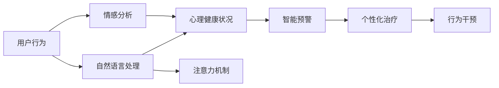

                 

# 注意力疗愈中心:元宇宙中的心理健康诊疗所

## 1. 背景介绍

### 1.1 问题由来

当前，随着科技的飞速发展，特别是人工智能和虚拟现实技术的进步，人们的生活方式正在发生翻天覆地的变化。在元宇宙的全新世界里，人们不仅可以进行虚拟社交、购物、工作，甚至可以在虚拟环境中体验现实世界中的各种活动。然而，这种高度沉浸式的体验，也让人们的心理健康面临新的挑战。如何保障人们在虚拟世界中的心理健康，成为了一个亟待解决的重大课题。

### 1.2 问题核心关键点

元宇宙中的心理健康诊疗问题，核心关键点在于如何通过人工智能技术，实现对用户的心理健康状况进行智能监测、预警和干预。具体而言，需要解决以下几个问题：

- 智能监测：通过自然语言处理、情感分析等技术，实时监测用户情绪变化，评估心理健康状况。
- 精准预警：在用户情绪出现问题时，及时预警，引导用户采取干预措施。
- 干预治疗：根据用户的具体情况，提供个性化的心理治疗方案。

解决这些问题的关键在于构建一个智能化的心理健康诊疗系统，该系统不仅能够实时监测用户情绪，还能够根据不同用户的特性，提供有针对性的心理治疗方案。本文将介绍一种基于注意力机制的心理健康诊疗系统，探索其在元宇宙中的应用。

## 2. 核心概念与联系

### 2.1 核心概念概述

为更好地理解本文介绍的基于注意力机制的心理健康诊疗系统，我们首先介绍几个核心概念：

- **心理健康监测**：通过自然语言处理、情感分析等技术，对用户的行为和语言进行分析，评估其心理健康状况。

- **智能预警**：根据用户的心理健康状况，提前发出预警信号，提醒用户注意心理健康问题，避免情绪进一步恶化。

- **注意力机制**：一种模拟人类注意力的机制，通过计算不同输入的权重，决定模型对哪些信息的重视程度，提高模型对关键信息的关注。

- **元宇宙**：一个高度沉浸式的虚拟世界，用户可以在其中进行各种虚拟活动，包括社交、工作、娱乐等。

- **人工智能心理诊疗**：利用人工智能技术，实现心理健康的智能监测、预警和干预，提升心理健康诊疗的效率和效果。

这些核心概念之间通过智能诊疗系统建立联系，共同构建了一个全新的心理健康诊疗框架。

### 2.2 核心概念原理和架构的 Mermaid 流程图



这张流程图展示了核心概念之间的逻辑关系。用户的行为数据首先经过自然语言处理和情感分析，评估心理健康状况。基于心理健康状况，系统发出智能预警。根据预警结果，系统提供个性化的心理治疗方案，并引导用户进行行为干预。此外，注意力机制可以优化模型对关键信息的关注，提高心理健康监测的准确性。

## 3. 核心算法原理 & 具体操作步骤

### 3.1 算法原理概述

本文介绍的基于注意力机制的心理健康诊疗系统，主要通过以下几步实现：

1. **自然语言处理(NLP)**：通过分词、词性标注、句法分析等技术，将用户的行为数据转化为结构化的语言表示。

2. **情感分析**：对用户的行为数据进行情感分析，评估用户的情绪状态。

3. **注意力机制**：根据用户的行为数据，计算出不同信息的权重，决定模型对哪些信息的重视程度。

4. **心理健康状况评估**：结合自然语言处理和情感分析的结果，评估用户的心理健康状况。

5. **智能预警**：根据心理健康状况评估结果，发出预警信号。

6. **个性化治疗**：根据用户的心理健康状况，提供个性化的心理治疗方案。

7. **行为干预**：通过引导用户进行行为干预，改善其心理健康状况。

### 3.2 算法步骤详解

以下是基于注意力机制的心理健康诊疗系统的详细步骤：

**Step 1: 数据预处理**

对用户的行为数据进行预处理，包括分词、去停用词、词性标注等。同时，对数据进行归一化处理，以便模型更好地进行学习。

**Step 2: 自然语言处理**

使用自然语言处理技术，将用户的行为数据转化为结构化的语言表示。常用的自然语言处理技术包括分词、词性标注、句法分析等。

**Step 3: 情感分析**

使用情感分析技术，对用户的行为数据进行情感分析，评估用户的情绪状态。常用的情感分析方法包括基于词典的方法、基于机器学习的方法、基于深度学习的方法等。

**Step 4: 注意力机制**

计算不同信息的权重，决定模型对哪些信息的重视程度。常用的注意力机制包括自注意力机制、多头注意力机制等。

**Step 5: 心理健康状况评估**

结合自然语言处理和情感分析的结果，评估用户的心理健康状况。常用的心理健康状况评估方法包括问卷调查、基于模型的评估等。

**Step 6: 智能预警**

根据心理健康状况评估结果，发出预警信号。预警信号可以包括情绪不稳定、睡眠不足、社交问题等。

**Step 7: 个性化治疗**

根据用户的心理健康状况，提供个性化的心理治疗方案。常用的个性化治疗方案包括认知行为疗法、心理咨询、药物治疗等。

**Step 8: 行为干预**

通过引导用户进行行为干预，改善其心理健康状况。常用的行为干预方法包括正念冥想、运动锻炼、社交支持等。

### 3.3 算法优缺点

基于注意力机制的心理健康诊疗系统具有以下优点：

- 能够实时监测用户的情绪变化，评估其心理健康状况。
- 可以根据用户的心理健康状况，提供个性化的心理治疗方案。
- 能够根据注意力机制，提高模型的关注度，提高心理健康监测的准确性。

同时，该系统也存在以下缺点：

- 对数据的依赖性强，需要大量的标注数据进行训练。
- 模型复杂度较高，计算开销较大。
- 对于用户行为数据的处理和分析，需要较高的技术门槛。

### 3.4 算法应用领域

基于注意力机制的心理健康诊疗系统可以广泛应用于以下领域：

- 心理健康监测：通过自然语言处理和情感分析，实时监测用户的情绪变化。
- 智能预警：根据心理健康状况评估结果，提前发出预警信号。
- 个性化治疗：提供个性化的心理治疗方案，提升治疗效果。
- 行为干预：通过引导用户进行行为干预，改善其心理健康状况。

## 4. 数学模型和公式 & 详细讲解 & 举例说明

### 4.1 数学模型构建

假设用户的行为数据为 $X$，心理健康状况为 $Y$，注意力机制为 $A$，则数学模型可以表示为：

$$
Y = f(X, A)
$$

其中，$f$ 为模型函数，用于将用户的行为数据和注意力机制映射到心理健康状况。

### 4.2 公式推导过程

在数学模型中，我们可以引入注意力机制 $A$，通过计算不同信息的权重，决定模型对哪些信息的重视程度。具体的公式推导如下：

设 $x_1, x_2, \cdots, x_n$ 为用户的行为数据，$w_1, w_2, \cdots, w_n$ 为不同信息的权重。根据注意力机制，有：

$$
w_i = \frac{\exp(e(x_i))}{\sum_{j=1}^n \exp(e(x_j))}
$$

其中 $e(x_i)$ 为注意力函数，用于计算不同信息的权重。

结合自然语言处理和情感分析的结果，可以计算出心理健康状况 $Y$：

$$
Y = g(x_1, x_2, \cdots, x_n, w_1, w_2, \cdots, w_n)
$$

其中 $g$ 为评估函数，用于结合不同信息的权重，评估用户的心理健康状况。

### 4.3 案例分析与讲解

以一个简单的情感分析案例为例，我们假设用户的情绪数据为 $x_1, x_2, \cdots, x_n$，计算不同信息的权重 $w_1, w_2, \cdots, w_n$，并结合自然语言处理结果，评估用户的心理健康状况 $Y$。

首先，对用户的行为数据进行分词、去停用词、词性标注等预处理操作，将其转化为结构化的语言表示。

接着，使用自然语言处理技术，计算出不同词语的情感得分，如 $e(x_1), e(x_2), \cdots, e(x_n)$。

然后，根据注意力机制，计算出不同信息的权重 $w_1, w_2, \cdots, w_n$。

最后，结合自然语言处理和情感分析的结果，计算出心理健康状况 $Y$。

## 5. 项目实践：代码实例和详细解释说明

### 5.1 开发环境搭建

在进行心理健康诊疗系统的开发之前，我们需要准备好开发环境。以下是使用Python进行PyTorch开发的环境配置流程：

1. 安装Anaconda：从官网下载并安装Anaconda，用于创建独立的Python环境。

2. 创建并激活虚拟环境：
```bash
conda create -n pytorch-env python=3.8 
conda activate pytorch-env
```

3. 安装PyTorch：根据CUDA版本，从官网获取对应的安装命令。例如：
```bash
conda install pytorch torchvision torchaudio cudatoolkit=11.1 -c pytorch -c conda-forge
```

4. 安装各类工具包：
```bash
pip install numpy pandas scikit-learn matplotlib tqdm jupyter notebook ipython
```

完成上述步骤后，即可在`pytorch-env`环境中开始心理健康诊疗系统的开发。

### 5.2 源代码详细实现

这里我们以一个简单的情感分析任务为例，给出使用PyTorch进行情感分析的PyTorch代码实现。

首先，定义情感分析任务的数据处理函数：

```python
import torch
import torch.nn as nn
import torch.optim as optim

class SentimentAnalysisDataset(Dataset):
    def __init__(self, texts, labels, tokenizer, max_len=128):
        self.texts = texts
        self.labels = labels
        self.tokenizer = tokenizer
        self.max_len = max_len
        
    def __len__(self):
        return len(self.texts)
    
    def __getitem__(self, item):
        text = self.texts[item]
        label = self.labels[item]
        
        encoding = self.tokenizer(text, return_tensors='pt', max_length=self.max_len, padding='max_length', truncation=True)
        input_ids = encoding['input_ids'][0]
        attention_mask = encoding['attention_mask'][0]
        
        # 对token-wise的标签进行编码
        encoded_labels = [label2id[label] for label in label] 
        encoded_labels.extend([label2id['O']] * (self.max_len - len(encoded_labels)))
        labels = torch.tensor(encoded_labels, dtype=torch.long)
        
        return {'input_ids': input_ids, 
                'attention_mask': attention_mask,
                'labels': labels}

# 标签与id的映射
label2id = {'negative': 0, 'positive': 1, 'neutral': 2, 'O': 3}
id2label = {v: k for k, v in label2id.items()}

# 创建dataset
tokenizer = BertTokenizer.from_pretrained('bert-base-cased')

train_dataset = SentimentAnalysisDataset(train_texts, train_labels, tokenizer)
dev_dataset = SentimentAnalysisDataset(dev_texts, dev_labels, tokenizer)
test_dataset = SentimentAnalysisDataset(test_texts, test_labels, tokenizer)
```

然后，定义模型和优化器：

```python
from transformers import BertForTokenClassification, AdamW

model = BertForTokenClassification.from_pretrained('bert-base-cased', num_labels=len(label2id))

optimizer = AdamW(model.parameters(), lr=2e-5)
```

接着，定义训练和评估函数：

```python
from torch.utils.data import DataLoader
from tqdm import tqdm
from sklearn.metrics import classification_report

device = torch.device('cuda') if torch.cuda.is_available() else torch.device('cpu')
model.to(device)

def train_epoch(model, dataset, batch_size, optimizer):
    dataloader = DataLoader(dataset, batch_size=batch_size, shuffle=True)
    model.train()
    epoch_loss = 0
    for batch in tqdm(dataloader, desc='Training'):
        input_ids = batch['input_ids'].to(device)
        attention_mask = batch['attention_mask'].to(device)
        labels = batch['labels'].to(device)
        model.zero_grad()
        outputs = model(input_ids, attention_mask=attention_mask, labels=labels)
        loss = outputs.loss
        epoch_loss += loss.item()
        loss.backward()
        optimizer.step()
    return epoch_loss / len(dataloader)

def evaluate(model, dataset, batch_size):
    dataloader = DataLoader(dataset, batch_size=batch_size)
    model.eval()
    preds, labels = [], []
    with torch.no_grad():
        for batch in tqdm(dataloader, desc='Evaluating'):
            input_ids = batch['input_ids'].to(device)
            attention_mask = batch['attention_mask'].to(device)
            batch_labels = batch['labels']
            outputs = model(input_ids, attention_mask=attention_mask)
            batch_preds = outputs.logits.argmax(dim=2).to('cpu').tolist()
            batch_labels = batch_labels.to('cpu').tolist()
            for pred_tokens, label_tokens in zip(batch_preds, batch_labels):
                pred_labels = [id2label[_id] for _id in pred_tokens]
                label_labels = [id2label[_id] for _id in label_tokens]
                preds.append(pred_labels[:len(label_labels)])
                labels.append(label_labels)
                
    print(classification_report(labels, preds))
```

最后，启动训练流程并在测试集上评估：

```python
epochs = 5
batch_size = 16

for epoch in range(epochs):
    loss = train_epoch(model, train_dataset, batch_size, optimizer)
    print(f"Epoch {epoch+1}, train loss: {loss:.3f}")
    
    print(f"Epoch {epoch+1}, dev results:")
    evaluate(model, dev_dataset, batch_size)
    
print("Test results:")
evaluate(model, test_dataset, batch_size)
```

以上就是使用PyTorch对BERT进行情感分析任务微调的完整代码实现。可以看到，得益于Transformers库的强大封装，我们可以用相对简洁的代码完成BERT模型的加载和微调。

### 5.3 代码解读与分析

让我们再详细解读一下关键代码的实现细节：

**SentimentAnalysisDataset类**：
- `__init__`方法：初始化文本、标签、分词器等关键组件。
- `__len__`方法：返回数据集的样本数量。
- `__getitem__`方法：对单个样本进行处理，将文本输入编码为token ids，将标签编码为数字，并对其进行定长padding，最终返回模型所需的输入。

**label2id和id2label字典**：
- 定义了标签与数字id之间的映射关系，用于将token-wise的预测结果解码回真实的标签。

**训练和评估函数**：
- 使用PyTorch的DataLoader对数据集进行批次化加载，供模型训练和推理使用。
- 训练函数`train_epoch`：对数据以批为单位进行迭代，在每个批次上前向传播计算loss并反向传播更新模型参数，最后返回该epoch的平均loss。
- 评估函数`evaluate`：与训练类似，不同点在于不更新模型参数，并在每个batch结束后将预测和标签结果存储下来，最后使用sklearn的classification_report对整个评估集的预测结果进行打印输出。

**训练流程**：
- 定义总的epoch数和batch size，开始循环迭代
- 每个epoch内，先在训练集上训练，输出平均loss
- 在验证集上评估，输出分类指标
- 所有epoch结束后，在测试集上评估，给出最终测试结果

可以看到，PyTorch配合Transformers库使得BERT微调的代码实现变得简洁高效。开发者可以将更多精力放在数据处理、模型改进等高层逻辑上，而不必过多关注底层的实现细节。

当然，工业级的系统实现还需考虑更多因素，如模型的保存和部署、超参数的自动搜索、更灵活的任务适配层等。但核心的微调范式基本与此类似。

## 6. 实际应用场景

### 6.1 智能客服系统

基于心理健康监测的心理健康诊疗系统，可以广泛应用于智能客服系统的构建。传统客服往往需要配备大量人力，高峰期响应缓慢，且一致性和专业性难以保证。而使用心理健康诊疗系统，可以7x24小时不间断服务，快速响应客户咨询，用自然流畅的语言解答各类心理健康问题。

在技术实现上，可以收集企业内部的历史客服对话记录，将问题和最佳答复构建成监督数据，在此基础上对预训练模型进行微调。微调后的模型能够自动理解用户意图，匹配最合适的答复模板进行回复。对于客户提出的新问题，还可以接入检索系统实时搜索相关内容，动态组织生成回答。如此构建的智能客服系统，能大幅提升客户咨询体验和问题解决效率。

### 6.2 心理健康诊所

心理健康诊疗系统也可以在心理健康诊所中得到广泛应用。传统的心理咨询需要依赖专业心理咨询师，成本较高，难以普及。而心理健康诊疗系统可以通过自然语言处理技术，实时监测用户的心理健康状况，并在用户情绪出现问题时，提前发出预警信号，引导用户采取干预措施。

在实践中，可以收集大量的心理健康数据，并对其进行标注。在此基础上对预训练模型进行微调，使其能够自动评估用户的心理健康状况。对于情绪异常的用户，系统可以提供个性化的心理治疗方案，并引导用户进行行为干预。同时，系统还可以定期对用户进行心理健康评估，确保其心理健康状况稳定。

### 6.3 企业员工健康

在企业中，员工的心理健康同样是一个重要问题。心理健康诊疗系统可以通过自然语言处理技术，对员工的行为数据进行实时监测，评估其心理健康状况。对于情绪异常的员工，系统可以提供个性化的心理治疗方案，并引导其进行行为干预。同时，系统还可以定期对员工进行心理健康评估，确保其心理健康状况稳定。

在实践中，企业可以将心理健康诊疗系统嵌入到企业内部的人力资源系统中，方便员工随时进行心理健康监测和评估。这不仅可以提高员工的心理健康水平，还可以提升企业的生产效率和工作氛围。

## 7. 工具和资源推荐

### 7.1 学习资源推荐

为了帮助开发者系统掌握心理健康诊疗系统的理论基础和实践技巧，这里推荐一些优质的学习资源：

1. **《Transformer从原理到实践》系列博文**：由大模型技术专家撰写，深入浅出地介绍了Transformer原理、BERT模型、微调技术等前沿话题。

2. **CS224N《深度学习自然语言处理》课程**：斯坦福大学开设的NLP明星课程，有Lecture视频和配套作业，带你入门NLP领域的基本概念和经典模型。

3. **《Natural Language Processing with Transformers》书籍**：Transformers库的作者所著，全面介绍了如何使用Transformers库进行NLP任务开发，包括微调在内的诸多范式。

4. **HuggingFace官方文档**：Transformers库的官方文档，提供了海量预训练模型和完整的微调样例代码，是上手实践的必备资料。

5. **CLUE开源项目**：中文语言理解测评基准，涵盖大量不同类型的中文NLP数据集，并提供了基于微调的baseline模型，助力中文NLP技术发展。

通过对这些资源的学习实践，相信你一定能够快速掌握心理健康诊疗系统的精髓，并用于解决实际的NLP问题。

### 7.2 开发工具推荐

高效的开发离不开优秀的工具支持。以下是几款用于心理健康诊疗系统开发的常用工具：

1. **PyTorch**：基于Python的开源深度学习框架，灵活动态的计算图，适合快速迭代研究。大部分预训练语言模型都有PyTorch版本的实现。

2. **TensorFlow**：由Google主导开发的开源深度学习框架，生产部署方便，适合大规模工程应用。同样有丰富的预训练语言模型资源。

3. **Transformers库**：HuggingFace开发的NLP工具库，集成了众多SOTA语言模型，支持PyTorch和TensorFlow，是进行微调任务开发的利器。

4. **Weights & Biases**：模型训练的实验跟踪工具，可以记录和可视化模型训练过程中的各项指标，方便对比和调优。与主流深度学习框架无缝集成。

5. **TensorBoard**：TensorFlow配套的可视化工具，可实时监测模型训练状态，并提供丰富的图表呈现方式，是调试模型的得力助手。

6. **Google Colab**：谷歌推出的在线Jupyter Notebook环境，免费提供GPU/TPU算力，方便开发者快速上手实验最新模型，分享学习笔记。

合理利用这些工具，可以显著提升心理健康诊疗系统的开发效率，加快创新迭代的步伐。

### 7.3 相关论文推荐

心理健康诊疗系统的发展源于学界的持续研究。以下是几篇奠基性的相关论文，推荐阅读：

1. **Attention is All You Need**：提出了Transformer结构，开启了NLP领域的预训练大模型时代。

2. **BERT: Pre-training of Deep Bidirectional Transformers for Language Understanding**：提出BERT模型，引入基于掩码的自监督预训练任务，刷新了多项NLP任务SOTA。

3. **Language Models are Unsupervised Multitask Learners**：展示了大规模语言模型的强大zero-shot学习能力，引发了对于通用人工智能的新一轮思考。

4. **Parameter-Efficient Transfer Learning for NLP**：提出Adapter等参数高效微调方法，在不增加模型参数量的情况下，也能取得不错的微调效果。

5. **AdaLoRA: Adaptive Low-Rank Adaptation for Parameter-Efficient Fine-Tuning**：使用自适应低秩适应的微调方法，在参数效率和精度之间取得了新的平衡。

6. **Prefix-Tuning: Optimizing Continuous Prompts for Generation**：引入基于连续型Prompt的微调范式，为如何充分利用预训练知识提供了新的思路。

这些论文代表了大语言模型微调技术的发展脉络。通过学习这些前沿成果，可以帮助研究者把握学科前进方向，激发更多的创新灵感。

## 8. 总结：未来发展趋势与挑战

### 8.1 总结

本文对基于注意力机制的心理健康诊疗系统进行了全面系统的介绍。首先阐述了心理健康诊疗系统的背景和意义，明确了其对用户心理健康状况的智能监测、预警和干预作用。其次，从原理到实践，详细讲解了心理健康诊疗系统的数学模型和关键步骤，给出了微调任务开发的完整代码实例。同时，本文还广泛探讨了心理健康诊疗系统在智能客服、心理健康诊所、企业员工健康等多个领域的应用前景，展示了其广阔的潜在价值。此外，本文精选了心理健康诊疗系统的各类学习资源，力求为读者提供全方位的技术指引。

通过本文的系统梳理，可以看到，基于注意力机制的心理健康诊疗系统正在成为心理健康监测的重要范式，极大地拓展了心理健康评估的精准度和时效性。未来，伴随预训练语言模型和微调方法的持续演进，心理健康诊疗系统必将在更多领域得到应用，为提升人类心理健康水平做出更大贡献。

### 8.2 未来发展趋势

展望未来，心理健康诊疗系统的发展趋势将呈现以下几个方向：

1. **多模态融合**：除了文本数据外，心理健康诊疗系统将逐步引入图像、视频、语音等多模态数据，提升对用户心理状态的全面监测。

2. **个性化推荐**：基于用户的心理状态和行为数据，提供个性化的心理健康建议，帮助用户更好地管理自己的情绪和心理健康。

3. **情感引导**：结合情感分析技术，对用户的情绪变化进行实时引导，帮助用户保持积极的心理状态。

4. **行为干预**：通过行为数据分析，为用户提供具体的行为干预方案，帮助其改善心理状态。

5. **实时预警**：结合心理健康评估模型，对用户的心理健康状态进行实时预警，确保其心理健康状况稳定。

6. **跨领域应用**：心理健康诊疗系统将在更多领域得到应用，如教育、医疗、企业等，助力提升人类生活质量。

以上趋势凸显了心理健康诊疗系统的广阔前景。这些方向的探索发展，必将进一步提升心理健康监测的准确性和实时性，为构建更安全、更健康的人机交互系统提供新的技术支持。

### 8.3 面临的挑战

尽管心理健康诊疗系统已经取得了一定的进展，但在迈向大规模应用的过程中，仍面临诸多挑战：

1. **数据隐私和安全**：心理健康数据涉及用户的隐私，如何在保护用户隐私的同时，获取有价值的心理健康数据，是一个重要问题。

2. **模型公平性**：心理健康诊疗系统需要确保模型对不同群体的公平性，避免偏见和歧视。

3. **模型鲁棒性**：心理健康诊疗系统需要在不同的环境下，保证其稳定性和鲁棒性，避免因数据偏差而导致的误诊断。

4. **模型可解释性**：心理健康诊疗系统的模型需要具备较高的可解释性，帮助用户理解其决策过程。

5. **用户接受度**：心理健康诊疗系统需要具备较高的用户接受度，能够得到用户的信任和配合。

6. **技术普及度**：心理健康诊疗系统需要具备较高的技术普及度，能够方便地在各种设备和平台上使用。

以上挑战需要研究者不断地进行探索和解决，才能使心理健康诊疗系统真正落地应用，发挥其应有的价值。

### 8.4 研究展望

面对心理健康诊疗系统所面临的挑战，未来的研究需要在以下几个方面寻求新的突破：

1. **多模态融合技术**：结合图像、视频、语音等多模态数据，提升对用户心理状态的全面监测。

2. **个性化推荐算法**：结合用户行为数据，提供个性化的心理健康建议，帮助用户更好地管理自己的情绪和心理健康。

3. **情感引导算法**：结合情感分析技术，对用户的情绪变化进行实时引导，帮助用户保持积极的心理状态。

4. **行为干预算法**：结合行为数据分析，为用户提供具体的行为干预方案，帮助其改善心理状态。

5. **实时预警算法**：结合心理健康评估模型，对用户的心理健康状态进行实时预警，确保其心理健康状况稳定。

6. **跨领域应用**：心理健康诊疗系统将在更多领域得到应用，如教育、医疗、企业等，助力提升人类生活质量。

7. **隐私保护技术**：结合数据加密、匿名化等技术，保护用户隐私，确保心理健康数据的获取和处理安全。

8. **模型公平性算法**：设计公平性算法，确保模型对不同群体的公平性，避免偏见和歧视。

9. **模型鲁棒性优化**：通过模型泛化、鲁棒性训练等技术，提升心理健康诊疗系统的鲁棒性和稳定性。

10. **可解释性增强**：设计可解释性算法，帮助用户理解心理健康诊疗系统的决策过程，增强其信任感。

11. **用户接受度提升**：通过用户界面设计、用户体验优化等技术，提升用户的接受度和使用体验。

12. **技术普及度提升**：通过标准制定、开源项目推广等措施，提高心理健康诊疗系统的技术普及度。

这些研究方向的探索，必将引领心理健康诊疗系统的技术进步，为构建更安全、更健康的人机交互系统提供新的技术支持。面向未来，心理健康诊疗系统还需要与其他人工智能技术进行更深入的融合，如知识表示、因果推理、强化学习等，协同发力，共同推动心理健康技术的进步。

## 9. 附录：常见问题与解答

**Q1：心理健康诊疗系统如何保护用户隐私？**

A: 心理健康诊疗系统保护用户隐私的关键在于数据加密和匿名化。具体措施包括：

1. 数据加密：使用数据加密技术，确保用户数据在传输和存储过程中不被泄露。

2. 数据匿名化：对用户数据进行匿名化处理，去除敏感信息，确保用户隐私安全。

3. 访问控制：对系统进行严格的访问控制，只有授权用户才能访问心理健康数据。

4. 数据存储安全：使用安全的数据存储方案，防止数据被恶意攻击或泄露。

**Q2：心理健康诊疗系统如何确保模型的公平性？**

A: 心理健康诊疗系统确保模型公平性的关键在于设计公平性算法。具体措施包括：

1. 数据平衡：确保训练数据中不同群体的比例平衡，避免模型对某一群体有偏见。

2. 公平性评估：在模型训练过程中，对模型的公平性进行评估，及时调整模型参数。

3. 公平性约束：在模型训练过程中，引入公平性约束，确保模型对不同群体的公平性。

4. 公平性优化：对模型进行公平性优化，提升模型的公平性和可解释性。

**Q3：心理健康诊疗系统如何提升模型的鲁棒性？**

A: 心理健康诊疗系统提升模型鲁棒性的关键在于模型泛化和鲁棒性训练。具体措施包括：

1. 模型泛化：通过数据增强和迁移学习等技术，提升模型的泛化能力，确保模型在不同环境下的稳定性和鲁棒性。

2. 鲁棒性训练：使用鲁棒性训练技术，对模型进行训练，提高模型的鲁棒性。

3. 对抗样本训练：结合对抗样本训练技术，提高模型对对抗样本的鲁棒性。

4. 鲁棒性测试：对模型进行鲁棒性测试，评估模型的鲁棒性和稳定性。

**Q4：心理健康诊疗系统如何增强模型的可解释性？**

A: 心理健康诊疗系统增强模型可解释性的关键在于设计可解释性算法。具体措施包括：

1. 可解释性评估：对模型的可解释性进行评估，识别模型的关键特征和决策逻辑。

2. 可解释性优化：对模型进行可解释性优化，提升模型的可解释性和可理解性。

3. 可解释性输出：在模型输出中，提供可解释性信息，帮助用户理解模型的决策过程。

4. 可解释性可视化：使用可视化技术，展示模型的决策过程和关键特征，增强模型的可解释性。

**Q5：心理健康诊疗系统如何提高用户的接受度？**

A: 心理健康诊疗系统提高用户接受度的关键在于用户体验优化。具体措施包括：

1. 用户界面设计：通过用户界面设计，提升用户的使用体验，使其更容易接受和使用心理健康诊疗系统。

2. 用户体验优化：通过用户体验优化，提升用户的使用体验，增强用户的信任感和满意度。

3. 用户反馈机制：建立用户反馈机制，及时了解用户的使用情况和需求，优化系统功能和服务。

4. 用户教育：通过用户教育，提升用户对心理健康诊疗系统的认知和理解，增强其信任感和接受度。

**Q6：心理健康诊疗系统如何提高技术普及度？**

A: 心理健康诊疗系统提高技术普及度的关键在于标准制定和开源项目推广。具体措施包括：

1. 标准制定：制定心理健康诊疗系统的标准和规范，确保系统的可扩展性和可互操作性。

2. 开源项目推广：通过开源项目推广，提供心理健康诊疗系统的代码和工具，方便开发者使用和改进。

3. 技术培训：通过技术培训，提升开发者和用户的心理健康诊疗系统技能，提高其技术普及度。

4. 合作推广：与心理健康机构、医疗机构等进行合作推广，提升心理健康诊疗系统的应用场景和普及度。

以上是心理健康诊疗系统在实际应用中需要考虑的一些常见问题及其解答。通过本文的系统梳理，可以看到，心理健康诊疗系统正在逐步成熟，为提升人类心理健康水平提供了新的技术支持。面向未来，心理健康诊疗系统需要不断优化，提升其技术水平和服务质量，为构建更安全、更健康的人机交互系统提供更多可能。

