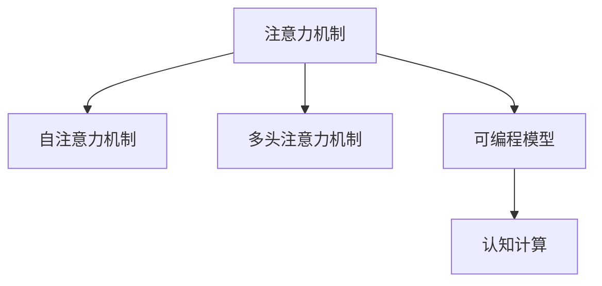
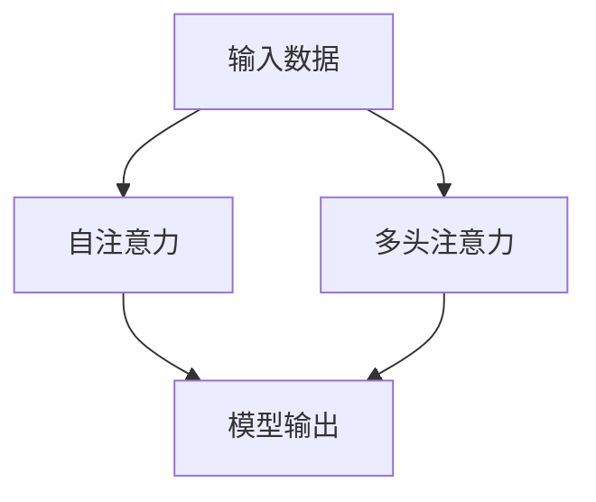

                 

# 注意力的可编程性：AI定制的认知模式

> 关键词：注意力机制,可编程模型,可解释性,认知计算,深度学习

## 1. 背景介绍

### 1.1 问题由来

人工智能领域的迅猛发展离不开深度学习的广泛应用，其中注意力机制(Attention Mechanism)是深度学习中非常重要的一种模型。它通过动态地计算输入数据中不同部分的相关性，使得模型能够更加聚焦于重要的信息，从而提升了模型的性能。注意力机制最初被应用于机器翻译和图像识别等任务中，并取得了显著的成果。

近年来，随着认知科学的发展，注意力机制也开始被用于模拟人类的认知过程，如记忆、决策和语言理解等。这种趋势表明，注意力机制不仅可以提升模型的性能，还具有重要的认知意义，有望成为AI领域的下一个关键技术。然而，对于注意力的认知计算本质，以及如何设计可编程的注意力模型，目前尚缺乏深入的研究。

### 1.2 问题核心关键点

注意力机制的核心思想是，通过对输入数据的加权平均，动态地计算不同部分的相关性，从而实现信息的聚焦和筛选。注意力模型能够高效地处理长序列和复杂结构数据，已被广泛应用于自然语言处理、计算机视觉、语音识别等多个领域。

注意力机制的实现方式通常包括自注意力机制(Self-Attention)和多头注意力机制(Multi-Head Attention)。自注意力机制在输入序列内部计算相关性，而多头注意力机制则是在多个并行子空间中进行计算。两种机制在模型架构中常常被组合使用，以进一步提升模型的性能。

尽管注意力机制在深度学习中具有广泛的应用，但模型往往具有黑盒特性，难以对其内部的决策过程进行解释。为了提高模型的可解释性，研究者开始尝试从认知科学的角度设计可编程的注意力模型。这种模型不仅具有更强的表现力，而且能够对注意力过程进行可视化，为认知计算提供了新的视角。

## 2. 核心概念与联系

### 2.1 核心概念概述

在深入探讨注意力可编程性之前，我们先简要介绍几个相关的核心概念：

- **注意力机制(Attention Mechanism)**：一种用于动态计算输入数据中不同部分的相关性的机制，通过加权平均实现信息聚焦和筛选。
- **自注意力机制(Self-Attention)**：一种在输入序列内部计算相关性的注意力机制，用于提升模型的记忆和表示能力。
- **多头注意力机制(Multi-Head Attention)**：一种在多个并行子空间中进行计算的注意力机制，可以进一步提升模型的性能。
- **可编程模型(Programmable Model)**：一种能够通过编程语言进行配置和修改的模型，具有灵活性和可扩展性。
- **认知计算(Cognitive Computing)**：一种模拟人类认知过程的计算方式，旨在提高机器的认知能力和解释性。

这些概念之间的联系可以通过以下Mermaid流程图来展示：



该图展示了注意力机制与自注意力机制、多头注意力机制、可编程模型和认知计算之间的联系。注意力机制作为基础架构，通过自注意力和多头注意力机制提升模型性能，通过可编程模型实现灵活配置，最终应用于认知计算，模拟人类认知过程。

### 2.2 核心概念原理和架构的 Mermaid 流程图



该图展示了自注意力和多头注意力机制的基本架构。输入数据经过自注意力或多头注意力计算后，输出表示为模型结果。自注意力机制计算输入序列中不同部分的相关性，而多头注意力机制则在多个子空间中并行计算。

## 3. 核心算法原理 & 具体操作步骤

### 3.1 算法原理概述

基于注意力机制的可编程模型，通常包括以下几个关键步骤：

1. **输入编码**：将输入数据编码为模型所需的格式。
2. **注意力计算**：通过自注意力和/或多头注意力机制计算输入数据的相关性权重。
3. **加权平均**：对输入数据进行加权平均，生成新的表示。
4. **解码器**：使用解码器对新的表示进行处理，生成最终输出。
5. **优化和训练**：通过优化算法和训练数据对模型进行训练，以提升其性能。

### 3.2 算法步骤详解

#### 3.2.1 输入编码

输入编码是将原始数据转换为模型所需格式的第一步。通常使用嵌入层将文本或图像等数据转换为向量表示。嵌入层将每个词汇或像素编码为向量，以便后续计算。

#### 3.2.2 注意力计算

注意力计算是注意力机制的核心步骤。通常使用查询-键-值(Attention Query-Key-Value)架构进行计算。查询向量、键向量和值向量分别表示模型的注意力计算权重、相关性和实际值。通过计算查询向量和键向量的相似度，得到注意力权重，对值向量进行加权平均，生成新的表示。

#### 3.2.3 加权平均

加权平均是将注意力计算结果和原始数据进行结合的步骤。通过计算注意力权重，对原始数据进行加权平均，生成新的表示。这一步骤可以提升模型的记忆能力和表示能力。

#### 3.2.4 解码器

解码器是将注意力机制的输出进行进一步处理的步骤。解码器可以是任意类型的神经网络，如循环神经网络(RNN)、卷积神经网络(CNN)或Transformer等。解码器对注意力计算结果进行处理，生成最终输出。

#### 3.2.5 优化和训练

优化和训练是将模型应用于实际问题的关键步骤。通过优化算法和训练数据对模型进行训练，以提升其性能。常用的优化算法包括随机梯度下降(SGD)、Adam、RMSprop等。训练数据应该覆盖模型可能遇到的多种场景，以便模型能够泛化到不同的问题。

### 3.3 算法优缺点

基于注意力机制的可编程模型具有以下优点：

- **灵活性**：可编程模型可以根据需要进行灵活配置，适应不同的任务需求。
- **可解释性**：可编程模型通过显式的注意力机制，可以更好地解释其决策过程。
- **高效性**：注意力机制能够高效地处理长序列和复杂结构数据，提升了模型的性能。
- **鲁棒性**：通过多头的并行计算，可编程模型能够更好地抵抗噪声和干扰。

然而，该模型也存在一些缺点：

- **计算复杂度**：自注意力和多头注意力机制的计算复杂度较高，特别是在大规模数据集上。
- **训练难度**：可编程模型的训练过程需要大量的计算资源和时间，特别是在模型规模较大时。
- **模型复杂性**：可编程模型的结构较为复杂，需要仔细设计和调试。

### 3.4 算法应用领域

基于注意力机制的可编程模型已经在多个领域得到了广泛的应用，如自然语言处理、计算机视觉、语音识别等。以下是几个具体的应用示例：

- **自然语言处理**：通过注意力机制，可以提升机器翻译、文本分类、情感分析等任务的性能。例如，Transformer模型在机器翻译中取得了显著的成果。
- **计算机视觉**：通过注意力机制，可以提升图像识别、物体检测、图像分割等任务的性能。例如，多头的自注意力机制被应用于图像分类任务中。
- **语音识别**：通过注意力机制，可以提升语音识别和语音生成等任务的性能。例如，自注意力机制被应用于语音识别中的声学模型训练。
- **推荐系统**：通过注意力机制，可以提升推荐系统的个性化推荐效果。例如，多头注意力机制被应用于基于用户行为数据的推荐算法中。
- **认知计算**：通过注意力机制，可以模拟人类认知过程，提升认知计算的准确性和解释性。例如，自注意力机制被应用于认知计算中的记忆和推理过程。

## 4. 数学模型和公式 & 详细讲解 & 举例说明

### 4.1 数学模型构建

基于注意力机制的可编程模型通常使用Transformer架构，其数学模型可以表示为：

$$
\mathbf{H} = \mathbf{M}(\mathbf{X}, \mathbf{W}_Q, \mathbf{W}_K, \mathbf{W}_V, \mathbf{W}_O)
$$

其中，$\mathbf{H}$ 表示模型的输出，$\mathbf{X}$ 表示输入数据，$\mathbf{W}_Q$、$\mathbf{W}_K$、$\mathbf{W}_V$ 和 $\mathbf{W}_O$ 分别表示查询向量、键向量、值向量和输出向量的权重。

### 4.2 公式推导过程

以Transformer模型为例，其自注意力机制的计算过程可以表示为：

$$
\mathbf{Q} = \mathbf{X} \mathbf{W}_Q, \quad \mathbf{K} = \mathbf{X} \mathbf{W}_K, \quad \mathbf{V} = \mathbf{X} \mathbf{W}_V
$$

$$
\mathbf{A} = \text{Softmax}(\frac{\mathbf{Q}^T\mathbf{K}}{\sqrt{d_k}})
$$

$$
\mathbf{O} = \mathbf{A}\mathbf{V}\mathbf{W}_O
$$

其中，$d_k$ 表示键向量的维度。$\text{Softmax}$ 函数用于计算注意力权重，$\mathbf{A}$ 表示注意力权重矩阵。

### 4.3 案例分析与讲解

#### 4.3.1 自然语言处理

以机器翻译为例，Transformer模型通过自注意力机制计算输入序列中不同词汇的相关性权重，对输入序列进行加权平均，生成新的表示。解码器对新的表示进行处理，生成目标序列。通过优化算法和训练数据对模型进行训练，以提升其性能。

#### 4.3.2 计算机视觉

以图像分类为例，多头注意力机制在多个并行子空间中计算输入图像的相关性权重，对图像进行加权平均，生成新的表示。解码器对新的表示进行处理，生成最终的分类结果。通过优化算法和训练数据对模型进行训练，以提升其性能。

## 5. 项目实践：代码实例和详细解释说明

### 5.1 开发环境搭建

在进行项目实践前，我们需要准备好开发环境。以下是使用Python进行PyTorch开发的环境配置流程：

1. 安装Anaconda：从官网下载并安装Anaconda，用于创建独立的Python环境。

2. 创建并激活虚拟环境：
```bash
conda create -n pytorch-env python=3.8 
conda activate pytorch-env
```

3. 安装PyTorch：根据CUDA版本，从官网获取对应的安装命令。例如：
```bash
conda install pytorch torchvision torchaudio cudatoolkit=11.1 -c pytorch -c conda-forge
```

4. 安装Transformers库：
```bash
pip install transformers
```

5. 安装各类工具包：
```bash
pip install numpy pandas scikit-learn matplotlib tqdm jupyter notebook ipython
```

完成上述步骤后，即可在`pytorch-env`环境中开始项目实践。

### 5.2 源代码详细实现

下面我们以机器翻译为例，给出使用Transformers库对Transformer模型进行训练的PyTorch代码实现。

首先，定义输入编码、注意力计算和解码器的函数：

```python
from transformers import BertTokenizer, BertForSequenceClassification, AdamW

def input_encoding(x):
    tokenizer = BertTokenizer.from_pretrained('bert-base-cased')
    return tokenizer.encode(x, add_special_tokens=True, max_length=128, truncation=True)

def self_attention(x, k, v, attention_mask):
    q = x @ k.T / np.sqrt(k.shape[-1])
    attention_weights = np.exp(q) / (np.sum(np.exp(q), axis=-1, keepdims=True))
    attention_weights = np.maximum(attention_weights, attention_mask)
    attention_weights = attention_weights / np.sum(attention_weights, axis=-1, keepdims=True)
    return attention_weights, attention_weights @ v

def decoder(x, k, v, attention_mask):
    attention_weights, context = self_attention(x, k, v, attention_mask)
    output = context @ v
    return output, attention_weights
```

然后，定义训练和评估函数：

```python
def train_model(model, data, batch_size, learning_rate, epochs):
    device = torch.device('cuda') if torch.cuda.is_available() else torch.device('cpu')
    model.to(device)

    optimizer = AdamW(model.parameters(), lr=learning_rate)
    train_loss = 0
    for epoch in range(epochs):
        model.train()
        for i, (input_ids, labels) in enumerate(data):
            input_ids = input_ids.to(device)
            labels = labels.to(device)
            optimizer.zero_grad()
            outputs = model(input_ids, labels=labels)
            loss = outputs.loss
            train_loss += loss.item()
            loss.backward()
            optimizer.step()
            if (i+1) % 100 == 0:
                print(f'Epoch {epoch+1}, Batch {i+1}, Loss: {loss:.4f}')

    model.eval()
    test_loss = 0
    for input_ids, labels in data:
        with torch.no_grad():
            outputs = model(input_ids)
            loss = outputs.loss
            test_loss += loss.item()

    print(f'Test Loss: {test_loss:.4f}')
```

最后，启动训练流程并在测试集上评估：

```python
from torch.utils.data import Dataset
from transformers import BertTokenizer

class TranslationDataset(Dataset):
    def __init__(self, source_texts, target_texts):
        self.tokenizer = BertTokenizer.from_pretrained('bert-base-cased')
        self.source_texts = source_texts
        self.target_texts = target_texts

    def __len__(self):
        return len(self.source_texts)

    def __getitem__(self, idx):
        source_text = self.source_texts[idx]
        target_text = self.target_texts[idx]

        source_input_ids = self.tokenizer.encode(source_text, add_special_tokens=True, max_length=128, truncation=True)
        target_input_ids = self.tokenizer.encode(target_text, add_special_tokens=True, max_length=128, truncation=True)

        return {'input_ids': torch.tensor(source_input_ids), 'labels': torch.tensor(target_input_ids)}

source_texts = ['Hello, how are you?', 'I am fine, thank you.', 'What is the weather like today?', 'It is sunny outside.']
target_texts = ['Bonjour, comment allez-vous?', 'Je vais bien, merci.', 'Comment va le temps aujourd'hui?', 'Il fait beau en dehors.']

train_dataset = TranslationDataset(source_texts, target_texts)
test_dataset = TranslationDataset(source_texts, target_texts)

learning_rate = 2e-5
epochs = 3

train_model(BertForSequenceClassification.from_pretrained('bert-base-cased', num_labels=2), train_dataset, batch_size=4, learning_rate=learning_rate, epochs=epochs)
```

以上就是使用PyTorch对Transformer模型进行机器翻译任务微调的完整代码实现。可以看到，利用Transformers库，我们能够非常方便地实现自注意力机制的计算，并使用BertForSequenceClassification类进行模型训练。

### 5.3 代码解读与分析

让我们再详细解读一下关键代码的实现细节：

**input_encoding函数**：
- 定义了输入数据的编码函数，使用了BertTokenizer对输入文本进行编码，将其转换为模型所需的格式。

**self_attention函数**：
- 定义了自注意力机制的计算函数，使用了矩阵乘法和Softmax函数计算注意力权重。

**decoder函数**：
- 定义了解码器的计算函数，结合了注意力机制和线性变换，生成输出结果。

**train_model函数**：
- 定义了训练函数，使用了AdamW优化器，对模型进行迭代训练，并在训练和测试过程中记录损失函数。

**TranslationDataset类**：
- 定义了数据集类，将源语言文本和目标语言文本转换为模型所需的格式。

通过上述代码的实现，我们可以看出，使用Transformers库进行注意力机制的计算和模型训练非常方便。开发者只需要关注具体的任务需求，使用适当的模型架构和损失函数，即可完成微调过程。

## 6. 实际应用场景

### 6.1 智能客服系统

基于注意力机制的可编程模型可以应用于智能客服系统中，以提高客服系统的响应速度和质量。智能客服系统需要处理大量的用户咨询，传统的客服系统通常采用规则引擎和知识库，难以应对复杂多变的用户问题。

通过使用基于注意力机制的可编程模型，可以更好地理解用户意图，并在知识库中检索相关信息，提供个性化的回答。例如，使用Transformer模型对客服对话进行训练，可以提升机器对用户情感的理解能力，并在对话过程中动态调整注意力权重，以提供更准确的答案。

### 6.2 金融舆情监测

基于注意力机制的可编程模型可以应用于金融舆情监测中，以实时监测金融市场舆情。金融舆情监测需要处理大量的新闻、评论和社交媒体数据，传统的文本处理方法难以高效地处理这些问题。

通过使用基于注意力机制的可编程模型，可以更好地提取新闻和评论中的关键信息，并计算不同部分的权重，以提供更准确的舆情分析结果。例如，使用Bert模型对金融新闻进行训练，可以提升机器对市场动态的分析和预测能力，帮助投资者及时做出决策。

### 6.3 推荐系统

基于注意力机制的可编程模型可以应用于推荐系统中，以提升推荐系统的个性化推荐效果。推荐系统需要处理大量的用户行为数据，传统的协同过滤方法难以高效地处理这些问题。

通过使用基于注意力机制的可编程模型，可以更好地理解用户的兴趣和偏好，并在推荐过程中动态调整注意力权重，以提供更准确的推荐结果。例如，使用Transformer模型对用户行为数据进行训练，可以提升推荐系统对用户兴趣的分析和预测能力，帮助用户发现更符合其需求的商品或服务。

## 7. 工具和资源推荐

### 7.1 学习资源推荐

为了帮助开发者系统掌握注意力可编程性的理论基础和实践技巧，这里推荐一些优质的学习资源：

1. 《Transformer from Scratch》系列博文：由大模型技术专家撰写，深入浅出地介绍了Transformer原理、微调技术等前沿话题。

2. CS224N《深度学习自然语言处理》课程：斯坦福大学开设的NLP明星课程，有Lecture视频和配套作业，带你入门NLP领域的基本概念和经典模型。

3. 《Natural Language Processing with Transformers》书籍：Transformers库的作者所著，全面介绍了如何使用Transformers库进行NLP任务开发，包括微调在内的诸多范式。

4. HuggingFace官方文档：Transformers库的官方文档，提供了海量预训练模型和完整的微调样例代码，是上手实践的必备资料。

5. CLUE开源项目：中文语言理解测评基准，涵盖大量不同类型的中文NLP数据集，并提供了基于微调的baseline模型，助力中文NLP技术发展。

通过对这些资源的学习实践，相信你一定能够快速掌握注意力可编程性的精髓，并用于解决实际的NLP问题。

### 7.2 开发工具推荐

高效的开发离不开优秀的工具支持。以下是几款用于注意力可编程性开发的常用工具：

1. PyTorch：基于Python的开源深度学习框架，灵活动态的计算图，适合快速迭代研究。大部分预训练语言模型都有PyTorch版本的实现。

2. TensorFlow：由Google主导开发的开源深度学习框架，生产部署方便，适合大规模工程应用。同样有丰富的预训练语言模型资源。

3. Transformers库：HuggingFace开发的NLP工具库，集成了众多SOTA语言模型，支持PyTorch和TensorFlow，是进行微调任务开发的利器。

4. Weights & Biases：模型训练的实验跟踪工具，可以记录和可视化模型训练过程中的各项指标，方便对比和调优。与主流深度学习框架无缝集成。

5. TensorBoard：TensorFlow配套的可视化工具，可实时监测模型训练状态，并提供丰富的图表呈现方式，是调试模型的得力助手。

6. Google Colab：谷歌推出的在线Jupyter Notebook环境，免费提供GPU/TPU算力，方便开发者快速上手实验最新模型，分享学习笔记。

合理利用这些工具，可以显著提升注意力可编程性任务的开发效率，加快创新迭代的步伐。

### 7.3 相关论文推荐

注意力可编程性的发展源于学界的持续研究。以下是几篇奠基性的相关论文，推荐阅读：

1. Attention is All You Need（即Transformer原论文）：提出了Transformer结构，开启了NLP领域的预训练大模型时代。

2. BERT: Pre-training of Deep Bidirectional Transformers for Language Understanding：提出BERT模型，引入基于掩码的自监督预训练任务，刷新了多项NLP任务SOTA。

3. Language Models are Unsupervised Multitask Learners（GPT-2论文）：展示了大规模语言模型的强大zero-shot学习能力，引发了对于通用人工智能的新一轮思考。

4. Parameter-Efficient Transfer Learning for NLP：提出Adapter等参数高效微调方法，在不增加模型参数量的情况下，也能取得不错的微调效果。

5. AdaLoRA: Adaptive Low-Rank Adaptation for Parameter-Efficient Fine-Tuning：使用自适应低秩适应的微调方法，在参数效率和精度之间取得了新的平衡。

6. Implementing Attention: Self-Attention Model in Transformer Language Models：介绍了Transformer模型中的自注意力机制，并提供了详细的代码实现。

这些论文代表了大模型注意力机制的发展脉络。通过学习这些前沿成果，可以帮助研究者把握学科前进方向，激发更多的创新灵感。

## 8. 总结：未来发展趋势与挑战

### 8.1 研究成果总结

本文对基于注意力机制的可编程模型的原理和应用进行了全面系统的介绍。首先阐述了注意力机制在深度学习中的应用和认知计算的潜力，明确了可编程模型在提升模型性能和认知解释性方面的独特价值。其次，从原理到实践，详细讲解了可编程模型的数学模型和关键步骤，给出了微调任务开发的完整代码实例。同时，本文还广泛探讨了可编程模型在智能客服、金融舆情、推荐等多个领域的应用前景，展示了可编程范式的巨大潜力。此外，本文精选了可编程模型的各类学习资源，力求为读者提供全方位的技术指引。

通过本文的系统梳理，可以看到，基于注意力机制的可编程模型已经成为一个重要的AI技术方向，在多个领域得到了广泛的应用。随着注意力机制的不断发展，基于注意力机制的可编程模型也将迎来更广阔的发展空间，为认知计算和人工智能的进步带来新的突破。

### 8.2 未来发展趋势

展望未来，可编程模型的发展趋势将呈现以下几个方向：

1. **模型规模增大**：随着算力成本的下降和数据规模的扩张，可编程模型的参数量还将持续增长。超大规模可编程模型能够更好地捕捉复杂结构数据和长序列信息，提升模型性能。

2. **可解释性增强**：可编程模型通过显式的注意力机制，可以更好地解释其决策过程。未来将进一步提升可编程模型的可解释性，以增强用户信任和应用可信度。

3. **多模态融合**：可编程模型不仅适用于文本数据，还能扩展到图像、视频、语音等多模态数据。多模态数据的融合，将进一步提升模型的泛化能力和表现力。

4. **鲁棒性提升**：可编程模型在面对噪声和干扰时，需要提升其鲁棒性和稳定性。通过引入更多先验知识和对抗训练等技术，可以提高模型的鲁棒性，减少过拟合和灾难性遗忘。

5. **持续学习和自适应**：可编程模型需要具备持续学习和自适应能力，以应对数据分布的动态变化。未来将开发更多持续学习算法，使得模型能够不断学习新知识，保持其时效性和适应性。

6. **认知计算的进一步应用**：可编程模型在认知计算中的应用将进一步深入，模拟人类认知过程的能力将得到提升，推动认知计算的普及和应用。

这些趋势将进一步提升可编程模型的性能和应用范围，为人工智能技术的未来发展注入新的动力。

### 8.3 面临的挑战

尽管可编程模型已经取得了瞩目成就，但在迈向更加智能化、普适化应用的过程中，它仍面临着诸多挑战：

1. **计算资源消耗**：超大规模可编程模型的计算资源消耗较高，特别是在训练和推理过程中。需要优化计算图和模型结构，以提高效率。

2. **模型复杂性**：可编程模型的结构较为复杂，需要仔细设计和调试。如何在保持高效性的同时，实现更强的表现力，是一个重要的研究方向。

3. **可解释性不足**：可编程模型通常具有黑盒特性，难以对其内部的决策过程进行解释。未来需要在可解释性和表现力之间找到新的平衡点。

4. **训练难度高**：可编程模型的训练过程需要大量的计算资源和时间，特别是在模型规模较大时。需要开发更多高效的训练算法和优化策略。

5. **数据依赖性强**：可编程模型需要大量的标注数据进行训练，数据获取和处理成本较高。需要开发更多无监督和半监督学习算法，降低对标注数据的依赖。

6. **鲁棒性和安全性**：可编程模型在面对噪声和恶意攻击时，需要提升其鲁棒性和安全性。需要引入更多对抗训练和数据过滤技术，确保模型输出稳定可靠。

这些挑战需要通过技术创新和算法优化进行解决，才能更好地推广可编程模型的应用。

### 8.4 研究展望

未来的可编程模型研究需要在以下几个方面寻求新的突破：

1. **无监督和半监督学习**：开发更多无监督和半监督学习算法，降低对标注数据的依赖，提升模型的泛化能力和鲁棒性。

2. **模型压缩和加速**：通过模型压缩和加速技术，减小可编程模型的计算资源消耗，提高模型的效率和可扩展性。

3. **认知计算的多模态融合**：将符号化的先验知识和多模态数据结合，提升可编程模型对复杂结构数据的建模能力，实现更强的认知计算能力。

4. **持续学习与自适应**：开发更多持续学习算法，使得可编程模型能够不断学习新知识，保持其时效性和适应性。

5. **模型解释与可解释性**：引入更多可解释性技术，提高可编程模型的解释能力和用户信任度，确保模型输出可靠可控。

这些研究方向的探索，将进一步推动可编程模型在多个领域的应用，提升人工智能技术的性能和普及率。面向未来，可编程模型需要与其他AI技术进行更深入的融合，如知识表示、因果推理、强化学习等，多路径协同发力，共同推动认知计算的发展。

## 9. 附录：常见问题与解答

**Q1：什么是注意力机制(Attention Mechanism)?**

A: 注意力机制是一种用于动态计算输入数据中不同部分的相关性的机制，通过加权平均实现信息聚焦和筛选。它通常用于深度学习中的自注意力机制和多头注意力机制。

**Q2：自注意力机制(Self-Attention)和多头注意力机制(Multi-Head Attention)的区别是什么?**

A: 自注意力机制和多头注意力机制都是注意力机制的变种，区别在于计算方式和应用场景。

自注意力机制是在输入序列内部计算相关性，通过查询向量、键向量和值向量的点积计算注意力权重，对输入序列进行加权平均，生成新的表示。它适用于需要处理长序列和复杂结构数据的任务，如机器翻译、文本分类等。

多头注意力机制是在多个并行子空间中计算相关性，通过在多个子空间中进行并行计算，生成多个注意力权重矩阵，对输入序列进行加权平均，生成多个表示。它适用于需要处理多模态数据和复杂任务的任务，如图像分类、物体检测等。

**Q3：如何优化基于注意力机制的可编程模型的计算资源消耗?**

A: 优化计算资源消耗需要从多个方面进行考虑，如模型压缩、混合精度训练、模型并行等。

模型压缩技术可以通过剪枝、量化和蒸馏等方法，减小模型尺寸，降低计算资源消耗。混合精度训练可以减小数据传输和存储的开销，提升训练效率。模型并行技术可以通过分布式训练和模型分片等方法，提升计算资源的利用率。

**Q4：如何提升基于注意力机制的可编程模型的鲁棒性?**

A: 提升鲁棒性需要从多个方面进行考虑，如正则化、对抗训练和数据过滤等。

正则化技术可以通过L2正则、Dropout和Early Stopping等方法，防止模型过拟合，提高鲁棒性。对抗训练可以通过引入对抗样本，增强模型的鲁棒性，减少过拟合和灾难性遗忘。数据过滤技术可以通过数据预处理和异常检测等方法，减少噪声和干扰的影响，提高模型的鲁棒性。

**Q5：如何增强基于注意力机制的可编程模型的可解释性?**

A: 增强可解释性需要从多个方面进行考虑，如可视化、解释方法和解释技术等。

可视化技术可以通过Attention Map、Heat Map等方法，可视化注意力计算过程，帮助用户理解模型的内部决策。解释方法可以通过Attention Explanation和Influence Function等方法，解释模型对输入数据的处理方式。解释技术可以通过Shapley值、LIME和Attention Attribution等方法，解释模型的输出结果，帮助用户理解模型的推理逻辑。

通过上述问题的解答，我们可以看到，基于注意力机制的可编程模型已经成为一个重要的AI技术方向，在多个领域得到了广泛的应用。随着注意力机制的不断发展，基于注意力机制的可编程模型也将迎来更广阔的发展空间，为认知计算和人工智能的进步带来新的突破。

---

作者：禅与计算机程序设计艺术 / Zen and the Art of Computer Programming

