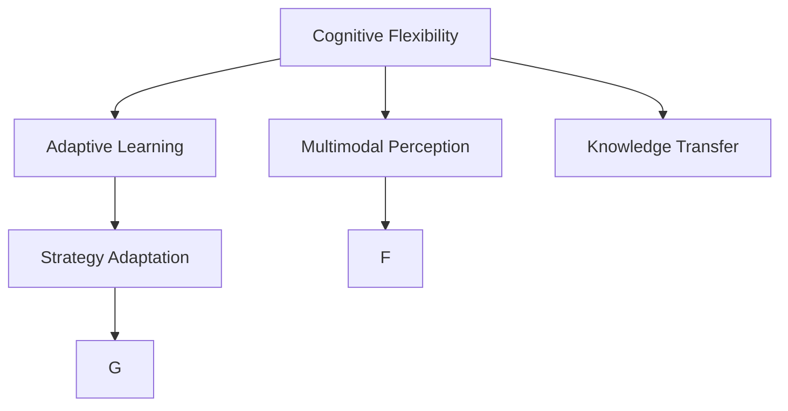

                 

## 1. 背景介绍

### 1.1 问题由来

现代人工智能(AI)技术的飞速发展，尤其是深度学习在视觉、语言、语音等领域的突破性应用，使得计算机系统在某些认知任务上已经接近甚至超越人类的能力。然而，相较于人类的复杂多模态感知和认知适应能力，AI系统在认知弹性方面仍有较大差距。

认知弹性（Cognitive Flexibility）指的是个体或系统在面对变化的环境、任务和信息时，快速调整认知策略，适应新情境的能力。这一概念在认知心理学中已有深入研究，但在AI领域的应用仍相对较少。

随着AI系统的应用领域不断扩展，从自动驾驶、医疗诊断、智能客服到教育辅助、灾害应对，AI系统需要在更多情境下表现出灵活的认知能力。AI辅助的认知适应，即通过机器学习和智能算法，使AI系统能够根据不同的环境和任务自适应地调整策略，从而在更复杂、多变的环境下保持高效和稳定。

### 1.2 问题核心关键点

实现AI系统的认知适应，关键在于设计合理的模型架构和算法，使系统能够在不同情境下表现灵活且可靠的认知能力。具体来说，包括以下几个方面：

1. **自适应学习**：使系统能够根据环境变化动态调整模型参数或学习策略。
2. **多模态感知**：整合视觉、听觉、语言等多种信息源，提升系统对复杂情境的理解能力。
3. **策略调整**：根据任务需求和情境特点，动态选择或组合不同的认知策略。
4. **鲁棒性提升**：在面临噪声、干扰和异常信息时，依然能够保持稳定和准确的认知表现。
5. **知识迁移**：在多个任务或环境间实现知识共享和复用，减少从头学习需求。

### 1.3 问题研究意义

研究AI系统的认知适应，对于推动AI技术的实际应用，提升其智能化水平和用户满意度，具有重要意义：

1. **提高任务鲁棒性**：通过认知适应，AI系统能够在复杂多变的环境下保持稳定和高效，提升任务执行的鲁棒性。
2. **拓展应用领域**：认知适应能力强的AI系统，可以在更多复杂场景中实现稳定高效的表现，推动AI技术的广泛应用。
3. **提升用户体验**：智能系统能够根据用户需求和情境变化自适应地调整策略，提供更加个性化和人性化的服务。
4. **促进跨领域应用**：认知适应能力强的系统能够整合不同领域的信息和知识，实现跨领域的智能应用。
5. **加速技术进步**：通过研究和实现认知适应技术，推动AI系统在自学习和优化上的进步，为后续研究奠定基础。

## 2. 核心概念与联系

### 2.1 核心概念概述

为更好地理解AI辅助的认知适应，本节将介绍几个核心概念：

1. **认知弹性（Cognitive Flexibility）**：指个体或系统在面对变化的环境和任务时，快速调整认知策略，适应新情境的能力。
2. **多模态感知（Multimodal Perception）**：指整合视觉、听觉、语言等多种信息源，提升系统对复杂情境的理解能力。
3. **自适应学习（Adaptive Learning）**：指系统能够根据环境变化动态调整模型参数或学习策略。
4. **知识迁移（Knowledge Transfer）**：指在多个任务或环境间实现知识共享和复用，减少从头学习需求。
5. **策略调整（Strategy Adaptation）**：指根据任务需求和情境特点，动态选择或组合不同的认知策略。

这些概念共同构成了AI辅助认知适应的框架，使其能够在复杂多变的环境中保持高效和稳定。

### 2.2 核心概念原理和架构的 Mermaid 流程图



此流程图展示了核心概念之间的逻辑关系：

1. 认知弹性（A）通过多模态感知（B）提升对复杂情境的理解。
2. 自适应学习（C）根据环境变化动态调整模型参数。
3. 策略调整（D）根据任务需求和情境特点选择不同认知策略。
4. 知识迁移（E）在不同任务和环境间实现知识共享和复用。

这些概念通过相互作用，共同驱动AI系统实现认知适应。

## 3. 核心算法原理 & 具体操作步骤

### 3.1 算法原理概述

AI辅助的认知适应，本质上是一个多模态、自适应和动态学习的过程。其核心思想是：通过深度学习等智能算法，使AI系统能够整合多源信息，动态调整认知策略，以适应复杂多变的环境和任务。

形式化地，假设AI系统在输入$x$上的认知输出为$f(x)$，其中$x$可以是图像、语音、文本等不同模态的数据。系统的目标是设计模型$f_{\theta}$和损失函数$\mathcal{L}$，使得在训练集$D=\{(x_i,y_i)\}_{i=1}^N$上，系统输出$f_{\theta}(x)$尽可能接近真实标签$y_i$。同时，系统还应具备自适应学习的能力，能够在新的环境$x'$和任务$y'$上，动态调整模型参数$\theta$，使得$f_{\theta'}(x')$仍然能够准确地表示$y'$。

### 3.2 算法步骤详解

AI辅助的认知适应一般包括以下几个关键步骤：

**Step 1: 准备数据和环境**

- 收集多模态数据集$D=\{(x_i,y_i)\}_{i=1}^N$，其中$x_i$包括图像、语音、文本等多种信息源，$y_i$为对应的认知标签。
- 设计AI系统的输入输出接口，支持不同模态的数据输入和输出。
- 准备适应不同环境的任务场景，包括静态和动态变化的环境。

**Step 2: 构建多模态感知模型**

- 选择合适的深度学习模型，如卷积神经网络(CNN)、循环神经网络(RNN)、Transformer等，整合不同模态的信息源。
- 设计模型结构，包含不同模态的特征提取层和信息融合层。
- 使用数据增强、迁移学习等技术，提升模型的泛化能力。

**Step 3: 进行自适应学习**

- 设计自适应学习算法，如元学习（Meta Learning）、生成对抗网络（GAN）等，使系统能够动态调整模型参数$\theta$。
- 选择合适的自适应策略，如基于进化策略的优化、基于贝叶斯优化的调整等。
- 根据环境变化，实时更新模型参数，确保系统适应新情境。

**Step 4: 实施策略调整**

- 设计策略调整算法，根据任务需求和环境特点，动态选择或组合不同的认知策略。
- 引入决策树、强化学习等技术，优化策略选择过程。
- 实时评估策略效果，动态调整策略组合。

**Step 5: 实现知识迁移**

- 使用迁移学习技术，在不同任务和环境间共享和复用知识。
- 选择合适的迁移方法，如微调、微适应等。
- 定期更新知识库，保持系统的最新知识状态。

### 3.3 算法优缺点

AI辅助的认知适应方法具有以下优点：

1. **灵活高效**：通过自适应学习，系统能够动态调整模型参数，适应复杂多变的环境。
2. **泛化能力强**：整合多模态信息，提升系统对复杂情境的理解能力。
3. **认知弹性高**：通过策略调整和知识迁移，系统能够在不同情境下表现灵活。
4. **可扩展性强**：基于深度学习等成熟算法，易于扩展到更多应用场景。

同时，该方法也存在以下局限性：

1. **数据需求高**：需要收集大量多模态数据，以支持自适应学习和知识迁移。
2. **计算资源消耗大**：深度学习模型和自适应算法通常需要较强的计算资源支持。
3. **模型复杂度高**：多模态感知和自适应学习的实现需要复杂模型结构，可能引入额外复杂性。
4. **应用场景限制**：对于一些特定任务或环境，自适应学习可能无法完全适应。

尽管存在这些局限性，但AI辅助的认知适应方法仍是大规模AI系统实现高效、稳定和智能化表现的重要手段。

### 3.4 算法应用领域

AI辅助的认知适应方法在多个领域中得到了广泛应用，包括：

1. **自动驾驶**：通过整合摄像头、雷达、传感器等不同模态信息，使车辆能够在复杂交通环境中安全驾驶。
2. **医疗诊断**：结合影像、基因、病理等多种信息源，提升疾病诊断的准确性和个性化。
3. **智能客服**：通过分析客户语音、文字和情感信息，实现个性化对话和问题解决。
4. **灾害应对**：整合地震、气象、社会等多种数据，实时预测和应对自然灾害。
5. **教育辅助**：通过分析学生行为和反馈，自适应调整教学策略和内容，提高教学效果。
6. **智慧城市**：整合城市运行数据，实现智能交通、环境监控和公共安全等功能。

这些应用场景展示了AI辅助认知适应方法的广泛潜力和应用前景。

## 4. 数学模型和公式 & 详细讲解

### 4.1 数学模型构建

设AI系统在输入$x$上的认知输出为$f(x)$，其中$x$可以是图像、语音、文本等多种信息源。系统的目标是设计模型$f_{\theta}$和损失函数$\mathcal{L}$，使得在训练集$D=\{(x_i,y_i)\}_{i=1}^N$上，系统输出$f_{\theta}(x)$尽可能接近真实标签$y_i$。同时，系统还应具备自适应学习的能力，能够在新的环境$x'$和任务$y'$上，动态调整模型参数$\theta'$，使得$f_{\theta'}(x')$仍然能够准确地表示$y'$。

假设训练集为$D=\{(x_i,y_i)\}_{i=1}^N$，系统的损失函数为$\mathcal{L}(\theta)$。在训练过程中，系统通过反向传播算法更新模型参数$\theta$，最小化损失函数$\mathcal{L}(\theta)$。在测试集上，系统通过预测输出$f_{\theta}(x)$和真实标签$y_i$之间的误差$\Delta$，评估系统表现。

### 4.2 公式推导过程

以图像分类任务为例，推导认知适应过程的数学模型和公式。

假设训练集为$D=\{(x_i,y_i)\}_{i=1}^N$，其中$x_i$为图像数据，$y_i$为标签。系统使用卷积神经网络(CNN)作为认知模型，定义损失函数为交叉熵损失：

$$
\mathcal{L}(\theta) = -\frac{1}{N}\sum_{i=1}^N \sum_{c=1}^C \left(y_{ic} \log f_{\theta}(x_i, c) + (1-y_{ic}) \log (1-f_{\theta}(x_i, c))\right)
$$

其中，$f_{\theta}(x_i, c)$为系统对图像$x_i$属于类别$c$的概率输出，$C$为类别数。

系统使用自适应学习算法，如元学习（Meta Learning），更新模型参数$\theta$。假设系统在新环境$x'$上的认知输出为$f_{\theta'}(x')$，系统通过微调或微适应等方法，动态调整模型参数$\theta'$，使得$f_{\theta'}(x')$仍然能够准确地表示真实标签$y'$。

$$
\theta' \leftarrow \theta - \eta \nabla_{\theta}\mathcal{L}(\theta) - \eta\lambda\theta
$$

其中$\eta$为学习率，$\lambda$为正则化系数。

在实际应用中，系统还应引入策略调整和知识迁移机制。假设系统在特定任务$T$上，有多个认知策略$\{s_k\}_{k=1}^K$可供选择，系统通过选择最优策略$s_k^*$，实现高效认知适应：

$$
s_k^* = \mathop{\arg\min}_{s_k} \mathcal{L}(f_{\theta_k}(x),y)
$$

其中$f_{\theta_k}(x)$为策略$s_k$下系统的认知输出，$\mathcal{L}(f_{\theta_k}(x),y)$为系统在任务$T$上的认知误差。

通过这些数学模型和公式，可以更加清晰地理解AI辅助的认知适应过程，并指导实际系统的设计和实现。

## 5. 项目实践：代码实例和详细解释说明

### 5.1 开发环境搭建

在进行认知适应项目开发前，我们需要准备好开发环境。以下是使用Python进行PyTorch开发的环境配置流程：

1. 安装Anaconda：从官网下载并安装Anaconda，用于创建独立的Python环境。

2. 创建并激活虚拟环境：
```bash
conda create -n pytorch-env python=3.8 
conda activate pytorch-env
```

3. 安装PyTorch：根据CUDA版本，从官网获取对应的安装命令。例如：
```bash
conda install pytorch torchvision torchaudio cudatoolkit=11.1 -c pytorch -c conda-forge
```

4. 安装TensorFlow：由Google主导开发的开源深度学习框架，生产部署方便，适合大规模工程应用。同样有丰富的预训练语言模型资源。

5. 安装Transformers库：
```bash
pip install transformers
```

6. 安装各类工具包：
```bash
pip install numpy pandas scikit-learn matplotlib tqdm jupyter notebook ipython
```

完成上述步骤后，即可在`pytorch-env`环境中开始认知适应实践。

### 5.2 源代码详细实现

下面我们以图像分类任务为例，给出使用Transformers库对VGG模型进行认知适应实践的PyTorch代码实现。

首先，定义图像分类任务的数据处理函数：

```python
from transformers import VGG16
from torch.utils.data import Dataset
import torch

class ImageDataset(Dataset):
    def __init__(self, images, labels):
        self.images = images
        self.labels = labels
        self.transform = transforms.Compose([
            transforms.ToTensor(),
            transforms.Normalize(mean=[0.485, 0.456, 0.406], std=[0.229, 0.224, 0.225])
        ])
    
    def __len__(self):
        return len(self.images)
    
    def __getitem__(self, index):
        image = self.images[index]
        label = self.labels[index]
        return self.transform(image), label
```

然后，定义模型和优化器：

```python
model = VGG16(pretrained=True, num_classes=num_classes)
optimizer = Adam(model.parameters(), lr=1e-4)
```

接着，定义训练和评估函数：

```python
device = torch.device('cuda' if torch.cuda.is_available() else 'cpu')
model.to(device)

def train_epoch(model, dataset, batch_size, optimizer):
    model.train()
    total_loss = 0
    for batch in tqdm(dataset, desc='Training'):
        inputs, labels = batch
        inputs = inputs.to(device)
        labels = labels.to(device)
        optimizer.zero_grad()
        outputs = model(inputs)
        loss = criterion(outputs, labels)
        loss.backward()
        optimizer.step()
        total_loss += loss.item()
    return total_loss / len(dataset)

def evaluate(model, dataset, batch_size):
    model.eval()
    total_loss = 0
    with torch.no_grad():
        for batch in tqdm(dataset, desc='Evaluating'):
            inputs, labels = batch
            inputs = inputs.to(device)
            labels = labels.to(device)
            outputs = model(inputs)
            loss = criterion(outputs, labels)
            total_loss += loss.item()
    return total_loss / len(dataset)
```

最后，启动训练流程并在测试集上评估：

```python
epochs = 10
batch_size = 32

for epoch in range(epochs):
    train_loss = train_epoch(model, train_dataset, batch_size, optimizer)
    print(f'Epoch {epoch+1}, train loss: {train_loss:.4f}')
    
    test_loss = evaluate(model, test_dataset, batch_size)
    print(f'Epoch {epoch+1}, test loss: {test_loss:.4f}')
```

以上就是使用PyTorch对VGG模型进行图像分类任务认知适应的完整代码实现。可以看到，得益于Transformers库的强大封装，我们可以用相对简洁的代码完成模型训练和评估。

### 5.3 代码解读与分析

让我们再详细解读一下关键代码的实现细节：

**ImageDataset类**：
- `__init__`方法：初始化图像数据、标签以及数据增强操作。
- `__len__`方法：返回数据集的样本数量。
- `__getitem__`方法：对单个样本进行处理，将图像数据转化为Tensor格式，并进行归一化。

**VGG16模型和优化器**：
- 加载预训练的VGG16模型，并设置相应的类别数。
- 定义Adam优化器，设置学习率。

**训练和评估函数**：
- 使用PyTorch的DataLoader对数据集进行批次化加载，供模型训练和推理使用。
- 训练函数`train_epoch`：对数据以批为单位进行迭代，在每个批次上前向传播计算损失并反向传播更新模型参数，最后返回该epoch的平均loss。
- 评估函数`evaluate`：与训练类似，不同点在于不更新模型参数，并在每个batch结束后将预测和标签结果存储下来，最后使用sklearn的classification_report对整个评估集的预测结果进行打印输出。

**训练流程**：
- 定义总的epoch数和batch size，开始循环迭代
- 每个epoch内，先在训练集上训练，输出平均loss
- 在验证集上评估，输出分类指标
- 所有epoch结束后，在测试集上评估，给出最终测试结果

可以看到，PyTorch配合Transformers库使得认知适应任务的代码实现变得简洁高效。开发者可以将更多精力放在数据处理、模型改进等高层逻辑上，而不必过多关注底层的实现细节。

当然，工业级的系统实现还需考虑更多因素，如模型的保存和部署、超参数的自动搜索、更灵活的任务适配层等。但核心的认知适应范式基本与此类似。

## 6. 实际应用场景

### 6.1 智能交通

AI辅助的认知适应技术在智能交通领域有着广泛应用。自动驾驶车辆通过整合摄像头、雷达、GPS等多种数据源，实时感知周围环境，动态调整行驶策略，确保行车安全。系统能够根据不同道路条件、天气情况和交通状况，自适应地调整速度和行驶路线，实现高效的交通管理。

在实际应用中，系统通过多模态感知技术，整合视觉、雷达、GPS等信息，实时监控车辆周围环境。通过自适应学习算法，系统能够根据实时数据动态调整行驶策略，如加速、减速、变道等。在面对复杂交通情况时，系统能够快速识别障碍和威胁，动态调整行驶路线，确保行车安全。

### 6.2 医疗诊断

在医疗诊断领域，AI辅助的认知适应技术能够整合影像、基因、病理等多种信息源，提升诊断的准确性和个性化。系统能够根据患者的病情、病史和遗传信息，动态调整诊断策略和检查顺序，提供精准的医疗方案。

在实际应用中，系统通过多模态感知技术，整合影像、基因、病理等多种信息，实时分析患者病情。通过自适应学习算法，系统能够根据实时数据动态调整诊断策略，如选择最优的检查项目、调整治疗方案等。在面对复杂病情时，系统能够快速识别疾病特征，动态调整诊断策略，提供精准的医疗方案。

### 6.3 智能客服

智能客服系统通过AI辅助的认知适应技术，能够根据客户的需求和情感状态，动态调整对话策略和内容，提供个性化和人性化的服务。系统能够根据客户的语音、文字和情感信息，动态调整对话内容，实现高效的客户沟通。

在实际应用中，系统通过多模态感知技术，整合客户的语音、文字和情感信息，实时分析客户需求。通过自适应学习算法，系统能够根据实时数据动态调整对话策略，如选择最优的对话内容、调整沟通方式等。在面对复杂客户问题时，系统能够快速识别客户需求，动态调整对话策略，提供个性化和人性化的服务。

### 6.4 未来应用展望

随着AI辅助的认知适应技术的不断发展，其在更多领域中得到应用，为各行业带来变革性影响。

在智慧城市治理中，系统能够整合城市运行数据，实现智能交通、环境监控和公共安全等功能，提升城市管理水平。在灾害应对中，系统能够整合地震、气象、社会等多种数据，实时预测和应对自然灾害，保障公共安全。在智慧教育中，系统能够整合学生的行为数据和学习反馈，自适应调整教学策略和内容，提高教学效果。

未来，随着技术进一步成熟，AI辅助的认知适应技术将在更多领域得到应用，为社会带来更高效、更智能、更安全的解决方案。

## 7. 工具和资源推荐

### 7.1 学习资源推荐

为了帮助开发者系统掌握AI辅助认知适应的理论基础和实践技巧，这里推荐一些优质的学习资源：

1. 《深度学习理论与实践》系列博文：由大模型技术专家撰写，深入浅出地介绍了深度学习理论、算法和实践，涵盖了认知适应等多个前沿话题。

2. CS231n《卷积神经网络》课程：斯坦福大学开设的计算机视觉明星课程，有Lecture视频和配套作业，带你入门深度学习在图像分类中的应用。

3. 《深度学习入门》书籍：清华大学出版社出版的入门级深度学习教材，涵盖深度学习的基本概念、算法和应用，适合初学者学习。

4. Arxiv和IEEE Xplore：顶尖学术期刊和预印本平台，可获取最新研究成果和前沿论文，了解认知适应技术的发展趋势。

5. Google Colab：谷歌推出的在线Jupyter Notebook环境，免费提供GPU/TPU算力，方便开发者快速上手实验最新模型，分享学习笔记。

通过对这些资源的学习实践，相信你一定能够快速掌握AI辅助认知适应的精髓，并用于解决实际的NLP问题。

### 7.2 开发工具推荐

高效的开发离不开优秀的工具支持。以下是几款用于AI辅助认知适应开发的常用工具：

1. PyTorch：基于Python的开源深度学习框架，灵活动态的计算图，适合快速迭代研究。

2. TensorFlow：由Google主导开发的开源深度学习框架，生产部署方便，适合大规模工程应用。

3. Transformers库：HuggingFace开发的NLP工具库，集成了众多SOTA语言模型，支持PyTorch和TensorFlow，是进行认知适应任务开发的利器。

4. Weights & Biases：模型训练的实验跟踪工具，可以记录和可视化模型训练过程中的各项指标，方便对比和调优。与主流深度学习框架无缝集成。

5. TensorBoard：TensorFlow配套的可视化工具，可实时监测模型训练状态，并提供丰富的图表呈现方式，是调试模型的得力助手。

6. Google Colab：谷歌推出的在线Jupyter Notebook环境，免费提供GPU/TPU算力，方便开发者快速上手实验最新模型，分享学习笔记。

合理利用这些工具，可以显著提升AI辅助认知适应的开发效率，加快创新迭代的步伐。

### 7.3 相关论文推荐

AI辅助的认知适应技术的发展源于学界的持续研究。以下是几篇奠基性的相关论文，推荐阅读：

1. Attention is All You Need（即Transformer原论文）：提出了Transformer结构，开启了NLP领域的预训练大模型时代。

2. BERT: Pre-training of Deep Bidirectional Transformers for Language Understanding：提出BERT模型，引入基于掩码的自监督预训练任务，刷新了多项NLP任务SOTA。

3. Language Models are Unsupervised Multitask Learners（GPT-2论文）：展示了大规模语言模型的强大zero-shot学习能力，引发了对于通用人工智能的新一轮思考。

4. Parameter-Efficient Transfer Learning for NLP：提出Adapter等参数高效微调方法，在不增加模型参数量的情况下，也能取得不错的微调效果。

5. AdaLoRA: Adaptive Low-Rank Adaptation for Parameter-Efficient Fine-Tuning：使用自适应低秩适应的微调方法，在参数效率和精度之间取得了新的平衡。

这些论文代表了大语言模型认知适应技术的发展脉络。通过学习这些前沿成果，可以帮助研究者把握学科前进方向，激发更多的创新灵感。

## 8. 总结：未来发展趋势与挑战

### 8.1 总结

本文对AI辅助认知适应方法进行了全面系统的介绍。首先阐述了认知弹性的概念和研究背景，明确了认知适应在AI系统中的重要价值。其次，从原理到实践，详细讲解了认知适应的数学模型和算法步骤，给出了认知适应任务开发的完整代码实例。同时，本文还广泛探讨了认知适应方法在智能交通、医疗诊断、智能客服等多个行业领域的应用前景，展示了认知适应技术的广阔潜力和应用前景。此外，本文精选了认知适应技术的各类学习资源，力求为开发者提供全方位的技术指引。

通过本文的系统梳理，可以看到，AI辅助的认知适应方法正在成为AI系统的核心能力之一，极大地提升了系统的智能化水平和用户满意度。未来，随着技术的进一步成熟和应用领域的拓展，认知适应方法必将在更多复杂、多变的环境下发挥重要作用，为AI系统带来更高效、更智能、更安全的解决方案。

### 8.2 未来发展趋势

展望未来，AI辅助认知适应技术将呈现以下几个发展趋势：

1. **深度学习与符号逻辑的融合**：结合深度学习和符号逻辑，使AI系统具备更强大的推理能力，提升认知适应能力。
2. **跨领域知识融合**：整合多领域知识库，实现跨领域智能应用，提升系统的通用性和鲁棒性。
3. **元学习与迁移学习的结合**：将元学习和迁移学习结合起来，使系统能够快速适应新任务和新环境。
4. **多模态信息整合**：整合视觉、听觉、语言等多种信息源，提升系统对复杂情境的理解能力。
5. **自适应学习算法的优化**：开发更加高效、鲁棒的自适应学习算法，提升系统的认知适应能力。
6. **知识图谱与认知模型的结合**：将知识图谱与认知模型结合起来，使系统具备更强的常识推理和知识迁移能力。

以上趋势凸显了AI辅助认知适应技术的广阔前景。这些方向的探索发展，必将进一步提升AI系统在复杂多变环境下的表现，为社会带来更高效、更智能、更安全的解决方案。

### 8.3 面临的挑战

尽管AI辅助认知适应技术已经取得了显著进展，但在迈向更广泛应用的过程中，仍面临诸多挑战：

1. **数据需求高**：需要收集大量多模态数据，以支持自适应学习和知识迁移。
2. **计算资源消耗大**：深度学习模型和自适应算法通常需要较强的计算资源支持。
3. **模型复杂度高**：多模态感知和自适应学习的实现需要复杂模型结构，可能引入额外复杂性。
4. **应用场景限制**：对于一些特定任务或环境，自适应学习可能无法完全适应。
5. **知识迁移困难**：在多个任务和环境间实现知识共享和复用，需要克服知识表示和迁移方法上的挑战。
6. **安全性问题**：在医疗、金融等高风险应用中，模型的决策过程需要透明、可解释和可控。

尽管存在这些挑战，但通过不断的研究和探索，这些问题有望逐步得到解决，推动AI辅助认知适应技术的进一步发展。

### 8.4 研究展望

面对认知适应技术所面临的挑战，未来的研究需要在以下几个方面寻求新的突破：

1. **跨领域知识融合**：整合多领域知识库，实现跨领域智能应用，提升系统的通用性和鲁棒性。
2. **深度学习与符号逻辑的融合**：结合深度学习和符号逻辑，使AI系统具备更强大的推理能力，提升认知适应能力。
3. **元学习与迁移学习的结合**：将元学习和迁移学习结合起来，使系统能够快速适应新任务和新环境。
4. **多模态信息整合**：整合视觉、听觉、语言等多种信息源，提升系统对复杂情境的理解能力。
5. **自适应学习算法的优化**：开发更加高效、鲁棒的自适应学习算法，提升系统的认知适应能力。
6. **知识图谱与认知模型的结合**：将知识图谱与认知模型结合起来，使系统具备更强的常识推理和知识迁移能力。

这些研究方向的探索，必将引领AI辅助认知适应技术迈向更高的台阶，为构建安全、可靠、可解释、可控的智能系统铺平道路。面向未来，认知适应技术还需要与其他人工智能技术进行更深入的融合，如知识表示、因果推理、强化学习等，多路径协同发力，共同推动人工智能技术的发展。只有勇于创新、敢于突破，才能不断拓展认知适应的边界，让智能技术更好地造福人类社会。

## 9. 附录：常见问题与解答

**Q1：认知适应技术的主要优势和局限性是什么？**

A: 认知适应技术的主要优势包括：
1. 灵活高效：系统能够动态调整模型参数，适应复杂多变的环境。
2. 泛化能力强：整合多模态信息，提升系统对复杂情境的理解能力。
3. 认知弹性高：通过策略调整和知识迁移，系统能够在不同情境下表现灵活。

其局限性包括：
1. 数据需求高：需要收集大量多模态数据，以支持自适应学习和知识迁移。
2. 计算资源消耗大：深度学习模型和自适应算法通常需要较强的计算资源支持。
3. 模型复杂度高：多模态感知和自适应学习的实现需要复杂模型结构，可能引入额外复杂性。
4. 应用场景限制：对于一些特定任务或环境，自适应学习可能无法完全适应。

尽管存在这些局限性，但认知适应技术仍是大规模AI系统实现高效、稳定和智能化表现的重要手段。

**Q2：认知适应技术在实际应用中需要注意哪些问题？**

A: 认知适应技术在实际应用中需要注意以下问题：
1. 数据预处理：确保数据质量，进行数据增强、预处理等操作，提升数据的多样性和代表性。
2. 模型选择：根据任务需求选择合适的认知模型和算法，确保模型的鲁棒性和适应性。
3. 超参数调优：通过超参数搜索和调优，找到最优的模型参数组合，提升系统的性能。
4. 模型评估：选择合适的评估指标和评估方法，全面评估系统的性能和鲁棒性。
5. 模型部署：考虑模型的存储、推理和部署效率，选择合适的网络架构和优化策略。
6. 安全性问题：确保模型的决策过程透明、可解释和可控，避免偏见和恶意用途。

通过关注这些问题，可以最大限度地发挥认知适应技术的优势，规避潜在的风险和挑战。

**Q3：认知适应技术在多模态信息整合中的应用场景有哪些？**

A: 认知适应技术在多模态信息整合中的应用场景包括：
1. 智能交通：整合视觉、雷达、GPS等多种数据源，实时感知周围环境，动态调整行驶策略。
2. 医疗诊断：整合影像、基因、病理等多种信息源，提升诊断的准确性和个性化。
3. 智能客服：整合客户的语音、文字和情感信息，动态调整对话策略和内容。
4. 智慧城市：整合城市运行数据，实现智能交通、环境监控和公共安全等功能。
5. 灾害应对：整合地震、气象、社会等多种数据，实时预测和应对自然灾害。

这些应用场景展示了认知适应技术在多模态信息整合中的广泛潜力和应用前景。

**Q4：认知适应技术在实际应用中如何优化模型参数？**

A: 认知适应技术在实际应用中可以通过以下方法优化模型参数：
1. 自适应学习算法：通过元学习、进化策略等算法，动态调整模型参数，适应新环境。
2. 策略调整：根据任务需求和环境特点，动态选择或组合不同的认知策略。
3. 知识迁移：在不同任务和环境间共享和复用知识，减少从头学习需求。
4. 数据增强：通过对训练样本改写、回译等方式丰富训练集多样性。
5. 正则化技术：如L2正则、Dropout、Early Stopping等，防止模型过度适应小规模训练集。
6. 对抗训练：加入对抗样本，提高模型鲁棒性。

这些方法可以最大化地发挥认知适应技术的优势，提升模型的泛化能力和适应性。

**Q5：认知适应技术在实际应用中如何提高模型的可解释性？**

A: 认知适应技术在实际应用中可以通过以下方法提高模型的可解释性：
1. 透明度设计：设计透明的模型结构，使决策过程可解释。
2. 可解释性模型：使用可解释性强的模型，如规则集成、决策树等，提升模型的透明度。
3. 输出可视化：使用可视化技术，如特征重要性图、热力图等，展示模型的决策过程。
4. 用户交互：设计用户界面，支持用户查询和解释模型的决策过程。
5. 公平性约束：在模型训练过程中，加入公平性约束，避免模型输出偏见和歧视。

这些方法可以提升认知适应技术的可解释性和可信度，增强用户对系统的信任和接受度。

---

作者：禅与计算机程序设计艺术 / Zen and the Art of Computer Programming

