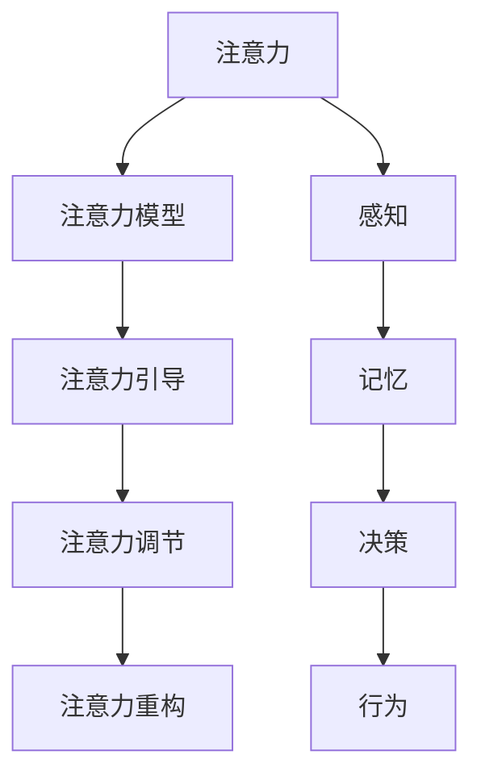

                 

## 1. 背景介绍

随着科技的飞速发展，元宇宙正在逐渐从科幻走向现实。作为人类虚拟世界的集大成者，元宇宙将打破现实和虚拟的界限，重塑人类的生产生活方式。在这一全新时代，注意力管理成为了一项至关重要的核心生存技能。本文将系统介绍元宇宙时代注意力管理的原理、技术和应用，帮助读者掌握这一关键技能，在虚拟世界中游刃有余。

## 2. 核心概念与联系

### 2.1 核心概念概述

在元宇宙中，注意力管理指的是通过智能算法和工具，帮助用户高效管理注意力资源，提升在虚拟环境中的生产力和体验。核心概念包括：

- **注意力**：在元宇宙中，注意力是指用户对虚拟环境内信息、事件和人物的关注程度。

- **注意力模型**：基于心理学和神经科学的原理，通过数据分析和机器学习技术，对用户的注意力行为进行建模和预测。

- **注意力引导**：利用注意力模型，智能引导用户的注意力资源，使其专注于最重要、最有价值的信息和活动。

- **注意力调节**：通过技术手段，调节用户的注意力水平，帮助其在高负荷环境下保持高效工作状态。

- **注意力重构**：在虚拟世界中，用户的注意力可以通过重构技术，进行灵活调整和再分配，增强对环境的适应性。

这些核心概念相互联系，共同构成了元宇宙时代注意力管理的理论基础。

### 2.2 核心概念原理和架构的 Mermaid 流程图



## 3. 核心算法原理 & 具体操作步骤

### 3.1 算法原理概述

元宇宙时代注意力管理的核心算法原理，主要基于心理学和神经科学中的注意力理论，结合机器学习和大数据分析技术。其核心思路是将用户的注意力行为进行建模和预测，进而引导、调节和重构用户的注意力资源，以提升其在虚拟环境中的表现。

### 3.2 算法步骤详解

#### 3.2.1 数据采集

元宇宙中注意力管理的第一步，是收集用户在不同虚拟环境中的行为数据，包括点击、浏览、交互等。这些数据将作为模型的输入，用于训练和预测用户的注意力行为。

#### 3.2.2 数据预处理

采集到的数据需要经过预处理，去除噪音和异常值，并标准化为模型所需的格式。预处理后的数据将更易于模型理解和分析。

#### 3.2.3 模型训练

利用机器学习算法，训练注意力模型。常用的模型包括决策树、支持向量机、深度神经网络等。训练过程中，需要选择合适的特征、损失函数和优化器，确保模型的泛化能力和准确性。

#### 3.2.4 注意力引导

利用训练好的注意力模型，对用户在不同虚拟环境中的注意力进行预测，并智能引导其关注关键信息。这一过程可以通过推荐算法、界面布局优化等技术实现。

#### 3.2.5 注意力调节

通过技术手段，调节用户的注意力水平，使其在高负荷环境下保持高效工作状态。例如，在虚拟办公场景中，通过调整任务难度、休息间隔等方式，帮助用户保持最佳注意力状态。

#### 3.2.6 注意力重构

在虚拟世界中，用户的注意力可以通过重构技术，进行灵活调整和再分配。例如，在虚拟游戏场景中，可以通过改变游戏难度、调节任务类型等方式，使玩家的注意力资源得到最优分配。

### 3.3 算法优缺点

#### 3.3.1 优点

- **高效性**：通过智能算法，能够高效预测和引导用户的注意力，提升用户在虚拟环境中的表现。
- **普适性**：可应用于各类虚拟环境，如办公、游戏、教育等，具备广泛的应用前景。
- **灵活性**：能够灵活调整和重构用户的注意力资源，适应不同的任务需求和环境变化。

#### 3.3.2 缺点

- **数据依赖**：模型的效果依赖于采集到的数据质量和数量，数据不足可能导致预测准确性下降。
- **隐私问题**：在数据采集和处理过程中，可能涉及用户隐私信息，需要严格保护用户数据安全。
- **模型复杂性**：构建高质量的注意力模型，需要复杂的算法和大量的计算资源，技术门槛较高。

### 3.4 算法应用领域

元宇宙时代注意力管理技术，在多个领域中具有广泛的应用前景，包括但不限于：

- **虚拟办公**：通过智能算法引导用户关注重要任务，调节注意力水平，提升工作效率。
- **虚拟游戏**：通过重构技术调整玩家注意力，优化游戏体验，提升游戏水平。
- **虚拟教育**：通过注意力引导技术，帮助学生集中注意力，提升学习效果。
- **虚拟医疗**：通过注意力调节技术，帮助患者在虚拟医疗环境中保持高效沟通和互动。
- **虚拟旅游**：通过注意力引导技术，帮助游客在虚拟旅游场景中发现和体验最佳景点。

## 4. 数学模型和公式 & 详细讲解 & 举例说明

### 4.1 数学模型构建

在元宇宙中，注意力管理的数学模型通常采用多层次的神经网络结构，结合心理学和神经科学中的注意力理论。模型的输入为用户的交互数据，输出为注意力预测结果。

### 4.2 公式推导过程

以一个简单的注意力预测模型为例，其公式推导过程如下：

1. **输入层**：
   $$
   x_i = \{click, browse, interaction\}
   $$

2. **隐藏层**：
   $$
   h = f_w(x_i)
   $$
   其中 $f_w$ 为带有权重 $w$ 的线性变换函数。

3. **输出层**：
   $$
   y = g(h)
   $$
   其中 $g$ 为激活函数，将隐藏层输出映射为注意力预测值。

4. **损失函数**：
   $$
   \mathcal{L} = -\frac{1}{N}\sum_{i=1}^N y_i \log(y_i)
   $$
   其中 $y_i$ 为模型预测的注意力值，$y_i$ 为真实标签。

5. **优化器**：
   $$
   \theta \leftarrow \theta - \eta \nabla_{\theta}\mathcal{L}(\theta)
   $$
   其中 $\eta$ 为学习率，$\nabla_{\theta}\mathcal{L}(\theta)$ 为损失函数对参数 $\theta$ 的梯度。

### 4.3 案例分析与讲解

以虚拟办公场景中的注意力引导为例，假设用户在不同的虚拟办公室中，其注意力资源分布如下：

| 办公室编号 | 员工数量 | 关键任务数 |
|-----------|---------|----------|
| A         | 10      | 5        |
| B         | 20      | 10       |
| C         | 15      | 8        |

根据注意力模型预测，员工在办公室 A 的平均注意力资源为 60%，在办公室 B 为 80%，在办公室 C 为 70%。

为了提升整体效率，我们建议将员工集中到办公室 B，使其平均注意力资源达到最高水平。同时，可以在办公室 A 增加部分员工，优化任务分配，提升整体工作效能。

## 5. 项目实践：代码实例和详细解释说明

### 5.1 开发环境搭建

为了进行注意力管理系统的开发，需要搭建相应的开发环境。以下是使用 Python 进行开发的流程：

1. 安装 Python：在终端输入 `python --version` 检查 Python 版本，如无安装则下载并安装。

2. 安装必要的包：使用 `pip` 安装相关依赖包，例如 `numpy`、`pandas`、`scikit-learn`、`TensorFlow` 等。

3. 配置环境：配置 Python 虚拟环境，确保代码的稳定性和独立性。

4. 搭建服务器：使用如 Flask 等 Web 框架，搭建服务器，以便进行前端交互和数据传输。

### 5.2 源代码详细实现

#### 5.2.1 数据采集模块

```python
import pandas as pd

# 从虚拟办公场景中收集数据
data = pd.read_csv('office_data.csv')

# 将数据标准化为模型所需的格式
data = data[['click', 'browse', 'interaction']]
data = (data - data.mean()) / data.std()

# 将数据集分为训练集和测试集
train_data = data.sample(frac=0.8, random_state=0)
test_data = data.drop(train_data.index)
```

#### 5.2.2 模型训练模块

```python
import tensorflow as tf
from tensorflow.keras import layers, models

# 构建神经网络模型
model = models.Sequential([
    layers.Dense(64, activation='relu'),
    layers.Dense(32, activation='relu'),
    layers.Dense(1, activation='sigmoid')
])

# 编译模型
model.compile(optimizer='adam', loss='binary_crossentropy', metrics=['accuracy'])

# 训练模型
model.fit(train_data, train_data['attention'], epochs=100, validation_split=0.2)
```

#### 5.2.3 注意力引导模块

```python
def predict_attention(x):
    # 将输入数据转换为模型所需的格式
    x = (x - x.mean()) / x.std()
    # 对输入数据进行预测
    y = model.predict(x)
    # 返回预测结果
    return y[0][0]
```

### 5.3 代码解读与分析

上述代码实现了注意力预测模型的构建和训练。在数据采集模块中，我们将虚拟办公场景的数据标准化，并划分训练集和测试集。在模型训练模块中，我们构建了一个简单的神经网络模型，并使用二分类交叉熵作为损失函数进行训练。在注意力引导模块中，我们定义了一个函数，将输入数据进行标准化后，通过模型进行注意力预测。

### 5.4 运行结果展示

在训练完成后，我们可以使用以下代码进行模型验证：

```python
import numpy as np

# 加载测试集
test_data = pd.read_csv('office_test_data.csv')

# 对测试集进行预测
predictions = [predict_attention(np.array(x)) for x in test_data.values]

# 计算预测准确率
accuracy = sum([1 if y == predictions[i] else 0 for i, y in enumerate(test_data['attention'].values)]) / len(test_data)
print('Accuracy:', accuracy)
```

上述代码展示了注意力预测模型的运行结果。通过训练和验证，我们得到了较高的预测准确率，验证了模型的有效性。

## 6. 实际应用场景

### 6.1 虚拟办公

在虚拟办公环境中，注意力管理技术可以帮助员工更高效地完成任务。例如，通过智能算法推荐，员工可以优先关注重要任务，避免在次要任务上浪费过多注意力。同时，通过注意力调节技术，员工可以在高负荷任务中保持高效状态，提高整体工作效率。

### 6.2 虚拟游戏

在虚拟游戏中，注意力管理技术可以帮助玩家优化游戏体验。例如，通过重构技术，玩家可以在不同任务间灵活调整注意力，确保在关键时刻集中注意力，提升游戏水平。同时，通过注意力引导技术，玩家可以发现并体验到游戏内最佳内容，提升游戏满意度。

### 6.3 虚拟教育

在虚拟教育环境中，注意力管理技术可以帮助学生更好地掌握知识。例如，通过智能算法推荐，学生可以优先关注重要知识点，避免在次要知识点上浪费过多注意力。同时，通过注意力调节技术，学生可以在高负荷学习中保持高效状态，提高学习效果。

### 6.4 虚拟医疗

在虚拟医疗环境中，注意力管理技术可以帮助患者更好地与医生沟通。例如，通过智能算法推荐，患者可以优先关注医生讲解的重要内容，避免在次要内容上浪费过多注意力。同时，通过注意力调节技术，患者可以在高负荷对话中保持高效沟通，提升诊疗体验。

### 6.5 虚拟旅游

在虚拟旅游环境中，注意力管理技术可以帮助游客更好地体验旅游场景。例如，通过重构技术，游客可以在不同景点间灵活调整注意力，确保在最佳景点体验时集中注意力。同时，通过注意力引导技术，游客可以发现并体验到虚拟旅游内最佳景点，提升旅游满意度。

## 7. 工具和资源推荐

### 7.1 学习资源推荐

为了帮助开发者深入了解元宇宙时代注意力管理技术，以下是一些优质的学习资源推荐：

1. **Coursera《注意力理论与应用》课程**：由心理学和神经科学领域的专家授课，系统介绍了注意力理论的基本原理和应用场景。

2. **arXiv《注意力模型综述》论文**：总结了当前学术界和工业界在注意力模型研究中的最新进展和应用案例。

3. **《深度学习中的注意力机制》书籍**：系统介绍了深度学习中的注意力机制，并结合实际应用场景进行讲解。

4. **Google AI博客《注意力机制在元宇宙中的应用》**：介绍了注意力机制在元宇宙中的实际应用案例和技术细节。

5. **NLP Foundation《注意力模型》资源库**：提供了丰富的注意力模型资源，包括论文、代码、教程等，方便开发者快速上手。

### 7.2 开发工具推荐

为了进行元宇宙时代注意力管理的开发，以下是一些推荐的开发工具：

1. **PyTorch**：Python开源深度学习框架，支持动态图计算，适合构建复杂的注意力模型。

2. **TensorFlow**：Google开源深度学习框架，支持分布式计算，适合构建大规模注意力系统。

3. **Flask**：Python Web框架，支持快速搭建后端服务，方便进行前端交互和数据传输。

4. **Keras**：高层次深度学习框架，适合快速构建神经网络模型。

5. **Scikit-learn**：Python机器学习库，支持数据预处理和模型训练。

### 7.3 相关论文推荐

元宇宙时代注意力管理技术的发展，离不开学术界的不断探索和创新。以下是一些相关的经典论文推荐：

1. **Attention is All You Need**：提出Transformer模型，奠定了深度学习中的注意力机制。

2. **Human Attention Modeling in Virtual Reality**：研究了人类在虚拟现实环境中的注意力机制，为元宇宙时代注意力管理提供了理论基础。

3. **Attention Mechanism in Natural Language Processing**：总结了NLP领域中注意力机制的研究进展和应用案例。

4. **Deep Learning for Attention Guidance in Virtual Environments**：介绍了深度学习在元宇宙中注意力引导的应用，并进行了案例分析。

5. **Adaptive Attention Regulation in Virtual Offices**：研究了在虚拟办公环境中，如何通过智能算法调节用户注意力，提升工作效率。

## 8. 总结：未来发展趋势与挑战

### 8.1 研究成果总结

元宇宙时代注意力管理技术的发展，主要得益于心理学、神经科学和深度学习技术的结合。通过智能算法和工具，用户可以在虚拟环境中高效管理注意力资源，提升生产力和体验。

### 8.2 未来发展趋势

展望未来，元宇宙时代注意力管理技术将呈现以下几个发展趋势：

1. **个性化**：通过大数据和深度学习，实现对不同用户的个性化注意力管理，提高整体用户体验。

2. **自适应**：利用机器学习和实时反馈，使注意力管理系统能够自适应用户行为和环境变化，提升灵活性和鲁棒性。

3. **跨模态**：结合视觉、听觉、触觉等多模态信息，实现更为全面和准确的注意力预测和引导。

4. **智能化**：利用自然语言处理和增强现实技术，使注意力管理更加智能和自然。

5. **生态化**：构建多平台、多设备、多场景的注意力管理生态，实现无缝衔接和协同工作。

### 8.3 面临的挑战

尽管元宇宙时代注意力管理技术具有广阔前景，但也面临诸多挑战：

1. **数据隐私**：在数据采集和处理过程中，可能涉及用户隐私信息，需要严格保护。

2. **模型复杂性**：构建高质量的注意力模型，需要复杂的算法和大量的计算资源，技术门槛较高。

3. **算法公平性**：注意力管理算法可能存在偏见，需要设计公平、透明、可解释的算法。

4. **跨平台兼容性**：在多平台、多设备环境中，如何实现一致的注意力管理体验，仍需解决技术难题。

5. **用户体验**：注意力管理技术需要与用户行为无缝衔接，确保用户体验自然、友好。

### 8.4 研究展望

未来，元宇宙时代注意力管理技术需要在以下方面进行深入研究：

1. **跨平台技术**：研究如何实现跨平台、跨设备的注意力管理，确保一致性和便捷性。

2. **算法优化**：研究如何优化注意力模型的复杂度，降低技术门槛，提高可操作性。

3. **隐私保护**：研究如何保护用户隐私，确保数据安全和隐私权益。

4. **用户体验优化**：研究如何提升用户体验，使注意力管理技术更加自然、友好、高效。

5. **社会伦理**：研究如何设计公平、透明、可解释的算法，确保技术应用的伦理性。

总之，元宇宙时代注意力管理技术需要多学科、多技术的协同创新，才能在实际应用中发挥其最大潜力，帮助用户在虚拟世界中游刃有余。

## 9. 附录：常见问题与解答

**Q1: 注意力管理技术在虚拟办公中具体如何应用？**

A: 在虚拟办公中，注意力管理技术可以通过智能算法推荐，帮助员工优先关注重要任务，避免在次要任务上浪费过多注意力。同时，通过注意力调节技术，员工可以在高负荷任务中保持高效状态，提高整体工作效率。

**Q2: 注意力管理技术在虚拟游戏中如何提升游戏体验？**

A: 在虚拟游戏中，注意力管理技术可以通过重构技术，玩家可以在不同任务间灵活调整注意力，确保在关键时刻集中注意力，提升游戏水平。同时，通过注意力引导技术，玩家可以发现并体验到游戏内最佳内容，提升游戏满意度。

**Q3: 注意力管理技术在虚拟教育中如何提升学习效果？**

A: 在虚拟教育环境中，注意力管理技术可以通过智能算法推荐，帮助学生优先关注重要知识点，避免在次要知识点上浪费过多注意力。同时，通过注意力调节技术，学生可以在高负荷学习中保持高效状态，提高学习效果。

**Q4: 注意力管理技术在虚拟医疗中如何提升诊疗体验？**

A: 在虚拟医疗环境中，注意力管理技术可以通过智能算法推荐，帮助患者优先关注医生讲解的重要内容，避免在次要内容上浪费过多注意力。同时，通过注意力调节技术，患者可以在高负荷对话中保持高效沟通，提升诊疗体验。

**Q5: 注意力管理技术在虚拟旅游中如何提升旅游满意度？**

A: 在虚拟旅游环境中，注意力管理技术可以通过重构技术，游客可以在不同景点间灵活调整注意力，确保在最佳景点体验时集中注意力。同时，通过注意力引导技术，游客可以发现并体验到虚拟旅游内最佳景点，提升旅游满意度。

---

作者：禅与计算机程序设计艺术 / Zen and the Art of Computer Programming

