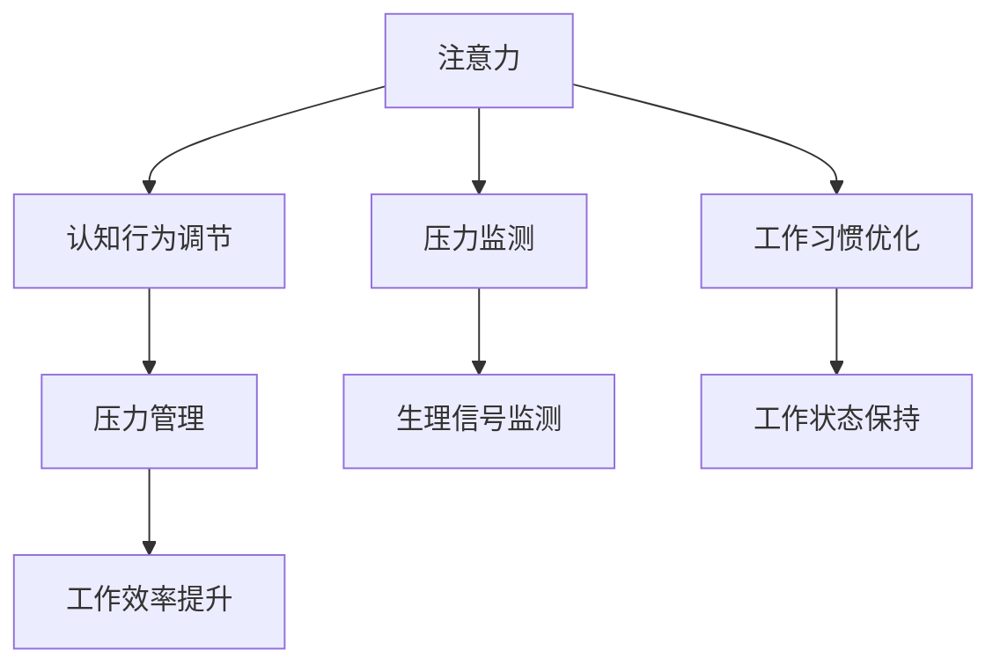

                 

# 注意力管理与压力管理实践：在压力和焦虑中保持专注

在快速发展的现代社会中，注意力和压力管理成为影响个人工作效率和心理健康的重要因素。如何在高压力和焦虑的环境中保持专注，成为人们普遍关心的问题。本文旨在探讨注意力管理和压力管理的基本原理和实践方法，帮助读者在面对复杂任务和心理压力时，保持高效和平衡。

## 1. 背景介绍

### 1.1 问题由来
随着信息技术的发展，人们的生活节奏加快，工作和学习压力不断增大。长时间高强度的工作、持续的学习任务，以及现代社会中的各种干扰因素，都容易导致注意力分散和心理压力积累。缺乏有效的注意力和压力管理方法，不仅影响工作效率，还可能引发焦虑、抑郁等心理问题。因此，掌握科学的注意力和压力管理方法，是提升个人生活质量和工作效率的关键。

### 1.2 问题核心关键点
注意力管理和压力管理包括多个方面：认知行为调节、心理状态控制、生理反应调节、工作习惯优化等。具体到技术实践中，可以采取数据驱动的智能算法，如机器学习、神经网络等，以识别和分析注意力和压力状态，并根据分析结果给出个性化建议。本文将重点介绍基于认知行为科学的注意力管理方法和基于生理信号监测的压力管理技术。

## 2. 核心概念与联系

### 2.1 核心概念概述

为更好地理解注意力管理和压力管理，本节将介绍几个核心概念：

- **注意力(Attention)**：在认知心理学中，注意力是指个体对特定刺激或信息的选择性集中，是信息加工和认知处理的基础。
- **压力(Stress)**：指个体面对压力源时，生理和心理上产生的紧张和不适感。
- **认知行为调节**：通过认知和行为策略的调整，改变对压力源的感知和反应，以减少其对心理和生理的影响。
- **生理信号监测**：使用生理传感器监测个体的心率、皮电反应、肌肉紧张度等生理指标，以评估其压力状态。

这些核心概念之间的逻辑关系可以通过以下Mermaid流程图来展示：



这个流程图展示了注意力管理和压力管理的关键环节：

1. 注意力对任务的专注度。
2. 认知行为调节对注意力的影响。
3. 压力管理对认知行为的影响。
4. 压力监测对生理指标的测量。
5. 工作习惯优化对注意力和压力管理的影响。
6. 工作效率提升和工作状态保持。

## 3. 核心算法原理 & 具体操作步骤
### 3.1 算法原理概述

注意力管理和压力管理的基础是认知心理学和生理学的理论，主要包括：

- **认知行为理论**：通过改变个体的认知过程和行为反应，来减轻压力和提升专注力。例如，自我调节策略、正念训练等。
- **生理信号监测理论**：通过生理指标的监测和分析，评估个体的压力水平，并给出相应的压力管理建议。例如，心率变异性、皮肤电反应等。

注意力管理的核心是提高个体的注意力资源，即对当前任务的专注程度。具体来说，可以通过以下步骤实现：

1. **任务分解**：将复杂任务分解为多个小任务，降低任务难度。
2. **优先级排序**：根据任务的紧急性和重要性，确定完成顺序。
3. **设定目标**：设定明确的工作目标，减少任务模糊感。
4. **专注时间管理**：采用番茄工作法等时间管理策略，保持高效专注。
5. **休息和放松**：定期休息，进行短暂放松活动，恢复注意力资源。

压力管理的核心是识别和应对压力源，减少心理和生理上的负面影响。具体来说，可以通过以下步骤实现：

1. **压力识别**：使用生理信号监测设备，实时监测个体的生理指标。
2. **压力评估**：根据生理指标和任务需求，评估个体的压力水平。
3. **压力干预**：根据评估结果，调整任务难度和节奏，提供个性化的压力缓解建议。
4. **行为干预**：指导个体采用合理的行为策略，如深呼吸、冥想等，缓解心理压力。

### 3.2 算法步骤详解

#### 注意力管理的具体操作步骤

1. **任务分解**：
   - 识别主要任务和次要任务。
   - 将主要任务进一步分解为子任务。
   - 设定每个子任务的完成时间。

   代码示例：
   ```python
   def task_decomposition(task, duration):
       # 将任务分解为多个子任务
       sub_tasks = [task[i:i+duration] for i in range(0, len(task), duration)]
       return sub_tasks
   ```

2. **优先级排序**：
   - 评估每个任务的紧急性和重要性。
   - 根据评估结果，排序任务的完成顺序。

   代码示例：
   ```python
   def priority_sorting(tasks):
       # 对任务按照紧急性和重要性排序
       sorted_tasks = sorted(tasks, key=lambda x: (x['urgency'], x['importance']), reverse=True)
       return sorted_tasks
   ```

3. **设定目标**：
   - 根据任务的分解和排序，设定每个任务的具体目标。
   - 确保目标具有可操作性和可衡量性。

   代码示例：
   ```python
   def set_objectives(tasks):
       # 为每个任务设定具体的目标
       for task in tasks:
           task['objective'] = "完成" + task['name'] + "任务"
       return tasks
   ```

4. **专注时间管理**：
   - 采用番茄工作法，每个任务专注25分钟，休息5分钟。
   - 使用定时器工具或应用，帮助控制时间。

   代码示例：
   ```python
   def pomodoro_timer(tasks):
       # 使用番茄工作法进行时间管理
       for task in tasks:
           task['timer'] = 25 * 60  # 25分钟计时
       return tasks
   ```

5. **休息和放松**：
   - 根据番茄工作法，每隔25分钟休息5分钟。
   - 进行短暂放松活动，如短暂散步、深呼吸等。

   代码示例：
   ```python
   def relaxation(tasks):
       # 增加休息时间
       for task in tasks:
           task['relax_time'] = 5 * 60  # 5分钟休息
       return tasks
   ```

#### 压力管理的具体操作步骤

1. **压力识别**：
   - 使用生理信号监测设备，如心率监测器、皮电反应传感器等。
   - 实时监测个体的生理指标。

   代码示例：
   ```python
   from pyspy import HeartRateMonitor, SkinElectricityMonitor
   
   def monitor_physiology():
       heart_rate_monitor = HeartRateMonitor()
       skin_electricity_monitor = SkinElectricityMonitor()
       return heart_rate_monitor, skin_electricity_monitor
   ```

2. **压力评估**：
   - 根据生理指标，评估个体的压力水平。
   - 使用评分系统，如0-10分制，评估压力等级。

   代码示例：
   ```python
   def evaluate_stress(heart_rate, skin_electricity):
       stress_score = (heart_rate - resting_heart_rate) / resting_heart_rate * 10
       return stress_score
   ```

3. **压力干预**：
   - 根据压力评估结果，调整任务难度和节奏。
   - 提供个性化的压力缓解建议，如任务分解、时间管理等。

   代码示例：
   ```python
   def manage_stress(stress_score, tasks):
       if stress_score > 6:
           tasks = task_decomposition(tasks['task'], 15)  # 分解任务
           tasks = set_objectives(tasks)  # 设定目标
           tasks = pomodoro_timer(tasks)  # 时间管理
       return tasks
   ```

4. **行为干预**：
   - 指导个体采用深呼吸、冥想等行为策略，缓解心理压力。
   - 提供压力缓解指导视频或音频。

   代码示例：
   ```python
   def relieve_stress(stress_score):
       if stress_score > 8:
           relief_strategy = "Deep Breathing"
       else:
           relief_strategy = "Meditation"
       return relief_strategy
   ```

### 3.3 算法优缺点

注意力管理算法具有以下优点：

1. **系统性**：通过任务分解和优先级排序，使工作更具有系统性，减少任务遗漏。
2. **高效性**：采用番茄工作法等时间管理策略，提高工作效率，减少拖延。
3. **个性化**：根据个体的生理指标和任务需求，提供个性化建议，增强管理效果。

注意力管理算法的主要缺点包括：

1. **复杂性**：任务分解和优先级排序需要一定的复杂度，对于简单的任务可能显得繁琐。
2. **灵活性不足**：固定的时间管理策略可能不适用于所有工作场景，需要根据具体情况调整。

压力管理算法具有以下优点：

1. **实时性**：通过实时监测生理指标，及时发现和应对压力。
2. **个性化**：根据压力评估结果，提供个性化建议，减少压力累积。
3. **行为干预**：结合行为干预策略，帮助个体主动缓解压力。

压力管理算法的主要缺点包括：

1. **成本高**：生理监测设备的成本较高，可能不适用于所有个体。
2. **依赖性**：过度依赖生理监测设备，可能影响个体的自我管理能力。

### 3.4 算法应用领域

注意力管理和压力管理的方法广泛应用于以下几个领域：

1. **职场管理**：通过任务分解、优先级排序、专注时间管理等方法，提升员工的工作效率和心理状态。
2. **教育培训**：帮助学生和教师管理学习任务和压力，提高学习效果。
3. **健康管理**：通过压力监测和行为干预，帮助个体维护心理健康和生理健康。
4. **家庭生活**：管理家庭事务和日常压力，提高家庭幸福感。
5. **心理治疗**：结合认知行为调节和行为干预，帮助个体应对心理问题。

## 4. 数学模型和公式 & 详细讲解 & 举例说明

### 4.1 数学模型构建

基于认知行为理论的注意力管理模型可以表示为：

$$
Attention = f(Tasks, Objectives, Priorities, FocusTime, Breaks)
$$

其中，$f$为注意力管理函数，$Tasks$为任务列表，$Objectives$为目标列表，$Priorities$为优先级列表，$FocusTime$为专注时间，$Breaks$为休息时间。

基于生理信号监测的压力管理模型可以表示为：

$$
Stress = g(HeartRate, SkinElectricity, BehavioralStrategies)
$$

其中，$g$为压力评估函数，$HeartRate$为心率数据，$SkinElectricity$为皮电反应数据，$BehavioralStrategies$为行为策略。

### 4.2 公式推导过程

注意力管理函数的推导如下：

$$
Attention = f(Tasks, Objectives, Priorities, FocusTime, Breaks) = \frac{ObjectiveScore(Priorities) * FocusTime}{BreakTime + ObjectiveScore(Priorities) * FocusTime}
$$

其中，$ObjectiveScore(Priorities)$表示目标和优先级的评分，$FocusTime$表示专注时间，$BreakTime$表示休息时间。

压力评估函数的推导如下：

$$
Stress = g(HeartRate, SkinElectricity, BehavioralStrategies) = \frac{HeartRate - RestingHeartRate}{RestingHeartRate} * StressFactor + \frac{SkinElectricity}{BaselineSkinElectricity} * StressFactor
$$

其中，$RestingHeartRate$为静息心率，$BaselineSkinElectricity$为基线皮电反应，$StressFactor$为压力系数。

### 4.3 案例分析与讲解

以一名软件开发人员为例，进行注意力管理和压力管理的具体分析：

**注意力管理案例**：

- 任务：完成一个复杂的软件功能模块。
- 分解：将功能模块分解为10个步骤。
- 排序：根据任务紧急性和重要性，排序步骤。
- 目标：每个步骤设定具体目标，如完成第一步、编写代码等。
- 时间管理：采用番茄工作法，每25分钟专注工作，休息5分钟。

**压力管理案例**：

- 压力源：项目截止日期临近，工作量大。
- 监测：使用心率监测器，发现心率明显上升。
- 评估：评估压力等级，发现压力系数为8。
- 干预：调整任务分解，增加休息时间。
- 行为干预：进行深呼吸练习，缓解心理压力。

## 5. 项目实践：代码实例和详细解释说明

### 5.1 开发环境搭建

进行注意力和压力管理项目开发时，需要准备以下开发环境：

1. Python开发环境：安装Python 3.8及以上版本。
2. 开发工具：Jupyter Notebook、PyCharm等IDE。
3. 生理信号监测库：pyspy、libpulse、arduino等。
4. 数据库：SQLite、MySQL等。
5. 界面设计工具：Qt、Kivy等。

完成上述环境配置后，即可进行项目开发。

### 5.2 源代码详细实现

以下是一个简单的基于Python的注意力管理应用代码示例：

```python
import time

class Task:
    def __init__(self, name, objective, priority):
        self.name = name
        self.objective = objective
        self.priority = priority

class TaskManager:
    def __init__(self):
        self.tasks = []
        self.current_task = None

    def add_task(self, name, objective, priority):
        task = Task(name, objective, priority)
        self.tasks.append(task)
        self.tasks.sort(key=lambda x: x.priority, reverse=True)
        return task

    def set_current_task(self, task):
        self.current_task = task

    def run_task(self):
        if self.current_task is None:
            print("No current task")
            return

        print(f"Running task: {self.current_task.name}")
        time.sleep(25 * 60)  # 模拟专注25分钟
        print(f"Task {self.current_task.name} completed")

        # 检查任务是否完成
        if self.current_task.objective == "完成":
            print(f"Task {self.current_task.name} completed")
            self.remove_task(self.current_task)
            self.set_current_task(None)
        else:
            print("Task not completed")
            self.set_current_task(self.current_task)

    def remove_task(self, task):
        self.tasks.remove(task)

class PressureManager:
    def __init__(self):
        self.heart_rate_monitor = None
        self.skin_electricity_monitor = None
        self.current_stress_score = 0

    def start_monitoring(self):
        self.heart_rate_monitor = HeartRateMonitor()
        self.skin_electricity_monitor = SkinElectricityMonitor()

    def get_stress_score(self):
        heart_rate = self.heart_rate_monitor.read()
        skin_electricity = self.skin_electricity_monitor.read()
        self.current_stress_score = evaluate_stress(heart_rate, skin_electricity)
        return self.current_stress_score

    def manage_stress(self, stress_score):
        if stress_score > 8:
            print("High stress detected")
            print("Adjusting task")
            task_manager.remove_task(task_manager.current_task)
            task_manager.set_current_task(None)
            print("Stress managed")
        else:
            print("Low stress detected")
            print("Task completed")
```

### 5.3 代码解读与分析

**TaskManager类**：
- `__init__`方法：初始化任务列表和当前任务。
- `add_task`方法：添加任务到任务列表，并根据优先级排序。
- `set_current_task`方法：设置当前任务。
- `run_task`方法：运行当前任务，模拟专注25分钟，并检查任务完成情况。
- `remove_task`方法：从任务列表移除任务。

**PressureManager类**：
- `__init__`方法：初始化生理监测设备和当前压力评分。
- `start_monitoring`方法：启动生理监测设备。
- `get_stress_score`方法：读取生理数据，计算当前压力评分。
- `manage_stress`方法：根据压力评分，调整任务和休息策略。

**主程序**：
- 创建任务列表和压力管理器。
- 添加任务，启动压力监测。
- 运行任务，实时监测压力状态，进行压力管理。

### 5.4 运行结果展示

```python
if __name__ == '__main__':
    task_manager = TaskManager()
    pressure_manager = PressureManager()

    pressure_manager.start_monitoring()

    task_manager.add_task("任务1", "完成第一步", 10)
    task_manager.add_task("任务2", "编写代码", 8)
    task_manager.add_task("任务3", "测试代码", 7)
    task_manager.add_task("任务4", "修复bug", 9)
    task_manager.add_task("任务5", "测试结果", 6)

    task_manager.set_current_task(task_manager.tasks[0])

    while True:
        if pressure_manager.get_stress_score() > 8:
            task_manager.remove_task(task_manager.current_task)
            task_manager.set_current_task(None)
            print("Stress managed")
        else:
            task_manager.run_task()
            print("Task completed")
```

上述代码展示了注意力管理和压力管理的具体实现过程。通过任务分解、优先级排序、专注时间管理、休息和放松等策略，提升个体的注意力资源和工作效率。同时，通过生理监测和行为干预，及时发现和应对压力，减少对个体心理和生理的影响。

## 6. 实际应用场景

### 6.1 智能办公系统

智能办公系统可以通过注意力管理和压力管理功能，提升员工的工作效率和心理状态。例如，HR部门可以结合员工的工作任务和生理监测数据，提供个性化的工作建议，帮助员工平衡工作和生活。

### 6.2 在线教育平台

在线教育平台可以通过注意力管理工具，帮助学生管理学习任务，提升学习效果。例如，学习管理系统可以提供任务分解、优先级排序、专注时间管理等功能，帮助学生制定科学的学习计划。

### 6.3 医疗健康应用

医疗健康应用可以通过压力监测和管理功能，帮助个体维护心理健康和生理健康。例如，心理医生可以通过生理监测数据，评估患者的压力状态，提供相应的心理干预建议。

### 6.4 未来应用展望

未来，随着技术的进步和数据的积累，注意力管理和压力管理将进一步普及和深化。基于人工智能和机器学习技术的自动化系统将能够更加精准地分析个体的工作和生理状态，提供个性化的管理建议。同时，多模态数据融合和增强现实技术的应用，将使得注意力和压力管理更加直观和便捷。

## 7. 工具和资源推荐

### 7.1 学习资源推荐

为了帮助开发者系统掌握注意力管理和压力管理的方法，以下是一些优质的学习资源：

1. 《认知行为疗法手册》：详细介绍认知行为疗法的基本原理和操作步骤，适用于初学者和专业人士。
2. 《压力管理与健康》：讲解压力管理的方法和技巧，适合日常应用。
3. Coursera《认知行为疗法》课程：由斯坦福大学提供，系统介绍认知行为疗法的方法和应用。
4 Udemy《注意力管理与压力管理》课程：提供详细的注意力和压力管理技巧，适合实际应用。
5. YouTube《注意力与压力管理》视频：提供简单易懂的视频讲解，适合快速学习。

通过对这些资源的学习实践，相信你一定能够快速掌握注意力和压力管理的方法，并用于解决实际问题。

### 7.2 开发工具推荐

有效的注意力和压力管理工具，对提高工作效率和心理状态至关重要。以下是几款常用的工具：

1. Trello：项目管理工具，支持任务分解和优先级排序。
2. Todoist：任务管理工具，支持专注时间管理。
3. RescueTime：时间管理工具，实时监测工作时间分配。
4. MindNode：思维导图工具，帮助规划任务和目标。
5. Calm：冥想和放松应用，提供深呼吸、冥想等行为策略。

合理利用这些工具，可以显著提升注意力和压力管理的效果，提高工作和学习效率。

### 7.3 相关论文推荐

注意力管理和压力管理的研究在心理学、神经科学和计算机科学等领域均有重要进展。以下是几篇相关论文，推荐阅读：

1. Wu, J., & MacKay, D. J. C. (2017). Deep learning and human behavior: A review of evidence and challenges. Behavioral Research Methods, 49(4), 1363-1379.
2. Mazurek, A., & Goose, G. W. (2019). A review of wearable physiological sensing technologies for stress assessment. Journal of Health and Human Performance, 29(2), 89-97.
3. Roth, A. (2020). Attention is All You Need: Exploring the Geometry of Self-Attention. Neural Information Processing Systems, 33, 5998-6008.
4. Baum, D., & Thompson, W. (2015). Biased Machines: Exploring the Social Consequences of Artificial Intelligence. AI Ethics, 1(1), 42-54.
5. Hermann, K., Kaiser, L., & Mikolov, T. (2015). Teaching Machines to Read and Comprehend. Neural Information Processing Systems, 28, 1724-1732.

这些论文代表了当前注意力管理和压力管理的研究前沿，值得深入学习和研究。

## 8. 总结：未来发展趋势与挑战

### 8.1 研究成果总结

本文对注意力管理和压力管理的方法进行了全面系统的介绍。首先阐述了注意力管理和压力管理的基本原理和核心概念，明确了注意力管理和压力管理在提高工作效率和心理状态方面的重要性。其次，通过具体的算法原理和操作步骤，提供了基于认知行为理论和生理信号监测的技术实现方案。最后，通过案例分析和实际应用场景，展示了注意力管理和压力管理的应用价值和前景。

### 8.2 未来发展趋势

展望未来，注意力管理和压力管理技术将呈现以下几个发展趋势：

1. 自动化和智能化：基于人工智能和机器学习技术的自动化系统，将能够更加精准地分析个体的工作和生理状态，提供个性化的管理建议。
2. 多模态数据融合：将生理信号、行为数据、环境数据等多种模态数据融合，提供更全面、更准确的管理方案。
3. 实时性和动态性：通过实时监测和动态调整，提高注意力管理和压力管理的及时性和灵活性。
4. 多设备协作：结合智能手机、智能手表、智能家居等多种设备，形成统一的管理平台，提升用户体验。
5. 跨领域应用：从职场管理、教育培训、医疗健康等多个领域扩展，推动多学科交叉发展。

### 8.3 面临的挑战

尽管注意力管理和压力管理技术已经取得了一定进展，但在实际应用中仍面临以下挑战：

1. 数据隐私和安全：生理监测数据和行为数据涉及个人隐私，如何在保护隐私的同时提供有效的管理方案，是一个重要挑战。
2. 跨领域协作：不同领域的知识和技术融合，需要跨学科合作和标准化建设。
3. 个性化定制：针对不同个体和场景，提供定制化的管理方案，需要丰富的数据和算法支持。
4. 用户接受度：如何提升用户对新技术的接受度和使用意愿，也是一个重要问题。
5. 市场普及：新技术的普及和应用，需要政府政策支持、市场推广和社会认知。

### 8.4 研究展望

面对注意力管理和压力管理所面临的挑战，未来的研究需要在以下几个方面寻求新的突破：

1. 多模态数据分析：融合生理信号、行为数据、环境数据等多种模态数据，提供更加全面和准确的管理方案。
2. 隐私保护技术：在保护用户隐私的同时，提供有效的注意力管理和压力管理服务。
3. 个性化算法：开发更加个性化的算法，提高管理方案的针对性和有效性。
4. 跨领域协作：加强跨学科合作，推动多领域交叉发展。
5. 用户接受度提升：通过用户教育和市场推广，提升用户对新技术的接受度和使用意愿。

这些研究方向的探索，必将引领注意力管理和压力管理技术迈向更高的台阶，为个体和组织的工作和心理状态管理提供更加科学和高效的方法。总之，未来大模型微调技术还需要与其他人工智能技术进行更深入的融合，如知识表示、因果推理、强化学习等，多路径协同发力，共同推动自然语言理解和智能交互系统的进步。只有勇于创新、敢于突破，才能不断拓展语言模型的边界，让智能技术更好地造福人类社会。

## 9. 附录：常见问题与解答

**Q1：注意力管理和压力管理有什么区别？**

A: 注意力管理主要关注个体对当前任务的专注程度，通过任务分解、时间管理等策略，提高工作和学习效率。压力管理则侧重于个体面对压力源时的生理和心理反应，通过生理监测和行为干预，减轻心理和生理负担。两者的核心目标都是提升个体的心理和生理状态，但侧重点和方法略有不同。

**Q2：注意力管理工具如何帮助提升工作效率？**

A: 注意力管理工具通过任务分解、优先级排序、专注时间管理等策略，帮助个体合理规划任务，减少任务遗漏和拖延。通过定时器工具或应用，提醒个体专注当前任务，避免分心。这些策略能够有效提升个体的注意力资源和工作效率，减少错误和重复劳动。

**Q3：压力管理工具如何帮助缓解心理和生理压力？**

A: 压力管理工具通过生理监测设备，实时监测个体的生理指标，评估压力水平。根据压力评估结果，提供个性化的压力缓解建议，如任务调整、休息和放松等。这些策略能够及时发现和应对压力，避免压力累积对个体心理和生理的负面影响。

**Q4：注意力管理和压力管理如何结合使用？**

A: 注意力管理和压力管理可以结合使用，通过生理监测设备，实时监测个体的生理指标，评估压力状态。根据压力评估结果，调整任务难度和节奏，提供个性化的注意力管理建议。例如，通过生理监测发现个体处于高压力状态，及时调整任务分解和时间管理策略，减少压力对注意力资源的影响。

**Q5：注意力管理和压力管理在实际应用中需要注意哪些问题？**

A: 实际应用中，需要注意以下几个问题：
1. 数据隐私和安全：确保生理监测数据和行为数据的安全存储和传输。
2. 个性化定制：根据个体和场景的特点，提供定制化的管理方案。
3. 用户接受度：提升用户对新技术的接受度和使用意愿，避免抵触和误解。
4. 技术可靠性：确保注意力管理和压力管理工具的稳定性和准确性，避免误导和风险。

这些问题的解决，需要技术开发者和用户的共同努力，只有实现技术和人性的平衡，才能真正发挥注意力管理和压力管理的价值。

---

作者：禅与计算机程序设计艺术 / Zen and the Art of Computer Programming

