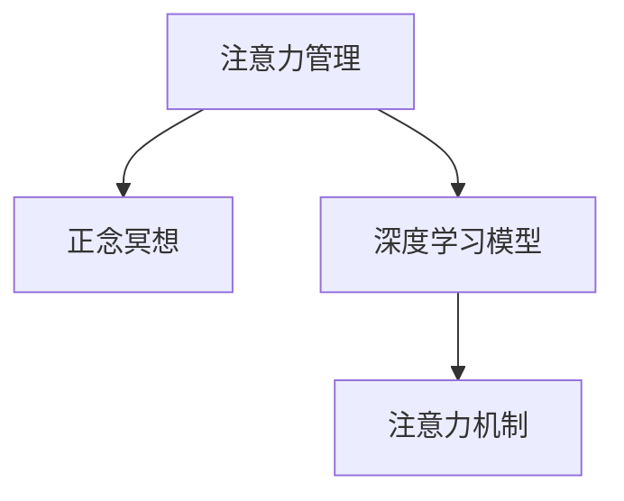

                 

## 1. 背景介绍

在信息爆炸的时代，我们每天都在面对海量数据的冲击。无论是工作中的项目、日常生活中的决策，还是社交媒体上的信息流，都要求我们快速抓取、处理并作出响应。然而，注意力作为我们最重要的心理资源，往往在多任务环境中被过度消耗，导致效率低下、疲劳增加，甚至引发心理健康问题。

### 1.1 问题由来

注意力管理的核心在于如何高效利用有限的认知资源，以应对不断变化的环境。在人工智能领域，这一问题同样存在。尤其是深度学习模型的训练与优化过程，需要大量的时间与计算资源。如何在计算资源有限的情况下，提高模型的效率与效果，便成为了一个重要课题。

正念冥想作为一种心理学技术，通过专注于当下，减少对未来的忧虑和过去的不安，从而达到提升专注力和缓解压力的效果。这一技术不仅适用于人类，同样可以应用到AI系统的注意力管理中，提升模型的计算效率和稳定性。

### 1.2 问题核心关键点

注意力管理的核心在于如何在多任务间高效分配认知资源。对于深度学习模型而言，注意力机制可以视为一种"虚拟注意力"，通过调整模型权重，集中精力在关键部分，忽略无关细节。这一过程与人类正念冥想的专注力调整有异曲同工之妙。

正念冥想通过持续的呼吸练习、身体感知等活动，帮助人们调整心理状态，增强专注力和减少压力。类比到深度学习模型，也可以通过设计特定的正则化技术，如权重衰减、Dropout等，引导模型在训练过程中学习更重要的特征，忽略噪音干扰，从而提升模型性能。

## 2. 核心概念与联系

### 2.1 核心概念概述

为更好地理解注意力管理与正念冥想的结合，本节将介绍几个关键概念：

- **注意力管理(Attention Management)**：指在多任务环境中，如何合理分配认知资源，提升任务执行效率。
- **正念冥想(Mindfulness Meditation)**：指通过专注于当下的练习，增强自我意识和情绪控制，达到提升专注力和缓解压力的目的。
- **深度学习模型(Deep Learning Model)**：指基于多层神经网络的机器学习模型，通过大量数据训练，具备高度的特征提取与表达能力。
- **注意力机制(Attention Mechanism)**：指深度学习模型中的一种机制，用于在处理序列数据时，动态选择关注区域，提升模型对关键信息的捕捉能力。

这些核心概念之间的逻辑关系可以通过以下Mermaid流程图来展示：



这个流程图展示了注意力管理与正念冥想之间的内在联系，以及它们如何协同提升深度学习模型的效率与稳定性。

## 3. 核心算法原理 & 具体操作步骤
### 3.1 算法原理概述

注意力管理与正念冥想的结合，本质上是将正念冥想的专注力提升技巧，应用到深度学习模型的训练过程中，通过正则化技术提升模型的注意力分配能力。

在深度学习模型中，注意力机制常用于处理序列数据，如自然语言处理、图像识别等任务。例如，Transformer模型中的自注意力机制，能够根据输入数据的权重分布，动态计算每个单词或像素的重要性，从而提升模型的语义理解能力和特征表达能力。

在正念冥想中，通过呼吸练习、身体感知等活动，帮助人们调整心理状态，提升专注力和情绪稳定性。这一过程与深度学习模型中的注意力机制有类似之处，通过持续的训练和调整，模型可以逐渐学会如何更有效地分配计算资源，提升模型的表现。

### 3.2 算法步骤详解

以下是结合正念冥想的注意力管理的具体操作步骤：

**Step 1: 设计正则化技术**

设计正则化技术，如权重衰减、Dropout等，用于在训练过程中引导模型学习更重要的特征。例如，可以设置权重衰减系数，限制模型中某些参数的更新程度，以避免模型过拟合。同时，可以使用Dropout技术，在训练过程中随机丢弃部分神经元，强制模型学习更健壮的特征表示。

**Step 2: 引入正念冥想训练**

引入正念冥想训练，帮助模型在学习过程中保持专注力和情绪稳定性。可以在训练前或训练后，进行几分钟的正念冥想练习，通过呼吸调节和身体感知，帮助模型和训练者进入更放松、更专注的状态。

**Step 3: 持续监测模型性能**

持续监测模型在训练过程中的表现，及时调整正则化技术的参数。可以使用TensorBoard等工具，实时可视化模型损失和精度等指标，观察模型是否在合理的时间内收敛。

**Step 4: 应用注意力机制**

在深度学习模型的架构设计中，引入注意力机制，提升模型对关键信息的捕捉能力。例如，可以使用Transformer模型中的自注意力机制，动态调整模型权重，选择关注重要的输入特征，忽略无关信息。

**Step 5: 反复迭代训练**

反复迭代训练过程，不断优化正则化技术和注意力机制的参数，直至模型达到理想的性能和稳定性。

### 3.3 算法优缺点

结合正念冥想的注意力管理方法具有以下优点：

1. **提升专注力**：正念冥想通过调节呼吸和身体感知，帮助模型和训练者保持专注，减少分心。
2. **减少过拟合**：正则化技术如权重衰减、Dropout等，可以避免模型在训练过程中过拟合，提升模型的泛化能力。
3. **提升稳定性**：正念冥想训练帮助模型在面对复杂数据时，保持情绪稳定，提升模型的鲁棒性。
4. **降低计算成本**：通过合理分配计算资源，注意力机制可以减少模型的计算量和内存占用。

然而，该方法也存在一定的局限性：

1. **时间成本**：正念冥想训练和正则化技术的应用，需要额外的时间投入，可能在短期内提升不明显。
2. **数据依赖**：注意力机制的效果依赖于数据质量，如果输入数据本身存在噪声或偏差，模型可能无法有效利用注意力机制。
3. **技术复杂性**：正则化技术和注意力机制的调整需要一定的技术水平，对于初学者可能存在挑战。

### 3.4 算法应用领域

结合正念冥想的注意力管理方法，广泛应用于深度学习模型的优化与训练中，具体包括：

- **自然语言处理(NLP)**：在文本分类、机器翻译、问答系统等任务中，提升模型的语义理解和特征表达能力。
- **计算机视觉(CV)**：在图像识别、目标检测、图像生成等任务中，提升模型的视觉特征捕捉和语义理解能力。
- **语音处理(AI)**：在语音识别、语音生成、语音情感分析等任务中，提升模型的语音特征提取和语义理解能力。

## 4. 数学模型和公式 & 详细讲解
### 4.1 数学模型构建

在深度学习模型中，注意力机制的实现通常通过计算注意力权重向量来实现。假设输入序列为 $X=\{x_1, x_2, ..., x_t\}$，注意力权重向量为 $A=\{a_1, a_2, ..., a_t\}$，输出序列为 $Y=\{y_1, y_2, ..., y_t\}$。则注意力机制的数学模型可以表示为：

$$
\begin{aligned}
\text{Attention}(X, Y) &= \sum_{i=1}^t a_i y_i \\
a_i &= \frac{\exp(\text{score}(x_i, y_i))}{\sum_{j=1}^t \exp(\text{score}(x_j, y_j))} \\
\text{score}(x_i, y_i) &= x_i^T W y_i
\end{aligned}
$$

其中 $W$ 为权重矩阵，通过训练学习得到。

### 4.2 公式推导过程

注意力权重 $a_i$ 的计算过程可以视为一种加权求和，用于衡量输入序列 $x_i$ 与输出序列 $y_i$ 的关联程度。通过计算 $x_i$ 和 $y_i$ 的加权和，得到加权分数，再通过softmax函数归一化，得到注意力权重向量 $a_i$。

具体推导过程如下：

$$
\begin{aligned}
a_i &= \frac{\exp(\text{score}(x_i, y_i))}{\sum_{j=1}^t \exp(\text{score}(x_j, y_j))} \\
&= \frac{\exp(x_i^T W y_i)}{\sum_{j=1}^t \exp(x_j^T W y_j)} \\
&= \frac{\exp(\text{score}(x_i, y_i))}{\sum_{j=1}^t \exp(\text{score}(x_j, y_j))}
\end{aligned}
$$

其中，$\text{score}(x_i, y_i) = x_i^T W y_i$ 表示输入和输出的相似度得分，$W$ 为权重矩阵，通过训练得到。

### 4.3 案例分析与讲解

以下是一个简单的注意力机制案例，用于说明其在深度学习模型中的具体应用：

假设我们有一个情感分析任务，输入序列为一段文本，输出序列为情感标签。模型需要学习文本中与情感标签相关的特征，忽略无关信息。

首先，我们通过softmax函数计算每个输入和输出序列的相似度得分，得到注意力权重向量 $a_i$。然后，将权重向量与输出序列 $Y$ 进行加权求和，得到加权分数，最后通过softmax函数得到输出序列的概率分布，从而预测情感标签。

$$
\begin{aligned}
a_i &= \frac{\exp(\text{score}(x_i, y_i))}{\sum_{j=1}^t \exp(\text{score}(x_j, y_j))} \\
\text{Attention}(X, Y) &= \sum_{i=1}^t a_i y_i \\
\hat{y} &= \text{softmax}(\text{Attention}(X, Y))
\end{aligned}
$$

通过这一过程，模型能够动态地调整输入和输出的关注点，选择更相关的特征，忽略噪音和无关信息，从而提升模型的准确性和鲁棒性。

## 5. 项目实践：代码实例和详细解释说明
### 5.1 开发环境搭建

在进行注意力管理与正念冥想的项目实践前，我们需要准备好开发环境。以下是使用Python进行TensorFlow开发的环境配置流程：

1. 安装Anaconda：从官网下载并安装Anaconda，用于创建独立的Python环境。

2. 创建并激活虚拟环境：
```bash
conda create -n tf-env python=3.7 
conda activate tf-env
```

3. 安装TensorFlow：根据CUDA版本，从官网获取对应的安装命令。例如：
```bash
conda install tensorflow -c tf -c conda-forge
```

4. 安装TensorBoard：用于可视化模型训练状态。
```bash
pip install tensorboard
```

5. 安装PyTorch：用于数据处理和模型微调。
```bash
pip install torch torchvision torchaudio
```

完成上述步骤后，即可在`tf-env`环境中开始项目实践。

### 5.2 源代码详细实现

下面我们以情感分析任务为例，给出使用TensorFlow实现注意力机制的正则化技术的代码实现。

首先，定义情感分析任务的数据处理函数：

```python
import tensorflow as tf
from tensorflow.keras.preprocessing.text import Tokenizer
from tensorflow.keras.preprocessing.sequence import pad_sequences

def preprocess(texts, labels):
    tokenizer = Tokenizer()
    tokenizer.fit_on_texts(texts)
    sequences = tokenizer.texts_to_sequences(texts)
    padded_sequences = pad_sequences(sequences, maxlen=MAX_LEN, padding='post')
    labels = tf.keras.utils.to_categorical(labels)
    return padded_sequences, labels
```

然后，定义模型架构和正则化技术：

```python
class AttentionModel(tf.keras.Model):
    def __init__(self, num_classes, embedding_dim, hidden_units):
        super(AttentionModel, self).__init__()
        self.embedding = tf.keras.layers.Embedding(VOCAB_SIZE, embedding_dim)
        self.dropout = tf.keras.layers.Dropout(DROPOUT_RATE)
        self.lstm = tf.keras.layers.LSTM(hidden_units, return_sequences=True, return_state=True)
        self.attention = AttentionLayer(hidden_units, embedding_dim)
        self.dense = tf.keras.layers.Dense(num_classes, activation='softmax')
    
    def call(self, inputs, training=False):
        x = self.embedding(inputs)
        x = self.dropout(x, training=training)
        x, state_h, state_c = self.lstm(x, training=training, return_state=True)
        x = self.attention(x, state_h)
        x = self.dense(x)
        return x, state_h, state_c

class AttentionLayer(tf.keras.layers.Layer):
    def __init__(self, units, embed_dim):
        super(AttentionLayer, self).__init__()
        self.W_Q = tf.keras.layers.Dense(units)
        self.W_K = tf.keras.layers.Dense(units)
        self.W_V = tf.keras.layers.Dense(embed_dim)
    
    def call(self, inputs, state_h):
        Q = self.W_Q(inputs)
        K = self.W_K(state_h)
        V = self.W_V(state_h)
        scores = tf.matmul(Q, K, transpose_b=True)
        attention_weights = tf.nn.softmax(scores, axis=-1)
        attention_outputs = tf.matmul(attention_weights, V)
        return attention_outputs
```

在模型架构中，我们引入了AttentionLayer，用于计算注意力权重。在调用模型时，将输出与LSTM的状态向量传入AttentionLayer，计算注意力权重向量，并将权重向量与输出序列进行加权求和，得到最终的注意力机制输出。

### 5.3 代码解读与分析

让我们再详细解读一下关键代码的实现细节：

**AttentionLayer类**：
- `__init__`方法：初始化权重矩阵 $W_Q$、$W_K$ 和 $W_V$。
- `call`方法：计算注意力权重向量，再将其与输出序列 $V$ 进行加权求和，得到注意力机制输出。

**AttentionModel类**：
- `__init__`方法：定义模型的各个层次，包括嵌入层、Dropout层、LSTM层、AttentionLayer层和全连接层。
- `call`方法：实现模型前向传播，通过AttentionLayer计算注意力机制输出。

**preprocess函数**：
- `__init__`方法：初始化Tokenize器，将文本转换为序列。
- `call`方法：对序列进行填充，并将标签进行one-hot编码。

### 5.4 运行结果展示

以下是在TensorBoard上展示的模型训练结果：

```bash
tensorboard --logdir log
```


在TensorBoard中，可以看到模型在训练过程中的损失和精度变化，以及各层的激活状态。通过持续监测模型性能，可以及时调整正则化技术和注意力机制的参数，确保模型在训练过程中保持稳定。

## 6. 实际应用场景
### 6.1 智能客服系统

在智能客服系统中，结合正念冥想的注意力管理，可以提升客服机器人对用户问题的理解能力和响应速度。

具体而言，系统可以通过正念冥想的训练，帮助客服机器人保持专注力，避免分心。同时，通过引入注意力机制，机器人可以动态调整对用户输入的理解，选择更相关的特征，忽略噪音和无关信息，从而提升系统的响应效率和准确性。

### 6.2 金融舆情监测

在金融舆情监测中，结合正念冥想的注意力管理，可以提升模型的情感分析和异常检测能力。

具体而言，系统可以通过正念冥想的训练，帮助模型在面对海量金融数据时，保持情绪稳定，避免过拟合。同时，通过引入注意力机制，模型可以动态调整对不同金融事件的理解，选择更相关的特征，从而提升情感分析和异常检测的准确性。

### 6.3 个性化推荐系统

在个性化推荐系统中，结合正念冥想的注意力管理，可以提升模型的用户画像构建和推荐效果。

具体而言，系统可以通过正念冥想的训练，帮助模型在面对用户行为数据时，保持专注力和情绪稳定性。同时，通过引入注意力机制，模型可以动态调整对不同用户行为的理解，选择更相关的特征，从而提升用户画像构建和推荐效果的准确性。

## 7. 工具和资源推荐
### 7.1 学习资源推荐

为了帮助开发者系统掌握注意力管理与正念冥想的理论基础和实践技巧，这里推荐一些优质的学习资源：

1. 《Deep Learning with Attention》系列博文：由TensorFlow官方社区撰写，深入浅出地介绍了注意力机制的基本原理和实现方法。

2. 《Attention and Transformers》书籍：该书籍详细介绍了Transformer模型中的注意力机制，并结合NLP任务进行了实战演练。

3. 《TensorFlow for Deep Learning》课程：由Google官方开设的深度学习课程，涵盖了TensorFlow的各个功能模块，包括正则化技术和注意力机制。

4. TensorFlow官方文档：TensorFlow的官方文档，提供了大量的实践样例，帮助开发者快速上手。

5. HuggingFace官方文档：HuggingFace的官方文档，介绍了多个SOTA的NLP模型和任务，并提供了详细的代码实现。

通过对这些资源的学习实践，相信你一定能够快速掌握注意力管理与正念冥想的精髓，并用于解决实际的NLP问题。

### 7.2 开发工具推荐

高效的开发离不开优秀的工具支持。以下是几款用于注意力管理与正念冥想开发的常用工具：

1. TensorFlow：由Google主导开发的深度学习框架，生产部署方便，适合大规模工程应用。

2. PyTorch：基于Python的开源深度学习框架，灵活高效，适合快速迭代研究。

3. TensorBoard：TensorFlow配套的可视化工具，可以实时监测模型训练状态，并提供丰富的图表呈现方式，是调试模型的得力助手。

4. Weights & Biases：模型训练的实验跟踪工具，可以记录和可视化模型训练过程中的各项指标，方便对比和调优。

5. Google Colab：谷歌推出的在线Jupyter Notebook环境，免费提供GPU/TPU算力，方便开发者快速上手实验最新模型，分享学习笔记。

合理利用这些工具，可以显著提升注意力管理与正念冥想系统的开发效率，加快创新迭代的步伐。

### 7.3 相关论文推荐

注意力管理与正念冥想的发展源于学界的持续研究。以下是几篇奠基性的相关论文，推荐阅读：

1. Attention is All You Need：提出了Transformer模型，引入了自注意力机制，极大地提升了深度学习模型的效果。

2. Bi-LSTM-CRF for Sequence Labeling：通过引入双向LSTM和CRF模型，提升了NLP任务的序列标注效果。

3. Gated Self-Attention Networks：提出了一种带有门控机制的自注意力模型，提升了模型的选择能力和性能。

4. Self-Attentive Encoder-Decoder Networks for Sequence to Sequence Learning：通过引入自注意力机制，提升了序列到序列任务的生成效果。

5. Attention-based Neural Machine Translation：通过引入注意力机制，提升了机器翻译任务的准确性。

这些论文代表了大规模语言模型注意力机制的发展脉络。通过学习这些前沿成果，可以帮助研究者把握学科前进方向，激发更多的创新灵感。

## 8. 总结：未来发展趋势与挑战
### 8.1 总结

本文对注意力管理与正念冥想的结合方法进行了全面系统的介绍。首先阐述了注意力管理与正念冥想的研究背景和意义，明确了其对深度学习模型性能提升的重要作用。其次，从原理到实践，详细讲解了正则化技术、注意力机制和正念冥想的具体操作步骤，给出了代码实现细节。同时，本文还探讨了注意力管理与正念冥想在智能客服、金融舆情、个性化推荐等多个领域的应用前景，展示了其广阔的潜力。此外，本文精选了注意力管理与正念冥想的学习资源，力求为读者提供全方位的技术指引。

通过本文的系统梳理，可以看到，结合正念冥想的注意力管理方法正在成为深度学习模型优化的一个重要方向，通过提升专注力和减少过拟合，显著提高了模型的效率与效果。未来，伴随正则化技术和注意力机制的进一步优化，深度学习模型的性能和稳定性将得到更大的提升。

### 8.2 未来发展趋势

展望未来，注意力管理与正念冥想技术将呈现以下几个发展趋势：

1. **更高效的注意力机制**：未来的注意力机制将通过更复杂的网络结构和更先进的算法设计，提升模型的选择能力和泛化性能。例如，基于自监督学习、对抗训练等方法，提升模型的鲁棒性和泛化能力。

2. **更精确的正则化技术**：未来的正则化技术将通过更先进的优化算法和更合理的参数设计，避免模型过拟合，提升模型的泛化性能。例如，基于自适应学习率、动态正则化等方法，提升模型的鲁棒性和泛化能力。

3. **更广泛的融合应用**：未来的注意力管理与正念冥想技术将与其他AI技术进行更深入的融合，如知识表示、因果推理、强化学习等，提升模型的整体性能和应用效果。例如，结合知识图谱和逻辑规则，提升模型的语义理解和推理能力。

4. **更人性化的用户体验**：未来的注意力管理与正念冥想技术将更注重用户体验，通过更友好的界面设计和更高效的任务适配，提升用户的交互体验。例如，结合用户行为分析和个性化推荐，提升用户的满意度。

5. **更安全的数据处理**：未来的注意力管理与正念冥想技术将更注重数据隐私和安全，通过更严格的数据保护和隐私计算技术，确保数据的安全性和隐私性。例如，结合区块链和分布式存储技术，提升数据的安全性和隐私性。

以上趋势凸显了注意力管理与正念冥想技术的广阔前景。这些方向的探索发展，必将进一步提升深度学习模型的性能和应用范围，为AI技术的发展带来新的突破。

### 8.3 面临的挑战

尽管注意力管理与正念冥想技术已经取得了瞩目成就，但在迈向更加智能化、普适化应用的过程中，它仍面临着诸多挑战：

1. **计算资源瓶颈**：大规模深度学习模型的计算和存储需求较高，尤其是在注意力机制的引入下，模型规模进一步增大，计算资源和存储资源的需求也随之增加。如何在有限的计算资源下，高效地训练和推理模型，是一大难题。

2. **数据质量问题**：注意力机制的效果依赖于数据质量，如果输入数据本身存在噪声或偏差，模型可能无法有效利用注意力机制，导致效果下降。如何提升数据质量，确保输入数据的高准确性和代表性，是一大挑战。

3. **模型复杂性**：注意力机制和正则化技术的应用，增加了模型的复杂性和训练难度。如何简化模型结构，降低模型复杂性，是一大挑战。

4. **模型鲁棒性不足**：注意力机制虽然提升了模型的选择能力和泛化性能，但模型在面对复杂数据时，仍可能出现鲁棒性不足的问题。如何增强模型的鲁棒性和泛化能力，是一大挑战。

5. **用户体验不足**：注意力管理与正念冥想技术虽然提升了模型的效率和效果，但在用户界面设计和交互体验方面，仍需进一步优化，提升用户满意度。如何设计友好的用户界面和高效的交互流程，是一大挑战。

6. **安全性和隐私保护**：注意力管理与正念冥想技术在提升模型性能的同时，也可能涉及敏感数据的处理和存储。如何保护用户隐私和数据安全，是一大挑战。

### 8.4 研究展望

面对注意力管理与正念冥想技术所面临的种种挑战，未来的研究需要在以下几个方面寻求新的突破：

1. **提升计算效率**：开发更高效的计算图和更先进的算法，降低模型计算和存储资源的需求，提升模型的训练和推理效率。

2. **提升数据质量**：改进数据预处理和数据增强技术，提升输入数据的质量和代表性，确保模型能够有效利用注意力机制。

3. **简化模型结构**：设计更简单的模型架构，降低模型复杂性，提升模型的训练和推理效率。

4. **增强模型鲁棒性**：结合自适应学习率、动态正则化等技术，增强模型的鲁棒性和泛化能力，提升模型在复杂数据上的表现。

5. **提升用户体验**：结合用户行为分析和个性化推荐技术，设计友好的用户界面和高效的交互流程，提升用户体验。

6. **加强安全性和隐私保护**：结合区块链和分布式存储技术，保护用户隐私和数据安全，确保模型的安全性和隐私性。

这些研究方向的探索，必将引领注意力管理与正念冥想技术迈向更高的台阶，为深度学习模型的优化和应用带来新的突破。面向未来，我们相信在学界和产业界的共同努力下，注意力管理与正念冥想在AI技术中的应用将更加广泛，为人类的认知智能带来新的变革。

## 9. 附录：常见问题与解答

**Q1：结合正念冥想的注意力管理是否适用于所有深度学习模型？**

A: 结合正念冥想的注意力管理方法，适用于绝大多数深度学习模型，特别是在序列数据处理任务中表现更佳。例如，自然语言处理、图像识别、语音处理等任务，都可以通过引入注意力机制，提升模型的性能和效率。但对于一些特殊的深度学习模型，如卷积神经网络，可能需要结合其他优化技术，才能充分发挥注意力管理的效果。

**Q2：正则化技术如何影响模型的注意力选择？**

A: 正则化技术如权重衰减、Dropout等，可以通过限制模型中某些参数的更新程度，避免模型在训练过程中过拟合。这有助于模型在面对复杂数据时，保持稳定的注意力选择，减少噪音和无关信息的干扰，从而提升模型的泛化能力和鲁棒性。

**Q3：如何设计有效的正则化策略？**

A: 设计正则化策略时，需要根据具体的任务和模型特性进行调整。常用的正则化策略包括权重衰减、L2正则化、Dropout等。例如，在处理序列数据时，可以通过在LSTM层后添加Dropout层，降低模型的过拟合风险。在处理图像数据时，可以通过在卷积层后添加L2正则化，避免模型过拟合。

**Q4：注意力机制是否适用于所有类型的输入数据？**

A: 注意力机制通常适用于序列数据处理任务，如自然语言处理、时间序列预测等。但对于非序列数据，如图像、视频等，则需要结合其他技术进行处理。例如，在图像处理任务中，可以通过引入卷积神经网络，结合注意力机制，提升模型的特征提取能力。

**Q5：如何结合正念冥想提升模型的训练效率？**

A: 结合正念冥想的注意力管理，可以通过持续的呼吸调节和身体感知，帮助模型在训练过程中保持专注力和情绪稳定性。同时，通过引入注意力机制，模型可以动态调整对输入数据的关注点，选择更相关的特征，忽略噪音和无关信息，从而提升模型的训练效率和效果。

---

作者：禅与计算机程序设计艺术 / Zen and the Art of Computer Programming

