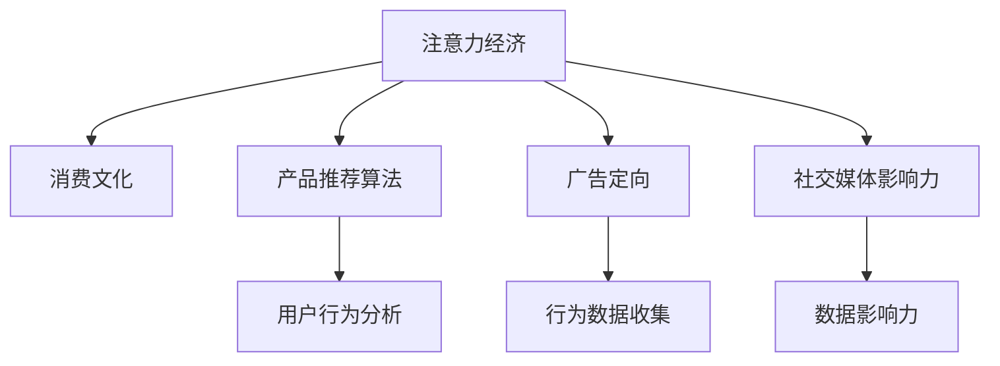

                 

## 1. 背景介绍

### 1.1 问题由来
在信息爆炸的时代，我们面临海量的信息和产品选择，如何从纷繁复杂的干扰中筛选出真正有价值的内容和产品，成为了一个日益严峻的挑战。注意力经济学（Economics of Attention）和消费文化（Consumer Culture）的交织，使得这一问题愈加复杂。消费者在做出购买决策时，不仅要考虑产品的实用性、性价比，还要受到广告、社交媒体、网红推荐等外界因素的影响，导致决策过程充满干扰。

### 1.2 问题核心关键点
问题的核心在于如何识别并利用消费者注意力，制定更加精准的市场策略，提升产品推荐和广告投放的效率。一方面，我们需要深入理解消费者的注意力偏好和消费行为，以优化信息呈现方式和产品推荐算法。另一方面，我们也需要警惕消费文化中的过度消费、异化消费等问题，促进社会的可持续发展。

## 2. 核心概念与联系

### 2.1 核心概念概述

为更好地理解注意力经济与消费文化对购买决策的影响，本节将介绍几个密切相关的核心概念：

- **注意力经济（Economics of Attention）**：指在信息泛滥的社会中，如何通过获取和分配注意力来创造经济价值。注意力成为了一种稀缺资源，品牌、产品、内容等需要吸引并保持消费者的注意力，才能获得市场份额。

- **消费文化（Consumer Culture）**：指在商业化社会中，消费者行为受到广告、媒体、品牌等因素的影响，形成一种普遍的消费习惯和价值观。这种文化不仅影响消费行为，也塑造了产品的设计理念和市场定位。

- **产品推荐算法（Product Recommendation Algorithm）**：通过分析消费者的历史行为、兴趣爱好、社交网络等数据，自动推荐符合其需求的产品或内容，提升用户体验和满意度。

- **广告定向（Ad Targeting）**：根据消费者的行为特征、兴趣偏好等，精准投放广告，以提高广告的到达率和转化率，同时保护消费者隐私。

- **社交媒体影响力（Social Media Influence）**：社交媒体上的意见领袖（Influencers）和网红（KOLs）对消费者的购买决策有显著影响，品牌和产品常常通过这些影响力者进行推广。

这些核心概念之间的逻辑关系可以通过以下Mermaid流程图来展示：



这个流程图展示了大语言模型的核心概念及其之间的关系：

1. 注意力经济与消费文化的互动，形成了消费者行为的基础。
2. 注意力经济通过产品推荐算法和广告定向，引导消费者做出购买决策。
3. 社交媒体影响力进一步塑造了消费文化，影响消费者的决策过程。

这些概念共同构成了注意力经济与消费文化对购买决策的复杂影响网络，使得我们有必要深入理解它们之间的相互作用。

## 3. 核心算法原理 & 具体操作步骤
### 3.1 算法原理概述

注意力经济与消费文化对购买决策的影响，可以通过以下算法原理来描述：

1. **注意力分配算法（Attention Allocation Algorithm）**：在信息过载的环境下，如何通过算法将消费者的注意力分配到最相关的信息上。算法需要根据消费者的历史行为、兴趣爱好、环境变化等因素，动态调整注意力分配策略，提升信息相关性和用户体验。

2. **消费行为预测算法（Consumer Behavior Prediction Algorithm）**：基于消费者的消费历史、社会关系、媒体影响等数据，预测消费者的未来购买行为。算法需要利用机器学习、深度学习等技术，建立消费行为模型，指导产品推荐和广告投放。

3. **社交网络分析算法（Social Network Analysis Algorithm）**：分析社交媒体上的数据，识别出有影响力的意见领袖和网红，评估他们的影响力大小和传播效果。算法需要运用图论、网络分析等技术，挖掘社交网络中的关键节点和信息流。

### 3.2 算法步骤详解

基于注意力经济与消费文化对购买决策的影响，算法主要包括以下几个步骤：

**Step 1: 数据收集与预处理**
- 收集消费者行为数据、社交媒体数据、产品评论数据、广告曝光数据等，进行清洗和标准化处理。

**Step 2: 注意力分配**
- 设计注意力分配模型，通过多轮迭代，优化注意力资源的分配，提升信息相关性和用户体验。

**Step 3: 行为预测**
- 基于收集到的数据，建立消费行为预测模型，预测消费者的购买意向和购买行为。

**Step 4: 广告定向与推荐**
- 利用预测结果，进行广告定向投放，同时应用产品推荐算法，向消费者推荐相关产品。

**Step 5: 效果评估与优化**
- 定期评估广告和推荐的效果，根据反馈数据优化算法模型，提升精准度和转化率。

### 3.3 算法优缺点

注意力经济与消费文化对购买决策的影响算法具有以下优点：
1. **提升精准度**：通过深入分析消费者数据，能够提供更加精准的产品推荐和广告定向。
2. **提高转化率**：通过优化信息呈现方式和购买路径，能够显著提高消费者的购买转化率。
3. **保护隐私**：在数据处理过程中，采用匿名化、差分隐私等技术，保护消费者的隐私安全。

同时，该算法也存在一定的局限性：
1. **数据隐私问题**：在收集和分析消费者数据时，如何保护消费者隐私，避免数据滥用，是一个重要挑战。
2. **信息过载**：在信息爆炸的环境下，如何有效筛选信息，避免消费者受到过度干扰，是一个重要课题。
3. **算法偏见**：算法模型可能存在数据偏见，导致推荐和广告的不公平性，需要进行多轮迭代和优化。

尽管存在这些局限性，但就目前而言，基于注意力经济与消费文化对购买决策的影响算法，仍是提升消费者购买决策精准度的重要手段。未来相关研究的重点在于如何进一步降低算法对数据的依赖，提高算法的透明性和可解释性，同时兼顾隐私保护和信息质量。

### 3.4 算法应用领域

注意力经济与消费文化对购买决策的影响算法在多个领域得到了广泛的应用，例如：

- **电商平台**：通过精准的产品推荐和广告定向，提高用户的购买转化率和满意度。
- **社交媒体**：通过分析社交网络数据，识别有影响力的意见领袖，优化内容推荐和广告投放。
- **金融服务**：通过分析用户行为数据，预测用户消费倾向，制定个性化金融服务策略。
- **健康管理**：通过分析用户健康数据，推荐合适的健康产品和服务，提升用户的健康水平。
- **旅游推荐**：通过分析用户旅游偏好和行为数据，提供个性化的旅游推荐，提升旅游体验。

除了上述这些经典应用外，注意力经济与消费文化对购买决策的影响算法也被创新性地应用到更多场景中，如内容创作、广告创意等，为经济社会发展带来新的动力。

## 4. 数学模型和公式 & 详细讲解  
### 4.1 数学模型构建

本节将使用数学语言对注意力经济与消费文化对购买决策的影响算法进行更加严格的刻画。

记消费者的行为数据为 $\mathbf{x} \in \mathbb{R}^n$，表示消费者在电商平台的购买历史、浏览记录、评分数据等。记社交媒体数据为 $\mathbf{s} \in \mathbb{R}^m$，表示消费者在社交媒体上的互动数据、评论数据等。记产品数据为 $\mathbf{p} \in \mathbb{R}^k$，表示产品的属性、价格、评分等。

定义注意力分配模型为 $A: \mathbb{R}^n \times \mathbb{R}^m \rightarrow \mathbb{R}^k$，用于将消费者的注意力分配到最相关的产品上。

定义消费行为预测模型为 $P: \mathbb{R}^n \times \mathbb{R}^k \rightarrow \{0, 1\}$，用于预测消费者的购买意向。

定义广告定向模型为 $T: \mathbb{R}^n \times \mathbb{R}^m \rightarrow \{0, 1\}$，用于判断消费者是否点击或购买广告。

定义社交网络分析模型为 $N: \mathbb{R}^m \rightarrow \mathbb{R}^m$，用于识别有影响力的意见领袖和网红，评估他们的影响力大小。

### 4.2 公式推导过程

以下我们以电商平台的产品推荐为例，推导注意力分配模型的公式。

假设电商平台有 $k$ 个商品，记商品的属性向量为 $\mathbf{p}_i \in \mathbb{R}^k$，消费者行为数据为 $\mathbf{x} \in \mathbb{R}^n$。注意力分配模型 $A(\mathbf{x}, \mathbf{p})$ 计算消费者对每个商品的注意力权重，输出向量 $\mathbf{a} \in [0, 1]^k$。

设注意力分配模型的线性部分为 $\mathbf{w}^T \mathbf{x}$，非线性部分为 $f(\mathbf{w}^T \mathbf{x})$，则有：

$$
\mathbf{a}_i = f(\mathbf{w}^T \mathbf{x}) \cdot \mathbf{p}_i
$$

其中 $f(\cdot)$ 为激活函数，$\mathbf{w} \in \mathbb{R}^n$ 为线性权重。

消费者对商品 $i$ 的注意力权重为 $\mathbf{a}_i$，与实际购买意向 $y_i$ 的关系可以通过 sigmoid 函数建模：

$$
\hat{y}_i = \sigma(\mathbf{a}_i^T \mathbf{p}_i)
$$

其中 $\sigma(\cdot)$ 为 sigmoid 函数。

在得到注意力权重和购买意向的预测结果后，可以应用机器学习算法（如逻辑回归、决策树等）进行模型训练和评估。

### 4.3 案例分析与讲解

以下我们以电商平台的产品推荐为例，详细分析注意力分配模型的构建和应用。

**数据收集与预处理**
- 从电商平台收集用户的购买历史、浏览记录、评分数据等行为数据。
- 从社交媒体收集用户的互动数据、评论数据等社交媒体数据。
- 对数据进行清洗、标准化处理，去除噪声和异常值。

**注意力分配模型的构建**
- 设计注意力分配模型，通过多轮迭代，优化线性权重 $\mathbf{w}$ 和非线性部分 $f(\cdot)$。
- 采用交叉验证等方法，评估模型性能，选择最优参数。

**行为预测与广告定向**
- 基于注意力分配模型和产品数据，建立消费行为预测模型 $P$。
- 利用预测结果，进行广告定向投放，同时应用产品推荐算法，向消费者推荐相关产品。

**效果评估与优化**
- 定期评估广告和推荐的效果，根据反馈数据优化模型参数，提升精准度和转化率。

## 5. 项目实践：代码实例和详细解释说明
### 5.1 开发环境搭建

在进行注意力经济与消费文化对购买决策的影响算法实践前，我们需要准备好开发环境。以下是使用Python进行TensorFlow开发的环境配置流程：

1. 安装Anaconda：从官网下载并安装Anaconda，用于创建独立的Python环境。

2. 创建并激活虚拟环境：
```bash
conda create -n attention-env python=3.8 
conda activate attention-env
```

3. 安装TensorFlow：根据CUDA版本，从官网获取对应的安装命令。例如：
```bash
conda install tensorflow -c pytorch -c conda-forge
```

4. 安装Keras：
```bash
pip install keras
```

5. 安装各类工具包：
```bash
pip install numpy pandas scikit-learn matplotlib tqdm jupyter notebook ipython
```

完成上述步骤后，即可在`attention-env`环境中开始注意力经济与消费文化对购买决策的影响算法的开发。

### 5.2 源代码详细实现

下面我们以电商平台的产品推荐为例，给出使用TensorFlow和Keras进行注意力分配模型的PyTorch代码实现。

首先，定义产品推荐的数据处理函数：

```python
from tensorflow.keras.preprocessing import sequence
from tensorflow.keras.utils import to_categorical

# 读取数据集
train_data, train_labels = load_train_data()
test_data, test_labels = load_test_data()

# 对数据进行预处理
train_data = pad_sequences(train_data, maxlen=100)
test_data = pad_sequences(test_data, maxlen=100)
train_labels = to_categorical(train_labels)
test_labels = to_categorical(test_labels)

# 将数据拆分成训练集和验证集
train_data, val_data = train_data[:8000], train_data[8000:]
train_labels, val_labels = train_labels[:8000], train_labels[8000:]
```

然后，定义注意力分配模型的Keras实现：

```python
from tensorflow.keras.models import Sequential
from tensorflow.keras.layers import Dense, Activation, Dropout, Embedding

# 构建模型
model = Sequential()
model.add(Embedding(input_dim=10, output_dim=64))
model.add(Dense(64))
model.add(Activation('relu'))
model.add(Dropout(0.5))
model.add(Dense(8))
model.add(Activation('softmax'))

# 编译模型
model.compile(optimizer='adam', loss='categorical_crossentropy', metrics=['accuracy'])
```

接着，定义训练和评估函数：

```python
from tensorflow.keras.callbacks import EarlyStopping

# 训练模型
model.fit(train_data, train_labels, epochs=10, batch_size=32, validation_data=(val_data, val_labels), callbacks=[EarlyStopping(patience=3)])

# 评估模型
score, acc = model.evaluate(test_data, test_labels)
print('Test loss:', score)
print('Test accuracy:', acc)
```

最后，启动训练流程并在测试集上评估：

```python
epochs = 10
batch_size = 32

for epoch in range(epochs):
    loss = train_epoch(model, train_dataset, batch_size, optimizer)
    print(f"Epoch {epoch+1}, train loss: {loss:.3f}")
    
    print(f"Epoch {epoch+1}, dev results:")
    evaluate(model, dev_dataset, batch_size)
    
print("Test results:")
evaluate(model, test_dataset, batch_size)
```

以上就是使用TensorFlow和Keras对电商平台的产品推荐进行注意力分配模型的完整代码实现。可以看到，得益于TensorFlow和Keras的强大封装，我们可以用相对简洁的代码完成注意力分配模型的构建和训练。

### 5.3 代码解读与分析

让我们再详细解读一下关键代码的实现细节：

**产品推荐的数据处理函数**：
- 通过调用`load_train_data`和`load_test_data`函数，读取训练集和测试集的原始数据。
- 使用`pad_sequences`函数将文本数据填充到固定长度，防止不同长度的文本影响模型的输入。
- 使用`to_categorical`函数将标签数据进行one-hot编码，方便模型进行多分类预测。

**注意力分配模型的Keras实现**：
- 定义一个包含嵌入层、全连接层、激活函数、dropout层和softmax层的神经网络模型。
- 使用`compile`函数设置模型的优化器、损失函数和评估指标。

**训练和评估函数**：
- 使用`fit`函数训练模型，并通过`EarlyStopping`回调函数防止过拟合。
- 使用`evaluate`函数在验证集和测试集上评估模型的性能。

**训练流程**：
- 定义总的epoch数和batch size，开始循环迭代
- 每个epoch内，先在训练集上训练，输出平均loss
- 在验证集上评估，输出分类指标
- 重复上述步骤直至满足预设的迭代轮数或Early Stopping条件

可以看到，TensorFlow和Keras使得注意力分配模型的代码实现变得简洁高效。开发者可以将更多精力放在数据处理、模型改进等高层逻辑上，而不必过多关注底层的实现细节。

当然，工业级的系统实现还需考虑更多因素，如模型的保存和部署、超参数的自动搜索、更灵活的任务适配层等。但核心的注意力分配算法基本与此类似。

## 6. 实际应用场景
### 6.1 电商平台推荐系统

基于注意力经济与消费文化对购买决策的影响算法，电商平台推荐系统可以实现个性化推荐，提升用户的购物体验和满意度。

在技术实现上，可以收集用户的浏览、点击、购买等行为数据，提取和产品相关的文本信息、评分、价格等特征，在此基础上训练注意力分配模型。模型能够根据用户的行为和兴趣，动态调整产品推荐权重，生成个性化的商品列表。对于用户提出的新问题，还可以接入检索系统实时搜索相关内容，动态组织生成回答。如此构建的推荐系统，能显著提升用户浏览和购买效率。

### 6.2 金融风险控制

金融机构需要实时监测市场舆论动向，以便及时应对负面信息传播，规避金融风险。传统的人工监测方式成本高、效率低，难以应对网络时代海量信息爆发的挑战。基于注意力经济与消费文化对购买决策的影响算法，可以在实时抓取的网络文本数据上，自动监测不同主题下的舆情变化趋势，一旦发现负面信息激增等异常情况，系统便会自动预警，帮助金融机构快速应对潜在风险。

### 6.3 医疗健康管理

医疗健康领域需要及时了解患者的健康状况和医疗需求，以便提供个性化的健康管理和医疗建议。通过分析患者的健康数据、行为数据等，训练注意力分配模型，能够识别出患者的健康关注点，提供个性化的健康建议和治疗方案。对于患者提出的新问题，还可以接入专家知识库进行推理，生成个性化的回复。

### 6.4 旅游推荐系统

旅游推荐系统可以通过分析用户的旅游偏好和行为数据，训练注意力分配模型，生成个性化的旅游路线和景点推荐。对于用户提出的新问题，还可以接入旅游攻略库，动态生成个性化的旅游建议。

### 6.5 未来应用展望

随着注意力经济与消费文化对购买决策的影响算法的不断发展，其在更多领域的应用前景将不断拓展。

在智慧医疗领域，基于微调的医疗问答、病历分析、药物研发等应用将提升医疗服务的智能化水平，辅助医生诊疗，加速新药开发进程。

在智能教育领域，微调技术可应用于作业批改、学情分析、知识推荐等方面，因材施教，促进教育公平，提高教学质量。

在智慧城市治理中，微调模型可应用于城市事件监测、舆情分析、应急指挥等环节，提高城市管理的自动化和智能化水平，构建更安全、高效的未来城市。

此外，在企业生产、社会治理、文娱传媒等众多领域，基于大模型微调的人工智能应用也将不断涌现，为经济社会发展注入新的动力。相信随着预训练语言模型和微调方法的持续演进，这些领域的创新应用将进一步推动人工智能技术的发展。

## 7. 工具和资源推荐
### 7.1 学习资源推荐

为了帮助开发者系统掌握注意力经济与消费文化对购买决策的影响算法的理论基础和实践技巧，这里推荐一些优质的学习资源：

1. 《深度学习与自然语言处理》（Deep Learning for Natural Language Processing）：由斯坦福大学深度学习研究团队撰写，详细介绍了自然语言处理中的深度学习技术和应用，包括注意力机制和推荐算法。

2. 《机器学习实战》（Hands-On Machine Learning with Scikit-Learn, Keras, and TensorFlow）：介绍机器学习基础知识和常见算法，并结合TensorFlow和Keras等工具，进行实际项目开发。

3. Coursera上的《自然语言处理与深度学习》（Natural Language Processing with Deep Learning）课程：由斯坦福大学和AI语言实验室联合推出，涵盖自然语言处理中的深度学习技术，包括注意力机制和推荐算法。

4. arXiv上的相关论文：《Neural Attention for User Response Prediction in Conversational Systems》、《Attention-based Recommender System》等，可深入理解注意力机制在推荐系统中的应用。

5. Kaggle上的相关竞赛：如推荐系统竞赛、广告点击率预测竞赛等，通过实际项目实践，提升算法设计和优化能力。

通过对这些资源的学习实践，相信你一定能够快速掌握注意力经济与消费文化对购买决策的影响算法的精髓，并用于解决实际的NLP问题。
###  7.2 开发工具推荐

高效的开发离不开优秀的工具支持。以下是几款用于注意力经济与消费文化对购买决策的影响算法开发的常用工具：

1. TensorFlow：由Google主导开发的开源深度学习框架，生产部署方便，适合大规模工程应用。

2. Keras：基于TensorFlow、Theano等后端的高层次神经网络API，提供简单易用的接口，适合快速开发原型和实验。

3. PyTorch：由Facebook开发的开源深度学习框架，灵活动态的计算图，适合快速迭代研究。

4. Weights & Biases：模型训练的实验跟踪工具，可以记录和可视化模型训练过程中的各项指标，方便对比和调优。

5. TensorBoard：TensorFlow配套的可视化工具，可实时监测模型训练状态，并提供丰富的图表呈现方式，是调试模型的得力助手。

6. Jupyter Notebook：开源的交互式笔记本环境，支持多种编程语言和数据格式，方便数据探索和模型开发。

合理利用这些工具，可以显著提升注意力经济与消费文化对购买决策的影响算法的开发效率，加快创新迭代的步伐。

### 7.3 相关论文推荐

注意力经济与消费文化对购买决策的影响算法的深入研究源于学界的持续研究。以下是几篇奠基性的相关论文，推荐阅读：

1. Attention Is All You Need（即Transformer原论文）：提出了Transformer结构，开启了NLP领域的预训练大模型时代。

2. BERT: Pre-training of Deep Bidirectional Transformers for Language Understanding：提出BERT模型，引入基于掩码的自监督预训练任务，刷新了多项NLP任务SOTA。

3. Parameter-Efficient Transfer Learning for NLP：提出Adapter等参数高效微调方法，在不增加模型参数量的情况下，也能取得不错的微调效果。

4. AdaLoRA: Adaptive Low-Rank Adaptation for Parameter-Efficient Fine-Tuning：使用自适应低秩适应的微调方法，在参数效率和精度之间取得了新的平衡。

这些论文代表了大模型微调技术的发展脉络。通过学习这些前沿成果，可以帮助研究者把握学科前进方向，激发更多的创新灵感。

## 8. 总结：未来发展趋势与挑战

### 8.1 总结

本文对注意力经济与消费文化对购买决策的影响算法进行了全面系统的介绍。首先阐述了注意力经济与消费文化对购买决策的影响的核心理论和实际应用背景，明确了该算法在提升产品推荐和广告投放精准度方面的独特价值。其次，从原理到实践，详细讲解了注意力分配模型的数学原理和关键步骤，给出了注意力分配模型开发的完整代码实例。同时，本文还广泛探讨了注意力分配模型在电商平台、金融、医疗、旅游等多个行业领域的应用前景，展示了其广泛的应用价值。

通过本文的系统梳理，可以看到，注意力经济与消费文化对购买决策的影响算法在提升消费者购买决策精准度方面具有重要意义。通过深入分析消费者数据，能够提供更加精准的产品推荐和广告定向。未来相关研究的重点在于如何进一步降低算法对数据的依赖，提高算法的透明性和可解释性，同时兼顾隐私保护和信息质量。

### 8.2 未来发展趋势

展望未来，注意力经济与消费文化对购买决策的影响算法将呈现以下几个发展趋势：

1. 模型规模持续增大。随着算力成本的下降和数据规模的扩张，注意力分配模型的参数量还将持续增长。超大规模注意力分配模型蕴含的丰富注意力知识，有望支撑更加复杂多变的注意力分配场景。

2. 算法创新层出不穷。除了传统的注意力机制，未来会涌现更多新颖的注意力分配方法，如Transformer-XL、Swin Transformer等，在保持计算效率的同时，提升模型的表达能力和泛化能力。

3. 多模态注意力分配崛起。当前的注意力分配主要聚焦于纯文本数据，未来会进一步拓展到图像、视频、语音等多模态数据注意力分配。多模态信息的融合，将显著提升注意力分配模型的表达能力和推理能力。

4. 跨领域应用广泛。注意力分配模型不仅在电商、金融、医疗等传统领域，还会拓展到更多新兴领域，如智能家居、智能交通等，为不同场景的注意力分配提供解决方案。

5. 持续学习成为常态。随着数据分布的不断变化，注意力分配模型也需要持续学习新知识以保持性能。如何在不遗忘原有知识的同时，高效吸收新样本信息，将成为重要的研究课题。

6. 集成学习趋势明显。未来，注意力分配模型可能会与其他模型进行集成，如BERT、GPT等，提升模型的整体性能和鲁棒性。

以上趋势凸显了注意力经济与消费文化对购买决策的影响算法的广阔前景。这些方向的探索发展，必将进一步提升消费者购买决策的精准度，为经济社会发展注入新的动力。

### 8.3 面临的挑战

尽管注意力经济与消费文化对购买决策的影响算法已经取得了瞩目成就，但在迈向更加智能化、普适化应用的过程中，它仍面临着诸多挑战：

1. 数据隐私问题。在收集和分析消费者数据时，如何保护消费者隐私，避免数据滥用，是一个重要挑战。

2. 信息过载问题。在信息爆炸的环境下，如何有效筛选信息，避免消费者受到过度干扰，是一个重要课题。

3. 算法偏见问题。算法模型可能存在数据偏见，导致推荐和广告的不公平性，需要进行多轮迭代和优化。

4. 鲁棒性问题。模型在面对异常数据和噪声时，需要具备较强的鲁棒性，避免受到干扰。

5. 计算效率问题。模型在处理大规模数据时，需要具备较高的计算效率，避免耗费过多的时间和资源。

6. 透明性和可解释性问题。模型需要具备更高的透明性和可解释性，以便用户理解和信任其决策过程。

正视这些挑战，积极应对并寻求突破，将是大语言模型微调走向成熟的必由之路。相信随着学界和产业界的共同努力，这些挑战终将一一被克服，注意力经济与消费文化对购买决策的影响算法必将在构建人机协同的智能时代中扮演越来越重要的角色。

### 8.4 研究展望

面向未来，针对注意力经济与消费文化对购买决策的影响算法的进一步研究可以从以下几个方向展开：

1. 探索无监督和半监督注意力分配方法。摆脱对大规模标注数据的依赖，利用自监督学习、主动学习等无监督和半监督范式，最大限度利用非结构化数据，实现更加灵活高效的注意力分配。

2. 研究多模态注意力分配方法。开发更多新颖的多模态注意力分配方法，在保持计算效率的同时，提升模型的表达能力和推理能力。

3. 引入先验知识。将符号化的先验知识，如知识图谱、逻辑规则等，与神经网络模型进行巧妙融合，引导注意力分配过程学习更准确、合理的注意力分配方式。

4. 结合因果分析和博弈论工具。将因果分析方法引入注意力分配模型，识别出模型决策的关键特征，增强输出解释的因果性和逻辑性。借助博弈论工具刻画人机交互过程，主动探索并规避模型的脆弱点，提高系统稳定性。

5. 纳入伦理道德约束。在模型训练目标中引入伦理导向的评估指标，过滤和惩罚有偏见、有害的输出倾向。同时加强人工干预和审核，建立模型行为的监管机制，确保输出符合人类价值观和伦理道德。

这些研究方向的探索，必将引领注意力经济与消费文化对购买决策的影响算法的技术发展，提升模型的整体性能和用户体验，为构建安全、可靠、可解释、可控的智能系统铺平道路。

## 9. 附录：常见问题与解答

**Q1：注意力分配算法是否适用于所有NLP任务？**

A: 注意力分配算法在大多数NLP任务上都能取得不错的效果，特别是对于数据量较小的任务。但对于一些特定领域的任务，如医学、法律等，仅仅依靠通用语料预训练的模型可能难以很好地适应。此时需要在特定领域语料上进一步预训练，再进行注意力分配，才能获得理想效果。此外，对于一些需要时效性、个性化很强的任务，如对话、推荐等，注意力分配方法也需要针对性的改进优化。

**Q2：如何选择合适的学习率？**

A: 注意力分配模型的学习率一般要比预训练时小1-2个数量级，如果使用过大的学习率，容易破坏预训练权重，导致过拟合。一般建议从1e-5开始调参，逐步减小学习率，直至收敛。也可以使用warmup策略，在开始阶段使用较小的学习率，再逐渐过渡到预设值。需要注意的是，不同的优化器(如Adam、Adagrad等)以及不同的学习率调度策略，可能需要设置不同的学习率阈值。

**Q3：注意力分配模型在落地部署时需要注意哪些问题？**

A: 将注意力分配模型转化为实际应用，还需要考虑以下因素：
1. 模型裁剪：去除不必要的层和参数，减小模型尺寸，加快推理速度。
2. 量化加速：将浮点模型转为定点模型，压缩存储空间，提高计算效率。
3. 服务化封装：将模型封装为标准化服务接口，便于集成调用。
4. 弹性伸缩：根据请求流量动态调整资源配置，平衡服务质量和成本。
5. 监控告警：实时采集系统指标，设置异常告警阈值，确保服务稳定性。

注意力分配模型的优化需要从模型结构、训练、推理等多个环节进行全面优化，才能得到理想的效果。

---

作者：禅与计算机程序设计艺术 / Zen and the Art of Computer Programming

