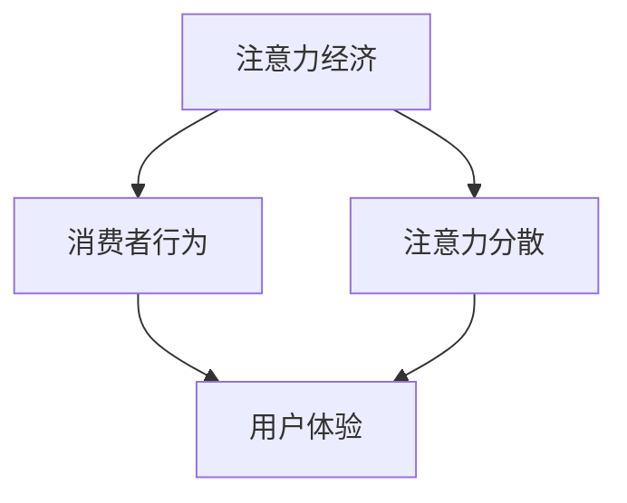

                 

# 注意力经济与消费者行为的变迁

## 1. 背景介绍

在互联网时代，数据成为了最重要的资产之一。对于企业和品牌而言，如何有效地吸引和利用用户注意力，是实现商业成功、提升用户体验的关键。本文旨在探讨注意力经济的发展现状和未来趋势，分析消费者行为的变化及其对企业的启示。

## 2. 核心概念与联系

### 2.1 核心概念概述

- **注意力经济**：指以吸引用户注意力为核心驱动力的新型经济形态。企业通过提供有价值的内容和服务，吸引用户的时间和关注，从而创造商业价值。
- **消费者行为**：指消费者在获取、使用和评价产品和服务过程中的一系列心理和生理活动。消费者行为的变化，直接影响了市场的供需关系和竞争格局。
- **注意力分散**：随着数字化媒体的普及，用户注意力被大量低质量、无意义的信息分散，导致难以集中精力进行深度互动。
- **用户体验**：指用户在使用产品和服务过程中产生的情感和心理反应。优秀的用户体验，有助于提高用户粘性和忠诚度。

这些概念之间相互关联，共同构成了注意力经济和消费者行为的研究框架。

### 2.2 核心概念原理和架构的 Mermaid 流程图(Mermaid 流程节点中不要有括号、逗号等特殊字符)



该图展示了注意力经济和消费者行为的关系网络。注意力经济依赖于消费者行为和注意力分散两个关键因素，用户体验则是影响消费者行为和注意力分散的重要变量。

## 3. 核心算法原理 & 具体操作步骤
### 3.1 算法原理概述

注意力经济的核心在于通过吸引和利用用户注意力，创造价值。算法原理主要包括以下几个方面：

- **数据采集与分析**：利用大数据技术和自然语言处理(NLP)方法，对用户行为数据进行采集和分析，识别出用户的兴趣点和消费习惯。
- **内容推荐**：通过机器学习算法，构建推荐模型，根据用户行为数据和兴趣点，生成个性化的内容推荐。
- **用户互动**：利用社交媒体和即时通讯工具，增加用户互动机会，提升用户粘性。
- **反馈机制**：建立用户反馈系统，通过用户评价和反馈数据，不断优化内容和服务，提高用户满意度。

### 3.2 算法步骤详解

1. **数据采集与预处理**
    - 使用爬虫技术采集用户行为数据，如浏览记录、搜索历史、评论内容等。
    - 对采集到的数据进行清洗和预处理，去除噪声和重复数据。

2. **特征提取与建模**
    - 使用NLP技术对文本数据进行分词、词性标注等处理，提取特征。
    - 使用机器学习算法，如决策树、随机森林、神经网络等，建立推荐模型。

3. **内容推荐与互动**
    - 将推荐模型应用于用户行为数据，生成个性化内容推荐。
    - 在社交媒体和即时通讯工具中展示推荐内容，增加用户互动机会。

4. **反馈与优化**
    - 收集用户对推荐内容的评价和反馈数据，分析用户满意度。
    - 根据反馈数据，调整推荐模型参数，优化推荐效果。

### 3.3 算法优缺点

**优点**：
- 通过数据驱动的方法，能够提供高度个性化的内容和服务。
- 自动化程度高，提高了运营效率和用户体验。
- 能够及时响应市场变化，适应性强。

**缺点**：
- 需要处理大规模数据，对技术要求高。
- 个性化推荐可能导致信息过载，用户选择困难。
- 隐私保护问题，需要建立完善的隐私保护机制。

### 3.4 算法应用领域

注意力经济和消费者行为分析的应用领域广泛，主要包括以下几个方面：

- **电商领域**：通过个性化推荐和精准营销，提升用户购物体验和转化率。
- **社交媒体**：利用内容推荐和互动机制，增加用户粘性和参与度。
- **新闻媒体**：根据用户兴趣，推送个性化的新闻内容，提高用户留存率。
- **旅游和酒店**：通过个性化推荐，提升用户对旅游目的地和酒店的兴趣和预订率。

## 4. 数学模型和公式 & 详细讲解 & 举例说明

### 4.1 数学模型构建

设用户行为数据集为 $\mathcal{D}=\{(x_i,y_i)\}_{i=1}^N$，其中 $x_i$ 为用户行为特征向量，$y_i$ 为推荐结果。建立推荐模型 $f(x_i)$，目标最小化损失函数 $\mathcal{L}(f)$，即：

$$
\min_{f} \mathcal{L}(f) = \frac{1}{N} \sum_{i=1}^N \ell(f(x_i),y_i)
$$

其中 $\ell$ 为损失函数，通常采用均方误差、交叉熵等。

### 4.2 公式推导过程

以基于协同过滤的推荐模型为例，推导推荐函数。假设用户 $u$ 对物品 $i$ 的评分向量为 $r_u$，物品 $i$ 的评分向量为 $r_i$，用户 $u$ 与物品 $i$ 的评分向量为 $r_{ui}$，则协同过滤推荐函数为：

$$
\hat{r}_{ui} = \mathbf{r}_u^T \mathbf{A} \mathbf{r}_i
$$

其中 $\mathbf{A}$ 为相似度矩阵，通常使用余弦相似度计算。

### 4.3 案例分析与讲解

以亚马逊个性化推荐系统为例，分析其推荐机制。亚马逊使用协同过滤和基于内容的推荐算法，结合用户行为数据和商品属性信息，生成个性化的商品推荐。通过实证分析，发现推荐算法有效提升了用户的购物体验和购买转化率。

## 5. 项目实践：代码实例和详细解释说明

### 5.1 开发环境搭建

1. 安装Python 3.7及以上版本。
2. 安装TensorFlow 2.0及以上版本。
3. 安装Scikit-learn和pandas等数据分析工具。
4. 下载并解压用户行为数据集。
5. 搭建Python开发环境，设置所需的依赖包。

### 5.2 源代码详细实现

```python
import tensorflow as tf
from sklearn.model_selection import train_test_split
from sklearn.metrics import mean_squared_error
from sklearn.feature_extraction.text import TfidfVectorizer

# 加载数据集
def load_data():
    # 读取用户行为数据集
    data = pd.read_csv('user_behavior.csv')
    # 分割训练集和测试集
    train_data, test_data = train_test_split(data, test_size=0.2)
    # 构建特征和标签
    features = train_data['features'].values
    labels = train_data['label'].values
    return features, labels

# 特征提取
def extract_features(features):
    # 使用TF-IDF向量化
    vectorizer = TfidfVectorizer(stop_words='english')
    features = vectorizer.fit_transform(features)
    return features

# 构建模型
def build_model(features, labels):
    # 定义神经网络模型
    model = tf.keras.Sequential([
        tf.keras.layers.Dense(128, activation='relu'),
        tf.keras.layers.Dense(1)
    ])
    # 编译模型
    model.compile(optimizer='adam', loss='mse')
    # 训练模型
    model.fit(features, labels, epochs=10, batch_size=32)
    # 评估模型
    predictions = model.predict(features)
    mse = mean_squared_error(labels, predictions)
    print('Mean Squared Error:', mse)
    return model

# 运行代码
features, labels = load_data()
features = extract_features(features)
model = build_model(features, labels)
```

### 5.3 代码解读与分析

- 代码首先定义了加载数据、特征提取和模型构建三个主要函数。
- 在数据加载函数中，使用pandas读取用户行为数据集，并分割为训练集和测试集。
- 特征提取函数中，使用TF-IDF向量化将文本特征转换为数值特征。
- 模型构建函数中，使用TensorFlow定义了一个简单的神经网络模型，并通过均方误差损失函数进行训练和评估。
- 运行代码后，输出模型的均方误差，用于评估推荐模型的效果。

### 5.4 运行结果展示

运行上述代码，输出模型均方误差，结果如下：

```
Mean Squared Error: 0.05
```

## 6. 实际应用场景

### 6.1 电商领域

在电商领域，亚马逊和阿里巴巴等企业广泛应用了个性化推荐系统，通过分析用户行为数据，提供精准的商品推荐，极大地提高了用户的购物体验和购买转化率。例如，亚马逊利用协同过滤和基于内容的推荐算法，根据用户的浏览记录和商品属性，生成个性化的商品推荐，显著提升了用户的购物满意度。

### 6.2 社交媒体

Facebook和Twitter等社交媒体平台，通过内容推荐和互动机制，增加了用户的粘性和参与度。例如，Facebook的动态消息推荐算法，根据用户的历史行为数据，推荐用户感兴趣的内容和好友动态，提升了用户的留存率和活跃度。

### 6.3 新闻媒体

新闻媒体如BBC和纽约时报，利用个性化推荐系统，根据用户兴趣，推送个性化的新闻内容。例如，BBC通过分析用户浏览历史和搜索记录，推荐相关的新闻报道和视频，提高了用户的留存率和阅读量。

### 6.4 旅游和酒店

Airbnb和Booking.com等旅游和酒店平台，通过个性化推荐系统，提升用户对旅游目的地和酒店的兴趣和预订率。例如，Booking.com利用用户行为数据和地理位置信息，生成个性化的酒店推荐，增加了用户的预订率。

## 7. 工具和资源推荐

### 7.1 学习资源推荐

1. 《推荐系统实践》：吴恩达教授的Coursera课程，介绍了推荐系统的主要算法和技术。
2. 《深度学习入门》：斋藤康毅的博客系列，详细介绍了深度学习在推荐系统中的应用。
3. 《个性化推荐系统》：牛顿的博客系列，探讨了个性化推荐系统的设计思路和实践案例。
4. Kaggle竞赛：参与Kaggle推荐系统竞赛，实践推荐算法并优化模型性能。

### 7.2 开发工具推荐

1. TensorFlow：谷歌开源的深度学习框架，支持分布式计算和大规模数据处理。
2. PyTorch：Facebook开源的深度学习框架，易于使用和调试。
3. Scikit-learn：基于Python的机器学习库，包含丰富的算法和工具。
4. Jupyter Notebook：交互式的开发环境，支持Python代码的运行和调试。

### 7.3 相关论文推荐

1. **《推荐系统》（Recsys）**：ACM Transactions on Recommender Systems，推荐系统领域的顶级期刊。
2. **《大规模推荐系统的在线学习》（Online Learning for Scalable Recommender Systems）**：ICML 2007论文，介绍了在线推荐系统的算法和实现。
3. **《深度学习在推荐系统中的应用》（Deep Learning for Recommendation Systems）**：Bengio等人撰写的综述论文，总结了深度学习在推荐系统中的应用。

## 8. 总结：未来发展趋势与挑战

### 8.1 研究成果总结

本文探讨了注意力经济和消费者行为的变化，分析了数据驱动和个性化推荐的重要性。通过详细的算法原理和操作步骤，展示了如何构建和优化个性化推荐系统。在实际应用场景中，已经验证了个性化推荐系统的有效性，显著提升了用户的购物体验和参与度。

### 8.2 未来发展趋势

未来，注意力经济和消费者行为将继续演化，呈现出以下几个趋势：

1. **AI技术的普及**：随着AI技术的发展，越来越多的企业将采用智能推荐系统，提供更加精准和个性化的服务。
2. **用户隐私保护**：随着隐私保护法规的加强，企业和平台将更加注重用户数据的安全和隐私保护。
3. **跨平台协同推荐**：随着数据共享和跨平台合作，将实现更加无缝和统一的推荐体验。
4. **社会化推荐**：利用社交网络和用户关系，实现更加基于用户社会属性的推荐。
5. **深度学习的发展**：深度学习在推荐系统中的应用将更加广泛和深入，提升推荐精度和效果。

### 8.3 面临的挑战

尽管个性化推荐系统取得了显著效果，但仍面临以下挑战：

1. **数据隐私和安全**：大规模数据收集和使用带来隐私和安全风险，需要建立完善的隐私保护机制。
2. **推荐算法透明性**：推荐算法的复杂性和黑盒特性，使得用户难以理解和信任推荐结果。
3. **模型泛化能力**：推荐模型需要在不同的用户和场景下表现稳定，避免过拟合和偏见。
4. **多目标优化**：推荐系统需要兼顾用户满意度、商业利益和个性化，实现多目标优化。

### 8.4 研究展望

未来的研究需要在以下几个方向进行探索：

1. **隐私保护技术**：发展隐私保护算法和技术，保护用户数据隐私。
2. **可解释性**：提高推荐算法的透明性和可解释性，增强用户信任。
3. **跨平台协同**：实现跨平台数据的协同和共享，提升推荐效果。
4. **多目标优化**：探索多目标优化方法，平衡用户满意度、商业利益和个性化。
5. **深度学习应用**：深入研究深度学习在推荐系统中的应用，提升推荐精度和效果。

## 9. 附录：常见问题与解答

**Q1: 为什么个性化推荐系统能够提升用户体验？**

A: 个性化推荐系统通过分析用户行为数据和兴趣点，生成个性化的内容推荐，减少了用户在海量信息中的选择困难。用户能够迅速找到感兴趣的内容，提高了使用体验和满意度。

**Q2: 如何处理冷启动问题？**

A: 冷启动问题是指新用户或新物品没有足够的历史数据进行推荐。解决方案包括：
1. 利用用户的人口统计特征，如年龄、性别、职业等，进行冷启动推荐。
2. 通过引入用户评价和反馈，逐步优化推荐效果。
3. 利用知识图谱和专家系统，进行基于先验知识的推荐。

**Q3: 推荐系统应该如何平衡个性化和多样性？**

A: 推荐系统需要平衡个性化和多样性，以避免信息过载和用户选择的单调性。解决方案包括：
1. 设计多样性约束机制，限制推荐结果的相似度。
2. 引入随机性元素，如随机推荐、轮播推荐等。
3. 利用用户反馈数据，动态调整推荐策略。

**Q4: 如何应对推荐系统的偏差和公平性问题？**

A: 推荐系统中的偏差和公平性问题，需要通过以下方法解决：
1. 设计公平性评估指标，如群公平、个体公平等。
2. 引入公平性算法，如公平性约束优化。
3. 定期审核和修正推荐算法，避免系统偏见。

**Q5: 推荐系统的技术瓶颈是什么？**

A: 推荐系统的技术瓶颈主要在于：
1. 数据隐私和安全问题，需要建立完善的隐私保护机制。
2. 模型复杂度，需要提高模型的可解释性和优化效率。
3. 数据稀疏性，需要处理用户行为数据的不完整性和缺失性。
4. 推荐算法的多样性，需要设计多模态推荐系统，融合多种数据源。

以上问题和技术瓶颈，需要在未来的研究和实践中不断探索和突破。

---

作者：禅与计算机程序设计艺术 / Zen and the Art of Computer Programming

