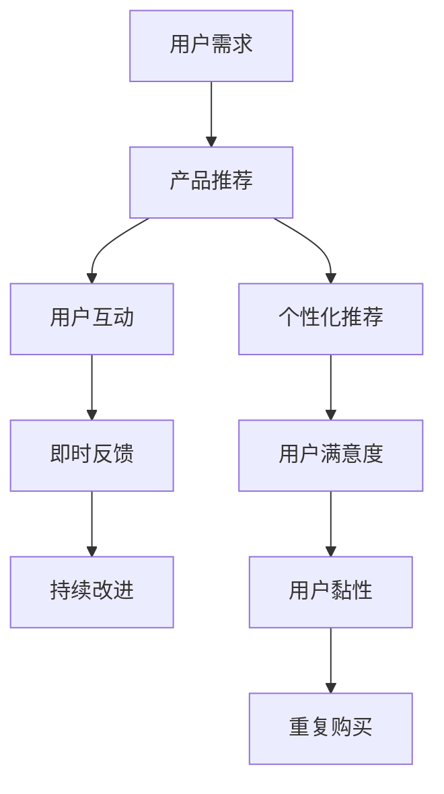

                 

## 1. 背景介绍

在信息爆炸的时代，注意力成为了稀缺资源，用户如何在这海量的信息中找到有价值的内容成为了难题。如何在有限的时间内，让用户从繁杂的信息中获取最相关的信息，并从中得到价值和满足感，是任何产品设计者和开发者需要关注的核心问题。这便涉及到“注意力经济”，即如何通过产品和服务的创新，吸引和保持用户的注意力，从而实现商业价值最大化。

### 1.1 注意力经济的兴起
注意力经济（Attention Economy）源于美国经济学家马克·泰珀（Mark W. Geisler）和约翰·米斯特尔（John Muster）在1990年提出的概念，他们认为在信息泛滥的现代社会，注意力成为了一种稀缺资源。

注意力经济的兴起，主要归功于以下几个因素：
1. **数字技术的普及**：互联网、移动互联网的普及，让每个人都可以随时随地接入到海量信息流中，使得注意力成为一种宝贵的资源。
2. **社交媒体的兴起**：微博、微信、抖音等社交媒体平台的兴起，使得信息传播更加高效，同时吸引了大量用户，形成了巨大的注意力池。
3. **内容的碎片化**：信息的获取不再局限于长篇文章，短视频、图文内容、音频内容等多样化形式的内容传播，使得用户注意力容易被分散。

### 1.2 用户注意力的获取与保持
用户的注意力不仅是一种资源，更是一种资产。获取和保持用户注意力的方法和策略，是产品设计者和开发者需要关注的核心。以下是几种常见的方法：

1. **个性化推荐**：通过大数据和算法，分析用户的行为和兴趣，向用户推送个性化的内容和广告，提高用户黏性。
2. **视觉设计和交互体验**：通过优秀的视觉设计，吸引用户的注意力。交互体验的优化，使得用户用起来更加流畅、高效。
3. **即时反馈**：快速响应用户的操作和反馈，让用户感到被重视，增加用户的使用粘性。
4. **内容多样性**：提供多样化的内容形式，满足不同用户的需求。

## 2. 核心概念与联系

### 2.1 核心概念概述

为了更深入地理解注意力经济与用户体验优化策略，我们需要首先梳理一些关键概念：

- **用户体验（User Experience, UX）**：指用户与产品或服务互动时的感觉和认知。好的用户体验可以让用户感到满意，提高产品的用户黏性和满意度。
- **注意力（Attention）**：用户注意力的集中程度。注意力越集中，用户就越容易接受信息和完成任务。
- **认知负荷（Cognitive Load）**：用户在完成任务时所承受的认知负担，包括注意力、记忆、决策等。
- **用户路径（User Journey）**：用户从了解产品到最终使用的整个过程，包含发现、体验、购买、反馈等多个环节。

这些概念通过注意力经济这一主线相互关联，共同构成了用户体验优化的核心。

### 2.2 核心概念原理和架构的 Mermaid 流程图



这个图展示了用户在使用产品的过程中，从需求匹配到最终购买的完整流程。个性化推荐和即时反馈是提升用户满意度的重要手段，而持续改进和用户黏性则促进了用户重复购买和长期使用。

## 3. 核心算法原理 & 具体操作步骤

### 3.1 算法原理概述

用户体验优化和注意力获取的核心算法原理包括：

1. **个性化推荐算法**：通过分析用户行为和兴趣，推荐个性化的内容。
2. **交互设计算法**：通过优秀的界面设计和交互方式，降低用户的使用难度。
3. **认知负荷优化算法**：通过合理的任务设计，减少用户的认知负担。

### 3.2 算法步骤详解

以个性化推荐算法为例，介绍具体的操作步骤：

1. **数据收集与预处理**：
    - 收集用户行为数据，如浏览记录、点击记录、购买记录等。
    - 清洗数据，去除噪音和异常值。

2. **特征提取**：
    - 提取用户和内容的特征，如用户的兴趣爱好、内容的分类、情感倾向等。
    - 使用特征工程技术，将原始数据转换为模型可处理的形式。

3. **模型训练**：
    - 选择合适的推荐算法，如协同过滤、基于内容的推荐、混合推荐等。
    - 在训练集上进行模型训练，得到推荐模型。

4. **模型评估与优化**：
    - 使用验证集评估模型的效果，如准确率、召回率等。
    - 根据评估结果，调整模型参数，优化模型性能。

5. **推荐实现与反馈**：
    - 在用户登录或访问时，实时推荐内容。
    - 收集用户反馈，更新推荐模型，提高推荐的个性化和准确性。

### 3.3 算法优缺点

个性化推荐算法的优点包括：
1. 提高用户满意度：通过个性化推荐，用户可以更快找到感兴趣的内容。
2. 增加用户黏性：个性化的推荐可以显著提高用户的留存率。
3. 促进转化：精准的推荐可以提高用户的购买率。

缺点包括：
1. 数据隐私问题：个性化推荐需要大量的用户数据，可能侵犯用户隐私。
2. 推荐偏差：如果数据有偏差，推荐算法可能产生不公平的推荐结果。
3. 冷启动问题：对于新用户，没有足够的数据进行个性化推荐，需要寻找有效的冷启动策略。

### 3.4 算法应用领域

个性化推荐算法主要应用于以下领域：

1. **电商**：通过推荐个性化商品，提高用户购买率。
2. **新闻和媒体**：推送个性化新闻内容，提高用户阅读量和互动率。
3. **社交网络**：推荐个性化好友和内容，提高用户粘性。
4. **视频和音频**：推荐个性化视频和音频内容，提高观看和收听率。

## 4. 数学模型和公式 & 详细讲解 & 举例说明

### 4.1 数学模型构建

本节将介绍一个简单的协同过滤推荐模型的数学模型。

设用户的兴趣向量为 $u$，物品的特征向量为 $v$，用户对物品 $i$ 的评分向量为 $r_i$，则协同过滤模型的目标是最小化用户和物品的评分偏差，即：

$$
\min_{u,v} \sum_{i=1}^N \sum_{j=1}^M (r_{ij} - u^Tv_i)^2
$$

其中 $N$ 为用户的数量，$M$ 为物品的数量。

### 4.2 公式推导过程

对于一个简单的用户物品评分矩阵 $R$，协同过滤推荐模型可以使用奇异值分解（SVD）来找到低维的用户和物品的嵌入，从而进行推荐。

$$
R \approx U \Sigma V^T
$$

其中 $U$ 为用户的低维嵌入，$V$ 为物品的低维嵌入，$\Sigma$ 为奇异值矩阵。

使用 $U$ 和 $V$ 进行推荐时，可以使用如下公式：

$$
\hat{r}_{ui} = u^TU_i
$$

其中 $U_i$ 为物品 $i$ 的低维嵌入。

### 4.3 案例分析与讲解

假设有一个在线书店，用户 $u$ 对物品 $i$ 的评分向量为 $r_{i1}, r_{i2}, \ldots, r_{im}$，物品的特征向量为 $v_{i1}, v_{i2}, \ldots, v_{in}$，则可以使用协同过滤算法进行推荐。

首先，使用SVD分解评分矩阵 $R$，得到 $U$ 和 $V$，计算物品 $i$ 的低维嵌入 $U_i$。然后，计算用户 $u$ 对物品 $i$ 的预测评分 $\hat{r}_{ui}$，最后根据预测评分排序推荐物品。

## 5. 项目实践：代码实例和详细解释说明

### 5.1 开发环境搭建

要在Python中进行协同过滤推荐系统的开发，首先需要安装必要的库：

1. 使用 `pip` 安装 `numpy` 和 `scipy` 用于科学计算。
2. 使用 `pip` 安装 `pandas` 用于数据处理。
3. 使用 `pip` 安装 `scikit-learn` 用于机器学习算法实现。
4. 使用 `pip` 安装 `scikit-matrix` 用于矩阵分解。

```bash
pip install numpy scipy pandas scikit-learn scikit-matrix
```

### 5.2 源代码详细实现

下面是一个简单的协同过滤推荐系统代码实现：

```python
import numpy as np
from scipy import linalg
from sklearn.decomposition import TruncatedSVD

# 生成模拟数据
N = 100  # 用户数量
M = 200  # 物品数量
R = np.random.rand(N, M)  # 随机生成评分矩阵

# 奇异值分解
U, S, Vt = linalg.svd(R)

# 使用TruncatedSVD进行矩阵分解
svd = TruncatedSVD(n_components=10)
Uhat = svd.fit_transform(R)
Vhat = svd.inverse_transform(Vt)

# 计算物品的低维嵌入
Uhat = np.matmul(np.linalg.inv(Uhat), Uhat.T)
Uhat = np.matmul(Uhat, Vhat)

# 计算用户对物品的预测评分
def predict_user_item(user_idx, item_idx):
    user_vec = Uhat[user_idx]
    item_vec = Uhat[item_idx]
    prediction = np.dot(user_vec, item_vec)
    return prediction

# 测试预测函数
user_idx = 50
item_idx = 150
prediction = predict_user_item(user_idx, item_idx)
print("User {} predicts item {} with score {:.2f}".format(user_idx, item_idx, prediction))
```

### 5.3 代码解读与分析

1. **数据生成**：首先生成一个 $N \times M$ 的评分矩阵 $R$，其中 $N$ 和 $M$ 分别为用户数量和物品数量。

2. **奇异值分解**：使用 `linalg.svd` 函数进行奇异值分解，得到 $U$、$S$ 和 $Vt$。

3. **矩阵分解**：使用 `TruncatedSVD` 进行矩阵分解，得到低维嵌入 $Uhat$ 和 $Vhat$。

4. **物品低维嵌入计算**：计算物品的低维嵌入 $Uhat$。

5. **预测评分**：使用预测函数 `predict_user_item` 计算用户对物品的预测评分。

6. **测试代码**：测试预测函数，输出预测结果。

## 6. 实际应用场景

### 6.1 智能推荐系统

智能推荐系统是注意力经济和用户体验优化的典型应用。通过个性化推荐算法，智能推荐系统可以根据用户的兴趣和行为，向用户推荐个性化内容。例如，在电商网站中，用户可以通过浏览历史、购买记录、搜索记录等信息，获得个性化的商品推荐。

### 6.2 游戏体验优化

在游戏领域，注意力和用户体验同样重要。游戏设计者可以通过动态调整游戏难度、界面设计、音效等，吸引和保持玩家的注意力。例如，在游戏过程中，实时调整道具掉落、任务难度等，增加游戏的趣味性和挑战性。

### 6.3 数字广告投放

数字广告投放也是注意力经济的重要应用领域。通过精准的广告投放，广告主可以将广告推送给感兴趣的用户，从而提高广告的点击率和转化率。例如，电商广告、视频广告、新闻广告等，都依赖于个性化推荐和用户体验优化技术。

### 6.4 未来应用展望

未来，随着技术的进步，用户体验优化和注意力获取将更加智能化和个性化。以下是一些未来应用展望：

1. **多模态交互**：结合语音、视觉、触觉等多模态交互方式，提供更加自然、便捷的体验。

2. **增强现实和虚拟现实**：通过AR/VR技术，提供沉浸式的用户体验。例如，在虚拟购物中，用户可以实时体验产品。

3. **智能家居和物联网**：通过智能家居设备，实时获取用户的行为数据，提供个性化的服务和体验。

4. **智能客服**：通过自然语言处理技术，实现智能客服机器人，提供24小时无间断的服务。

## 7. 工具和资源推荐

### 7.1 学习资源推荐

为了帮助开发者深入学习用户体验优化和注意力获取技术，这里推荐一些优质的学习资源：

1. **Coursera《Human-Computer Interaction》课程**：由斯坦福大学教授讲授，涵盖了人机交互的各个方面，包括用户研究、界面设计等。

2. **Udacity《UX Design Nanodegree》课程**：由Google、Amazon等公司专家讲授，提供系统的用户体验设计培训。

3. **《Designing Interactive Systems》书籍**：详细介绍了用户界面设计的理论和方法，适合设计师和开发人员阅读。

4. **《Interaction Design Foundation》网站**：提供丰富的用户体验设计资源和案例，适合设计师和研究人员参考。

### 7.2 开发工具推荐

在实际开发中，我们可以使用以下工具来提升开发效率：

1. **Visual Studio Code**：轻量级代码编辑器，支持多种编程语言和插件，是开发体验优化的好选择。

2. **JIRA**：项目管理工具，适合团队协作和任务管理，支持敏捷开发和敏捷管理。

3. **Sketch**：图形设计工具，适合UI/UX设计师进行界面设计和原型制作。

4. **Figma**：云端设计工具，支持实时协作，适合团队共同设计界面和原型。

### 7.3 相关论文推荐

用户体验优化和注意力获取技术的研究，涉及多学科领域，以下是几篇具有代表性的论文：

1. **《Human Factors and Ergonomics in System Design》书籍**：由人机交互领域的权威人士编写，详细介绍了人机交互的理论和方法。

2. **《Cognitive Engineering and User Centered Systems》论文**：介绍了认知工程和用户中心系统的理论和方法，涵盖了用户研究、设计评估等。

3. **《Design Patterns for User-Centered Interfaces》论文**：介绍了用户界面设计的模式和最佳实践，适合开发人员和设计师阅读。

4. **《Attention is All You Need》论文**：介绍了Transformer模型，为NLP领域的注意力机制奠定了基础。

## 8. 总结：未来发展趋势与挑战

### 8.1 总结

本文系统介绍了用户体验优化和注意力获取策略与技术，强调了在信息爆炸时代，如何通过技术和产品创新吸引和保持用户的注意力。通过个性化推荐、视觉设计和交互体验优化等手段，提升产品的用户体验，吸引用户并提高用户的黏性，最终实现商业价值的最大化。

### 8.2 未来发展趋势

未来，用户体验优化和注意力获取将更加智能化和个性化。以下是一些可能的趋势：

1. **深度学习和人工智能**：通过深度学习和人工智能技术，实时分析用户行为和反馈，提供更加个性化的推荐和体验。

2. **多模态交互**：结合语音、视觉、触觉等多模态交互方式，提供更加自然、便捷的体验。

3. **增强现实和虚拟现实**：通过AR/VR技术，提供沉浸式的用户体验。

4. **智能家居和物联网**：通过智能家居设备，实时获取用户的行为数据，提供个性化的服务和体验。

### 8.3 面临的挑战

尽管用户体验优化和注意力获取技术在不断进步，但仍然面临一些挑战：

1. **数据隐私问题**：收集用户数据可能侵犯用户隐私，如何保护用户数据隐私，是一个重要的挑战。

2. **算法偏见**：推荐算法可能存在偏见，导致不公平的推荐结果，需要设计更加公平、公正的算法。

3. **技术复杂性**：用户体验优化和注意力获取涉及多学科知识，需要跨领域协作和整合。

### 8.4 研究展望

未来，用户体验优化和注意力获取技术将面临更多的挑战和机遇：

1. **隐私保护技术**：发展隐私保护技术，确保用户数据的安全性和隐私性。

2. **公平性算法**：开发公平性算法，确保推荐结果的公正性。

3. **跨领域协作**：加强跨学科合作，推动用户体验优化和注意力获取技术的快速发展。

4. **用户体验评估**：建立更加科学、客观的用户体验评估体系，确保用户体验优化的效果。

## 9. 附录：常见问题与解答

### Q1: 如何衡量用户体验的优劣？

A: 衡量用户体验的优劣可以从多个方面进行评估，如用户满意度、用户留存率、转化率等。具体评估指标包括：

1. **用户满意度（User Satisfaction）**：通过问卷调查或用户反馈，衡量用户对产品或服务的满意度。
2. **用户留存率（User Retention）**：衡量用户在一定时间内的留存情况，留存率越高，说明用户对产品越满意。
3. **转化率（Conversion Rate）**：衡量用户完成某个目标的频率，如购买、注册等。
4. **NPS（Net Promoter Score）**：衡量用户对产品的推荐意愿，NPS越高，说明用户对产品的满意度越高。

### Q2: 推荐算法有哪些？

A: 推荐算法主要分为以下几类：

1. **协同过滤算法（Collaborative Filtering）**：基于用户和物品的评分矩阵，进行推荐。

2. **基于内容的推荐算法（Content-Based Filtering）**：基于物品的特征，推荐相似的物品。

3. **混合推荐算法（Hybrid Recommender）**：结合协同过滤和基于内容的推荐，提高推荐的准确性。

4. **矩阵分解算法（Matrix Factorization）**：通过矩阵分解，找到低维嵌入，进行推荐。

### Q3: 如何设计一个优秀的产品界面？

A: 设计优秀的产品界面需要遵循以下原则：

1. **简洁性**：界面设计应该简洁明了，避免过多的视觉元素，减少用户认知负荷。

2. **一致性**：界面设计应该保持一致性，让用户能够快速适应和理解。

3. **可操作性**：界面设计应该操作便捷，用户能够快速完成目标任务。

4. **可访问性**：界面设计应该考虑用户的需求，保证易用性。

5. **视觉吸引力**：界面设计应该具有视觉吸引力，吸引用户的注意力。

### Q4: 如何优化用户体验？

A: 优化用户体验可以从以下几个方面进行：

1. **用户研究**：通过用户研究，了解用户需求和痛点，设计满足用户需求的产品。

2. **界面设计**：通过优秀的界面设计，提升用户的使用体验。

3. **交互设计**：通过优秀的交互设计，提升用户的操作体验。

4. **数据驱动**：通过数据分析，优化产品功能和服务。

5. **持续改进**：通过持续的用户反馈和数据分析，不断优化产品。

---

作者：禅与计算机程序设计艺术 / Zen and the Art of Computer Programming

