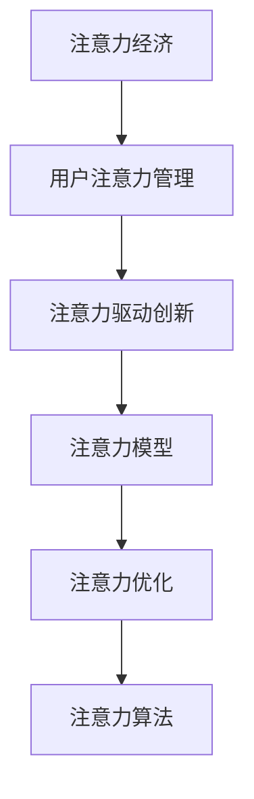

                 

# 注意力经济对企业创新管理的影响

## 1. 背景介绍

### 1.1 问题由来
在数字经济时代，注意力成为一种稀缺资源。据统计，人类每天接收的信息量达到数亿次，但真正能进入人们视线的却不到0.01%。这种“注意力经济”现象对企业的创新管理产生了深远的影响。企业如何吸引用户注意力、如何管理注意力资源，成为决定其创新成功与否的关键因素。

### 1.2 问题核心关键点
注意力经济的核心在于如何最大化地利用用户注意力资源，驱动用户参与、刺激消费、促进创新。具体来说，包括以下几个方面：
1. **注意力获取**：企业需要创新地获取用户注意力，如通过内容营销、社交媒体运营、个性化推荐等手段。
2. **注意力管理**：企业需要有效地管理用户注意力，防止用户流失，提升用户黏性。
3. **注意力利用**：企业需要最大化地利用用户注意力，推动销售增长、品牌提升、产品创新。

### 1.3 问题研究意义
研究注意力经济对企业创新管理的影响，对于提升企业在数字时代的竞争力，实现可持续发展具有重要意义：

1. **提升用户体验**：通过更好地管理用户注意力，企业可以提供更优质的产品和服务，增强用户满意度和忠诚度。
2. **推动创新发展**：注意力经济为企业提供了新的商业模式和收入来源，激发了更多的创新探索。
3. **优化资源配置**：企业可以通过优化注意力资源配置，提高运营效率，降低营销成本。
4. **构建竞争优势**：在注意力稀缺的今天，有效管理注意力资源的组织将获得更大的市场份额和竞争优势。

## 2. 核心概念与联系

### 2.1 核心概念概述

为更好地理解注意力经济对企业创新管理的影响，本节将介绍几个密切相关的核心概念：

- **注意力经济**：指在数字时代，注意力作为一种稀缺资源，对企业生产、流通和消费活动产生影响的一种经济形态。注意力经济的核心在于如何最大化地利用和分配注意力资源。

- **用户注意力管理**：指企业通过各种手段（如内容营销、社交媒体运营、个性化推荐等）获取和保留用户注意力，从而提升用户参与度和忠诚度。

- **注意力驱动创新**：指企业通过利用用户注意力资源，推动产品、服务、市场策略等方面的创新。

- **注意力模型**：指用于分析和预测用户注意力行为和趋势的数学和统计模型，包括用户行为分析、注意力预测、兴趣点挖掘等。

- **注意力优化**：指在注意力资源有限的情况下，通过优化广告投放、内容推荐、用户互动等方式，最大化利用注意力资源的过程。

- **注意力算法**：指用于注意力获取、管理、优化的一系列算法技术，包括推荐系统、协同过滤、广告投放算法等。

这些核心概念之间的逻辑关系可以通过以下Mermaid流程图来展示：



这个流程图展示了的核心概念及其之间的关系：

1. 注意力经济为其他概念提供了基础，所有的注意力相关活动都是在此背景下进行的。
2. 用户注意力管理是注意力经济的核心，企业通过各种手段吸引和保留用户。
3. 注意力驱动创新是将注意力资源转化为实际价值的重要环节，推动企业持续创新。
4. 注意力模型和算法是管理和优化注意力资源的工具，为注意力驱动创新提供数据和算法支持。

## 3. 核心算法原理 & 具体操作步骤
### 3.1 算法原理概述

注意力驱动的企业创新管理，本质上是将注意力资源转化为创新动力的过程。其核心思想是：通过吸引和保留用户注意力，利用注意力数据进行深入分析，从而驱动企业产品、服务、市场策略等方面的创新。

形式化地，假设企业能够获取到用户的注意力数据 $A$，则其创新的目标是最大化利用注意力资源，即：

$$
\max_{\theta} \sum_{i=1}^n A_i \cdot f_{\theta}(A_i)
$$

其中，$f_{\theta}$ 表示基于注意力数据的创新函数，如内容推荐、广告投放等。$\theta$ 为模型参数，用于表示企业运营策略和市场定位。

### 3.2 算法步骤详解

基于注意力驱动的企业创新管理，一般包括以下几个关键步骤：

**Step 1: 收集用户注意力数据**
- 通过各种渠道（如社交媒体、网站、APP等）收集用户行为数据。
- 对数据进行清洗、标注和预处理，形成可用于分析和建模的样本集。

**Step 2: 分析用户注意力行为**
- 使用用户行为分析工具，如Web分析、移动应用分析等，了解用户注意力分布和行为模式。
- 通过聚类分析、时序分析等方法，识别出用户的主要关注点和使用场景。

**Step 3: 构建注意力驱动模型**
- 根据用户注意力行为数据，选择合适的注意力模型，如协同过滤、内容推荐系统等。
- 对模型进行训练和调优，确保其能够准确预测用户注意力需求和行为变化。

**Step 4: 制定创新策略**
- 结合注意力模型预测结果，制定针对性强的产品创新、服务优化和市场策略。
- 根据用户反馈和市场变化，持续优化注意力驱动模型，确保其长期有效性。

**Step 5: 实施和评估**
- 将注意力驱动策略应用到实际业务中，如推广活动、产品更新等。
- 持续评估策略效果，收集用户反馈，进行迭代优化。

### 3.3 算法优缺点

基于注意力驱动的企业创新管理方法具有以下优点：
1. **高效精准**：利用注意力数据进行精准分析和预测，能够有效提升产品、服务和市场策略的精准度。
2. **低成本**：相较于传统市场调研，注意力驱动方法能够大幅度降低数据收集和分析成本。
3. **实时响应**：通过实时监测用户注意力变化，能够迅速调整策略，适应市场变化。
4. **增强用户黏性**：通过个性化推荐和精准营销，提高用户满意度和忠诚度，增强用户黏性。

同时，该方法也存在一定的局限性：
1. **隐私问题**：获取和处理用户注意力数据时，需要注意用户隐私保护。
2. **数据噪音**：用户行为数据可能存在噪声，需要进行预处理和去噪。
3. **模型复杂度**：注意力模型需要复杂的算法和大量计算资源，模型调优和维护成本较高。
4. **公平性问题**：注意力驱动策略可能加剧用户之间的注意力不平等，导致不公平现象。

尽管存在这些局限性，但就目前而言，基于注意力驱动的企业创新管理方法仍是一种高效、精准、低成本的创新管理方式。未来相关研究的重点在于如何进一步提高模型鲁棒性，增强公平性，并解决隐私保护问题。

### 3.4 算法应用领域

基于注意力驱动的企业创新管理方法，已经在多个行业领域得到广泛应用，例如：

- **电子商务**：通过分析用户浏览、点击、购买等行为，推动商品推荐、个性化促销等创新。
- **社交媒体**：通过监测用户互动和内容曝光情况，优化内容生产和推广策略。
- **金融服务**：通过用户交易行为和金融数据，提供个性化理财和投资建议。
- **健康医疗**：通过分析用户健康数据，提供个性化健康建议和治疗方案。
- **娱乐传媒**：通过用户观看行为和反馈，推动影视作品和游戏内容创新。

除了上述这些经典应用外，注意力驱动方法也被创新性地应用到更多场景中，如智能家居、智能制造、智能交通等，为各行业数字化转型升级提供新的技术路径。

## 4. 数学模型和公式 & 详细讲解  
### 4.1 数学模型构建

本节将使用数学语言对注意力驱动的企业创新管理过程进行更加严格的刻画。

记用户注意力数据为 $A=\{A_1, A_2, ..., A_n\}$，其中 $A_i$ 表示用户在第 $i$ 个时间点的注意力指数。设企业运营策略为 $\theta$，则创新驱动函数 $f_{\theta}(A)$ 可表示为：

$$
f_{\theta}(A) = \theta_1 \cdot \alpha(A) + \theta_2 \cdot \beta(A) + \ldots + \theta_k \cdot \gamma(A)
$$

其中，$\alpha(A), \beta(A), \ldots, \gamma(A)$ 为注意力数据分析函数，如用户点击率、评论数量等，$\theta_1, \theta_2, \ldots, \theta_k$ 为策略参数。

### 4.2 公式推导过程

以下我们以内容推荐系统为例，推导注意力驱动的内容推荐模型及其梯度计算公式。

假设用户对内容 $C$ 的注意力指数为 $A$，推荐系统输出用户对内容 $C$ 的评分 $R$。则内容推荐模型可表示为：

$$
R = f_{\theta}(A) = \theta_1 \cdot \alpha(A) + \theta_2 \cdot \beta(A)
$$

其中，$\alpha(A)$ 为内容相关度函数，$\beta(A)$ 为用户兴趣函数。

将内容推荐模型的目标函数定义为：

$$
\mathcal{L}(\theta) = \sum_{i=1}^n L_i(\theta)
$$

其中 $L_i(\theta)$ 为第 $i$ 个用户的内容推荐损失函数，通常使用均方误差损失或交叉熵损失。

根据链式法则，损失函数对策略参数 $\theta$ 的梯度为：

$$
\frac{\partial \mathcal{L}(\theta)}{\partial \theta} = \sum_{i=1}^n \frac{\partial L_i(\theta)}{\partial \theta}
$$

其中 $\frac{\partial L_i(\theta)}{\partial \theta}$ 可进一步递归展开，利用自动微分技术完成计算。

在得到损失函数的梯度后，即可带入优化算法，更新策略参数 $\theta$，最小化损失函数 $\mathcal{L}(\theta)$，从而实现内容的精准推荐。

## 5. 项目实践：代码实例和详细解释说明
### 5.1 开发环境搭建

在进行注意力驱动的创新管理实践前，我们需要准备好开发环境。以下是使用Python进行PyTorch开发的环境配置流程：

1. 安装Anaconda：从官网下载并安装Anaconda，用于创建独立的Python环境。

2. 创建并激活虚拟环境：
```bash
conda create -n pytorch-env python=3.8 
conda activate pytorch-env
```

3. 安装PyTorch：根据CUDA版本，从官网获取对应的安装命令。例如：
```bash
conda install pytorch torchvision torchaudio cudatoolkit=11.1 -c pytorch -c conda-forge
```

4. 安装TensorFlow：由Google主导开发的开源深度学习框架，生产部署方便，适合大规模工程应用。同样有丰富的预训练语言模型资源。

5. 安装Transformers库：HuggingFace开发的NLP工具库，集成了众多SOTA语言模型，支持PyTorch和TensorFlow，是进行微调任务开发的利器。

6. 安装各类工具包：
```bash
pip install numpy pandas scikit-learn matplotlib tqdm jupyter notebook ipython
```

完成上述步骤后，即可在`pytorch-env`环境中开始创新管理实践。

### 5.2 源代码详细实现

下面我们以内容推荐系统为例，给出使用Transformers库对BERT模型进行注意力驱动的内容推荐系统实现的PyTorch代码。

首先，定义推荐任务的数据处理函数：

```python
from transformers import BertTokenizer
from torch.utils.data import Dataset
import torch

class RecommendationDataset(Dataset):
    def __init__(self, texts, targets, tokenizer, max_len=128):
        self.texts = texts
        self.targets = targets
        self.tokenizer = tokenizer
        self.max_len = max_len
        
    def __len__(self):
        return len(self.texts)
    
    def __getitem__(self, item):
        text = self.texts[item]
        target = self.targets[item]
        
        encoding = self.tokenizer(text, return_tensors='pt', max_length=self.max_len, padding='max_length', truncation=True)
        input_ids = encoding['input_ids'][0]
        attention_mask = encoding['attention_mask'][0]
        
        # 对target进行编码
        encoded_target = [target2id[target] for target in target]
        encoded_target.extend([target2id['0']] * (self.max_len - len(encoded_target)))
        labels = torch.tensor(encoded_target, dtype=torch.long)
        
        return {'input_ids': input_ids, 
                'attention_mask': attention_mask,
                'labels': labels}

# 标签与id的映射
target2id = {'0': 0, '1': 1, '2': 2, '3': 3}
id2target = {v: k for k, v in target2id.items()}

# 创建dataset
tokenizer = BertTokenizer.from_pretrained('bert-base-cased')

train_dataset = RecommendationDataset(train_texts, train_targets, tokenizer)
dev_dataset = RecommendationDataset(dev_texts, dev_targets, tokenizer)
test_dataset = RecommendationDataset(test_texts, test_targets, tokenizer)
```

然后，定义模型和优化器：

```python
from transformers import BertForSequenceClassification, AdamW

model = BertForSequenceClassification.from_pretrained('bert-base-cased', num_labels=len(target2id))

optimizer = AdamW(model.parameters(), lr=2e-5)
```

接着，定义训练和评估函数：

```python
from torch.utils.data import DataLoader
from tqdm import tqdm
from sklearn.metrics import classification_report

device = torch.device('cuda') if torch.cuda.is_available() else torch.device('cpu')
model.to(device)

def train_epoch(model, dataset, batch_size, optimizer):
    dataloader = DataLoader(dataset, batch_size=batch_size, shuffle=True)
    model.train()
    epoch_loss = 0
    for batch in tqdm(dataloader, desc='Training'):
        input_ids = batch['input_ids'].to(device)
        attention_mask = batch['attention_mask'].to(device)
        labels = batch['labels'].to(device)
        model.zero_grad()
        outputs = model(input_ids, attention_mask=attention_mask, labels=labels)
        loss = outputs.loss
        epoch_loss += loss.item()
        loss.backward()
        optimizer.step()
    return epoch_loss / len(dataloader)

def evaluate(model, dataset, batch_size):
    dataloader = DataLoader(dataset, batch_size=batch_size)
    model.eval()
    preds, labels = [], []
    with torch.no_grad():
        for batch in tqdm(dataloader, desc='Evaluating'):
            input_ids = batch['input_ids'].to(device)
            attention_mask = batch['attention_mask'].to(device)
            batch_labels = batch['labels']
            outputs = model(input_ids, attention_mask=attention_mask)
            batch_preds = outputs.logits.argmax(dim=2).to('cpu').tolist()
            batch_labels = batch_labels.to('cpu').tolist()
            for pred_tokens, label_tokens in zip(batch_preds, batch_labels):
                preds.append(pred_tokens[:len(label_tokens)])
                labels.append(label_tokens)
                
    print(classification_report(labels, preds))
```

最后，启动训练流程并在测试集上评估：

```python
epochs = 5
batch_size = 16

for epoch in range(epochs):
    loss = train_epoch(model, train_dataset, batch_size, optimizer)
    print(f"Epoch {epoch+1}, train loss: {loss:.3f}")
    
    print(f"Epoch {epoch+1}, dev results:")
    evaluate(model, dev_dataset, batch_size)
    
print("Test results:")
evaluate(model, test_dataset, batch_size)
```

以上就是使用PyTorch对BERT进行内容推荐系统微调的完整代码实现。可以看到，得益于Transformers库的强大封装，我们可以用相对简洁的代码完成BERT模型的加载和微调。

### 5.3 代码解读与分析

让我们再详细解读一下关键代码的实现细节：

**RecommendationDataset类**：
- `__init__`方法：初始化文本、标签、分词器等关键组件。
- `__len__`方法：返回数据集的样本数量。
- `__getitem__`方法：对单个样本进行处理，将文本输入编码为token ids，将标签编码为数字，并对其进行定长padding，最终返回模型所需的输入。

**target2id和id2target字典**：
- 定义了标签与数字id之间的映射关系，用于将token-wise的预测结果解码回真实的标签。

**训练和评估函数**：
- 使用PyTorch的DataLoader对数据集进行批次化加载，供模型训练和推理使用。
- 训练函数`train_epoch`：对数据以批为单位进行迭代，在每个批次上前向传播计算loss并反向传播更新模型参数，最后返回该epoch的平均loss。
- 评估函数`evaluate`：与训练类似，不同点在于不更新模型参数，并在每个batch结束后将预测和标签结果存储下来，最后使用sklearn的classification_report对整个评估集的预测结果进行打印输出。

**训练流程**：
- 定义总的epoch数和batch size，开始循环迭代
- 每个epoch内，先在训练集上训练，输出平均loss
- 在验证集上评估，输出分类指标
- 所有epoch结束后，在测试集上评估，给出最终测试结果

可以看到，PyTorch配合Transformers库使得BERT微调的代码实现变得简洁高效。开发者可以将更多精力放在数据处理、模型改进等高层逻辑上，而不必过多关注底层的实现细节。

当然，工业级的系统实现还需考虑更多因素，如模型的保存和部署、超参数的自动搜索、更灵活的任务适配层等。但核心的注意力驱动内容推荐流程基本与此类似。

## 6. 实际应用场景
### 6.1 智能客服系统

基于注意力驱动的企业创新管理方法，可以广泛应用于智能客服系统的构建。传统客服往往需要配备大量人力，高峰期响应缓慢，且一致性和专业性难以保证。而使用注意力驱动的客服系统，可以实时监测用户注意力变化，及时响应用户需求，提供个性化、高效的服务。

在技术实现上，可以收集客户的历史互动记录和行为数据，利用注意力模型分析用户关注点和使用场景，自动调整客服策略和内容。对于用户提出的新问题，还可以接入检索系统实时搜索相关内容，动态生成回答。如此构建的智能客服系统，能够显著提升客户满意度和服务效率。

### 6.2 金融舆情监测

金融机构需要实时监测市场舆论动向，以便及时应对负面信息传播，规避金融风险。传统的人工监测方式成本高、效率低，难以应对网络时代海量信息爆发的挑战。基于注意力驱动的企业创新管理方法，可以实时监测金融舆情，通过用户关注点和情感分析，预测市场趋势和风险变化，提前采取应对措施。

具体而言，可以收集金融领域相关的新闻、报道、评论等文本数据，并对其进行情感标注和兴趣点挖掘。在此基础上对注意力驱动模型进行微调，使其能够自动判断文本属于何种情感倾向，预测金融市场变化。将微调后的模型应用到实时抓取的网络文本数据，就能够自动监测不同情感倾向下的舆情变化，一旦发现负面信息激增等异常情况，系统便会自动预警，帮助金融机构快速应对潜在风险。

### 6.3 个性化推荐系统

当前的推荐系统往往只依赖用户的历史行为数据进行物品推荐，无法深入理解用户的真实兴趣偏好。基于注意力驱动的企业创新管理方法，可以更好地挖掘用户行为背后的语义信息，从而提供更精准、多样的推荐内容。

在实践中，可以收集用户浏览、点击、评论、分享等行为数据，提取和用户交互的物品标题、描述、标签等文本内容。将文本内容作为模型输入，用户的后续行为（如是否点击、购买等）作为监督信号，在此基础上微调注意力驱动模型。微调后的模型能够从文本内容中准确把握用户的兴趣点。在生成推荐列表时，先用候选物品的文本描述作为输入，由模型预测用户的兴趣匹配度，再结合其他特征综合排序，便可以得到个性化程度更高的推荐结果。

### 6.4 未来应用展望

随着注意力驱动的企业创新管理技术的不断发展，基于注意力驱动的创新管理方法将在更多领域得到应用，为传统行业数字化转型升级提供新的技术路径。

在智慧医疗领域，基于注意力驱动的企业创新管理方法可以用于医疗数据的深度分析，挖掘病患的关注点和需求，提供个性化治疗方案和健康建议。

在智能教育领域，注意力驱动方法可以应用于学生行为分析，了解学生的学习兴趣和使用场景，提供个性化学习内容和教育策略。

在智慧城市治理中，注意力驱动方法可以用于城市事件监测，预测和管理突发事件，提升城市管理的智能化水平。

此外，在企业生产、社会治理、文娱传媒等众多领域，注意力驱动的企业创新管理方法也将不断涌现，为各行各业数字化转型升级提供新的技术路径。相信随着技术的日益成熟，注意力驱动方法将成为企业创新管理的重要范式，推动人工智能技术在各行业的深入应用。

## 7. 工具和资源推荐
### 7.1 学习资源推荐

为了帮助开发者系统掌握注意力驱动的企业创新管理理论基础和实践技巧，这里推荐一些优质的学习资源：

1. 《注意力机制与深度学习》系列博文：由深度学习专家撰写，深入浅出地介绍了注意力机制的原理、应用和实践技巧。

2. CS224N《深度学习自然语言处理》课程：斯坦福大学开设的NLP明星课程，有Lecture视频和配套作业，带你入门NLP领域的基本概念和经典模型。

3. 《Attention and Transformers》书籍：Transformer原作者所著，全面介绍了Transformer架构、注意力机制和应用案例。

4. Attention is All You Need论文：提出Transformer模型，引入注意力机制，引发了自然语言处理领域的革命。

5. Transformer注意力的详细介绍：由OpenAI博客撰写的关于Transformer注意力机制的详细介绍，适合进阶学习。

6. TensorFlow官方文档：TensorFlow的官方文档，提供了丰富的TensorFlow资源和代码示例，适合TensorFlow用户。

通过对这些资源的学习实践，相信你一定能够快速掌握注意力驱动的企业创新管理精髓，并用于解决实际的NLP问题。

### 7.2 开发工具推荐

高效的开发离不开优秀的工具支持。以下是几款用于注意力驱动创新管理开发的常用工具：

1. PyTorch：基于Python的开源深度学习框架，灵活动态的计算图，适合快速迭代研究。大部分预训练语言模型都有PyTorch版本的实现。

2. TensorFlow：由Google主导开发的开源深度学习框架，生产部署方便，适合大规模工程应用。同样有丰富的预训练语言模型资源。

3. Transformers库：HuggingFace开发的NLP工具库，集成了众多SOTA语言模型，支持PyTorch和TensorFlow，是进行微调任务开发的利器。

4. Weights & Biases：模型训练的实验跟踪工具，可以记录和可视化模型训练过程中的各项指标，方便对比和调优。与主流深度学习框架无缝集成。

5. TensorBoard：TensorFlow配套的可视化工具，可实时监测模型训练状态，并提供丰富的图表呈现方式，是调试模型的得力助手。

6. Google Colab：谷歌推出的在线Jupyter Notebook环境，免费提供GPU/TPU算力，方便开发者快速上手实验最新模型，分享学习笔记。

合理利用这些工具，可以显著提升注意力驱动创新管理任务的开发效率，加快创新迭代的步伐。

### 7.3 相关论文推荐

注意力驱动的企业创新管理技术的发展源于学界的持续研究。以下是几篇奠基性的相关论文，推荐阅读：

1. Attention is All You Need：提出了Transformer结构，引入了注意力机制，开启了NLP领域的预训练大模型时代。

2. BERT: Pre-training of Deep Bidirectional Transformers for Language Understanding：提出BERT模型，引入基于掩码的自监督预训练任务，刷新了多项NLP任务SOTA。

3. Attention-based Recommender Systems for Big Data：介绍了基于注意力机制的推荐系统，并分析了其在处理大规模数据时的优势。

4. Deep attentive network for information retrieval：提出了一种基于注意力机制的深度检索网络，提升了信息检索的精度和效率。

5. Multi-task learning using a single neural network with dynamic routing：提出了一种基于注意力机制的多任务学习框架，提升了模型的多任务学习能力。

6. Graph Attention Networks：提出了一种基于图结构的注意力网络，用于处理图结构数据，并在多个领域取得了不错的效果。

这些论文代表了大语言模型注意力机制的发展脉络。通过学习这些前沿成果，可以帮助研究者把握学科前进方向，激发更多的创新灵感。

## 8. 总结：未来发展趋势与挑战

### 8.1 总结

本文对基于注意力驱动的企业创新管理方法进行了全面系统的介绍。首先阐述了注意力经济对企业创新管理的影响，明确了注意力驱动在吸引用户注意力、管理注意力资源、利用注意力资源等方面的独特价值。其次，从原理到实践，详细讲解了注意力驱动的企业创新管理数学模型和算法步骤，给出了注意力驱动任务开发的完整代码实例。同时，本文还广泛探讨了注意力驱动方法在智能客服、金融舆情、个性化推荐等多个行业领域的应用前景，展示了注意力驱动方法的低成本、高效精准和实时响应的优势。最后，本文精选了注意力驱动技术的各类学习资源，力求为读者提供全方位的技术指引。

通过本文的系统梳理，可以看到，基于注意力驱动的企业创新管理方法正在成为企业创新管理的重要范式，极大地拓展了企业创新路径，提升了企业市场竞争力。随着注意力机制的不断发展，基于注意力驱动的创新管理技术必将为更多行业数字化转型升级提供新的技术路径。

### 8.2 未来发展趋势

展望未来，注意力驱动的企业创新管理技术将呈现以下几个发展趋势：

1. **模型规模持续增大**：随着算力成本的下降和数据规模的扩张，预训练语言模型的参数量还将持续增长。超大规模语言模型蕴含的丰富语言知识，有望支撑更加复杂多变的注意力资源管理。

2. **注意力机制多样化**：未来会涌现更多注意力机制的创新形式，如自适应注意力、双向注意力、多模态注意力等，进一步提升注意力驱动系统的灵活性和鲁棒性。

3. **持续学习成为常态**：随着数据分布的不断变化，注意力驱动模型也需要持续学习新知识以保持性能。如何在不遗忘原有知识的同时，高效吸收新样本信息，将成为重要的研究课题。

4. **模型公平性增强**：未来注意力驱动系统将更加关注模型公平性问题，避免算法偏见，确保所有用户都能公平地获取注意力资源。

5. **多模态融合**：当前的注意力驱动方法主要聚焦于纯文本数据，未来会进一步拓展到图像、视频、语音等多模态数据微调。多模态信息的融合，将显著提升注意力驱动系统的感知和推理能力。

6. **上下文理解提升**：未来注意力驱动系统将更加注重上下文信息的理解，通过动态调整注意力权重，提高对长文本和复杂场景的建模能力。

以上趋势凸显了注意力驱动的企业创新管理技术的广阔前景。这些方向的探索发展，必将进一步提升企业创新管理的精准度、灵活性和可持续性，推动人工智能技术在各行业的深入应用。

### 8.3 面临的挑战

尽管注意力驱动的企业创新管理技术已经取得了瞩目成就，但在迈向更加智能化、普适化应用的过程中，它仍面临着诸多挑战：

1. **隐私问题**：获取和处理用户注意力数据时，需要注意用户隐私保护。如何在获取关注度信息的同时保护用户隐私，是一个亟待解决的问题。

2. **数据噪音**：用户行为数据可能存在噪声，需要进行预处理和去噪。如何从大规模数据中提取出有用的信息，避免信息过载，是一个技术难题。

3. **模型复杂度**：注意力驱动系统需要复杂的算法和大量计算资源，模型调优和维护成本较高。如何在保证系统效果的同时，降低模型复杂度，是一个重要的研究方向。

4. **公平性问题**：注意力驱动系统可能加剧用户之间的注意力不平等，导致不公平现象。如何在模型设计中避免算法偏见，确保所有用户都能公平地获取注意力资源，是一个重要的研究方向。

5. **计算资源消耗**：大规模注意力驱动系统对计算资源消耗较大，如何优化计算资源配置，提升系统效率，是一个重要的技术挑战。

6. **实时性问题**：注意力驱动系统需要实时监测用户注意力变化，如何在保证精度的情况下，提升系统响应速度，是一个重要的技术挑战。

尽管存在这些挑战，但随着学界和产业界的共同努力，这些问题终将一一被克服，注意力驱动的企业创新管理技术必将进一步拓展其应用边界，为各行业数字化转型升级提供新的技术路径。

### 8.4 研究展望

面对注意力驱动的企业创新管理所面临的种种挑战，未来的研究需要在以下几个方面寻求新的突破：

1. **探索无监督和半监督注意力机制**：摆脱对大规模标注数据的依赖，利用自监督学习、主动学习等无监督和半监督范式，最大限度利用非结构化数据，实现更加灵活高效的注意力资源管理。

2. **研究高效注意力模型**：开发更加高效、轻量级的注意力机制，在保证系统效果的同时，降低计算资源消耗，提升系统实时响应能力。

3. **融合因果推断和强化学习**：通过引入因果推断和强化学习思想，增强注意力驱动系统的因果推理能力，学习更加普适、鲁棒的语言表征，从而提升系统泛化性和抗干扰能力。

4. **引入更多先验知识**：将符号化的先验知识，如知识图谱、逻辑规则等，与神经网络模型进行巧妙融合，引导注意力驱动系统学习更准确、合理的语言模型。

5. **结合因果分析和博弈论工具**：将因果分析方法引入注意力驱动系统，识别出系统决策的关键特征，增强输出解释的因果性和逻辑性。借助博弈论工具刻画人机交互过程，主动探索并规避系统的脆弱点，提高系统稳定性。

6. **纳入伦理道德约束**：在模型训练目标中引入伦理导向的评估指标，过滤和惩罚有偏见、有害的输出倾向。同时加强人工干预和审核，建立模型行为的监管机制，确保输出符合人类价值观和伦理道德。

这些研究方向的探索，必将引领注意力驱动的企业创新管理技术迈向更高的台阶，为构建安全、可靠、可解释、可控的智能系统铺平道路。面向未来，注意力驱动的企业创新管理技术还需要与其他人工智能技术进行更深入的融合，如知识表示、因果推理、强化学习等，多路径协同发力，共同推动人工智能技术在各行业的深入应用。只有勇于创新、敢于突破，才能不断拓展注意力驱动的创新管理边界，让智能技术更好地造福人类社会。

## 9. 附录：常见问题与解答

**Q1：注意力驱动的创新管理方法是否适用于所有企业？**

A: 注意力驱动的创新管理方法在大多数企业中都具有适用性，特别是在用户参与度高、数据获取容易的行业如电商、社交媒体、金融等。但对于一些资源有限、数据获取难度大的行业，如农业、能源等，可能需要结合行业特色，进行定制化的设计和优化。

**Q2：注意力驱动的创新管理方法如何应对数据不足的问题？**

A: 数据不足是注意力驱动创新管理面临的常见问题。可以通过以下方法解决：
1. 利用弱监督学习、半监督学习等方法，尽可能利用无标签数据进行预训练和微调。
2. 通过数据增强技术，如合成数据、迁移学习等，扩充训练数据。
3. 采用集成学习方法，结合多个数据源，提高模型泛化能力。
4. 引入用户生成内容，如用户评论、社交媒体内容等，补充数据不足。

**Q3：注意力驱动的创新管理方法如何处理数据噪音？**

A: 数据噪音是影响模型效果的重要因素。可以通过以下方法处理：
1. 数据清洗：对数据进行预处理，去除明显的异常值和噪声。
2. 数据标注：对数据进行人工标注，确保数据质量。
3. 数据增强：通过数据合成、数据扩增等方法，增加数据多样性，提高模型鲁棒性。
4. 数据预处理：采用标准化、归一化等方法，减少数据不一致性。

**Q4：注意力驱动的创新管理方法如何提高模型公平性？**

A: 模型公平性是注意力驱动创新管理面临的重要挑战。可以通过以下方法提高模型公平性：
1. 数据平衡：确保训练数据中各群体的代表性，避免数据不平衡问题。
2. 算法优化：采用公平性约束，如平等机会约束、反歧视约束等，优化模型决策。
3. 监督评估：引入公平性评估指标，如准确率-公平率曲线、平均差异率等，监控模型性能。
4. 多模型集成：通过集成多个模型，降低模型偏见，提高公平性。

**Q5：注意力驱动的创新管理方法如何提升系统实时性？**

A: 实时性是注意力驱动创新管理面临的重要挑战。可以通过以下方法提升系统实时性：
1. 模型优化：通过剪枝、量化等方法，降低模型复杂度，提高模型推理速度。
2. 模型部署：采用模型部署优化技术，如模型压缩、模型分布式部署等，提高系统响应速度。
3. 数据缓存：对高频数据进行缓存，减少数据加载时间。
4. 边缘计算：将模型部署在边缘计算设备上，减少数据传输延迟。

这些方法需要在实际应用中进行综合考虑，以达到最佳的实时性和性能平衡。

---

作者：禅与计算机程序设计艺术 / Zen and the Art of Computer Programming

