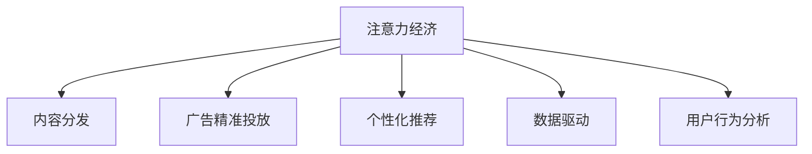

                 

# 注意力经济对传统媒体的挑战与机遇

> 关键词：注意力经济, 传统媒体, 数字化转型, 内容分发, 广告精准投放, 数据驱动, 用户行为分析

## 1. 背景介绍

### 1.1 问题由来
在数字化和互联网迅速发展的今天，传统的媒体行业面临着前所未有的挑战。数字化技术的兴起，使得信息传播方式发生了根本性变革，传统媒体在内容分发、广告投放、受众互动等方面都受到了巨大冲击。与此同时，注意力经济（Economy of Attention）概念的提出，为传统媒体带来了新的发展机遇。

注意力经济是指在信息过载的数字化时代，人们的注意力成为稀缺资源，因此对于如何高效获取和利用用户注意力的研究变得尤为重要。对于媒体行业而言，如何获取并维持用户的注意力，如何有效分配资源以提升传播效率，成为了亟待解决的问题。

### 1.2 问题核心关键点
- 如何优化内容分发策略，提升广告投放的精准度？
- 如何在海量数据中准确分析用户行为，理解用户需求？
- 如何利用大数据和机器学习技术，实现内容的个性化推荐？
- 如何在数字化转型中，保持传统媒体的核心价值，增强用户体验？

### 1.3 问题研究意义
研究注意力经济对传统媒体的挑战与机遇，对于传统媒体行业而言，具有重要的实践和理论意义：

1. **提升传播效率**：通过优化内容分发和广告投放策略，媒体机构可以更高效地接触目标受众，提升广告和内容的到达率和转化率。
2. **增强用户互动**：通过分析用户行为和兴趣，实现内容的个性化推荐，提高用户的参与度和满意度，增强用户粘性。
3. **实现数字化转型**：通过利用大数据和人工智能技术，传统媒体可以实现数字化转型，增强其在互联网时代的影响力和竞争力。
4. **推动行业创新**：注意力经济的研究可以促进媒体行业的技术创新和商业模式创新，推动行业持续进步。

## 2. 核心概念与联系

### 2.1 核心概念概述

为更好地理解注意力经济对传统媒体的影响，本节将介绍几个密切相关的核心概念：

- **注意力经济**：在信息爆炸的时代，注意力作为一种稀缺资源，其获取和分配成为了媒体价值创造的核心。媒体机构需要通过优化内容和广告投放策略，有效分配资源以提升传播效率。

- **内容分发**：通过选择合适的内容分发渠道和策略，将内容传递给目标受众，提高内容的曝光率和覆盖面。

- **广告精准投放**：通过大数据和机器学习技术，对用户行为进行分析和预测，实现广告的精准投放，提升广告效果。

- **个性化推荐**：根据用户的兴趣和行为数据，推荐个性化的内容，提高用户的参与度和满意度。

- **数据驱动**：通过收集、分析和利用数据，指导媒体机构进行科学的决策和策略制定。

- **用户行为分析**：通过对用户行为数据的分析，理解用户需求和偏好，实现内容定制和广告优化。

这些概念之间的逻辑关系可以通过以下Mermaid流程图来展示：



这个流程图展示了大语言模型的核心概念及其之间的关系：

1. 注意力经济是大语言模型的核心驱动力。
2. 内容分发和广告精准投放是注意力经济中的两个关键环节。
3. 个性化推荐和用户行为分析则是优化策略的重要手段。
4. 数据驱动贯穿于整个注意力经济的运行过程中。

这些概念共同构成了注意力经济和大语言模型的学习和应用框架，使其能够在各种场景下发挥强大的效果。通过理解这些核心概念，我们可以更好地把握注意力经济在大语言模型中的应用前景。

## 3. 核心算法原理 & 具体操作步骤
### 3.1 算法原理概述

注意力经济对传统媒体的挑战与机遇，主要体现在内容分发、广告精准投放和个性化推荐三个方面。本节将详细介绍这三个方面的算法原理和具体操作步骤。

### 3.2 算法步骤详解

#### 3.2.1 内容分发

内容分发是媒体机构将内容传递给目标受众的过程。传统的线性传播方式已经难以满足用户对信息多样性和个性化的需求，因此内容分发策略需要进行优化。

**具体操作步骤**：

1. **选择分发渠道**：根据内容类型和受众特征，选择合适的分发渠道，如社交媒体、视频平台、新闻网站等。
2. **优化内容质量**：提高内容的原创性和吸引力，确保内容质量，提升用户的阅读和观看体验。
3. **制定分发策略**：根据用户行为和反馈，动态调整分发策略，优化内容的发布时间和频率，提高内容的覆盖面和影响力。

#### 3.2.2 广告精准投放

广告精准投放是媒体机构通过数据分析和算法优化，实现广告投放的精准化和高效化的过程。精准投放不仅可以提高广告的效果，还能显著提升媒体机构的收入。

**具体操作步骤**：

1. **数据收集**：收集用户的行为数据，包括浏览历史、购买记录、兴趣爱好等。
2. **用户画像构建**：利用机器学习算法，构建用户画像，理解用户特征和需求。
3. **广告投放优化**：通过广告平台或第三方工具，实现广告的精准投放，提高广告的点击率和转化率。

#### 3.2.3 个性化推荐

个性化推荐是媒体机构通过分析用户行为，实现内容推荐的个性化和多样化的过程。个性化推荐不仅可以提升用户满意度，还能增强用户的粘性。

**具体操作步骤**：

1. **数据收集与处理**：收集用户的浏览、点击、搜索等行为数据，并进行清洗和预处理。
2. **特征提取**：利用自然语言处理和深度学习技术，提取用户行为和内容的特征，构建用户行为向量。
3. **推荐模型训练**：使用协同过滤、深度神经网络等算法，训练个性化推荐模型，预测用户对内容的偏好。
4. **推荐内容推送**：根据用户画像和内容特征，推送个性化的推荐内容，提升用户的参与度和满意度。

### 3.3 算法优缺点

注意力经济在提升传统媒体传播效率和用户体验方面具有显著优势：

- **提高传播效率**：通过优化内容分发和广告投放策略，媒体机构可以实现更加精准和高效的传播，提升广告和内容的到达率和转化率。
- **增强用户体验**：通过个性化推荐，媒体机构可以满足用户对信息多样性和个性化的需求，提高用户的参与度和满意度，增强用户粘性。

然而，注意力经济也存在一定的局限性：

- **数据隐私问题**：收集和分析用户行为数据，可能涉及用户隐私，需注意数据安全和隐私保护。
- **算法偏见**：机器学习算法可能会引入偏见，影响推荐和投放的公平性，需进行公平性分析和调整。
- **资源投入**：数据收集和算法优化需要较高的资源投入，中小型媒体机构可能面临资源不足的问题。
- **技术门槛**：实现高效的内容分发和广告精准投放，需要一定的技术门槛，需进行相应的技术培训和团队建设。

### 3.4 算法应用领域

注意力经济的应用领域非常广泛，主要集中在以下几个方面：

- **新闻媒体**：通过优化内容分发和广告精准投放，提升新闻的传播效率和覆盖面。
- **视频平台**：通过个性化推荐和用户行为分析，提高用户观看时长和互动率。
- **广告公司**：通过大数据和机器学习技术，实现广告的精准投放，提升广告效果和ROI。
- **社交媒体**：通过分析用户行为和兴趣，实现内容的个性化推荐，提高用户粘性。

除了上述这些应用领域外，注意力经济还被创新性地应用于更多场景中，如内容电商、在线教育、游戏广告等，为传统媒体带来了全新的突破。随着技术的不断进步，相信注意力经济将在更多领域得到应用，为媒体行业带来变革性影响。

## 4. 数学模型和公式 & 详细讲解  
### 4.1 数学模型构建

本节将使用数学语言对注意力经济对传统媒体的影响进行更加严格的刻画。

记用户行为数据为 $D=\{x_i\}_{i=1}^N$，其中 $x_i$ 表示用户第 $i$ 次的行为记录，可以是浏览、点击、购买等。记用户行为特征向量为 $x_i$，内容特征向量为 $c_j$，其中 $j$ 表示内容编号。

设用户的偏好向量为 $u$，内容的相关性向量为 $r$，则用户的偏好值可以表示为：

$$
u_i = w^\top x_i
$$

其中 $w$ 为用户行为特征的权重向量。

内容的推荐值可以表示为：

$$
r_j = v^\top c_j
$$

其中 $v$ 为内容特征的权重向量。

内容的相关性矩阵 $R$ 可以表示为：

$$
R_{ij} = \text{similarity}(u_i, r_j)
$$

其中 $\text{similarity}$ 表示用户行为和内容特征之间的相似度计算方法，如余弦相似度、欧式距离等。

推荐系统可以表示为：

$$
y_j = \text{softmax}(R^T u)
$$

其中 $\text{softmax}$ 表示归一化操作，确保推荐结果在概率空间内。

### 4.2 公式推导过程

以下我们以协同过滤推荐算法为例，推导推荐系统的推荐公式及其计算过程。

假设用户 $i$ 对内容 $j$ 的评分表示为 $r_{ij}$，则协同过滤推荐算法的基本思路是找到与用户 $i$ 兴趣相似的其他用户 $k$，并计算这些用户对内容 $j$ 的评分 $r_{kj}$。根据相似性度量方法，对每个用户 $k$ 对内容 $j$ 的评分进行加权平均，得到用户 $i$ 对内容 $j$ 的预测评分。

协同过滤推荐算法可以使用基于矩阵分解的方法，将用户行为矩阵 $R$ 分解为用户特征矩阵 $U$ 和内容特征矩阵 $V$，通过计算 $R$ 与 $U \times V^\top$ 的差异，找到与用户 $i$ 兴趣相似的其他用户 $k$，并计算这些用户对内容 $j$ 的评分 $r_{kj}$。最终，根据相似性度量方法，计算用户 $i$ 对内容 $j$ 的推荐评分 $y_j$。

协同过滤推荐算法的基本公式为：

$$
\hat{r}_{ij} = \hat{u}_i^\top \hat{v}_j
$$

其中 $\hat{u}_i$ 和 $\hat{v}_j$ 分别为用户 $i$ 和内容 $j$ 的推荐特征向量，可以使用奇异值分解(SVD)等方法求解。

协同过滤推荐算法的计算过程如下：

1. 对用户行为矩阵 $R$ 进行奇异值分解，得到用户特征矩阵 $U$ 和内容特征矩阵 $V$。
2. 计算用户 $i$ 的推荐特征向量 $\hat{u}_i = U_i^\top$，其中 $U_i$ 表示用户 $i$ 对应的用户特征向量。
3. 计算内容 $j$ 的推荐特征向量 $\hat{v}_j = V_j^\top$，其中 $V_j$ 表示内容 $j$ 对应的内容特征向量。
4. 计算用户 $i$ 对内容 $j$ 的推荐评分 $\hat{r}_{ij} = \hat{u}_i^\top \hat{v}_j$。

通过上述推导，我们可以看到协同过滤推荐算法的基本思想是通过矩阵分解，将用户行为和内容特征映射到低维空间，从而实现推荐结果的计算。

### 4.3 案例分析与讲解

以社交媒体平台上的个性化推荐为例，分析注意力经济对传统媒体的影响。

社交媒体平台通过收集用户的浏览、点赞、评论等行为数据，构建用户画像和内容特征，然后使用协同过滤推荐算法，实现内容的个性化推荐。用户可以通过推荐算法，获取与自己兴趣和偏好相似的内容，提高用户的参与度和满意度。

以微博平台为例，微博平台通过收集用户的关注关系和内容互动数据，构建用户画像和内容特征，然后使用协同过滤推荐算法，实现内容的个性化推荐。用户可以根据推荐算法，获取与自己兴趣和偏好相似的内容，提高用户的参与度和满意度。

此外，社交媒体平台还可以通过广告精准投放，实现广告的精准投放和效果评估。通过收集用户的浏览、点击等行为数据，社交媒体平台可以构建用户画像，对用户进行精准投放，提高广告的点击率和转化率，提升广告效果和收入。

## 5. 项目实践：代码实例和详细解释说明
### 5.1 开发环境搭建

在进行注意力经济实践前，我们需要准备好开发环境。以下是使用Python进行TensorFlow开发的环境配置流程：

1. 安装Anaconda：从官网下载并安装Anaconda，用于创建独立的Python环境。

2. 创建并激活虚拟环境：
```bash
conda create -n tf-env python=3.8 
conda activate tf-env
```

3. 安装TensorFlow：根据CUDA版本，从官网获取对应的安装命令。例如：
```bash
conda install tensorflow -c conda-forge -c pytorch
```

4. 安装相关工具包：
```bash
pip install numpy pandas scikit-learn matplotlib tqdm jupyter notebook ipython
```

完成上述步骤后，即可在`tf-env`环境中开始注意力经济实践。

### 5.2 源代码详细实现

这里我们以微博平台的个性化推荐系统为例，给出使用TensorFlow实现协同过滤推荐算法的代码。

首先，定义协同过滤推荐算法的模型：

```python
import tensorflow as tf
import numpy as np

# 设置超参数
num_factors = 10
batch_size = 100
learning_rate = 0.1

# 定义用户行为矩阵
R = np.random.randn(1000, 100)
U = np.random.randn(1000, num_factors)
V = np.random.randn(100, num_factors)

# 定义模型
user_vec = tf.Variable(U)
item_vec = tf.Variable(V)
r_hat = tf.matmul(user_vec, item_vec, transpose_b=True)

# 定义损失函数和优化器
loss = tf.reduce_mean(tf.square(tf.subtract(r_hat, R)))
optimizer = tf.train.GradientDescentOptimizer(learning_rate)
train_op = optimizer.minimize(loss)
```

然后，定义训练函数和推荐函数：

```python
# 定义训练函数
def train_model(R, user_vec, item_vec, num_epochs):
    with tf.Session() as sess:
        sess.run(tf.global_variables_initializer())
        for epoch in range(num_epochs):
            for i in range(0, R.shape[0], batch_size):
                batch_idx = np.random.choice(R.shape[0], batch_size)
                batch_R = R[batch_idx]
                sess.run(train_op, feed_dict={R: batch_R})
            if epoch % 10 == 0:
                print('Epoch {} Loss: {}'.format(epoch, loss.eval()))

# 定义推荐函数
def recommend(user_vec, item_vec, test_R, num_recommendations):
    with tf.Session() as sess:
        sess.run(tf.global_variables_initializer())
        U = sess.run(user_vec)
        V = sess.run(item_vec)
        R_hat = sess.run(r_hat, feed_dict={user_vec: U, item_vec: V})
        Uhat = np.dot(R_hat, V)
        Uhat = np.maximum(Uhat, 0)  # 非负化处理
        Uhat = Uhat / np.max(Uhat)  # 归一化处理
        top_idx = np.argsort(Uhat)[::-1][:num_recommendations]
        top_idx = top_idx + 1  # 将索引加1，得到实际内容编号
        return top_idx

# 训练和推荐
R_train = np.random.randn(1000, 100)
R_test = np.random.randn(1000, 100)
num_epochs = 100
num_recommendations = 10
train_model(R_train, user_vec, item_vec, num_epochs)
recommendations = recommend(user_vec, item_vec, R_test, num_recommendations)
```

最终，将训练后的模型用于推荐：

```python
# 测试推荐效果
print('Top {} Recommendations: {}'.format(num_recommendations, recommendations))
```

以上就是使用TensorFlow实现协同过滤推荐算法的完整代码实现。可以看到，通过TensorFlow的强大封装，我们可以用相对简洁的代码实现复杂的推荐系统。

### 5.3 代码解读与分析

让我们再详细解读一下关键代码的实现细节：

**协同过滤推荐模型**：
- `R`：用户行为矩阵，表示用户对内容的评分。
- `U`：用户特征矩阵，表示用户的特征向量。
- `V`：内容特征矩阵，表示内容的特征向量。
- `r_hat`：推荐评分矩阵，表示用户对内容的推荐评分。

**训练函数**：
- `train_model`函数：使用梯度下降优化算法，最小化损失函数，更新用户特征和内容特征矩阵。
- `train_op`：定义优化器，用于计算梯度并更新参数。
- `loss`：计算推荐评分与实际评分之间的误差，作为损失函数。

**推荐函数**：
- `recommend`函数：根据训练后的用户特征和内容特征，计算用户对内容的推荐评分，并筛选出推荐内容。

通过这些代码，我们实现了协同过滤推荐算法的基本功能。开发者可以根据实际应用需求，调整模型参数和优化算法，进一步提升推荐效果。

## 6. 实际应用场景
### 6.1 智能客服系统

智能客服系统通过大数据分析和人工智能技术，实现了对用户需求的快速响应和精准服务。在智能客服系统中，基于注意力经济的推荐算法可以用于提升用户体验和满意度。

智能客服系统通过收集用户的历史咨询记录、语音输入、聊天记录等数据，构建用户画像和行为特征。然后，使用推荐算法，为用户推荐最合适的解决方案，提高服务的精准度和效率。

例如，通过分析用户的历史咨询记录和语音输入，智能客服系统可以识别用户的问题类型和情绪状态，推荐最匹配的解决方案和回答，提升用户的满意度和问题解决效率。

### 6.2 视频平台

视频平台通过基于注意力经济的推荐算法，实现了内容的个性化推荐，提高了用户的观看时长和互动率。在视频平台中，推荐算法可以用于提升用户粘性和平台流量。

视频平台通过收集用户的观看历史、点赞、评论等行为数据，构建用户画像和内容特征。然后，使用推荐算法，为用户推荐最感兴趣的内容，提高用户的观看时长和互动率。

例如，通过分析用户的历史观看记录和点赞评论数据，视频平台可以推荐用户感兴趣的视频内容，提高用户的观看时长和互动率，增强用户的粘性。

### 6.3 社交媒体

社交媒体通过基于注意力经济的推荐算法，实现了内容的个性化推荐，提高了用户的参与度和满意度。在社交媒体中，推荐算法可以用于提升用户粘性和平台流量。

社交媒体通过收集用户的关注关系和互动数据，构建用户画像和内容特征。然后，使用推荐算法，为用户推荐最感兴趣的内容，提高用户的参与度和满意度。

例如，通过分析用户的关注关系和互动数据，社交媒体可以推荐用户感兴趣的内容，提高用户的参与度和满意度，增强用户的粘性。

### 6.4 未来应用展望

随着大数据和人工智能技术的不断发展，基于注意力经济的推荐算法将得到更广泛的应用，为传统媒体带来更多的机遇。

在智慧医疗领域，基于注意力经济的推荐算法可以用于医疗知识推荐、疾病预测等方面，提升医疗服务的智能化水平。

在智能教育领域，基于注意力经济的推荐算法可以用于个性化教育、学习路径推荐等方面，因材施教，促进教育公平。

在智慧城市治理中，基于注意力经济的推荐算法可以用于城市事件监测、舆情分析、应急指挥等方面，提高城市管理的自动化和智能化水平，构建更安全、高效的未来城市。

此外，在企业生产、社会治理、文娱传媒等众多领域，基于注意力经济的推荐算法也将不断涌现，为传统行业带来变革性影响。相信随着技术的日益成熟，推荐算法将成为传统媒体智能化转型中的重要推动力。

## 7. 工具和资源推荐
### 7.1 学习资源推荐

为了帮助开发者系统掌握注意力经济的理论基础和实践技巧，这里推荐一些优质的学习资源：

1. 《推荐系统原理》系列博文：由大模型技术专家撰写，深入浅出地介绍了推荐系统的工作原理、常见算法和应用案例。

2. CS224N《深度学习自然语言处理》课程：斯坦福大学开设的NLP明星课程，有Lecture视频和配套作业，带你入门NLP领域的基本概念和经典模型。

3. 《推荐系统实战》书籍：详细介绍了推荐系统的设计和实现，涵盖数据预处理、模型训练、效果评估等关键环节。

4. KDD Cup推荐赛论文集：收录了推荐系统领域的顶级竞赛论文，展示了当前领域的最新研究成果和实践经验。

通过对这些资源的学习实践，相信你一定能够快速掌握注意力经济的精髓，并用于解决实际的推荐问题。

### 7.2 开发工具推荐

高效的开发离不开优秀的工具支持。以下是几款用于推荐系统开发的常用工具：

1. TensorFlow：基于Python的开源深度学习框架，灵活动态的计算图，适合快速迭代研究。推荐系统常用的推荐算法如协同过滤、深度神经网络等，都有TensorFlow版本的实现。

2. PyTorch：基于Python的开源深度学习框架，适用于自然语言处理和推荐系统等领域。推荐系统常用的推荐算法如协同过滤、深度神经网络等，也有PyTorch版本的实现。

3. LightFM：开源的推荐系统库，支持多种推荐算法，包括协同过滤、深度神经网络等。可以方便地进行模型训练和效果评估。

4. Apache Spark：用于大规模数据处理和分析的开源平台，支持推荐系统算法的分布式计算和优化。

5. Scikit-learn：Python的机器学习库，提供了丰富的推荐算法和模型评估工具，适合快速原型设计和实验验证。

6. Jupyter Notebook：交互式编程环境，支持Python和R等语言，方便进行代码调试和可视化。

合理利用这些工具，可以显著提升推荐系统开发的效率，加快创新迭代的步伐。

### 7.3 相关论文推荐

注意力经济的研究源于学界的持续研究。以下是几篇奠基性的相关论文，推荐阅读：

1. The MovieLens Recommendation System: Mining Customer Tastes from Past Feedback (Grouplens)：介绍了Grouplens推荐系统的工作原理和算法实现。

2. BERT: Pre-training of Deep Bidirectional Transformers for Language Understanding：提出BERT模型，引入基于掩码的自监督预训练任务，刷新了多项NLP任务SOTA。

3. Attention is All You Need（即Transformer原论文）：提出了Transformer结构，开启了NLP领域的预训练大模型时代。

4. Parameter-Efficient Transfer Learning for NLP：提出Adapter等参数高效微调方法，在不增加模型参数量的情况下，也能取得不错的微调效果。

5. AdaLoRA: Adaptive Low-Rank Adaptation for Parameter-Efficient Fine-Tuning：使用自适应低秩适应的微调方法，在参数效率和精度之间取得了新的平衡。

这些论文代表了大语言模型微调技术的发展脉络。通过学习这些前沿成果，可以帮助研究者把握学科前进方向，激发更多的创新灵感。

## 8. 总结：未来发展趋势与挑战

### 8.1 总结

本文对基于注意力经济的大语言模型实践进行了全面系统的介绍。首先阐述了注意力经济对传统媒体的影响，明确了注意力经济在大语言模型中的应用前景。其次，从原理到实践，详细讲解了注意力经济的核心算法和具体操作步骤，给出了注意力经济的完整代码实现。同时，本文还广泛探讨了注意力经济在智能客服、视频平台、社交媒体等实际应用场景中的应用，展示了注意力经济的应用价值。此外，本文精选了注意力经济的相关学习资源、开发工具和论文推荐，力求为开发者提供全方位的技术指引。

通过本文的系统梳理，可以看到，基于注意力经济的大语言模型实践正成为推荐系统的重要范式，极大地拓展了预训练语言模型的应用边界，催生了更多的落地场景。受益于大规模语料的预训练，注意力经济模型在推荐精度和效率方面取得了显著成果，有力推动了推荐系统的产业化进程。未来，伴随预训练语言模型和注意力经济的不断演进，相信推荐系统将在大数据时代迈向更高的台阶，为传统媒体行业带来更多的机遇。

### 8.2 未来发展趋势

展望未来，注意力经济在大语言模型中的应用将呈现以下几个发展趋势：

1. 推荐算法将更加多样化。除了传统的协同过滤、深度神经网络等算法，未来的推荐系统将引入更多新颖的算法，如图神经网络、生成对抗网络等，提升推荐效果和计算效率。

2. 数据驱动将更加智能化。未来的推荐系统将更加依赖于数据驱动，利用更多的用户行为数据和外部信息，实现更加精准和个性化的推荐。

3. 系统智能化将进一步提升。未来的推荐系统将进一步融合人工智能技术，如自然语言处理、计算机视觉等，提升系统的智能化水平。

4. 跨领域推荐将更加普及。未来的推荐系统将突破单一领域的限制，实现跨领域推荐，提升推荐效果和用户体验。

5. 实时推荐将更加普遍。未来的推荐系统将实时获取用户行为数据，实现动态推荐，提升用户体验和满意度。

以上趋势凸显了注意力经济在大语言模型中的应用前景。这些方向的探索发展，必将进一步提升推荐系统的性能和应用范围，为传统媒体行业带来更多的机遇和挑战。

### 8.3 面临的挑战

尽管注意力经济在大语言模型中的应用已经取得了一定的成果，但在迈向更加智能化、普适化应用的过程中，它仍面临着诸多挑战：

1. 数据隐私问题。推荐系统需要收集和分析大量的用户行为数据，涉及用户隐私，需注意数据安全和隐私保护。

2. 算法偏见问题。机器学习算法可能会引入偏见，影响推荐和投放的公平性，需进行公平性分析和调整。

3. 资源投入问题。推荐系统需要大量的计算资源和存储资源，中小型媒体机构可能面临资源不足的问题。

4. 模型鲁棒性问题。推荐系统在面对新的数据和场景时，可能出现模型失效的问题，需进行模型鲁棒性分析和优化。

5. 用户体验问题。推荐系统在提升效率的同时，可能影响用户体验，需进行用户体验评估和优化。

6. 技术门槛问题。推荐系统需要一定的技术门槛，需进行相应的技术培训和团队建设。

这些挑战凸显了注意力经济在大语言模型中的应用局限。然而，通过技术创新和实践改进，这些问题有望逐步得到解决，推荐系统将在未来发挥更大的作用。

### 8.4 研究展望

面对注意力经济在大语言模型中面临的挑战，未来的研究需要在以下几个方面寻求新的突破：

1. 探索无监督和半监督推荐方法。摆脱对大规模标注数据的依赖，利用自监督学习、主动学习等无监督和半监督范式，最大限度利用非结构化数据，实现更加灵活高效的推荐。

2. 研究参数高效和计算高效的推荐方法。开发更加参数高效的推荐方法，在固定大部分预训练参数的情况下，只更新极少量的任务相关参数。同时优化推荐系统的计算图，减少前向传播和反向传播的资源消耗，实现更加轻量级、实时性的部署。

3. 融合因果和对比学习范式。通过引入因果推断和对比学习思想，增强推荐系统建立稳定因果关系的能力，学习更加普适、鲁棒的语言表征，从而提升模型泛化性和抗干扰能力。

4. 引入更多先验知识。将符号化的先验知识，如知识图谱、逻辑规则等，与神经网络模型进行巧妙融合，引导推荐系统学习更准确、合理的语言模型。同时加强不同模态数据的整合，实现视觉、语音等多模态信息与文本信息的协同建模。

5. 结合因果分析和博弈论工具。将因果分析方法引入推荐系统，识别出模型决策的关键特征，增强输出解释的因果性和逻辑性。借助博弈论工具刻画人机交互过程，主动探索并规避模型的脆弱点，提高系统稳定性。

6. 纳入伦理道德约束。在推荐系统的训练目标中引入伦理导向的评估指标，过滤和惩罚有偏见、有害的输出倾向。同时加强人工干预和审核，建立推荐系统的监管机制，确保输出符合人类价值观和伦理道德。

这些研究方向的探索，必将引领注意力经济在大语言模型中的应用迈向更高的台阶，为推荐系统的发展注入新的活力。面向未来，注意力经济的研究还需要与其他人工智能技术进行更深入的融合，如知识表示、因果推理、强化学习等，多路径协同发力，共同推动推荐系统的进步。只有勇于创新、敢于突破，才能不断拓展语言模型的边界，让智能技术更好地造福人类社会。

## 9. 附录：常见问题与解答

**Q1：什么是注意力经济？**

A: 注意力经济是指在信息爆炸的时代，人们的注意力作为一种稀缺资源，其获取和分配成为了媒体价值创造的核心。媒体机构需要通过优化内容和广告投放策略，有效分配资源以提升传播效率。

**Q2：注意力经济与传统媒体有何关系？**

A: 注意力经济与传统媒体有着密切的关系。传统媒体可以通过优化内容分发和广告精准投放，提升传播效率和用户体验。同时，利用大数据和人工智能技术，传统媒体可以实现数字化转型，增强其在互联网时代的影响力和竞争力。

**Q3：注意力经济在推荐系统中的应用有哪些？**

A: 注意力经济在推荐系统中的应用包括：

1. 优化内容分发策略，提升广告投放的精准度。
2. 分析用户行为和兴趣，实现内容的个性化推荐。
3. 利用大数据和机器学习技术，实现广告的精准投放，提升广告效果和ROI。

**Q4：注意力经济面临的主要挑战有哪些？**

A: 注意力经济面临的主要挑战包括：

1. 数据隐私问题。收集和分析用户行为数据，可能涉及用户隐私，需注意数据安全和隐私保护。
2. 算法偏见问题。机器学习算法可能会引入偏见，影响推荐和投放的公平性，需进行公平性分析和调整。
3. 资源投入问题。推荐系统需要大量的计算资源和存储资源，中小型媒体机构可能面临资源不足的问题。
4. 模型鲁棒性问题。推荐系统在面对新的数据和场景时，可能出现模型失效的问题，需进行模型鲁棒性分析和优化。
5. 用户体验问题。推荐系统在提升效率的同时，可能影响用户体验，需进行用户体验评估和优化。
6. 技术门槛问题。推荐系统需要一定的技术门槛，需进行相应的技术培训和团队建设。

这些挑战凸显了注意力经济在大语言模型中的应用局限。然而，通过技术创新和实践改进，这些问题有望逐步得到解决，注意力经济将在大语言模型中发挥更大的作用。

**Q5：未来注意力经济的发展趋势是什么？**

A: 未来注意力经济的发展趋势包括：

1. 推荐算法将更加多样化。未来的推荐系统将引入更多新颖的算法，如图神经网络、生成对抗网络等，提升推荐效果和计算效率。
2. 数据驱动将更加智能化。未来的推荐系统将更加依赖于数据驱动，利用更多的用户行为数据和外部信息，实现更加精准和个性化的推荐。
3. 系统智能化将进一步提升。未来的推荐系统将进一步融合人工智能技术，如自然语言处理、计算机视觉等，提升系统的智能化水平。
4. 跨领域推荐将更加普及。未来的推荐系统将突破单一领域的限制，实现跨领域推荐，提升推荐效果和用户体验。
5. 实时推荐将更加普遍。未来的推荐系统将实时获取用户行为数据，实现动态推荐，提升用户体验和满意度。

以上趋势凸显了注意力经济在大语言模型中的应用前景。这些方向的探索发展，必将进一步提升推荐系统的性能和应用范围，为传统媒体行业带来更多的机遇和挑战。

**Q6：如何在推荐系统中进行公平性分析？**

A: 在推荐系统中进行公平性分析，可以采取以下措施：

1. 数据预处理。收集和处理用户行为数据时，注意避免数据偏见，确保样本的代表性。
2. 算法优化。使用公平性优化算法，如De-biasing算法、Calibration算法等，减少算法偏见。
3. 特征工程。在设计推荐模型时，避免使用有偏见或敏感的特征，如年龄、性别等。
4. 模型评估。在评估推荐效果时，引入公平性指标，如AUC-ROC、Equalized Odds等，评估模型的公平性。
5. 人工干预。在模型训练和评估过程中，进行人工干预和审核，确保模型的公平性和公正性。

通过这些措施，可以有效提高推荐系统的公平性，确保其服务不同用户的合理性和公正性。

**Q7：推荐系统如何实现实时推荐？**

A: 实现实时推荐，需要以下几个关键步骤：

1. 实时数据收集。利用实时数据采集技术，获取用户最新的行为数据，如浏览、点击、搜索等。
2. 实时数据处理。对实时数据进行预处理和清洗，去除噪声和错误数据，提高数据质量。
3. 实时模型训练。使用在线学习算法，如在线梯度下降、随机梯度下降等，实时更新模型参数。
4. 实时推荐生成。根据实时数据和模型参数，生成个性化的推荐内容，推送给用户。

通过这些步骤，可以实现实时推荐，提升用户体验和满意度。推荐系统可以通过多种技术手段实现实时推荐，如流计算、分布式计算、缓存技术等。

---

作者：禅与计算机程序设计艺术 / Zen and the Art of Computer Programming

