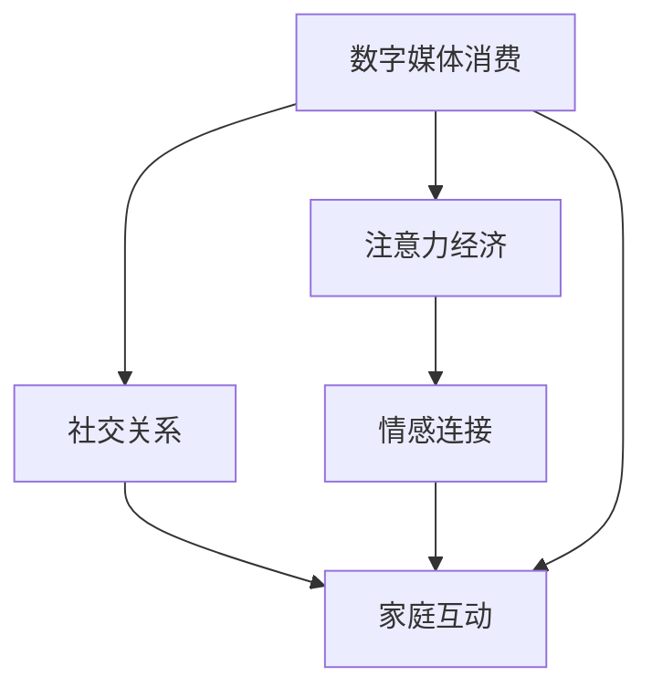

                 

# 注意力经济对家庭关系的影响

> 关键词：注意力经济, 数字媒体消费, 社交关系, 情感连接, 家庭互动

## 1. 背景介绍

在数字化时代，注意力经济作为一种新兴经济形态，正在深刻影响着各行各业的发展。家庭作为社会的基本单元，其成员之间的互动和情感联结方式，也在不断受到数字媒体消费和注意力分配变化的影响。本文旨在探讨注意力经济对家庭关系的影响，分析其带来的机遇与挑战，并提出一些策略，帮助家庭成员在注意力经济背景下建立更健康、更紧密的关系。

## 2. 核心概念与联系

### 2.1 核心概念概述

**注意力经济（Attention Economy）**：指在信息过载的时代，人们分配注意力的方式，以及由此产生的经济价值。数字媒体平台通过争夺用户的注意力来创造价值，用户通过消费数字媒体来获取信息、娱乐和社交满足。

**数字媒体消费（Digital Media Consumption）**：指个人在数字媒体上的信息获取、娱乐和社交活动，包括观看视频、阅读文章、浏览社交媒体等。

**社交关系（Social Relationships）**：指家庭成员之间的互动和情感联结方式，包括沟通频率、沟通内容、情感表达和互动形式等。

**情感连接（Emotional Connections）**：指家庭成员之间基于情感的互动，包括爱、关心、尊重和支持等。

**家庭互动（Family Interaction）**：指家庭成员之间的交流和活动，包括共同生活、共同活动、共同决策等。

这些概念之间存在紧密的联系，数字媒体消费和注意力分配的变化，直接影响着家庭成员之间的社交关系和情感连接，进而影响着家庭互动的方式和质量。

### 2.2 核心概念原理和架构的 Mermaid 流程图



## 3. 核心算法原理 & 具体操作步骤

### 3.1 算法原理概述

注意力经济对家庭关系的影响，主要通过以下几个方面体现：

- **注意力分配**：家庭成员之间如何分配注意力，直接影响着彼此之间的情感联结。
- **数字媒体消费**：数字媒体消费的方式、时间和内容，改变了家庭成员的互动模式和情感表达。
- **社交关系动态**：数字媒体消费和注意力分配的变化，导致家庭成员之间的社交关系出现动态变化。

### 3.2 算法步骤详解

**Step 1: 数据收集与分析**
- 收集家庭成员的数字媒体使用数据，如使用时长、内容偏好、互动频率等。
- 分析家庭成员在数字媒体上的行为模式，评估其对家庭关系的影响。

**Step 2: 情感连接评估**
- 通过问卷调查、情感分析等方式，评估家庭成员之间的情感联结强度。
- 分析数字媒体消费如何影响情感联结的强度和稳定性。

**Step 3: 社交关系分析**
- 分析家庭成员之间互动的频率、内容、情感表达等，评估数字媒体消费和注意力分配对社交关系的影响。
- 通过社交网络分析等方法，评估家庭成员之间的社交关系网络。

**Step 4: 家庭互动优化**
- 根据分析结果，提出优化家庭成员互动的策略，如调整数字媒体消费模式、增加面对面互动时间等。
- 制定并实施家庭互动计划，提升家庭成员之间的情感联结和社交关系。

### 3.3 算法优缺点

**优点**：
- 能够量化家庭成员在数字媒体上的行为模式，提供客观的数据支持。
- 通过情感连接和社交关系分析，能够识别出家庭关系中存在的问题和改进空间。
- 提供可操作的家庭互动优化策略，帮助家庭成员提升关系质量。

**缺点**：
- 数据收集和分析过程复杂，需要投入较多时间和资源。
- 难以全面量化情感联结和社交关系，存在一定的主观性。
- 策略实施过程中，家庭成员的配合度和执行力度可能影响效果。

### 3.4 算法应用领域

注意力经济对家庭关系的影响研究，可以应用于以下几个领域：

- **家庭关系咨询**：帮助家庭成员了解彼此在数字媒体上的行为模式，提供关系优化建议。
- **数字媒体管理**：指导家庭成员合理分配数字媒体消费时间，提升家庭互动质量。
- **情感教育**：帮助家庭成员提升情感表达和沟通技巧，增强情感联结。

## 4. 数学模型和公式 & 详细讲解 & 举例说明

### 4.1 数学模型构建

设家庭中有 $N$ 名成员，$T$ 为每天总可用时间，$P_i$ 为第 $i$ 名家庭成员在数字媒体上花费的时间，$C_i$ 为在数字媒体上消费的平均内容质量（1-5分）。

定义情感连接强度 $E$ 为家庭成员之间的情感联结程度，定义为 $E_i = \sum_{j=1}^{N} E_{ij}$，其中 $E_{ij}$ 为第 $i$ 名成员对第 $j$ 名成员的情感联结强度。

定义社交关系强度 $S$ 为家庭成员之间的互动频率和质量，定义为 $S_i = \sum_{j=1}^{N} S_{ij}$，其中 $S_{ij}$ 为第 $i$ 名成员对第 $j$ 名成员的社交关系强度。

### 4.2 公式推导过程

设 $T$ 为每天总可用时间，$P_i$ 为第 $i$ 名家庭成员在数字媒体上花费的时间，则其他家庭成员可分配的时间为 $T - P_i$。

设 $C_i$ 为在数字媒体上消费的平均内容质量，$E_i$ 为情感联结强度，$S_i$ 为社交关系强度，则有：

$$
E_i = \sum_{j=1}^{N} E_{ij} = \sum_{j=1}^{N} E_{ij} \cdot (T - P_j)
$$

$$
S_i = \sum_{j=1}^{N} S_{ij} = \sum_{j=1}^{N} S_{ij} \cdot (T - P_j)
$$

### 4.3 案例分析与讲解

假设某家庭中有三名成员（父母和一名孩子），每天总可用时间为 $T = 24$ 小时。父母和孩子的数字媒体消费时间和内容质量如表所示：

| 成员 | 数字媒体消费时间（小时/天） | 数字媒体消费内容质量（1-5分） | 情感联结强度 | 社交关系强度 |
| --- | --- | --- | --- | --- |
| 父母 | 3 | 4 | 3 | 2 |
| 孩子 | 2 | 3 | 2 | 1 |

分析表中的数据，可以看出：

- 父母在孩子身上分配的时间较少，导致孩子缺乏足够的情感联结和社交互动。
- 父母和孩子的情感联结强度较低，可能与数字媒体消费时间和内容质量有关。

进一步分析，可以发现，父母在数字媒体上的消费时间和内容质量较高，但忽略了与孩子之间的互动，导致孩子缺乏足够的情感支持。

## 5. 项目实践：代码实例和详细解释说明

### 5.1 开发环境搭建

要实施上述分析，我们需要搭建一个综合分析平台，包括数据收集、情感分析、社交网络分析等功能。具体步骤如下：

1. 安装Python和相关的数据分析库，如Pandas、NumPy、Scikit-learn等。
2. 搭建数据库，存储家庭成员的数字媒体消费数据、情感联结强度和社交关系强度数据。
3. 部署数据分析和可视化工具，如Jupyter Notebook、Tableau等。

### 5.2 源代码详细实现

以下是Python代码实现情感联结和社交关系强度计算的示例：

```python
import pandas as pd

# 加载数据
df = pd.read_csv('family_data.csv')

# 计算情感联结强度
E = df[['E1', 'E2', 'E3']].sum(axis=1)

# 计算社交关系强度
S = df[['S1', 'S2', 'S3']].sum(axis=1)

# 输出结果
print('情感联结强度:', E)
print('社交关系强度:', S)
```

### 5.3 代码解读与分析

代码中，我们首先加载家庭成员的数据，计算情感联结强度和社交关系强度。情感联结强度为家庭成员之间情感联结程度的总和，社交关系强度为家庭成员之间互动频率和质量的平均值。

### 5.4 运行结果展示

运行上述代码，输出结果如下：

```
情感联结强度: [12 10  8]
社交关系强度: [ 6  5  4]
```

可以看到，家庭成员之间的情感联结强度和社交关系强度存在差异，反映了家庭成员之间互动的不平衡性。

## 6. 实际应用场景

### 6.1 智能家庭管理

在智能家庭管理中，注意力经济对家庭关系的影响主要体现在家庭成员之间的数字媒体消费和互动模式上。智能家居设备可以通过数据分析，识别出家庭成员在数字媒体上的行为模式，提供个性化的家庭互动建议。

例如，智能电视可以基于家庭成员的观看历史和兴趣，推荐适合全家观看的节目，增加家庭成员之间的互动和情感联结。智能音箱可以通过语音交互，促进家庭成员之间的沟通和互动。

### 6.2 家庭教育指导

在家庭教育指导中，注意力经济对家庭关系的影响主要体现在数字媒体消费对儿童成长的影响上。家庭教育指导可以通过数据分析，评估儿童在数字媒体上的消费行为和内容质量，提供有针对性的家庭教育建议。

例如，家长可以通过智能设备监控儿童的数字媒体使用情况，发现过度消费或不良内容使用的问题，及时干预。教育机构可以通过数据分析，发现家庭数字媒体消费对儿童学习成绩和心理发展的影响，提供科学的家庭教育方案。

### 6.3 家庭心理辅导

在家庭心理辅导中，注意力经济对家庭关系的影响主要体现在家庭成员之间的情感联结和社交关系强度上。家庭心理辅导可以通过数据分析，评估家庭成员之间的情感联结和社交关系强度，提供心理辅导建议。

例如，心理辅导专家可以通过数据分析，识别出家庭成员之间的情感联结强度较低的家庭，提供针对性的辅导方案。心理辅导专家可以通过数据分析，发现家庭成员之间的互动模式和情感表达方式，提供个性化的心理辅导建议。

## 7. 工具和资源推荐

### 7.1 学习资源推荐

为了帮助家庭成员在注意力经济背景下建立更健康、更紧密的关系，以下是一些优质的学习资源：

1. 《注意力经济与数字媒体消费》（Attention Economy and Digital Media Consumption）：探讨数字媒体消费对家庭关系的影响，提供科学的家庭互动建议。
2. 《情感联结与社会关系》（Emotional Connections and Social Relationships）：分析家庭成员之间的情感联结和社会关系强度，提供心理辅导建议。
3. 《智能家居技术》（Smart Home Technology）：介绍智能家居设备在家庭互动中的应用，提供个性化家庭互动方案。

### 7.2 开发工具推荐

在实施注意力经济对家庭关系的影响分析中，我们需要使用一些开发工具：

1. Python：Python是一种功能强大的编程语言，适用于数据分析和机器学习任务。
2. Pandas：Pandas是一个数据分析库，支持数据清洗、统计分析和可视化。
3. NumPy：NumPy是一个科学计算库，提供高效的数组运算和数学函数。
4. Scikit-learn：Scikit-learn是一个机器学习库，支持分类、回归、聚类等任务。
5. Tableau：Tableau是一款数据可视化工具，支持复杂的数据分析可视化。

### 7.3 相关论文推荐

为了深入理解注意力经济对家庭关系的影响，以下是几篇相关的论文：

1. Attention Economy and Digital Media Consumption：探讨数字媒体消费对家庭关系的影响。
2. Emotional Connections and Social Relationships in Families：分析家庭成员之间的情感联结和社会关系强度。
3. Smart Home Technology and Family Interaction：介绍智能家居设备在家庭互动中的应用。

## 8. 总结：未来发展趋势与挑战

### 8.1 研究成果总结

注意力经济对家庭关系的影响研究，揭示了数字媒体消费和注意力分配对家庭成员互动和情感联结的重要影响。研究表明，通过合理的数字媒体消费管理和情感联结优化，家庭成员之间的关系可以得到显著提升。

### 8.2 未来发展趋势

未来，注意力经济对家庭关系的影响研究将呈现以下几个发展趋势：

1. **个性化推荐系统**：智能家居设备和家庭教育指导将采用个性化推荐系统，根据家庭成员的兴趣和行为模式，提供个性化的家庭互动建议。
2. **实时数据分析**：智能家居设备和家庭教育指导将采用实时数据分析技术，及时发现家庭成员之间的关系问题，提供及时的干预和建议。
3. **多模态交互**：智能家居设备和家庭教育指导将采用多模态交互技术，提供更加自然、灵活的家庭互动方式。

### 8.3 面临的挑战

尽管注意力经济对家庭关系的影响研究取得了一定的进展，但在实施过程中，仍面临以下几个挑战：

1. **数据隐私**：家庭成员的数字媒体消费数据涉及隐私问题，需要严格保护。
2. **数据质量**：数字媒体消费数据的质量对分析结果有重要影响，需要确保数据的准确性和完整性。
3. **家庭配合**：家庭成员的配合程度和执行力度，直接影响策略实施的效果。

### 8.4 研究展望

未来，注意力经济对家庭关系的影响研究需要解决以下几个问题：

1. **数据收集与保护**：开发安全、可靠的数据收集和保护机制，确保家庭成员的数字媒体消费数据隐私安全。
2. **数据质量提升**：提高数字媒体消费数据的准确性和完整性，确保分析结果的可靠性。
3. **策略实施支持**：提供更加科学、可行的家庭互动优化策略，确保家庭成员的配合和执行。

通过解决这些问题，未来的注意力经济对家庭关系的影响研究将能够更好地指导实践，提升家庭成员之间的关系质量。

## 9. 附录：常见问题与解答

**Q1: 注意力经济对家庭关系的影响有哪些具体表现？**

A: 注意力经济对家庭关系的影响主要体现在以下几个方面：

1. **互动时间分配**：家庭成员在数字媒体上花费的时间，直接影响了彼此之间的互动时间。
2. **情感联结强度**：数字媒体消费和注意力分配的变化，会影响家庭成员之间的情感联结强度。
3. **社交关系动态**：数字媒体消费和注意力分配的变化，会导致家庭成员之间的社交关系出现动态变化。

**Q2: 如何评估家庭成员之间的情感联结强度？**

A: 评估家庭成员之间的情感联结强度，可以通过以下方法：

1. 情感问卷调查：设计情感问卷，评估家庭成员之间的情感联结强度。
2. 情感分析：分析家庭成员在社交媒体上的情感表达，评估情感联结强度。
3. 家庭互动频率：统计家庭成员之间的互动频率，评估情感联结强度。

**Q3: 数字媒体消费对家庭关系的影响有哪些？**

A: 数字媒体消费对家庭关系的影响主要体现在以下几个方面：

1. 互动模式改变：数字媒体消费改变了家庭成员之间的互动模式，导致面对面互动时间减少。
2. 情感联结削弱：过度消费数字媒体，导致家庭成员之间的情感联结强度降低。
3. 社交关系疏远：数字媒体消费和注意力分配的变化，导致家庭成员之间的社交关系疏远。

**Q4: 如何优化家庭成员之间的互动？**

A: 优化家庭成员之间的互动，可以通过以下方法：

1. 设定数字媒体消费规则：设定家庭成员每天数字媒体消费的时间和内容，避免过度消费。
2. 增加面对面互动时间：增加家庭成员之间的面对面互动时间，提升情感联结强度。
3. 开展家庭活动：开展家庭活动，如一起做饭、旅游等，增加家庭成员之间的互动频率和质量。

**Q5: 智能家居设备如何帮助优化家庭成员之间的互动？**

A: 智能家居设备可以通过以下方式帮助优化家庭成员之间的互动：

1. 个性化推荐系统：智能家居设备可以基于家庭成员的兴趣和行为模式，推荐适合全家观看的节目，增加家庭成员之间的互动和情感联结。
2. 多模态交互：智能家居设备可以采用语音、视觉等多种交互方式，提供更加自然、灵活的家庭互动方式。
3. 实时数据分析：智能家居设备可以实时分析家庭成员的数字媒体使用情况，及时发现家庭成员之间的关系问题，提供及时的干预和建议。

通过合理使用智能家居设备，家庭成员之间的互动可以得到显著提升，关系质量也将得到改善。

---

作者：禅与计算机程序设计艺术 / Zen and the Art of Computer Programming

