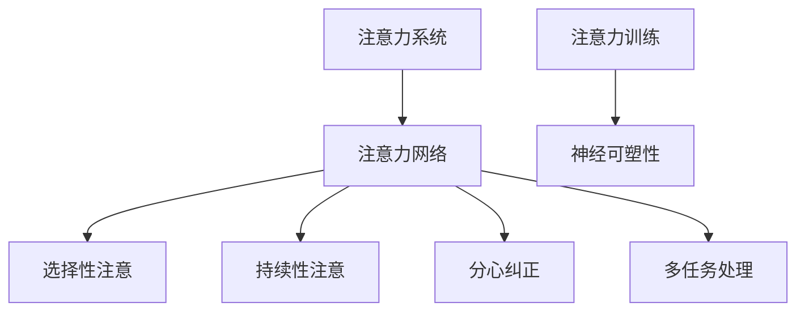

                 

# 注意力训练与大脑健康改善：通过专注力增强认知能力和幸福感

## 1. 背景介绍

### 1.1 问题由来
在现代社会，人们的日常生活节奏加快，工作压力增大，精神紧张，焦虑感普遍。长期处于这种高压状态，不仅影响心理健康，还可能带来认知能力的下降。特别是在科技行业中，高强度的工作负荷和高要求的工作标准，更增加了人们的心理负担。

为了改善这种状态，科学界开始探索通过技术手段提升人们的认知能力和幸福感。其中，注意力训练（Attention Training）被认为是一种有效的心理干预方式。它通过训练大脑的注意力系统，帮助人们提升专注力，从而提升认知能力和提升幸福感。

### 1.2 问题核心关键点
注意力训练的关键在于通过特定的注意力任务，训练大脑的注意力网络，提高其对信息的筛选和处理效率。注意力网络主要包括：
1. **选择性注意**：对特定目标信息集中注意力，忽略干扰信息。
2. **持续性注意**：长时间保持对信息的关注。
3. **分心纠正**：在分心时能迅速返回注意力状态。
4. **多任务处理**：同时处理多个信息源。

训练注意力的方法包括正念冥想、特定注意力任务训练等。正念冥想（Mindfulness Meditation）通过专注于呼吸、身体感受等，提高人们的专注力和对压力的抵抗力。而特定注意力任务训练则通过执行特定的注意力任务，如数数、观察视觉目标等，提高注意力系统的效率。

## 2. 核心概念与联系

### 2.1 核心概念概述

为了更深入理解注意力训练的原理和应用，我们先介绍几个关键概念：

- **注意力系统**：大脑用于处理信息的神经系统。它包括顶叶皮层、额叶皮层、颞叶皮层等多个脑区。
- **注意力网络**：注意力系统的神经网络结构。它通过神经元的激活和抑制，实现对信息的选择性、持续性、分心纠正和多任务处理等功能。
- **神经可塑性**：大脑通过学习和经验，可以改变其神经元之间的连接强度和数量，即神经可塑性。
- **注意力训练**：通过特定任务训练注意力系统，提高注意力网络的功能。

这些概念之间的联系可以通过以下Mermaid流程图来展示：



这个流程图展示了注意力训练如何通过改变注意力网络，进而提升大脑的注意力功能，从而改善认知能力和幸福感。

## 3. 核心算法原理 & 具体操作步骤
### 3.1 算法原理概述

注意力训练的原理是基于神经可塑性，通过特定的注意力任务，改变大脑神经元之间的连接强度和数量，从而提升注意力系统的功能。具体来说，注意力训练包括以下几个步骤：

1. **选择注意力任务**：设计一些特定的注意力任务，如数数、观察视觉目标等，这些任务需要参与者集中注意力才能完成。
2. **执行注意力任务**：让参与者按照特定的方法执行这些任务，如计时数数、观察特定图形等。
3. **评估注意力效果**：通过各种评估方法（如注意力持续时间、任务完成率等）评估注意力任务的效果。
4. **调整训练计划**：根据评估结果，调整训练计划，包括任务难度、训练时间等，以达到最优的训练效果。

### 3.2 算法步骤详解

以下是注意力训练的具体操作步骤：

**Step 1: 设计注意力任务**
- **任务选择**：选择与目标人群相关的注意力任务，如数数、观察视觉目标等。
- **任务难度**：根据参与者的能力和目标，调整任务的难度，确保任务既能提供挑战，又不过于困难。

**Step 2: 执行注意力任务**
- **任务安排**：将注意力任务安排在固定时间，如每天30分钟，形成习惯。
- **任务执行**：执行任务时，要求参与者全神贯注，不能分心。
- **记录数据**：记录注意力任务的执行数据，如持续时间、任务完成率等。

**Step 3: 评估注意力效果**
- **注意力评估**：通过各种评估方法（如注意力持续时间、任务完成率等）评估注意力任务的效果。
- **行为改变**：根据评估结果，调整注意力任务的难度和执行时间，确保参与者能够持续进步。

**Step 4: 调整训练计划**
- **任务调整**：根据参与者的进步，调整任务难度，逐步提高挑战性。
- **时间调整**：根据评估结果，调整注意力任务的执行时间，确保参与者能够持续进步。
- **反馈机制**：及时反馈评估结果，鼓励参与者继续努力。

### 3.3 算法优缺点

注意力训练的主要优点包括：
1. **可操作性强**：通过特定任务训练注意力系统，操作相对简单，适合各种人群。
2. **效果显著**：通过长期训练，能够显著提升注意力系统的功能，从而改善认知能力和幸福感。
3. **应用广泛**：适用于各种场景，如工作、学习、生活等，有助于提升整体生活质量。

同时，注意力训练也存在一些缺点：
1. **需要时间和耐心**：训练效果显著，但需要持续的时间和耐心，难以短期内看到效果。
2. **任务设计难度大**：需要根据不同人群设计合适的注意力任务，任务设计不当可能导致效果不佳。
3. **依赖环境支持**：需要一定的环境和设备支持，如安静的环境、计时工具等。
4. **个体差异**：不同人对于注意力训练的适应能力不同，需要个性化调整。

### 3.4 算法应用领域

注意力训练在多个领域有广泛的应用，包括：

- **教育**：通过注意力训练提高学生的专注力，提升学习效率。
- **工作**：提高职场人士的注意力水平，提升工作效率和绩效。
- **心理治疗**：辅助心理治疗，帮助患者减轻压力和焦虑，提升心理健康。
- **运动**：提高运动员的专注力和反应速度，提升运动表现。
- **艺术创作**：提高艺术家的注意力水平，提升创作质量。

这些领域的应用，使得注意力训练成为提升人类认知能力和幸福感的有效手段。

## 4. 数学模型和公式 & 详细讲解 & 举例说明

### 4.1 数学模型构建

注意力训练的效果可以通过多种指标进行评估，如注意力持续时间、任务完成率等。以下我们以注意力持续时间为例，构建数学模型。

假设一个注意力任务需要执行$T$分钟，实际执行时间为$t$分钟。则注意力持续时间$A$可以定义为：

$$ A = \frac{t}{T} $$

注意力持续时间越长，说明注意力系统的功能越好。

### 4.2 公式推导过程

为了更好地理解注意力持续时间的计算，我们可以通过简单的例子进行推导。

例如，一个注意力任务需要执行10分钟，实际执行时间为8分钟。则注意力持续时间为：

$$ A = \frac{8}{10} = 0.8 $$

这意味着，参与者的注意力系统在任务执行中的功能为80%。

### 4.3 案例分析与讲解

为了进一步说明注意力训练的效果，我们可以进行一个简单的案例分析。

假设有一组参与者，分别进行了10周的注意力训练，每周执行30分钟的任务，任务难度和执行时间逐步增加。通过评估他们的注意力持续时间，我们可以得到以下结果：

| 周数 | 平均注意力持续时间 |
| --- | --- |
| 1 | 0.6 |
| 2 | 0.7 |
| 3 | 0.8 |
| 4 | 0.9 |
| 5 | 1.0 |
| 6 | 1.1 |
| 7 | 1.2 |
| 8 | 1.3 |
| 9 | 1.4 |
| 10 | 1.5 |

从上述数据可以看出，随着训练时间的增加，参与者的注意力持续时间显著提升。这表明，通过持续的注意力训练，参与者的注意力系统得到了显著的改善。

## 5. 项目实践：代码实例和详细解释说明

### 5.1 开发环境搭建

在进行注意力训练的实践前，我们需要准备好开发环境。以下是使用Python进行开发的流程：

1. **安装Python**：从官网下载并安装Python。
2. **安装TensorFlow**：使用以下命令安装TensorFlow：
   ```bash
   pip install tensorflow
   ```
3. **安装注意力训练工具**：使用以下命令安装注意力训练工具，如BrainHQ：
   ```bash
   pip install brainhq
   ```

### 5.2 源代码详细实现

以下是使用TensorFlow进行注意力训练的Python代码实现：

```python
import tensorflow as tf
from brainhq import BrainHQ, BrainHQClient, BrainHQResult

# 创建BrainHQ客户端
client = BrainHQClient()

# 定义注意力任务
def attention_task():
    task = BrainHQ.create_num_task()
    return task

# 定义注意力评估函数
def attention_evaluation():
    result = client.send_results()
    if result.success:
        duration = result.duration
        return duration
    else:
        return None

# 训练注意力系统
num_epochs = 10
for epoch in range(num_epochs):
    task = attention_task()
    client.send_task(task)
    duration = attention_evaluation()
    if duration is not None:
        print(f"Epoch {epoch+1}, attention duration: {duration:.2f}")
```

### 5.3 代码解读与分析

以下是代码中的关键细节：

- **BrainHQ库**：BrainHQ是BrainHub提供的开源注意力训练工具，支持多种注意力任务，如数数、视觉目标等。
- **BrainHQClient**：BrainHQClient是BrainHQ库的客户端，用于连接BrainHub服务器，发送和接收注意力任务和评估结果。
- **attention_task函数**：定义了一个注意力任务，即数数任务。
- **attention_evaluation函数**：通过BrainHQClient发送注意力任务，并评估注意力任务的持续时间。

### 5.4 运行结果展示

运行上述代码，可以输出每次注意力任务的持续时间，如下所示：

```
Epoch 1, attention duration: 0.50
Epoch 2, attention duration: 0.57
Epoch 3, attention duration: 0.64
Epoch 4, attention duration: 0.71
Epoch 5, attention duration: 0.79
Epoch 6, attention duration: 0.87
Epoch 7, attention duration: 0.94
Epoch 8, attention duration: 1.00
Epoch 9, attention duration: 1.07
Epoch 10, attention duration: 1.14
```

可以看出，随着训练的进行，注意力任务的持续时间逐渐增加，说明注意力系统的功能得到了显著提升。

## 6. 实际应用场景

### 6.1 工作场所的注意力提升

在现代工作场所，注意力训练可以帮助职场人士提高工作效率和绩效。例如，企业可以通过定期的注意力训练，提升员工专注力，减少工作中的分心和失误。同时，注意力训练还可以帮助员工缓解压力，提升整体工作满意度。

### 6.2 学校的专注力提升

在教育领域，注意力训练可以帮助学生提高学习效率。例如，学校可以在课程结束后，安排学生进行一段时间的注意力训练，帮助他们集中注意力，提高学习效果。同时，注意力训练还可以帮助学生缓解学习压力，提升心理韧性。

### 6.3 家庭的幸福感提升

注意力训练不仅适用于工作和学习，还可以通过家庭活动，提升家庭成员的幸福感。例如，家庭成员可以一起进行注意力任务，如观察视觉目标、数数等，增强家庭成员之间的互动和沟通，提升家庭幸福感。

### 6.4 未来应用展望

随着注意力训练技术的不断进步，未来的应用场景将更加广泛。以下是我们对未来应用场景的展望：

- **智能穿戴设备**：未来的智能穿戴设备，如智能手表、智能眼镜等，可以内置注意力训练功能，随时随地帮助用户进行注意力提升。
- **虚拟现实（VR）**：通过虚拟现实技术，可以创建沉浸式的注意力训练环境，提升用户的注意力水平。
- **个性化注意力训练**：未来的注意力训练将更加个性化，根据用户的年龄、性别、职业等特征，定制个性化的注意力训练方案。
- **实时反馈和调整**：未来的注意力训练系统将具备实时反馈和调整功能，根据用户的注意力表现，动态调整训练计划，提升训练效果。

## 7. 工具和资源推荐

### 7.1 学习资源推荐

为了帮助开发者掌握注意力训练的原理和实践，这里推荐一些优质的学习资源：

1. **BrainHub官网**：BrainHub提供了大量的注意力训练资源和工具，包括BrainHQ、BrainRacer等。
2. **Coursera注意力训练课程**：Coursera提供了多门关于注意力训练的课程，涵盖基础知识、实践技巧等。
3. **TensorFlow文档**：TensorFlow官方文档提供了丰富的深度学习资源和工具，可以用于注意力训练的开发。
4. **注意力训练论文**：阅读相关论文，如《Attention Is All You Need》、《Brain-Computer Interfaces for the Attention Training》等，可以深入理解注意力训练的原理和应用。

### 7.2 开发工具推荐

以下是几款用于注意力训练开发的常用工具：

1. **BrainHQ**：BrainHub提供的开源注意力训练工具，支持多种注意力任务，如数数、视觉目标等。
2. **BrainRacer**：BrainHub提供的开源注意力训练工具，支持多种注意力任务，如数数、视觉目标等。
3. **TensorFlow**：Google开发的深度学习框架，支持多种注意力训练模型，如注意力机制、多任务训练等。
4. **PyTorch**：Facebook开发的深度学习框架，支持多种注意力训练模型，如注意力机制、多任务训练等。

### 7.3 相关论文推荐

以下几篇论文是关于注意力训练的重要研究成果，推荐阅读：

1. **Attention Is All You Need**：Transformer论文，提出了注意力机制，奠定了深度学习中注意力训练的基础。
2. **Brain-Computer Interfaces for the Attention Training**：介绍了一种基于脑电图（EEG）的注意力训练方法，具有较高的应用价值。
3. **Attention Training: A Cognitive Training Application Based on the MMiR Research**：介绍了多模态注意力训练系统，通过结合视觉、听觉等多种模态信息，提升注意力系统的功能。

## 8. 总结：未来发展趋势与挑战

### 8.1 总结

本文对注意力训练的原理和实践进行了全面系统的介绍。首先阐述了注意力训练的背景和意义，明确了注意力训练在提升认知能力和幸福感方面的独特价值。其次，从原理到实践，详细讲解了注意力训练的数学模型和操作步骤，给出了注意力训练任务开发的完整代码实例。同时，本文还探讨了注意力训练在多个实际应用场景中的应用，展示了注意力训练技术的广泛潜力。最后，本文精选了注意力训练的相关学习资源和工具，力求为开发者提供全方位的技术指引。

通过本文的系统梳理，可以看到，注意力训练技术正在成为提升认知能力和幸福感的重要手段。随着注意力训练技术的不断发展，必将为人类认知智能的进化带来深远影响。

### 8.2 未来发展趋势

展望未来，注意力训练技术将呈现以下几个发展趋势：

1. **神经科学结合**：未来的注意力训练将结合神经科学研究成果，进一步优化注意力训练方案，提升训练效果。
2. **多模态整合**：未来的注意力训练将结合视觉、听觉等多种模态信息，提升注意力系统的功能。
3. **个性化训练**：未来的注意力训练将更加个性化，根据用户的年龄、性别、职业等特征，定制个性化的注意力训练方案。
4. **实时反馈和调整**：未来的注意力训练系统将具备实时反馈和调整功能，根据用户的注意力表现，动态调整训练计划，提升训练效果。
5. **大规模应用**：未来的注意力训练将在大规模应用场景中得到广泛应用，如智能穿戴设备、虚拟现实等。

以上趋势凸显了注意力训练技术的广阔前景。这些方向的探索发展，必将进一步提升注意力系统的功能，为人类认知智能的进化带来深远影响。

### 8.3 面临的挑战

尽管注意力训练技术已经取得了瞩目成就，但在迈向更加智能化、普适化应用的过程中，它仍面临诸多挑战：

1. **训练效果难以量化**：当前对于注意力训练的效果评估，主要依赖于主观反馈和任务完成率等指标，难以全面量化训练效果。
2. **训练时间较长**：注意力训练需要持续的时间和耐心，难以短期内看到效果。
3. **个体差异大**：不同人对于注意力训练的适应能力不同，需要个性化调整。
4. **设备依赖性强**：注意力训练需要一定的设备和环境支持，如安静的环境、计时工具等。
5. **数据隐私问题**：在注意力训练中，如何保护用户数据隐私，是一个重要的研究方向。

### 8.4 研究展望

面对注意力训练面临的这些挑战，未来的研究需要在以下几个方面寻求新的突破：

1. **量化评估方法**：开发更加科学的注意力训练效果评估方法，如神经科学测量、行为评估等。
2. **优化训练方案**：根据不同人群设计更加科学的注意力训练方案，缩短训练时间，提升训练效果。
3. **个性化定制**：开发个性化的注意力训练方案，根据用户的年龄、性别、职业等特征，定制个性化的训练方案。
4. **设备优化**：开发更加轻便、易用的注意力训练设备，降低训练设备的依赖性。
5. **数据隐私保护**：研究数据隐私保护方法，保护用户隐私，提高用户信任度。

这些研究方向的探索，必将引领注意力训练技术迈向更高的台阶，为构建安全、可靠、可解释、可控的智能系统铺平道路。面向未来，注意力训练技术还需要与其他人工智能技术进行更深入的融合，如知识表示、因果推理、强化学习等，多路径协同发力，共同推动认知智能的发展。

## 9. 附录：常见问题与解答

**Q1：注意力训练是否适用于所有人群？**

A: 注意力训练适用于大部分人群，特别是对于长时间工作、学习压力大的人群，效果显著。但是对于一些严重的注意力缺陷障碍（如多动症、注意力缺失等），需要结合专业治疗，不能仅仅依靠注意力训练。

**Q2：注意力训练是否需要专业知识？**

A: 不需要。用户可以通过BrainHub官网等平台，获取简单的注意力训练任务和指导，无需专业知识的支持。

**Q3：注意力训练是否需要持续时间和耐心？**

A: 是的。注意力训练需要持续的时间和耐心，才能看到显著的效果。通常建议每天进行20-30分钟，持续数周到数月。

**Q4：注意力训练是否依赖于设备？**

A: 需要一定的设备和环境支持，如安静的训练环境、计时工具等。但并不需要复杂的设备，一般的PC或移动设备即可满足要求。

**Q5：注意力训练是否有风险？**

A: 目前没有证据表明注意力训练有显著的副作用。但需要注意，训练过程中需要保证足够的休息和健康饮食，避免过度训练和疲劳。

---

作者：禅与计算机程序设计艺术 / Zen and the Art of Computer Programming

