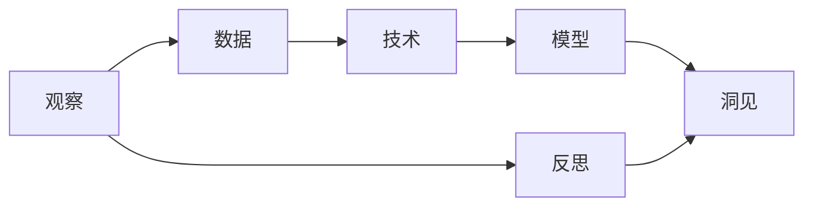

                 

# 洞见的形成：从观察到反思

## 1. 背景介绍

洞见（Insight）是人类思维过程中的重要产物，它不仅源自数据的收集与分析，还基于人类对于现象背后规律的深刻理解与思考。在现代信息技术迅猛发展的背景下，洞见形成的过程得到了极大的加速，从数据的获取到洞见的出现，几乎可以实时完成。但在数据驱动的洞见形成过程中，我们不仅要考虑技术的先进性，更应该关注人类对于数据与模型的反思，避免被技术的表象蒙蔽，忽视了更深层次的洞见。

### 1.1 问题的由来

当下，数据与算法的结合已深入到各行各业。人们通过大数据分析、机器学习、人工智能等技术，可以从海量数据中挖掘出各种洞见。例如，零售行业可以通过客户行为数据分析来提升产品销售，金融行业可以借助风险模型来预测市场波动，医疗行业可以运用疾病分析模型来提高诊断准确率。但同时，我们也看到，因数据质量不高、算法偏见或逻辑错误等，洞见有时也带来了误导性的决策，甚至给社会带来负面影响。

在深度学习中，模型的复杂性带来了强大的数据分析能力，但同时也存在数据驱动的盲目性。在未经过审慎的观察和反思的情况下，过度依赖数据与模型输出的结果，可能导致洞察能力的退化，甚至引发对“真理”的误读。因此，洞见形成的过程既需要技术的推动，更需要人类对其持续的观察、思考与反思。

## 2. 核心概念与联系

### 2.1 核心概念概述

为更好理解洞见形成过程，我们首先要明确几个核心概念及其联系：

- **洞见（Insight）**：指人类通过对现象、数据、模型等的分析、反思和思考，获得的对本质或规律的深刻理解。
- **观察（Observation）**：指对现象、数据、模型等的直接感知和记录。
- **反思（Reflection）**：指在观察的基础上，对现象、数据、模型等的进一步思考与思考。
- **技术（Technique）**：指用于处理、分析、提取洞见的工具和方法。
- **模型（Model）**：指用于描述、预测、解释现象的数学结构或算法。
- **数据（Data）**：指从现实世界中收集的信息。

这些概念共同构成了洞见形成的基础，通过观察获得数据，利用技术分析数据，并通过模型处理数据以提取洞见，最终通过反思形成对洞见的深刻理解。

### 2.2 核心概念原理和架构的 Mermaid 流程图



这个流程图展示了洞见形成过程中各概念之间的关系：

1. 从现象或数据中直接观察，获得原始的数据。
2. 利用技术手段对数据进行处理和分析，提取特征和模式。
3. 应用模型对这些特征和模式进行拟合和预测，生成洞见的初步结果。
4. 通过反思对模型结果进行理解和解释，形成对洞见的深刻理解。
5. 最终的洞见既是对模型结果的验证，也是对观察、技术和模型的进一步认识。

## 3. 核心算法原理 & 具体操作步骤

### 3.1 算法原理概述

基于观察、技术和模型的洞见形成过程，其核心算法原理主要基于统计学习与深度学习的思想。算法流程如下：

1. **数据采集**：从现实世界或已有数据源中收集数据。
2. **数据预处理**：对收集到的数据进行清洗、归一化等预处理操作。
3. **特征提取**：利用统计、深度学习等技术对数据进行特征提取，如降维、特征选择、卷积、池化等。
4. **模型构建与训练**：应用合适的模型结构（如线性回归、神经网络等）对提取后的特征进行拟合，使用训练数据对模型进行训练。
5. **模型评估与优化**：对训练后的模型进行评估，使用验证集或测试集对模型性能进行评估，并根据评估结果进行调优。
6. **洞见形成**：通过观察与反思，理解模型结果，提取模型对现象的解释或预测，形成洞见。

### 3.2 算法步骤详解

以金融风险预测为例，详细讲解该流程。

#### 数据采集
- **数据源**：股票市场、新闻网站、社交媒体、财务报表等。
- **数据类型**：股票价格、交易量、公司财报、新闻情感、社交媒体情绪等。

#### 数据预处理
- **清洗**：去除缺失值、异常值、噪声等。
- **归一化**：将数据转换成标准化的形式，如均值归一化、标准化等。
- **特征选择**：从众多特征中挑选最相关、最有效的特征。

#### 特征提取
- **技术**：统计降维、主成分分析（PCA）、深度学习中的卷积神经网络（CNN）、循环神经网络（RNN）、注意力机制等。
- **处理**：对数据进行卷积、池化、注意力等操作，提取特征。

#### 模型构建与训练
- **模型**：使用线性回归、神经网络、深度学习模型等。
- **训练**：使用历史数据对模型进行训练，调整模型参数，使其最小化预测误差。

#### 模型评估与优化
- **评估指标**：均方误差（MSE）、平均绝对误差（MAE）、对数损失（Log Loss）等。
- **调优**：使用交叉验证、超参数调整、正则化等方法优化模型。

#### 洞见形成
- **观察**：分析模型输出，理解预测结果。
- **反思**：思考模型的预测逻辑，探究其背后的原因，形成对现象的深刻理解。

### 3.3 算法优缺点

#### 优点
- **自动化程度高**：通过模型训练，能够自动化处理大量数据，提取特征，生成洞见。
- **灵活性高**：适用于多种类型的数据和问题，具有高度的泛化能力。
- **精确度高**：现代深度学习模型在特征提取和预测方面精度高，能够生成较为准确的洞见。

#### 缺点
- **依赖数据**：模型的准确性高度依赖于数据的质量和数量，数据偏差可能导致模型预测错误。
- **解释性差**：复杂模型如深度神经网络，其内部机制难以解释，导致模型结果的不可信性。
- **复杂度高**：模型训练复杂度高，需要大量的计算资源和数据。

### 3.4 算法应用领域

基于观察、技术和模型的洞见形成算法，广泛应用于多个领域：

- **金融领域**：使用模型预测股票价格、市场波动、信用风险等。
- **医疗领域**：使用模型预测疾病风险、疗效评估等。
- **零售领域**：使用模型分析客户购买行为、销售预测等。
- **制造业**：使用模型预测设备故障、质量控制等。
- **社交媒体**：使用模型分析情感趋势、热点话题等。

## 4. 数学模型和公式 & 详细讲解 & 举例说明

### 4.1 数学模型构建

以线性回归为例，介绍洞见形成的数学模型构建过程。

**模型形式**：
$$ y = \theta_0 + \sum_{i=1}^n \theta_i x_i + \epsilon $$
其中，$y$ 为预测值，$x_i$ 为特征，$\theta_i$ 为权重，$\epsilon$ 为误差。

**训练目标**：
最小化预测误差，通常使用均方误差（MSE）作为损失函数：
$$ L = \frac{1}{N} \sum_{i=1}^N (y_i - \hat{y}_i)^2 $$
其中，$y_i$ 为真实值，$\hat{y}_i$ 为预测值。

**参数求解**：
通过梯度下降等优化算法求解模型参数：
$$ \theta = (X^TX)^{-1}X^Ty $$
其中，$X$ 为特征矩阵，$Y$ 为真实值向量。

### 4.2 公式推导过程

以线性回归为例，详细推导其训练过程。

**梯度求解**：
$$ \frac{\partial L}{\partial \theta} = -\frac{2}{N} \sum_{i=1}^N (y_i - \hat{y}_i)x_i $$
**参数更新**：
$$ \theta \leftarrow \theta - \eta \frac{\partial L}{\partial \theta} $$
其中，$\eta$ 为学习率。

### 4.3 案例分析与讲解

以金融风险预测为例，分析线性回归在实际应用中的效果。

**数据集**：使用Kaggle金融风险预测数据集。
**特征**：包括历史股价、交易量、公司财报、新闻情感等。
**模型**：使用线性回归。
**训练过程**：使用均方误差（MSE）作为损失函数，梯度下降法优化参数。

**结果分析**：
- 模型训练后，可以得到较为准确的预测结果。
- 通过观察模型的预测，我们可以理解影响金融风险的主要因素。
- 进一步的反思，我们可以发现模型预测的局限性，如新闻情感对市场的影响不确定性等。

## 5. 项目实践：代码实例和详细解释说明

### 5.1 开发环境搭建

**步骤**：
1. 安装Python：下载并安装最新版本的Python。
2. 安装相关库：使用pip安装numpy、pandas、scikit-learn、matplotlib等。
3. 搭建虚拟环境：使用virtualenv或conda创建虚拟环境。
4. 安装Jupyter Notebook：安装Jupyter Notebook并设置配置文件。

### 5.2 源代码详细实现

以下是一个简单的线性回归模型训练代码，以Kaggle金融风险预测数据集为例：

```python
import pandas as pd
import numpy as np
from sklearn.linear_model import LinearRegression
from sklearn.model_selection import train_test_split
from sklearn.metrics import mean_squared_error
import matplotlib.pyplot as plt

# 加载数据
data = pd.read_csv('financial_risk.csv')

# 特征选择
features = data[['price', 'volume', 'revenue', 'profit']]
target = data['risk']

# 划分数据集
X_train, X_test, y_train, y_test = train_test_split(features, target, test_size=0.2, random_state=42)

# 模型训练
model = LinearRegression()
model.fit(X_train, y_train)

# 模型评估
y_pred = model.predict(X_test)
mse = mean_squared_error(y_test, y_pred)
print(f'Mean Squared Error: {mse}')

# 可视化结果
plt.scatter(y_test, y_pred)
plt.xlabel('True Risk')
plt.ylabel('Predicted Risk')
plt.show()
```

### 5.3 代码解读与分析

**代码分析**：
1. 加载数据：使用pandas加载数据集。
2. 特征选择：选择相关特征。
3. 数据划分：使用train_test_split函数将数据集划分为训练集和测试集。
4. 模型训练：使用LinearRegression模型进行训练。
5. 模型评估：使用均方误差（MSE）评估模型性能。
6. 结果可视化：使用matplotlib可视化预测结果。

**代码优化**：
1. 数据预处理：去除缺失值、异常值。
2. 超参数调整：使用网格搜索调整学习率等超参数。
3. 模型选择：尝试其他模型如决策树、随机森林等，比较性能。

**运行结果展示**：
通过可视化结果，可以直观地看到模型预测效果。

## 6. 实际应用场景

### 6.1 金融风险预测

**应用场景**：金融市场波动预测。
**数据**：历史股价、交易量、公司财报、新闻情感等。
**模型**：使用线性回归、神经网络、集成模型等。
**效果**：能够预测金融市场的波动，帮助投资者进行风险控制。

### 6.2 医疗诊断

**应用场景**：疾病预测、疗效评估。
**数据**：病人症状、历史病例、基因信息等。
**模型**：使用决策树、随机森林、深度学习等。
**效果**：提高诊断准确率，减少误诊率，提供个性化的治疗方案。

### 6.3 零售推荐

**应用场景**：客户购买行为预测。
**数据**：客户浏览记录、购买记录、商品信息等。
**模型**：使用协同过滤、关联规则挖掘、深度学习等。
**效果**：提高客户满意度，提升销售额。

### 6.4 未来应用展望

随着技术的不断发展，洞见形成将变得更加智能、高效。未来可能的应用包括：

- **自动化分析**：使用深度学习模型自动分析数据，生成报告。
- **跨领域融合**：将多种数据和模型进行融合，提高预测的准确性和泛化能力。
- **实时预测**：利用流式数据处理技术，实现实时预测和动态调整。
- **多模型协同**：使用集成学习、联邦学习等方法，提高预测的稳定性和鲁棒性。
- **伦理与隐私保护**：在预测过程中考虑伦理与隐私，确保数据的安全性和可解释性。

## 7. 工具和资源推荐

### 7.1 学习资源推荐

1. 《机器学习实战》：一本系统介绍机器学习基本概念和实现方法的书籍。
2. 《深度学习》：Yoshua Bengio等人合著的深度学习经典教材。
3. 《Python数据科学手册》：一本详细介绍Python在数据科学中的应用的书籍。
4. Coursera、edX等在线课程平台：提供高质量的机器学习和深度学习课程。
5. Kaggle竞赛平台：提供大量数据集和实战案例，帮助用户提升数据分析和模型构建能力。

### 7.2 开发工具推荐

1. Python：一个开源的高级编程语言，适用于数据科学和机器学习。
2. Jupyter Notebook：一个交互式编程环境，支持代码执行和结果可视化。
3. TensorFlow：一个开源的深度学习框架，支持多种模型的构建和训练。
4. PyTorch：一个基于Python的深度学习库，支持动态计算图和高效的模型训练。
5. Anaconda：一个集成环境，包含多种科学计算库和工具。

### 7.3 相关论文推荐

1. 《深度学习》（Goodfellow et al.）：深度学习领域的经典教材。
2. 《机器学习》（Tom Mitchell）：介绍了机器学习的基本概念和算法。
3. 《强化学习》（Sutton & Barto）：介绍强化学习的基本理论和算法。
4. 《神经网络与深度学习》（Michael Nielsen）：介绍神经网络和深度学习的基本原理和实现方法。
5. 《统计学习方法》（李航）：介绍统计学习的基本概念和算法。

## 8. 总结：未来发展趋势与挑战

### 8.1 研究成果总结

洞见形成过程不仅依赖于技术，更依赖于人类的观察、思考和反思。通过观察获得数据，利用技术分析数据，并通过模型处理数据以提取洞见，最终通过反思形成对洞见的深刻理解。在洞见形成过程中，技术的先进性和数据的全面性是关键，但人类对于数据的反思和模型的理解同样重要。

### 8.2 未来发展趋势

1. **自动化与智能化**：随着深度学习和大数据分析技术的发展，洞见形成将变得更加自动化和智能化。
2. **多领域融合**：不同领域的数据和模型将更加紧密地融合，形成更加全面和综合的洞见。
3. **实时预测与动态调整**：流式数据处理和实时预测技术将使得洞见形成更加高效和灵活。
4. **伦理与隐私保护**：在数据和模型处理过程中，将更加注重伦理与隐私保护，确保数据的安全性和可解释性。
5. **跨学科协作**：跨学科的协作和交流将使得洞见形成过程更加全面和深入。

### 8.3 面临的挑战

1. **数据质量与多样性**：数据的准确性和多样性直接影响到洞见形成的质量。
2. **模型复杂性与可解释性**：深度学习模型的复杂性带来了高精度的预测，但同时也降低了其可解释性。
3. **计算资源与时间**：复杂模型的训练和预测需要大量的计算资源和时间。
4. **伦理与隐私问题**：在数据处理和模型应用过程中，需要考虑伦理与隐私问题，确保数据的安全性和合法性。
5. **人机协同**：在数据处理和洞见形成过程中，需要加强人机协同，避免过度依赖数据与模型。

### 8.4 研究展望

1. **可解释性研究**：研究深度学习模型的可解释性，探索如何通过解释模型内部机制来提高其可信度。
2. **跨学科应用**：将洞见形成技术应用到更多领域，如金融、医疗、制造等。
3. **伦理与安全保护**：研究数据和模型的伦理与安全问题，确保其应用过程中的合法性和安全性。
4. **自动化与智能化**：研究如何通过自动化和智能化手段，提高洞见形成的效率和质量。
5. **人机协同**：研究人机协同在洞见形成中的应用，避免过度依赖数据与模型。

## 9. 附录：常见问题与解答

### Q1: 什么是洞见？

A: 洞见是指通过对现象、数据、模型等的分析、反思和思考，获得的对本质或规律的深刻理解。

### Q2: 洞见形成过程包含哪些步骤？

A: 洞见形成过程主要包括数据采集、数据预处理、特征提取、模型构建与训练、模型评估与优化、洞见形成等步骤。

### Q3: 如何提高洞见形成的准确性？

A: 提高洞见形成的准确性需要数据质量、模型选择、超参数调整、模型评估等综合因素的考虑。

### Q4: 深度学习模型有哪些缺点？

A: 深度学习模型在解释性、计算资源需求、模型复杂性等方面存在不足。

### Q5: 如何增强洞见形成的伦理与安全？

A: 在数据处理和模型应用过程中，需要考虑伦理与安全问题，确保数据的安全性和合法性。

---

作者：禅与计算机程序设计艺术 / Zen and the Art of Computer Programming

