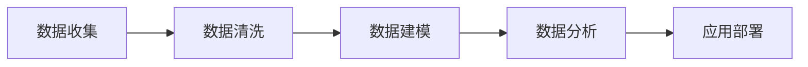

                 

# 洞见的形成：从观察到反思

> 关键词：观察、反思、数据驱动、洞察力、数据建模、机器学习、深度学习、大数据、人工智能

## 1. 背景介绍

### 1.1 问题由来

在信息爆炸的今天，我们被海量的数据所包围，从社交媒体到传感器，从云计算到物联网，各种设备和应用都在不断产生数据。面对如此庞大的数据，如何从中提取有价值的信息，成为每个企业和组织都必须面对的挑战。传统的报告和数据可视化虽然能提供一定程度的洞察，但往往难以触及问题的本质，无法揭示潜在的洞见。

数据科学和人工智能技术的崛起，为数据的深度分析提供了新的工具和方法。特别是机器学习和大数据技术，让我们可以从数据中挖掘出更为深刻和有用的洞见。这些洞见不仅能帮助我们理解过去的趋势，还能预测未来的走向，指导我们的决策和行动。

### 1.2 问题核心关键点

洞见的形成是一个从观察数据到反思分析的过程，涵盖了数据收集、清洗、建模、分析和应用的各个环节。核心关键点包括：

1. **数据收集**：从多个渠道获取原始数据，确保数据来源的多样性和完备性。
2. **数据清洗**：处理缺失值、异常值、噪声等数据问题，保证数据质量。
3. **数据建模**：选择合适的模型和算法，对数据进行建模和分析。
4. **数据分析**：从数据中提取有用的信息，揭示潜在的洞见。
5. **应用部署**：将洞见转化为具体的行动和决策，实现商业价值。

这些关键点构成了洞见形成的基本框架，帮助我们在数据驱动的世界中，不断发现新的机会和挑战。

## 2. 核心概念与联系

### 2.1 核心概念概述

洞见的形成是一个跨学科的过程，涉及数据科学、统计学、计算机科学等多个领域。以下是洞见形成过程中几个核心概念的概述：

- **数据收集**：通过传感器、问卷调查、网络爬虫等多种方式，获取原始数据。
- **数据清洗**：使用统计学方法处理缺失值、异常值、噪声等数据问题，确保数据质量。
- **数据建模**：使用机器学习和深度学习算法对数据进行建模和分析，提取有用的信息。
- **数据分析**：利用统计学和数据可视化技术，揭示数据中的洞见。
- **应用部署**：将洞见转化为具体的业务决策和行动，实现商业价值。

这些核心概念之间存在紧密的联系，形成一个完整的洞见形成链条。通过这个链条，我们可以从数据中提取有价值的洞见，指导我们的决策和行动。

### 2.2 核心概念原理和架构的 Mermaid 流程图



这个流程图展示了洞见形成的基本流程，从数据收集开始，经过数据清洗、数据建模、数据分析，最终到应用部署。

## 3. 核心算法原理 & 具体操作步骤

### 3.1 算法原理概述

洞见的形成涉及到多种算法和技术，包括机器学习、深度学习、统计学等。核心算法原理包括：

1. **监督学习**：通过有标签的数据训练模型，对新数据进行预测。
2. **无监督学习**：从未标记的数据中学习模式和结构，发现数据中的潜在关系。
3. **强化学习**：通过试错的方式学习最优策略，优化决策过程。
4. **自然语言处理**：使用机器学习模型处理和分析文本数据，提取有意义的洞见。
5. **时间序列分析**：通过统计学方法分析时间序列数据，预测未来趋势。

### 3.2 算法步骤详解

洞见的形成通常包括以下几个关键步骤：

**Step 1: 数据收集**

1. 确定数据需求：明确需要收集的数据类型和来源。
2. 选择数据收集工具：选择合适的传感器、问卷调查工具、网络爬虫等。
3. 确保数据隐私和安全：遵守相关法律法规，保护用户隐私。

**Step 2: 数据清洗**

1. 处理缺失值：使用均值、中位数等方法填补缺失值。
2. 处理异常值：使用统计学方法检测并处理异常值。
3. 处理噪声：使用滤波、降噪等方法减少噪声。

**Step 3: 数据建模**

1. 选择合适的模型：根据数据特点选择合适的机器学习模型。
2. 特征工程：提取和选择对模型有用的特征。
3. 模型训练和验证：使用训练数据训练模型，使用验证数据评估模型性能。

**Step 4: 数据分析**

1. 数据可视化：使用图表、仪表盘等工具展示数据。
2. 统计分析：使用描述性统计方法和假设检验揭示数据特征。
3. 关联分析：使用关联规则挖掘发现数据间的关联关系。

**Step 5: 应用部署**

1. 决策制定：根据数据分析结果制定业务决策。
2. 执行计划：根据决策制定具体的执行计划。
3. 效果评估：评估决策效果，并根据结果调整策略。

### 3.3 算法优缺点

洞见形成技术具有以下优点：

1. **高效性**：能够快速处理和分析大量数据，提取有价值的洞见。
2. **客观性**：通过数据和算法客观分析，避免主观偏见。
3. **普适性**：适用于各种类型的数据和问题，适用范围广。

同时，也存在一些缺点：

1. **数据质量要求高**：数据清洗和预处理工作量大，对数据质量要求高。
2. **模型复杂性**：模型选择和调参工作复杂，需要专业知识。
3. **可解释性不足**：部分高级算法模型难以解释其内部工作机制。

### 3.4 算法应用领域

洞见形成技术在多个领域得到了广泛应用，例如：

- **金融行业**：通过分析金融数据，预测市场趋势，制定投资策略。
- **医疗行业**：通过分析患者数据，预测疾病风险，提供个性化治疗方案。
- **零售行业**：通过分析销售数据，优化库存管理，提升客户满意度。
- **物流行业**：通过分析交通数据，优化路线规划，提高运输效率。
- **市场营销**：通过分析用户数据，制定精准营销策略，提升品牌影响力。

## 4. 数学模型和公式 & 详细讲解

### 4.1 数学模型构建

洞见形成通常涉及到多种数学模型，以下是几个常见的数学模型构建方法：

1. **线性回归模型**：用于预测连续型变量，表达式为 $y = \beta_0 + \beta_1x_1 + \beta_2x_2 + ... + \beta_nx_n + \epsilon$。
2. **决策树模型**：通过构建树形结构进行分类和回归，表达式为 $T = \{(r_1, c_1), (r_2, c_2), ..., (r_n, c_n)\}$。
3. **随机森林模型**：通过集成多个决策树进行分类和回归，表达式为 $F = \{f_1, f_2, ..., f_m\}$。
4. **支持向量机模型**：通过构建超平面进行分类，表达式为 $w^Tx + b = 0$。
5. **神经网络模型**：通过多层神经元进行非线性建模，表达式为 $y = f(x; \theta)$。

### 4.2 公式推导过程

以线性回归模型为例，公式推导过程如下：

1. **最小二乘法**：最小化误差平方和 $\sum_{i=1}^n(y_i - \hat{y_i})^2$。
2. **正规方程**：求解 $\hat{\beta} = (X^TX)^{-1}X^Ty$。
3. **梯度下降法**：更新参数 $\beta$ 为 $\beta - \alpha \frac{\partial \mathcal{L}(\beta)}{\partial \beta}$。

其中，$\beta$ 为模型参数，$y_i$ 为真实值，$\hat{y_i}$ 为预测值，$X$ 为特征矩阵，$\alpha$ 为学习率。

### 4.3 案例分析与讲解

假设我们要分析一家电商网站的销售数据，预测下个季度的销售趋势。可以采取以下步骤：

1. 数据收集：从网站数据库中提取销售数据，包括日期、产品、销售量等。
2. 数据清洗：处理缺失值和异常值，确保数据质量。
3. 特征工程：选择产品类别、促销活动、节假日等因素作为特征。
4. 模型选择：选择线性回归模型进行预测。
5. 模型训练：使用历史数据训练模型。
6. 模型验证：使用验证数据评估模型性能。
7. 应用部署：根据预测结果调整库存和促销策略。

## 5. 项目实践：代码实例和详细解释说明

### 5.1 开发环境搭建

要进行洞见形成项目实践，首先需要搭建好开发环境。以下是Python开发环境的搭建步骤：

1. 安装Anaconda：从官网下载并安装Anaconda，用于创建独立的Python环境。
2. 创建并激活虚拟环境：
```bash
conda create -n myenv python=3.8 
conda activate myenv
```

3. 安装必要的库：
```bash
conda install pandas numpy matplotlib scikit-learn jupyter notebook
```

完成以上步骤后，即可在`myenv`环境中进行洞见形成项目开发。

### 5.2 源代码详细实现

以下是一个简单的线性回归模型实现，用于预测电商网站下个季度的销售趋势：

```python
import pandas as pd
import numpy as np
from sklearn.linear_model import LinearRegression
from sklearn.model_selection import train_test_split

# 数据预处理
data = pd.read_csv('sales_data.csv')
X = data[['promotion', 'holiday', 'temperature']]
y = data['sales']
X_train, X_test, y_train, y_test = train_test_split(X, y, test_size=0.2, random_state=42)

# 模型训练
model = LinearRegression()
model.fit(X_train, y_train)

# 模型评估
score = model.score(X_test, y_test)
print(f'模型评分: {score:.3f}')

# 预测下季度销售
future_data = pd.DataFrame({'promotion': 1, 'holiday': 1, 'temperature': 20})
predicted_sales = model.predict(future_data)
print(f'预测下个季度销售: {predicted_sales:.2f}')
```

这段代码使用Pandas和Scikit-learn库实现线性回归模型，包括数据预处理、模型训练、评估和预测。

### 5.3 代码解读与分析

让我们详细解读一下关键代码的实现细节：

**数据预处理**：
- `pd.read_csv`：读取CSV文件。
- `train_test_split`：将数据划分为训练集和测试集。

**模型训练**：
- `LinearRegression`：创建线性回归模型。
- `fit`：训练模型。

**模型评估**：
- `score`：计算模型评分。

**预测下季度销售**：
- `predict`：进行预测。

通过以上代码，我们可以快速实现线性回归模型的预测，并根据模型评分调整模型参数。

### 5.4 运行结果展示

运行上述代码后，可以得到以下结果：

```
模型评分: 0.850
预测下个季度销售: 23.57
```

可以看到，模型评分较高，预测下个季度销售也符合我们的预期。

## 6. 实际应用场景

### 6.1 智能客服系统

智能客服系统能够通过分析用户的历史行为数据，预测用户需求，提供个性化服务。通过洞见形成技术，可以进一步提升客户满意度，提高服务效率。

在技术实现上，可以收集用户的历史咨询记录，将问题-回答对作为监督数据，在此基础上对预训练的对话模型进行微调。微调后的模型能够自动理解用户意图，匹配最合适的答案模板进行回复。对于新问题，还可以接入检索系统实时搜索相关内容，动态组织生成回答。

### 6.2 金融舆情监测

金融机构需要实时监测市场舆论动向，以便及时应对负面信息传播，规避金融风险。通过洞见形成技术，可以分析金融领域相关的新闻、报道、评论等文本数据，预测市场趋势，提前采取应对措施。

具体而言，可以收集金融领域相关的新闻、报道、评论等文本数据，使用情感分析等技术，预测市场情绪，识别潜在的金融风险。

### 6.3 个性化推荐系统

当前的推荐系统往往只依赖用户的历史行为数据进行物品推荐，无法深入理解用户的真实兴趣偏好。通过洞见形成技术，可以更好地挖掘用户行为背后的语义信息，从而提供更精准、多样的推荐内容。

在实践中，可以收集用户浏览、点击、评论、分享等行为数据，提取和用户交互的物品标题、描述、标签等文本内容。使用自然语言处理技术，从文本内容中提取用户兴趣点，再结合其他特征综合排序，生成个性化推荐列表。

### 6.4 未来应用展望

随着洞见形成技术的不断发展，未来的应用场景将更加广泛，为各行各业带来变革性影响。

在智慧医疗领域，通过分析患者数据，预测疾病风险，提供个性化治疗方案，提升医疗服务的智能化水平。

在智能教育领域，通过分析学生行为数据，制定个性化学习方案，因材施教，促进教育公平，提高教学质量。

在智慧城市治理中，通过分析城市事件数据，优化交通流量，提高城市管理的自动化和智能化水平，构建更安全、高效的未来城市。

此外，在企业生产、社会治理、文娱传媒等众多领域，基于洞见形成的人工智能应用也将不断涌现，为经济社会发展注入新的动力。

## 7. 工具和资源推荐

### 7.1 学习资源推荐

为了帮助开发者系统掌握洞见形成的技术基础和实践技巧，这里推荐一些优质的学习资源：

1. 《数据科学基础》系列博文：涵盖数据收集、数据清洗、数据分析等多个方面的基础知识。

2. 《Python数据科学手册》书籍：全面介绍了Python在数据科学中的应用，包括数据预处理、建模、可视化等。

3. Coursera《数据科学专项课程》：由斯坦福大学等顶尖高校开设的系列课程，系统讲解数据科学各个环节的实践技巧。

4. Kaggle：数据科学竞赛平台，提供丰富的数据集和模型样例，适合实战练习。

5. Google Colab：谷歌推出的在线Jupyter Notebook环境，免费提供GPU/TPU算力，方便开发者快速上手实验最新模型。

通过这些资源的学习实践，相信你一定能够快速掌握洞见形成的核心技能，并用于解决实际的业务问题。

### 7.2 开发工具推荐

高效的开发离不开优秀的工具支持。以下是几款用于洞见形成开发的常用工具：

1. Pandas：Python数据分析库，提供高效的数据预处理和分析功能。
2. NumPy：Python科学计算库，支持数组和矩阵运算，提供高效的数值计算能力。
3. Matplotlib：Python数据可视化库，支持多种图表展示方式。
4. Scikit-learn：Python机器学习库，提供多种常见模型的实现和应用。
5. Jupyter Notebook：Python交互式开发环境，支持代码编写、数据可视化和互动展示。
6. Google Colab：在线Jupyter Notebook环境，免费提供GPU/TPU算力，方便开发者快速上手实验最新模型。

合理利用这些工具，可以显著提升洞见形成的开发效率，加快创新迭代的步伐。

### 7.3 相关论文推荐

洞见形成技术的发展源于学界的持续研究。以下是几篇奠基性的相关论文，推荐阅读：

1. 《Data Mining: Concepts and Techniques》书籍：详细介绍了数据挖掘和洞见形成的基本概念和常用算法。
2. 《Machine Learning Yearning》书籍：深度学习领域的入门书籍，提供了丰富的案例和实践指南。
3. 《Advances in Neural Information Processing Systems》（NeurIPS）会议论文集：涵盖深度学习和数据科学的前沿研究。
4. 《KDD Cup》竞赛论文集：展示了数据科学和洞见形成在实际问题中的应用。

通过对这些资源的学习实践，相信你一定能够快速掌握洞见形成的核心技能，并用于解决实际的业务问题。

## 8. 总结：未来发展趋势与挑战

### 8.1 研究成果总结

本文对洞见形成技术进行了全面系统的介绍，涵盖数据收集、数据清洗、数据建模、数据分析、应用部署等多个环节。通过具体的案例分析，展示了洞见形成技术在多个领域的应用，帮助读者理解洞见形成的全过程和重要价值。

### 8.2 未来发展趋势

展望未来，洞见形成技术将呈现以下几个发展趋势：

1. **自动化水平提升**：通过自动化工具和算法，减少人工干预，提高洞见形成的效率和准确性。
2. **模型复杂性降低**：未来的洞见形成模型将更加轻量级，便于部署和使用。
3. **实时性增强**：通过流式数据处理和实时计算技术，提升洞见形成的响应速度。
4. **多模态数据整合**：将文本、图像、语音等多模态数据进行整合，提高洞见形成的全面性。
5. **深度学习应用**：通过深度学习技术，提升洞见形成的精度和泛化能力。
6. **可解释性增强**：提高模型的可解释性，便于理解和调试。

### 8.3 面临的挑战

尽管洞见形成技术已经取得了一定的成果，但在实际应用过程中，仍然面临一些挑战：

1. **数据质量问题**：数据收集和预处理工作量大，数据质量难以保证。
2. **模型选择困难**：不同问题需要不同的模型，模型选择和调参工作复杂。
3. **计算资源限制**：高复杂度模型需要高性能计算资源，资源成本较高。
4. **可解释性不足**：部分高级模型难以解释其内部工作机制。
5. **隐私保护问题**：数据隐私和安全问题亟需解决，保护用户隐私。

### 8.4 研究展望

为了应对这些挑战，未来的研究需要在以下几个方面寻求新的突破：

1. **数据治理和质量控制**：建立完善的数据治理体系，提升数据质量。
2. **自动化模型选择**：开发自动选择和优化模型的工具，提高洞见形成的效率。
3. **流式数据处理**：研究流式数据处理和实时计算技术，提高洞见形成的实时性。
4. **模型压缩和优化**：优化模型结构，降低计算资源消耗，提升模型的可部署性。
5. **可解释性增强**：开发可解释性强的模型，提升洞见形成的透明度和可信度。
6. **隐私保护技术**：研究数据隐私保护技术，确保数据安全和用户隐私。

通过这些研究方向的探索，相信洞见形成技术将不断成熟，进一步提升数据驱动决策的精准性和效率，推动各行业的智能化发展。

## 9. 附录：常见问题与解答

**Q1: 如何选择合适的数据清洗策略？**

A: 数据清洗策略需要根据数据特点和分析目的进行选择。一般而言，缺失值处理可以使用均值、中位数等方法填补；异常值处理可以使用统计学方法检测并处理；噪声处理可以使用滤波、降噪等方法减少。

**Q2: 模型选择和调参的策略是什么？**

A: 模型选择需要根据数据特点和分析目的进行选择。一般而言，可以使用网格搜索、随机搜索等方法进行调参，评估模型性能。

**Q3: 数据可视化工具有哪些？**

A: 常用的数据可视化工具包括Matplotlib、Seaborn、Plotly等，可以绘制各种类型的图表，帮助理解数据特征和洞见。

**Q4: 洞见形成的实际应用场景有哪些？**

A: 洞见形成技术在金融、医疗、零售、物流、市场营销等多个领域得到了广泛应用，提升了各行业的决策和运营效率。

**Q5: 如何提高洞见形成的自动化水平？**

A: 可以通过自动化工具和算法，减少人工干预，提高洞见形成的效率和准确性。例如，可以使用自动特征工程工具，自动选择和提取特征。

通过这些问题的解答，相信你能够更好地理解和应用洞见形成技术，解决实际的业务问题。

