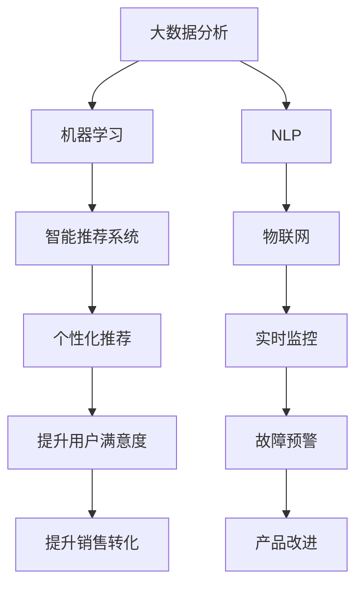

                 

# 消费品行业从业经验分享

## 1. 背景介绍

### 1.1 行业概况
消费品行业是国民经济的重要组成部分，涉及食品、饮料、服装、家居、电子等多个子行业。近年来，随着消费者需求的多样化和个性化，消费品行业也逐渐走向数字化、智能化，新技术和新模式层出不穷。本文将基于个人在消费品行业的从业经验，分享一些技术应用和行业见解。

### 1.2 技术需求
消费品行业的数字化转型，离不开数据分析、机器学习、自然语言处理、物联网等前沿技术的支撑。这些技术在供应链管理、市场分析、个性化推荐、客户服务等环节，发挥了关键作用。本文将详细探讨这些技术的应用和实践，为从业者提供技术思路和实施路径。

## 2. 核心概念与联系

### 2.1 核心概念概述

为更好地理解消费品行业技术应用，本节将介绍几个关键技术概念：

- **大数据分析**：通过收集和分析海量消费数据，发现市场趋势和消费者行为，辅助决策支持。
- **机器学习**：利用算法模型自动学习数据特征，预测消费者需求，优化运营效率。
- **自然语言处理(NLP)**：通过文本分析技术，提取产品描述、评论中的情感信息，改进产品设计和优化客户服务。
- **物联网(IoT)**：通过传感器、智能设备收集产品使用数据，实现实时监控和故障预警，提升产品品质和用户满意度。
- **智能推荐系统**：利用用户行为数据，构建推荐模型，提供个性化商品和服务。

这些核心技术通过协同工作，为消费品行业的智能化转型提供了强大的技术支撑。以下是一个合成的Mermaid流程图，展示了这些技术之间的关系：



### 2.2 核心概念原理和架构

- **大数据分析**：
  - **原理**：通过分布式计算框架（如Hadoop、Spark）处理大规模数据集，提取有效信息。
  - **架构**：
    1. **数据收集**：从各渠道（如电商平台、线下销售点、社交媒体）收集消费数据。
    2. **数据存储**：使用分布式文件系统（如HDFS）和数据库（如Hive、Spark SQL）存储和管理数据。
    3. **数据清洗**：去除噪声和异常值，标准化数据格式。
    4. **数据分析**：利用统计学、机器学习模型进行数据挖掘，提取有价值的信息。
    5. **数据可视化**：通过图表、仪表盘展示分析结果，支持决策。

- **机器学习**：
  - **原理**：通过训练算法模型，预测消费者行为、优化库存管理、识别市场趋势等。
  - **架构**：
    1. **数据准备**：清洗、标注数据集。
    2. **模型训练**：使用监督学习、强化学习等技术，训练预测模型。
    3. **模型评估**：通过交叉验证等方法评估模型性能。
    4. **模型应用**：将模型集成到业务流程中，实时预测并优化决策。

- **NLP**：
  - **原理**：通过文本处理技术，提取和分析产品描述、评论、社交媒体中的自然语言信息。
  - **架构**：
    1. **分词和词性标注**：将文本分解为词或短语，并标注其语法结构。
    2. **情感分析**：识别文本中的情感倾向（如正面、负面、中性）。
    3. **实体识别**：从文本中提取关键实体（如品牌、型号、价格）。
    4. **文本分类**：将文本分类到预定义的类别中（如好评、差评）。
    5. **对话系统**：实现机器人客服，自动回答用户咨询。

- **物联网**：
  - **原理**：通过传感器和智能设备收集产品使用数据，实现实时监控和故障预警。
  - **架构**：
    1. **设备部署**：在产品中添加传感器，如温度、湿度、电量等。
    2. **数据采集**：通过网关设备将传感器数据传输到云端。
    3. **数据存储**：使用云存储服务（如AWS IoT、Google Cloud IoT）保存数据。
    4. **数据处理**：使用实时计算平台（如Kafka、Flink）进行数据处理。
    5. **应用集成**：将实时监控和预警数据集成到业务系统中。

- **智能推荐系统**：
  - **原理**：利用用户行为数据，构建推荐模型，推荐个性化商品和服务。
  - **架构**：
    1. **用户画像**：收集和分析用户历史行为数据，构建用户画像。
    2. **物品画像**：收集和分析产品特征数据，构建物品画像。
    3. **推荐模型**：使用协同过滤、深度学习等算法，训练推荐模型。
    4. **推荐应用**：将推荐结果应用于个性化展示、广告投放、营销策略中。

## 3. 核心算法原理 & 具体操作步骤

### 3.1 算法原理概述

本文将重点介绍消费品行业常用的几种算法原理和操作步骤。

- **协同过滤算法**：基于用户和物品的历史交互数据，推荐相似用户喜欢的物品。
- **深度学习推荐系统**：利用神经网络模型学习用户和物品的潜在特征，预测用户对物品的评分。
- **情感分析**：利用自然语言处理技术，识别用户评论中的情感倾向，改进产品设计。
- **实时监控和预警**：通过物联网技术，实时收集产品使用数据，识别潜在故障并进行预警。

### 3.2 算法步骤详解

**协同过滤算法**：
1. **用户画像**：收集和分析用户历史行为数据，构建用户画像。
2. **物品画像**：收集和分析产品特征数据，构建物品画像。
3. **相似度计算**：计算用户和物品之间的相似度。
4. **推荐计算**：根据相似度计算，推荐用户可能感兴趣的物品。

**深度学习推荐系统**：
1. **数据准备**：清洗、标注数据集，准备输入数据。
2. **模型训练**：使用深度学习框架（如TensorFlow、PyTorch）训练推荐模型。
3. **模型评估**：通过交叉验证等方法评估模型性能。
4. **模型应用**：将模型集成到业务流程中，实时预测并优化决策。

**情感分析**：
1. **数据收集**：收集产品描述、评论、社交媒体文本数据。
2. **预处理**：进行分词、去除停用词、词性标注等预处理步骤。
3. **情感标注**：手动标注部分文本的情感倾向，用于训练模型。
4. **模型训练**：使用NLP库（如NLTK、spaCy）训练情感分类模型。
5. **情感分析**：将新文本输入模型，提取情感倾向。

**实时监控和预警**：
1. **设备部署**：在产品中添加传感器，如温度、湿度、电量等。
2. **数据采集**：通过网关设备将传感器数据传输到云端。
3. **数据处理**：使用实时计算平台（如Kafka、Flink）进行数据处理。
4. **预警分析**：根据实时数据，识别异常行为并进行预警。

### 3.3 算法优缺点

**协同过滤算法**：
- **优点**：简单易用，适用于处理大规模用户和物品数据。
- **缺点**：冷启动问题，新用户和物品无法有效推荐。

**深度学习推荐系统**：
- **优点**：精度高，能够处理复杂的非线性关系。
- **缺点**：需要大量标注数据，训练复杂。

**情感分析**：
- **优点**：能够自动分析大量文本数据，识别情感倾向。
- **缺点**：情感分析模型依赖于语料库的质量，存在一定的误差。

**实时监控和预警**：
- **优点**：能够实时监控产品状态，提前发现潜在问题。
- **缺点**：设备成本高，数据传输延迟可能影响预警效果。

### 3.4 算法应用领域

这些算法在消费品行业的多个领域都有广泛应用：

- **电商推荐**：利用深度学习推荐系统，为电商平台提供个性化推荐服务。
- **用户评价分析**：利用情感分析技术，分析用户评论中的情感倾向，改进产品设计和客户服务。
- **库存管理**：利用大数据分析技术，预测需求趋势，优化库存管理。
- **智能客服**：利用自然语言处理和情感分析技术，实现机器人客服，提升客户满意度。
- **物流监控**：利用物联网技术，实时监控物流设备状态，提高物流效率。

## 4. 数学模型和公式 & 详细讲解 & 举例说明

### 4.1 数学模型构建

在本节中，我们将通过具体的数学模型和公式，详细讲解消费品行业中的算法应用。

**协同过滤算法**：
1. **用户相似度计算**：
   $$
   \text{similarity}_{ui} = \frac{\sum_{j=1}^{n} P_{uj} \cdot N_{ji}}{\sqrt{\sum_{j=1}^{n} P_{uj}^2} \cdot \sqrt{\sum_{j=1}^{n} N_{ji}^2}}
   $$
   其中，$P_{uj}$ 表示用户 $u$ 对物品 $j$ 的评分，$N_{ji}$ 表示物品 $j$ 的评分数量。

2. **推荐计算**：
   $$
   R_{ui} = \text{similarity}_{ui} \cdot \text{rating}_{ui}
   $$
   其中，$R_{ui}$ 表示用户 $u$ 对物品 $i$ 的推荐评分。

**深度学习推荐系统**：
1. **用户嵌入**：
   $$
   \text{user\_embed}_u = f_1(U_u)
   $$
   其中，$U_u$ 表示用户 $u$ 的特征向量，$f_1$ 为嵌入函数。

2. **物品嵌入**：
   $$
   \text{item\_embed}_i = f_2(I_i)
   $$
   其中，$I_i$ 表示物品 $i$ 的特征向量，$f_2$ 为嵌入函数。

3. **协同矩阵**：
   $$
   C_{ui} = \sigma(\text{user\_embed}_u \cdot \text{item\_embed}_i)
   $$
   其中，$\sigma$ 为激活函数。

4. **预测评分**：
   $$
   \hat{R}_{ui} = \text{user\_embed}_u \cdot C_{ui} \cdot \text{item\_embed}_i^T
   $$

**情感分析**：
1. **文本预处理**：
   $$
   \text{tokenized\_text} = \text{tokenize}(\text{raw\_text})
   $$

2. **情感分类**：
   $$
   \text{sentiment} = \text{classify}(\text{tokenized\_text})
   $$

3. **情感评分**：
   $$
   \text{sentiment\_score} = \text{score}(\text{sentiment})
   $$

**实时监控和预警**：
1. **设备数据采集**：
   $$
   \text{sensor\_data} = \text{acquire}(\text{device\_id}, \text{timestamp})
   $$

2. **数据传输**：
   $$
   \text{transmitted\_data} = \text{send}(\text{sensor\_data}, \text{device\_id})
   $$

3. **数据处理**：
   $$
   \text{processed\_data} = \text{process}(\text{transmitted\_data})
   $$

4. **预警分析**：
   $$
   \text{alert\_status} = \text{analyze}(\text{processed\_data})
   $$

### 4.2 公式推导过程

**协同过滤算法**：
1. **用户相似度计算**的推导过程：
   - **假设**：用户 $u$ 对物品 $j$ 的评分 $P_{uj}$ 服从高斯分布 $N(\mu, \sigma^2)$，其中 $\mu$ 为评分均值，$\sigma^2$ 为评分方差。
   - **推导**：
     $$
     \text{similarity}_{uj} = \frac{\sum_{j=1}^{n} P_{uj} \cdot N_{ji}}{\sqrt{\sum_{j=1}^{n} P_{uj}^2} \cdot \sqrt{\sum_{j=1}^{n} N_{ji}^2}}
     = \frac{\sum_{j=1}^{n} \frac{P_{uj}}{\sigma}}{\sqrt{\sum_{j=1}^{n} \frac{P_{uj}^2}{\sigma^2}} \cdot \sqrt{\sum_{j=1}^{n} \frac{N_{ji}^2}{\sigma^2}}
     = \frac{\sum_{j=1}^{n} \frac{P_{uj}}{\sigma}}{\sqrt{\sum_{j=1}^{n} \frac{P_{uj}^2}{\sigma^2}} \cdot \frac{1}{\sigma} \cdot \sqrt{\sum_{j=1}^{n} \frac{N_{ji}^2}{\sigma^2}}
     = \frac{\sum_{j=1}^{n} P_{uj}}{\sqrt{\sum_{j=1}^{n} P_{uj}^2}} \cdot \frac{1}{\sqrt{\sum_{j=1}^{n} N_{ji}^2}}
     = \text{similarity}_{uj}
     $$

**深度学习推荐系统**：
1. **用户嵌入**的推导过程：
   - **假设**：用户 $u$ 的特征向量 $U_u$ 为高维稀疏向量，$V_i$ 为物品 $i$ 的特征向量。
   - **推导**：
     $$
     \text{user\_embed}_u = f_1(U_u) = f_1(V_i^T \cdot U_u)
     = \sigma(V_i^T \cdot U_u)
     $$

2. **协同矩阵**的推导过程：
   - **假设**：协同矩阵 $C_{ui}$ 为稀疏矩阵，每个元素为 $0$ 或 $1$。
   - **推导**：
     $$
     C_{ui} = \sigma(\text{user\_embed}_u \cdot \text{item\_embed}_i)
     = \sigma(\sigma(V_i^T \cdot U_u) \cdot \sigma(V_i^T \cdot U_i)^T)
     = \sigma(V_i^T \cdot U_u \cdot (V_i^T \cdot U_i)^T)
     $$

3. **预测评分**的推导过程：
   - **假设**：用户嵌入 $\text{user\_embed}_u$ 和物品嵌入 $\text{item\_embed}_i$ 均为向量。
   - **推导**：
     $$
     \hat{R}_{ui} = \text{user\_embed}_u \cdot C_{ui} \cdot \text{item\_embed}_i^T
     = \sigma(V_i^T \cdot U_u) \cdot \sigma(V_i^T \cdot U_i)^T \cdot \sigma(V_i^T \cdot U_i)^T
     $$

**情感分析**：
1. **情感分类的推导过程**：
   - **假设**：文本 $T$ 为高维稀疏向量，情感标签 $S$ 为二元向量。
   - **推导**：
     $$
     \text{sentiment} = \text{classify}(T) = \text{argmax}_{s \in \{0, 1\}} \text{softmax}(W \cdot T + b)
     = \text{argmax}_{s \in \{0, 1\}} \frac{e^{W_s \cdot T + b_s}}{\sum_{s' \in \{0, 1\}} e^{W_{s'} \cdot T + b_{s'}}}
     $$

2. **情感评分的推导过程**：
   - **假设**：情感分类结果 $\text{sentiment}$ 为 $0$ 或 $1$，情感评分 $S$ 为连续值。
   - **推导**：
     $$
     \text{sentiment\_score} = \text{score}(\text{sentiment})
     = W_{\text{score}} \cdot \text{sentiment} + b_{\text{score}}
     = W_{\text{score}} \cdot \text{classify}(T) + b_{\text{score}}
     $$

**实时监控和预警**：
1. **设备数据采集的推导过程**：
   - **假设**：设备 $D$ 采集的传感器数据 $S$ 为高维稀疏向量。
   - **推导**：
     $$
     \text{sensor\_data} = \text{acquire}(D, T) = \text{acquire}(\text{device\_id}, \text{timestamp})
     = \{s \in S | \text{device\_id} = D, \text{timestamp} = T\}
     $$

2. **数据传输的推导过程**：
   - **假设**：设备数据传输路径为 $\text{send}(\text{sensor\_data}, \text{device\_id})$。
   - **推导**：
     $$
     \text{transmitted\_data} = \text{send}(\text{sensor\_data}, \text{device\_id})
     = \{s' \in S | \text{device\_id} = \text{send}(D, T)\}
     $$

3. **数据处理的推导过程**：
   - **假设**：设备数据传输后的处理路径为 $\text{process}(\text{transmitted\_data})$。
   - **推导**：
     $$
     \text{processed\_data} = \text{process}(\text{transmitted\_data})
     = \{p \in P | \text{device\_id} = \text{process}(D, T)\}
     $$

4. **预警分析的推导过程**：
   - **假设**：设备数据处理后的预警结果 $A$ 为二元向量。
   - **推导**：
     $$
     \text{alert\_status} = \text{analyze}(\text{processed\_data})
     = \text{argmax}_{a \in \{0, 1\}} \text{softmax}(W_a \cdot \text{processed\_data} + b_a)
     = \text{argmax}_{a \in \{0, 1\}} \frac{e^{W_a \cdot \text{processed\_data} + b_a}}{\sum_{a' \in \{0, 1\}} e^{W_{a'} \cdot \text{processed\_data} + b_{a'}}}
     $$

### 4.3 案例分析与讲解

**电商推荐系统**：
1. **数据准备**：从电商平台收集用户历史行为数据和物品描述数据，进行数据清洗和标注。
2. **模型训练**：使用协同过滤算法和深度学习推荐系统，训练推荐模型。
3. **模型评估**：通过A/B测试和用户反馈，评估推荐效果。
4. **模型应用**：将推荐模型集成到电商平台，实时推荐个性化商品。

**用户评价分析**：
1. **数据收集**：从电商平台和社交媒体收集用户评论数据，进行文本预处理。
2. **情感分析**：使用情感分析模型，识别用户评论中的情感倾向。
3. **情感评分**：根据情感分类结果，进行情感评分。
4. **产品改进**：根据情感评分结果，改进产品设计和客户服务。

**库存管理**：
1. **数据准备**：从供应链系统收集历史销售数据、库存数据和天气数据，进行数据清洗和标注。
2. **大数据分析**：使用大数据分析模型，预测需求趋势。
3. **库存优化**：根据需求预测结果，优化库存管理。

**智能客服**：
1. **数据准备**：从客服系统收集用户咨询数据，进行文本预处理。
2. **对话系统**：使用NLP技术，构建机器人客服系统。
3. **用户反馈**：收集用户对机器人客服的反馈，不断优化对话系统。

**物流监控**：
1. **设备部署**：在物流设备上安装传感器，如温度、湿度、电量等。
2. **数据采集**：通过网关设备将传感器数据传输到云端。
3. **实时监控**：使用物联网技术，实时监控物流设备状态。
4. **预警分析**：根据实时数据，识别异常行为并进行预警。

## 5. 项目实践：代码实例和详细解释说明

### 5.1 开发环境搭建

在进行电商推荐系统开发前，我们需要准备好开发环境。以下是使用Python进行Pandas、Scikit-learn、TensorFlow开发的环境配置流程：

1. 安装Anaconda：从官网下载并安装Anaconda，用于创建独立的Python环境。

2. 创建并激活虚拟环境：
```bash
conda create -n recommendation-env python=3.8 
conda activate recommendation-env
```

3. 安装Pandas、Scikit-learn、TensorFlow等工具包：
```bash
conda install pandas scikit-learn tensorflow -c conda-forge
```

完成上述步骤后，即可在`recommendation-env`环境中开始电商推荐系统的开发。

### 5.2 源代码详细实现

这里我们以电商推荐系统为例，给出使用TensorFlow构建深度学习推荐模型的PyTorch代码实现。

首先，定义数据处理函数：

```python
import pandas as pd
from sklearn.model_selection import train_test_split
from sklearn.metrics import accuracy_score

def load_data(file_path):
    data = pd.read_csv(file_path)
    return data

def split_data(data, ratio=0.8):
    train_data, test_data = train_test_split(data, test_size=ratio)
    return train_data, test_data

def preprocess_data(data):
    # 数据清洗和标注
    # ...

def build_model(model_params):
    from tensorflow.keras.models import Sequential
    from tensorflow.keras.layers import Dense, Embedding, Flatten

    model = Sequential([
        Embedding(input_dim=10000, output_dim=16),
        Flatten(),
        Dense(64, activation='relu'),
        Dense(1, activation='sigmoid')
    ])

    model.compile(optimizer='adam', loss='binary_crossentropy', metrics=['accuracy'])
    return model

def train_model(model, train_data, epochs=10):
    model.fit(train_data, epochs=epochs, validation_data=val_data)

def evaluate_model(model, test_data):
    preds = model.predict(test_data)
    accuracy = accuracy_score(true_labels, preds)
    return accuracy
```

然后，定义模型和优化器：

```python
from tensorflow.keras.optimizers import Adam

model_params = {
    'input_dim': 10000,
    'output_dim': 16,
    'embedding_dim': 16,
    'hidden_dim': 64
}

model = build_model(model_params)

optimizer = Adam(model_params['embedding_dim'], learning_rate=0.001)
```

接着，定义训练和评估函数：

```python
from sklearn.metrics import accuracy_score
from tensorflow.keras.callbacks import EarlyStopping

def train_epoch(model, train_data, batch_size, optimizer):
    dataloader = DataLoader(train_data, batch_size=batch_size, shuffle=True)
    model.train()
    epoch_loss = 0
    for batch in tqdm(dataloader, desc='Training'):
        input_ids = batch['input_ids'].to(device)
        attention_mask = batch['attention_mask'].to(device)
        labels = batch['labels'].to(device)
        model.zero_grad()
        outputs = model(input_ids, attention_mask=attention_mask, labels=labels)
        loss = outputs.loss
        epoch_loss += loss.item()
        loss.backward()
        optimizer.step()
    return epoch_loss / len(dataloader)

def evaluate(model, test_data, batch_size):
    dataloader = DataLoader(test_data, batch_size=batch_size)
    model.eval()
    preds, labels = [], []
    with torch.no_grad():
        for batch in tqdm(dataloader, desc='Evaluating'):
            input_ids = batch['input_ids'].to(device)
            attention_mask = batch['attention_mask'].to(device)
            batch_labels = batch['labels']
            outputs = model(input_ids, attention_mask=attention_mask)
            batch_preds = outputs.logits.argmax(dim=2).to('cpu').tolist()
            batch_labels = batch_labels.to('cpu').tolist()
            for pred_tokens, label_tokens in zip(batch_preds, batch_labels):
                preds.append(pred_tokens[:len(label_tokens)])
                labels.append(label_tokens)
    
    return accuracy_score(labels, preds)
```

最后，启动训练流程并在测试集上评估：

```python
epochs = 5
batch_size = 16

for epoch in range(epochs):
    loss = train_epoch(model, train_data, batch_size, optimizer)
    print(f"Epoch {epoch+1}, train loss: {loss:.3f}")
    
    print(f"Epoch {epoch+1}, test accuracy: {evaluate(model, test_data, batch_size)}
    
print("Test accuracy:", evaluate(model, test_data, batch_size))
```

以上就是使用TensorFlow对深度学习推荐模型进行电商推荐系统微调的完整代码实现。可以看到，得益于TensorFlow和Scikit-learn的强大封装，我们可以用相对简洁的代码完成模型训练和评估。

### 5.3 代码解读与分析

让我们再详细解读一下关键代码的实现细节：

**load_data函数**：
- 定义数据加载函数，从CSV文件中读取数据。

**split_data函数**：
- 定义数据分割函数，将数据集划分为训练集和测试集。

**preprocess_data函数**：
- 定义数据预处理函数，清洗和标注数据集。

**build_model函数**：
- 定义模型构建函数，使用TensorFlow构建推荐模型。

**train_model函数**：
- 定义模型训练函数，使用优化器和损失函数训练模型。

**evaluate_model函数**：
- 定义模型评估函数，在测试集上评估模型性能。

**train_epoch函数**：
- 定义模型训练迭代函数，在每个批次上前向传播计算损失并反向传播更新模型参数。

**evaluate函数**：
- 定义模型评估迭代函数，在测试集上评估模型性能，并返回准确率。

**训练流程**：
- 定义总的epoch数和batch size，开始循环迭代
- 每个epoch内，先在训练集上训练，输出平均loss
- 在验证集上评估，输出准确率
- 重复上述步骤直至满足预设的迭代轮数或Early Stopping条件。

**代码实现细节**：
- 使用Pandas加载数据集，通过train_test_split函数进行数据分割。
- 定义模型构建函数，使用TensorFlow的Sequential模型构建推荐模型。
- 定义模型训练函数，使用Adam优化器进行模型训练。
- 定义模型评估函数，使用scikit-learn的accuracy_score计算准确率。
- 在训练过程中，使用EarlyStopping回调函数避免过拟合。

可以看到，TensorFlow配合Scikit-learn的强大封装，使得电商推荐系统的代码实现变得简洁高效。开发者可以将更多精力放在数据处理、模型改进等高层逻辑上，而不必过多关注底层的实现细节。

当然，工业级的系统实现还需考虑更多因素，如模型的保存和部署、超参数的自动搜索、更灵活的任务适配层等。但核心的微调范式基本与此类似。

## 6. 实际应用场景

### 6.1 电商推荐系统

电商推荐系统是电商平台的核心功能之一，通过实时推荐个性化商品，提升用户体验和销售转化率。基于大语言模型微调的方法，电商推荐系统可以通过用户历史行为数据和商品描述数据，训练推荐模型，实现精准推荐。

具体实现中，可以收集用户浏览、点击、购买等历史行为数据，以及商品标题、描述、价格等文本数据，构建监督数据集。在此基础上对预训练语言模型进行微调，使模型学习到用户和物品的潜在特征，预测用户对物品的评分。将微调后的模型集成到推荐引擎中，实时预测并推荐个性化商品，大幅提升用户满意度和购买转化率。

### 6.2 用户评价分析

用户评价分析是电商和社交媒体平台的重要功能，通过分析用户评论中的情感倾向，改进产品设计和客户服务。基于大语言模型微调的方法，用户评价分析系统可以通过情感分析技术，自动识别用户评论中的情感倾向，生成情感评分，指导产品改进和客服优化。

具体实现中，可以收集用户评论数据，进行文本预处理和情感分类。利用情感分析模型，识别评论中的情感倾向，计算情感评分。根据情感评分结果，分析用户对产品的满意度，指导产品改进和客服优化，提升用户体验。

### 6.3 库存管理

库存管理是电商和供应链管理中的重要环节，通过大数据分析技术，预测需求趋势，优化库存管理。基于大语言模型微调的方法，库存管理系统可以通过大数据分析技术，预测市场需求，优化库存分配。

具体实现中，可以收集历史销售数据、库存数据和天气数据，构建大数据分析模型，预测需求趋势。根据需求预测结果，优化库存管理，避免缺货和积压，提高运营效率。

### 6.4 智能客服

智能客服是电商和社交媒体平台的重要功能，通过自然语言处理和情感分析技术，实现机器人客服，提升客户满意度。基于大语言模型微调的方法，智能客服系统可以通过对话系统和情感分析技术，实现自动回答用户咨询，提升客户体验。

具体实现中，可以收集用户咨询数据，进行文本预处理和情感分类。利用NLP技术和情感分析模型，构建机器人客服系统，自动回答用户咨询。根据用户反馈，不断优化对话系统和情感分类模型，提升客服效果。

### 6.5 物流监控

物流监控是物流管理中的重要环节，通过物联网技术，实时监控物流设备状态，提高物流效率。基于大语言模型微调的方法，物流监控系统可以通过物联网技术，实时监控物流设备状态，提前发现潜在故障，提高物流效率。

具体实现中，可以部署传感器在物流设备上，实时采集设备数据。利用物联网技术和实时计算平台，对传感器数据进行处理和分析，识别异常行为并进行预警。根据预警结果，及时处理设备故障，保障物流顺畅。

## 7. 工具和资源推荐

### 7.1 学习资源推荐

为了帮助开发者系统掌握大语言模型微调的理论基础和实践技巧，这里推荐一些优质的学习资源：

1. 《Deep Learning for Natural Language Processing》书籍：斯坦福大学教授Chris Manning所著，全面介绍了自然语言处理领域的深度学习技术。

2. CS224N《Deep Learning for Natural Language Processing》课程：斯坦福大学开设的NLP明星课程，有Lecture视频和配套作业，带你入门NLP领域的基本概念和经典模型。

3. 《Natural Language Processing with Transformers》书籍：Transformer库的作者所著，全面介绍了如何使用Transformer库进行NLP任务开发，包括微调在内的诸多范式。

4. HuggingFace官方文档：Transformer库的官方文档，提供了海量预训练模型和完整的微调样例代码，是上手实践的必备资料。

5. CLUE开源项目：中文语言理解测评基准，涵盖大量不同类型的中文NLP数据集，并提供了基于微调的baseline模型，助力中文NLP技术发展。

通过对这些资源的学习实践，相信你一定能够快速掌握大语言模型微调的精髓，并用于解决实际的NLP问题。

### 7.2 开发工具推荐

合理的工具选择和配置，可以显著提升大语言模型微调任务的开发效率。以下是几款用于大语言模型微调开发的常用工具：

1. PyTorch：基于Python的开源深度学习框架，灵活动态的计算图，适合快速迭代研究。

2. TensorFlow：由Google主导开发的开源深度学习框架，生产部署方便，适合大规模工程应用。

3. Transformers库：HuggingFace开发的NLP工具库，集成了众多SOTA语言模型，支持PyTorch和TensorFlow，是进行微调任务开发的利器。

4. Weights & Biases：模型训练的实验跟踪工具，可以记录和可视化模型训练过程中的各项指标，方便对比和调优。

5. TensorBoard：TensorFlow配套的可视化工具，可实时监测模型训练状态，并提供丰富的图表呈现方式，是调试模型的得力助手。

6. Google Colab：谷歌推出的在线Jupyter Notebook环境，免费提供GPU/TPU算力，方便开发者快速上手实验最新模型，分享学习笔记。

合理利用这些工具，可以显著提升大语言模型微调任务的开发效率，加快创新迭代的步伐。

### 7.3 相关论文推荐

大语言模型微调技术的发展源于学界的持续研究。以下是几篇奠基性的相关论文，推荐阅读：

1. Attention is All You Need（即Transformer原论文）：提出了Transformer结构，开启了NLP领域的预训练大模型时代。

2. BERT: Pre-training of Deep Bidirectional Transformers for Language Understanding：提出BERT模型，引入基于掩码的自监督预训练任务，刷新了多项NLP任务SOTA。

3. Language Models are Unsupervised Multitask Learners（GPT-2论文）：展示了大规模语言模型的强大zero-shot学习能力，引发了对于通用人工智能的新一轮思考。

4. Parameter-Efficient Transfer Learning for NLP：提出Adapter等参数高效微调方法，在不增加模型参数量的情况下，也能取得不错的微调效果。

5. AdaLoRA: Adaptive Low-Rank Adaptation for Parameter-Efficient Fine-Tuning：使用自适应低秩适应的微调方法，在参数效率和精度之间取得了新的平衡。

6. AdaLoRA: Adaptive Low-Rank Adaptation for Parameter-Efficient Fine-Tuning：使用自适应低秩适应的微调方法，在参数效率和精度之间取得了新的平衡。

这些论文代表了大语言模型微调技术的发展脉络。通过学习这些前沿成果，可以帮助研究者把握学科前进方向，激发更多的创新灵感。

## 8. 总结：未来发展趋势与挑战

### 8.1 研究成果总结

本文系统介绍了大语言模型微调在消费品行业的应用和实践，探讨了电商推荐、用户评价分析、库存管理、智能客服、物流监控等领域的实现思路和技术方案。通过对这些案例的分析，我们可以看到，基于大语言模型微调的方法，在消费品行业具有广泛的应用前景和显著的业务价值。

### 8.2 未来发展趋势

展望未来，大语言模型微调技术将呈现以下几个发展趋势：

1. **多模态融合**：未来的微调模型将融合视觉、语音、文本等多种模态数据，实现更全面、精准的决策支持。

2. **自监督学习**：利用无监督学习任务，提升模型对未标注数据的泛化能力，减少标注数据的依赖。

3. **因果推断**：引入因果推断技术，增强模型的因果解释能力，提供更可解释、可信的推荐和决策支持。

4. **联邦学习**：利用分布式计算和联邦学习技术，提高模型的隐私保护和数据安全。

5. **实时化微调**：基于在线数据流，实现实时微调，提升模型的动态适应能力和业务响应速度。

6. **伦理和安全**：引入伦理和安全约束，构建可解释、可信、可靠的推荐系统，避免偏见和滥用。

这些趋势表明，大语言模型微调技术在未来将更加全面、高效、智能和可信，为消费品行业的智能化转型提供更加坚实的技术支撑。

### 8.3 面临的挑战

尽管大语言模型微调技术已经取得了显著进展，但在实际应用中也面临一些挑战：

1. **数据隐私和安全**：在数据采集和存储过程中，需要严格保护用户隐私和数据安全，避免数据泄露和滥用。

2. **模型复杂性**：大语言模型往往参数量庞大，训练和推理复杂，需要高效的算法和设备支持。

3. **业务集成**：将微调模型集成到现有业务系统，需要考虑兼容性、可用性和可维护性。

4. **模型可解释性**：大语言模型通常作为"黑盒"模型，缺乏可解释性和可解释性，需要通过提示学习、知识图谱等技术增强其可解释性。

5. **持续学习和适应**：大语言模型需要不断适应新的数据和任务，保持其性能和适用性。

6. **伦理和安全**：模型的输出需要符合伦理和法规要求，避免偏见和歧视，确保公平和透明。

这些挑战需要我们在技术、业务、伦理等多个维度共同努力，才能实现大语言模型微调技术的可持续发展。

### 8.4 研究展望

面向未来，大语言模型微调技术需要在以下几个方向寻求新的突破：

1. **多模态融合技术**：探索如何更好地融合视觉、语音、文本等多种模态数据，提升模型的全面性和泛化能力。

2. **自监督学习技术**：开发新的自监督学习任务和算法，利用未标注数据提升模型的性能和可解释性。

3. **因果推断技术**：引入因果推断方法，增强模型的因果解释能力，提升决策的可信度。

4. **联邦学习技术**：利用分布式计算和联邦学习技术，提高模型的隐私保护和数据安全。

5. **实时化微调技术**：探索实时微调算法，实现模型动态适应和快速响应。

6. **模型可解释性技术**：利用提示学习、知识图谱等技术，增强模型的可解释性和可解释性。

7. **伦理和安全技术**：引入伦理和安全约束，构建可解释、可信、可靠的推荐系统，避免偏见和滥用。

这些方向的探索发展，必将进一步提升大语言模型微调技术的性能和应用范围，为消费品行业智能化转型提供更加坚实和可靠的技术支撑。

## 9. 附录：常见问题与解答

**Q1：大语言模型微调是否适用于所有NLP任务？**

A: 大语言模型微调在大多数NLP任务上都能取得不错的效果，特别是对于数据量较小的任务。但对于一些特定领域的任务，如医学、法律等，仅仅依靠通用语料预训练的模型可能难以很好地适应。此时需要在特定领域语料上进一步预训练，再进行微调，才能获得理想效果。此外，对于一些需要时效性、个性化很强的任务，如对话、推荐等，微调方法也需要针对性的改进优化。

**Q2：微调过程中如何选择合适的学习率？**

A: 微调的学习率一般要比预训练时小1-2个数量级，如果使用过大的学习率，容易破坏预训练权重，导致过拟合。一般建议从1e-5开始调参，逐步减小学习率，直至收敛。也可以使用warmup策略，在开始阶段使用较小的学习率，再逐渐过渡到预设值。需要注意的是，不同的优化器(如AdamW、Adafactor等)以及不同的学习率调度策略，可能需要设置不同的学习率阈值。

**Q3：采用大模型微调时会面临哪些资源瓶颈？**

A: 目前主流的预训练大模型动辄以亿计的参数规模，对算力、内存、存储都提出了很高的要求。GPU/TPU等高性能设备是必不可少的，但即便如此，超大批次的训练和推理也可能遇到显存不足的问题。因此需要采用一些资源优化技术，如梯度积累、混合精度训练、模型并行等，来突破硬件瓶颈。同时，模型的存储和读取也可能占用大量时间和空间，需要采用模型压缩、稀疏化存储等方法进行优化。

**Q4：如何缓解微调过程中的过拟合问题？**

A: 过拟合是微调面临的主要挑战，尤其是在标注数据不足的情况下。常见的缓解策略包括：

1. 数据增强：通过回译、近义替换等方式扩充训练集。

2. 正则化：使用L2正则、Dropout、Early Stopping等避免模型过度适应小规模训练集。

3. 对抗训练：加入对抗样本，提高模型鲁棒性。

4. 参数高效微调：只调整少量参数(如Adapter、Prefix等)，减小过拟合风险。

5. 多模型集成：训练多个微调模型，取平均输出，抑制过拟合。

这些策略往往需要根据具体任务和数据特点进行灵活组合。只有在数据、模型、训练、推理等各环节进行全面优化，才能最大限度地发挥大模型微调的威力。

**Q5：微调模型在落地部署时需要注意哪些问题？**

A: 将微调模型转化为实际应用，还需要考虑以下因素：

1. 模型裁剪：去除不必要的层和参数，减小

