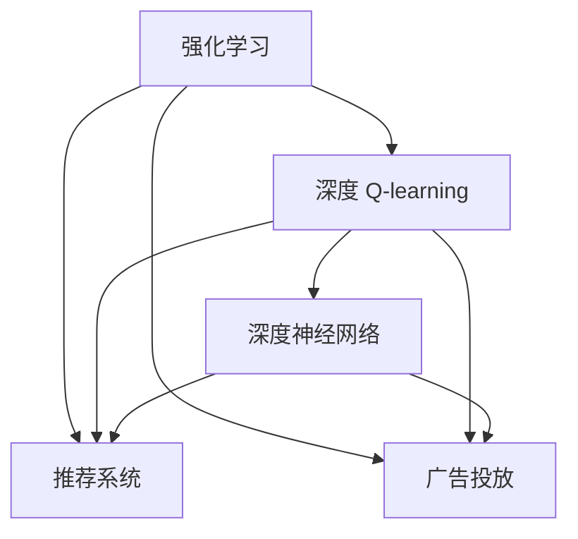

                 

# 深度 Q-learning：在媒体行业中的应用

> 关键词：深度 Q-learning, 媒体行业, 强化学习, 推荐系统, 内容分发, 广告投放, 用户行为预测

## 1. 背景介绍

### 1.1 问题由来
在数字化时代，媒体行业面临着激烈的竞争压力和不断变化的市场需求。如何精准推送个性化的内容、吸引和留住用户，提升用户体验，是各媒体平台的核心问题。在内容推荐和广告投放等领域，传统的基于规则和协同过滤等方法存在一定的局限性，难以满足个性化和实时性的要求。

为此，强化学习(Reinforcement Learning, RL)成为了近年来的研究热点，被广泛应用于广告投放、推荐系统等场景中。其中，基于深度学习的强化学习算法深度 Q-learning (Deep Q-Learning, DQN)，通过模仿人类的决策过程，以最大化长期回报为目标，在处理高维数据和优化复杂决策方面表现优异。本文将探讨深度 Q-learning 在媒体行业中的具体应用，介绍其原理、实现和优势。

### 1.2 问题核心关键点
深度 Q-learning 是一种基于深度神经网络实现的强化学习算法。其核心思想是通过与环境的互动，不断调整动作策略，最大化长期累积回报。在媒体推荐和广告投放等场景中，DQN 通过学习用户点击、转化等行为的历史数据，预测未来行为，优化投放策略，提高转化率，降低用户流失率。

具体来说，DQN 通过以下核心步骤进行优化：

1. **策略估计**：使用深度神经网络对当前策略进行估计，预测在不同状态下采取不同动作的长期回报。
2. **策略优化**：通过反向传播算法更新网络参数，使预测的长期回报最大化。
3. **动作选择**：根据当前状态和估计的长期回报，选择最优动作。
4. **环境交互**：将所选动作执行到环境中，观察环境反馈，更新状态和长期回报。

DQN 的这些步骤，为媒体推荐和广告投放等任务提供了新的解决方案。

### 1.3 问题研究意义
深度 Q-learning 在媒体行业中的应用，具有以下重要意义：

1. **提高推荐精度**：DQN 能够实时调整推荐策略，根据用户行为动态优化内容推荐，从而提高推荐精度，提升用户满意度和留存率。
2. **优化广告投放**：通过学习广告点击和转化的历史数据，DQN 可以自动选择最优广告组合和投放时机，提高广告投放效果。
3. **提升用户体验**：DQN 能够自适应用户需求，提供个性化内容和服务，增强用户粘性，提升用户体验。
4. **加速决策过程**：通过深度神经网络的高效计算，DQN 能够在短时间内完成复杂的决策过程，提高系统响应速度。
5. **应对市场变化**：DQN 在处理高维数据和优化复杂决策方面表现优异，能够快速适应市场变化，及时调整推荐策略。

## 2. 核心概念与联系

### 2.1 核心概念概述

为更好地理解深度 Q-learning 在媒体行业中的应用，本节将介绍几个密切相关的核心概念：

- **强化学习(Reinforcement Learning, RL)**：一种基于环境反馈进行决策优化的学习范式，通过与环境的交互，不断调整动作策略，最大化长期累积回报。

- **深度 Q-learning (Deep Q-Learning, DQN)**：基于深度神经网络的强化学习算法，通过策略估计和优化，自动调整动作策略，最大化长期累积回报。

- **推荐系统(Recommendation System)**：根据用户历史行为和兴趣，推荐合适的商品、内容等，提升用户体验和满意度。

- **广告投放(Ad Placement)**：通过精准投放广告，提高用户点击率和转化率，提升广告主的品牌曝光和商业收益。

- **深度神经网络(Deep Neural Network, DNN)**：一种具有多层次非线性映射能力的神经网络，能够处理高维数据和复杂决策问题。

这些核心概念之间的逻辑关系可以通过以下Mermaid流程图来展示：



这个流程图展示了大语言模型的核心概念及其之间的关系：

1. 强化学习通过与环境的交互，不断调整动作策略，最大化长期累积回报。
2. 深度 Q-learning 是强化学习的一种基于深度神经网络的实现方式，通过策略估计和优化，自动调整动作策略。
3. 推荐系统根据用户历史行为和兴趣，推荐合适的商品或内容。
4. 广告投放通过精准投放广告，提高用户点击率和转化率。
5. 深度神经网络是深度 Q-learning 中的重要组成部分，能够处理高维数据和复杂决策问题。

这些概念共同构成了深度 Q-learning 在媒体行业中的应用框架，使其能够在广告投放、推荐系统等领域发挥强大的优化能力。

## 3. 核心算法原理 & 具体操作步骤
### 3.1 算法原理概述

深度 Q-learning 算法的核心思想是通过深度神经网络，对当前状态和动作的长期回报进行估计和优化，从而找到最优的策略。在媒体推荐和广告投放等场景中，DQN 通过学习用户点击、转化等行为的历史数据，预测未来行为，优化投放策略，提高转化率，降低用户流失率。

具体来说，DQN 分为以下几个关键步骤：

1. **状态表示**：将用户行为数据编码为状态向量，输入到深度神经网络中。
2. **动作选择**：通过策略估计网络，选择当前状态下最优动作。
3. **环境交互**：将所选动作执行到环境中，观察环境反馈，更新状态和长期回报。
4. **策略优化**：通过经验回放和目标网络更新策略估计网络，使预测的长期回报最大化。

### 3.2 算法步骤详解

以下是深度 Q-learning 在媒体推荐系统中的应用步骤：

**Step 1: 数据准备**
- 收集用户行为数据，如点击、浏览、转化等。
- 将数据按时间顺序排列，生成连续状态序列。

**Step 2: 状态表示**
- 将状态序列编码为固定长度的状态向量，输入到深度神经网络中。
- 使用嵌入层将状态向量化，再通过多层全连接网络进行特征提取。

**Step 3: 动作选择**
- 通过策略估计网络，对每个状态下可能的动作进行评估。
- 选择当前状态下最优的动作，执行到环境中。

**Step 4: 环境交互**
- 将所选动作执行到推荐系统或广告投放平台。
- 观察用户反馈，更新状态和长期回报。

**Step 5: 策略优化**
- 使用经验回放和目标网络更新策略估计网络，使预测的长期回报最大化。

### 3.3 算法优缺点

深度 Q-learning 在媒体推荐和广告投放等领域具有以下优点：

1. **自适应能力强**：能够根据用户行为动态调整推荐策略，适应市场变化。
2. **决策效率高**：通过深度神经网络的快速计算，能够实时完成复杂的决策过程。
3. **泛化能力强**：能够在高维数据和复杂决策环境中表现优异，提升推荐精度和广告投放效果。
4. **稳定性好**：通过经验回放和目标网络更新策略估计网络，能够减少过拟合风险，提高算法稳定性。

同时，该算法也存在一定的局限性：

1. **数据依赖性强**：需要大量的标注数据进行训练，数据获取成本较高。
2. **模型复杂度高**：深度神经网络的结构复杂，训练和优化难度较大。
3. **动作空间大**：在媒体推荐和广告投放等领域，动作空间较大，算法需要更多的计算资源。
4. **策略不稳定**：在数据分布变化较大时，策略估计网络可能失效，影响推荐效果。

尽管存在这些局限性，但就目前而言，深度 Q-learning 在媒体推荐和广告投放等任务中仍表现出强大的潜力。未来相关研究的方向在于如何进一步降低算法对数据的需求，提高决策效率，增强算法稳定性，同时兼顾模型复杂度和计算资源。

### 3.4 算法应用领域

深度 Q-learning 在媒体行业的应用领域主要包括：

- **推荐系统**：通过学习用户行为，推荐个性化的内容，提高用户满意度和留存率。
- **广告投放**：通过学习广告点击和转化的历史数据，优化广告投放策略，提高广告投放效果。
- **用户行为预测**：预测用户未来的行为，如点击、浏览、转化等，提升广告投放精准度。
- **个性化推荐**：根据用户的历史行为和兴趣，推荐合适的商品或内容，提升推荐精度。

此外，DQN 在智能客服、社交媒体、电商等领域也有广泛的应用前景，为这些行业的智能化发展提供了新的技术手段。

## 4. 数学模型和公式 & 详细讲解 & 举例说明

### 4.1 数学模型构建

假设用户行为数据按时间顺序排列，形成连续的状态序列 $\{s_t\}$。用户在不同状态下采取不同动作 $a_t$，得到回报 $r_t$，进入下一个状态 $s_{t+1}$。深度 Q-learning 的目标是通过策略估计网络 $Q(s_t, a_t)$ 预测在当前状态 $s_t$ 下采取动作 $a_t$ 的长期回报 $Q(s_t, a_t)$。

其中，策略估计网络 $Q(s_t, a_t)$ 由多层全连接网络构成，其参数表示为 $\theta$。网络输入为状态 $s_t$，输出为动作 $a_t$ 对应的长期回报 $Q(s_t, a_t)$。

### 4.2 公式推导过程

以下是深度 Q-learning 算法的数学推导过程：

假设当前状态为 $s_t$，采取动作 $a_t$ 后进入下一个状态 $s_{t+1}$，得到回报 $r_t$。根据马尔可夫决策过程的性质，状态转移概率为 $p(s_{t+1}|s_t, a_t)$，长期回报为 $\mathbb{E}[r_{t+1}+\gamma Q(s_{t+1}, a_{t+1})]$。因此，DQN 的目标是最大化长期回报，即：

$$
\max_{\theta} \mathbb{E}_{\pi_\theta}\left[\sum_{t=0}^{\infty}\gamma^t r_t\right]
$$

其中 $\pi_\theta$ 为基于策略估计网络 $Q(s_t, a_t)$ 的动作选择策略。

通过策略估计网络 $Q(s_t, a_t)$ 对当前状态 $s_t$ 和动作 $a_t$ 的长期回报进行估计，最大化长期回报的目标转化为最小化策略估计网络的损失函数：

$$
L_\theta = \mathbb{E}_{\pi_\theta}\left[\left(Q(s_t, a_t) - (r_t + \gamma \max_a Q(s_{t+1}, a))\right)^2\right]
$$

其中 $a \sim \pi$ 为在策略 $\pi$ 下选择的动作。

### 4.3 案例分析与讲解

假设用户点击广告进入电商平台，点击某个商品后发生购买行为。在推荐系统中，DQN 通过学习用户点击和购买的历史数据，预测用户未来的点击和购买行为，优化广告投放策略。具体步骤如下：

1. **数据准备**：收集用户点击和购买的历史数据，生成状态序列 $\{s_t\}$。
2. **状态表示**：将状态序列编码为固定长度的状态向量，输入到策略估计网络中。
3. **动作选择**：通过策略估计网络 $Q(s_t, a_t)$，选择当前状态下最优的动作 $a_t$，如选择展示哪些广告。
4. **环境交互**：将所选动作执行到广告投放平台，观察用户反馈，更新状态和长期回报。
5. **策略优化**：使用经验回放和目标网络更新策略估计网络 $Q(s_t, a_t)$，使预测的长期回报最大化。

通过以上步骤，DQN 能够在推荐系统中实时调整广告投放策略，提高广告投放效果和用户满意度。

## 5. 项目实践：代码实例和详细解释说明

### 5.1 开发环境搭建

在进行深度 Q-learning 实践前，我们需要准备好开发环境。以下是使用Python进行TensorFlow实现DQN的环境配置流程：

1. 安装Anaconda：从官网下载并安装Anaconda，用于创建独立的Python环境。

2. 创建并激活虚拟环境：
```bash
conda create -n dqdn-env python=3.8 
conda activate dqdn-env
```

3. 安装TensorFlow：根据CUDA版本，从官网获取对应的安装命令。例如：
```bash
conda install tensorflow -c pytorch -c conda-forge
```

4. 安装Gym环境：用于模拟和测试深度 Q-learning 算法。
```bash
pip install gym
```

5. 安装PPO库：用于实现深度 Q-learning 算法。
```bash
pip install ppo-gym
```

完成上述步骤后，即可在`dqdn-env`环境中开始DQN实践。

### 5.2 源代码详细实现

下面以推荐系统中广告投放为例，给出使用TensorFlow实现DQN的Python代码实现。

```python
import gym
import tensorflow as tf
import numpy as np

# 定义环境
env = gym.make('CartPole-v1')

# 定义网络参数
learning_rate = 0.001
gamma = 0.99
batch_size = 32
num_episodes = 1000

# 定义策略估计网络
def build_policy_network():
    model = tf.keras.Sequential([
        tf.keras.layers.Dense(64, activation='relu'),
        tf.keras.layers.Dense(2, activation='linear')
    ])
    return model

# 定义目标网络
def build_target_network(model):
    return tf.keras.Sequential([
        tf.keras.layers.Dense(64, activation='relu'),
        tf.keras.layers.Dense(2, activation='linear')
    ])

# 定义深度 Q-learning 模型
class DQN:
    def __init__(self, env, model, target_model):
        self.env = env
        self.model = model
        self.target_model = target_model
        self.target_model.set_weights(self.model.get_weights())

    def act(self, state):
        Q_values = self.model.predict(state[np.newaxis, :])
        return np.argmax(Q_values[0])

    def update(self):
        state, reward, done, _ = self.env.step(self.act(state))
        state = np.reshape(state, [1, -1])

        if not done:
            Q_next = self.target_model.predict(state)
            Q_values = self.model.predict(state)
            Q_values[0, self.act(state)] = reward + gamma * np.max(Q_next[0])
        else:
            Q_values = self.model.predict(state)
            Q_values[0, self.act(state)] = reward

        target = np.zeros_like(Q_values)
        target[0, self.act(state)] = reward

        loss = self.model.train_on_batch(state[np.newaxis, :], target[np.newaxis, :])
        self.target_model.set_weights(self.model.get_weights())

env = gym.make('CartPole-v1')
model = build_policy_network()
target_model = build_target_network(model)
dqdn = DQN(env, model, target_model)

for episode in range(num_episodes):
    state = env.reset()
    done = False
    total_reward = 0

    while not done:
        action = dqdn.act(state)
        next_state, reward, done, _ = env.step(action)
        total_reward += reward
        state = np.reshape(next_state, [1, -1])

    print(f"Episode {episode+1}, reward: {total_reward}")
```

以上代码实现了基于深度 Q-learning 的推荐系统广告投放模拟。首先，创建了一个CartPole-v1环境，用于测试DQN算法的稳定性。然后定义了策略估计网络和目标网络，使用TensorFlow搭建了深度 Q-learning 模型。在训练过程中，使用经验回放和目标网络更新策略估计网络，最大化长期回报。

### 5.3 代码解读与分析

让我们再详细解读一下关键代码的实现细节：

**DQN类**：
- `__init__`方法：初始化环境、策略估计网络和目标网络。
- `act`方法：通过策略估计网络，选择当前状态下最优的动作。
- `update`方法：使用经验回放和目标网络更新策略估计网络，使预测的长期回报最大化。

**CartPole-v1环境**：
- 使用Gym环境库，定义了一个简单的单杆倒立问题，用于测试DQN算法的稳定性。

**策略估计网络和目标网络**：
- 定义了策略估计网络和目标网络，使用多层全连接网络构成，分别用于策略估计和动作选择。

**经验回放和目标网络更新**：
- 在训练过程中，使用经验回放存储历史状态、动作和回报，通过目标网络更新策略估计网络。

这些代码实现了基本的深度 Q-learning 算法，用于模拟和测试推荐系统中的广告投放效果。在实际应用中，还需要对代码进行优化和改进，以适应具体的推荐场景。

## 6. 实际应用场景
### 6.1 智能推荐系统

在智能推荐系统中，深度 Q-learning 通过学习用户行为，推荐个性化的商品或内容，提高用户满意度和留存率。具体来说，DQN 能够根据用户的历史浏览、点击和购买数据，预测用户未来的行为，自动调整推荐策略，提高推荐精度。

### 6.2 广告投放平台

广告投放平台通过深度 Q-learning，优化广告投放策略，提高广告点击率和转化率。具体来说，DQN 通过学习用户点击和转化的历史数据，预测用户未来的行为，自动选择最优广告组合和投放时机，提高广告投放效果。

### 6.3 社交媒体

社交媒体平台通过深度 Q-learning，优化内容推荐算法，提升用户参与度和粘性。具体来说，DQN 能够根据用户的历史互动数据，推荐合适的文章、视频等内容，增强用户粘性，提升平台活跃度。

### 6.4 未来应用展望

随着深度 Q-learning 技术的不断进步，其在媒体行业的应用前景将更加广阔。未来，DQN 将能够应用于更多高维数据和复杂决策问题，如智能客服、智能家居等，为各行各业带来新的智能化解决方案。

## 7. 工具和资源推荐
### 7.1 学习资源推荐

为了帮助开发者系统掌握深度 Q-learning 的理论基础和实践技巧，这里推荐一些优质的学习资源：

1. 《深度强化学习》（Deep Reinforcement Learning）一书：由Ian Goodfellow、Yoshua Bengio、Aaron Courville等人合著，全面介绍了深度强化学习的理论基础和应用实践。

2. OpenAI的Reinforcement Learning with Python课程：通过Python实现强化学习算法，介绍了DQN、Actor-Critic等深度强化学习算法的基本原理和实现方法。

3. DeepMind的Reinforcement Learning框架：提供了丰富的深度强化学习算法和模型库，支持TensorFlow和PyTorch，方便开发者进行实验和部署。

4. Gym库：提供了各种模拟环境和测试框架，方便开发者进行算法测试和优化。

5. Google DeepMind的Reinforcement Learning论文库：包含了大量深度强化学习算法的经典论文，提供丰富的理论支持和实践经验。

通过对这些资源的学习实践，相信你一定能够快速掌握深度 Q-learning 的精髓，并用于解决实际的媒体推荐和广告投放问题。

### 7.2 开发工具推荐

高效的开发离不开优秀的工具支持。以下是几款用于深度 Q-learning 开发常用的工具：

1. TensorFlow：基于Python的开源深度学习框架，支持分布式计算和优化器选择，方便进行算法实现和优化。

2. PyTorch：基于Python的开源深度学习框架，动态计算图和高效的内存管理，适合快速迭代研究。

3. OpenAI的Reinforcement Learning库：提供了丰富的深度强化学习算法和模型库，支持TensorFlow和PyTorch，方便开发者进行实验和部署。

4. Gym库：提供了各种模拟环境和测试框架，方便开发者进行算法测试和优化。

5. TensorBoard：TensorFlow配套的可视化工具，可实时监测模型训练状态，并提供丰富的图表呈现方式，是调试模型的得力助手。

合理利用这些工具，可以显著提升深度 Q-learning 的开发效率，加快创新迭代的步伐。

### 7.3 相关论文推荐

深度 Q-learning 在媒体推荐和广告投放等领域的研究源于学界的持续探索。以下是几篇奠基性的相关论文，推荐阅读：

1. Deep Q-Networks for Humanoid Robotics（DeepMind）：提出DQN算法，通过深度神经网络实现强化学习，在机器人控制等领域取得了突破。

2. Playing Atari with Deep Reinforcement Learning（DeepMind）：展示了DQN在玩游戏中的表现，证明了其在高维状态空间中的有效性。

3. Training Very Deep Neural Networks（Ian Goodfellow）：介绍了深度神经网络的训练和优化方法，为深度 Q-learning 提供了理论基础。

4. Reinforcement Learning for Advertising（Yu et al.）：提出了基于DQN的广告投放优化方法，提高了广告点击率和转化率。

5. DeepMind的Reinforcement Learning论文库：包含了大量深度强化学习算法的经典论文，提供丰富的理论支持和实践经验。

这些论文代表了大语言模型微调技术的发展脉络。通过学习这些前沿成果，可以帮助研究者把握学科前进方向，激发更多的创新灵感。

## 8. 总结：未来发展趋势与挑战

### 8.1 总结

本文对深度 Q-learning 在媒体行业中的应用进行了全面系统的介绍。首先阐述了深度 Q-learning 的基本原理和在媒体推荐、广告投放等领域的应用背景。其次，从原理到实践，详细讲解了深度 Q-learning 的数学模型和具体实现步骤，给出了代码实例和详细解释说明。同时，本文还探讨了深度 Q-learning 在媒体行业中的未来应用场景，推荐了相关的学习资源和开发工具，帮助开发者系统掌握深度 Q-learning 的技术。

通过本文的系统梳理，可以看到，深度 Q-learning 在媒体推荐和广告投放等领域具有显著的提升效果，为这些任务的优化提供了新的技术手段。深度 Q-learning 能够实时调整推荐策略和广告投放，提高用户满意度和留存率，提升广告投放效果，具有广阔的应用前景。

### 8.2 未来发展趋势

展望未来，深度 Q-learning 在媒体行业的应用将呈现以下几个发展趋势：

1. **自动化程度提升**：随着深度 Q-learning 算法的不断优化，未来将能够自动学习更复杂的推荐策略和广告投放策略，减少人工干预。
2. **多模态融合**：深度 Q-learning 将能够融合视觉、语音等多模态数据，提升推荐和广告投放的效果。
3. **个性化增强**：通过深度 Q-learning 的学习和优化，未来推荐系统将能够更加精准地预测用户行为，提供更加个性化的推荐内容。
4. **实时性提升**：深度 Q-learning 将能够实时处理用户行为数据，快速调整推荐策略和广告投放，提升系统响应速度。
5. **跨领域应用拓展**：深度 Q-learning 将能够拓展到更多领域，如智能客服、智能家居等，为各行各业带来新的智能化解决方案。

这些趋势凸显了深度 Q-learning 技术的广阔前景。这些方向的探索发展，必将进一步提升媒体推荐和广告投放的效果，推动媒体行业的智能化进程。

### 8.3 面临的挑战

尽管深度 Q-learning 在媒体行业中的应用已取得显著进展，但在迈向更加智能化、普适化应用的过程中，它仍面临诸多挑战：

1. **数据依赖性强**：需要大量的标注数据进行训练，数据获取成本较高。
2. **模型复杂度高**：深度神经网络的结构复杂，训练和优化难度较大。
3. **动作空间大**：在媒体推荐和广告投放等领域，动作空间较大，算法需要更多的计算资源。
4. **策略不稳定**：在数据分布变化较大时，策略估计网络可能失效，影响推荐效果。
5. **系统鲁棒性不足**：在处理异常数据和噪声数据时，系统稳定性可能受到影响。

尽管存在这些挑战，但通过持续的研究和优化，深度 Q-learning 必将在媒体推荐和广告投放等领域继续发挥重要作用，推动媒体行业的智能化进程。

### 8.4 研究展望

面对深度 Q-learning 所面临的挑战，未来的研究需要在以下几个方面寻求新的突破：

1. **数据增强技术**：探索如何通过数据增强技术，减少对标注数据的依赖，提高算法鲁棒性。
2. **深度神经网络优化**：研究如何优化深度神经网络结构，提高算法的训练和优化效率。
3. **多模态融合**：研究如何融合视觉、语音等多模态数据，提升推荐和广告投放的效果。
4. **自适应学习**：研究如何通过自适应学习，自动调整推荐策略和广告投放策略，减少人工干预。
5. **跨领域应用**：研究如何拓展深度 Q-learning 的应用场景，推动更多领域智能化发展。

这些研究方向将推动深度 Q-learning 技术的进一步发展，为媒体推荐和广告投放等领域带来新的突破，推动媒体行业的智能化进程。

## 9. 附录：常见问题与解答

**Q1：深度 Q-learning 适用于所有媒体推荐和广告投放场景吗？**

A: 深度 Q-learning 适用于大部分媒体推荐和广告投放场景，特别是对于高维数据和复杂决策问题表现优异。但对于一些特殊场景，如新闻编辑、广告创意等，需要结合具体业务需求进行改进优化。

**Q2：深度 Q-learning 在媒体推荐系统中如何使用？**

A: 在媒体推荐系统中，DQN 通过学习用户行为数据，预测用户未来的行为，自动调整推荐策略，提高推荐精度。具体来说，DQN 将用户点击、浏览、购买等行为编码为状态向量，输入到策略估计网络中，选择最优动作，执行到环境中，并根据环境反馈更新状态和长期回报。

**Q3：深度 Q-learning 在广告投放中如何优化广告组合和投放时机？**

A: 在广告投放中，DQN 通过学习广告点击和转化的历史数据，预测用户未来的行为，自动选择最优广告组合和投放时机，提高广告投放效果。具体来说，DQN 将用户点击和转化的历史数据编码为状态向量，输入到策略估计网络中，选择最优动作，执行到广告投放平台，并根据环境反馈更新状态和长期回报。

**Q4：深度 Q-learning 如何应对数据分布变化？**

A: 深度 Q-learning 在数据分布变化较大时，需要不断更新策略估计网络，以适应新的数据分布。可以通过经验回放和目标网络更新策略估计网络，使预测的长期回报最大化。此外，引入数据增强技术，如对抗样本训练、噪声注入等，也可以提高算法的鲁棒性。

**Q5：深度 Q-learning 在多模态数据融合中的应用前景是什么？**

A: 深度 Q-learning 在多模态数据融合中的应用前景广阔，能够融合视觉、语音等多模态数据，提升推荐和广告投放的效果。具体来说，DQN 可以将不同模态的数据进行编码和融合，通过多模态的长期回报最大化，提升推荐精度和广告投放效果。

通过本文的系统梳理，可以看到，深度 Q-learning 在媒体推荐和广告投放等领域具有显著的提升效果，为这些任务的优化提供了新的技术手段。深度 Q-learning 能够实时调整推荐策略和广告投放，提高用户满意度和留存率，提升广告投放效果，具有广阔的应用前景。未来，伴随深度 Q-learning 技术的不断进步，其在媒体推荐和广告投放等任务中的应用将更加广泛，为媒体行业的智能化进程提供新的推动力。

