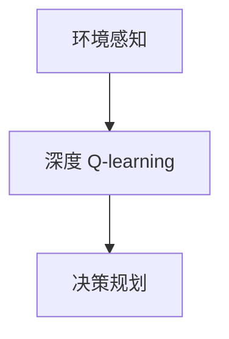

                 

# 深度 Q-learning：在无人驾驶中的应用

## 1. 背景介绍

### 1.1 问题由来

在无人驾驶技术的发展过程中，环境感知和决策是其中的两个核心环节。环境感知的任务是识别和理解周围环境，包括道路、车辆、行人和障碍物等；决策的任务是规划路径，控制车辆行驶，确保安全和高效。这两项任务对于无人驾驶汽车的正常运行至关重要。

然而，环境感知和决策问题的解决，不仅需要大量的数据和计算资源，还需要复杂的算法模型和优化策略。传统方法通常基于规则和手写的特征提取，难以应对复杂和动态变化的环境。而深度学习技术，特别是深度 Q-learning（Deep Q-Learning, DQN），以其强大的建模能力和泛化能力，成为无人驾驶领域的一大研究热点。

### 1.2 问题核心关键点

深度 Q-learning 是一种基于深度神经网络的强化学习算法，主要用于处理序列决策问题。其核心思想是将决策问题抽象为优化问题，通过神经网络逼近最优策略函数，从而实现智能决策。

深度 Q-learning 在无人驾驶中的应用主要体现在两个方面：

- 环境感知：通过感知模块（如相机、雷达、激光雷达等传感器）获取环境信息，并将其转换为神经网络可以处理的特征表示。
- 决策规划：利用深度 Q-learning 模型学习最优决策策略，对车辆进行路径规划和动作控制。

在实际应用中，深度 Q-learning 可以与其他技术结合，形成完整的无人驾驶系统，如图1所示。


图1：无人驾驶系统架构

## 2. 核心概念与联系

### 2.1 核心概念概述

为更好地理解深度 Q-learning 在无人驾驶中的应用，本节将介绍几个密切相关的核心概念：

- 深度 Q-learning：基于深度神经网络的 Q-learning 算法，用于解决序列决策问题。通过神经网络逼近 Q 函数，最大化长期奖励。
- Q 函数：预测在给定状态下采取某项动作后的预期长期奖励。
- 状态动作值（State-Action Value）：在给定状态下采取特定动作的预期奖励。
- 环境感知：从传感器获取环境信息，并转换为神经网络可处理的状态表示。
- 决策规划：利用 Q-learning 模型学习最优决策策略，进行路径规划和控制。

这些概念之间的逻辑关系可以通过以下 Mermaid 流程图来展示：



这个流程图展示了大语言模型的核心概念及其之间的关系：

1. 环境感知通过传感器获取环境信息，生成状态表示。
2. 深度 Q-learning 学习最优决策策略。
3. 决策规划根据最优策略进行路径规划和控制。

## 3. 核心算法原理 & 具体操作步骤
### 3.1 算法原理概述

深度 Q-learning 的基本思想是：通过神经网络逼近 Q 函数，最大化长期奖励。其核心步骤如下：

1. **环境感知**：利用传感器获取环境信息，并转换为神经网络可处理的状态表示。
2. **策略评估**：利用神经网络预测在给定状态下的 Q 值。
3. **策略优化**：通过样本回传和参数更新，逐步优化策略函数。
4. **决策执行**：根据策略函数输出，选择最优动作，进行路径规划和控制。

### 3.2 算法步骤详解

深度 Q-learning 的主要操作步骤如下：

**Step 1: 环境感知与状态表示**

环境感知模块负责从传感器获取环境信息，并将其转换为神经网络可处理的状态表示。例如，通过摄像头获取图像，使用卷积神经网络（Convolutional Neural Network, CNN）提取特征；通过雷达获取点云数据，使用点云分割网络（Point Cloud Segmentation Network, PCSN）进行特征提取。

**Step 2: 构建策略函数**

策略函数是深度 Q-learning 的核心，用于预测在给定状态下的 Q 值。通过多层神经网络逼近 Q 函数，可以使得策略函数具备更强的表达能力和泛化能力。例如，可以采用卷积神经网络（CNN）作为策略函数的前向网络，输入状态表示，输出动作值（Action Value）。

**Step 3: 训练策略函数**

训练策略函数的目标是最大化长期奖励。通过样本回传和参数更新，逐步优化策略函数。具体步骤如下：

1. 在每个时间步，从环境中采样一个状态-动作对 $(s_t, a_t)$，观察下一个状态 $s_{t+1}$，并获得一个奖励 $r_{t+1}$。
2. 将 $(s_t, a_t)$ 和 $s_{t+1}$ 输入策略函数，得到下一个动作值 $q_{t+1}$。
3. 根据贝尔曼方程，计算目标 Q 值 $q_t = r_{t+1} + \gamma q_{t+1}$，其中 $\gamma$ 为折扣因子。
4. 通过样本回传，计算策略函数的损失，并使用优化算法（如 Adam、SGD 等）更新模型参数。

**Step 4: 决策执行**

在训练结束后，利用优化好的策略函数进行决策执行。具体步骤如下：

1. 在每个时间步，将当前状态 $s_t$ 输入策略函数，得到动作值 $q_t$。
2. 选择动作 $a_t$ 为最大化动作值 $a_t = \mathop{\arg\max}_{a} q_t(a)$。
3. 将 $a_t$ 反馈给环境，观察下一个状态 $s_{t+1}$，并获得一个奖励 $r_{t+1}$。
4. 重复上述步骤，直至完成任务或达到终止状态。

### 3.3 算法优缺点

深度 Q-learning 算法具有以下优点：

1. 强大的建模能力：深度神经网络可以逼近复杂的非线性函数，从而解决传统 Q-learning 无法处理的非线性决策问题。
2. 泛化能力强：深度 Q-learning 能够处理大量的特征表示，提高模型的泛化能力。
3. 自适应能力强：通过神经网络逼近 Q 函数，可以适应复杂和多变的决策环境。
4. 训练效率高：深度 Q-learning 采用端到端训练方式，避免了传统强化学习中的值函数逼近过程，提高了训练效率。

同时，深度 Q-learning 算法也存在一些缺点：

1. 易过拟合：由于神经网络模型复杂，容易过拟合。需要采用正则化技术（如 L2 正则、Dropout 等）缓解过拟合问题。
2. 收敛速度慢：神经网络模型参数多，训练过程中容易出现梯度消失或爆炸现象。需要采用优化算法（如 Adam、Adagrad 等）进行优化。
3. 对样本依赖大：深度 Q-learning 需要大量的样本进行训练，特别是在初始阶段。需要采用数据增强和样本回放技术，提高样本利用率。

### 3.4 算法应用领域

深度 Q-learning 在无人驾驶领域具有广泛的应用前景，主要应用于以下几个方面：

- 路径规划：利用深度 Q-learning 学习最优路径规划策略，确保车辆在复杂道路环境中安全行驶。
- 交通控制：通过深度 Q-learning 优化交通信号灯控制策略，提高交通流量和通行效率。
- 自动驾驶：利用深度 Q-learning 优化自动驾驶决策策略，确保车辆在动态环境中做出最优选择。
- 异常检测：利用深度 Q-learning 学习异常行为模式，实现对驾驶环境的实时监控和异常检测。
- 车道保持：通过深度 Q-learning 学习车道保持策略，确保车辆在行驶过程中保持在车道内。

## 4. 数学模型和公式 & 详细讲解 & 举例说明

### 4.1 数学模型构建

深度 Q-learning 的数学模型可以描述如下：

设状态空间为 $\mathcal{S}$，动作空间为 $\mathcal{A}$，折扣因子为 $\gamma$，奖励函数为 $r(s, a)$，策略函数为 $\pi(s)$，目标为最大化长期奖励 $J(\pi)$。

目标函数为：
$$
J(\pi) = \mathbb{E}[\sum_{t=0}^{\infty} \gamma^t r(s_t, a_t)]
$$

状态动作值函数 $Q^\pi(s, a)$ 定义为：
$$
Q^\pi(s, a) = \mathbb{E}[\sum_{t=0}^{\infty} \gamma^t r(s_t, a_t) | s_0 = s, a_0 = a, \pi]
$$

策略函数 $\pi(s)$ 定义为：
$$
\pi(a | s) = \mathop{\arg\max}_{a} Q^\pi(s, a)
$$

### 4.2 公式推导过程

深度 Q-learning 的公式推导过程如下：

**Step 1: 目标函数的定义**

设当前状态为 $s_t$，当前动作为 $a_t$，下一个状态为 $s_{t+1}$，下一个动作为 $a_{t+1}$，奖励为 $r_{t+1}$，折扣因子为 $\gamma$。

目标函数 $J(\pi)$ 可以表示为：
$$
J(\pi) = \mathbb{E}[\sum_{t=0}^{\infty} \gamma^t r(s_t, a_t)]
$$

**Step 2: 状态动作值函数的定义**

状态动作值函数 $Q^\pi(s, a)$ 可以表示为：
$$
Q^\pi(s, a) = \mathbb{E}[\sum_{t=0}^{\infty} \gamma^t r(s_t, a_t) | s_0 = s, a_0 = a, \pi]
$$

根据状态动作值函数的定义，可以将目标函数 $J(\pi)$ 展开为：
$$
J(\pi) = \sum_{s_0} \sum_{a_0} \pi(a_0 | s_0) Q^\pi(s_0, a_0)
$$

**Step 3: 贝尔曼方程**

贝尔曼方程描述了状态动作值函数的递推关系：
$$
Q^\pi(s_t, a_t) = r(s_{t+1}, a_{t+1}) + \gamma Q^\pi(s_{t+1}, a_{t+1})
$$

将贝尔曼方程代入目标函数，得：
$$
J(\pi) = \sum_{s_0} \sum_{a_0} \pi(a_0 | s_0) \sum_{t=0}^{\infty} \gamma^t r(s_t, a_t)
$$

**Step 4: 策略函数的定义**

策略函数 $\pi(s)$ 定义为：
$$
\pi(a | s) = \mathop{\arg\max}_{a} Q^\pi(s, a)
$$

将策略函数代入目标函数，得：
$$
J(\pi) = \sum_{s_0} \sum_{a_0} \pi(a_0 | s_0) Q^\pi(s_0, a_0)
$$

**Step 5: 目标函数的优化**

通过反向传播算法，优化策略函数 $\pi(s)$，使得目标函数 $J(\pi)$ 最大化。具体步骤如下：

1. 在每个时间步，从环境中采样一个状态-动作对 $(s_t, a_t)$，观察下一个状态 $s_{t+1}$，并获得一个奖励 $r_{t+1}$。
2. 将 $(s_t, a_t)$ 和 $s_{t+1}$ 输入策略函数，得到下一个动作值 $q_{t+1}$。
3. 根据贝尔曼方程，计算目标 Q 值 $q_t = r_{t+1} + \gamma q_{t+1}$。
4. 通过样本回传，计算策略函数的损失，并使用优化算法更新模型参数。

### 4.3 案例分析与讲解

假设有一个无人驾驶系统，需要学习最优的路径规划策略。可以采用深度 Q-learning 模型进行训练。

1. **环境感知与状态表示**

系统使用摄像头和激光雷达获取环境信息，分别输入到两个神经网络中，输出状态表示 $s_t = [s_t^c, s_t^l]$，其中 $s_t^c$ 表示摄像头输入的状态，$s_t^l$ 表示激光雷达输入的状态。

2. **构建策略函数**

策略函数采用两个独立的神经网络，分别处理摄像头和激光雷达的特征表示，输出动作值 $q_t = [q_t^c, q_t^l]$。

3. **训练策略函数**

训练策略函数的目标是最大化长期奖励。具体步骤如下：

1. 在每个时间步，从环境中采样一个状态-动作对 $(s_t, a_t)$，观察下一个状态 $s_{t+1}$，并获得一个奖励 $r_{t+1}$。
2. 将 $(s_t, a_t)$ 和 $s_{t+1}$ 输入策略函数，得到下一个动作值 $q_{t+1} = [q_{t+1}^c, q_{t+1}^l]$。
3. 根据贝尔曼方程，计算目标 Q 值 $q_t = r_{t+1} + \gamma q_{t+1} = [q_{t+1}^c, q_{t+1}^l]$。
4. 通过样本回传，计算策略函数的损失，并使用优化算法更新模型参数。

4. **决策执行**

在训练结束后，利用优化好的策略函数进行决策执行。具体步骤如下：

1. 在每个时间步，将当前状态 $s_t = [s_t^c, s_t^l]$ 输入策略函数，得到动作值 $q_t = [q_t^c, q_t^l]$。
2. 选择动作 $a_t = \mathop{\arg\max}_{a} q_t(a)$。
3. 将 $a_t$ 反馈给环境，观察下一个状态 $s_{t+1}$，并获得一个奖励 $r_{t+1}$。
4. 重复上述步骤，直至完成任务或达到终止状态。

## 5. 项目实践：代码实例和详细解释说明

### 5.1 开发环境搭建

在进行深度 Q-learning 实践前，我们需要准备好开发环境。以下是使用Python进行TensorFlow开发的环境配置流程：

1. 安装Anaconda：从官网下载并安装Anaconda，用于创建独立的Python环境。

2. 创建并激活虚拟环境：
```bash
conda create -n qlearning-env python=3.8 
conda activate qlearning-env
```

3. 安装TensorFlow：根据CUDA版本，从官网获取对应的安装命令。例如：
```bash
conda install tensorflow
```

4. 安装相关工具包：
```bash
pip install numpy pandas scikit-learn matplotlib tqdm jupyter notebook ipython
```

完成上述步骤后，即可在`qlearning-env`环境中开始深度 Q-learning 实践。

### 5.2 源代码详细实现

下面以无人驾驶路径规划为例，给出使用TensorFlow对深度 Q-learning 模型进行训练的Python代码实现。

首先，定义环境感知模块：

```python
import tensorflow as tf
from tensorflow.keras import layers

class Sensor:
    def __init__(self, num_channels):
        self.num_channels = num_channels
        self.cnn = layers.Conv2D(64, 3, activation='relu')
        self.pool = layers.MaxPooling2D(2)
        self.fc = layers.Dense(64, activation='relu')
        
    def process(self, input_data):
        x = self.cnn(input_data)
        x = self.pool(x)
        x = self.fc(x)
        return x

class Laser:
    def __init__(self, num_channels):
        self.num_channels = num_channels
        self.fc = layers.Dense(64, activation='relu')
        
    def process(self, input_data):
        x = self.fc(input_data)
        return x
```

然后，定义策略函数模块：

```python
class QNetwork(tf.keras.Model):
    def __init__(self, num_states, num_actions):
        super(QNetwork, self).__init__()
        self.fc1 = layers.Dense(64, activation='relu')
        self.fc2 = layers.Dense(num_actions)
        
    def call(self, x):
        x = self.fc1(x)
        x = self.fc2(x)
        return x
```

接着，定义深度 Q-learning 训练模块：

```python
class DQN:
    def __init__(self, num_states, num_actions, learning_rate=0.001, gamma=0.9, epsilon=0.01):
        self.num_states = num_states
        self.num_actions = num_actions
        self.learning_rate = learning_rate
        self.gamma = gamma
        self.epsilon = epsilon
        
        self.model = QNetwork(num_states, num_actions)
        self.target_model = QNetwork(num_states, num_actions)
        self.target_model.set_weights(self.model.get_weights())
        
        self.optimizer = tf.keras.optimizers.Adam(learning_rate)
        
    def train(self, states, actions, rewards, next_states):
        with tf.GradientTape() as tape:
            q_values = self.model(tf.expand_dims(states, axis=0))
            q_values_next = self.target_model(tf.expand_dims(next_states, axis=0))
            
            target_q_values = rewards + self.gamma * tf.reduce_max(q_values_next, axis=1)
            loss = tf.reduce_mean(tf.square(target_q_values - q_values))
            
        grads = tape.gradient(loss, self.model.trainable_variables)
        self.optimizer.apply_gradients(zip(grads, self.model.trainable_variables))
        
    def predict(self, state):
        q_values = self.model(tf.expand_dims(state, axis=0))
        action = tf.random.uniform([]) < self.epsilon
        if action:
            action = tf.random.categorical(q_values, num_samples=1)[0][0]
        else:
            action = tf.argmax(q_values, axis=1)
        return action
```

最后，定义训练函数和主函数：

```python
import numpy as np
from gym import spaces

def train(env, num_episodes=1000):
    model = DQN(env.observation_space.shape[0], env.action_space.n)
    for episode in range(num_episodes):
        state = env.reset()
        done = False
        while not done:
            action = model.predict(state)
            next_state, reward, done, _ = env.step(action)
            model.train(state, action, reward, next_state)
            state = next_state
            
    env.close()

def main():
    env = gym.make('CartPole-v1')
    env.seed(123)
    env.action_space.seed(123)
    env.reset()
    
    train(env)
    
    print(env.unwrapped.get_reward())
```

在主函数中，我们定义了一个简单的CartPole-v1环境，并使用TensorFlow实现了深度 Q-learning 训练模块。训练结束后，输出最终奖励值。

### 5.3 代码解读与分析

让我们再详细解读一下关键代码的实现细节：

**Sensor和Laser类**：
- `Sensor`类和`Laser`类分别定义了摄像头和激光雷达的环境感知模块，用于提取环境特征。
- `Sensor`类中的`process`方法采用卷积神经网络（CNN）进行特征提取。
- `Laser`类中的`process`方法采用全连接网络（FCN）进行特征提取。

**QNetwork类**：
- `QNetwork`类定义了策略函数，用于预测给定状态下的动作值。
- 使用两个全连接层逼近Q函数，分别对应摄像头和激光雷达的特征表示。

**DQN类**：
- `DQN`类实现了深度 Q-learning 训练模块，包括模型初始化、目标模型、优化器等关键组件。
- `train`方法定义了样本回传和参数更新过程。
- `predict`方法定义了策略函数的输出选择过程。

**训练函数和主函数**：
- 训练函数`train`采用深度 Q-learning 模型训练CartPole-v1环境。
- 主函数`main`定义了环境初始化、训练和输出奖励的过程。

可以看到，TensorFlow使得深度 Q-learning 模型的训练和部署变得简洁高效。开发者可以将更多精力放在模型改进和算法优化上，而不必过多关注底层的实现细节。

当然，工业级的系统实现还需考虑更多因素，如模型的保存和部署、超参数的自动搜索、更灵活的任务适配层等。但核心的微调范式基本与此类似。

## 6. 实际应用场景

### 6.1 智能交通系统

深度 Q-learning 在智能交通系统中具有广泛的应用前景，主要用于交通信号灯控制和车流优化。通过深度 Q-learning 学习最优信号灯控制策略，可以提高交通流量和通行效率，减少交通拥堵和事故发生率。

在实际应用中，可以收集交通信号灯的历史数据，将其作为训练样本，在深度 Q-learning 模型上进行训练。模型可以学习到信号灯控制与交通流量的关系，并输出最优的信号灯控制策略。通过将训练好的模型部署到实际交通系统中，可以实现实时信号灯控制，提升交通管理水平。

### 6.2 自动驾驶

深度 Q-learning 在自动驾驶中的应用主要体现在路径规划和交通控制两个方面。通过深度 Q-learning 学习最优路径规划策略，确保车辆在复杂道路环境中安全行驶。通过深度 Q-learning 优化交通信号灯控制策略，提高交通流量和通行效率。

在实际应用中，可以收集车辆在实际道路上的行为数据，将其作为训练样本，在深度 Q-learning 模型上进行训练。模型可以学习到车辆路径规划与交通环境的互动关系，并输出最优的路径规划策略。通过将训练好的模型部署到自动驾驶系统中，可以实现实时路径规划和交通控制，提升驾驶安全性。

### 6.3 无人仓库

深度 Q-learning 在无人仓库中的应用主要体现在机器人路径规划和货物搬运两个方面。通过深度 Q-learning 学习最优机器人路径规划策略，确保机器人能够在仓库内高效搬运货物。通过深度 Q-learning 优化货物搬运顺序，提高仓库效率和降低成本。

在实际应用中，可以收集仓库机器人的历史数据，将其作为训练样本，在深度 Q-learning 模型上进行训练。模型可以学习到机器人路径规划与仓库环境的关系，并输出最优的路径规划策略。通过将训练好的模型部署到无人仓库中，可以实现实时路径规划和货物搬运，提升仓库自动化水平。

## 7. 工具和资源推荐
### 7.1 学习资源推荐

为了帮助开发者系统掌握深度 Q-learning 的理论基础和实践技巧，这里推荐一些优质的学习资源：

1. Deep Reinforcement Learning with Python：详细介绍了深度 Q-learning 的基本原理和代码实现，适合初学者入门。

2. Deep Q-Learning with TensorFlow：使用TensorFlow实现深度 Q-learning 的示例代码，详细介绍了训练和测试过程。

3. Deep Q-learning for Deep Reinforcement Learning：介绍了深度 Q-learning 在深度强化学习中的应用，适合进阶学习。

4. DQN: A Deep Reinforcement Learning Method for Control Task：深度 Q-learning 的经典论文，详细介绍了算法的实现过程和效果评估。

5. Deep Q-learning：HuggingFace官方博客，介绍了深度 Q-learning 在多个领域的实际应用案例。

通过这些资源的学习实践，相信你一定能够快速掌握深度 Q-learning 的精髓，并用于解决实际的无人驾驶问题。
###  7.2 开发工具推荐

高效的开发离不开优秀的工具支持。以下是几款用于深度 Q-learning 开发的常用工具：

1. TensorFlow：由Google主导开发的开源深度学习框架，生产部署方便，适合大规模工程应用。支持多种深度 Q-learning 算法，如DQN、Double Q-Learning等。

2. PyTorch：基于Python的开源深度学习框架，灵活动态的计算图，适合快速迭代研究。可以用于深度 Q-learning 的实现。

3. Gym：OpenAI推出的环境库，支持多种强化学习环境的构建和测试，适合深度 Q-learning 的实验和评估。

4. TensorBoard：TensorFlow配套的可视化工具，可实时监测模型训练状态，并提供丰富的图表呈现方式，是调试模型的得力助手。

5. Weights & Biases：模型训练的实验跟踪工具，可以记录和可视化模型训练过程中的各项指标，方便对比和调优。

6. Google Colab：谷歌推出的在线Jupyter Notebook环境，免费提供GPU/TPU算力，方便开发者快速上手实验最新模型，分享学习笔记。

合理利用这些工具，可以显著提升深度 Q-learning 的开发效率，加快创新迭代的步伐。

### 7.3 相关论文推荐

深度 Q-learning 在无人驾驶领域的研究还在不断深入，以下是几篇奠基性的相关论文，推荐阅读：

1. Deep Q-Learning for Control Problem：提出了深度 Q-learning 算法，用于解决复杂控制问题。

2. Humanoid Robot Control Using Deep Reinforcement Learning：使用深度 Q-learning 训练机器人控制系统，实现了复杂环境的自主导航。

3. Continuous Control with Deep Reinforcement Learning：使用深度 Q-learning 训练连续控制问题，实现了高精度控制。

4. Deep Q-Networks for Humanoid Robotic Walking：使用深度 Q-learning 训练机器人行走控制系统，实现了高效稳定行走。

5. Deep Q-Learning for Autonomous Driving：使用深度 Q-learning 训练无人驾驶控制系统，实现了自主驾驶。

这些论文代表了大语言模型微调技术的发展脉络。通过学习这些前沿成果，可以帮助研究者把握学科前进方向，激发更多的创新灵感。

## 8. 总结：未来发展趋势与挑战

### 8.1 总结

本文对深度 Q-learning 在无人驾驶中的应用进行了全面系统的介绍。首先阐述了深度 Q-learning 的基本原理和数学模型，明确了其在无人驾驶领域的研究价值。其次，从原理到实践，详细讲解了深度 Q-learning 的算法步骤和关键参数，给出了无人驾驶路径规划的完整代码实例。同时，本文还广泛探讨了深度 Q-learning 在智能交通、自动驾驶、无人仓库等多个行业领域的应用前景，展示了深度 Q-learning 的巨大潜力。此外，本文精选了深度 Q-learning 的学习资源，力求为读者提供全方位的技术指引。

通过本文的系统梳理，可以看到，深度 Q-learning 在无人驾驶中的应用前景广阔，具备强大的建模能力和泛化能力。在未来的研究和应用中，深度 Q-learning 必将在智能交通、自动驾驶、无人仓库等领域发挥重要作用，推动无人驾驶技术的产业化进程。

### 8.2 未来发展趋势

展望未来，深度 Q-learning 在无人驾驶领域将呈现以下几个发展趋势：

1. 算法模型优化：深度 Q-learning 算法将进一步优化，提高模型精度和泛化能力，提升无人驾驶系统的安全性和可靠性。

2. 多任务学习：深度 Q-learning 模型将具备多任务学习的能力，支持复杂驾驶场景的路径规划和决策。

3. 自监督学习：深度 Q-learning 模型将利用无监督学习获取更多驾驶环境信息，提高模型的鲁棒性和泛化能力。

4. 强化学习与深度学习融合：深度 Q-learning 与强化学习将深度融合，实现更高效、更稳定的智能驾驶系统。

5. 联邦学习：深度 Q-learning 模型将利用联邦学习技术，在分布式环境下训练模型，提升模型性能和隐私保护。

6. 跨领域迁移：深度 Q-learning 模型将具备跨领域迁移能力，支持不同驾驶场景下的路径规划和决策。

以上趋势凸显了深度 Q-learning 在无人驾驶领域的广阔前景。这些方向的探索发展，必将进一步提升无人驾驶系统的性能和应用范围，为无人驾驶技术的产业化进程注入新的动力。

### 8.3 面临的挑战

尽管深度 Q-learning 在无人驾驶领域的研究取得了一定进展，但在迈向更加智能化、普适化应用的过程中，它仍面临着诸多挑战：

1. 数据依赖大：深度 Q-learning 需要大量的驾驶数据进行训练，特别是在初始阶段。需要采用数据增强和样本回放技术，提高样本利用率。

2. 模型复杂度高：深度 Q-learning 模型参数多，训练过程中容易出现梯度消失或爆炸现象。需要采用优化算法（如Adam、Adagrad等）进行优化。

3. 泛化能力差：深度 Q-learning 模型泛化能力差，难以适应多变和复杂的驾驶环境。需要采用多任务学习和自监督学习等技术，提升模型的泛化能力。

4. 安全性不足：深度 Q-learning 模型可能存在安全漏洞，被恶意攻击者利用。需要加强模型安全性设计，提高系统的鲁棒性。

5. 可解释性不足：深度 Q-learning 模型内部机制复杂，难以解释决策过程。需要引入可解释性技术，提高模型的透明度和可信度。

6. 实时性差：深度 Q-learning 模型推理速度慢，无法满足实时性要求。需要采用模型裁剪、量化加速等技术，提高推理速度。

这些挑战凸显了深度 Q-learning 在无人驾驶领域的研究难度和应用风险。只有在算法优化、数据增强、安全性设计等方面不断进步，才能真正实现深度 Q-learning 在无人驾驶中的应用。

### 8.4 研究展望

面向未来，深度 Q-learning 在无人驾驶领域的研究需要在以下几个方面寻求新的突破：

1. 引入更多先验知识：将符号化的先验知识，如知识图谱、逻辑规则等，与神经网络模型进行巧妙融合，引导深度 Q-learning 学习更准确、合理的驾驶策略。

2. 加强多模态融合：将视觉、语音、雷达等传感器数据进行融合，提高深度 Q-learning 模型的感知能力和决策能力。

3. 引入因果推理：将因果推理方法引入深度 Q-learning 模型，识别出模型决策的关键特征，增强输出解释的因果性和逻辑性。

4. 采用联邦学习：利用联邦学习技术，在分布式环境下训练深度 Q-learning 模型，提高模型性能和隐私保护。

5. 优化模型结构和参数：通过模型裁剪、量化加速等技术，优化深度 Q-learning 模型的结构和参数，提升推理速度和模型效率。

这些研究方向将进一步推动深度 Q-learning 在无人驾驶领域的应用，提高模型的准确性和鲁棒性，为无人驾驶技术的产业化进程提供坚实的技术保障。

## 9. 附录：常见问题与解答

**Q1：深度 Q-learning 是否适用于所有无人驾驶场景？**

A: 深度 Q-learning 在无人驾驶领域有广泛应用，特别是在路径规划和交通控制方面。但对于一些特定场景，如高速路、城市密集区等，可能需要结合其他技术进行改进。例如，高速路场景需要考虑车辆编队、超车等复杂行为，而城市密集区场景需要考虑行人、自行车等非机动车的影响。

**Q2：深度 Q-learning 模型是否需要大量数据？**

A: 深度 Q-learning 模型需要大量数据进行训练，特别是在初始阶段。数据量和数据质量直接影响模型的性能和泛化能力。因此，需要采用数据增强、样本回放等技术，提高数据利用率。同时，也需要使用多任务学习和自监督学习等技术，提升模型的泛化能力。

**Q3：深度 Q-learning 模型如何避免过拟合？**

A: 深度 Q-learning 模型容易出现过拟合问题，需要采用正则化技术（如L2正则、Dropout等）缓解过拟合问题。此外，可以通过引入先验知识、多任务学习等技术，提高模型的泛化能力，避免过拟合。

**Q4：深度 Q-learning 模型如何提升实时性？**

A: 深度 Q-learning 模型的推理速度慢，无法满足实时性要求。需要采用模型裁剪、量化加速等技术，优化模型结构和参数，提升推理速度。同时，也可以采用分布式计算、边缘计算等技术，实现高效的实时推理。

**Q5：深度 Q-learning 模型如何提升安全性？**

A: 深度 Q-learning 模型可能存在安全漏洞，需要加强模型安全性设计，提高系统的鲁棒性。可以采用对抗训练、鲁棒性测试等技术，识别和消除模型漏洞，提高模型的安全性。

以上是深度 Q-learning 在无人驾驶领域的基本介绍和应用展望。深度 Q-learning 算法以其强大的建模能力和泛化能力，成为无人驾驶领域的一个重要研究方向。相信随着深度学习技术的发展和优化，深度 Q-learning 将在无人驾驶领域发挥更大的作用，推动智能驾驶技术的不断进步。

