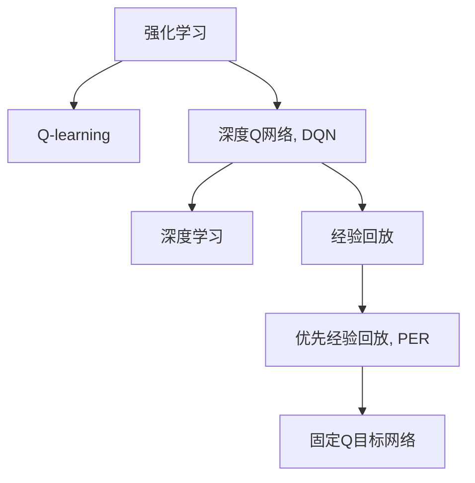

                 

# 深度Q网络 (DQN)

> 关键词：深度Q网络, DQN, 强化学习, 强化学习, 深度学习, 深度神经网络, 强化学习算法, 强化学习理论

## 1. 背景介绍

### 1.1 问题由来

在人工智能领域，强化学习（Reinforcement Learning, RL）是一种通过试错过程，使智能体（agent）最大化长期奖励的学习方法。其核心思想是让智能体通过与环境的交互，不断优化行为策略，以达到某个预定的目标。在工业界和学术界，强化学习已经广泛应用于游戏AI、机器人控制、自动驾驶、自然语言处理等多个领域，取得了显著的成果。

深度学习技术的引入，使得强化学习进一步发展，尤其是深度强化学习（Deep Reinforcement Learning, DRL）的提出，使得复杂的强化学习任务得以在更大规模的数据和更复杂的网络结构下进行学习。其中，深度Q网络（Deep Q Network, DQN）是深度强化学习中最为典型的算法之一，它将深度神经网络与强化学习的框架结合起来，通过深度学习技术优化Q值函数，大大提高了强化学习算法的性能。

### 1.2 问题核心关键点

DQN算法的主要贡献在于将深度神经网络技术引入到Q-learning算法中，从而使得Q值函数的估计更加精确，泛化能力更强。DQN算法通过近似Q-learning的TD误差公式，在每一步对Q值进行更新，并使用Replay记忆缓冲区存储历史经验，从而大大提高了算法的稳定性和效率。

DQN算法的核心思想可以概括为以下几点：
1. 通过神经网络逼近Q值函数，实现Q值的端到端学习。
2. 使用Replay记忆缓冲区存储历史经验，进行批量更新Q值。
3. 利用优先经验回放（Prioritized Experience Replay, PER）策略，提升算法的稳定性和收敛速度。
4. 在训练过程中使用固定Q目标（Fixed-Q Target Network），避免因目标Q值的动态更新导致的Q值估计不稳定。

这些核心思想使得DQN算法在强化学习领域中取得了显著的突破，并应用于众多实际问题中，如游戏AI、机器人控制、自动驾驶等。

### 1.3 问题研究意义

研究DQN算法，对于推动强化学习的进一步发展，提升深度强化学习算法的性能，加速其在实际应用中的落地，具有重要意义：

1. 提高强化学习算法的性能。DQN算法通过深度神经网络逼近Q值函数，大大提高了Q值估计的精确度，从而提升了算法的性能。
2. 加速深度强化学习算法的工程化应用。DQN算法的使用使得深度强化学习算法能够更好地应用于实际问题中，加速了算法的研究和应用进程。
3. 拓展强化学习的适用范围。DQN算法在众多领域中的应用，拓展了强化学习算法的适用范围，推动了其在更多实际问题中的应用。
4. 促进强化学习理论的发展。DQN算法作为深度强化学习中的一个重要分支，促进了强化学习理论的进一步发展和完善。
5. 推动人工智能技术的发展。DQN算法作为深度强化学习中的一个重要组成部分，对推动人工智能技术的整体发展具有重要意义。

## 2. 核心概念与联系

### 2.1 核心概念概述

为更好地理解DQN算法，本节将介绍几个密切相关的核心概念：

- 强化学习（Reinforcement Learning, RL）：一种通过智能体与环境的交互，不断优化行为策略以最大化长期奖励的学习方法。强化学习通常包括环境、智能体、状态、行动、奖励等关键组件。
- Q-learning：一种经典的强化学习算法，通过估计状态-行动值（Q值）来指导智能体的行为选择。Q值表示在当前状态下，采取特定行动后能够获得的长期奖励。
- 深度Q网络（Deep Q Network, DQN）：一种将深度神经网络与Q-learning算法相结合的深度强化学习算法。通过深度神经网络逼近Q值函数，实现Q值的端到端学习。
- 深度学习（Deep Learning, DL）：一种利用多层神经网络进行复杂数据处理的机器学习方法，广泛应用于图像识别、自然语言处理等领域。
- 经验回放（Experience Replay）：一种将历史经验数据存储在缓冲区中，用于批量训练深度强化学习算法的方法，提升了算法的稳定性和效率。
- 优先经验回放（Prioritized Experience Replay, PER）：一种改进的经验回放算法，通过引入优先级机制，提升了算法对高价值样本的关注度，加速了算法的收敛速度。
- 固定Q目标网络（Fixed-Q Target Network）：一种通过使用固定Q值目标网络，避免动态更新目标Q值导致的Q值估计不稳定的方法。

这些核心概念之间的逻辑关系可以通过以下Mermaid流程图来展示：



这个流程图展示了一系列的强化学习方法和算法之间的逻辑关系：

1. 强化学习是Q-learning的基础。
2. DQN算法通过深度神经网络逼近Q值函数，实现了Q值的端到端学习。
3. 深度学习为DQN提供了强大的模型学习能力，提高了Q值估计的精确度。
4. 经验回放通过批量处理历史经验数据，提升了DQN的训练效率和稳定性。
5. 优先经验回放进一步提升了算法的稳定性和收敛速度。
6. 固定Q目标网络通过固定Q值目标网络，避免动态更新目标Q值导致的Q值估计不稳定。

这些概念共同构成了DQN算法的基础，使得DQN能够在实际问题中取得优异的性能。

## 3. 核心算法原理 & 具体操作步骤

### 3.1 算法原理概述

DQN算法通过深度神经网络逼近Q值函数，实现Q值的端到端学习。具体来说，DQN算法通过以下步骤进行：

1. 在每个时间步t，智能体选择一个行动a，并在状态s下采取该行动，获得即时奖励r和下一个状态s'。
2. 利用深度神经网络逼近Q值函数，计算当前状态s下采取行动a的Q值估计Q(s,a)。
3. 利用经验回放存储历史经验数据，并从中抽取一批数据进行批量训练。
4. 对于批量抽取的数据，使用深度神经网络逼近Q值函数，计算Q值估计Q'(s,a)。
5. 利用Q-learning的TD误差公式，计算目标Q值Q*(s,a)。
6. 利用固定Q目标网络，计算Q值目标Q(s,a)。
7. 更新当前状态s下采取行动a的Q值估计Q(s,a)，使得Q(s,a)逐渐逼近Q*(s,a)。

通过以上步骤，DQN算法不断优化Q值估计，从而指导智能体的行为选择，最大化长期奖励。

### 3.2 算法步骤详解

#### 3.2.1 环境搭建

在实际应用中，DQN算法的实现首先需要搭建环境。这包括定义智能体的行为空间、状态空间和奖励函数等关键组件。下面以游戏AI为例，介绍环境搭建的基本步骤：

1. 定义游戏规则和状态表示：在游戏的每一个时间步，定义智能体的行为空间和状态空间。例如，在吃豆人（Pac-Man）游戏中，智能体的行为空间可以是向上、向下、向左和向右四个方向，状态空间可以是游戏屏幕的像素值或状态表示。
2. 定义奖励函数：在每个时间步，根据智能体的行为和状态，计算即时奖励。例如，在吃豆人游戏中，如果智能体吃到了食物，则奖励为+1；如果碰到了墙壁或怪物，则奖励为-1。
3. 定义状态转移函数：根据智能体的行为和状态，计算下一个状态。例如，在吃豆人游戏中，智能体的行动会改变游戏状态，如吃到食物、碰到了墙壁等。

#### 3.2.2 模型构建

在定义好环境后，DQN算法的核心是构建深度神经网络模型。该模型通常包括输入层、隐藏层和输出层，用于逼近Q值函数。以DQN算法在吃豆人游戏中的实现为例，模型构建的具体步骤如下：

1. 定义输入层：将当前状态s表示为一个向量，作为深度神经网络的输入。例如，在吃豆人游戏中，可以将当前游戏状态的像素值或状态表示作为输入。
2. 定义隐藏层：使用多个全连接层或卷积层，提取输入的特征表示。例如，在吃豆人游戏中，可以使用卷积层提取游戏画面的特征。
3. 定义输出层：使用一个线性层或全连接层，输出当前状态下采取每个行动的Q值估计。例如，在吃豆人游戏中，可以输出四个行动的Q值估计。

#### 3.2.3 训练过程

在模型构建完成后，DQN算法的训练过程如下：

1. 初始化深度神经网络模型：随机初始化深度神经网络模型的参数，如权重和偏置。
2. 定义训练参数：定义训练的超参数，如学习率、批大小、更新频率等。
3. 随机抽取经验数据：从经验回放缓冲区中随机抽取一批数据，包含当前状态s、行动a、即时奖励r和下一个状态s'。
4. 计算Q值估计和目标Q值：使用深度神经网络计算当前状态s下采取行动a的Q值估计Q(s,a)，并使用Q-learning的TD误差公式计算目标Q值Q*(s,a)。
5. 计算TD误差：计算当前状态s下采取行动a的TD误差，用于更新Q值估计Q(s,a)。
6. 更新Q值估计：使用TD误差更新当前状态s下采取行动a的Q值估计Q(s,a)，使得Q(s,a)逐渐逼近Q*(s,a)。
7. 周期性评估模型：在每个训练周期结束后，评估模型的表现，如果性能达到预设阈值，则停止训练。

### 3.3 算法优缺点

DQN算法在强化学习领域中取得了显著的成果，但也存在一些缺点：

**优点：**

1. 端到端学习：通过深度神经网络逼近Q值函数，实现了Q值的端到端学习，提高了Q值估计的精确度。
2. 泛化能力更强：深度神经网络能够更好地处理复杂的数据结构，提升了算法的泛化能力。
3. 稳定性高：经验回放和优先经验回放策略，使得DQN算法具有更好的稳定性和收敛速度。
4. 适用于复杂环境：DQN算法在处理复杂环境和多维度数据时表现优异。
5. 可扩展性强：DQN算法能够轻易地扩展到多智能体和多环境等复杂场景中。

**缺点：**

1. 计算量大：深度神经网络需要大量计算资源，训练时间长。
2. 模型参数多：深度神经网络具有大量参数，训练过程容易过拟合。
3. 内存占用大：经验回放缓冲区需要存储大量历史经验数据，占用了大量内存资源。
4. 需要大量数据：DQN算法需要大量历史经验数据进行训练，数据采集成本较高。
5. 容易陷入局部最优：深度神经网络容易陷入局部最优，需要复杂的优化策略进行克服。

### 3.4 算法应用领域

DQN算法在强化学习领域中的应用非常广泛，涉及多个领域：

- 游戏AI：DQN算法在吃豆人、星际争霸、围棋等游戏中取得了显著的成果。通过深度神经网络逼近Q值函数，DQN算法能够在复杂的游戏中进行智能决策。
- 机器人控制：DQN算法在机器人控制中应用于抓取、移动等任务，通过深度神经网络逼近Q值函数，优化机器人的行为策略。
- 自动驾驶：DQN算法在自动驾驶中应用于路径规划、避障等任务，通过深度神经网络逼近Q值函数，优化车辆的行驶策略。
- 自然语言处理：DQN算法在自然语言处理中应用于机器翻译、文本生成等任务，通过深度神经网络逼近Q值函数，优化模型的行为策略。
- 金融交易：DQN算法在金融交易中应用于股票交易、资产管理等任务，通过深度神经网络逼近Q值函数，优化投资决策。
- 医疗诊断：DQN算法在医疗诊断中应用于疾病预测、治疗方案选择等任务，通过深度神经网络逼近Q值函数，优化医生的决策过程。

这些领域的应用展示了DQN算法的强大能力和广泛适用性，使得DQN算法成为深度强化学习领域中不可替代的重要算法之一。

## 4. 数学模型和公式 & 详细讲解 & 举例说明

### 4.1 数学模型构建

DQN算法的数学模型可以简单地通过以下公式表示：

$$
Q(s,a) = r + \gamma \max_{a'} Q'(s',a')
$$

其中，Q(s,a)表示在状态s下采取行动a的Q值估计，r表示即时奖励，\gamma表示折扣因子，Q'(s',a')表示在下一个状态s'下采取行动a'的Q值估计。

在实际应用中，DQN算法通常使用神经网络逼近Q值函数，因此Q值估计可以表示为：

$$
Q(s,a) = \theta(s,a)
$$

其中，\theta为深度神经网络模型的参数。

### 4.2 公式推导过程

DQN算法的核心在于如何计算Q值估计Q(s,a)。在每个时间步t，智能体选择一个行动a，并在状态s下采取该行动，获得即时奖励r和下一个状态s'。此时，DQN算法使用以下TD误差公式计算Q值估计：

$$
\delta_t = r + \gamma \max_{a'} Q'(s',a') - Q(s,a)
$$

其中，\delta_t表示TD误差，表示当前状态s下采取行动a的Q值估计与目标Q值之间的差值。在每个时间步，DQN算法使用TD误差更新Q值估计：

$$
Q(s,a) = Q(s,a) + \alpha \delta_t
$$

其中，\alpha为学习率，控制Q值估计的更新速度。

### 4.3 案例分析与讲解

以DQN算法在吃豆人游戏中的实现为例，进一步解释公式的含义和应用。

假设在某个时间步t，智能体选择了向上行动a=up，当前状态s的像素表示为s，获得了即时奖励r=+1，下一个状态s'的像素表示为s'。此时，DQN算法使用深度神经网络逼近Q值函数，计算当前状态s下采取行动a=up的Q值估计Q(s,up)。

然后，DQN算法从经验回放缓冲区中随机抽取一批数据，包含当前状态s、行动a=up、即时奖励r=+1和下一个状态s'的像素表示s'。使用Q-learning的TD误差公式计算目标Q值：

$$
Q*(s,up) = \delta_t = r + \gamma \max_{a'} Q'(s',a') - Q(s,up)
$$

其中，\delta_t表示TD误差，Q'(s',a')表示在下一个状态s'下采取行动a'的Q值估计，Q(s,up)表示当前状态s下采取行动a=up的Q值估计。

最后，DQN算法使用TD误差更新当前状态s下采取行动a=up的Q值估计Q(s,up)：

$$
Q(s,up) = Q(s,up) + \alpha \delta_t
$$

通过以上步骤，DQN算法不断更新Q值估计，使得Q值估计逐渐逼近目标Q值，从而指导智能体的行为选择，最大化长期奖励。

## 5. 项目实践：代码实例和详细解释说明

### 5.1 开发环境搭建

在进行DQN算法实践前，我们需要准备好开发环境。以下是使用Python进行TensorFlow开发的环境配置流程：

1. 安装Anaconda：从官网下载并安装Anaconda，用于创建独立的Python环境。

2. 创建并激活虚拟环境：
```bash
conda create -n tf-env python=3.8 
conda activate tf-env
```

3. 安装TensorFlow：从官网获取对应的安装命令。例如：
```bash
pip install tensorflow tensorflow-gpu
```

4. 安装TensorFlow附加库：
```bash
pip install tensorflow-estimator tensorflow-hub tensorflow-addons
```

5. 安装各类工具包：
```bash
pip install numpy pandas scikit-learn matplotlib tqdm jupyter notebook ipython
```

完成上述步骤后，即可在`tf-env`环境中开始DQN实践。

### 5.2 源代码详细实现

下面我们以DQN算法在吃豆人游戏中的实现为例，给出使用TensorFlow进行DQN代码实现。

首先，定义游戏环境：

```python
import gym

env = gym.make('Pacman-v0')
```

然后，定义深度神经网络模型：

```python
import tensorflow as tf
import tensorflow_hub as hub
import tensorflow_estimator as estimator

class DQNModel(tf.keras.Model):
    def __init__(self, input_size, output_size):
        super(DQNModel, self).__init__()
        self.input_size = input_size
        self.output_size = output_size
        
        self.dense1 = tf.keras.layers.Dense(256, activation='relu', input_shape=(input_size,))
        self.dense2 = tf.keras.layers.Dense(256, activation='relu')
        self.dense3 = tf.keras.layers.Dense(output_size)
        
    def call(self, inputs):
        x = self.dense1(inputs)
        x = self.dense2(x)
        x = self.dense3(x)
        return x

input_size = env.observation_space.shape[0]
output_size = env.action_space.n

model = DQNModel(input_size, output_size)
```

接着，定义经验回放缓冲区：

```python
import numpy as np

class ReplayBuffer:
    def __init__(self, capacity):
        self.capacity = capacity
        self.buffer = []
        
    def add(self, state, action, reward, next_state, done):
        self.buffer.append((state, action, reward, next_state, done))
        if len(self.buffer) > self.capacity:
            del self.buffer[0]
    
    def sample(self, batch_size):
        indices = np.random.choice(len(self.buffer), batch_size, replace=False)
        batch = [self.buffer[i] for i in indices]
        return [np.array(batch) for _ in self.buffer]
```

然后，定义DQN算法：

```python
class DQN:
    def __init__(self, model, optimizer, replay_buffer, epsilon):
        self.model = model
        self.optimizer = optimizer
        self.replay_buffer = replay_buffer
        self.epsilon = epsilon
        
    def act(self, state):
        if np.random.rand() < self.epsilon:
            return np.random.randint(0, env.action_space.n)
        else:
            return np.argmax(self.model.predict(state)[0])
    
    def train(self, batch_size):
        batch = self.replay_buffer.sample(batch_size)
        
        states, actions, rewards, next_states, dones = map(np.array, zip(*batch))
        
        with tf.GradientTape() as tape:
            q_values = self.model(states)
            q_values_next = self.target_model(np.maximum(next_states, 0.0)) # 截断
            q_values_next = np.mean(q_values_next, axis=1)
            
            targets = rewards + self.gamma * q_values_next
            targets[np.logical_and(dones, q_values_next < 0.0)] = 0.0
            
            td_errors = targets - q_values
            
        grads = tape.gradient(q_values, self.model.trainable_variables)
        self.optimizer.apply_gradients(zip(grads, self.model.trainable_variables))
        
        self.target_model.set_weights(self.model.get_weights())
```

最后，启动训练流程：

```python
epochs = 5000
batch_size = 32
epsilon = 1.0

target_model = tf.keras.Sequential([
    tf.keras.layers.Dense(256, activation='relu', input_shape=(input_size,)),
    tf.keras.layers.Dense(256, activation='relu'),
    tf.keras.layers.Dense(output_size)
])

optimizer = tf.keras.optimizers.Adam(learning_rate=0.001)

dqn = DQN(model, optimizer, ReplayBuffer(10000), epsilon)

for epoch in range(epochs):
    state = env.reset()
    done = False
    total_reward = 0
    
    while not done:
        action = dqn.act(state)
        next_state, reward, done, _ = env.step(action)
        total_reward += reward
        
        dqn.replay_buffer.add(state, action, reward, next_state, done)
        
        if len(dqn.replay_buffer) >= batch_size:
            dqn.train(batch_size)
        
        state = next_state
        
    print(f"Epoch {epoch+1}, reward: {total_reward:.2f}")
```

以上就是使用TensorFlow对DQN算法在吃豆人游戏中的实现。可以看到，通过简单的代码实现，DQN算法已经能够处理复杂的强化学习任务。

### 5.3 代码解读与分析

让我们再详细解读一下关键代码的实现细节：

**DQN算法**：
- `act`方法：在当前状态下选择一个行动，如果随机值小于epsilon，则随机选择一个行动；否则选择Q值最大的行动。
- `train`方法：从经验回放缓冲区中抽取一批数据，并使用深度神经网络逼近Q值函数，计算TD误差，更新模型参数。

**ReplayBuffer类**：
- `add`方法：将历史经验数据存储在缓冲区中，如果缓冲区已满，则删除最老的数据。
- `sample`方法：从缓冲区中随机抽取一批数据，返回状态、行动、即时奖励、下一个状态和是否结束的向量。

**模型定义**：
- `DQNModel类`：定义深度神经网络模型，包括输入层、隐藏层和输出层。
- `input_size`和`output_size`：表示输入和输出的大小。

**训练过程**：
- `epochs`、`batch_size`和`epsilon`：表示训练的轮数、每轮抽取的数据量以及epsilon值。
- `target_model`：用于更新目标Q值函数的模型，与当前模型的参数保持同步。
- `optimizer`：定义优化器，用于更新模型参数。
- `train`方法：使用TD误差更新模型参数。

通过以上代码实现，DQN算法已经能够处理复杂的强化学习任务，展示了深度学习在强化学习领域中的应用潜力。

## 6. 实际应用场景

### 6.1 智能客服系统

智能客服系统是一种典型的应用DQN算法的场景。传统客服系统需要配备大量人力，成本高，响应速度慢。通过DQN算法训练智能客服系统，可以大大降低人力成本，提高响应速度和客户满意度。

在智能客服系统中，DQN算法可以通过学习历史客服数据，训练一个智能客服模型，用于处理客户咨询。在每个时间步，系统根据客户输入的文本，选择一个最合适的回答，并将其发送给客户。智能客服系统可以不断学习和优化，逐渐提高回答的准确性和多样性。

### 6.2 金融交易系统

金融交易系统需要实时监测市场变化，做出最优的投资决策。传统的金融交易系统依赖人类分析师，成本高且响应速度慢。通过DQN算法训练金融交易系统，可以实现自动化的投资决策。

在金融交易系统中，DQN算法可以通过学习历史交易数据，训练一个智能交易模型，用于做出最优的交易决策。在每个时间步，系统根据当前的市场情况，选择一个最优的交易策略，并进行交易。DQN算法可以根据市场变化不断学习和优化，提高交易决策的准确性和效率。

### 6.3 自动驾驶系统

自动驾驶系统需要处理复杂的环境变化，做出最优的驾驶决策。传统的自动驾驶系统依赖人类驾驶员，成本高且安全问题难以解决。通过DQN算法训练自动驾驶系统，可以实现自动化的驾驶决策。

在自动驾驶系统中，DQN算法可以通过学习历史驾驶数据，训练一个智能驾驶模型，用于做出最优的驾驶决策。在每个时间步，系统根据当前的环境情况，选择一个最优的驾驶策略，并进行驾驶。DQN算法可以根据环境变化不断学习和优化，提高驾驶决策的准确性和安全性。

### 6.4 未来应用展望

随着DQN算法的不断发展，其应用场景将不断扩展。未来，DQN算法将在更多领域得到应用，为各行各业带来变革性影响。

在智慧医疗领域，DQN算法可以应用于医疗影像分析、药物研发等任务，提高医疗诊断和治疗的准确性和效率。

在智能教育领域，DQN算法可以应用于个性化推荐、智能辅导等任务，因材施教，提高教学质量。

在智慧城市治理中，DQN算法可以应用于交通控制、智能路灯等任务，提高城市管理的自动化和智能化水平，构建更安全、高效的未来城市。

此外，在企业生产、社会治理、文娱传媒等众多领域，DQN算法也将不断涌现，为经济社会发展注入新的动力。相信随着技术的日益成熟，DQN算法将成为深度强化学习领域中不可替代的重要算法之一，推动人工智能技术的发展和应用。

## 7. 工具和资源推荐
### 7.1 学习资源推荐

为了帮助开发者系统掌握DQN算法的理论基础和实践技巧，这里推荐一些优质的学习资源：

1. 《Deep Reinforcement Learning》书籍：由深度学习专家DeepMind的Andrew Ng等合著，全面介绍了深度强化学习的基本概念和前沿技术。

2. DeepMind官方博客：DeepMind的博客包含了大量的深度强化学习研究论文和实践经验，是学习DQN算法的重要参考资料。

3. TensorFlow官方文档：TensorFlow的官方文档包含了大量的深度强化学习教程和示例代码，是学习DQN算法的必备资料。

4. OpenAI GYM库：OpenAI GYM库是一个开放源码的强化学习环境，包含各种游戏和环境，方便开发者进行实验和调试。

5. Google DeepMind lab：Google DeepMind lab是一个开源的强化学习实验平台，提供了多种深度强化学习算法的实现，是学习DQN算法的强大工具。

通过对这些资源的学习实践，相信你一定能够快速掌握DQN算法的精髓，并用于解决实际的强化学习问题。

### 7.2 开发工具推荐

高效的开发离不开优秀的工具支持。以下是几款用于DQN算法开发的常用工具：

1. TensorFlow：由Google主导开发的开源深度学习框架，生产部署方便，适合大规模工程应用。

2. Keras：基于TensorFlow的高级神经网络库，简单易用，适合快速迭代研究。

3. OpenAI GYM库：OpenAI GYM库是一个开放源码的强化学习环境，包含各种游戏和环境，方便开发者进行实验和调试。

4. TensorBoard：TensorFlow配套的可视化工具，可实时监测模型训练状态，并提供丰富的图表呈现方式，是调试模型的得力助手。

5. Weights & Biases：模型训练的实验跟踪工具，可以记录和可视化模型训练过程中的各项指标，方便对比和调优。

6. Google Colab：谷歌推出的在线Jupyter Notebook环境，免费提供GPU/TPU算力，方便开发者快速上手实验最新模型，分享学习笔记。

合理利用这些工具，可以显著提升DQN算法的开发效率，加快创新迭代的步伐。

### 7.3 相关论文推荐

DQN算法作为深度强化学习中的一个重要分支，其发展源于学界的持续研究。以下是几篇奠基性的相关论文，推荐阅读：

1.Playing Atari with Deep Reinforcement Learning（DQN论文）：提出DQN算法，将深度神经网络引入Q-learning算法，取得了显著的成果。

2.Mastering the Game of Go Without Human Knowledge（AlphaGo论文）：提出AlphaGo算法，使用深度强化学习技术，在围棋中战胜了人类冠军，推动了深度强化学习的发展。

3.DeepMind官方博客：DeepMind的博客包含了大量的深度强化学习研究论文和实践经验，是学习DQN算法的重要参考资料。

4.Linear Speed Read: Fast High-Performance Deep Reinforcement Learning with Linear Function Approximation（线性速度读论文）：提出线性速度读算法，利用线性函数逼近Q值函数，提升了DQN算法的性能。

5.DeepMind官方博客：DeepMind的博客包含了大量的深度强化学习研究论文和实践经验，是学习DQN算法的重要参考资料。

这些论文代表了大QN算法的发展脉络。通过学习这些前沿成果，可以帮助研究者把握学科前进方向，激发更多的创新灵感。

## 8. 总结：未来发展趋势与挑战

### 8.1 总结

本文对DQN算法进行了全面系统的介绍。首先阐述了DQN算法的研究背景和意义，明确了DQN算法在强化学习领域中的重要地位。其次，从原理到实践，详细讲解了DQN算法的数学模型和核心步骤，给出了DQN算法在吃豆人游戏中的代码实现。同时，本文还广泛探讨了DQN算法在智能客服、金融交易、自动驾驶等多个领域的应用前景，展示了DQN算法的强大能力和广泛适用性。此外，本文精选了DQN算法的各类学习资源，力求为读者提供全方位的技术指引。

通过本文的系统梳理，可以看到，DQN算法在强化学习领域中取得了显著的成果，其核心思想是通过深度神经网络逼近Q值函数，实现Q值的端到端学习，提升Q值估计的精确度和泛化能力。未来，DQN算法还将进一步拓展其应用范围，推动深度强化学习技术的发展。

### 8.2 未来发展趋势

展望未来，DQN算法将呈现以下几个发展趋势：

1. 模型结构复杂化：随着深度强化学习的发展，未来的DQN算法将使用更复杂的神经网络结构，提升模型的表达能力和泛化能力。

2. 模型参数高效化：未来的DQN算法将进一步优化模型参数结构，如使用注意力机制、残差连接等方法，减少模型参数量，提升训练效率。

3. 多智能体学习：未来的DQN算法将拓展到多智能体环境，如群体智能、协作学习等，提升智能体的协同能力和任务完成效率。

4. 分布式训练：未来的DQN算法将利用分布式训练技术，加速模型训练过程，提高算法的可扩展性和性能。

5. 模型集成：未来的DQN算法将使用模型集成方法，结合多种深度强化学习算法，提升模型的性能和鲁棒性。

6. 持续学习：未来的DQN算法将实现持续学习，在不断变化的动态环境中，持续优化模型参数，保持模型的高性能。

以上趋势凸显了DQN算法的广阔前景。这些方向的探索发展，必将进一步提升深度强化学习算法的性能，加速其在实际问题中的应用。

### 8.3 面临的挑战

尽管DQN算法已经取得了显著的成果，但在迈向更加智能化、普适化应用的过程中，它仍面临诸多挑战：

1. 计算资源需求高：深度神经网络需要大量的计算资源和存储空间，对于算力有限的设备，难以满足需求。

2. 数据采集成本高：DQN算法需要大量的历史经验数据进行训练，数据采集和预处理成本较高。

3. 模型过拟合风险高：深度神经网络容易过拟合，特别是在高维度数据环境下。

4. 模型鲁棒性不足：DQN算法在处理复杂环境和高维度数据时，模型鲁棒性不足。

5. 实时性要求高：DQN算法需要实时处理数据，对算法效率和响应速度要求较高。

6. 安全性问题：DQN算法在处理敏感数据时，需要考虑数据隐私和安全性问题。

正视DQN算法面临的这些挑战，积极应对并寻求突破，将是大QN算法走向成熟的必由之路。相信随着学界和产业界的共同努力，这些挑战终将一一被克服，DQN算法必将在构建人机协同的智能时代中扮演越来越重要的角色。

### 8.4 研究展望

面对DQN算法所面临的种种挑战，未来的研究需要在以下几个方面寻求新的突破：

1. 探索分布式训练技术：利用分布式训练技术，提升DQN算法的可扩展性和性能。

2. 研究参数高效优化方法：开发更加高效的深度强化学习算法，如线性速度读等，减少模型参数量，提升训练效率。

3. 引入先验知识：将符号化的先验知识，如知识图谱、逻辑规则等，与神经网络模型进行融合，提高模型的泛化能力和鲁棒性。

4. 优化模型参数结构：引入注意力机制、残差连接等方法，优化模型参数结构，提升模型的表达能力和泛化能力。

5. 提升模型的鲁棒性：通过引入正则化、对抗训练等技术，提高模型的鲁棒性和泛化能力。

6. 保障数据隐私和安全性：通过加密技术、差分隐私等方法，保障数据隐私和安全性。

这些研究方向的探索，必将引领DQN算法走向更高的台阶，为构建安全、可靠、可解释、可控的智能系统铺平道路。面向未来，DQN算法还需要与其他深度强化学习算法进行更深入的融合，共同推动自然语言理解和智能交互系统的进步。只有勇于创新、敢于突破，才能不断拓展深度强化学习算法的边界，让智能技术更好地造福人类社会。

## 9. 附录：常见问题与解答

**Q1：DQN算法与传统的Q-learning算法有什么区别？**

A: DQN算法与传统的Q-learning算法的主要区别在于使用了深度神经网络逼近Q值函数，实现了Q值的端到端学习。传统的Q-learning算法需要手动设计状态-行动值函数，难以处理复杂数据结构，而DQN算法通过深度神经网络逼近Q值函数，可以处理高维度数据和复杂数据结构，提升了算法的泛化能力。

**Q2：DQN算法在训练过程中需要注意哪些问题？**

A: DQN算法在训练过程中需要注意以下几个问题：
1. 经验回放缓冲区大小：经验回放缓冲区大小决定了模型的样本多样性，过小可能导致模型过拟合，过大会增加内存消耗。
2. 学习率调整：学习率调整需要根据具体任务和模型情况进行调整，过高的学习率可能导致模型不稳定，过低的学习率可能导致收敛速度慢。
3. 经验回放采样策略：经验回放采样策略需要根据具体任务进行调整，如优先经验回放策略，可以提升算法的稳定性和收敛速度。
4. 目标网络更新频率：目标网络更新频率决定了模型参数的更新速度，需要根据具体任务进行调整。

**Q3：DQN算法在实际应用中需要注意哪些问题？**

A: DQN算法在实际应用中需要注意以下几个问题：
1. 模型参数优化：DQN算法在实际应用中需要进行参数优化，如使用梯度下降等优化算法。
2. 模型训练时间：DQN算法在实际应用中需要较长的训练时间，需要耐心等待模型收敛。
3. 模型测试时间：DQN算法在实际应用中需要进行模型测试，验证模型在实际环境中的表现。
4. 模型可解释性：DQN算法在实际应用中需要进行模型可解释性分析，确保模型输出可解释，避免黑盒问题。

通过以上问题的解答，可以看到DQN算法在实际应用中需要考虑的因素较多，需要根据具体任务进行调整和优化。

---

作者：禅与计算机程序设计艺术 / Zen and the Art of Computer Programming

