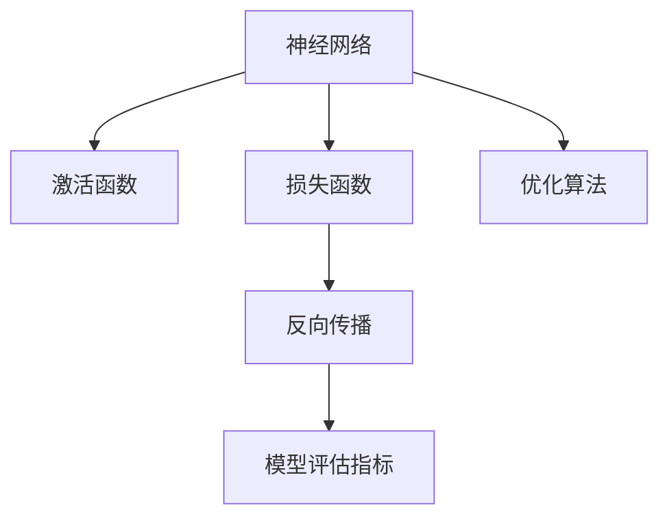

                 

# 深度学习 原理与代码实例讲解

> 关键词：深度学习,神经网络,激活函数,损失函数,反向传播,优化算法,模型评估

## 1. 背景介绍

### 1.1 问题由来
深度学习(DL)作为人工智能(AI)领域的前沿技术，通过构建多层次的非线性模型，可以从原始数据中自动学习并提取出特征，从而完成复杂的任务，如图像识别、自然语言处理、语音识别等。近年来，深度学习已经广泛应用于各个行业，取得了显著的成果。然而，尽管如此，深度学习技术仍面临诸多挑战，如模型的可解释性、计算效率、泛化能力等问题。因此，深入理解深度学习的原理，掌握有效的代码实例，对于推进人工智能技术的普及和应用具有重要意义。

### 1.2 问题核心关键点
深度学习的核心关键点包括：

- 神经网络结构：多层神经网络的构建及其参数训练。
- 激活函数选择：神经元激活方式的设计及其对模型性能的影响。
- 损失函数定义：模型输出与真实标签之间的距离计算方法。
- 反向传播算法：通过链式法则计算梯度的过程。
- 优化算法选择：基于梯度的参数更新策略。
- 模型评估指标：用于评价模型性能的指标。

本文将详细讲解这些核心关键点，并通过具体代码实例，帮助读者深入理解深度学习的基本原理和实现方法。

## 2. 核心概念与联系

### 2.1 核心概念概述

为更好地理解深度学习的原理，本节将介绍几个密切相关的核心概念：

- 神经网络(Neural Network)：由一系列神经元组成的网络结构，通过多个层次的非线性变换，实现对输入数据的复杂映射。
- 激活函数(Activation Function)：在神经网络中，用于计算神经元输出的一种非线性函数。
- 损失函数(Loss Function)：用于衡量模型预测值与真实标签之间差异的函数，是模型训练和评估的基础。
- 反向传播(Backpropagation)：通过链式法则，计算损失函数对神经元权重的梯度，用于模型参数的优化。
- 优化算法(Optimization Algorithm)：用于更新神经网络参数，使得模型损失最小化的算法。
- 模型评估指标(Model Evaluation)：用于评价模型预测效果和泛化能力的指标。

这些核心概念之间的逻辑关系可以通过以下Mermaid流程图来展示：



这个流程图展示了几大核心概念之间的联系：

1. 神经网络通过激活函数进行非线性映射。
2. 损失函数衡量模型预测值与真实标签之间的差异。
3. 反向传播算法通过链式法则计算梯度。
4. 优化算法更新神经网络参数，使损失函数最小化。
5. 模型评估指标用于评价模型性能和泛化能力。

这些概念共同构成了深度学习的学习框架，使其能够实现复杂的预测和建模任务。通过理解这些核心概念，我们可以更好地把握深度学习的工作原理和优化方向。

## 3. 核心算法原理 & 具体操作步骤
### 3.1 算法原理概述

深度学习的主要算法原理包括以下几个方面：

- 神经网络结构：由输入层、隐藏层和输出层组成，通过非线性变换实现对输入数据的复杂映射。
- 激活函数：常用的激活函数包括Sigmoid、ReLU、Tanh等，用于增加模型的非线性特性。
- 损失函数：常用的损失函数包括均方误差(MSE)、交叉熵(Cross-Entropy)、对数损失(Log-Loss)等，用于衡量模型预测值与真实标签之间的差异。
- 反向传播算法：通过链式法则计算损失函数对神经元权重的梯度，用于参数更新。
- 优化算法：常用的优化算法包括梯度下降(Gradient Descent)、Adam、RMSprop等，用于调整神经网络参数。
- 模型评估指标：常用的评估指标包括准确率(Accuracy)、精确率(Precision)、召回率(Recall)、F1分数(F1-Score)等，用于评价模型的泛化能力。

### 3.2 算法步骤详解

深度学习的算法步骤主要包括以下几个关键步骤：

**Step 1: 准备数据集**
- 收集并预处理数据集，包括数据清洗、标准化、划分训练集、验证集和测试集等。

**Step 2: 定义模型架构**
- 选择合适的神经网络结构，包括输入层、隐藏层和输出层的神经元数量、激活函数等。
- 使用深度学习框架搭建模型，如TensorFlow、Keras、PyTorch等。

**Step 3: 定义损失函数和优化器**
- 根据任务类型，选择合适的损失函数。
- 选择优化器，并设置学习率、批大小等超参数。

**Step 4: 训练模型**
- 使用训练集进行模型训练，每轮迭代使用反向传播算法计算梯度，并使用优化器更新参数。
- 在每个epoch的末尾，使用验证集评估模型性能，根据性能调整超参数。

**Step 5: 模型评估与部署**
- 使用测试集评估模型性能，输出评估指标。
- 将训练好的模型保存并部署到实际应用中。

### 3.3 算法优缺点

深度学习的主要优点包括：

- 强大的建模能力：通过多层次的非线性变换，可以处理复杂的数据分布，实现高精度的预测和建模。
- 自动特征提取：无需手工设计特征，网络能够自动学习数据的本质特征。
- 适用于大规模数据：可以处理大规模的训练数据，提升模型的泛化能力。

然而，深度学习也存在一些缺点：

- 计算复杂度高：训练过程耗时耗资源，需要高性能的计算设备。
- 参数数量庞大：模型参数数量巨大，容易出现过拟合问题。
- 可解释性不足：深度学习模型常被视为"黑盒"，难以解释其内部决策过程。

尽管存在这些局限性，但深度学习在图像识别、自然语言处理、语音识别等诸多领域取得了显著的成果，成为现代人工智能技术的核心方法。

### 3.4 算法应用领域

深度学习已经在诸多领域得到了广泛应用，包括但不限于：

- 计算机视觉：如图像分类、目标检测、图像生成等。
- 自然语言处理：如机器翻译、文本分类、问答系统等。
- 语音识别：如语音转文本、语音合成等。
- 医疗诊断：如医学影像分析、病历分析等。
- 金融分析：如股票预测、风险评估等。
- 自动驾驶：如图像处理、路径规划等。

这些应用展示了深度学习的强大潜力和广泛适用性，未来深度学习将继续在更多领域发挥重要作用。

## 4. 数学模型和公式 & 详细讲解
### 4.1 数学模型构建

深度学习的数学模型通常包括输入层、隐藏层和输出层，各层之间通过权重矩阵和激活函数连接。以神经网络为例，其数学模型可以表示为：

$$
\mathbf{y} = f(\mathbf{W}_h \mathbf{x} + \mathbf{b}_h)
$$

其中，$\mathbf{x}$ 表示输入向量，$\mathbf{y}$ 表示输出向量，$\mathbf{W}_h$ 表示隐藏层的权重矩阵，$\mathbf{b}_h$ 表示隐藏层的偏置向量，$f$ 表示激活函数。

### 4.2 公式推导过程

以简单的单层神经网络为例，推导其反向传播算法的梯度计算过程。

设训练数据集为 $\{(\mathbf{x}_i, \mathbf{y}_i)\}_{i=1}^N$，其中 $\mathbf{x}_i \in \mathbb{R}^n$ 表示输入向量，$\mathbf{y}_i \in \mathbb{R}^m$ 表示目标向量。假设网络输出为 $\mathbf{y} = f(\mathbf{W} \mathbf{x} + \mathbf{b})$，其中 $\mathbf{W}$ 表示全连接层的权重矩阵，$\mathbf{b}$ 表示全连接层的偏置向量。

损失函数通常选择均方误差(MSE)，即：

$$
\mathcal{L} = \frac{1}{2N} \sum_{i=1}^N ||\mathbf{y}_i - \mathbf{y}||^2
$$

对于网络中的每个神经元，其损失对权重的梯度可以通过链式法则计算：

$$
\frac{\partial \mathcal{L}}{\partial w_{ij}} = \sum_k \frac{\partial \mathcal{L}}{\partial y_k} \frac{\partial y_k}{\partial w_{ij}}
$$

其中，$\frac{\partial \mathcal{L}}{\partial y_k}$ 表示损失函数对输出节点的梯度，$\frac{\partial y_k}{\partial w_{ij}}$ 表示输出节点对权重的梯度。

### 4.3 案例分析与讲解

以手写数字识别为例，使用深度学习框架TensorFlow进行图像分类。首先，准备MNIST数据集，并进行预处理：

```python
import tensorflow as tf
from tensorflow.keras.datasets import mnist

# 加载MNIST数据集
(x_train, y_train), (x_test, y_test) = mnist.load_data()

# 数据预处理
x_train = x_train / 255.0
x_test = x_test / 255.0
```

然后，定义模型架构：

```python
model = tf.keras.Sequential([
    tf.keras.layers.Flatten(input_shape=(28, 28)),
    tf.keras.layers.Dense(128, activation='relu'),
    tf.keras.layers.Dense(10, activation='softmax')
])
```

接着，定义损失函数和优化器：

```python
loss_fn = tf.keras.losses.SparseCategoricalCrossentropy(from_logits=True)
optimizer = tf.keras.optimizers.Adam()
```

最后，训练模型：

```python
model.compile(optimizer=optimizer, loss=loss_fn, metrics=['accuracy'])
model.fit(x_train, y_train, epochs=10, validation_data=(x_test, y_test))
```

使用TensorFlow搭建并训练一个简单的神经网络，实现手写数字识别。通过这种方式，读者可以直观地理解深度学习的核心算法原理和具体操作步骤。

## 5. 项目实践：代码实例和详细解释说明
### 5.1 开发环境搭建

在进行深度学习实践前，我们需要准备好开发环境。以下是使用Python进行TensorFlow开发的环境配置流程：

1. 安装Anaconda：从官网下载并安装Anaconda，用于创建独立的Python环境。

2. 创建并激活虚拟环境：
```bash
conda create -n tensorflow-env python=3.8 
conda activate tensorflow-env
```

3. 安装TensorFlow：从官网获取对应的安装命令。例如：
```bash
pip install tensorflow==2.5.0
```

4. 安装各类工具包：
```bash
pip install numpy pandas scikit-learn matplotlib tqdm jupyter notebook ipython
```

完成上述步骤后，即可在`tensorflow-env`环境中开始深度学习实践。

### 5.2 源代码详细实现

下面我以手写数字识别任务为例，给出使用TensorFlow进行神经网络训练的PyTorch代码实现。

首先，定义数据处理函数：

```python
import tensorflow as tf

def preprocess_data(data):
    data = tf.cast(data, tf.float32) / 255.0
    data = tf.reshape(data, (-1, 28, 28))
    return data
```

然后，加载并预处理数据：

```python
mnist = tf.keras.datasets.mnist
(x_train, y_train), (x_test, y_test) = mnist.load_data()
x_train = preprocess_data(x_train)
x_test = preprocess_data(x_test)
```

接着，定义模型架构：

```python
model = tf.keras.Sequential([
    tf.keras.layers.Flatten(input_shape=(28, 28)),
    tf.keras.layers.Dense(128, activation='relu'),
    tf.keras.layers.Dense(10, activation='softmax')
])
```

定义损失函数和优化器：

```python
loss_fn = tf.keras.losses.SparseCategoricalCrossentropy(from_logits=True)
optimizer = tf.keras.optimizers.Adam()
```

训练模型：

```python
model.compile(optimizer=optimizer, loss=loss_fn, metrics=['accuracy'])
model.fit(x_train, y_train, epochs=10, validation_data=(x_test, y_test))
```

最后，评估模型：

```python
model.evaluate(x_test, y_test)
```

以上就是使用TensorFlow进行手写数字识别任务训练的完整代码实现。可以看到，通过TensorFlow的强大封装，我们可以用相对简洁的代码实现神经网络的训练和评估。

### 5.3 代码解读与分析

让我们再详细解读一下关键代码的实现细节：

**preprocess_data函数**：
- 将数据归一化到0到1之间。
- 将二维数组转换为一维向量。

**模型定义**：
- 输入层：将28x28的图像矩阵展开成一维向量。
- 隐藏层：包含128个神经元，使用ReLU激活函数。
- 输出层：包含10个神经元，使用softmax激活函数。

**损失函数和优化器**：
- 损失函数：使用交叉熵损失，自动计算对数概率。
- 优化器：使用Adam优化器，自动调整学习率。

**训练和评估流程**：
- 训练模型：使用fit函数进行训练，每个epoch输出训练集和验证集的精度和损失。
- 评估模型：使用evaluate函数对测试集进行评估，输出模型的精度和损失。

通过这些代码实现，读者可以清晰地理解深度学习的训练和评估流程。

## 6. 实际应用场景
### 6.1 计算机视觉

深度学习在计算机视觉领域已经取得了显著成果，广泛应用于图像分类、目标检测、图像生成等任务。以图像分类为例，可以使用卷积神经网络(CNN)进行建模和训练，其核心思想是通过卷积和池化操作提取图像的局部特征，并通过全连接层进行分类。

在实际应用中，可以将CNN用于医学影像分析、自动驾驶、安防监控等领域，实现快速、准确的图像识别和分析。

### 6.2 自然语言处理

深度学习在自然语言处理领域也有广泛应用，包括机器翻译、文本分类、情感分析、对话系统等。以机器翻译为例，可以使用序列到序列(Seq2Seq)模型进行建模，其核心思想是通过编码器将源语言文本转换为向量表示，通过解码器将向量转换为目标语言文本。

在实际应用中，可以将Seq2Seq模型用于语音翻译、多语种翻译、机器对话等，提升语言处理效率和效果。

### 6.3 语音识别

深度学习在语音识别领域也表现出色，广泛应用于语音转文本、语音合成等任务。以语音转文本为例，可以使用卷积神经网络或循环神经网络(RNN)进行建模，其核心思想是通过卷积或循环操作提取语音信号的特征，并通过全连接层进行分类。

在实际应用中，可以将深度学习模型用于语音助手、语音搜索、语音识别等领域，提升人机交互的智能化水平。

### 6.4 未来应用展望

随着深度学习技术的不断发展，未来的应用场景将更加多样和广泛。以下是一些可能的应用方向：

- 医疗影像分析：使用深度学习模型分析医学影像，辅助医生进行诊断和治疗。
- 金融分析：使用深度学习模型分析金融数据，进行股票预测、风险评估等。
- 自动驾驶：使用深度学习模型进行图像识别、路径规划等，提升自动驾驶的智能化水平。
- 智慧城市：使用深度学习模型分析城市数据，进行智能交通、环境监测等。

未来，深度学习将在更多领域发挥重要作用，为人类社会带来更多便利和进步。

## 7. 工具和资源推荐
### 7.1 学习资源推荐

为了帮助开发者系统掌握深度学习的原理和实践技巧，这里推荐一些优质的学习资源：

1. 《深度学习》系列书籍：由深度学习专家Ian Goodfellow等人所著，全面介绍了深度学习的理论基础和实现方法。
2. Coursera深度学习课程：由斯坦福大学教授Andrew Ng开设的深度学习课程，涵盖深度学习的各个方面，并提供了丰富的实践项目。
3. TensorFlow官方文档：TensorFlow官方文档提供了全面的API文档和代码示例，帮助开发者快速上手深度学习模型训练。
4. PyTorch官方文档：PyTorch官方文档提供了强大的模型构建和训练功能，适合研究者进行深度学习实验。
5. Kaggle竞赛：Kaggle是一个知名的数据科学竞赛平台，提供了大量的深度学习竞赛和数据集，帮助开发者提升实践技能。

通过对这些资源的学习实践，相信你一定能够快速掌握深度学习的精髓，并用于解决实际的机器学习问题。

### 7.2 开发工具推荐

高效的开发离不开优秀的工具支持。以下是几款用于深度学习开发的常用工具：

1. TensorFlow：由Google主导开发的开源深度学习框架，生产部署方便，适合大规模工程应用。
2. PyTorch：由Facebook开发的深度学习框架，灵活高效，适合快速迭代研究。
3. Keras：基于TensorFlow和Theano的高级深度学习API，易于上手，适合快速构建模型。
4. Jupyter Notebook：交互式编程环境，支持Python、R等语言，适合研究者和开发者进行深度学习实验。
5. Weights & Biases：模型训练的实验跟踪工具，可以记录和可视化模型训练过程中的各项指标，方便对比和调优。

合理利用这些工具，可以显著提升深度学习任务的开发效率，加快创新迭代的步伐。

### 7.3 相关论文推荐

深度学习的研究源于学界的持续研究。以下是几篇奠基性的相关论文，推荐阅读：

1. 《深度学习》（Deep Learning）：Ian Goodfellow等人所著，系统介绍了深度学习的理论基础和实现方法。
2. 《ImageNet分类挑战》（ImageNet Classification Challenge）：Alex Krizhevsky等人提出的卷积神经网络模型，在图像分类任务上取得了突破性成果。
3. 《循环神经网络语言模型》（Recurrent Neural Network Language Model）：Geoffrey Hinton等人提出的循环神经网络模型，用于自然语言处理任务，取得了显著成果。
4. 《Attention is All You Need》（Attention is All You Need）：Google提出的Transformer模型，开启了自注意力机制在深度学习中的应用。
5. 《ImageNet大规模视觉识别挑战赛》（ImageNet Large Scale Visual Recognition Challenge）：大规模视觉识别竞赛，推动了深度学习在计算机视觉领域的广泛应用。

这些论文代表了大深度学习的发展脉络。通过学习这些前沿成果，可以帮助研究者把握学科前进方向，激发更多的创新灵感。

## 8. 总结：未来发展趋势与挑战

### 8.1 总结

本文对深度学习的原理与代码实例进行了全面系统的介绍。首先阐述了深度学习的背景和核心概念，明确了深度学习在人工智能中的重要地位。其次，从原理到实践，详细讲解了深度学习的基本算法原理和具体操作步骤，给出了深度学习任务开发的完整代码实例。同时，本文还广泛探讨了深度学习在计算机视觉、自然语言处理、语音识别等诸多领域的应用前景，展示了深度学习技术的广泛适用性。此外，本文精选了深度学习的各类学习资源，力求为读者提供全方位的技术指引。

通过本文的系统梳理，可以看到，深度学习技术已经广泛应用于各个行业，并取得了显著的成果。未来，伴随深度学习技术的不断演进，深度学习必将在更多领域发挥重要作用，为人类社会带来更多便利和进步。

### 8.2 未来发展趋势

展望未来，深度学习的发展趋势将呈现以下几个方向：

1. 模型规模持续增大。随着算力成本的下降和数据规模的扩张，深度学习模型的参数量还将持续增长。超大规模深度学习模型蕴含的丰富知识，有望支撑更加复杂多变的任务。

2. 模型结构和训练方法不断优化。未来的深度学习模型将更加复杂和多样化，如卷积神经网络、循环神经网络、深度强化学习等。同时，训练方法也将不断优化，如自监督学习、迁移学习、元学习等，提升模型的泛化能力和适应性。

3. 跨领域融合。深度学习将与其他人工智能技术，如知识图谱、自然语言处理、计算机视觉等进行更深入的融合，形成更加全面、智能化的应用系统。

4. 模型可解释性和可控性增强。未来的深度学习模型将更加透明和可解释，帮助用户理解模型的决策过程。同时，也将更加可控，通过优化模型结构和训练方法，避免模型的过度复杂和过拟合。

5. 模型安全性和隐私保护。深度学习模型的安全性问题将更加受到重视，如何防止模型被攻击和滥用，保障数据隐私，将成为未来的研究热点。

6. 实时化和分布式计算。深度学习模型将更加注重实时性和计算效率，通过分布式计算和多模型集成，实现更高效的推理和预测。

以上趋势凸显了深度学习技术的广阔前景。这些方向的探索发展，必将进一步提升深度学习系统的性能和应用范围，为人工智能技术的普及和应用提供有力支撑。

### 8.3 面临的挑战

尽管深度学习技术已经取得了显著的成果，但在迈向更加智能化、普适化应用的过程中，仍面临诸多挑战：

1. 模型计算复杂度高。深度学习模型通常需要大量的计算资源，训练和推理过程耗时耗力。如何优化模型结构和训练方法，降低计算复杂度，提升推理效率，将是未来的重要研究方向。

2. 模型泛化能力不足。深度学习模型容易出现过拟合问题，泛化能力较弱。如何设计更有效的正则化技术和模型结构，提升模型的泛化能力，将是未来的重要研究方向。

3. 模型可解释性不足。深度学习模型常被视为"黑盒"，难以解释其内部决策过程。如何赋予模型更强的可解释性，增强用户信任，将是未来的重要研究方向。

4. 模型安全性问题。深度学习模型可能被攻击和滥用，如何保障模型安全性和隐私保护，将是未来的重要研究方向。

5. 模型鲁棒性问题。深度学习模型在对抗样本攻击下，泛化能力较弱。如何提升模型的鲁棒性，保障模型的稳定性和可靠性，将是未来的重要研究方向。

6. 数据和算法公平性问题。深度学习模型可能存在偏见和歧视，如何确保模型的公平性和透明度，将是未来的重要研究方向。

以上挑战凸显了深度学习技术的不足和未来发展的方向。只有在这些方向上进行深入研究和不断优化，才能使深度学习技术更好地服务于人类社会。

### 8.4 研究展望

面对深度学习面临的种种挑战，未来的研究需要在以下几个方面寻求新的突破：

1. 探索新的模型结构和训练方法。如基于生成对抗网络(GAN)的深度学习模型、自适应深度学习模型等，提升模型的泛化能力和适应性。

2. 引入更多的先验知识。如符号化的先验知识，如知识图谱、逻辑规则等，与神经网络模型进行融合，增强模型的可解释性和可控性。

3. 融合多模态数据。将视觉、语音、文本等不同模态的数据进行融合，提升模型的智能性和应用范围。

4. 引入因果推理和强化学习。通过引入因果推理和强化学习，提升深度学习模型的解释性和决策能力，增强模型的稳定性和可靠性。

5. 加强模型安全和隐私保护。通过引入安全性和隐私保护的机制，保障深度学习模型的安全性和用户隐私。

这些研究方向的探索，必将引领深度学习技术迈向更高的台阶，为人工智能技术的普及和应用提供有力支撑。面向未来，深度学习技术还需要与其他人工智能技术进行更深入的融合，共同推动人工智能技术的进步和发展。总之，深度学习技术在各个领域的应用前景广阔，未来必将迎来更加广阔的发展空间。

## 9. 附录：常见问题与解答

**Q1：深度学习模型为什么容易出现过拟合问题？**

A: 深度学习模型容易出现过拟合问题，主要原因在于模型参数数量庞大，模型的复杂度高。当模型参数数量过多时，模型容易在训练数据上过度拟合，泛化能力较弱。解决过拟合问题的方法包括：

- 数据增强：通过回译、裁剪、旋转等方式扩充训练集。
- 正则化技术：如L2正则、Dropout等，防止模型过度拟合训练数据。
- 早停策略：在验证集上评估模型性能，当性能不再提升时停止训练，避免过拟合。

**Q2：深度学习模型如何设计合理的损失函数？**

A: 深度学习模型的损失函数设计应根据任务类型选择合适的方式，常用的损失函数包括均方误差、交叉熵、对数损失等。如对于回归任务，可以使用均方误差损失；对于分类任务，可以使用交叉熵损失。同时，在设计损失函数时，还应注意其可导性，以便于反向传播算法计算梯度。

**Q3：深度学习模型的可解释性如何增强？**

A: 深度学习模型的可解释性可以通过以下方式增强：

- 引入可视化技术，如激活图、热力图等，帮助用户理解模型的内部工作机制。
- 引入可解释的模型结构，如决策树、规则等，增强模型的可解释性。
- 引入可解释的模型训练方法，如模型蒸馏、模型解释器等，提升模型的可解释性。

**Q4：深度学习模型的计算效率如何提升？**

A: 深度学习模型的计算效率可以通过以下方式提升：

- 硬件加速：使用GPU、TPU等高性能计算设备，加速模型的训练和推理。
- 模型压缩：通过剪枝、量化、稀疏化等方式，减小模型参数量，提高计算效率。
- 模型并行：通过模型并行和多任务训练，提升模型的计算效率。

**Q5：深度学习模型如何设计合理的超参数？**

A: 深度学习模型的超参数设计应根据任务特点和模型结构选择合适的方式，常用的超参数包括学习率、批大小、迭代轮数等。在设计超参数时，可以使用网格搜索、随机搜索等方法，寻找最优的超参数组合。同时，还应进行超参数调优，提升模型的性能。

通过这些常见问题的解答，读者可以更好地理解深度学习的核心原理和实际操作。未来，伴随深度学习技术的不断演进，深度学习必将在更多领域发挥重要作用，为人类社会带来更多便利和进步。

